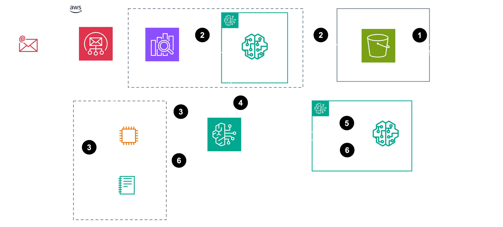

# SCT Resort - GenAI POC

이 프로젝트는 SCT Resort의 VOC(Voice of Customer) 데이터를 분석하고 처리하기 위한 GenAI 솔루션을 제공합니다.

## 프로젝트 구조

프로젝트는 크게 두 부분으로 나뉩니다:
1. JupyterLab 노트북 파일 (.ipynb)
2. Streamlit 애플리케이션 (Python 파일)

### JupyterLab 노트북

JupyterLab 노트북은 Amazon SageMaker JupyterLab 환경에서 실행됩니다. 다음 노트북들이 포함되어 있습니다:

1. `01-voc_summary.ipynb`: 월별 VOC에 대한 각 월별 일일 요약
2. `02-voc-define-department.ipynb`: 입력된 VOC에 대한 담당 부서 확인 (RAG; KB 사용)
3. `03-voc-generate-feedback.ipynb`: 입력된 VOC에 대한 피드백 생성 (RAG; KB 사용)
4. `04-voc-generate-summary.ipynb`: 입력된 VOC에 대한 요약 생성
5. `05-voc-youtube-comment.ipynb`: YouTube 댓글 분석 (YouTube Data v3 API Key 발급 필요)
   
**주의**: 02번과 03번 노트북을 실행하기 위해서는 사전에 Amazon Bedrock KB(Knowledge Base)가 구성되어 있어야 합니다. `kb_id` 값이 필요합니다.

### Streamlit 애플리케이션

Streamlit 애플리케이션은 EC2에서 구동되는 VSCode 환경에서 개발 및 테스트됩니다.

---

## 설치 및 실행

### 필요 패키지 설치

VSCode 환경의 터미널에서 다음 명령을 실행하여 필요한 패키지를 설치하거나 업데이트합니다:

```
cd POC-DEMO
pip install -r requirements.txt -U

```


### Streamlit 애플리케이션 실행

다음 명령을 사용하여 Streamlit 애플리케이션을 실행합니다:

```
streamlit run sct-resort-genai-demo.py --server.port 8501

```


---

## AWS GenAI PoC Architecture



