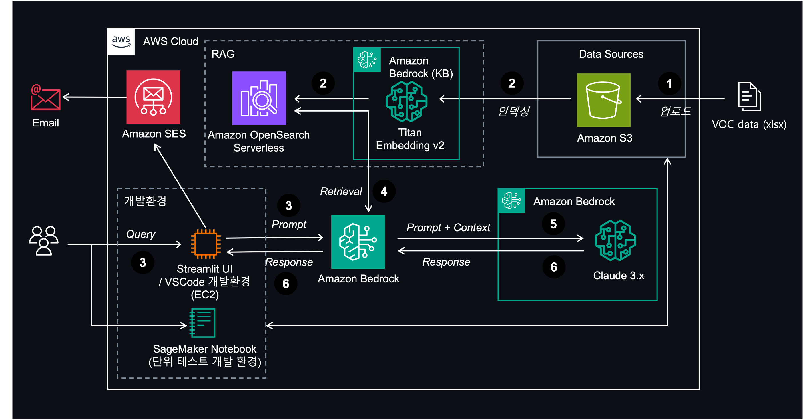

# SCT Resort GenAI with Amazon Bedrock

리조트 VOC(Voice of Customer) 데이터를 Amazon Bedrock의 Generative AI 모델을 활용하여 분석하는 프로젝트입니다.



## 주요 기능

1. VOC 데이터 요약 분석
2. 부서별 VOC 분류
3. VOC 기반 피드백 생성
4. VOC 종합 리포트 생성

## 프로젝트 구조

```
.
├── CloudFormation/          # AWS CloudFormation 템플릿
├── VSCode-on-EC2/          # EC2에서 VSCode 설정 가이드
├── data/                    # 입력 데이터 디렉토리
├── output/                  # 분석 결과 출력 디렉토리
├── POC-1/                  # 1차 POC 구현
├── POC-2/                  # 2차 POC 구현
└── POC-master/             # 최종 POC 구현
```

## Jupyter Notebooks

- `01-voc_summary.ipynb`: VOC 데이터 요약 분석
- `02-voc-define-department.ipynb`: 부서별 VOC 분류
- `03-voc-generate-feedback.ipynb`: VOC 기반 피드백 생성
- `04-voc-generate-summary.ipynb`: VOC 종합 리포트 생성

## 설치 및 실행

1. 필요 패키지 설치:
```bash
pip install -r requirements.txt
```

2. 데이터 준비:
- `data/` 디렉토리에 분석할 VOC 데이터 파일을 위치시킵니다.

3. 분석 실행:
```bash
streamlit run sct-resort-genai-demo.py
```

## 출력 결과

분석 결과는 `output/` 디렉토리에 저장됩니다:
- 일별 VOC 건수 차트 (`daily_voc_count_line_chart.png`)
- VOC 요약 리포트 (`VOC_summary_report.md`)
- 상세 분석 결과 CSV 파일

## EC2에서 개발 환경 설정

EC2 인스턴스에서 VSCode를 설정하고 개발하는 방법은 [VSCode-on-EC2/README.md](VSCode-on-EC2/README.md)를 참조하세요.

## License

이 프로젝트는 MIT 라이선스를 따릅니다. 자세한 내용은 [LICENSE](LICENSE) 파일을 참조하세요.
