# VSCode on EC2

Python 개발 환경 구성을 위한 Visual Studio Code (VSCode) on EC2 개발환경을 만듭니다.

---

### CloudFormation 배포

1. 먼저 다음 CloudFormation 템플릿 파일 (ec2vscode_python.yaml) 을 로컬에 다운로드 받습니다.

- [ec2vscode_python.yaml 다운로드](../CloudFormation/ec2vscode_python.yaml)

2. 서비스 메뉴에서 "CloudFormation"을 선택합니다.

   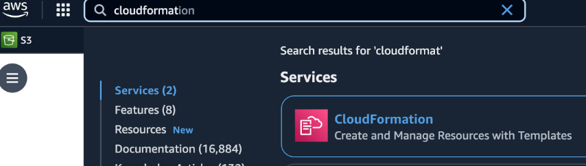
   
   

3. CloudFormation 콘솔에서 스택 생성(Create Stack) 버튼을 클릭 합니다.

   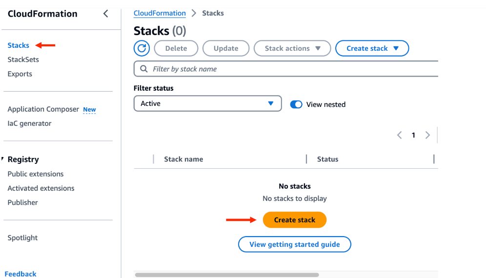

4. 기존 템플릿 사용 (Choose an existing template) 을 선택하고 템플릿 파일 업로드(Upload a template file) 을 선택하고, 다운받은 CloudFormation 템플릿 파일 (ec2vscode_python.yaml) 을 업로드합니다. 그런 다음 다음(Next) 버튼을 클릭합니다.

   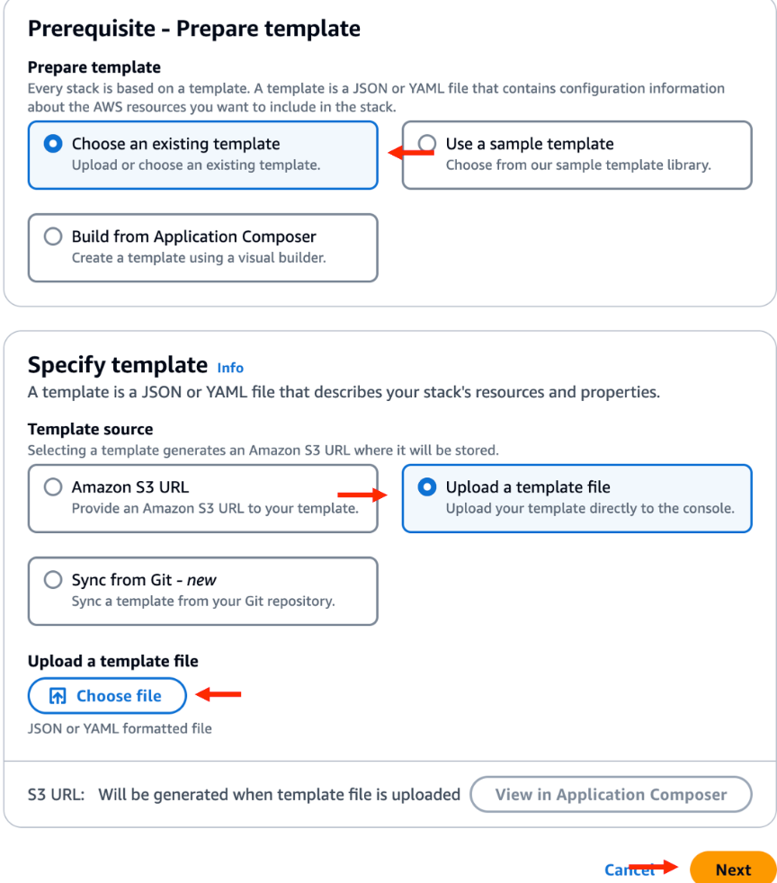

5. 스택 이름(Stack name) 과 파라미터(Parameter) 값을 입력합니다. 스택이름은 vscode-python39 을 입력하며, 파라미터 값은 기본값을 그대로 사용하거나 필요에 따라 수정합니다.

   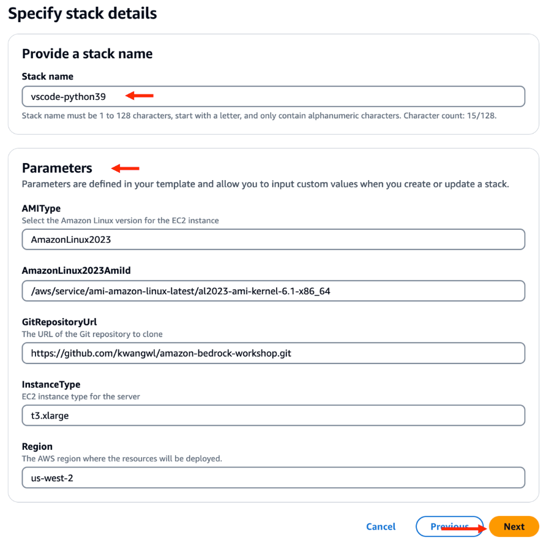

6. 구성 옵션 구성(Configure stack options) 단계에서는 기본값을 사용하고 "다음(Next)" 버튼을 클릭합니다.

   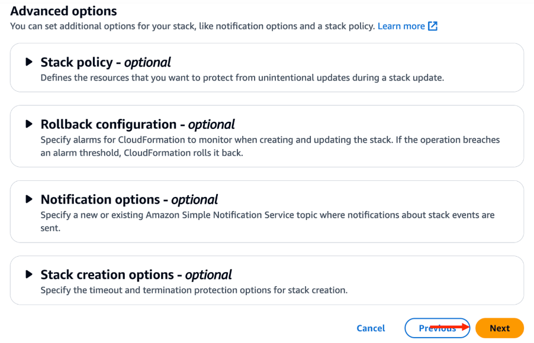

7. 모든 설정을 검토한 후 스택 생성(Create stack) 버튼을 클릭하여 스택 생성을 시작합니다. IAM 설정이 포함되므로, IAM resources 허용 권한 을 체크합니다.

   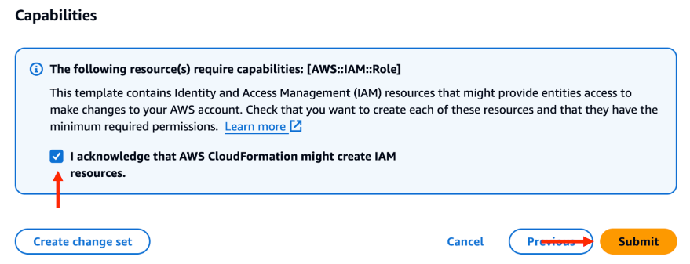

8. 스택 생성이 완료될 때까지 기다립니다. 생성 상태가 CREATE_COMPLETE가 되면, 리소스가 성공적으로 배포된 것입니다.

   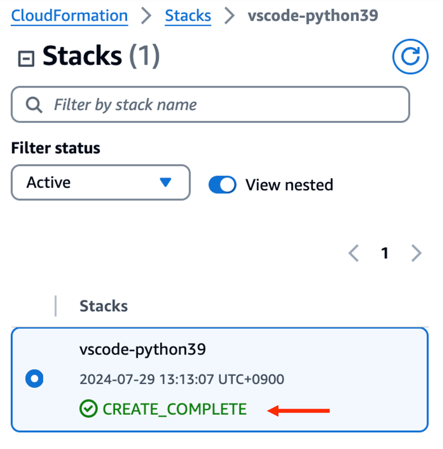

9. Output 탭에서 Value 값인 public IP 주소를 복사하여 브라우저에 입력합니다.

   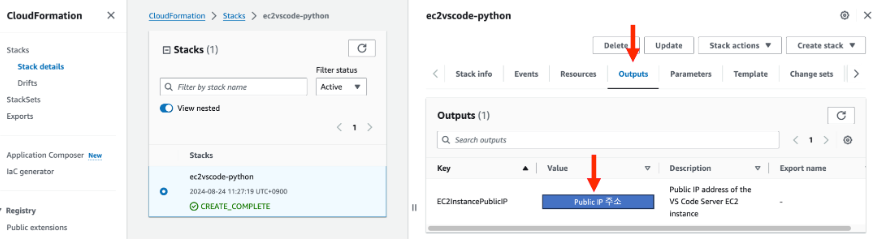

---

### EC2 및 Security Group 설정

> **Important**
> Security Group 이 모두 Deny 상태이므로, 이를 본인 IP 를 허용하도록 추가하는 과정이 필요합니다.

1. AWS 콘솔에서 EC2 서비스를 검색하고 클릭합니다.

   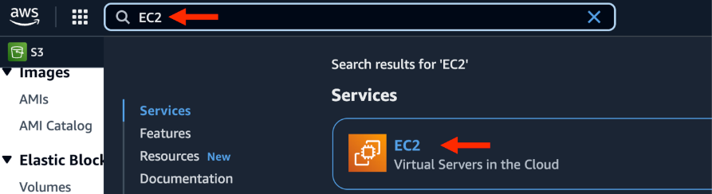

2. 좌측에서 Security Groups 메뉴 선택 후 Security group name 이 MyCustomSecurityGroup 인 row 의 Security group ID 를 클릭합니다.

   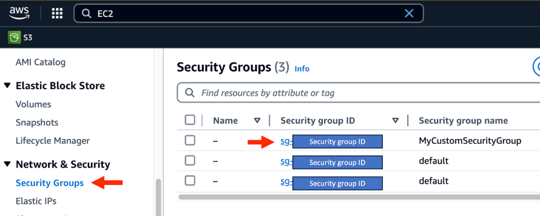

3. Edit inbound Rules 버튼을 클릭합니다.

   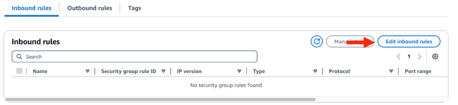

4. Add Rule 버튼 클릭 후 다음과 같이 설정하여 8000 포트 (Vscode) 허용 Rule 을 추가합니다.
   - Type: Custom TCP 선택
   - Port range: 8000 입력 (VSCode)
   - Source: My IP 선택

   > **Important**
   > VsCode 접속시 지속 에러가 발생한다면 Source 를 Anywhere-IPv4 로 변경합니다. 단 반드시 워크샵 종류 후 'My IP' 로 다시 전환합니다. (보안 목적)

   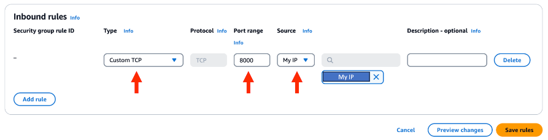

5. 다시한번 Add Rule 버튼 클릭 후 다음과 같이 설정하여 8080 포트 (Streamlit) 허용 Rule 을 추가한 다음 Save Rules 버튼을 클릭합니다.
   - Type: Custom TCP 선택
   - Port range: 8080 입력 (Streamlit)
   - Source: My IP 선택

   > **Important**
   > VsCode 접속시 지속 에러가 발생한다면 Source 를 Anywhere-IPv4 로 변경합니다. 단 반드시 워크샵 종류 후 'My IP' 로 다시 전환합니다. (보안 목적)

   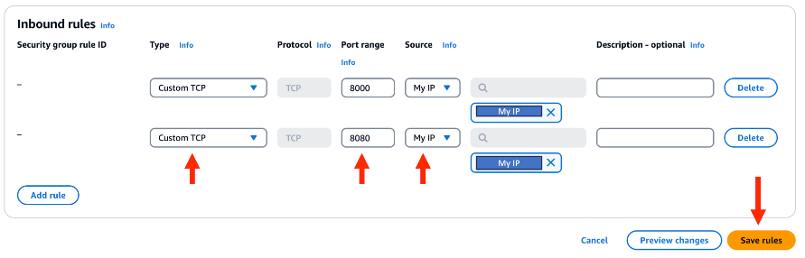

---

### VSCode 접속

* 웹 브라우저에서 " http://xxx.xxx.xxx.xxx:8000 "
  
   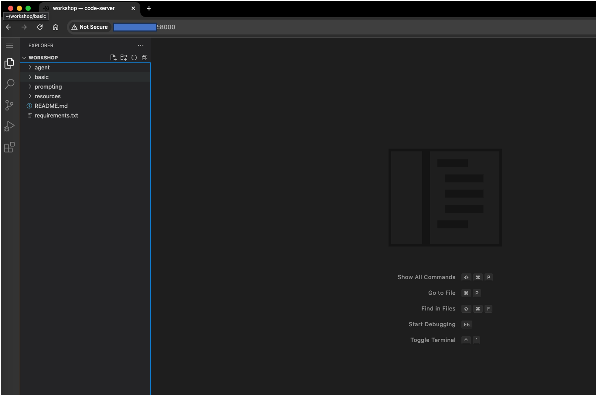

