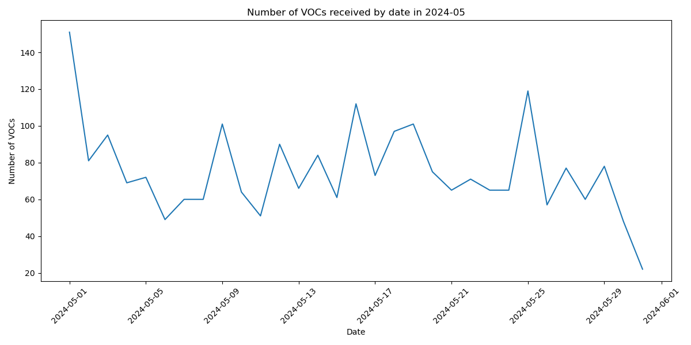

# 2024-05 VOC 일자별 요약 보고서

## 2024년 05월 01일

### VOC 접수 건수: 151

### 주요 VOC 요약:

2024-05-01 #01 요약: 
 1. 레스토랑 방문 및 패밀리세트 주문:
   - 아내가 먹지 못하는 음식재료가 들어가 난처한 상황
   - 가방에 있던 컵라면으로 식사

2. 직원의 대응:
   - 규정상 외부 음식 섭취를 고지
   - 아내가 식사를 못하는 상황을 고려하여 융통성 있게 대응

3. 여행 상황:
   - 아침부터 강행했던 여행
   - 폐장 막바지라 피곤한 상황

4. 감사와 요청:
   - 직원의 배려와 이해로 인해 즐거운 여행 마무리
   - 직원에 대한 적절한 칭찬과 리워드 요청

2024-05-01 #02 요약: 
 1. 4월 26일 아이 학교 현장학습으로 에버랜드를 방문했습니다.
2. 한 우리에 위험한 토끼와 기니피그가 함께 있었습니다.
   - 토끼는 화가 나면 기니피그를 초토화시킬 정도의 힘을 가진 영역동물입니다.
3. 에버랜드와 같은 큰 곳에서 동물 습성을 고려하지 않고 한 곳에 모아두는 것은 문제가 있습니다.
4. 방문객들의 좋은 구경도 중요하지만, 동물들의 안전과 행복도 함께 고려되어야 합니다.
5. 토끼와 기니피그는 따로 두어야 합니다.
6. 이 문제에 대한 개선 여부 확인을 요청합니다.

2024-05-01 #03 요약: 
 - 푸바오 트럼프 카드를 구매하고 싶어함
- 온라인에서 구매할 수 있게 해달라고 요청

2024-05-01 #04 요약: 
 1. 4월 27일 교직원 초청행사 개최
- 작년 한 해 교사들이 힘든 시기를 겪었으나, 학교에서 이런 행사를 마련해준 것에 대한 감사
- 교권 하락 시대에 교사들을 생각해준 것에 대한 고마움
- 일상의 걱정과 힘든 일들을 잊고 즐거운 시간을 보냈음

2. 산리오 포토타임 도움 
- 교육생 ***님이 더운 날씨에도 친절하게 도와주셔서 감사

요약하면, 교직원 초청행사를 통해 교사들이 힘든 시기를 겪었지만 학교에서 이를 배려하고 격려해주었다는 점, 그리고 행사 중 교육생의 친절한 도움이 있었다는 내용입니다.

2024-05-01 #05 요약: 
 다음과 같이 요약해 드립니다:

1. 기술 발전과 디지털 전환 가속화
   - 코로나19 팬데믹으로 인한 비대면 및 온라인 활동 증가
   - 인공지능, 클라우드, 5G 등 핵심 기술의 발전과 보편화

2. 비즈니스 모델 및 운영 방식의 혁신
   - 온라인 플랫폼 활용 확대
   - 자동화, 데이터 분석 등 디지털 기술 도입 증가
   - 유연한 조직 운영과 새로운 업무 방식 도입

3. 고객 경험 및 니즈 변화
   - 비대면 서비스와 맞춤형 경험에 대한 수요 증가
   - 지속가능성, 사회적 가치 등 새로운 고객 요구사항 부상

4. 인재 관리와 조직 문화의 변화
   - 유연한 근무 환경과 업무 방식 도입
   - 디지털 역량 강화 및 새로운 인재 확보 필요

이와 같이 기술 발전과 디지털 전환이 가속화되면서 비즈니스 모델, 고객 경험, 인재 관리 등 다양한 측면에서 혁신이 요구되고 있습니다.

2024-05-01 #06 요약: 
 1. 직원 확인을 거치지 않은 사람들에 대해 입장이 불가능하다고 안내했음.
2. 그런데 이후에는 이들을 그냥 입장시켜주고 있음.
3. 직원 확인 후 스마트 줄서기가 가능하다고 했지만, 실제로는 되지 않고 있음.
4. 운영 방식에 일관성이 부족해 보임.

이용자는 일관성 있는 운영을 요구하고 있으며, 직원 확인 절차와 스마트 줄서기 시스템의 일관된 적용을 요청하고 있습니다.

2024-05-01 #07 요약: 
 1. 에버랜드 오픈시간은 5월 1일 오전 9시 40분이었음.
2. 판다월드에서는 직원들이 10시부터 QR 확인을 하고 있었음.
3. 많은 사람들이 몰려 있었고, 일부 고객들은 QR 확인 방법을 모르고 있었음.
4. 직원들이 사정을 봐주어 QR 확인을 잘못 누른 고객들도 입장이 가능했음.
5. 이렇게 되면 QR 확인을 제대로 한 고객들이 손해를 보게 됨.
6. 빠른 QR 확인 또는 QR 확인을 잘못한 고객들의 이용 제한이 필요해 보임.

2024-05-01 #08 요약: 
 사파리 님의 설명을 요약하면 다음과 같습니다:

1. 공통 내용:
   - 인공지능과 윤리의 중요성
   - 인공지능 기술 발전에 따른 윤리적 문제 대두
   - 인공지능 윤리 강령 및 가이드라인 필요성

2. 하이라이트:
   - 인공지능이 인간의 일자리를 대체할 수 있다는 우려
   - 자율주행차 사고 시 책임 소재 문제
   - 개인정보 침해 및 데이터 악용 문제
   - 인공지능 기술의 편향성 및 차별 문제
   - 인간과 인공지능의 상호작용에 따른 윤리적 고려 필요

3. 결론:
   - 인공지능 기술 발전과 함께 윤리적 기준 마련이 중요
   - 다양한 이해관계자들의 협력과 노력이 필요

2024-05-01 #09 요약: 
 1. 사파리 투어를 여러 번 경험했지만, 이번 투어가 가장 즐거운 시간이었다.
2. 가이드가 동물들의 이름을 자세히 알려주어서 도움이 되었다.
3. 아이가 사파리 투어를 매우 즐거워했다.
4. 가이드가 항상 이렇게 즐겁게 일하면 좋겠다.
5. 다음에 방문할 때 다시 만나고 싶다.

2024-05-01 #10 요약: 
 - 에버랜드 판다월드에 사는 쌍둥이 판다 루이바오와 후이바오
- 태어났을 때의 몸무게가 표지판에 잘못 표기되어 서로 바뀌어 있었음
- 몇 년간 이 정보가 잘못 유지되고 있었음
- 이 부분에 대한 개선이 필요함

2024-05-01 #11 요약: 
 - 에버랜드 판다월드에서 태어난 쌍둥이 판다 루이바오와 후이바오
- 태어났을 때의 몸무게 표지판이 서로 바뀌어 있었음
- 이 문제를 개선해달라는 요청

2024-05-01 #12 요약: 
 1. 아이 생일 기념으로 에버랜드에 방문했음.
2. 가는 길이 멀어 아이가 지쳐 짜증을 내던 중 조류관에 들렸음.
3. 마침 설명해 주시는 시간이었고, 사육사님께서 재미있게 설명해 주시며 퀴즈도 내어 아이들의 참여를 유도해 주셨음.
4. 사육사님이 아이들의 이야기도 잘 들어주셔서 아이가 끝까지 즐겁게 참여할 수 있었음.
5. 막바지 클로징 인사할 때 참여했던 사람들이 그냥 가버려 섭섭했지만, 사육사님께 감사한 마음을 전하고자 글을 남겼음.
6. 아이의 여섯 번째 생일이었는데 덕분에 즐거운 시간을 보냈다고 감사 표현을 함.

2024-05-01 #13 요약: 
 1. 대형앵무새는 매우 재미있다.

2024-05-01 #14 요약: 
 이 텍스트를 요약하면 다음과 같습니다:

- 조직 구조에 대한 문제 제기
- 상위 관리자 1명이 하위 요원 4명과 바디 1명을 통제하고 있어 운영이 잘되지 않음
- 하단에 2명을 추가로 배치하는 것이 더 효율적일 것으로 제안

핵심 내용은 조직 구조의 문제점과 개선 방안에 대한 제안입니다. 상위 관리자 1명이 다수의 부하를 직접 통제하는 것이 효과적이지 않다는 점과, 하단에 추가 인력을 배치하는 것이 더 나은 대안이라는 점이 강조되고 있습니다.

2024-05-01 #15 요약: 
 - ***와 함께한 사파리 투어가 매우 쾌적하고 즐거웠다.
- *** 직원들이 어른들에게 반갑게 인사해주어 좋은 인상을 남겼다.

2024-05-01 #16 요약: 
 이 텍스트는 사파리 경험에 대한 긍정적인 감정을 표현하고 있습니다. 주요 내용은 다음과 같이 요약할 수 있습니다:

- 사파리 경험에 대한 긍정적 평가: "칭찬합니다", "재밌었어요!!!"
- 전반적으로 사파리 경험이 즐거웠음을 나타냄

2024-05-01 #17 요약: 
 1. 판월 푸바오의 몸무게 정보가 잘못 표기되어 있음
   - 태어날 때 몸무게와 현재 몸무게가 바뀌어 표기되어 있음
   - 검수 후 다시 만들어야 할 것 같음

2. 아기 판다의 디데이 정보 오류
   - 예전부터 에버 계산식으로 표기되어 왔으나, 오늘이 300일로 표기되어 있음
   - 단순한 오류인지 표기법 변경인지 확인이 필요함

3. 에버 계산식과 변경된 계산식에 대한 혼란
   - 에버 계산식은 태어나자마자 1일로 표기되었으나, 변경된 계산식은 태어나고 다음날부터 1일로 표기됨
   - 앞으로 어떻게 계산할지 혼란스러움

2024-05-01 #18 요약: 
 이 텍스트를 요약하면 다음과 같습니다:

- 사육사 체험이 재미있고 유익한 시간이 되었다는 내용입니다.

요약의 핵심 내용은 사육사 체험이 즐겁고 도움이 되었다는 것입니다. 텍스트가 짧고 간단하므로 특별히 공통적인 내용을 묶거나 하이라이트할 부분은 없습니다. 전체 내용을 간단히 요약했습니다.

2024-05-01 #19 요약: 
 1. 알버트 스페이스 센터 방문 및 즐거운 경험
- 선생님께서 알버트 스페이스 센터를 방문하셨음
- 해당 방문이 즐겁고 좋은 경험이었음

2. 감사 표현
- 선생님께서 해당 방문에 대해 감사한 마음을 표현하셨음

2024-05-01 #20 요약: 
 - 11시 반 알버트 스페이스에서 애니멀톡 진행
- 신입 캐스트이지만 원활하고 노련한 진행으로 즐거운 시간 보냄

2024-05-01 #21 요약: 
 이 텍스트는 판매 직원의 부적절한 응대에 대한 불만을 표현하고 있습니다. 주요 내용은 다음과 같이 요약할 수 있습니다:

1. 판매 직원이 할인 정보를 알려주지 않음
2. 계산 오류에 대한 사과가 없음
3. 불친절한 태도와 표정
4. 일하기 싫어하는 태도

전반적으로 판매 직원의 무성의하고 불친절한 응대에 대한 불만이 드러나고 있습니다. 고객 서비스 개선이 필요한 것으로 보입니다.

2024-05-01 #22 요약: 
 1. 버거카페에서 키오스크로 맥주를 주문했는데,
2. 픽업 대에 맥주를 그냥 두고 
3. 나이 확인도 하지 않고 
4. 누가 가져가는지도 확인하지 않았다.
5. 미성년자가 주문해도 이렇게 그냥 주는 것이 맞는지 의문이 든다.

핵심 내용은 버거카페에서 미성년자로 보이는 사람이 맥주를 주문했는데, 직원들이 나이 확인 없이 그냥 주문한 맥주를 내놓아 문제가 된다는 것입니다.

2024-05-01 #23 요약: 
 이 텍스트는 에버랜드 관계자에게 보내는 팬레터로 다음과 같이 요약할 수 있습니다:

1. 루이바오와 후이바오의 출생 시 몸무게가 잘못 기재되어 있음을 지적했습니다. 루이바오는 180g, 후이바오는 140g이었던 것으로 확인됩니다.

2. "오늘의 몸무게"를 나타내는 중국어 표현이 잘못 기재되어 있음을 지적했습니다. 정확한 표현은 "今日?重"입니다.

3. 몸무게 정보가 중요하므로 다시 만들어달라고 요청했습니다.

4. 개인적으로는 푸바오의 몸무게판이 바오하우스로 옮겨지기를 바란다고 언급했습니다.

5. 이 정보가 없어진 것에 대해 속상한 마음을 표현했습니다.

6. 회신을 기다리며 에버랜드 관계자에게 감사인사와 함께 좋은 하루를 보내기를 기원했습니다.

2024-05-01 #24 요약: 
 - 에버랜드 직원들이 전반적으로 친절하다.
- 특히 ***님 교육생이라고 표시된 직원들이 적극적으로 안내해주고 친절했다.
- 이에 대해 감사의 마음을 표현했다.

2024-05-01 #25 요약: 
 - 로스트밸리 인리치먼트 투어를 강력 추천함
- 아이와 어른 모두에게 유익하고 좋은 경험이었음
- 선진국형 교육 수준의 투어였음
- 담당 사육사님의 서비스가 최고였음

2024-05-01 #26 요약: 
 - 판다 아카데미에서 진행된 행사
- 10시 20분에 진행
- 아이와 함께 즐겁고 유익한 시간을 보냈음
- 바오티쳐님들의 도움으로 좋은 경험을 할 수 있었음
- 바오티쳐님들께 감사의 말씀을 전함

2024-05-01 #27 요약: 
 - 교육생 뱃지를 착용한 여성의 밝은 에너지가 좋았음
- 그 여성의 긍정적인 에너지 덕분에 하루를 기분 좋게 시작할 수 있었음

2024-05-01 #28 요약: 
 - 직원들의 친절한 태도와 외모가 좋았음
- 이러한 좋은 경험으로 인해 재방문할 의사가 있음

2024-05-01 #29 요약: 
 - 스카이웨이기프트에서 일하는 직원이 친절하게 길 안내를 해주었음
- 직원이 손인사도 잘해주어 좋은 인상을 남겼음
- 고객은 직원의 친절한 서비스에 대해 감사한 마음을 표현함

2024-05-01 #30 요약: 
 제공된 텍스트가 너무 짧고 내용이 명확하지 않아 요약하기 어렵습니다. 텍스트에는 "로스트 벨리에"와 "캡틴!!!!짱~"이라는 내용만 포함되어 있습니다. 이 두 문장만으로는 공통적인 내용을 파악하기 어렵습니다. 좀 더 자세한 맥락이나 내용이 필요합니다. 요약을 위해서는 텍스트의 전체적인 내용과 맥락을 이해할 수 있도록 추가 정보가 필요합니다.

2024-05-01 #31 요약: 
 1. 가족들(조카, 엄마, 언니)이 오랜만에 여행을 다녀왔다.
2. 어린 조카들이 힘들어했지만, *** 캐스터님이 유쾌하게 분위기를 이끌어주며 동물을 소개해주어 즐거운 시간을 보냈다.
3. 이번 여행을 통해 좋은 추억을 얻고 왔다.

2024-05-01 #32 요약: 
 이 텍스트는 명확한 내용이 없어 요약하기 어려운 것 같습니다. 다음과 같이 간단히 요약할 수 있습니다:

- 사파리월트드 근무자의 이름이 생각나지 않음
- 한국타이어 및 박보곰(?)에 대한 긍정적인 평가

2024-05-01 #33 요약: 
 1. 부산 국회부산도서관이 2024년 5월~11월 중 지식문화프로그램 초청강연을 계획하고 있습니다.
2. 이번 강연에는 판다월드의 *** 사육사님을 모시고자 합니다.
3. 강연은 2시간 동안 진행될 예정이며, 자세한 사항은 *** (*** 대표)에게 문의하면 됩니다.
4. *** 사육사님은 바오가족들을 정성껏 케어하는 모습과 방송에서 보여준 사육사로서의 마음가짐과 철학에 대해 강의해 주실 것으로 기대됩니다.
5. 국회부산도서관은 많은 분들이 이번 강연을 통해 위로와 공감을 얻기를 바라고 있습니다.

2024-05-01 #34 요약: 
 - 오랜만에 아이들과 즐거운 시간을 보냈음
- 많이 웃었음
- 로스트밸리의 ***님과 ***님께 감사함

2024-05-01 #35 요약: 
 주요 내용 

1. 안내자 ***님이 열정적으로 안내해주셨습니다.
2. 안내 과정에서 즐거운 시간을 보냈습니다.
3. 안내자 ***님에게 감사의 마음을 표현하였습니다.

2024-05-01 #36 요약: 
 1. 유머러스한 멘트와 친절한 설명
   - 대응에 감사드립니다.

2. 공통적인 내용
   - 유머러스한 태도와 친절한 설명을 제공하는 것이 중요합니다.
   - 사용자의 피드백과 감사 표현에 대해 고마워하는 태도가 필요합니다.

2024-05-01 #37 요약: 
 이 텍스트는 Lost Valley에서 제공되는 사육사의 친절하고 멋진 안내에 대해 감사하는 내용입니다. 주요 내용은 다음과 같이 요약할 수 있습니다:

1. 사육사의 친절하고 멋진 안내에 대한 감사
2. Lost Valley에서 제공되는 서비스에 대한 긍정적인 평가

2024-05-01 #38 요약: 
 1. 사파리 투어 버스 경험이 좋았음:
   - 버스 기사들이 매우 친절했음
   - 투어가 재미있었음

2024-05-01 #39 요약: 
 해당 텍스트는 매우 간단하여 별도의 요약이 필요하지 않습니다. 전체 내용은 다음과 같습니다:

"공연과 마지막 메시지까지 유익한 프로그램이었습니다. 최고~~~"

이 텍스트는 긍정적인 감상평으로, 프로그램이 전반적으로 유익했고 매우 좋았다는 의미를 전달하고 있습니다.

2024-05-01 #40 요약: 
 - 기린아카데미 ***담당자님께서 설명을 잘해주시고 친절하셔서 투어를 잘 마무리할 수 있었음
- 에버랜드 직원분들 모두 열정적이고 긍정적인 모습을 보여주셨음

2024-05-01 #41 요약: 
 1. 라이브 나비테험관의 사육사들과 직원들이 친절하고 즐겁게 일하고 있다.
2. 이로 인해 방문객들도 신나고 즐겁게 시간을 보내고 있다.

2024-05-01 #42 요약: 
 1. 오랜만에 탑승했지만 재미있었음
2. 입장 전 안내 방송과 TV 상태에 대한 불만
   - LED 번짐 등 보기 안좋은 상태
   - 삼성물산 등 관련 기업에 대한 언급

2024-05-01 #43 요약: 
 1. E/L 정문주차장이 만차일 경우, 정문까지 도달하여 만차를 확인하게 되어 다시 되돌아 나와야 하는 번거로움이 있었음.
2. 다시 되돌아 오는 데에 약 30~40분 정도 소요되어 불편이 발생했음.
3. 이에 대해 주차장으로 유도하는 동선에 만차 공지를 해줄 것을 건의 요청함.

2024-05-01 #44 요약: 
 - 캐리비안베이 야외 풀장에서 친절한 길안내 서비스를 받음
- 카바나까지 직접 안내해 주어 감사했음
- 친절한 안내 덕분에 잘 즐길 수 있었음

2024-05-01 #45 요약: 
 1. 서영철 사육사와 그의 파트너 사육사가 동물들과 아름답게 교감하고 있습니다.
2. 이를 통해 동물과 사육사 모두 힐링을 받고 있습니다.

2024-05-01 #46 요약: 
 이 텍스트는 반려동물과의 의사소통 방법에 대해 다루고 있습니다. 주요 내용은 다음과 같이 요약할 수 있습니다:

1. 반려동물과의 효과적인 의사소통
   - 반려동물과 눈 맞춤, 부드러운 말투, 긍정적인 태도 등으로 소통
   - 반려동물의 행동과 표정을 관찰하여 이해하려 노력

2. 반려동물 언어 이해하기
   - 반려동물의 몸짓, 소리, 행동 등을 통해 의사를 파악
   - 반려동물의 감정 상태를 읽어내고 이에 맞게 대응

3. 반려동물과의 유대감 형성
   - 일상적인 대화와 애정 표현으로 반려동물과의 유대감 강화
   - 놀이, 간식 제공 등을 통해 반려동물과 긍정적인 경험 공유

4. 반려동물 의사소통의 중요성
   - 반려동물과의 원활한 소통은 상호 이해와 신뢰 관계 형성에 도움
   - 반려동물의 행복과 건강한 삶을 위해 효과적인 의사소통이 필요

이와 같이 반려동물과의 의사소통 방법, 반려동물 언어 이해, 유대감 형성, 그리고 의사소통의 중요성 등이 핵심 내용으로 요약됩니다.

2024-05-01 #47 요약: 
 고객님의 요청하신 텍스트를 요약하면 다음과 같습니다:

- 고객은 직원의 친절한 설명에 만족했으며, 다음에 또 방문하고 싶다고 언급했습니다.

이와 같이 고객의 긍정적인 경험과 재방문 의사를 중심으로 간단히 요약했습니다.

2024-05-01 #48 요약: 
 1. 에버랜드를 오랜만에 방문했으며, 지인들과 즐거운 시간을 보내고자 방문했다.
2. 오후에 차이나문 앞 기프트샵에서 결제를 기다리고 있었는데, 앞에 있던 어린이가 물건을 사는 것을 목격했다.
3. 직원이 어린이의 눈높이에 맞추어 친절하게 대응하는 모습을 보고, 사소한 일에서도 에버랜드의 친절한 서비스를 느낄 수 있었다.
4. 그 직원의 친절한 서비스가 가장 인상 깊었으며, 그 직원이 칭찬받기를 바란다.

2024-05-01 #49 요약: 
 1. 아이스쿨 매장에서 친절한 응대와 학생들의 부탁을 잘 들어주셨다.
2. 친절한 서비스에 대해 감사의 마음을 표현했다.

2024-05-01 #50 요약: 
 이 텍스트는 선생님에 대한 감사의 말을 전하는 내용입니다. 핵심적인 내용을 요약하면 다음과 같습니다:

- 선생님이 좋은 시간을 만들어주셔서 감사하다는 것
- 선생님의 노력과 배려에 대한 감사

이를 통해 선생님의 도움과 배려에 대해 감사하는 마음을 잘 표현하고 있습니다.

2024-05-01 #51 요약: 
 - 물개쇼 앞 아이스크림 가게 직원이 친절했음
- 고객이 적립 제도를 처음 알게 되었는데, 직원이 잘 알려줌
- 직원의 이름을 정확히 기억하지 못함

2024-05-01 #52 요약: 
 이 텍스트는 매우 간단한 긍정적인 피드백 메시지입니다. 주요 내용은 다음과 같이 요약할 수 있습니다:

- ***님의 목소리가 시크하고 유쾌했다는 평가
- 진행을 잘했다는 긍정적인 피드백

이 메시지는 짧고 간단하지만, ***님의 수행에 대한 긍정적인 평가를 잘 전달하고 있습니다.

2024-05-01 #53 요약: 
 1. 음식점에서의 좌석 활용 문제
- 의자나 테이블 등 좌석 공간이 효율적으로 활용되지 않음
- 외부 음식 반입에 대한 관리가 잘되지 않음
- 어른과 아이 구분 없이 모두가 같은 좌석을 사용함

2. 전반적인 좌석 관리 및 활용의 개선 필요
- 좌석 배치와 활용에 대한 체계적인 관리가 필요
- 외부 음식 반입에 대한 규정 마련 및 시행이 요구됨
- 고객 연령별 좌석 구분 등 세부적인 관리가 필요함

2024-05-01 #54 요약: 
 다음과 같이 텍스트를 요약하였습니다:

- 사육사의 친절한 설명에 감사함
- 동물 행동과 특성에 대한 설명 제공
- 동물 관리 및 관찰에 대한 정보 공유
- 관람객들의 궁금증 해소와 동물 이해도 증진

2024-05-01 #55 요약: 
 이 텍스트는 판다에 대한 내용을 다루고 있습니다. 주요 내용은 다음과 같이 요약할 수 있습니다:

1. 판다가 곰인지 여부에 대한 질문
2. 5월 1일 2시에 있었던 타임사육사들의 친절하고 유쾌한 설명에 대한 감사 표현

전체적으로 판다의 동물학적 분류와 타임사육사들의 설명에 대한 긍정적인 반응이 핵심 내용입니다.

2024-05-01 #56 요약: 
 1. 사파리월드 모유수유실에서 줄서기를 안내하던 여직원의 헌신적인 업무 태도를 칭찬하고자 함.
2. 여직원은 날씨가 더운 상황에서도 모유수유실 입구에서 줄서기 안내를 하며, 가족 구성원 수를 확인하여 공정하게 지도하였음.
3. 한 고객의 불만으로 고객센터에 연락하려 하자, 기운 빠진 목소리로도 업무를 이어나가는 모습이 인상 깊었음.
4. 이러한 헌신적인 자세로 업무를 수행하는 직원에 대한 칭찬의 방법이 없어 안타까워했음.

2024-05-01 #57 요약: 
 1. 로스트밸리의 앤 탐험대장님에 대한 칭찬
- 활기차고 유머러스한 분위기로 동물 관람이 즐거웠음

2. 2시간 가량 기다렸지만 기다린 시간이 아깝지 않았음

3. 다시 만나고 싶다는 의견

2024-05-01 #58 요약: 
 - 기린아카데미에서 진행된 2시 *** *** 사육사님의 설명이 매우 상세하고 아이에게 맞춰서 진행되어 만족스러웠음
- 전반적으로 매우 재미있는 시간이었고, 다음에 또 방문하고 싶다는 의견 제시

2024-05-01 #59 요약: 
 1. 해당 글은 당근마켓에서 확인할 수 있습니다.
2. 해당 사용자는 티켓을 지속적으로 재판매하고 있는 것으로 보입니다.
3. 해당 사용자는 폐쇄몰 같은 곳에서 구입한 것으로 보이며, 이를 당근마켓에서 재판매하고 있습니다.
4. 이렇게 재판매하는 것이 문제가 없는지 문의하고 있습니다.

핵심 내용: 
- 당근마켓에서 티켓을 지속적으로 재판매하고 있음
- 폐쇄몰 등에서 구입해 재판매하고 있음
- 이러한 재판매가 문제가 없는지 문의

2024-05-01 #60 요약: 
 이 텍스트는 앵무새 사육사에 대한 내용을 다루고 있습니다. 주요 내용은 다음과 같이 요약할 수 있습니다:

1. 앵무새 사육의 어려움:
   - 앵무새는 매우 지적이고 활동적인 동물로, 사육이 매우 까다롭다.
   - 앵무새는 엄청난 관심과 활동을 필요로 하며, 사육사는 끊임없는 노력과 헌신이 필요하다.

2. 사육사의 역할:
   - 사육사는 앵무새의 성격, 습성, 영양 요구사항 등을 잘 이해하고 있어야 한다.
   - 사육사는 앵무새와 긍정적인 관계를 형성하고, 앵무새의 건강과 행복을 최우선으로 해야 한다.

3. 보상과 도전:
   - 앵무새 사육은 많은 노력이 필요하지만, 앵무새와의 깊은 유대감을 느낄 수 있다.
   - 앵무새의 성장과 행복을 보는 것은 사육사에게 큰 보상이 된다.

전반적으로 이 텍스트는 앵무새 사육의 어려움과 도전, 사육사의 역할과 보상에 대해 설명하고 있습니다.

2024-05-01 #61 요약: 
 이 텍스트는 다양한 행사에 대한 긍정적인 평가를 담고 있습니다. 주요 내용은 다음과 같이 요약할 수 있습니다:

1. 바다사자 공연에 대한 긍정적인 평가
2. 판타스틱 공연에 대한 긍정적인 평가
3. 패럿 공연에 대한 긍정적인 평가
4. 현재 진행 중인 행사가 최고라는 평가

이처럼 다양한 공연에 대한 긍정적인 반응과 함께 현재 행사에 대한 가장 높은 평가가 드러나고 있습니다.

2024-05-01 #62 요약: 
 1. 어린아이가 화장실을 급하게 요청했으나 찾지 못하던 중
2. *** 직원이 도움을 주어 화장실까지 안내해주었고
3. 다시 동행인이 있는 곳까지 편하게 도와주어 다녀올 수 있었다.
4. 이에 대해 깊은 감사를 표했다.

2024-05-01 #63 요약: 
 1. 에버랜드 직원들의 친절한 서비스
- 로스트벨리 관람 후 상품점에서 상세한 안내와 주변 어트랙션 추천을 해주어 감동을 받음
- 직원들의 친절한 태도에 대해 매우 감사함

2. 전반적으로 에버랜드 직원들의 우수한 고객 서비스
- 다양한 방식으로 고객을 세심하게 배려하고 안내해주어 긍정적인 경험을 제공함

2024-05-01 #64 요약: 
 - 한가람 식당에서 솜포인트 적립 문제로 어려움을 겪고 있었음
- 직원이 친절하게 안내해주어 감사했음
- 직원에게 응원의 말을 전함

2024-05-01 #65 요약: 
 - 자동차왕국 *** 근무자님 덕분에 매번 안전하고 즐겁게 이용하고 있다.
- 근무자님에 대한 무한대로 칭찬이 듬뿍이다.

2024-05-01 #66 요약: 
 1. 사진 촬영 시 직원의 도움으로 편안한 분위기 조성
2. 결제 어플 사용 시 어려움이 있었지만, 직원이 독려해 주어 감사하고 즐거웠음
3. 직원의 친절한 태도와 노력으로 전반적인 만족도가 높았음

2024-05-01 #67 요약: 
 - 2022년 4월 29일~30일, E/L 자녀분이 바오하우스 이용 중 직원이 자녀분에게 "너는 몇 살이냐, 공부하기 어렵겠다"라고 2차례 질문함
- 당시에는 넘겼지만, 퇴장 도중 다시 마주쳐 직원을 째려봤음
- 자녀분이 집에 와서 매우 울고 속상해했음
- 손님은 이런 일이 다시 발생하지 않도록 직원 교육을 요청함
- 담당부서에 전달하고 양해를 구함

2024-05-01 #68 요약: 
 - 카피바라 동생의 컨디션이 좋지 않았음
- 가족들이 동생을 달래고 즐거운 시간을 만들어 주었음
- 오늘 꼭 퇴근시간에 맞추어 퇴근할 것을 강조하고 있음

2024-05-01 #69 요약: 
 1. 패럿 하우스 근무자 사육사님의 도움과 배려에 대한 감사 표현
2. 애니멀 톡 공연에서 태양이 선택을 받지 못해 퇴장하며 울고 있는 상황을 목격
3. 사육사님이 패럿 하우스에서 사랑이를 보여주며 설명해주어 아이에게 좋은 추억이 되었다는 내용
4. 사육사님이 지나칠 수 있는 상황이었지만 먼저 말씀해주어 감사했다는 점

2024-05-01 #70 요약: 
 이 리뷰에서 주요 내용은 다음과 같습니다:

1. 근무자의 친절한 태도: 근무자가 친절하게 대응했다는 점이 강조되었습니다.

2. 설명의 유익성: 근무자의 설명이 재미있고 유익했다는 점이 언급되었습니다.

요약하면, 이 리뷰에서는 근무자의 친절한 태도와 유익한 설명이 긍정적으로 평가되었습니다.

2024-05-01 #71 요약: 
 1. 로스트밸리 탐험을 통해 즐거운 경험을 했습니다.
2. 탐험가님의 도움으로 즐거운 여행이 가능했습니다.

2024-05-01 #72 요약: 
 - 로스트벨리 근무자님의 재미있는 설명 덕분에 더욱 즐겁게 타고 왔다고 감사 표현
- 근무자의 설명이 즐겁고 흥미로웠다는 긍정적 피드백

2024-05-01 #73 요약: 
 1. 정기권 손님이 자녀들과 이솝빌리지를 방문하여 어트랙션 탑승을 위해 대기 중 스마트폰으로 예약을 하고 있었다.

2. 눈앞에 있는 플레이야드 놀이터가 12시에 오픈하는 것을 확인했는데, 이 시간은 식사 시간이어서 이용이 어렵다고 했다.

3. 12시 오픈 시간이 이해되지 않으며, 유연한 운영 시간 설정을 제안했다.

핵심 내용은 이솝빌리지 내 어트랙션 이용과 플레이야드 놀이터 오픈 시간의 문제점, 그리고 이에 대한 제안이다.

2024-05-01 #74 요약: 
 1. 사파리월드에서 4인 가족이 입장하려고 했으나, 혼자 줄을 서있어서 입장이 불가능했다고 함.
2. 근무자가 구두로 안내했고, 중간 합류 불가 지역이 아님에도 불구하고 입장을 제지했다고 함.
3. 이는 손님을 불편하게 하는 행동이라고 지적했으며, 해당 근무자가 맞는지 확인하고 매니저에게 연락을 요청했다고 함.

2024-05-01 #75 요약: 
 1. 방문설문 참여 후 룰렛페이지 접속 문제:
   - 매번 오류가 발생하여 링크를 다시 접속해야 함
   - 오늘은 아예 열리지 않고 이미 응답한 설문이라고 표시됨

2. 앱에 로그인된 상태로 참여했음
   - 빠른 확인이 필요함

2024-05-01 #76 요약: 
 간단한 요약은 다음과 같습니다:

- 갑작스러운 부탁에도 친절하게 감사한다.
- 상대방에 대한 배려와 존중의 태도를 보여준다.

2024-05-01 #77 요약: 
 1. 레니의 컬러풀드림 사전초대에 당첨되어 감사하였음.
2. 5월 1일과 5월 2일 둘 다 당첨되었지만, 5가족이 함께 입장할 수 없어 아쉬워하였음.
3. 직원에게 문의하여 5월 1일에 함께 입장할 수 있도록 배려해주셨음.
4. 너무 신나서 성함을 확인하지 못하고, 감사인사도 제대로 하지 못했지만, 이 자리를 빌려 감사인사를 드림.
5. 가족 모두가 즐거운 추억을 만들 수 있도록 배려해주셔서 다시 한번 감사드림.
6. 공연이 너무 재미있어서 시간이 순식간에 지나갔음.

2024-05-01 #78 요약: 
 1. 폭우 속에서도 가족들과 즐거운 시간을 보냈음
2. *** 선생님이 날씨가 좋지 않음에도 불구하고 세심하게 여행 일정을 잘 관리해주었음
3. 선생님의 친절하고 재미있는 태도, 최선을 다하는 모습에 깊은 신뢰를 느낌
4. 힘든 날씨 속에서도 최선을 다해준 선생님의 노고에 감사함
5. 선생님의 멸사봉공(사를 버리고 공을 위해 희생함)에 대한 칭찬

2024-05-01 #79 요약: 
 1. 날씨가 좋지 않았지만, 즐거운 투어였다.
2. 투어 가이드의 도움으로 재미있고 즐거운 투어가 되었다.
3. 이번 투어는 부부에게 잊지 못할 경험이었으며, 행복한 시간이었다.
4. 다음에도 또 이용하고 싶다는 기대감을 표현했다.
5. 감사의 인사를 전했다.

2024-05-01 #80 요약: 
 - 오늘 날씨가 좋지 않아 힘든 날이었음을 언급
- 상대방의 노고에 대한 감사 표현

2024-05-01 #81 요약: 
 - 조사가 완료되었음
- 안내해주셔서 감사
- 좋은 추억으로 남을 것 같음

2024-05-01 #82 요약: 
 1. 에버랜드에 새로 설치된 루이바오와 후이바오의 몸무게 전광판에 대한 반가운 소식
2. 기존에 있던 판다월드 내의 푸바오 관련 물품(몸무게 전광판, 사진, 현수막, 배너 등)을 한곳에 모아 전시해달라는 요청
3. 푸바오 관련 물품이 사라지면 아쉬울 것 같다는 의견
4. 중국과의 문제가 아니라면 에버랜드를 방문할 때마다 푸바오를 떠올릴 수 있도록 해달라는 제안

2024-05-01 #83 요약: 
 1. 가이드님의 도움으로 편하고 즐거운 여행을 할 수 있었음
2. 아이들을 잘 돌봐주시고 장난도 잘 받아주셔서 감사했음
3. 유치원 소풍 겸 에버랜드 방문 계획이 순조롭게 진행되었음
4. 다음에 기회가 되면 아이들이 더 크게 성장한 후 다시 드림투어를 해보고 싶음
5. 내년에 유치원 소풍 겸 드림투어를 다시 계획해볼 예정임

2024-05-01 #84 요약: 
 이 메시지는 사진 촬영에 대한 감사 표현입니다. 주요 내용은 다음과 같이 요약할 수 있습니다:

- ***님이 예쁘게 사진을 찍어주셔서 감사합니다.

2024-05-01 #85 요약: 
 1. 에버랜드 판다월드 바오패밀리를 오랫동안 좋아해왔음
2. 사육사들과 바오패밀리의 관계성에 큰 인상을 받았음
3. 최근 사육사들에 대한 악플이 많이 올라오고 있음
   - 디시인사이드 등의 온라인 커뮤니티에서 사육사들을 조롱하고 가족까지 악플하는 경우가 많음
4. 이로 인해 바오가족 덕질에 대한 피로도가 올라가고 팬들이 떠나가고 있음
5. 이 상황이 안타까워 개선을 요청하는 글을 올림

2024-05-01 #86 요약: 
 이 텍스트는 드림투어 가이드에 대한 감사의 말을 전하는 내용입니다. 주요 내용은 다음과 같이 요약할 수 있습니다:

1. 가이드의 친절하고 세심한 안내에 대한 감사 표현
- 처음부터 마지막까지 일행 모두를 잘 챙겨주고 진심으로 배려해주었음
- 사진 촬영 등 세심한 배려를 해주었음

2. 전문적이고 친절한 안내에 대한 만족
- 가이드의 전문적이고 친절한 안내로 즐겁게 시간을 보낼 수 있었음
- 아이와 어른 모두에게 친절하게 배려해주었음

3. 다음에도 가이드님을 만나고 싶다는 기대 표현
- 다음에 또 드림투어를 신청하면 가이드님께 안내받고 싶다고 함
- 항상 건강하기를 기도하겠다고 함

전반적으로 가이드의 친절하고 세심한 서비스에 대한 감사와 만족을 표현하고 있습니다.

2024-05-01 #87 요약: 
 - 이에게 즐거운 시간을 만들어 주셔서 감사드립니다.
- 이가 선생님을 너무 좋아한다고 말하고 있습니다.
- 이의 에버랜드 첫 방문 경험을 함께 나누어주셔서 감사합니다.
- 좋은 하루 보내시기 바랍니다.

2024-05-01 #88 요약: 
 - 고생 많으셨다는 긍정적인 표현
- 즐거웠다는 긍정적인 감정 표현

2024-05-01 #89 요약: 
 - 포토서비스에 대한 만족도가 높음
- 친절한 서비스와 열정적인 태도에 감사함
- 직원들의 밝고 긍정적인 태도에 대한 만족

2024-05-01 #90 요약: 
 이 메시지의 핵심 내용은 다음과 같이 요약할 수 있습니다:

1. 직원이 다리 아파서 힘들었음
2. 미소천사라고 불리는 누군가가 도와줌
3. 그 사람이 사진을 찍어줘서 기분이 좋아짐
4. 직원이 화이팅하고 있음

2024-05-01 #91 요약: 
 이 텍스트는 나들이 경험에 대한 긍정적인 후기입니다. 주요 내용은 다음과 같이 요약할 수 있습니다:

1. 나들이 전 긴장되었지만, 좋은 가이드를 만나 편안하게 진행할 수 있었다.
2. 가이드가 초행길에도 잘 이끌어 주었고, 개구쟁이 아이의 말도 잘 받아주었다.
3. 가이드가 궁금한 점을 꼼꼼히 챙겨주어 감동이었다.
4. 가이드가 예쁜 사진을 선물해줘서 가족 나들이가 행복한 추억이 되었다.
5. 가이드 덕분에 만족스러운 여행이었고, 다음에도 이용하고 싶다.

2024-05-01 #92 요약: 
 - 어제 즐거운 시간을 보냈음
- 아이가 가이드 선생님을 매우 좋아했다고 함

2024-05-01 #93 요약: 
 1. 가족사진을 친절하고 예쁘게 찍어주셔서 추억이 늘었다.
2. 웃음이 가득한 에버랜드를 좋아한다.

2024-05-01 #94 요약: 
 1. 드림투어 만족도가 매우 높았음
   - 가이드의 친절한 케어로 아이와 함께 좋은 추억을 만들 수 있었음
   - 오랜만에 방문한 에버랜드에서 잊지 못할 추억을 만들 수 있었음

2. 가이드들의 친근하고 다정한 대응이 행복한 시간을 보내는 데 도움이 되었음
   - 특히 *** ***와 *** *** 가이드가 좋은 인상을 남김

3. 향후 드림투어를 다시 이용한다면 오늘의 가이드들과 함께 에버랜드를 방문하고 싶음
   - 오늘 가이드들의 노고에 대해 감사의 마음을 표현함

2024-05-01 #95 요약: 
 - 고생해주셔서 감사합니다.
- 아이들에게 좋은 시간이었습니다.

2024-05-01 #96 요약: 
 이 텍스트는 에버랜드 방문 중 가이드님과의 즐거운 경험을 표현하고 있습니다. 주요 내용은 다음과 같이 요약할 수 있습니다:

1. 3시간 만에 가이드님과 정이 들었으며, 함께 식사하고 더 많은 시간을 보내고 싶었다는 아쉬움이 있었습니다.

2. 낯선 에버랜드에서 가이드님의 친절한 안내와 상큼한 인사로 인해 인생 최고의 놀이공원 경험을 할 수 있었습니다.

3. 가이드님의 밝은 미소와 적극적인 사진 촬영 도움으로 편안한 여행을 할 수 있었습니다.

4. 가이드님이 선물 같은 하루를 선사해주셔서 매우 감사하다고 표현하고 있습니다.

2024-05-01 #97 요약: 
 - 사진 촬영을 잘해주셔서 감사합니다.
- 밝은 미소와 함께 좋은 시간을 보냈습니다.

2024-05-01 #98 요약: 
 - 가이드님이 하루종일 힘든 상황에서도 성심껏 아이들 케어와 가이드 업무를 수행해주셔서 감사하다는 내용
- 다음에 좋은 기회가 다시 있기를 바라며, 가이드님의 건강을 기원하는 내용

2024-05-01 #99 요약: 
 - 가이드님이 매우 친절하셨음
- 일정이 다소 지연되었음에도 불구하고 웃으며 괜찮다고 말씀해주셨음
- 가이드님이 편하게 해주셔서 매우 감사했음
- 다음에 드림투어를 하게 되면 같은 가이드를 요청하고 싶음

2024-05-01 #100 요약: 
 이 텍스트의 주요 내용은 다음과 같습니다:

1. 가이드님의 친절한 안내와 설명으로 인해 즐거운 여행이 되었다.
2. 가이드님의 도움으로 최단 거리 코스를 다닐 수 있어 덜 지쳤다.
3. 20년만에 방문한 에버랜드 여행이 더욱 즐거웠다.
4. 기회가 되면 다시 가이드님을 만나고 싶다.
5. 가이드님께 깊은 감사의 마음을 표현하고 있다.

요약하면, 가이드님의 친절한 안내와 도움으로 인해 오랜만에 방문한 에버랜드 여행이 매우 즐거웠다는 내용입니다.

2024-05-01 #101 요약: 
 - 마지막 큐알패스를 잘 사용하고 집에 갑니다.
- 친절한 가이드님 덕분에 편안하게 투어를 즐겼습니다.
- 소중한 추억을 만들고 갑니다.
- 감사합니다.

2024-05-01 #102 요약: 
 1. 드림투어 예약 후 기대하며 참여했음
2. 기대한 만큼 즐겁고 알찬 시간을 보냈음
3. 특히 친절했던 가이드님 덕분에 좋은 추억을 만들었음
4. 전반적으로 매우 만족스러운 경험이었음

2024-05-01 #103 요약: 
 1. 에버랜드를 편하게 즐겼음
2. 특히 아이들이 최고의 하루였다고 함
3. 전반적으로 좋은 경험이었음
4. 서비스에 감사함

2024-05-01 #104 요약: 
 이 텍스트는 단순한 감사의 말로 구성되어 있습니다. 주요 내용은 다음과 같이 요약할 수 있습니다:

1. 감사의 표현 - "너무나 감사합니다"

2. 감사의 강조 - 느낌표와 별표(***) 사용

이 텍스트는 짧고 간단한 감사 표현으로 이루어져 있으며, 강조를 위해 느낌표와 별표를 사용하고 있습니다. 전체적으로 매우 간단한 내용이라 별도의 공통점 묶음이나 하이라이트는 없습니다.

2024-05-01 #105 요약: 
 1. 오늘 고생 많으셨습니다.
2. 아이들이 많았지만, 예쁘게 대해주시고 놀이기구를 함께 타주셔서 엄마 아빠께서 편하셨습니다.
3. 헤어질 때 아이들과 엄마 아빠 모두 아쉬운 마음이 들었고, 이 날이 오래 기억에 남을 것입니다.
4. 재미있게 놀다 갔다며 다시 한번 감사드립니다.

2024-05-01 #106 요약: 
 1. 선생님과 함께한 대구 여행에서 즐거운 추억을 만들었음
2. 아이들이 선생님들의 손을 잡고 함께 놀이기구를 타는 등 친밀하게 지냈음
3. 선생님이 제공한 팁으로 츄러스를 먹고 퍼레이드를 보는 등 알차게 보냈음
4. 다음에 또 만나기를 바라며 선생님의 건강과 행복을 기원함

2024-05-01 #107 요약: 
 1. 가이드님의 친절하고 전문적인 가이드로 인해 알차고 즐거운 시간을 보냈다.
2. 가이드님 덕분에 리프트를 잘 타고 왔으며, 가족 모두가 에버랜드에서 좋은 첫인상을 가지고 갔다.
3. 아이들을 맞춤으로 너무나 잘 대해주셔서 감사하며, 오늘의 기억을 잊지 못할 것 같다.
4. 내년에도 가이드 삼촌과 함께 에버랜드에 가고 싶다는 의견이 있었다.

2024-05-01 #108 요약: 
 1. 스낵 치즈핫콘 판매점 운영
- 핫콘을 주요 메뉴로 판매
- 다양한 치즈 토핑 옵션 제공

2. 핫콘 제조 및 조리 과정
- 신선한 재료 사용
- 고객 주문 시 즉석 조리

3. 고객 만족도 제고 노력
- 신속하고 친절한 서비스
- 청결한 매장 환경 유지

4. 핫콘 가격 및 할인 정책
- 합리적인 가격 책정
- 정기적인 할인 행사 진행

5. 매장 운영 정보
- 영업 시간 및 연락처 안내
- 배달 서비스 제공

2024-05-01 #109 요약: 
 이 텍스트는 가이드님의 도움으로 즐거운 하루를 보낸 것에 대한 감사 인사로 요약할 수 있습니다. 주요 내용은 다음과 같습니다:

- 가이드님 덕분에 잊지 못할 하루를 보냈다.
- 아이들도 매우 즐거워했다.
- 가이드님의 고생에 대해 감사를 표현했다.

2024-05-01 #110 요약: 
 이 리뷰에서 주요 내용은 다음과 같이 요약할 수 있습니다:

1. 직원의 친절한 고객응대: 직원이 친절하게 고객을 응대했다는 점이 긍정적으로 언급되었습니다.

2. 사진 촬영 도움: 직원이 고객의 사진 촬영을 도와주어 좋은 추억을 남길 수 있었다고 언급되었습니다.

3. 전반적인 만족도: 이러한 직원의 서비스로 인해 고객이 좋은 추억을 남길 수 있었다고 평가되었습니다.

2024-05-01 #111 요약: 
 이 텍스트는 친절한 서비스와 도움에 대한 감사의 말씀인 것 같습니다. 주요 내용을 요약하면 다음과 같습니다:

- 친절한 안내와 도움을 받아 감사하다는 내용
- 사진 촬영 등 추가적인 도움도 제공받아 감사한 것으로 보임

이처럼 서비스 제공자의 친절하고 도움이 되는 행동에 대해 감사의 마음을 표현하고 있습니다.

2024-05-01 #112 요약: 
 1. 사진 촬영 서비스가 만족스러웠음
   - 사진 촬영이 잘 되었음
   - 친절한 서비스 제공

2024-05-01 #113 요약: 
 1. 4년간 자유이용권을 구입해 딸과 행복한 시간을 보내고 있었음.
2. 외부음식 반입 및 취식이 금지되어 있음을 알고 있었지만, 아이가 좋아하는 음식을 먹이기 위해 식당 음식을 주문하고 외부 음식을 먹이고 있었음.
3. 한 여직원이 큰 소리로 외부음식을 드시면 안된다고 말하며, 아이가 먹으려는 음식을 치우라고 요구하였음.
4. 이로 인해 아이가 두 번이나 놀랐으며, 주변 사람들 앞에서 무안하게 여직원에게 짜증을 냈음.
5. 해당 여직원에 대한 교육이 필요하다고 지적하며, 삼성이란 기업의 이미지가 좋지 않게 되지 않도록 교육을 잘 시켜달라고 요청함.

2024-05-01 #114 요약: 
 1. 로스트밸리 근무자들의 우수한 성과와 노력을 칭찬합니다.
2. 직원들이 보여준 고객 서비스와 팀워크, 생산성 향상에 대해 긍정적으로 평가합니다.
3. 특히 고객 만족도 제고, 신제품 개발, 비용 절감 등의 성과를 인정합니다.
4. 이러한 노력을 통해 회사의 성장과 경쟁력 향상에 기여했다고 강조합니다.
5. 앞으로도 이러한 우수한 성과를 유지하고 발전시켜 나갈 것을 기대합니다.

2024-05-01 #115 요약: 
 - 교육생 ***님이 한가람 주문코너, 식사장소, 키오스크 사용 방법을 친절히 안내해주었음
- 이에 대해 감사의 말씀을 전함

2024-05-01 #116 요약: 
 사파리월드 관련 텍스트를 요약하면 다음과 같습니다:

1. 사파리월드 방문 경험 및 만족도:
- 사파리월드를 방문했으며, 전반적으로 만족스러운 경험을 했음
- 동물들을 가까이에서 관찰할 수 있어 좋았고, 직원들의 서비스도 좋았다고 평가

2. 사파리월드의 장점:
- 동물들을 자연 환경과 유사하게 관찰할 수 있는 점이 장점
- 직원들의 친절한 서비스와 전반적인 시설 관리가 잘되고 있다고 언급

3. 종합 평가 및 추천:
- 사파리월드 방문을 전반적으로 즐겁고 만족스러운 경험으로 평가
- 다른 사람들에게도 사파리월드 방문을 적극 추천하고 싶다고 밝힘

2024-05-01 #117 요약: 
 1. 라이브 나비체험관 직원의 친절한 안내와 공간 소개에 큰 감동을 받음
2. 나비의 생명을 위해 많은 노력을 기울이는 운영자에 대한 감사
3. 단순한 아기들의 체험 공간이 아닌, 성인도 행복하고 경이로운 경험을 할 수 있는 공간이라는 것을 깨달음
4. 전반적으로 매우 좋은 경험이었다는 평가

2024-05-01 #118 요약: 
 - 홍콩 팬더 애호가가 할버지에게 질문을 보냄
- 질문의 내용은 사진에 나오는 창문의 용도에 대한 것

2024-05-01 #119 요약: 
 1. 나비체험관 방문 후 매우 큰 감동을 받음
2. 소소할 것 같았지만 실제로는 그렇지 않았음
3. 편안한 분위기 속에서 가족들이 나비와 어울리는 모습이 인상적이었음
4. 두 직원 분들의 정성이 느껴져서 더욱 감사한 체험이었음
5. 직원들의 친절한 응대에 감사함

2024-05-01 #120 요약: 
 1. 정기권 발급 기관에서 빠른 가입 서비스를 받음
2. 직원 ***님이 매우 친절하게 도와줌

2024-05-01 #121 요약: 
 - 에버랜드 방문 시 티익스프레스 직원님의 친절한 설명에 감사함
- 직원님의 도움으로 에버랜드를 잘 즐길 수 있었음

2024-05-01 #122 요약: 
 1. 타운즈 마켓 레스토랑에서 식기를 반납할 때, 환한 미소로 친절하게 대응해준 캐스트 직원이 있었음.
2. 해당 직원의 이름은 ***? ***로 추정됨.
3. 점심 시간 동안 많은 사람이 몰린 상황에서도 빠르게 테이블 정리와 아기 의자 정리를 하는 등 친절한 태도를 보였음.
4. 이로 인해 좋은 기분으로 식사를 마칠 수 있었음.
5. 이러한 긍정적인 코멘트가 해당 직원의 업무에 힘이 되었으면 함.

2024-05-01 #123 요약: 
 1. 고객은 오늘 아침 11시에 T익스프레스 스페셜 에디션을 탔다.
2. 영상 촬영이 되지 않아 재촬영을 했다.
3. 집에 와서 영상을 확인했더니 영상이 제대로 재생되지 않았다.
4. 촬영에 사용된 카메라는 고프로였다.

2024-05-01 #124 요약: 
 1. 사파리 탐험 중 캡틴님의 재미있는 설명으로 인해 사파리 여행이 더욱 기억에 남을 것 같다.

2. 타이거 개그를 써먹겠다고 언급했다.

2024-05-01 #125 요약: 
 1. 대기석 스피커 소리가 너무 크다:
   - 기다리는데 스트레스를 더 유발한다.

2. 캐스트의 목소리가 너무 크다:
   - 귀가 아파 듣기 힘들다.

2024-05-01 #126 요약: 
 1. 설명과 질문에 대한 친절한 대응
- 설명을 잘해주셨고, 질문에 친절하게 대답해주셨음
- 즐거운 시간을 보냈다고 언급

2. 푸바오 장난감과 판다에 대한 설명
- 푸바오 장난감을 잘 보았고, 아이들이 재미있어했다고 언급
- 판다와 판다가 먹는 대나무, 진짜 고구마 등을 자세히 설명해주셨음

3. 두 분이 역할을 잘해주셔서 시간이 빨리 갔다는 언급
- 두 분이 역할을 잘 해주셔서 1시간이 금방 갔다고 언급

4. 향후 이용 의향 표현
- 다음에 또 이용하고 싶다고 언급

전반적으로 설명과 대응이 친절했고, 푸바오 장난감과 판다에 대한 설명이 좋았으며, 두 분의 역할이 좋아서 시간 가는 줄 모르고 즐겁게 보냈다는 내용으로 요약할 수 있습니다.

2024-05-01 #127 요약: 
 1. 판타스틱 윙스(남자) 및 사파리 월드 진행(드라이버 포함) 교육 요청
2. 주변 사람들이 이해하지 못할 정도로 교육이 진행되었음
3. 빨리 퇴근하려는 사람들처럼 외운 메시지만 빨리 말하는 느낌이었음
4. 정확한 전달이 더 중요하지만, 언어 전달력이 부족해 내용 전달이 되지 않아 실망스러웠음
5. 요청 사항: 정확한 표현, 정확한 발음, 적절한 전달 속도로 진행해 달라

2024-05-01 #128 요약: 
 1. 판타스틱 윙스(남자)와 사파리 월드 진행 (드라이버 포함) 관련 전달 교육 요청
2. 주변 사람들이 이해하지 못하는 수준이었음
3. 빨리 말하는 것보다 정확한 전달이 더 중요함
4. 언어 전달력이 떨어져 내용 전달이 되지 않고 재미가 반감되었음
5. 정확한 표현, 정확한 발음, 적절한 전달 속도를 고려하여 진행해달라고 요청

2024-05-01 #129 요약: 
 이 후기에서 주요 내용은 다음과 같이 요약할 수 있습니다:

1. 에버랜드 방문 시 많은 관람객과 더운 날씨를 경험했다.
2. 구슬아이스크림 판매점과 솜사탕 판매점 직원들의 표정과 말투가 좋지 않았다.
   - 직원들이 피로해 보이고 짜증스러워 보였다.
3. 많은 관람객으로 인해 직원들이 업무에 지친 것으로 보인다.
   - 결재 영수증이 넘쳐나고 직원들이 날카로운 모습이었다.
4. 앞으로 어린이날 등 행사 시 더 많은 인파가 몰릴 것으로 걱정된다.
5. 직원들의 근무 환경과 업무량이 문제가 될 수 있다고 지적했다.
6. 모든 사람들이 기분 좋게 즐길 수 있기를 바란다.

2024-05-01 #130 요약: 
 - 대장이 매우 친절하고 유쾌했음
- 대장 덕분에 여자친구와 에버랜드에서 즐겁고 좋은 추억을 쌓았음
- 대장에게 감사한다는 내용

2024-05-01 #131 요약: 
 - 음식이 맛있었고, 주문 후 빠르게 나왔음
- 직원들의 응대가 좋았음
- 개방형 주방으로 청결한 환경 유지

핵심 내용:
- 맛있고 신속한 서비스
- 친절한 직원 응대
- 청결한 주방 환경

2024-05-01 #132 요약: 
 1. 아기와 함께 붕붕카를 이용하면서, 근무자들이 아기들을 존중하고 따뜻하게 대해주는 것을 경험함.
2. 특히 8시 30분 전 근무자 두 분이 아기들을 안전하게 한 명씩 태워주는 모습이 인상 깊었음.
3. 아기들을 대하는 곳이라 진상 부모도 많고 힘든 곳일 텐데, 근무자들의 배려와 친절함에 감사함.
4. 근무자들을 응원하며, 아기들을 존중하고 배려해주는 모습에 대해 좋은 기억을 갖게 됨.

2024-05-01 #133 요약: 
 - 에버랜드 방문 시 *** 근무자님의 멘트와 연출이 매우 재미있고 좋았음
- *** 근무자님의 쉴새없는 멘트로 놀이기구 탑승이 더욱 재미있었음
- *** 근무자님 덕분에 좋은 추억을 만들 수 있었음
- *** 근무자님의 노력에 감사함

2024-05-01 #134 요약: 
 - 마감 직전에 에버랜드를 방문했지만, 직원들이 친절하게 안내해줘서 기분 좋게 마무리할 수 있었음.
- 마감 시간대라 힘들었을 수 있지만, 직원들이 밝게 웃으며 상냥하게 안내해줘서 감사했음.
- 마지막까지 기분 좋게 에버랜드에 있을 수 있었던 것에 대해 만족스러워함.

2024-05-01 #135 요약: 
 - 레이싱 코스터에서 근무하는 ***님이 밝게 웃으면서 근무하는 모습이 행복해 보임
- 에버랜드에서 즐거운 시간을 보냈다

2024-05-01 #136 요약: 
 1. 집에 가기 전 마지막으로 타볼 수 있는 기구를 찾다가 레이싱 코스터를 타게 되었음.
2. 입구에서 근무자가 친절하게 맞아주어 기분이 좋았음.
3. 근무자의 친절한 서비스에 만족하여 다음에 또 방문하고 싶어 함.

2024-05-01 #137 요약: 
 1. 오픈 직후에 방문했으며, 약 110분 정도 대기했다.
2. 안내 직원의 친절한 서비스와 열정적인 공연을 즐겼다.
3. 부모님과 함께 방문했는데, 모두가 즐거운 시간을 보냈다.
4. 7~8시 경에 나왔지만, 직원들이 여전히 열심히 일하고 있었다.
5. 직원들의 노고에 감사하며, 즐거운 하루를 선물해주셔서 감사하다고 표현했다.
6. 직원의 이름이 잘 보이지 않아 정확히 적지 못했다.

2024-05-01 #138 요약: 
 일본원숭이와 오랑우탄의 공통점은 다음과 같습니다:

1. 모두 영장류에 속하는 동물입니다.
2. 지적 능력이 높으며, 사회적 행동이 발달했습니다.
3. 자연환경 보호가 필요한 멸종위기종입니다.

일본원숭이의 특징:
- 눈에 띄는 붉은 얼굴과 엉덩이
- 눈 주변과 입 주변이 알록달록한 색깔
- 추운 기후에 적응하여 살아갑니다.

오랑우탄의 특징:
- 긴 팔과 다리를 가지고 있습니다.
- 나무위에서 생활하며 식용 과일을 먹습니다.
- 인간과 가장 유사한 유전자 구조를 가지고 있습니다.

2024-05-01 #139 요약: 
 1. 4/30일 t익스프레스를 이용하려고 긴 줄을 기다리던 중, 학생들이 새치기를 했습니다.
2. 직원들이 줄의 중간중간에 없어서 타기 직전에 직원에게 말씀드렸지만, 별다른 조치가 없었습니다.
3. 1~2시간 기다려서 줄을 섰는데 새치기를 보고 기분이 많이 안 좋았습니다.
4. t익스프레스는 인기가 좋아 줄이 길지만, 줄을 관리하는 직원들은 처음 입장할 때와 타기 직전에만 계셔서 중간 새치기 관리가 어려울 것 같습니다.
5. 중간중간에도 관리하는 직원들이 있었으면 좋겠습니다.

2024-05-01 #140 요약: 
 - 문라이트 퍼레이드에서 재미있었던 연기자
- 에버랜드를 방문하여 퍼레이드를 관람했고, 연기자 덕분에 주변 사람들과 함께 웃으며 좋은 추억을 남겼다.
- 연기자에 대한 칭찬을 전달해 달라는 요청

핵심 내용:
- 문라이트 퍼레이드에서 돋보였던 연기자
- 에버랜드 방문 중 연기자로 인해 즐거운 시간을 보냈음
- 연기자에 대한 긍정적인 피드백을 전달해 달라는 요청

2024-05-01 #141 요약: 
 1. 판다월드 실내방사장에는 위쪽과 아랫쪽 관람석이 있으며, 관람객들이 줄을 서서 입장하고 있다.
2. 실내 방사장 입장 후 일정 시간이 지나야 아랫쪽 관람석으로 이동할 수 있는데, 이로 인해 많은 관람객들이 앞다투어 앞쪽에서 보려고 하는 상황이 발생한다.
3. 캐스트들이 줄을 한 번에 걷어주지 않고 반만 오픈하여, 뒤에서 내려오려는 관람객들이 위험한 상황에 처하게 된다.
4. 캐스트들이 관람객들의 안전을 위해 줄을 관리하려는 의도였지만, 오히려 더 위험한 상황을 유발하고 있다.

2024-05-01 #142 요약: 
 1. 허리케인 타러 왔다는 내용
2. 신들린 퍼포먼스와 기절 상황 언급
3. 삼성에서 상주셔야 하는지에 대한 의아함 표현
4. 에버랜드 셀럽이라는 점 언급
5. 허리케인 타는 것이 재미있고 에너지가 넘친다고 표현

전반적으로 허리케인 타기와 관련된 경험을 재미있게 묘사하고 있는 내용으로 요약할 수 있습니다.

2024-05-01 #143 요약: 
 이 텍스트는 판다 사육사의 긍정적인 모습을 묘사하고 있습니다. 주요 내용은 다음과 같습니다:

1. 판다 사육사의 재치있는 말솜씨로 판다 아카데미 수업이 지루하지 않았다.
2. 사육사가 직접 만든 장난감들을 볼 수 있어 좋았다.
3. 사육사의 노력과 열정을 칭찬하며 격려하고 있다.

요약하면, 판다 사육사의 전문성과 열정적인 태도가 긍정적으로 평가되고 있다는 것을 알 수 있습니다.

2024-05-01 #144 요약: 
 - 허리케인 에버랜드 행사에서 캐스트들이 마지막까지 헌신적으로 고생했다는 내용
- 특히 *** 캐스터의 뛰어난 진행 능력과 재미 요소가 돋보였다는 평가

2024-05-01 #145 요약: 
 이 텍스트는 허리케인에 대한 내용과 TV 캐스터에 대한 내용이 혼합된 것으로 보입니다. 주요 내용은 다음과 같이 요약할 수 있습니다:

1. 허리케인에 대한 내용
   - 허리케인 관련 내용이 언급되어 있습니다.

2. TV 캐스터에 대한 내용
   - 캐스터님이 너무 밝고 재미있다고 언급되어 있습니다.
   - 캐스터님의 팬 서비스가 좋다고 평가되어 있습니다.

요약하면, 이 텍스트는 허리케인과 TV 캐스터에 대한 내용을 포함하고 있으며, TV 캐스터에 대한 긍정적인 평가가 주된 내용이라고 볼 수 있습니다.

2024-05-01 #146 요약: 
 - 아이들이 피카츄 팝콘통을 갖고 싶어하지만, 단종된 것으로 알고 있음
- 피카츄 팝콘통의 재출시 계획이 있는지 문의

2024-05-01 #147 요약: 
 1. 5살 딸의 첫 페이스페인팅 경험
- 아이가 판다를 골라 예쁘게 그려주셨음
- 시간이 지나면서 아이 손이 그림에 닿아 지워짐

2. 리터치 부탁
- 의자에 앉힌 후 보니 더 엉망이었음
- 리터치 부탁드렸는데 너무 죄송했음

3. 박윤정님의 친절한 대응
- 싫은 내색 없이 꼼꼼하게 리터치해주셨음
- 아이가 너무 행복해했음

4. 감사 인사
- 첫 페이스페인팅을 좋은 추억으로 만들어주셔서 감사함

2024-05-01 #148 요약: 
 1. 판다월드에 푸바오 소개간판을 내리지 말아달라는 요청
2. 주토피아 카페에 있는 푸바오 관련 내용들도 모두 지우지 말아달라는 요청
3. 푸바오의 몸무게 등은 내릴 수 있지만, 입구에 있는 푸바오의 모든 흔적을 치우는 것은 적절하지 않다고 생각
4. 이 부분에 대해 주토피아에서 명확한 공지나 안내가 필요하다고 요청

2024-05-01 #149 요약: 
 1. 가족 셋이서 에버랜드를 다녀왔다.
2. 6살 어린 딸이 정문 통과하자마자 풍선을 사달라고 해서 돌고래 헬륨 풍선을 사주었다.
3. 1-2시간 지나자 풍선이 바람이 빠져 보기 흉해졌고, 딸은 계속 풍선 얘기만 했다.
4. 어려가지 놀이 기구를 타주며 달래다가, 귀가 도중 풍선 가게에서 헬륨을 다시 불어넣어 주었다.
5. 하지만 집까지 거리가 30분밖에 안 되는데도 다시 바람이 빠져 딸의 마음이 상했다.
6. 글과 함께 사진도 첨부되었다.

2024-05-01 #150 요약: 
 1. 화장실에 비치된 생리대 구매 시 동전 사용만 가능한 상황이 발생했음.
2. 고객안내실에 동전 교환을 문의했으나, 스낵 구매 가능 장소에서 교환하라는 안내를 받음.
3. 실제로는 원칙적으로 동전 교환을 해주지 않아 당황스러웠음.
4. 이용자 입장에서 화장실 내 생리대 구매함 앞에 동전 교환 장소를 명시하거나 카드 결제가 가능하도록 개선이 필요함.
5. 대부분 카드를 사용하는데 동전만 가능한 것이 불편함.

2024-05-01 #151 요약: 
 - 김치찌개와 돈가스를 먹었음
- 나오면서 반찬코너가 따로 있는 것을 발견했음
- 직원이 매번 말씀해주는 것보다 안내 표지가 있으면 더 좋을 것 같음

---

## 2024년 05월 02일

### VOC 접수 건수: 81

### 주요 VOC 요약:

2024-05-02 #01 요약: 
 - 타사들의 월드(platform)에 비해 회전목마가 너무 느린 것 같다.
- 다른 플랫폼들과 비교해 볼 필요가 있다.
- 회전목마의 속도가 약간만 빨라졌으면 좋겠다.

2024-05-02 #02 요약: 
 1. 현재 위치와 대기시간 표시: 대부분의 기구에서 현재 위치와 대기시간이 표시되어 편리함.

2. 체험시간 표시 추가: 기구 체험시간 표시가 추가되면 더 좋을 것 같음. 예를 들어 "4D 체험관 11분"과 같이 표시하면 좋겠음.

3. 체험시간 정보 제공: 기구별 체험시간 정보를 제공하면 방문객들이 시간 계획을 세우는 데 도움이 될 것.

2024-05-02 #03 요약: 
 1. 장애인 탑승 제도를 신청하려고 에버랜드에 방문했으나, 사람이 많아 기다리는 시간이 길었다.

2. 상담을 받은 직원은 처음부터 끝까지 친절하고 배려 깊게 대응했다.

3. 직원의 서비스 태도가 인상적이었고, 이를 통해 자신의 업무 태도를 반성하게 되었다.

4. 좋은 첫인상을 받아 에버랜드를 즐겁게 이용할 수 있었다.

5. 이 경험에 대해 매우 감사한 마음을 표현했다.

2024-05-02 #04 요약: 
 1. 4월 29일 인형 환불 신청
2. 4월 30일 전화하여 환불 취소 요청
3. 상품팀 번호로 연결되지 않아 다른 부서로 연락
4. 환불 취소 확인 후 통화 종료
5. 그러나 목록상 환불 진행 중 상태 유지
6. 5월 1일 택배기사 연락 받음
7. 직원이 환불 취소 처리를 원하지 않았던 것으로 보임

2024-05-02 #05 요약: 
 1. 판다월드 여자화장실의 가방걸이가 너무 높아서 불편함
- 키가 159cm인 사람도 팔을 펴야 겨우 닿을 수 있을 정도로 높게 설치되어 있음
- 팔이 아픈 날에는 어깨에 매고 볼일을 보기도 했음
- 키가 작은 고객들도 많을 것이므로, 낮은 곳에 추가로 가방걸이를 설치해 달라고 요청

2. 판다월드 화장실 수가 고객 수에 비해 부족함
- 화장실 수가 적어서 불편함이 있다고 언급

2024-05-02 #06 요약: 
 1. 정문 주차장에 스노우피크 매장 근처에 파란선과 분홍선 안내가 있었음.
2. 이전에 진입했던 차선대로 이동 중 다른 차와 접촉 사고가 발생했음.
3. 이동 과정 중 갑자기 선 색이 바뀌어, 원래 가던 차선이 맞다고 판단될 수밖에 없었음.
4. 이런 식으로 차선을 안내하면 고객들이 사고를 당하거나 분쟁의 소지가 있을 수 있음.
5. 주차장 내 차로 이동 시 색으로 구분을 할 경우, 좀 더 명확하게 구분되도록 건의함.

2024-05-02 #07 요약: 
 1. 4/27(토) 정문 CU 편의점 방문 시 테이블에 짐을 놓고 제품을 골라 계산하던 중 제품이 손님 쪽으로 쏟아져 화상을 입었다.

2. 뜨거운 국물을 담아 테이블에 올려놓고 테이블 다리 쪽을 밟다가 뜨거운 국물이 손님에게 쏟아졌다.

3. 장문 CU 편의점 담당자와 연락하고 싶으나 연락 방법이 없어 콜센터에 문의했다.

4. 화상 피해 보상 가능 여부 확인 및 담당자 연락을 요청했다.

2024-05-02 #08 요약: 
 1. 동네에 푸바오로 가챠(뽑기) 기계가 있습니다.
2. 이 기계에서 판매되는 상품들이 상품명이나 저작권을 침해할 수 있습니다.
3. 이러한 방식으로 상품을 판매하는 것이 허용되는지 궁금합니다.

핵심 내용:
- 동네에 푸바오로 가챠 기계가 있음
- 기계에서 판매되는 상품이 상품명/저작권 침해 가능성이 있음
- 이러한 방식의 판매가 허용되는지 문의

2024-05-02 #09 요약: 
 1. 에버랜드 관계자들의 노력에 대한 경의 표시
2. 설문조사 개선 제안: 정해진 틀 외에 고객이 하고 싶은 말을 기재할 수 있는 페이지 추가
3. 군인 티켓 발권 시간 개선 요청: 
   - 군인 티켓 발권 시간(9시 10분)이 다른 고객들이 이미 줄서 있는 상황이라 실효성이 낮음
   - 더 빨리 군인 티켓을 발권하여 '오픈런'과 스마트 예약을 하고 싶음

2024-05-02 #10 요약: 
 1. 라시언에서 판다월드 브릭을 구매하려했으나 없었음.
2. 마침 바오패밀리 크룽지를 진열하던 직원 두 분이 계셨음.
3. 여성 직원분이 친절하게 판다월드샵에 문의하여 제품을 예약해주었음.
4. 고객은 판다월드샵에 가서 브릭을 구매할 수 있었음.
5. 고객은 직원분의 친절한 안내에 감사하며, 아름다운 모습을 기억하고 있음.
6. 고객은 직원분의 건강과 앞날을 기원하고 있음.

2024-05-02 #11 요약: 
 1. 판다월드 루이후이 아기판다 안내판에 오류가 있음
- 태어날 때 몸무게 정보가 잘못됨
- 전체적으로 중국어와 영어 표기에 오류가 있음

2. 안내판을 다시 제작할 계획인지 문의
- 만약 다시 제작한다면 영문과 중국어 오타 확인을 부탁함

2024-05-02 #12 요약: 
 - 5월 5일 바오하우스 방문 예정
- 바오하우스 오픈 시간을 10시로 앞당겨 달라고 요청
- 현재 오픈 시간은 11시이지만, 10시로 앞당겨지길 희망

2024-05-02 #13 요약: 
 이 텍스트를 요약하면 다음과 같습니다:

1. 아이들이 롤링익스프레스를 탔는데, 아이 중 한 명이 휴대용 의자를 놓고 나왔다.
2. 출구로 나오다가 생각이 나서 되돌아가려고 했지만, 직원이 출구로 들어가지 말라고 했다.
3. 아이는 직원에게 의자를 놓고 왔다고 말했고, 다시 한 번 대기한 뒤 롤링익스프레스를 타고 의자를 찾아보라고 했다.
4. 아이는 한 시간을 더 기다려야 했고, 결국 의자를 찾지 못했다.
5. 아이의 실수였지만, 놀이기구 운영 시 손님이 놓고 간 물건을 확인하는 것이 기본이라고 생각한다.
6. 직원이 무전으로 물건 확인을 해주었더라면 좋았을 것 같다.

2024-05-02 #14 요약: 
 이 텍스트는 매우 간단하며, 사육사님에 대한 긍정적인 감정을 표현하고 있습니다. 주요 내용은 다음과 같습니다:

- 사육사님을 좋아한다는 표현
- 사육사님께 감사하다는 표현
- 긍정적인 감정을 나타내는 이모티콘 사용

이 텍스트는 사육사님에 대한 좋은 감정을 간단하고 직접적으로 표현하고 있습니다.

2024-05-02 #15 요약: 
 아주 즐겁고 유익했습니다. 이 텍스트는 특별한 내용이 없는 것 같습니다. 단순히 긍정적인 감정을 표현하는 것으로 보입니다. 이런 경우에는 길게 요약할 필요 없이 간단히 "즐겁고 유익한 경험이었다"라고 요약할 수 있습니다.

2024-05-02 #16 요약: 
 해당 텍스트는 다음과 같이 요약할 수 있습니다:

- 좋은 시간을 보냈음
- 백연수 사육사님이 재밌고 친절하게 설명해주셨음
- 백연수 사육사님께 감사함

2024-05-02 #17 요약: 
 이 메시지는 특정 아이의 생일파티에 대한 의문과 불만을 표현하고 있습니다. 주요 내용을 요약하면 다음과 같습니다:

1. 특정 아이의 생일파티를 의아해함
   - 다른 아이들은 생일파티를 하지 않는데, 왜 이 아이만 생일파티를 하는지 궁금해 함
   - 심지어 이 아이의 생일도 알려주지 않았는데 생일파티를 하는 것이 차별이라고 생각함

2. 생일파티 관련 의문 제기
   - 이제부터 모든 사파리 애들(?)의 생일파티를 해줄 것인지 궁금해 함
   - 진상 민원을 넣으면 모든 아이들에게 생일파티를 해줄 것인지 문의함

3. 정확한 답변 요구
   - 매크로 답변이 아닌 정확한 답변을 요구함

2024-05-02 #18 요약: 
 이 텍스트는 어떤 사람이 다른 아이들의 생일은 챙기지 않으면서 특정 아이(태호)의 생일만 챙기는 것에 대해 불만을 표현하고 있습니다. 주요 내용은 다음과 같이 요약할 수 있습니다:

- 다른 아이들의 생일은 챙기지 않으면서 특정 아이(태호)의 생일만 챙기는 것에 대한 불만 표현
- 다른 아이들의 생일도 열어주지 않는다는 점 강조

2024-05-02 #19 요약: 
 1. 태호의 생일파티에 대한 불만 제기
   - 사파리 애들에 대한 차별 우려
   - 백호 칸에서도 열어주지 않던 생일파티를 받게 되었다는 점에 대한 의문
   - 다른 아이들(만웅, 은호, 사월)의 생일은 고려되지 않은 것 같다는 지적

2. 형평성 문제 제기
   - 크리스마스이브에 태어난 은호와 4월에 태어난 사월의 생일이 지나쳐버린 것에 대한 불만
   - 태호와 건곤의 생일이 매년 5월에 두 번씩 챙겨지는 것에 대한 형평성 문제 제기

3. 일반적인 운영 관행에 대한 지적
   - 동물원에서 아이들의 특식이나 요구사항을 잘 챙겨주고 있다는 점 언급
   - 그런데 태호와 건곤에게는 장난감, 시설, 생일파티 등 특별 대우가 이루어지고 있다는 지적

4. 향후 민원 제기 의사 표명
   - 사파리 원래 생일파티를 해주지 않는다는 것을 알고 있지만, 앞으로도 계속 민원을 제기하겠다는 의사 표명

2024-05-02 #20 요약: 
 - 아이들의 눈높이에 맞춰 애벌레, 번데기, 나비에 대해 설명해주었음
- 아이가 퀴즈를 풀면서 즐겁게 참여할 수 있었음
- 아이가 매우 좋아했고, 이에 대해 감사의 마음을 표현함

2024-05-02 #21 요약: 
 해당 텍스트가 너무 짧고 단순해서 큰 내용을 요약하기는 어렵습니다. 하지만 다음과 같이 간단하게 요약할 수 있습니다:

- 친절한 안내에 대한 감사 표현
- 긍정적이고 친절한 태도 강조

이 텍스트는 고객에게 친절한 서비스를 제공하고 감사 인사를 전하는 것이 핵심 내용인 것 같습니다. 간단하지만 고객에 대한 배려와 감사의 마음을 잘 표현하고 있습니다.

2024-05-02 #22 요약: 
 - 5월 1일(수) 기린아카데미에서 진행된 수업에서 두 명의 사육사가 수업을 진행했음
- 수업에는 대가족이 참여했으며, 아이들이 시끄러웠지만 사육사들은 기분 좋게 웃으며 잘 설명해 주었음
- 이에 가족 모두가 만족스러운 체험을 했다고 함
- 기린아카데미 측에서는 이 두 사육사에게 감사 인사를 전달해 달라고 요청함

2024-05-02 #23 요약: 
 이 텍스트는 사파리 월드 내 동물들의 생일 파티 진행 여부와 관련된 내용을 다루고 있습니다. 주요 내용은 다음과 같이 요약할 수 있습니다:

1. 사파리 월드는 동물들의 공개 생일 파티를 진행하지 않는다는 답변을 받았음.
2. 일부 동물들(태호, 건곤)만 생일 파티를 하는 것에 대해 불공평하다는 의견이 있음.
3. 최근 태호의 생일 파티가 진행되었고, 향후 5월 말 건곤의 생일 파티도 있을 것으로 예상됨.
4. 모든 동물들이 공평한 대우를 받을 수 있도록 다음 중 하나를 요청함:
   - 모든 동물들의 생일 파티를 진행하거나
   - 건곤의 생일 파티를 취소하는 등 일관된 정책을 수립해 달라.

2024-05-02 #24 요약: 
 1. 태호의 공개생일파티에 대한 의문
- 사파리에서는 생일이 공개된 동물들에게 공개생일파티를 하지 않는 것으로 알려져 있음
- 그런데 태호만 공개생일파티를 하는 것은 차별이라고 생각함
- 태호와 건곤이가 특혜를 받는 것 같아 불편해 함
- 기존 동물들이 태호와 건곤이보다 더 소중하고 예쁘다고 생각함

2. 공평한 대우 요구
- 건곤이 생일 때는 공개생일파티를 취소하고 내실에서 다른 동물들과 똑같이 해주기를 요구함
- 다른 동물들도 태호와 건곤이처럼 공개생일파티를 해주기를 요구함

2024-05-02 #25 요약: 
 1. 에버랜드는 가족에게 소중한 공간으로, 오랜 시간 동안 가족의 추억이 담겨있는 곳이다.

2. 정기권을 이용하는 가족 고객들은 에버랜드를 자주 방문하며, 일반 고객에 비해 더 많은 비용을 지출한다.

3. 정기권 고객을 위한 전용 입장 게이트가 VIP 게이트로 변경되면서, 정기권 고객의 입장이 일반 고객에 비해 늦어지고 있다.

4. 정기권 고객은 자주 방문하며 에버랜드와 함께 성장한 아이들을 가지고 있어, 에버랜드의 중요한 자산이 된다.

5. 정기권 고객을 더 잘 대우해 주고 존중해 줄 것을 요청하고 있다.

2024-05-02 #26 요약: 
 다음은 제가 요약한 내용입니다:

1. ***님의 행동이 재미있었다는 점
2. 전반적으로 즐거운 시간을 보냈다는 점

요약하면 다음과 같습니다:

***님의 행동이 매우 재미있었고, 전반적으로 즐거운 시간을 보냈다.

2024-05-02 #27 요약: 
 1. 로스트밸리에서 ***님과 ***캐스트님이 매우 친절했다.

2024-05-02 #28 요약: 
 - 로스트밸리를 즐겁게 구경했음
- ***&*** 님께 감사 표현

2024-05-02 #29 요약: 
 해당 텍스트는 간단한 감사 인사와 긍정적인 평가로 구성되어 있습니다. 주요 내용은 다음과 같습니다:

1. 사육사님에 대한 감사 표현
2. 판다 아카데미에 대한 긍정적인 평가 (유쾌하고 유익함)
3. 판다 아카데미에 대한 최고 평가

요약하면, 이 텍스트는 판다 아카데미에 대한 매우 만족스러운 경험과 사육사님에 대한 감사 인사를 담고 있습니다.

2024-05-02 #30 요약: 
 다음과 같이 요약할 수 있습니다:

- 사육사님이 매우 친절하다는 내용이 강조되었습니다.
- 사육사님의 친절한 태도와 서비스에 대해 긍정적인 평가가 있었습니다.

2024-05-02 #31 요약: 
 감사합니다! 텍스트를 잘 요약하겠습니다. 공통적인 내용들을 묶고 핵심 내용을 하이라이트하여 요약하겠습니다.

1. 설명이 잘 되어 즐겁게 볼 수 있었다는 긍정적인 평가
2. 전반적으로 설명이 만족스러웠다는 점

2024-05-02 #32 요약: 
 1. 파란색 망토를 입은 여자 직원이 도움을 주었음
2. 지갑을 분실했는데, 직원이 적극적으로 찾아주려 노력했음
3. 직원이 분실물 센터를 알려줘서 결국 지갑을 찾을 수 있었음
4. 바쁜 상황에서도 직원이 적극적으로 도와주어 감사했음

2024-05-02 #33 요약: 
 이 텍스트는 사용자가 강의에 대해 긍정적으로 평가하고 있으며, 강사의 외모가 아이돌과 유사하다고 언급하고 있습니다. 주요 내용은 다음과 같이 요약할 수 있습니다:

1. 강의 내용이 이해하기 쉽고 재미있었다.
2. 강사의 외모가 아이돌과 유사하다고 생각한다.
3. 강사가 귀엽고 예쁘다고 평가하고 있다.

2024-05-02 #34 요약: 
 1. 4/30(화) 쿠치나마리오 식당 방문 중 33개월 자녀가 의자에서 떨어지면서 뒤통수를 찧어 부상 및 출혈이 있었음.
2. 근무자들이 대응을 잘해주어 알파인 의무실 및 분당 서울대병원 응급실에 방문하였으며, 액체 본드 형태의 치료를 받았음.
3. 현장에서 근무자들의 대처가 적절했지만, 매장의 마감처리가 안전하지 않아 아쉬웠음.
4. 보상 등 가능한지 확인 후 답변을 요청하였음.

공통점:
- 자녀의 부상 사고 발생
- 근무자들의 대응 및 병원 방문
- 매장 시설의 안전성 문제

하이라이트:
- 자녀의 부상 및 출혈
- 근무자들의 적절한 대응
- 매장 시설의 안전성 미흡

2024-05-02 #35 요약: 
 - 귀엽고 사랑스러운 대상에 대한 언급
- 그 대상으로 인해 힐링되는 시간을 보냈다는 내용

2024-05-02 #36 요약: 
 1. 태호의 생일 파티만 해주는 것은 다른 동물들에 대한 차별이라는 의견이 제기됨.
2. 매일 생일 파티를 하는 것은 과도하다는 지적.
3. 호랑이의 날에도 시벨만 제외하고 파티를 했다는 점에서 동물들에 대한 차별이 있다는 불만.
4. 생일 상을 받지 못하는 다른 동물들에 대한 동정심 표현.

2024-05-02 #37 요약: 
 - 사육사님께 감사드립니다.
- 갑작스럽게 앵무새 관련 설명을 요청했는데, 신속하게 준비해주셔서 감사했습니다.

2024-05-02 #38 요약: 
 캡틴 최고 

1. 캡틴은 자신의 역할에 충실하며 팀을 이끌어가는 리더십을 발휘한다.
2. 캡틴은 팀원들을 격려하고 지원하며, 팀워크 향상에 기여한다.
3. 캡틴은 경기 상황에 맞는 전략을 수립하고 실행하여 팀의 성과를 높인다.
4. 캡틴은 팀 내부의 갈등을 해소하고 화합을 이끌어낸다.
5. 캡틴은 팀원들의 역량을 최대한 발휘할 수 있도록 이끌어간다.

이와 같이 캡틴은 팀을 효과적으로 이끌어가는 리더로서의 역할을 수행하며, 팀의 성과 향상과 화합에 기여한다.

2024-05-02 #39 요약: 
 이 텍스트는 사육사님께 감사 인사를 전하는 내용입니다. 주요 내용은 다음과 같습니다:

1. 사육사님께서 갑작스러운 대화 요청에도 친절히 안내해주셨다는 점.
2. 사육사님 덕분에 좋은 추억을 만들었다는 점.

요약하면, 사육사님의 친절한 대응과 도움으로 좋은 경험을 했다는 것이 핵심 내용입니다.

2024-05-02 #40 요약: 
 1. 산리오 구경 후 쿠치나마리오에서 식사함
2. 직원(캐스트님)이 친절하게 메뉴를 자세히 설명해주고 미소로 응대해줌
3. 만족스러운 식사 경험을 했으며, 다음에 또 방문하고 싶음

2024-05-02 #41 요약: 
 1. 해외 페이스북에서 퍼온 글로, 일반 관람객들이 물건을 못 사는 문제에 대한 것입니다.
2. 일부 사람들이 대량으로 상품을 사서 재판매하거나 대리 구매하는 것이 문제가 되고 있습니다.
3. 이로 인해 일반 관람객들이 상품을 구매하기 어려워지고 있다는 내용입니다.
4. 이러한 문제를 해결해 달라는 요청이 포함되어 있습니다.

주요 내용은 다음과 같습니다:
- 일부 사람들의 대량 구매 및 재판매로 인해 일반 관람객들이 상품을 구매하기 어려워짐
- 이에 대한 해결을 요구하는 내용
- 구매 및 배송 관련 정보(기간, 결제 방식 등)

2024-05-02 #42 요약: 
 - ***님과 ***님이 제공한 설명에 감사함을 표현함
- 해당 설명이 즐겁고 유익했다고 언급함

2024-05-02 #43 요약: 
 1. 판다월드와 티익스의 오픈런 상황 비교
   - 판다월드는 직원이 많아 어느 정도 통제가 가능했지만
   - 티익스는 입구 옆 사각형 공간에서 대기하는 곳의 끼워주기가 심각함

2. 티익스 입장 절차의 문제점
   - 입구에 있는 캐스트 직원이 한 명만 안내하고 있어 부를 수도 없음
   - 선글라스를 쓴 남자 캐스트 직원은 대답이 없음
   - 입장 시 20명 이상의 대기열이 있음

3. 중간 합류에 대한 오해
   - 화장실 등으로 잠깐 다녀오는 것만 허용되는데
   - 건물 앞에서 중간 합류가 된다고 주장하는 사람이 많음

4. 전반적으로 티익스의 오픈런 관리가 잘되고 있지 않음

2024-05-02 #44 요약: 
 이 텍스트를 요약하면 다음과 같습니다:

1. 가족과 함께 E/L에 방문하여 판다월드를 관람하려 했으나, 많은 사람들로 인해 어린 자녀들이 판다를 보기 어려웠음.

2. 관람 제한 시간이 5분이어서 사진 촬영이 어려웠고, 다른 근무자에게 사진 1장만 찍고 나가도 되는지 문의했더니 허락해주었음.

3. 하지만 퇴장 안내를 하던 근무자들이 소통이 잘 되지 않아 큰 소리로 퇴장을 요구하며 어깨를 밀쳐 내보냈음.

4. 이 과정에서 불편하고 속상했으며, 근무자들이 좀 더 상냥하게 안내해주었으면 좋겠다고 제안함.

5. 퇴장 후 입구의 다른 근무자에게 이 상황을 전달했고, 대표번호로 문의하도록 안내받음.

6. 불편을 끼쳐 죄송하다고 말하고, 해당 내용을 전달하여 개선될 수 있도록 하겠다고 언급함.

2024-05-02 #45 요약: 
 - *** 님이 열정적으로 프로젝트를 진행했다.
- *** 님의 유쾌한 농담과 말씀으로 지루할 수 있었던 로스트 벨리 프로젝트를 더욱 재미있게 만들어주었다.
- *** 님은 프로젝트의 분위기 메이커 역할을 해주었다.

2024-05-02 #46 요약: 
 이 텍스트를 요약하면 다음과 같습니다:

- 영화를 매우 잘 보았음
- 주연 배우의 이름만 기억나는 것이 아쉬웠음
- 판다들처럼 영화를 더 적극적으로 홍보하면 좋을 것 같음

2024-05-02 #47 요약: 
 1. 태호의 생일 축하
- 11시 5분에서 15분 사이 사파리 스마트 줄서기로 입장
- 11시 30분에 사파리 차를 타고 입장

2. 직원의 친절한 응대
- 목소리가 좋고 태호의 생일을 알려주었음
- 사진 찍을 시간을 주었음

3. 함께 타고 있던 손님들의 축하
- 생일 축하 노래를 불러주었음

4. 즐거운 시간 보냄
- 모두가 즐거운 시간을 보낼 수 있었음

2024-05-02 #48 요약: 
 1. 아이와 함께 놀이기구를 탈 때, 인접한 흡연구역에서 나오는 담배냄새가 문제가 됨.
2. 비흡연자와 아이들이 담배냄새를 맡으며 놀이기구를 타야 하는 것은 적절하지 않음.
3. 흡연구역을 아이들이 없는 곳이나 애버랜드 밖으로 이동하는 것이 좋을 것 같음.
4. 이 문제에 대한 민원은 작성자만의 문제가 아닌 것 같으며, 개선이 필요함.

2024-05-02 #49 요약: 
 1. 학교 수학여행으로 에버랜드에 감
2. T-엑스프레스 기다리는 동안 지루하고 목이 마름
3. 콜라슬러쉬를 사려고 했는데, 직원이 매우 친절하게 대해줌
   - 동네 형처럼 편안하게 대해줌
   - 기다리는 것이 힘들고 지루한 것을 이해하고 공감해줌
   - 콜라슬러쉬를 많이 제공해줌
4. 직원의 친절한 태도로 인해 덥고 힘든 기분이 사라짐
5. 직원에게 다시 한번 감사 표현

2024-05-02 #50 요약: 
 - 기린 아카데미에서 ***님의 강의를 들었음
- 강의를 매우 즐겁게 들었음
- ***님의 강의 내용과 방식에 대해 긍정적인 평가를 함

2024-05-02 #51 요약: 
 주요 내용 

1. 로스트 밸리 방문:
   - 로스트 밸리는 사막 지역으로, 극한의 기후 조건을 가지고 있음
   - 이 곳에서 다양한 야생 동물들을 관찰할 수 있음

2. 2시 30분:
   - 일몰 시간대로, 이 시간에 로스트 밸리의 풍경이 가장 아름답게 변화함
   - 따뜻한 색감과 그림자가 만들어내는 독특한 분위기를 감상할 수 있음

3. 공통점:
   - 로스트 밸리와 2시 30분은 모두 방문객들에게 독특한 경험을 제공하는 요소임
   - 이 두 가지 요소가 결합되면 더욱 인상적인 여행이 될 수 있음

요약하면, 로스트 밸리와 일몰 시간대인 2시 30분은 방문객들에게 특별한 경험을 선사하는 핵심 요소라고 할 수 있습니다.

2024-05-02 #52 요약: 
 - 5월 1일 캐리비안베이에서 잃어버린 개인물품을 끝까지 책임감있게 확인해주었습니다.
- 고객 만족을 위해 노력한 모습에 감동하여 *** 캐스트를 칭찬합니다.

2024-05-02 #53 요약: 
 요약하면 다음과 같습니다:

- 판다월드 브릭제품이 에버랜드굿즈앱, 라이브방송, 카카오톡선물하기 등에서 출시될 예정인지 문의하는 내용입니다.
- 판다월드 브릭제품의 향후 판매 채널에 대한 정보를 요구하고 있습니다.

2024-05-02 #54 요약: 
 1. 직원의 이름은 맞는지호
2. 15시 이후에 근무하는 직원
3. 직원이 너무 친절하고 아이들의 눈높이에 맞춰 설명해주어 아이들이 좋아하고 감사했음
4. 직원의 인상이 좋음

2024-05-02 #55 요약: 
 1. 작년에 비가 많이 와서 제대로 즐기지 못했지만, 재방문권을 받아 24년 6월1일까지 유효기간이 있었습니다.
2. 재방문권 안내에 b/c 구간이라는 정보가 있었지만, 자세한 설명이 없었고 캘린더 확인도 어려웠습니다.
3. 캘린더에는 가까운 두 달 동안의 스케줄만 나와 있어, 유효기간이 남았으니 굳이 휴가를 내지 않고 기다렸습니다.
4. 유효기간이 곧 도래할 것이라 생각해 방문했는데, 남은 기간 동안 b/c 구간이 아예 없다는 안내를 들었습니다.
5. 미리 언질을 주거나 유효기간을 3월까지로 정해야 했다는 지적입니다.

2024-05-02 #56 요약: 
 - 아이와 함께 온 상황이었으나 사진을 찍을 수 없었음
- 직원이 먼저 다가와 친절하게 도와주어 아이와의 사진을 남길 수 있었음
- 이에 대해 매우 감사한 마음을 표현함

2024-05-02 #57 요약: 
 - 사진을 매우 잘 찍어주셨다는 감사 표현
- 감사의 마음을 강조하는 표현들이 반복되고 있음

2024-05-02 #58 요약: 
 4시 물개쇼에 대한 긍정적인 감상이 드러나는 텍스트를 요약하면 다음과 같습니다:

- 4시 물개쇼가 매우 재미있었음
- 물개쇼에 대한 긍정적인 경험을 표현

2024-05-02 #59 요약: 
 - 가족들과 캐리비안베이에서 즐겁게 놀다 왔음
- 위 캐스트 분들이 마지막까지 가족사진으로 추억을 만들어줌
- 이에 대해 감사의 마음을 표현함

2024-05-02 #60 요약: 
 - 가족사진을 친절하게 찍어주셔서 즐거웠음
- 캐리비안베이에서 좋은 시간을 보냈음
- 이용해 주셔서 감사함

2024-05-02 #61 요약: 
 선생님의 원활한 프로그램 진행과 적절한 지도가 인상적이었습니다.

- 프로그램을 매끄럽게 진행하고 인솔이 잘되어 좋았습니다.
- 선생님이 뒤에서 아이들의 활동을 살펴보며 필요한 것이 없는지 확인하고, 따뜻한 칭찬을 해주셔서 감사했습니다.

2024-05-02 #62 요약: 
 - 선생님의 알찬 수업 진행에 대한 감사 표현
- 2시간 동안 진행된 알찬 수업에 대한 만족도 표현

2024-05-02 #63 요약: 
 - 주차 문제로 인해 수업 중 급하게 자리를 비워야 했음
- 교수님께서 친절하게 다녀오라고 말씀해주셨음
- 교수님께서 아이를 돌봐주셨음
- 이에 대해 감사한 마음을 표현함

2024-05-02 #64 요약: 
 사진을 함께 찍어 주셔서 감사합니다. 사진이 매우 잘 찍혀서 만족스럽습니다.

2024-05-02 #65 요약: 
 이 텍스트는 제품 가격에 대한 혼란을 나타내고 있습니다. 주요 내용은 다음과 같이 요약할 수 있습니다:

1. 제품 가격에 대한 혼란: 20,000원과 21,000원 중 어느 것이 맞는지 확실하지 않음.

2. 가격 확인 필요: 정확한 가격을 확인해야 할 필요성이 있음.

요약하면, 이 텍스트는 제품 가격에 대한 혼란을 나타내고 있으며, 정확한 가격을 확인해야 할 필요성을 보여주고 있습니다.

2024-05-02 #66 요약: 
 1. 가족들과 함께 케비에 놀러가서 즐겁게 놀았음
2. 집에 돌아가는 길에 사진까지 찍어서 즐거운 추억을 만들었음
3. 케스트 분들이 소품까지 준비해주고 아이들이 웃을 수 있게 재미있게 해주어 즐겁게 촬영할 수 있었음
4. 즐거운 추억을 만들어주셔서 감사했다는 내용

전반적으로 가족들과 함께 케비에서 즐겁게 놀고, 촬영까지 즐겁게 진행할 수 있었다는 내용이 주요 골자입니다.

2024-05-02 #67 요약: 
 다음과 같이 요약할 수 있습니다:

1. 하우스오브스윗더우신에서 친절하게 응대해주셨다.
2. 양도 많이 주셔서 감사하다.

2024-05-02 #68 요약: 
 1. 캐스터의 목소리가 감미로워서 듣는 이들이 잠들 뻔했다.
2. 캐스터는 사자와 호랑이에 대해 잘 설명해주었다.
3. 캐스터는 월급보다도 더 좋은 것이 있다고 말했으나, 더 챙겨주었으면 좋겠다는 의견이 있었다.
4. 다른 캐스터는 최저시급에 대해 농담으로 언급했다.
5. 전반적으로 사파리 투어가 매우 좋았다.

2024-05-02 #69 요약: 
 - 푸바오 사원증 인형을 갖고 싶었지만 구하지 못해 실망했다.
- 캐스트 님이 공감해주고 설명해줘서 좋았다.
- 푸사원 인형을 만나지 못했지만, 캐스트 님 덕분에 실망 대신 기쁘고 즐겁게 에버랜드를 즐길 수 있었다.
- 감사한 마음을 표현했다.

2024-05-02 #70 요약: 
 이 긴 글의 핵심 내용은 다음과 같이 요약할 수 있습니다:

1. 사파리 동물들의 생일 축하에 대한 형평성 문제
   - 사파리는 일부 동물들(태호, 건곤)에게만 공개생일파티를 해주고 있어 다른 동물들에 대한 차별이라고 지적
   - 다른 동물들의 생일은 공개되지 않아 팬들이 축하해주지 못하는 상황

2. 태호와 건곤에 대한 특별 대우 문제
   - 태호와 건곤 팬들이 이들에 대한 특별 대우를 요구하고 있으며, 사파리도 이에 부응하는 것 같다고 지적
   - 이는 다른 동물들에 대한 차별이 되므로 바람직하지 않다고 주장

3. 건곤의 공개생일파티 취소 요청
   - 향후 건곤의 공개생일파티도 취소해 달라고 요청

이와 같이 동물들의 생일 축하와 관련된 형평성 문제와 태호, 건곤에 대한 특별 대우 문제를 지적하고 있습니다.

2024-05-02 #71 요약: 
 1. ***와 ***는 로스트밸리에서 최고의 콤비로 인정받고 있음.
2. 기린을 좋아하는 아이들과 함께 두 번이나 탑승했는데, 독보적인 텐션으로 즐거운 모험을 선사해줌.
3. 덕분에 에버랜드 마지막 일정을 신나고 즐겁게 마무리할 수 있었음.
4. 다음에도 ***와 로빈이 운영하는 차에 승차하고 싶어함.

2024-05-02 #72 요약: 
 1. 5월 2일 오후 6시 10분경 친구들과 릴리댄스를 탑승했습니다.
2. 릴리댄스에 계셨던 직원분께 칭찬메일을 보내고 싶습니다.
3. 직원분은 늦은 오후 시간임에도 불구하고 활기 있는 목소리로 안내해 주셨고, 손님 응대도 잘해주셨습니다.
4. 이로 인해 좋은 추억을 가질 수 있었습니다.
5. 좋은 경험을 제공해주셔서 감사합니다.

2024-05-02 #73 요약: 
 이 텍스트의 핵심 내용은 다음과 같습니다:

1. 캡틴이 재미있었다는 내용
2. 오늘이 생일자의 날이라는 내용
3. 생일을 축하받아 기분이 좋았다는 내용
4. 축하해 주셔서 감사한다는 내용

요약하면, 이 텍스트는 생일 축하와 관련된 긍정적인 내용으로 구성되어 있습니다.

2024-05-02 #74 요약: 
 - 사파리 스투에서 고객의 니즈를 잘 파악하여 멋진 추억을 만들어 주었다.
- 고객은 이에 대해 감사하는 마음을 표현하고 있다.

2024-05-02 #75 요약: 
 1. 사파리 월드에서 태호 건곤을 제외한 나머지 동물들은 생일 파티를 내부적으로만 진행하고 있다는 불만이 있음.
2. 이는 동물 차별이라고 판단하며, 사파리 관계자에게 이 점을 전달해 달라고 요청함.
3. 사파리 내 모든 동물에 대한 차별이 없도록 해달라고 요구함.
4. 생일 파티를 진행한다면 모든 동물들을 대상으로 진행해 달라고 요구하거나, 아예 생일 파티를 진행하지 말 것을 요청함.

2024-05-02 #76 요약: 
 - 에버랜드 방문 시 즐거운 분위기로 관람할 수 있었음
- 로스트밸리 캐스트 직원의 도움으로 즐거운 관람이 가능했음
- 뽀로로 직원이 안전하고 편한 운행을 해주어 만족스러운 시간을 보냈음
- 두 직원분의 노력으로 항상 즐거운 분위기를 이끌어내고 있음

2024-05-02 #77 요약: 
 - 근무자님과 다른 한 분이 공연을 잘 보았다.
- 에버랜드가 좋았다.
- 롯데월드에 대한 언급이 있었다.

2024-05-02 #78 요약: 
 1. 정기권 프로모션에 맞춰 둘째 아이 정기권 결제를 위해 정기권센터를 방문했음.
2. 직원이 스마트예약을 하면 동일하다고 안내했고, 별도 센터 방문 안내도 없었음.
3. 정기권 만료일 다음날 바로 갱신된다고 해서 스마트예약으로 결제했음.
4. 그러나 뜬금없이 거래 취소 문자를 받음.
5. 고객센터에 문의했더니 30일 내 센터 방문을 하지 않아서 취소되었다는 답변을 받음.
6. 안내대로 행동했음에도 불이익을 받게 되어 억울한 상황임.

2024-05-02 #79 요약: 
 1. 동물원 관리사들에 대한 감사
- 바오 가족을 무자비하고 기쁘게 돌보아 준 것에 대한 특별한 감사
- 동물원 관리사들의 사랑과 돌봄이 2023년 10월 에버랜드 판다월드 방문의 이유

2. 가족에게 주는 기쁨과 행복
- 동물원 관리사들이 가족에게 많은 기쁨과 행복을 가져다 주었음
- 이에 대한 감사와 축복의 표현

2024-05-02 #80 요약: 
 1. 기존에 에버랜드 아이디가 있었음
2. 카카오/네이버 연동으로 로그인하여 사용했으나
3. 기존 에버랜드 계정과 통합되지 않고 별도의 아이디가 생성됨
4. 이로 인해 이전 계정의 구매내역과 포인트가 통합되지 않음
5. 이에 대한 확인이 필요함

2024-05-02 #81 요약: 
 1. 연휴 첫날, 친구 4명이서 에버랜드 방문
2. 먼저 식당에서 식사 후 T익스프레스 타기 위해 이동
3. T익스프레스 줄이 혼잡하여 줄 정리와 입구 안내를 식당 직원이 도와주었음
4. 하지만 식당 입구 주변이 여전히 혼잡하였고, T익스프레스 직원은 보이지 않았음
5. 줄이 여러 개로 나뉘어 있어 어디가 맞는 줄인지 알기 힘들었고, 많은 손님들이 잘못된 줄에 섰음
6. 손님들끼리 서로 물어가며 줄을 서는 상황이었음

---

## 2024년 05월 03일

### VOC 접수 건수: 95

### 주요 VOC 요약:

2024-05-03 #01 요약: 
 - 핀다친구들과 함께 즐거운 시간을 보냈음
- 사진 촬영 과정에서 친구들이 재치있고 편안한 분위기를 만들어줌
- 사진 촬영에 대해 만족스러운 경험을 했음
- 핀다친구들의 도움에 감사한 마음을 표현함

2024-05-03 #02 요약: 
 1. 레서판다 실사 굿즈 구매 안내
   - 네이버스토어와 에버랜드 앱에서 구매 가능
2. 푸바오와 바오패밀리 손거울 구매 안내
   - 에버랜드 앱에서 구매 가능
   - 레시 버튼 손거울은 구매 불가
3. 온라인 판매 확대 요청
   - 개인적으로 에버랜드를 자주 방문하지 못하는 사람들을 위해
   - 판다 이외의 다양한 굿즈를 온라인으로 판매해 달라는 요청

2024-05-03 #03 요약: 
 1. 아이 둘과 어른 한 명이 범퍼카 탑승을 위해 1시간 대기 중이었다.
2. 아이들이 화장실을 가면서 줄에서 벗어났고, 화장실을 찾지 못해 허둥지둥했다.
3. 아이들이 화장실에 가느라 줄에서 벗어났다는 사실을 직원에게 알리지 않았다.
4. 직원은 아이들이 줄을 이탈했다는 사실을 알지 못했고, 아이들이 허둥지둥하는 것에 대해 도움을 주지 않았다.
5. 결국 30분을 대기했지만 아이들이 범퍼카를 타지 못했다.
6. 작성자는 이 상황에 화가 났고, 기분이 좋지 않아 다시 범퍼카를 타지 않았다.

2024-05-03 #04 요약: 
 1. 청소년 단체가 일반 줄에서 새치기를 하는 문제
   - 처음 줄을 생성할 때는 한 줄로 서라고 지시했지만
   - 이후 넘쳐나는 청소년들이 앞에 서게 두었음
   - 이용객들이 뒤로 가라고 하는 것이 반복되고 있음

2. 청소년 단체의 새치기 문제에 대한 관리 필요
   - 처음부터 줄 질서를 엄격히 지키도록 해야 함
   - 청소년들의 무질서한 행동을 제재할 필요가 있음
   - 이용객들의 불편함을 해소하기 위한 조치가 필요함

2024-05-03 #05 요약: 
 1. 어제 알프스쿠체에서 부모님과 점심식사를 하던 중, 옆 테이블에 단체 소풍을 온 중학생들이 있었습니다.
2. 그 학생들이 알프스쿠체에서 식사 메뉴를 따로 주문하고, 부모님이 싸온 김밥을 먹으려고 하자 직원이 제지했습니다.
3. 저자의 부모님은 이 상황을 보고 마음이 불편했습니다.
4. 학생들이 개별 메뉴를 주문했음에도 불구하고 외부 음식 반입을 금지한 것에 대해 의문을 제기했습니다.
5. 식품 위생상의 이유가 있었다면 애초에 단체 학생들에게 개인 도시락 취식 장소에 대한 안내가 있었어야 한다고 생각합니다.

2024-05-03 #06 요약: 
 1. 야외 파도 풀장에서 아이와 함께 있었으며, 앉지 말라는 안내가 없었고 다른 사람들도 앉아있어 위험을 인지하지 못했음.

2. 파도가 생각보다 강해 상체가 물밖으로 밀려나게 되었고, 반바지를 입고 있어 살이 쓸릴까 염려되어 손으로 바닥을 짚었으나 요철에 쓸려 상처를 입었음.

3. 의무실에 가서야 그곳에 앉아있으면 안 된다는 것을 알게 되었으며, 근처 안전요원이 있었음에도 제지받지 않았던 것으로 보아 그들도 위험을 인지하지 못했을 것으로 추정됨.

4. 다른 사고 방지를 위해 이 경험을 공유하고자 함.

2024-05-03 #07 요약: 
 이 텍스트는 5월 2일 태호의 생일을 기념하여 에버랜드에서 진행된 스페셜 투어 경험을 담고 있습니다. 주요 내용은 다음과 같이 요약할 수 있습니다:

1. 5월 2일 11시 40분에 타임 탑승, 에버랜드에 6시 47분 도착하여 1등으로 입장하고 트램도 1번으로 탑승.
2. 태호의 생일을 기념하는 특별한 이벤트로, 3명이 도전에 성공한 스페셜 투어를 경험.
3. 매우 친절하고 유능한 사육사 박준영 님을 만나 호랑이, 사자, 하이에나, 곰 등 다양한 동물들의 특징과 일상을 자세히 들음.
4. 특히 태호가 좋아하는 벵골 호랑이 은호에 대해 자세히 알아볼 수 있었음.
5. 전반적으로 매우 행복하고 즐거운 시간을 보냈으며, 평생 잊지 못할 인생의 추억이 되었음.

2024-05-03 #08 요약: 
 1. 5월 2일 11시 40분에 첫 타임 스페셜 투어를 진행했습니다.
2. 태호와 건곤이가 사파리로 가서 태호의 생일을 맞이했습니다.
3. 사육사님이 친절하게 도와주셨고, 호랑이에 대해 자세히 설명해 주셨습니다.
4. 태호의 생일을 축하할 수 있도록 특별한 배려를 해주셔서 감사했습니다.
5. 멋지고 특별한 추억을 가득 안고 돌아왔으며, 행복한 시간을 선물해 주셔서 감사했습니다.

2024-05-03 #09 요약: 
 - ***씨가 열심히 일하는 모습이 감사함
- ***씨가 친절하게 대해주셔서 에버랜드 방문 후 기분이 좋아짐

2024-05-03 #10 요약: 
 1. 손님 서비스가 매우 친절함
2. 직원들의 태도와 응대가 좋음
3. 고객 만족도가 높은 편임

2024-05-03 #11 요약: 
 이벤트 진행 시 발생한 문제점을 개선해야 할 것 같습니다. 주요 내용은 다음과 같습니다:

1. 입장 설문 후 룰렛 응모 없이 이벤트가 끝났다는 점
2. 이와 같은 문제를 개선해달라는 요청

즉, 이벤트 진행 과정에서 참여자들의 불편함이 있었던 것으로 보이며, 이를 해결하기 위한 개선이 필요한 것으로 판단됩니다.

2024-05-03 #12 요약: 
 - 사용자가 어플을 미숙하게 사용하고 있었음
- 도움을 요청한 사용자에게 ***님이 친절하게 안내해주었음
- 사용자는 ***님의 친절한 도움에 대해 매우 감사한 마음을 표현했음

2024-05-03 #13 요약: 
 1. 케스터님과의 대화가 재미있었다.
2. 케스터님이 항상 재미있게 설명해주시고 일해주셔서 감사하다.
3. 더운 날씨에도 불구하고 잘 설명해주셔서 감사하다.
4. 앞으로도 힘내시길 바란다.

2024-05-03 #14 요약: 
 - 선생님이 멀미증세로 의무실을 찾았음
- 의무실 직원이 친절하고 배려심이 있어서 기분이 좋아졌음
- 이후 관람을 잘할 수 있었음
- 의무실 직원의 배려심에 감사하며 칭찬하고 싶음

2024-05-03 #15 요약: 
 해당 텍스트는 상대방의 설명이 잘되었고, 귀엽고 재미있게 보았다는 내용으로 요약할 수 있습니다. 핵심 내용은 다음과 같습니다:

- 설명이 잘 되었음
- 귀엽게 느껴졌음
- 재미있게 보았음

2024-05-03 #16 요약: 
 - 패럿하우스에서 앵무새를 소개해주는 사육사의 설명이 재미있었음
- 앵무새와 교감이 좋았음
- 전반적으로 좋은 경험이었음

2024-05-03 #17 요약: 
 1. 친구가 갑자기 어지럼증이 나서 주저앉았다.
2. 출구 앞 그늘까지 동행해 주시면서 걱정해 주시고, 물과 이온음료를 챙겨 주셨다.
3. 도움 덕분에 친구가 다시 괜찮아졌다.
4. 저와 친구가 감동받아서 칭찬 메일을 쓰게 되었다.
5. 고3 학생으로 마지막 현체 때 좋은 추억을 남길 수 있었다.
6. 재출입증도 챙겨 주셔서 곧 타러 갈 수 있게 되었다.

2024-05-03 #18 요약: 
 - 5월 3일에 7호차 사파리를 다녀왔다.
- 매우 재미있었다.

2024-05-03 #19 요약: 
 - 행사 진행을 맡으신 *** 사육사님의 목소리와 진행 실력이 매우 좋았음
- 오늘 본 것 중 최고의 행사였다고 평가함

2024-05-03 #20 요약: 
 1. 푸바오 상표권 침해에 대한 적극적인 대응 요청: 
- 푸바오 브랜드의 상표권 침해 사례가 있음
- 이에 대한 적극적인 대응 필요

2. 사육사님 초상권 침해 문제:
- 사육사님의 초상권이 침해되었음
- 사진 도용 등의 문제가 있었음

3. 종합적인 정리 요청:
- 상표권 침해와 초상권 침해 등 관련 사안들을 종합적으로 정리해달라는 요청

2024-05-03 #21 요약: 
 - 부스직원이 더운 날씨에 참가자들에게 시원한 바람을 제공해주었다.
- 부스직원의 센스 있고 착한 행동이 좋은 인상을 남겼다.

2024-05-03 #22 요약: 
 - 부스 날씨가 매우 더웠음에도 불구하고
- 친절한 분이 시원한 바람을 불어주셨음
- 이 분은 마치 천사와 같은 모습이었음

2024-05-03 #23 요약: 
 주요 내용:
- 춤을 춘 것 같습니다.
- 너무 즐겁고 재미있었다고 합니다.

- 춤을 즐겁게 춤추었고, 전반적으로 재미있는 시간을 보냈습니다.

2024-05-03 #24 요약: 
 다음과 같이 요약할 수 있습니다:

- 교육생님 기념품샵에서 매우 친절하고 능숙한 직원의 안내를 받았음
- 이 직원은 다른 직원들보다 더욱 친절하고 능숙하게 안내해주었음

2024-05-03 #25 요약: 
 1. 에버랜드 방문 당일 날씨가 좋았음
- 미세먼지, 황사, 꽃가루 없이 맑은 날씨
- 다만 온도가 다소 낮아 아쉬웠음

2. 대기줄에서의 불편함
- 대기줄에 가림막이나 지붕이 없어 햇빛에 노출되어 불편했음
- 어린 시절에는 놀러가기 전 설레는 마음이 있었지만, 지금은 그런 모습을 찾아볼 수 없었음

3. 안전상 위험 요소
- 물건이 낙하할 수 있어 위험하다고 느꼈음
- 지붕 설치 등으로 안전을 강화하면 좋을 것 같음

2024-05-03 #26 요약: 
 1. 사자나 코끼리를 볼 수 있는 곳이 제한적임
- 사파리나 로스트밸리 외에는 볼 수 있는 곳이 없음

2. 아기가 동물을 보고 싶어하지만, 1~2시간씩 줄을 서야 해서 어려움
- 아기가 너무 어려서 긴 줄 서기가 힘듦

3. 도보로 볼 수 있는 동물 관람 공간이 없는지 문의
- 도보로 동물을 볼 수 있는 새로운 공간을 만들 계획이 있는지 문의

2024-05-03 #27 요약: 
 1. 바오가족들을 사랑하고 아끼는 팬이 있다.
2. 이 팬은 직장인근 씨유 편의점에서 아이들의 초상권을 불법적으로 이용한 상품을 발견하고 신고했다.
3. 해당 편의점은 CU 광교법원점이며 수원시 영통구 법조로149번길 150에 위치해 있다.
4. 이 팬은 매일 이 편의점을 이용하므로, 해당 상품의 조치 여부를 직접 확인하겠다고 밝혔다.
5. 빠른 조치를 요청하고 있다.

2024-05-03 #28 요약: 
 이 텍스트는 펭귄 아카데미 수업에 대한 긍정적인 경험을 담고 있습니다. 주요 내용은 다음과 같습니다:

1. 사육사님과 함께한 펭귄 아카데미 수업이 매우 유익했습니다.
2. 아이뿐만 아니라 어른도 수업을 재미있게 참여했습니다.
3. 아이와 어른 모두가 수업을 즐겁게 경험했습니다.

요약하면, 펭귄 아카데미 수업은 사육사님의 안내 아래 아이와 어른 모두가 흥미롭게 참여했으며, 전반적으로 매우 만족스러운 경험이었다고 할 수 있습니다.

2024-05-03 #29 요약: 
 1. 동화 같은 환경: 꽃 장식과 날아다니는 나비의 조화가 예쁘고 환상적이었음.
2. 나비 관찰 체험: 들고다니는 꽃다발에 나비가 앉도록 준비해 두어 나비를 관찰할 수 있었음.
3. 직원의 친절한 설명: 박홍찬 직원이 나비의 특징과 암수컷의 차이점을 자세히 설명해 주었음.
4. 지속적인 운영 기대: 5월까지 운영된다고 하였는데, 계속 운영되면 좋을 것 같다고 평가함.

2024-05-03 #30 요약: 
 1. 수요일 5/1(수) E/L 방문 고객이 식당이 아닌 외부 테이블에서 식사 후 식중독 증세 발생
2. 고객은 떡볶이와 물떡을 주문했고, 물떡을 먹은 가족 3인만 설사, 구토, 열 증상이 나타남
3. 고객은 물떡이 원인이라고 생각됨
4. 현재 해당 사례 외에 다른 식중독 관련 문의는 없었음
5. 고객의 요청에 따라 관련 부서에 전달되었으며, 시간이 소요될 수 있음을 안내

2024-05-03 #31 요약: 
 - 2시경에 로스트벨리에 도착했음
- 동굴 입장 전에 운전자와 안내자의 연기가 훌륭했음
- 그 덕분에 더욱 재미있게 즐길 수 있었음

2024-05-03 #32 요약: 
 사파리 직원에 대한 긍정적인 평가

- 직원들이 친절하고 흥겹게 설명해줌
- 고객들에게 좋은 경험을 제공함

2024-05-03 #33 요약: 
 - 5/3(금) 14시경, 택시 기사가 외국인 손님과 유아 손님을 모시고 인천의 E/L 정문 주차장을 방문함
- 손님이 내리는 과정에서 유모차를 내려야 해서 시간이 지체되고 있었음
- 주차관리요원이 택시 기사를 무시하며, 뒤차에는 아무 말이 없었지만 앞차가 빠지지 않아 손님 차량을 움직일 수 없었음에도 불구하고 택시 기사에게 윽박지르며 폭언을 함
- 택시 기사는 주차관리요원의 행동에 매우 화가 났으며, 해당 근무자의 개선을 요청함

2024-05-03 #34 요약: 
 다음과 같이 요약할 수 있습니다:

- 게임 플레이에 대한 안내를 친절하게 받음
- 인형을 따는 것에 대한 기쁨 표현

2024-05-03 #35 요약: 
 1. 직원의 친절한 응대와 사진 촬영 서비스에 대한 칭찬
- 직원이 먼저 사진을 찍어주어 좋은 추억이 되었음

2. 에버랜드에 대한 긍정적인 평가
- "환상의 나라 에버랜드 포에버"라며 에버랜드에 대한 만족감 표현

2024-05-03 #36 요약: 
 - 패럿하우스 ***님이 친절하고 자세하게 설명해주었음
- 아이가 집중해서 잘 들었음

2024-05-03 #37 요약: 
 1. 축제나 테마파크에서 발생하는 쓰레기 처리 과정에 대한 정보 요청
   - 하루 평균 쓰레기 발생량
   - 쓰레기 처리 과정(분류, 수거, 운송 등)
   - 쓰레기 처리 담당 인력 규모

2. 쓰레기 처리 과정의 어려움 및 개선 방안 문의
   - 방문객의 분리배출 실태와 자체 분류 여부
   - 재활용 자동화 로봇 도입 계획

3. 해당 기관의 ESG 관련 경영 활동 현황 및 향후 계획 문의

요약하면, 축제/테마파크 쓰레기 처리 현황과 과정, 개선 방안, ESG 활동 등에 대한 정보를 요청하고 있습니다.

2024-05-03 #38 요약: 
 이 텍스트는 매우 긍정적인 피드백을 담고 있습니다. 주요 내용을 요약하면 다음과 같습니다:

1. 대상자가 매우 친절하고 말하는 것이 재미있고 재치 있다는 점
2. 더 많이 하고 싶어졌다는 점
3. 이용자가 이 대상을 강력히 추천한다는 점

전반적으로 이 텍스트는 대상에 대한 매우 긍정적인 평가와 추천으로 요약할 수 있습니다.

2024-05-03 #39 요약: 
 이 메시지의 요약은 다음과 같습니다:

- 메시지 작성자가 특정 '사육사님'의 전할시(콘텐츠)에 대해 문의하고 있음
- 해당 전할시가 완전히 끝났는지, 아니면 잠시 휴식기이고 나중에 다시 할 예정인지 궁금해 함
- 팬들이 해당 전할시를 많이 기다리고 있다고 언급

즉, 메시지의 핵심 내용은 특정 사육사님의 콘텐츠 종료 여부와 향후 계획에 대한 문의이며, 팬들의 기대감도 포함되어 있습니다.

2024-05-03 #40 요약: 
 - 허리케인 오빠분이 재미있고 열심히 해주는 모습을 보여줌
- 보기 좋고 신남
- 오래 근무해주기를 바람

2024-05-03 #41 요약: 
 허리케인 ***에 대한 긍정적인 반응들이 있습니다. 사용자는 허리케인이 매우 재미있고 최고라고 평가하며, 오래오래 근무해 주기를 요청하고 있습니다. 전반적으로 허리케인 ***에 대한 만족도가 높은 것으로 보입니다.

2024-05-03 #42 요약: 
 1. 입구에서 사진 촬영 서비스 제공
- 방문객들이 좋은 추억을 남길 수 있도록 입구에서 사진 촬영 서비스 제공

2. 사진 촬영을 통한 추억 남기기
- 방문객들이 입구에서 사진을 찍어 좋은 추억을 남길 수 있었음

2024-05-03 #43 요약: 
 이 텍스트는 사진을 통해 좋은 추억을 남기는 것에 대한 내용입니다. 주요 내용은 다음과 같이 요약할 수 있습니다:

1. 사진으로 좋은 추억 남기기
   - 사진은 특별한 순간을 기록하고 보존할 수 있는 훌륭한 방법
   - 사진을 통해 소중한 순간을 간직할 수 있음

2. 사진의 가치
   - 사진은 시간이 지나도 과거의 추억을 되살려줌
   - 사진을 통해 과거의 기억을 생생하게 떠올릴 수 있음

3. 사진으로 좋은 추억 만들기
   - 가족, 친구, 여행 등 중요한 순간을 포착하여 사진으로 남기는 것이 중요
   - 사진은 시간이 지나도 추억을 간직할 수 있게 해줌

요약하면, 이 텍스트는 사진이 좋은 추억을 남기는 데 있어 중요한 역할을 한다는 점을 강조하고 있습니다.

2024-05-03 #44 요약: 
 다음과 같이 요약할 수 있습니다:

- 근무자가 친절하게 사진 촬영을 해줌
- 정문에서 사진 촬영 서비스 제공

2024-05-03 #45 요약: 
 이 텍스트는 허리케인 맞은편 스낵 코너에서 직원들의 친절한 서비스에 대한 감사 후기입니다. 주요 내용은 다음과 같습니다:

1. 5월 3일 금요일 오후 3시 30분경 허리케인 맞은편 스낵 코너에서 직원 세 분(특히 남자분)이 근무하고 있었습니다.

2. 직원들은 더운 날씨에도 불구하고 웃으며 친절하게 고객을 맞이했습니다. 

3. 이로 인해 고객은 즐거운 마음으로 놀이공원을 이용할 수 있었습니다.

4. 고객은 직원들의 친절한 서비스에 대해 감사의 마음을 표현하고 있습니다.

2024-05-03 #46 요약: 
 - 5월 3일 금요일 오후 3시 30분경 허리케인 맞은편 스낵코더에서 발생한 사건
- *** 직원분이 더운 날씨에도 불구하고 친절하게 고객을 맞이하고 웃으며 서비스를 제공
- 고객은 직원의 친절한 태도로 인해 즐거운 마음으로 놀이공원을 이용할 수 있었음
- 고객은 직원의 친절한 서비스에 대해 감사의 마음을 표현

2024-05-03 #47 요약: 
 1. 캐리비안 베이에서 친구들과 즐겁게 놀았음
2. 입구 동상에서 추억 남길 사진을 잘 찍어주셨음
3. 사진 촬영에 감사함

2024-05-03 #48 요약: 
 1. KT 생일 쿠폰을 사용하려고 했으나 번호 확대가 되지 않아 근무자에게 문의했음.
2. 근무자는 번호가 크게 보이지 않으면 사용할 수 없다고 반복적으로 말하며 고객에게 해결책을 찾으라고 했음.
3. 다른 고객들도 많이 대기하고 있었지만, 근무자들은 도움을 주지 않고 그냥 앉아있거나 불친절한 태도를 보였음.
4. 고객은 예전에는 근무자가 직접 도와주었는데 이번에는 그렇지 않아 불편했다며, 이런 식의 응대는 문제가 있다고 지적했음.
5. 고객은 날도 덥고 줄도 길어 힘든 상황이었는데, 근무자의 불친절한 태도로 인해 더욱 불편했다고 말했음.
6. 고객은 자신의 KT 멤버십 어플을 보여주었지만, 근무자는 도움을 주려 하지 않았다고 불만을 제기했음.

2024-05-03 #49 요약: 
 - 캐리비언베이에서 즐겁게 시간을 보냈음
- 오후 4시 20분에 출문했을 때 예상치 못한 추가 서비스를 받음
- ***님이 친절하게 포토서비스를 안내해주고 사진을 찍어줌
- 좋은 추억을 남기고 갈 수 있었음

2024-05-03 #50 요약: 
 1. 스마트줄서기 방법 안내:
   - 줄서기 순서 지키기
   - 다른 사람 돌려보내지 않기
   - 자리 지키기

2. 해외 가이드에 대한 친절한 태도:
   - 외국인 관광객을 친절히 대하기
   - 필요한 정보 제공하기
   - 불편함 없이 편히 이용할 수 있도록 도와주기

2024-05-03 #51 요약: 
 1. 귀엽고 사랑스러운 동물들을 위해 고생하시는 사육사님들에 대한 감사
2. 판다들이 귀엽고 애니멀톡 사육사님들의 설명도 잘 들어온다는 점
3. 동물친구들이 사랑받으며 자라나는 느낌
4. 에버랜드를 가면 모든 분들의 수고 덕분에 행복한 하루를 선물받는다는 점

핵심 내용은 동물들을 사랑하고 보살피는 사육사님들에 대한 감사와 그들의 노력으로 인해 동물들이 행복하게 자라나고 있다는 것입니다.

2024-05-03 #52 요약: 
 - 캐리비안베이 직원님이 가족사진을 예쁘게 남겨주셨다.
- 감사의 표현을 하였다.

2024-05-03 #53 요약: 
 다음과 같이 요약해 드립니다:

- 바이킹 앞 게임장에서 두 분의 직원이 매우 친절하게 안내해 주었음
- 이 경험으로 인해 다시 방문하고 싶은 마음이 듦

2024-05-03 #54 요약: 
 이 리뷰는 동물원 방문 경험에 대한 것으로, 다음과 같이 요약할 수 있습니다:

1. 사육사의 친절한 설명: 사육사의 친절한 설명이 좋았다는 내용이 언급되었습니다.

2. 원활한 체험: 방문 경험이 전반적으로 원활했다는 내용이 포함되어 있습니다.

즉, 이 리뷰는 동물원 방문 시 사육사의 친절한 안내와 전반적인 체험의 만족도가 높았다는 것을 강조하고 있습니다.

2024-05-03 #55 요약: 
 - 아이를 가까이서 볼 수 있어 좋았다.
- 아이를 보는 것이 즐거웠다.

2024-05-03 #56 요약: 
 사파리 투어에 대한 긍정적인 경험이 잘 전달되었습니다. 주요 내용은 다음과 같이 요약할 수 있습니다:

1. 캡틴님의 재미있고 좋은 설명
2. 사파리 투어에 대한 만족스러운 경험
3. 감사의 표현

2024-05-03 #57 요약: 
 앵무새에 대한 요약은 다음과 같습니다:

1. 앵무새의 특징:
   - 밝고 화려한 깃털
   - 호기심이 많고 똑똑함
   - 모방 능력이 뛰어남

2. 앵무새 관리 방법:
   - 충분한 공간과 장난감 제공
   - 균형 잡힌 식단
   - 주기적인 운동

3. 앵무새 장기자랑:
   - 직원의 소개와 함께 앵무새가 노래를 불렀음
   - 앵무새가 다양한 동작을 보여주며 관람객들을 즐겁게 했음

전반적으로 앵무새의 특성과 관리 방법, 그리고 장기자랑 행사에 대한 내용이 잘 정리되었습니다. 직원의 설명과 앵무새의 퍼포먼스가 관람객들에게 재미있는 시간을 제공했던 것으로 보입니다.

2024-05-03 #58 요약: 
 - 캐리비안베이에서 즐겁게 놀았습니다.
- 근무자분이 사진을 예쁘게 잘 찍어주셨습니다.
- 근무자분의 사진 실력을 칭찬하고 있습니다.

2024-05-03 #59 요약: 
 - 즐겁게 물놀이를 하고 갔음
- 박규빈 님이 사진을 찍어주시고 상냥하게 대해주셔서 만족스러웠음
- 다음에 또 재방문할 의사가 있음
- 케리비안베이가 최고라고 평가함

2024-05-03 #60 요약: 
 이 텍스트는 사진에 대한 감사 표현입니다. 주요 내용은 다음과 같이 요약할 수 있습니다:

1. ***님이 찍어준 사진이 매우 잘 찍혔다고 감사를 표현하고 있습니다.
2. 사진을 잘 찍어주셔서 감사하다는 내용입니다.

이와 같이 사진 촬영에 대한 감사 표현이 핵심적인 내용입니다.

2024-05-03 #61 요약: 
 1. 홀랜드 스테이지에서 함박 치킨스테이크 볶음밥을 19,900원에 주문했다.
2. 치킨은 비린내가 나고, 함박스테이크와 볶음밥의 맛이 좋지 않았다.
3. 브로컬리와 가니쉬들은 너무 많이 익어서 먹기 어려웠다.
4. 에버랜드의 음식 퀄리티가 더 나았으면 좋겠다는 의견이 있었다.
5. 주문한 식사의 2/3 정도를 먹지 못했고, 억지로 먹었다고 평가했다.

2024-05-03 #62 요약: 
 - 판다월드 앞 아기 판다의 몸무게 정보가 잘못 기재되어 있었음
- 후이와 루이라는 두 아기 판다의 몸무게가 바뀌어 기재되어 있었음
- 손님들이 찍은 사진을 통해 이를 발견하고, 정정을 요청했음

2024-05-03 #63 요약: 
 - 캐리비안 베이 입구에서 친절하게 사진을 찍어주신 ***님께 감사의 말씀을 전함.

2024-05-03 #64 요약: 
 1. 굿즈 구매: 
   - 사용하기도 하지만 소장용으로도 많이 구매
   - 최근에 구입한 물품 중에 일부 제품(여권케이스, 러기지택)이 뜯기기 쉬워 소장하기 어려움
   
2. 제품 품질 문제:
   - 비닐 포장이 약해서 뜯을 때 잘 뜯어지는 문제 발생
   - 이로 인해 소장하기 어려워 속상함

2024-05-03 #65 요약: 
 다음과 같이 요약할 수 있습니다:

- ***님께서 게임할 때 격려해주시고, 실패해도 괜찮다고 말씀해주셨음
- 간단한 대화까지 해주셔서 감사함
- 에버랜드에서 소중한 추억을 하나 더 만들고 갔음

2024-05-03 #66 요약: 
 1. MATE 내점솔루션 소개:
   - 에버랜드 내 입점된 레스토랑, 렌탈, 편의시설을 한 번에 주문 및 결제할 수 있는 서비스
   - 고객에게 편리한 서비스를 제공하고 직원의 업무 만족도를 높일 수 있음

2. 운영 형태:
   - QR/NFC 오더: 고객 모바일 환경에서 주문 및 결제 가능
   - 태블릿 오더: 태블릿으로 직관적인 주문 및 결제 가능

3. 추가 기능:
   - 에버랜드 내 입점된 레스토랑 및 외식서비스를 인근 지역으로 배달 가능
   - 내부 주문 건 외에도 편의서비스를 확장할 수 있는 연동 서비스 제공

4. 제안 사항:
   - 다양한 업종에서 MATE 내점솔루션을 커스터마이징하여 고객사 시스템에 맞춰 제공하고 있음
   - 추가적인 서비스 제공 방향성에 대해 논의 가능

2024-05-03 #67 요약: 
 - 스낵버스터 3점에서 근무하시는 직원의 친절한 서비스에 대한 감사 표현
- 스무디 제공 서비스에 대한 만족도 표현

2024-05-03 #68 요약: 
 이 텍스트는 아마존 테마파크 방문 경험을 공유하는 내용입니다. 주요 내용은 다음과 같이 요약할 수 있습니다:

1. 아이와 함께 입장권과 큐패스를 구매했지만, 직원이 소리를 지르는 상황이 발생했다.
2. 직원이 고객의 소리 문의유형인 "인적서비스"에도 불구하고, 아이가 탑승할지 여부로 인해 다른 사람들 앞에서 소리를 지르는 등 불쾌한 경험을 했다.
3. 어린이날에 즐겁게 방문했지만, 직원의 부적절한 행동으로 인해 기분이 나빠졌다.
4. 상당한 금액을 지불했음에도 불구하고, 직원이 자신의 이름을 말해주지 않아 불편한 상황이 발생했다.

전반적으로 이 텍스트는 아마존 테마파크 방문 경험에서 직원의 부적절한 대응으로 인한 불편함과 실망감을 표현하고 있습니다.

2024-05-03 #69 요약: 
 - 에버랜드 동물원에 자주 가는 작성자가 반복적으로 마주치는 남자 사육사에 대한 내용
- 사육사는 앞머리가 있으며, 열심히 업무를 수행하는 모습이 멋있다고 묘사
- 작성자는 사육사를 여러 장소(판다월드, 호랑이 쪽, 버드 파라다이스)에서 반복적으로 목격했으며, 마치 부스터가 달린 것 같다고 표현
- 작성자는 동물 사육에 힘쓰는 사육사의 체력과 따뜻함을 존경한다고 언급

2024-05-03 #70 요약: 
 1. 허리케인 놀이기구에 북과 꽹과리가 있었는데, 관람객이 북을 치고 싶다고 말했더니 캐스트님이 직접 북과 꽹과리를 힘차게 쳐주셨다.

2. 캐스트님이 세심한 부분까지 신경 써주시는 모습에 감동을 받았다. 햇빛에 반짝거리는 명찰이 마치 황금 명찰처럼 보였다.

3. 관람객은 허리케인 놀이기구를 즐겁게 탈 수 있었고, 캐스트님의 노고와 세심한 배려에 대해 작은 칭찬을 전했다.

2024-05-03 #71 요약: 
 - 고객의 소리 칭찬 메시지가 전달되었는지 확인하고 싶음
- 작은 칭찬이라도 직원들에게 힘이 되었으면 하는 의도로 메시지를 남김
- 하지만 메시지가 전달되지 않을까 걱정됨

2024-05-03 #72 요약: 
 1. 대구에서 온 사람이 여러 가지를 문의했음
2. 문의한 내용에 대해 잘 알려주어서 감사해함
3. 알려준 내용이 최고였다고 칭찬함

2024-05-03 #73 요약: 
 1. 로스트벨리 ***에 대한 긍정적인 평가
2. 방문객이 ***인지 ***인지 불확실
3. 방문객이 재미있었다고 느낌
4. 기린을 가까이서 볼 수 있어서 좋았다고 언급

2024-05-03 #74 요약: 
 다음과 같이 요약할 수 있습니다:

- 라이브나비체험관에 방문하여 사육사님께 나비에 대한 자세한 설명을 들음
- 사육사님의 도움으로 나비와 함께 사진을 잘 찍을 수 있었음
- 사육사님의 친절한 안내와 도움에 감사함

2024-05-03 #75 요약: 
 1. 푸바오 관련 인리치먼트 제품들이 맞춤 제작되어 판매되고 있음
2. 모조품 대신 에버랜드 정품 제품을 판매해달라는 요청
3. 인리치먼트를 활용한 굿즈(안경케이스, 칫솔 등)에 만족했으며, 푸사원 인형 사이즈에 맞춰진 푸바오 벤치 및 화관 세트 출시를 희망

요약하면, 푸바오 관련 정품 인리치먼트 제품 판매와 푸사원 인형 사이즈에 맞춘 푸바오 굿즈 출시에 대한 요청이 주요 내용입니다.

2024-05-03 #76 요약: 
 1. 회전목마 근처에서 예쁜 사진을 잘 찍어주었다.
2. 웃는 모습으로 길 안내를 친절하게 잘 설명해주었다.

2024-05-03 #77 요약: 
 이 텍스트는 다음과 같이 요약할 수 있습니다:

1. 춤 요청을 받았음
2. VIP석으로 안내해주셨음
3. 춤을 열심히 춰주셔서 감사했음
4. 즐거운 시간을 만들어주셔서 감사했음
5. 응원의 메시지를 보냈음

핵심 내용은 VIP석 안내, 열정적인 춤, 즐거운 시간 제공에 대한 감사 표현입니다.

2024-05-03 #78 요약: 
 - 파도풀 앞에서 고객들을 안전하게 지도하며 사진 촬영을 도와주셨습니다.
- 상냥하고 잘생기신 분이었습니다.

2024-05-03 #79 요약: 
 - 캐스트께서 가족사진을 찍어주셨다.
- 이에 대해 매우 감사한 마음을 표현하고 있다.

2024-05-03 #80 요약: 
 - 사진 촬영에 감사 표현
- 추천해주신 포즈가 좋았다는 긍정적 평가

2024-05-03 #81 요약: 
 해당 텍스트를 요약하면 다음과 같습니다:

- 사진을 잘 찍어주셨음
- 사진 촬영에 대한 설명과 포즈 추천을 잘해주셨음
- 전반적으로 매우 만족스러웠음

2024-05-03 #82 요약: 
 다음과 같이 요약하겠습니다:

1. 가족사진을 예쁘게 남겨주셔서 감사합니다.
2. 가족사진은 소중한 추억을 간직할 수 있는 좋은 방법입니다.
3. 가족과 함께 찍은 사진은 가족 간의 유대감을 나타내는 의미 있는 기록이 됩니다.
4. 가족사진은 가족들의 변화와 성장을 보여주는 귀중한 자료가 될 수 있습니다.
5. 가족사진을 통해 행복한 추억을 간직할 수 있습니다.

2024-05-03 #83 요약: 
 - 18시 30분에 가발을 쓰고 아마존 노래를 부르셨다고 합니다.
- 그 분의 행동 덕분에 즐거운 시간을 보냈다고 합니다.
- 그 분을 칭찬하고 있습니다.

2024-05-03 #84 요약: 
 이 텍스트는 허리케인 상황에서 근무했던 직원들을 칭찬하는 내용입니다. 주요 내용은 다음과 같습니다:

- 허리케인 상황에서 근무한 직원들을 모두 칭찬한다는 내용
- 직원들이 허리케인 속에서 근무했다는 점이 강조되고 있음

요약하면, 이 텍스트는 허리케인 상황에서 헌신적으로 근무한 직원들을 칭찬하는 내용입니다.

2024-05-03 #85 요약: 
 이 텍스트는 허리케인 근무 직원들에 대한 내용을 다루고 있습니다. 주요 내용은 다음과 같이 요약할 수 있습니다:

1. 5월 3일 7시 44분에 허리케인 근무를 하고 있었던 직원들
2. 이 직원들이 정말 대단하다는 평가

이 텍스트는 허리케인 상황에서 근무한 직원들의 노력과 헌신을 높이 평가하고 있습니다. 직원들의 대단한 활약을 하이라이트하여 간단히 요약하였습니다.

2024-05-03 #86 요약: 
 1. 베이코인 정산 관련 문자 수신: 
   - 정산 완료 문자 수신
   - 링크 제공하여 진행 상황 확인 안내

2. 베이코인 정산 진행 상황 확인 시 문제 발생:
   - 링크 접속 시 오류로 인해 화면이 나오지 않음
   - 다른 거래 내역은 정상적으로 확인되는데 베이코인만 이런 문제가 발생

3. 정산 지연 문제:
   - 2일이 지났는데도 입금이 되지 않음
   - 제대로 된 안내를 받지 못하고 있음

2024-05-03 #87 요약: 
 - 허리케인 입구에서 근무하시는 직원분이 밝고 웃으면서 목소리가 쉰 상태로 인사를 해주셨음
- 이 상황이 안타까웠지만, 열심히 일하시는 모습이 좋아 보였음
- 직원분의 노력과 서비스에 대해 감사한 마음을 표현함

2024-05-03 #88 요약: 
 - 매직스윙 근무자님의 멘트가 신나고 활기차다는 점이 긍정적으로 평가됨

- 근무자의 활기차고 신나는 태도가 좋은 인상을 줌

- 고객에게 즐겁고 긍정적인 경험을 제공하는 것이 중요함을 보여줌

2024-05-03 #89 요약: 
 1. 직원의 친절함
- 직원이 맛있고 친절함

2. 오징어의 맛
- 오징어가 맛있음

2024-05-03 #90 요약: 
 - 마감 시간에 에너지가 떨어진 상태였음
- 하지만 혼신을 다한 멘트와 댄스로 인해 신났음

2024-05-03 #91 요약: 
 - 에버랜드에서 마지막 퇴장 시간 10시를 앞두고 탑승했음
- 직원이 3분간 신나게 춤을 춰주어 즐겁게 마무리할 수 있었음
- 직원의 친절한 안내로 에버랜드에서의 모든 시간을 즐겁게 보낼 수 있었음
- 전반적으로 직원의 친절한 서비스에 감사함

2024-05-03 #92 요약: 
 1. 리뉴얼 오픈한 장소를 방문했음
2. 큐패스로 입장했고 여러 명의 동생들과 함께 방문했음
3. 날씨가 무척 더워 손님과 직원 모두 예민한 상황이었음
4. 다른 직원들과 달리 티익스프레스(?) 직원이 친절하게 응대해주었음
5. 서비스직에서 감정을 드러내지 않고 일하는 것이 특히 어려운데, 직원이 그것을 잘 해내고 있어 대단하다고 생각함
6. 이렇게 귀찮은 일이지만 감사함을 전달하고자 함

2024-05-03 #93 요약: 
 - 5월 1일 아이들과 함께 베이비센터를 방문했습니다.
- 베이비센터에서 사용 기한이 지난 소독제를 발견했습니다.

2024-05-03 #94 요약: 
 고객의 소리에 대한 회사의 대응 부족에 대한 불만이 표현된 것으로 보입니다. 주요 내용은 다음과 같이 요약할 수 있습니다:

1. 고객이 2주 이상 전에 의견을 남겼지만, 아직 답변이나 반응이 없음
2. 고객은 회사에 개선 의지가 있는지 의문을 제기하고 있음

요약하면, 고객이 회사의 신속하고 적절한 대응을 기대했지만, 그렇지 못했다는 점이 핵심 내용입니다. 고객의 의견 수렴과 피드백에 대한 개선이 필요한 것으로 보입니다.

2024-05-03 #95 요약: 
 1. 에버랜드 직원들이 허리케인을 기다릴 때 재미있게 해주어 지루하지 않게 기다릴 수 있었다.
2. 탑승 시에도 센스 있고 재미있게 해주어 에버랜드 방문이 기억에 남는다.
3. 직원들의 오랜 근무를 바라는 긍정적인 평가.

---

## 2024년 05월 04일

### VOC 접수 건수: 69

### 주요 VOC 요약:

2024-05-04 #01 요약: 
 1. 날씨가 갑자기 더워져서 지쳐있었음
2. 비비큐 앞 매콤닭꼬치 판매점에서 직원이 친절하게 대해줌
   - 직원이 짧은 줄도 모르고 모든 분들께 웃으면서 친절하게 대해줌
   - 이로 인해 기분이 좋아짐
3. 맛있는 매콤닭꼬치와 핫도그를 먹었음
4. 직원의 고생에 대한 감사 표현

2024-05-04 #02 요약: 
 1. 허리케인 어트랙션 캐스트 분들의 공연이 매우 즐겁고 흥겨웠다.
2. 특히 *** 캐스트님의 연예인 같은 모습이 인상 깊었다.
3. 이 공연이 티익스프레스보다도 더 신났다.
4. 폐장까지 함께 하며 허리케인 어트랙션을 빛내준 캐스트 분들에게 감사의 말을 전했다.

2024-05-04 #03 요약: 
 - 푸바오 사진 삼각 쿠션과 푸바오 키링이 4월 중 입고 예정이었으나, 현재 품절 상태가 해소되지 않아 판매가 중지된 상황

- 해당 제품들이 왜 이렇게 사기 힘들게 하는지 의문을 표함

- 푸바오 쿠션과 키링 제품에 대한 높은 수요로 인해 지속적인 품절 상태가 유지되고 있는 것으로 추정됨

- 향후 해당 제품들이 언제 다시 정상적으로 판매될지에 대한 정보가 필요한 상황

2024-05-04 #04 요약: 
 1. 텍스트 작성자가 티익스프레스에서 내리다가 지갑을 잃어버렸다.
2. 지갑이 잔디밭 쪽으로 떨어져서 어두워서 찾기 어려웠다.
3. *** 캐스트님이 영웅처럼 작성자의 지갑을 찾아주었다.
4. 작성자는 감사 인사를 제대로 하지 못했지만, 속으로 정말 감사했다.
5. 마감 시간임에도 불구하고 티익스 바깥쪽 상점 직원들도 친절하게 도와주었다.

2024-05-04 #05 요약: 
 1. 선착순 1만 명에게 뱃지를 배부한다는 안내가 있었음
2. 작성자는 5번게이트 1번 입구로 일찍 입장했지만, 뱃지를 받지 못함
3. 다른 입장객들은 뱃지를 받았으나, 작성자 가족은 뱃지를 받지 못함
4. 작성자는 7시부터 와서 뱃지를 받고 싶었으나 결국 받지 못함

2024-05-04 #06 요약: 
 1. 에버랜드 방문 시 고등학생 단체 고객들을 돌보는 캐스트(남자)의 불친절한 태도
   - 처음에는 '이쪽으로 오실게요'라고 말하다가 줄 정리가 되지 않자 갑자기 '이 쪽으로 오라고' 반말로 말함
   - 고객에게 반말을 하는 것이 적절하지 않음
   - 에버랜드 캐스트들의 전반적인 불친절함이 지적됨
   - 개선이 필요한 것으로 보임

2. 판다월드 판다지아 내부 관리에 대한 내용은 별도의 파일로 첨부되어 있음.

2024-05-04 #07 요약: 
 요약하면 다음과 같습니다:

1. 에버랜드 방문 시 캐스트의 불친절한 태도
- 고등학생 고객들에게 반말을 하며 줄 정리를 하는 등 불친절한 모습 목격
- 지인의 경험과 함께 에버랜드 캐스트들의 전반적인 불친절함 느낌
- 개선이 필요할 것으로 보임

2. 판다월드 판다지아 내부 관리에 대한 이야기
- 자세한 내용은 파일 첨부로 제한적인 정보만 제공

2024-05-04 #08 요약: 
 1. 태호의 생일 파티에 다른 동물들도 참여할 수 있는지 문의했으나 답변이 없었음.

2. 호곤네 팬들처럼 지속적인 민원을 제기해야 답변을 받고 서비스를 받을 수 있음.

3. 손님을 진상으로 취급하는 이유가 궁금함.

2024-05-04 #09 요약: 
 주요 내용:

1. 래서판다와 일반 판다의 차이점
   - 래서판다: 희귀하고 멸종 위기에 처한 동물
   - 일반 판다: 더 흔하고 널리 알려진 동물

2. 래서판다의 특징
   - 작은 크기
   - 긴 꼬리
   - 회색빛 털

3. 래서판다의 서식지 및 생활 습성
   - 중국 서부 산악 지역에 서식
   - 주로 나무에 살며 이동이 매우 느림
   - 대나무를 주 먹이로 섭취

4. 래서판다의 보호 현황
   - 멸종 위기에 처해 있어 보호 대상으로 지정
   - 개체 수가 매우 적어 보전 노력이 필요한 상황

요약하면, 래서판다는 일반 판다와 구별되는 희귀하고 멸종 위기에 처한 동물로, 작은 크기와 특징적인 외모, 제한적인 서식지와 생활 습성을 가지고 있어 보전이 시급한 상황입니다.

2024-05-04 #10 요약: 
 이 텍스트의 핵심 내용은 팀장과 팀원들에 대한 긍정적인 피드백입니다. 주요 내용은 다음과 같습니다:

1. 팀장에 대한 칭찬:
   - 팀장의 탁월한 리더십과 팀 운영 능력
   - 팀장이 팀원들을 잘 이끌고 있다는 점

2. 팀원들에 대한 칭찬:
   - 팀원들의 열정적이고 헌신적인 태도
   - 팀원들이 팀을 위해 최선을 다하고 있다는 점

3. 전체적인 팀 성과:
   - 팀 전체적으로 좋은 성과를 내고 있다는 점
   - 팀의 노력과 협력이 돋보인다는 점

이처럼 이 텍스트는 팀장과 팀원들에 대한 긍정적인 평가와 함께 팀 전체의 성과를 높이 평가하고 있습니다.

2024-05-04 #11 요약: 
 - 해당 인물의 목소리가 카리스마 넘침
- 맹금류들과의 교감이 엄청남
- 해당 인물이 매력적이고 보고 싶은 존재라는 내용

2024-05-04 #12 요약: 
 이 텍스트는 ***에 대한 긍정적인 평가를 담고 있습니다. 주요 내용은 다음과 같습니다:

1. 직원의 친절한 안내와 설명이 인상 깊었습니다.
2. 직원의 사랑스럽고 애교 섞인 말투가 매력적이었습니다.
3. 여러 번 방문했지만 ***이 최고라고 평가했습니다.

전반적으로 ***에 대해 매우 긍정적인 평가를 내리고 있으며, 직원의 서비스와 친절함이 특히 인상 깊었던 것으로 보입니다.

2024-05-04 #13 요약: 
 이 후기는 동물원 방문 경험을 긍정적으로 평가하고 있습니다. 주요 내용은 다음과 같습니다:

1. 사육사의 목소리와 설명이 좋았다.
2. 전반적으로 만족스러운 경험이었다.
5점 만점으로 높은 평가를 주었다.

2024-05-04 #14 요약: 
 - 로스트밸리 언니에 대한 칭찬
- 유익한 시간을 가졌다는 점
- 어린이날에 아이들에게 즐거운 추억을 남겨줄 수 있어 감사했다는 점

2024-05-04 #15 요약: 
 해당 텍스트가 제공되지 않아 요약할 수 없습니다. 텍스트를 제공해 주시면 요약해 드리겠습니다.

2024-05-04 #16 요약: 
 본 텍스트의 주요 내용을 요약하면 다음과 같습니다:

1. 앵무새집 개장 시간: 2024년 5월 4일 12:30

2. 새로운 상품 및 서비스 소개:
   - 신규 앵무새 품종 전시
   - 앵무새 훈련 프로그램 운영
   - 앵무새 관련 용품 판매

3. 이벤트 및 행사:
   - 앵무새 관찰 투어
   - 앵무새 사진 콘테스트
   - 앵무새 관련 강연회

4. 할인 및 혜택:
   - 어린이 무료 입장
   - 단체 할인 제공
   - 회원 대상 특별 이벤트

5. 기타 정보:
   - 주차 및 편의 시설 안내
   - 오시는 길 및 운영 시간 안내

2024-05-04 #17 요약: 
 1. 무단 자리맡기 문제 발생
- 어린이날 점심시간에 5개의 테이블을 30분 이상 비운 채로 맡아놓은 경우
- 직원에게 조치를 요청했지만 적절한 조치가 이루어지지 않음

2. 요청 사항
- 앞으로 이런 경우 적절한 조치를 취해달라는 요청

2024-05-04 #18 요약: 
 스페이스투어에 대한 내용을 요약하면 다음과 같습니다:

- 스페이스투어는 매우 친절한 캐스트님들이 있었음
- 캐스트님들의 친절한 태도가 인상적이었음

2024-05-04 #19 요약: 
 이 사례는 글램핑힐 예약 취소 시 발생한 위약금 문제에 대한 것입니다. 주요 내용은 다음과 같습니다:

1. 고객은 우천 예보로 인해 글램핑힐 예약을 취소했는데, 취소 위약금이 발생했다는 문의를 했습니다.

2. 글램핑힐 측은 취소 규정에 따라 3일 전까지 취소해야 전액 환불이 가능하다고 안내했습니다.

3. 고객은 이용 기간이 짧았고 규정 변경 사실을 몰랐다며 불편을 표했습니다.

4. 규정 변경이 최근에 이뤄졌음에도 예약 화면에 변경 내용이 고지되지 않은 점을 지적했습니다.

5. 고객은 예약 단계에서 취소/환불 규정을 잘 볼 수 있게 안내해줘야 한다고 요청했습니다.

6. 담당자와 통화해 해당 내용을 자세히 확인할 수 있도록 요청했습니다.

2024-05-04 #20 요약: 
 이 텍스트는 언니가 로스트밸리를 관람한 경험을 간단히 요약한 내용입니다. 주요 내용은 다음과 같습니다:

1. 언니가 로스트밸리를 관람했음
2. 로스트밸리의 멘트(설명)가 매끄러웠음
3. 언니가 잘 웃으며 기분 좋게 관람했음

전반적으로 언니가 로스트밸리 관람을 즐겁게 했다는 것이 핵심 내용입니다. 특히 멘트의 질과 언니의 긍정적인 반응이 강조되고 있습니다.

2024-05-04 #21 요약: 
 - 안내자가 안전하고 재미있게 안내를 해주었다.

2024-05-04 #22 요약: 
 1. 대중교통 정류장의 폐장 시간대에 안전 관리가 필요함
2. 정류장에 안전요원이 없어 학생들이 차량 통행 구역을 무단으로 통행하는 등 위험한 상황이 발생
3. 버스 기사가 정류장에 진입하기 어려울 정도로 학생들이 무질서하게 행동
4. 차량이 후진하는데도 학생들이 위험을 인지하지 못하고 서있는 등 안전사고 위험이 높음
5. 정류장 주차장 쪽으로 학생들의 무단 통행을 통제할 수 있는 안전요원 배치가 필요

2024-05-04 #23 요약: 
 1. 로스트밸리의 ***님의 재미있는 설명을 들으며 동물들을 즐겁게 관찰할 수 있었습니다.
2. 비록 기린이 차에 가까이 오지 않아 아쉬웠지만, 전반적으로 즐거운 경험이었습니다.
3. 직장을 지키고 갑니다.

2024-05-04 #24 요약: 
 - 두 남자 직원분이 아이들의 눈높이에 맞춘 자상한 설명과 친절한 태도로 서비스를 제공함
- 직원들의 친절한 서비스에 대해 감사하는 마음을 표현함
- 전반적으로 만족스러운 서비스 경험으로, 5점 만점의 만족도를 부여함

2024-05-04 #25 요약: 
 - 길을 물어보는 사람에게 친절하게 답변해주었습니다.
- 동시에 안전 임무를 수행하는 모습이 인상적이었습니다.
- 이러한 모습에 대해 칭찬합니다.

2024-05-04 #26 요약: 
 1. 케비가 간식 구매 장소를 찾지 못하다가 장영재 라이프가드님의 안내로 폴바셋 매장을 찾았다.
2. 날씨가 좋지 않아 몸이 젖어 한기를 느꼈는데, 따뜻한 라떼를 마시며 온기를 더할 수 있었다.
3. 친절한 서비스로 인해 기분 좋은 오후를 보냈다.
4. 케비와 에버가 안전하고 친절한 곳이라는 것을 느꼈다.

2024-05-04 #27 요약: 
 다음과 같이 요약해드립니다:

1. 씨라이언 빌리지 애니멀톡 14시 
- 사육사분들과의 대화

2. 재민, ***? 
- 재민이 궁금한 점에 대해 사육사분들께 문의

3. 공통적인 내용
- 동물들의 사육 및 관리 관련 정보
- 동물들의 생태와 특성에 대한 설명
- 관람객들의 궁금증 해소

이와 같이 주요 내용들을 중심으로 요약하였습니다. 궁금한 점이 더 있다면 말씀해주시기 바랍니다.

2024-05-04 #28 요약: 
 - 사파리월드에서 캡틴님의 재치있고 좋은 서비스에 감사드립니다.

2024-05-04 #29 요약: 
 1. 슈퍼윙스에 대한 긍정적인 반응
- 슈퍼윙스에 대한 좋은 평가
- 슈퍼윙스 사육사님에 대한 찬사

2. 사육사님에 대한 호평
- 사육사님이 매우 멋지다고 언급
- 사육사님에 대한 긍정적인 인식

2024-05-04 #30 요약: 
 동물들을 오랫동안 관찰하는 것이 좋다는 내용입니다. 동물들을 관찰하면 좋은 에너지를 얻을 수 있다고 언급되어 있습니다.

2024-05-04 #31 요약: 
 1. 분실물 안내 서비스를 친절하게 제공해주셨습니다.
2. 분실물품에 대한 정보를 잘 전달해주셨습니다.

2024-05-04 #32 요약: 
 1. 스낵 버스터 앞 슬러시를 판매하는 직원의 서비스 문제
- 레몬라임 품절 시 고객에게 미리 알려주지 않음
- 고객이 다시 와이프에게 문의하고 콜라를 주문하려고 하자 다시 줄을 서라고 함

2. 직원 교육 필요
- 고객 응대 및 정보 전달 미흡
- 고객의 편의를 고려하지 않는 행동

3. 고객의 불편함과 불만
- 직원의 부적절한 대응으로 인해 고객이 불편함을 겪음
- 고객은 직원 교육이 필요하다고 지적함

요약하면, 해당 매장의 직원 서비스 문제와 고객의 불편함, 그리고 직원 교육의 필요성이 강조되고 있습니다.

2024-05-04 #33 요약: 
 이 텍스트는 매우 긍정적인 내용으로 구성되어 있습니다. 핵심적인 내용은 다음과 같이 요약할 수 있습니다:

- 아주 친절하고 위트 있음
- 두 시 십 분 아카데미가 정말 재미있었음(ㅋㅋㅋ)

2024-05-04 #34 요약: 
 1. 스카이댄싱 이벤트 당첨
2. 어린이날 최고의 선물
3. 예상치 못한 당첨
4. 아이들과 행복한 하루 보냄
5. 친절한 직원 응대로 더욱 기분 좋은 하루

2024-05-04 #35 요약: 
 1. 15시 공연을 즐겁게 관람했음
2. 공연 전 14시30분부터 줄을 서서 기다렸지만 더웠음
3. 40분부터 입장할 수 있었고, 공연이 재치 있고 감동적이었음

2024-05-04 #36 요약: 
 - 일요일에 시댁 식구들을 모시고 에버란드를 방문했으나 사람이 너무 많아 힘들었음
- 그래서 판다월드를 방문하게 되었고, 직원들이 매우 친절하게 대해주어 기분 좋게 구경할 수 있었음
- 특히 반짝이 붙인 직원(***님)을 칭찬하고 싶어 함

2024-05-04 #37 요약: 
 - 이름이 정확히 기억나지 않지만, 지니라고 생각됨
- 매우 재미있고 친절한 사람이었음
- 전반적으로 기분 좋은 시간을 보냈음

2024-05-04 #38 요약: 
 - 아마존익스프레스 기프트샵 직원의 긍정적인 응대
- 직원의 외모가 아마존 유니폼과 잘 어울리며 귀여웠음
- 손님을 기분 좋게 응대해줌

2024-05-04 #39 요약: 
 - 사육사 두 분의 공연 진행이 재치 있고 친절했음
- 관객들에게 동심으로 돌아간 기분을 느끼게 해줌
- 관객들이 공연에 대해 긍정적인 경험을 했음

2024-05-04 #40 요약: 
 - 바쁜 상황에도 불구하고 아이들에게 친절하게 대응해준 "***" 사원님에 대한 감사의 말씀

- 바쁜 상황에서도 아이들을 친절하게 대해준 것이 인상깊었음

- 사원님의 친절한 태도에 대한 고마움을 표현

2024-05-04 #41 요약: 
 슈퍼윙스 애니멀 톡의 주요 내용은 다음과 같이 요약할 수 있습니다:

1. 프로그램 진행이 훌륭하고 친절함
   - 진행자의 친절한 태도와 설명으로 프로그램이 잘 진행됨

2. 다양한 동물에 대한 정보 제공
   - 다양한 동물들의 특징과 습성에 대한 정보를 제공함

3. 동물에 대한 관심 고취
   - 동물에 대한 관심과 이해를 높이는데 도움이 됨

4. 교육적인 내용
   - 동물에 대한 과학적이고 교육적인 내용을 전달함

요약하면, 슈퍼윙스 애니멀 톡은 친절한 진행과 다양한 동물 정보 제공, 교육적 내용으로 동물에 대한 관심을 높이는데 효과적인 프로그램으로 평가할 수 있습니다.

2024-05-04 #42 요약: 
 - 부모님이 바쁜 와중에도 아이의 단순한 질문(쿠로미 등장시간 등)에 친절히 답변해주었습니다.
- 이러한 작은 배려와 관심이 아이에게 큰 영향을 미칠 수 있습니다.
- 부모님의 시간 투자와 관심이 아이의 성장에 중요한 역할을 합니다.

2024-05-04 #43 요약: 
 - 근무자가 성함을 알려주지 않았지만, 나비 번데기, 애벌레 등에 대한 설명을 매우 친절하게 잘해주었음
- 아이들이 그 설명을 매우 좋아했음

2024-05-04 #44 요약: 
 - 사진 촬영과 애벌레, 번데기, 나비에 대한 설명을 친절하게 해주셨음
- 성함이 외자인 ***님께 감사 표현
- 전반적으로 매우 만족스러운 경험이었음

2024-05-04 #45 요약: 
 이 텍스트는 다음과 같이 요약할 수 있겠습니다:

- 사육사님의 기니피그와 토끼에 대한 설명이 자세했음
- 퀴즈 시간이 재미있었음

2024-05-04 #46 요약: 
 - 고객을 즐겁게 해주는 진행
- 진행자에 대한 감사와 칭찬

2024-05-04 #47 요약: 
 - 캐리비안베이 앞 근무자를 칭찬함
- 사진을 예쁘게 부담스럽지 않게 찍어주셨음

2024-05-04 #48 요약: 
 1. 사육사님의 재미있고 유익한 설명
- 사육사님이 재미있게 설명을 잘해주셨음
- 아이들의 장난도 잘 받아주셔서 즐거운 시간이 되었음

2. 전반적인 만족감
- 전체적으로 유익하고 즐거운 시간이었음
- 사육사님께 감사함을 표현함

2024-05-04 #49 요약: 
 선생님들의 친절한 설명과 열의 있는 배려에 대한 감사를 표현하고 있습니다. 아이에게 좋은 추억을 선사했다는 내용이 하이라이트 되어 있습니다.

요약하면 다음과 같습니다:

- 선생님들의 친절한 설명과 열의 있는 배려에 감사
- 아이에게 좋은 추억을 선사했음

2024-05-04 #50 요약: 
 - 케리비안베이 입구 앞에 있는 동상이 밝은 미소와 친절한 안내 멘트로 고객의 마음을 움직였다.
- 해당 동상의 서비스가 최고 수준이라는 평가가 있었다.

2024-05-04 #51 요약: 
 1. 로스트밸리 근무자가 매우 재미있고 잘 설명해 준다는 점
2. 이에 대한 감사의 말

2024-05-04 #52 요약: 
 - 사진 촬영에 대한 감사 표현
- 친절한 태도에 대한 감사

2024-05-04 #53 요약: 
 - 동생이 유수풀에서 모자를 잃어버렸음
- 실수풀에 문의하여 친절한 안내를 받음
- 모자를 찾아줘서 감사함

2024-05-04 #54 요약: 
 - 캐비를 방문했으나 길을 헷갈려 헤매고 있었음
- 직원들이 친절하게 안내해줘서 감사했음
- 다음에 꼭 다시 방문하고 싶음

2024-05-04 #55 요약: 
 - 4D 시네마 5월 4일 토요일 오후 6시 20분
- 근무자님들이 모두 착하고 좋은 분들이라는 내용
- 특히 남자 근무자님이 잘생기고 착하다고 언급

2024-05-04 #56 요약: 
 - 아마존 익스프레스 6시40분에 춤을 추신 분
- 성함을 모르겠어서 죄송하다고 언급
- 오늘 춤을 추시는지 여쭤봤더니 너무 친절하게 안내해 주셔서 볼 수 있었다고 언급
- 감사 인사와 함께 사진을 첨부했다고 언급

2024-05-04 #57 요약: 
 1. 마지막 포토타임 운영 문제:
   - 시간을 일찍 시작하여 자신들이 원하는 대로 사람들을 찾아 촬영하고 있음
   - 마감 시간을 맞추지 않고 자체적으로 마감하여 다른 사람들이 촬영하지 못하게 함

2. 직원 교육 및 서비스 문제:
   - 직원들의 교육이 엉망임
   - 고객들에게 부적절한 언행을 하고 있음
   - 서비스 수준이 매우 낮음

전반적으로 마지막 포토타임 운영과 직원의 교육 및 서비스 수준에 문제가 있다는 내용이 강조되고 있습니다.

2024-05-04 #58 요약: 
 다음과 같이 요약했습니다:

1. 사파리 9번 차량의 사육사님의 유머 센스:
   - 관람객들과 재미있게 교류하며 즐겁게 진행
   - 동물들의 습성과 특성을 재미있게 설명
   - 관람객들의 반응을 잘 읽으며 유머러스하게 대응

2. 사육사님의 유머 센스가 관람객들에게 호평
   - 관람객들이 즐겁게 관람할 수 있도록 돕는 역할
   - 동물원 방문 경험을 더욱 풍성하게 만들어줌

3. 사파리 9번 차량 사육사님의 유머 센스가 돋보이는 사례
   - 관람객들과의 상호작용을 통해 동물들의 특성을 효과적으로 전달
   - 관람객들의 반응을 잘 파악하여 유머러스하게 대응

2024-05-04 #59 요약: 
 1. 캐리비안베이에서 사진 촬영
- 캐리비안베이 방문하여 즐거운 시간을 보냈음
- 멋진 풍경을 배경으로 사진 촬영

2. 사진 잘 나왔다고 만족
- 촬영한 사진들이 잘 나와서 만족스러웠음
- 캐리비안베이의 아름다운 풍경이 잘 담겨있음

3. 캐리비안베이 재방문 의사
- 다음에 또 캐리비안베이를 방문하고 싶어 함
- 좋은 추억을 만들 수 있었던 장소라고 생각함

2024-05-04 #60 요약: 
 1. 에버랜드 이용 시 캐스트들의 근무 환경이 힘들어 보였음
- 긴 팔을 입고 있는 캐스트들이 많았고, 산리오 캐릭터 그리팅이나 레니의 컬러풀 드림 등의 야외 활동을 하는 캐스트들이 땡볕에서 힘들어하는 모습이 보였음

2. 날씨가 더워지면서 캐스트들의 근무 환경 개선이 필요
- 손풍기나 넥쿨러 등을 사용해 더운 날씨에 대응할 수 있도록 하는 것이 좋을 것 같음

3. 캐스트들의 친절한 응대가 인상적이었지만, 더위에 지친 모습도 보였음
- 캐스트들의 노력에도 불구하고 더위로 인해 힘들어하는 모습이 보였음

4. 에버랜드를 즐겁게 이용할 수 있는 이유 중 하나가 캐스트들이라는 점에서, 그들의 처우 개선이 필요

5. 이용 중 불친절하거나 컴플레인을 걸고 싶었던 캐스트는 없었음

2024-05-04 #61 요약: 
 - 한가람식당 직원들의 친절한 서비스와 안내
- 고객 만족도가 높은 것으로 평가됨

2024-05-04 #62 요약: 
 - 다이빙풀에서 근무하는 직원이 수영을 잘하지 못하는 아이를 안전하게 구조해줌
- 직원들이 친절하게 안내해주고 밝은 모습으로 방문객들을 응대함
- 전반적인 직원들의 친절한 서비스와 안전한 시설 관리에 대한 감사

2024-05-04 #63 요약: 
 - 근무자가 알파인매표소에서 친절하게 분실물을 전달해줌
- 이에 대해 감사의 마음을 전함

2024-05-04 #64 요약: 
 1. 스카이웨이 하단 광장 계단에서 다수의 사람들이 돗자리로 공간을 과도하게 차지하는 문제가 발생하고 있습니다.

2. 한 자리에 6명 이상이 앉을 수 있는 자리를 장시간 점유하거나, 다른 사람들이 앉을 수 있는 공간까지 차지하는 등 비양심적인 행동이 많이 나타나고 있습니다.

3. 이로 인해 다수의 사람들에게 피해가 발생하고 있으며, 긍정적인 분위기를 저해하는 요인이 되고 있습니다.

4. 이 문제에 대한 개선이 필요하며, 특히 퍼레이드 관람을 위해 이 부분의 빠른 개선이 요구됩니다.

2024-05-04 #65 요약: 
 본문을 요약하면 다음과 같습니다:

- 캐리비안베이 입구 사진을 예쁘게 찍어주셨다고 언급했습니다.
- 캐리비안베이 입구는 아름답고 멋진 장소로, 사진을 찍기에 좋은 곳이라고 할 수 있습니다.
- 입구 사진을 잘 찍어주셔서 감사하다는 내용입니다.

2024-05-04 #66 요약: 
 1. 스카이웨이 하단 광장 계단에서 돗자리로 많은 공간을 차지하는 사례가 빈번함.
2. 한 자리에 6명 이상이 앉을 수 있는 자리를 장시간 점유하거나, 다른 사람들이 앉을 수 있는 자리까지 차지하는 비양심적인 행동이 많음.
3. 이러한 행동은 다수의 사람들에게 피해를 주며, 긍정적인 분위기를 해치는 요인이 됨.
4. 안전거치대 설치에도 불구하고 이런 문제가 지속되고 있어 개선이 필요함.
5. 퍼레이드 관람을 위해 이 문제에 대한 빠른 해결이 요구됨.

2024-05-04 #67 요약: 
 1. 레니와 라라의 매지컬 스케치북 공연 종료 후 포토타임이 진행됨
2. 기존에는 연기자만 나오는 포토타임이었으나, 일부 회차에 레니와 라라가 등장하도록 개선됨
3. 포토타임이 현재 평일에만 진행되고 있어, 주말에 더 많은 사람들이 방문함에도 불구하고 평일에만 진행되는 이유를 알고 싶음
4. 앞으로는 주말과 평일 모두에서 포토타임이 진행되면 좋을 것 같음
5. 좋은 공연을 만들어주시는 분들께 감사하며, 빠른 피드백과 수정에도 감사함

2024-05-04 #68 요약: 
 1. 정기권 소지자가 입장제한일에 일반이용권을 구매하여 입장하는 경우, 정기권 게이트로 입장할 수 있다는 이야기를 들었음.

2. 이는 정기권 전용 게이트의 의미와 365권 가입의 의미가 없어지는 것이라고 생각함.

3. 정확한 답변을 요청함.

2024-05-04 #69 요약: 
 - 6시 30분 정도에 춤을 추셨던 분들이 매우 재미있었음
- 아마존 인기가 많아서 덥고 줄을 기다리기도 힘들었음
- 소소한 공연도 해주셔서 감사함

---

## 2024년 05월 05일

### VOC 접수 건수: 72

### 주요 VOC 요약:

2024-05-05 #01 요약: 
 1. 정문 입장 후 인포메이션센터에 근무했던 직원 2명에 대해 언급
2. 남편은 주차 후 늦게 입장할 계획이었고, 저와 아이들이 먼저 입장
3. 스마트예약이 되지 않아 인포메이션에 문의했으나, 직원은 내용 파악도 않고 무성의하게 대응
4. 도움은 커녕 잘못된 정보만 받아 정문에서 입장 처리가 누락되었으나, 직원이 다시 처리해주어 예약 가능
5. 인포메이션센터는 기업의 간판인데 에버랜드에서 이렇게 불친절하고 무성의한 경우는 처음

2024-05-05 #02 요약: 
 1. 가족과 함께 보내는 시간 중 물건 구입 및 길 안내 등의 도움을 받음
2. 직원의 업무와 역할에 대한 궁금증 
3. 직원의 업무 내용 및 역할에 대한 정보를 알고 싶어 함

2024-05-05 #03 요약: 
 1. 아이들과 함께 지내면서 물건을 구입할 때와 길을 물어볼 때 지나가는 사람들이 흔쾌히 알려주었다.
2. 인포메이션 업무에 대해 문의하고 있다.
3. 4일 오전 11시 5분에서 15분 사이에 근무했던 직원에 대한 언급이 있으나, 그 직원의 사과나 연락은 원하지 않는다.

2024-05-05 #04 요약: 
 1. 판다에 대한 관심이 높아짐
2. 아이바오와 러바오가 더운 날씨에 어려움을 겪고 있어 안타까운 상황
3. 더운 계절에는 열에 취약한 동물들을 실외에 내보내지 않는 것이 중요
4. 동물 복지를 우선적으로 고려해야 하며, 단순한 돈벌이 수단으로 여기지 말아야 함
5. 에버랜드가 동물 복지를 중시하는 기관이 되기를 바람

2024-05-05 #05 요약: 
 1. 릴리댄스 근무자의 열정적인 모습
   - 어린아이들의 동심으로 돌아가는 느낌
   - 음악과 함께 열심히 춤을 춰주면서 안전하게 손님들을 챙김
   - 열정적으로 공연했지만 목도 나갈 정도였음

2. 고객의 긍정적인 평가와 감사
   - 처음으로 긍정적인 리뷰를 남김
   - 릴리댄스를 타면서 행복한 귀갓길이었음

2024-05-05 #06 요약: 
 이 텍스트의 주요 내용은 다음과 같이 요약할 수 있습니다:

1. 오타 및 정보 확인 필요: 
   - 입장과 10분 텀이 있는데, 10분 동안 만 명이 들어간다는 것이 잘못된 정보인지 확인이 필요해 보임.
   - 오타인지 정확한 내용인지 확실하지 않음.

2. 푸바오뱃지 관련 문제:
   - 푸바오뱃지 때문에 근처에 계신 임오들이 밤잠을 자지 못하고 있음.
   - 이러한 문제가 발생하고 있어 개선이 필요한 상황.

3. 개선 요청:
   - 오픈 전에 이런 문제들을 개선해 달라고 요청하고 있음.

2024-05-05 #07 요약: 
 1. 파크 방문 기간: 5월 1일 ~ 3일
2. 어트랙션 관련 문제점:
   - 허리케인과 렛츠 트위스트 운행 시 조명 끄고 운행
   - 더블락스핀 왼쪽 기타에 헤드머신 제거
3. 에버랜드 불꽃 공연 문제점:
   - 불꽃 양 감소, 불과 스파크 효과만 증가
4. 아메리칸 어드벤처 어트랙션 문제점:
   - EDM 음악 틀고 꽹가리, 난타북 연주
   - 테마파크에 적절하지 않은 운영 방식
5. 개선 요구사항:
   - 어트랙션 운행 시 조명 정상 작동
   - 어트랙션 부품 유지 관리
   - 불꽃 공연의 질적 향상
   - 어트랙션 음악 선곡 개선

2024-05-05 #08 요약: 
 1. 파크 방문 기간: 5월 1일 ~ 3일
2. 허리케인과 렛츠 트위스트 타면서 어트랙션의 조명을 끄고 운행한 것에 대한 지적
3. 더블락스핀 왼쪽 기타에 헤드머신이 없어진 것에 대한 언급
4. 에버랜드 불꽃 공연의 불꽃 양이 줄어들고 불, 스파크 효과만 늘어난 것에 대한 지적
5. 아메리칸 어드벤처 일부 어트랙션에서 EDM 음악을 틀고 꽹가리, 난타북을 치는 것에 대한 지적

전반적으로 파크 내 일부 어트랙션과 공연의 운영 방식에 대한 문제점을 지적하고 있습니다.

2024-05-05 #09 요약: 
 1. 출퇴근 시간이 늦어져 택시를 대절해서 새벽에 출발했다.
2. 오픈 시간이 9시 40분이지만, 바오하우스는 9시 50분에 오픈하고 있다.
3. 뱃지를 미리 배포해 사람들의 경쟁의식을 불러일으키고 있다.
4. 일찍 온 사람과 새벽부터 온 사람들이 화가 나고 있다.
5. 이전에 미끄러져서 다친 적이 있는데, 영업시간 조정이 되지 않아 고객들의 불만이 클 것으로 예상된다.

2024-05-05 #10 요약: 
 1. 바오 하우스에서 푸바오 뱃지를 받기 위해 새벽부터 오픈런하는 사람들이 많음
2. 오픈 시간보다 10분 늦게 스마트 줄서기가 오픈되어, 새벽 일찍 줄 선 사람들이 손해를 보게 됨
3. 에버랜드 오픈 시간과 동일하게 스마트 줄서기 시간을 변경해 줄 것을 요청

핵심 내용:
- 푸바오 뱃지 수령을 위해 새벽부터 오픈런하는 사람들이 많음
- 오픈 시간과 스마트 줄서기 시간이 일치하지 않아 불편함
- 에버랜드 오픈 시간과 동일하게 스마트 줄서기 시간을 변경해 달라는 요청

2024-05-05 #11 요약: 
 - 배지 선착순 증정 때문에 일찍 와서 대기줄에 서 있었음
- 오전 4:41분경부터 대기했는데, 바닥에 물건만 두고 대기를 한다면 누구나 할 수 있음
- 이렇게 대기하게 될 경우, 바닥에 쓰레기를 두고 본인 물건이라고 우겨서 대기했다고 할 수 있음
- 이에 대한 해결이 필요하다고 생각함

2024-05-05 #12 요약: 
 1. 바오하우스에서 선착순으로 500명에게 푸 뱃지를 준다고 했지만, 실제로는 오픈 시간이 달라 공정성에 문제가 있음.

2. 판매점 오픈 시간은 9시 40분이지만, 바오하우스 입장은 50분으로 되어 있어, 아침 일찍 오픈런을 하는 사람들에게 불리함.

3. 차라리 루후 뱃지처럼 함께 입장할 때 뱃지를 주는 것이 더 공정할 것 같음.

4. 바오하우스도 9시 40분에 입장할 수 있도록 시간을 변경해 줄 것을 요청함.

2024-05-05 #13 요약: 
 - 스마트줄서기 오픈 시간이 다른 서비스와 다르게 9시 50분으로 되어 있음
- 다른 서비스들은 9시 40분에 입장이 시작되는데, 스마트줄서기는 10분 늦은 9시 50분에 오픈됨
- 왜 10분의 시간 차이가 있는지에 대한 의문

2024-05-05 #14 요약: 
 1. 스마트 줄서기 관련 이슈:
   - 바오하우스에서 큐알 선착순 500명에게 푸바오 뱃지를 제공한다고 공지했음.
   - 하지만 실제로는 입장보다 10분 늦게 스마트 줄서기가 시작되어 혼란을 겪음.
   - 정기권 350을 소지하고 따로 입장권을 구입했으나, 새벽부터 기다린 분들도 있었음.

2. 오류에 대한 요청:
   - 이는 오류라고 믿으며, 이에 대한 수정을 요청하고 있음.

2024-05-05 #15 요약: 
 1. 바오하우스 스마트줄서기 입장시간이 9시50분에서 9시40분으로 변경 요청
2. 바오하우스 스마트줄서기만 입장시간이 10분 늦은 것에 대한 문의
3. 어린이날 행사로 새벽부터 기다리고 있는 사람들에 대한 불공평함 제기
4. 입장시간 변경 및 개선을 요청

2024-05-05 #16 요약: 
 이 텍스트는 어린이날 에버랜드 방문 경험에 대한 내용입니다. 주요 내용은 다음과 같이 요약할 수 있습니다:

1. 어린이날 당일 비와 추운 날씨로 에버랜드 입장이 불가능했음.
2. 이전에 에버랜드 앱에서 예약한 티켓(Plan it)은 미사용 시 자동으로 환불된다고 안내받았음.
3. 그러나 당일 환불 규정을 확인한 결과, Plan it 티켓은 개인 변심으로 인한 취소 시 환불이 되지 않는다는 것이 확인됨.
4. 이는 입장권 100% 환불과 상충되는 정책으로 보임.
5. 이에 대해 기상악화로 인한 방문 취소이므로 Plan it 티켓 100% 환불을 강력히 요청하고 있음.

2024-05-05 #17 요약: 
 - 이솝빌리지의 캐스트님들이 매우 친절하고 웃어주셨음
- 덕분에 오전부터 행복한 하루를 보낼 수 있었음
- 캐스트님들이 항상 행복하기를 바람

2024-05-05 #18 요약: 
 요약하면 다음과 같습니다:

1. 바오하우스 뱃지이벤트에 새벽 4시부터 대기하여 입장했다.
2. 동반 그룹이 먼저 입장하고 자신은 뒤에 입장했다.
3. 동반 그룹은 11시 20분 타임으로 스마트 줄서기를 완료했지만, 자신은 같은 그룹 예약이 있어 입장할 수 없었다.
4. 콜센터에 문의했지만, 전산 처리 오류로 인해 2일 이상 걸린다고 안내받았다.
5. 콜센터에서는 도움이 되지 않아 다시 글을 쓰라고 했다.
6. 전산 처리 오류로 인한 문제라면 입장권 환불을 요구하고 싶다.

2024-05-05 #19 요약: 
 1. 한 명의 방문자에 대해 동반인 QR코드까지 처리해주는 것에 대한 불만
- 실제 방문자가 없는데도 동반인 QR코드를 처리해주는 것은 문제
- 이로 인해 실제 입장해야 하는 사람들이 밀리게 됨

2. 선착순 배지 이벤트의 문제점
- 500개 한정으로 배지를 1인 1개씩 지급하는 것이 맞지 않음
- 실제 방문자가 아닌 사람들의 QR코드까지 처리해주면 되팔이꾼들이 여러 장의 입장권을 사서 동반인으로 받아갈 수 있게 됨
- 선착순임에도 불구하고 이런 식으로 악용되는 것은 문제

3. 개선 요구사항
- 이벤트 운영 시 상황을 고려하고, 동반인 없는 경우 별도 수기 체크 등 다른 방안 필요

2024-05-05 #20 요약: 
 1. 화장실 관리 미화원의 부적절한 행동으로 인한 불편 경험
- 영유아 전용 화장실에 갑자기 들어와 문을 여는 등 아이의 프라이버시를 침해
- 아이가 화장실 이용 중 미화원이 쓰레기통을 정리하고 나가는 상황 발생
- 이로 인해 아이가 스트레스를 받고 안전사고 위험

2. 영유아 화장실 이용 시 적절한 프라이버시 보장 필요
- 영유아는 즉각적인 응급 상황이 발생할 수 있어 화장실 이용이 중요
- 하지만 미화원의 부적절한 개입으로 인해 아이의 프라이버시와 안전이 위협받음

3. 화장실 관리 시 영유아 고객에 대한 배려와 이해 필요
- 영유아 고객의 특성을 고려하여 화장실 관리 시 적절한 서비스 제공 필요
- 미화원의 전문성 향상과 고객 서비스 교육 필요

2024-05-05 #21 요약: 
 - 에버랜드에서 우연히 라이브톡을 관람하게 됨
- 사육사님의 설명이 짜임새 있어서 즐겁게 관람할 수 있었음
- 사육사님이 스타가 되기를 바람

2024-05-05 #22 요약: 
 리버 로스트벨리비오 영화 

- 영화 리버 로스트벨리비오는 즐겁게 봤습니다.
- 영화의 주요 내용과 메시지는 특별히 기억에 남지 않습니다.
- 전반적으로 영화를 즐겁게 관람했지만, 특별히 강조할 만한 하이라이트는 없었습니다.

2024-05-05 #23 요약: 
 다음과 같이 요약했습니다:

1. 판다 아카데미에서 재미있게 수업을 진행했다.
2. 사육사들이 판다의 행동 관찰, 먹이 준비, 건강 체크 등 다양한 업무를 수행한다.
3. 사육사들은 판다들과 긍정적인 관계를 유지하며, 판다들의 건강과 행복을 최우선으로 한다.
4. 판다 아카데미 수업을 통해 참가자들이 판다에 대한 이해와 관심을 높일 수 있었다.

2024-05-05 #24 요약: 
 - 펭귄아카데미에서 5월 5일 10시 40분에 체험 참여
- 체험이 매우 유익했음
- 강사의 이름을 기억하지 못해 아쉬웠음
- 강사들에게 감사 인사를 전하고 싶음
- 전반적으로 펭귄아카데미 체험에 대해 만족스러운 경험을 했음

2024-05-05 #25 요약: 
 1. 사파리월드에서 매달 생일을 맞은 아이들의 생일파티를 할 예정이라고 함.
2. 태호와 건곤만 방사장 공개 생일파티를 하고, 다른 아이들은 내실 파티라면 불공평하다고 생각함.
3. 방사장 공개 생일파티를 모든 아이들에게 공평하게 제공해 달라고 요청함.
4. 호곤 팬들이 민원을 넣어달라고 요청하지만, 계속 호곤에게 특혜를 주면 앞으로도 민원이 계속될 것 같다고 우려함.
5. 사파리월드의 소식 업데이트에 대해 감사하며, 곰의 날, 하이에나의 날 등 행사에 대해 좋았다고 언급함.

2024-05-05 #26 요약: 
 1. 이큐브키즈 수업에 참여하고 있는 아이 엄마의 경험 공유
- 아이와 아빠 모두 수업에 만족했음
- 그러나 올해 입단비와 수업 참가비가 인상되었음
- 수업 횟수가 12회에서 10회로 줄어들었고, 이전에는 단원증과 뱃지 제공이 있었지만 이번에는 없었음
- 비용이 인상된 만큼 혜택이 늘어나길 기대했지만 오히려 줄어든 것 같아 아쉽다고 언급

2. 제안 사항
- 단원증과 매달 주제별 뱃지를 제작하여 수업 후 배부해 주기를 희망
- 이큐브키즈 커리큘럼에 여름/겨울 캠프가 없는 이유를 알고 싶음

2024-05-05 #27 요약: 
 - 어린이날 기념 500명 한정 배지 굿즈 판매
- 행사에 참석하지 못해 아쉬워하는 사람들
- 참석하지 못한 사람들이 속상해할 것 같다는 우려
- 차라리 굿즈를 제작해서 판매해 달라는 제안

핵심 내용:
- 어린이날 기념 한정판 굿즈 판매
- 행사 참석하지 못한 사람들의 아쉬움과 속상함
- 굿즈 제작 및 판매를 요청

2024-05-05 #28 요약: 
 요약하면 다음과 같습니다:

1. 전화로 직원과 응대할 때는 QR 개수와 사람 수가 일치해야 배지를 줄 수 있다고 했는데, 현장에서는 한 사람이 QR을 여러 개 가지고 와도 배지를 받았다고 함.

2. VOC 답변에 따르면 원칙적으로는 사람 수와 QR 수가 일치해야 하지만, 한 사람이 QR을 여러 개 들고 와도 입장시켜 줄 수 있다고 함.

3. 직원과 통화했을 때는 사람 수와 QR 수가 딱 맞아야 배지를 줄 수 있다고 했는데, 직원마다 다른 정보를 주고 있음.

4. 지인에게 일찍 줄을 서서 할인된 가격에 입장권을 사주고 QR로 배지를 받게 했다면 더 저렴했을 것 같음.

5. 되팔이꾼들은 할인된 가격보다 훨씬 비싼 가격에 입장권을 되팔고 있으며, 이에 대한 신고가 가능한지 문의함.

2024-05-05 #29 요약: 
 1. 어린이날 바오하우스 뱃지 이벤트로 많은 사람들이 새벽부터 대기하고 있었음.

2. 일행 합류 및 새치기 문제가 발생했으나, 직원이 적극적으로 개입하여 문제를 해결해 주었음.

3. 직원은 진상 고객들로부터 욕설을 들어가며 새치기 하려는 사람들을 돌려보냈음.

4. 서비스직의 어려움을 인정하며, 직원의 노고에 대한 격려의 메시지를 전함.

2024-05-05 #30 요약: 
 1. 행사 기획 시 되팔이 문제를 인지하지 못했음
2. 한 사람이 다량의 입장권을 구입하여 여러 개의 QR 코드 배지를 받아감
3. 사전에 이 문제에 대해 문의했으나 해결책을 찾지 못함
4. 비정상적으로 배지를 받아간 사람들을 파악하여 못받은 분들에게 배포하는 방법 필요
5. 지인들에게 저렴한 입장권을 구매하여 등록시킨 후 되팔이에게 비싼 가격에 판매하려 했음
6. 되팔이 문제가 반복되지 않도록 회사에서 주의해야 함

2024-05-05 #31 요약: 
 1. 타이거벨리에서 사육사님을 우연히 만남
2. 궁금한 점들을 여쭤보았고, 사육사님께서 친절하고 자세하게 설명해 주심
3. 사육사님이 사진까지 보여주면서 설명해 주어 호랑이들을 구분할 수 있게 됨
4. 매번 궁금한 점을 해결해 주신 사육사님께 감사의 마음을 표현함

2024-05-05 #32 요약: 
 1. 아들이 첫 날 다른 아이들과 어울리기 힘들어했지만, 선생님들의 배려와 격려로 결국 호랑이를 혼자 볼 수 있었음.

2. 어린이날에 사육사가 꿈인 다른 아이도 참여했는데, 선생님들의 도움으로 아들이 즐겁게 참여할 수 있었음.

3. 선생님들의 배려와 격려에 감동받았고, 아들이 끝까지 용기낼 수 있게 해준 것에 대해 감사함.

4. 관리자들에게 다시 한번 감사의 말을 전함.

5. 비오는 날에도 고생하신 선생님들께 복 많이 받기를 바람.

2024-05-05 #33 요약: 
 1. 에버랜드에서 일부 손님들에게 차별적인 대우를 했다는 내용이 게시글에 있음.
2. 이에 대해 에버랜드에 문제 제기를 하면서, 잘못된 업무 처리로 인한 것이라고 지적함.
3. 잘못 발급된 배지를 회수하고, 순서에 못 받은 분들에게 돌려주거나 오늘 바오하우스 입장한 분들에게 배지를 나눠주도록 요청함.

핵심 내용은 에버랜드의 차별적인 대응과 이에 대한 문제 제기, 그리고 잘못된 업무 처리에 대한 정정 요구 등입니다.

2024-05-05 #34 요약: 
 - 동물원 방문이 매우 즐거웠음
- 여자 사육사의 이름은 기억나지 않지만, 사육사님과의 즐거운 대화를 통해 동물 친구들을 가까이에서 볼 수 있었음
- 사육사님의 도움으로 동물들을 가까이에서 관찰할 수 있었던 것에 대해 감사한 마음이 있음

2024-05-05 #35 요약: 
 - 사육사님들의 재미있고 설명이 좋았음
- 바다사자와 물범이 매우 똑똑하고 귀여웠음
- 펭귄도 깜짝 출연해서 귀여웠음

2024-05-05 #36 요약: 
 1. 나비가 아름답고 아이들이 좋아함
2. 애벌레가 관찰할 수 있어 좋음

2024-05-05 #37 요약: 
 1. 정기권 입장 시 가족이 아닌 사람의 입장을 찍고 들어가는 사례가 있었음.
2. 스마트줄서기를 하지 않은 사람들의 입장이 찍히는 문제가 있었음.
3. 바오하우스 푸바오 뱃지를 이용해 여러 개의 큐알코드를 찍고 입장하는 사례가 있었음.
4. 에버랜드 직원이 되었다고 주장한 사람도 있었음.
5. 사람 수에 맞춰 큐알코드를 찍도록 정책을 변경해 달라는 요청이 있었음.

2024-05-05 #38 요약: 
 이 텍스트는 희귀성을 이용한 중고 사이트의 과도한 가격 책정과 굿즈 제작 및 판매에 대한 불만을 표현하고 있습니다. 주요 내용은 다음과 같이 요약할 수 있습니다:

1. 중고 사이트에서 20만원에 깃발을 판매하는 것에 대한 불만
2. 추가로 제작해서 배포하는 것에 대한 불만
3. 뱃지를 굿즈로 제작 및 판매하는 것에 대한 제안
4. 페어웰 뱃지를 60만원에 판매하는 것에 대한 불만
5. 어린이날 뱃지를 몇십만원에 판매하는 것에 대한 불만

전반적으로 희귀성을 악용한 과도한 가격 책정과 이에 대한 불만을 표현하고 있습니다. 특히 뱃지의 굿즈 제작 및 판매에 대한 대안을 제시하고 있습니다.

2024-05-05 #39 요약: 
 1. 판다월드의 사육사들(*** 사육사님, *** 사육사님, *** 사육사님)이 푸바오와 바오패밀리를 사랑과 정성으로 키워냈다는 내용입니다.

2. 판다라는 사랑스러운 존재를 알려주셔서 감사하며, 사육사님들 덕분에 삶이 더 즐거워졌다고 합니다.

3. 악성팬들도 있지만, 뒤에서 응원하는 팬들이 훨씬 더 많다는 것을 알아주시기 바랍니다.

4. 할부지와 이모가 판다월드의 기둥이며, 건강하게 바오들과 함께 해주셨으면 좋겠습니다.

5. 애기밖에 없는 판다월드에 대한 존경과 경외의 마음을 전합니다.

2024-05-05 #40 요약: 
 1. 코로나19 팬데믹으로 인한 경제적 어려움:
   - 팬데믹으로 인한 경기 침체와 실업률 상승
   - 정부의 재정 지원 필요성 증가

2. 기업들의 대응 방안:
   - 비용 절감을 위한 구조조정
   - 신규 사업 모델 개발 및 디지털 전환 가속화

3. 개인의 삶의 변화:
   - 재택근무 확산에 따른 일-삶 균형 변화
   - 온라인 소비 및 여가 활동 증가

4. 정부의 역할:
   - 경기 부양을 위한 재정 정책 시행
   - 디지털 인프라 구축 및 지원 정책 마련

5. 포스트 코로나 시대의 과제:
   - 새로운 일상으로의 적응
   - 지속 가능한 사회 구축을 위한 노력

2024-05-05 #41 요약: 
 1. 리버포비로스트밸리는 매우 친절하고 재미있게 여행을 안내해주었습니다.
2. 이로 인해 즐거운 여행이 되었습니다.

2024-05-05 #42 요약: 
 - 재미있는 입담으로 로스트밸리 투어를 진행해주신 *** 탐험대장님에 대한 칭찬
- 투어에 대한 감사 표현

2024-05-05 #43 요약: 
 1. 판다월드에서 판다를 잘 키워주셔서 감사드립니다.
2. 인사를 잘 못 드리는데, 인사 받는 것을 좋아하실지 모르겠습니다.
3. 레시들도 예쁘게 잘 사육해주셔서 감사합니다.
4. 항상 힘내시기 바랍니다.

2024-05-05 #44 요약: 
 안전한 운행과 즐거운 이야기로 행복한 여행을 만들었습니다. 
- 안전한 운행: 교통 규칙 준수, 주의 깊은 운전으로 안전한 여행 보장
- 즐거운 이야기: 동행자들과 나누는 재미있고 행복한 대화로 좋은 추억 만들기
- 행복한 여행: 안전과 즐거움을 모두 갖춘 여행으로 행복한 경험 제공

2024-05-05 #45 요약: 
 - 5월 2일 기린 아카데미에 참석했음
- 안내해주신 사육사가 판다 아카데미에서 재미있게 진행했던 *** *** 사육사님이었음
- *** *** 사육사님의 재치 있는 입담에 1시간 동안 지루할 틈 없이 즐거운 시간을 보냈음
- *** 사육사님은 보통 사람이 아니며, 언젠가 TV나 YouTube에서 볼 것 같다고 함
- 이런 친절하고 센스 있는 직원이 많아야 에버랜드가 더욱 발전할 수 있다고 봄

2024-05-05 #46 요약: 
 1. 라네즈와 맥도날드의 바오패밀리 콜라보에서 일부 캐릭터(아이바오, 러바오)가 제외되어 팬들의 불만이 있음.
2. 에버랜드 굿즈에서도 아이바오와 러바오의 단독 상품이 부족해 팬들이 불만을 표하고 있음.
3. 자연보호센터(자컨) 영상에서 러바오가 자주 등장하지 않아 팬들이 해당 사육사를 비난하는 분위기가 있음.
4. 팬들은 사육사가 자컨 영상에 러바오를 더 자주 등장시켜 주기를 바라고 있음.
5. 전반적으로 러바오와 아이바오에 대한 대우와 노출이 부족하다는 점에서 팬들의 불만이 큰 상황.

2024-05-05 #47 요약: 
 이 텍스트는 에버랜드를 사랑하는 가족의 손님참여 경험에 대한 내용입니다. 주요 내용은 다음과 같습니다:

1. 가족의 세 번째이자 마지막 손님참여
2. 조수현 선생님의 도움으로 아이가 더 즐겁게 참여할 수 있었음
3. 친절하고 상냥한 *** 선생님에 대한 칭찬
4. 선생님이 친절히 가족과 함께 시간을 보내주셔서 감사함
5. 아이가 선생님 이름을 외치며 다음에 만나기를 기대하고 있음
6. 에버랜드의 즐거움은 친절한 캐스트들 덕분이라고 언급

전반적으로 가족의 에버랜드 경험과 직원들의 친절한 서비스에 대한 감사와 만족을 표현하고 있습니다.

2024-05-05 #48 요약: 
 1. 판다월드에서 '전시장'이라는 단어를 계속 사용하는 것이 동물권이 강조되는 요즘에 적절하지 않다고 생각됨.
2. 동물을 '전시'한다는 표현 때문에 팬들 사이에서 부정적인 의견이 나왔음.
3. 이 문구가 영상에 계속 등장하다 보니 악용될 수 있을까 걱정됨.
4. 이전에 보았던 영상에서도 '전시'와 관련된 문구가 있었음.
5. 직원들은 이런 표현에 익숙해져 있지만, 현재에는 부적절한 문구라고 생각됨.
6. '전시장' 대신 '방사장', '내실', '실내입구' 등 다른 단어로 변경하는 것을 고려해 볼 것을 제안함.

2024-05-05 #49 요약: 
 1. 로스트밸리에 대한 긍정적인 평가
- 로스트밸리를 재미있게 설명해주셔서 즐거웠다는 의견

2. 로스트밸리의 특징
- 로스트밸리는 독특하고 매력적인 자연 경관을 가진 곳으로 보임
- 방문객들에게 좋은 경험을 제공하는 것으로 보임

3. 전반적인 만족도
- 전체적으로 로스트밸리 방문에 대해 만족스러웠던 것으로 보임

2024-05-05 #50 요약: 
 1. CB 내 방문객이 많은데도 운영되는 식당이 부족하여 이용객들이 줄을 서서 오래 기다려야 한다는 불만
2. 14개월 자녀가 간식을 중간에 먹여야 하는데 반입이 제한되어 입장도 못했다는 불만
3. 비가 오니 방문객이 실내로 몰리는데 운영 식당이 마드리드 한 곳뿐이라는 점에 대한 불만
4. 이용객들의 편의를 위해 간식 반입 허용 또는 식당 운영 확대가 필요하다는 제안

전반적으로 CB 내 시설과 운영이 방문객 수요에 미치지 못한다는 불만이 주요 내용입니다. 방문객 편의를 위한 개선이 필요한 것으로 요약할 수 있습니다.

2024-05-05 #51 요약: 
 1. 뿌빠티비에 올라간 에버랜드 영상을 개인 SNS에 게시하여 수익을 창출하고 있는 것에 대한 불만
2. 유튜브 채널 "루시아티비"가 에버랜드 영상을 불법적으로 스크랩하여 올리고 있어, 일반인들이 이를 에버랜드 공식 영상으로 오인하고 있다는 주장
3. 해당 채널이 다른 유튜버의 영상도 불펌하여 수익을 창출하고 있으며, 구독자도 수백 명이라고 함
4. 에버랜드 측에 해당 채널이 없어지도록 조치해달라고 요청
5. 개인 신고로는 영상만 삭제될 뿐 제재가 이뤄지지 않고 있어, 에버랜드가 가장 강력한 기관이라며 채널 삭제를 요청

2024-05-05 #52 요약: 
 1. 5/5(일) E/L 바오하우스 푸바오 배지 증정 관련 불만 사항:
   - 인당 제공이 아니라 스마트 예약 QR 개수만큼 증정하므로, 줄서서 기다리는 사람들이 배지를 받지 못함.
   - 한 명이 여러 개를 가져가서 비오는 날 배지를 받기 위해 줄서서 기다리고 있는 사람들이 화가 남.
   - 어린이날 500개의 배지로 장난하는 것 같아 분양과 같다며 불만을 표현함.

2. 개선 방안 제안:
   - 현장에서 QR 리딩 후 스마트 줄서기 개수만큼만 제공하는 것을 보고, QR과 방문 인원수를 모두 체크하여 한 사람이 몰아서 배지를 가져가지 못하도록 운영해야 한다고 제안함.
   - 부서에 이를 전달해 달라고 요청함.

2024-05-05 #53 요약: 
 - 2시 타임에 495개가 증정되는 상황에서 2시 타임 예약을 받았음
- 바오하우스 직원에게 2시 타임 받을 수 있는지 문의했고, 일찍 오면 받을 수 있다는 답변을 들음
- 입장 후 500개 중 495개를 제외한 5개 중 하나를 받을 수 있는 순번에 입장했으나, 1시 40분에 모두 소진되었다는 안내를 받음
- 직원에게 5명은 받을 수 있어야 하는데 왜 소진되었냐고 질문했더니, 선착순이라도 한 타임에 모두 줄 수 있는 게 아니라 유동적으로 변동했다는 답변을 들음
- 고객센터에 문의했더니, 어플 오류로 한 타임에 55명 이상 들어가는 경우가 생겨 모두 소진되었다고 함
- 직원들끼리 서로 소통하여 대처를 해야 했다고 생각함

2024-05-05 #54 요약: 
 - 로스트밸리에 대한 긍정적인 평가
- 센스 있는 것으로 평가됨
- 전반적으로 즐거운 경험이었음

2024-05-05 #55 요약: 
 1. 정기권 이용자가 정기권 이용일이 아닌 날에 일반 티켓을 구매하여 입장했음.
2. 직원에게 정기권 이용 가능 여부를 문의했으나, 직원은 일반줄에 서야 한다고 답변했음.
3. 이후 주토피아 카페에 정기권 이용자도 정기권 줄에서 입장 가능하다는 글이 올라왔음.
4. 직원마다 답변이 달라 고객 입장에서 혼란스러운 상황이 발생했음.
5. 직원들에게 동일한 공지를 하고, 중간에 변경되지 않도록 해야 한다고 제안함.

2024-05-05 #56 요약: 
 1. 로스트밸리 투어 경험이 여러 번이며, 최근 방문이 가장 좋았다고 평가함.
2. 투어 가이드의 친절함, 아이들 눈높이에 맞는 재미있는 설명, 에버랜드 테마송 부르기 등 긍정적으로 평가함.
3. 특히 기린 먹이 주기 체험이 가장 인상 깊었으며, 아이들을 행복하게 만들어준 것에 대해 칭찬함.
4. 서비스 크루의 열정과 헌신에 대해 언급하며, 더 나은 처우를 제안함.

2024-05-05 #57 요약: 
 1. 에버랜드 인스타에 바오들의 게시물이 올라왔습니다.
2. 러바오도 바오패밀리이므로 함께 게시물에 포함되어야 합니다.
3. 러바오가 혼자만 게시물에 없는 것이 아쉽습니다.
4. 다음에는 러바오를 빼지 말고 포함해 달라고 부탁합니다.

2024-05-05 #58 요약: 
 넷째, 이번 방문에서 처음으로 로스트밸리를 경험했다는 점입니다. 고객은 이번 경험이 매우 만족스러웠고, 향후 다시 방문하여 설명을 들으며 즐기고 싶다고 말씀하셨습니다.

고객의 만족도가 높았고, 재방문 의사가 있다는 점이 중요한 내용입니다. 고객의 긍정적인 경험과 향후 계획을 잘 정리하여 요약하였습니다.

2024-05-05 #59 요약: 
 1. 5월 4일 오후 1시 50분~2시경, 휴먼스카이 근무자의 불만사항
2. 주토피아에서 판다랜드로 가기 위해 처음 이용한 휴먼스카이
3. 주말임에도 불구하고 이용객이 없었음
4. 휴먼스카이 운행이 자주 중단되어 처음 이용해봤음
5. 대기인원이 0명이었음에도 불구하고, 3명인 일행에게 2인용이라고 말하며 불쾌한 반응을 보임
6. 극성수기 스키장에서도 그런 근무자를 본 적이 없음
7. 사람을 대하는 일이 적성에 맞지 않는 것 같으니 다른 일자리를 알아보는 것이 좋겠음

2024-05-05 #60 요약: 
 이 텍스트의 주요 내용은 다음과 같이 요약할 수 있습니다:

1. 푸바오의 생일 기념 배지 이벤트
   - 어린이날 기념 푸바오 스페셜 배지 선착순 증정
   - 배지 수량이 500개로 한정되어 있어 조기 소진

2. 이벤트 진행에 대한 문제점
   - 500개로 한정된 수량으로 인해 아침 일찍 온 손님도 받지 못하는 상황 발생
   - 배지를 여러 개 받으려는 손님들로 인한 혼잡
   - 중고거래 등을 통해 배지가 높은 가격에 거래되는 문제 발생

3. 이벤트 진행 방식에 대한 제안
   - 수량을 많이 제작하여 모든 방문객에게 배포하는 것이 좋았을 것
   - 이런 식의 이벤트는 진행하지 않는 것이 나았을 것

종합적으로 이번 푸바오 생일 기념 배지 이벤트는 수량 부족과 배포 방식의 문제로 인해 많은 고객들의 불만을 야기했다고 볼 수 있습니다.

2024-05-05 #61 요약: 
 - 펭귄아카데미에 3명의 일행이 참여했음
- 상세하고 생생한 설명, 매끄러운 진행, 정성스러운 사진/동영상 촬영이 이루어졌음
- 이를 통해 좋은 추억이 만들어졌음

2024-05-05 #62 요약: 
 해당 텍스트는 매우 짧고 개인적인 감상문으로, 특별히 요약할 만한 내용이 없습니다. 다만 전반적으로 동물에 대한 즐거운 경험과 감사의 마음을 표현하고 있습니다. 이런 짧은 감상문은 단순히 "동물에 대한 즐거운 경험과 감사의 마음을 표현하고 있습니다."라고 요약하는 것이 적절할 것 같습니다.

2024-05-05 #63 요약: 
 - 나비 체험관에서 근무하는 ***님이 나비에 대해 친절하게 설명해주었음.
- 나비 체험관 방문을 통해 기분 좋은 하루를 보냈음.

2024-05-05 #64 요약: 
 이 텍스트는 배지 배분에 대한 불공정성 문제를 다루고 있습니다. 주요 내용은 다음과 같습니다:

1. 일부 사람들은 1인 4개 QR로 4개의 배지를 받아간 반면, 나이 많은 언니는 줄을 서서 결국 배지를 받지 못했다는 점.

2. 특정 사람들에게만 미리 배지를 받을 수 있게 했다는 점에서 차별이 있었다는 지적.

3. 이 문제를 해결하기 위해서는 오늘 스마트 줄서기로 방문한 모든 사람들에게 배지를 제공하고, 한 계정으로 여러 개의 QR로 배지를 받아간 사람들의 배지를 회수해야 한다는 제안.

4. 잘못된 정보를 제공한 이유와 해결책을 명확히 설명해야 한다는 요구.

요약하면, 배지 배분에 있어 불공정성이 있었다는 문제 제기와 함께 이를 해결하기 위한 구체적인 조치가 필요하다는 내용입니다.

2024-05-05 #65 요약: 
 1. 바오하우스 스마트 줄서기 시, 한 타임에 55명이 배지를 받을 수 있지만 배지가 더 빨리 소진되는 것에 대한 이해가 어려움.
2. 스마트 줄서기 예약 QR 코드 인원(개수)대로 배지가 증정되다 보니, 한 사람이 여러 개의 배지를 받아 빨리 소진되는 것 같아 아쉬워함.
3. 전반적으로 에버랜드의 판다 관련 운영이 명확하지 않다고 생각하며, 공지사항 하단의 문구를 더 명확하게 구분해 달라고 건의함.

2024-05-05 #66 요약: 
 - 어린이날 비오는 날 스카이 댄싱을 탈려고 기다리는 중
- 행운의 땡땡땡 시간이 왔음
- ***님과 ***님께서 축하해 주셔서 감사함
- 아이와 기억에 남는 시간을 보냈음
- 다른 분들에게도 좋은 행운을 주시길 기원함

2024-05-05 #67 요약: 
 1. 에버랜드에서 일하는 직원이 포스기 화면에 나온 결제 금액 등을 찍어 SNS에 올리는 것에 대한 문의
2. 해당 직원의 SNS를 보다가 이런 게시물을 2번 정도 발견했음
3. 이런 행위가 가능한지 궁금해서 문의하고 있음

2024-05-05 #68 요약: 
 - *** *** 님의 이벤트를 통해 즐거운 시간을 보냄
- 비가 오고 날씨가 좋지 않았지만, 이벤트 덕분에 즐겁게 보냈음
- 감사한 마음을 표현함

2024-05-05 #69 요약: 
 - 네이버 주토피아 카페 게시판에 푸바오 생일 배지와 페어웰 배지의 가품 제작을 홍보하는 글이 올라왔습니다.
- 많은 사람들이 가품 제작에 참여하고 싶다는 댓글을 달아, 이에 대한 경고와 조치가 필요해 보입니다.
- 최근 카페 공지를 통해 가품과 관련된 내용이 공지되었음에도 불구하고, 해당 글이 당당히 올라온 상황입니다.
- 따라서 이에 대한 빠른 조치가 필요한 것으로 보입니다.

2024-05-05 #70 요약: 
 1. 방문 날짜와 시간: 5월 5일 오후 1시 14분과 오후 3시에 두 번 방문했습니다.
2. 직원 경험: 첫 방문 때 꽃다발 체험을 권유해 주셨고, 두 번째 방문 때는 애벌레를 손에 놓아주시는 등 친절하게 대해주셔서 감동받았습니다.
3. 에버랜드 방문: 중학생 때 마지막으로 갔다가 6년 만에 방문했는데, 비가 와서 약간 아쉬웠지만 좋은 추억을 만들고 즐겁게 다녀왔습니다.
4. 직원들에 대한 감사: 검은 나비를 전해주신 다른 남자 캐스터 님께도 감사했습니다.
5. 마무리: 직원들의 건강과 행복을 기원하며, 파이팅을 보냅니다.

2024-05-05 #71 요약: 
 1. 해당 채널은 에버랜드 공식 영상뿐만 아니라 청주시, 일반 개인의 인기 동물 영상을 도용하여 업로드했습니다.
2. 삭제를 요청했지만 말을 듣지 않아, 유튜브에 신고하여 일부 영상을 삭제했으나, 조회수가 높은 에버랜드 판다 영상은 그대로 두고 있습니다.
3. 해당 채널의 판다 영상에서는 에버랜드 사육사의 목소리가 들리고, 원본 영상을 확대하여 재촬영했거나 로고를 감추는 등의 꼼수를 부려 올린 것으로 보입니다.
4. 에버랜드는 동물 촬영에 허가가 필요하지만, 개인이 찍은 영상을 도용해도 제재를 가하지 않고 있어, 일반인들도 피해를 보고 있습니다.
5. 해당 채널의 판다 영상을 확인하고 채널을 폐쇄시켜 줄 것을 요청하고 있습니다.

2024-05-05 #72 요약: 
 1. 5월 5일 오후 6시경 썬더폴스 탑승을 위해 대기 중 가방 하차 문의 시 직원이 고압적인 태도로 대응함.
2. 직원은 고객의 말을 끊고 화내듯이 말하는 등 불친절한 태도를 보였음.
3. 고객은 직원의 이러한 태도가 부적절하다고 생각하며, 에버랜드 직원은 친절해야 한다고 주장함.
4. 해당 직원은 여자 직원이었으며 교육생이었고, 다른 고객들에게도 유사한 태도를 보였을 것으로 추정됨.
5. 이에 대한 조치가 필요할 것으로 보임.

---

## 2024년 05월 06일

### VOC 접수 건수: 49

### 주요 VOC 요약:

2024-05-06 #01 요약: 
 1. 지난 5월 3일 에버랜드를 방문한 고등학생 3명이 낮 12시~13시 사이에 에버랜드 고객상담실을 통해 신원미상의 남성을 신고했습니다.

2. 상담원들의 실시간 상황 알림과 재빠른 조치로 인해 3명의 고등학생들이 안전하게 남은 시간을 놀다 갈 수 있었습니다.

3. 상담원들과 매니저들의 도움에 대해 감사 인사를 전했습니다.

4. 상담원들의 성함이 기억나지 않아 아쉬워했지만, 전반적으로 에버랜드 측의 대응에 만족했습니다.

2024-05-06 #02 요약: 
 1. 4월 22일 가족들이 에버랜드를 방문했음
2. 밤에 회전목마 앞에서 가족사진을 찍으려다가 문명기 님을 만났음
3. 문명기 님이 친절하게 사진을 찍어주셨고, 기본 카메라로도 찍어주셨음
4. 문명기 님의 친절한 도움으로 가족들은 불꽃쇼를 즐겁게 관람할 수 있었음
5. 방문 목적은 아이의 병원 방문이었지만, 문명기 님의 친절함으로 즐거운 기억을 만들 수 있었음
6. 문명기 님의 친절이 큰 위로가 되었고, 감사인사를 전하고자 함

2024-05-06 #03 요약: 
 1. 푸바오 팻지 한정 500개 배부했으나, 수량이 너무 적었다고 생각됨.
2. 일찍 왔지만 줄을 서지 못한 사람들이 많았고, 소장하고 싶어 하는 사람들도 많았지만 많은 분들이 받지 못했음.
3. 현재 중고거래 시장에서 비싸게 거래되고 있어, 받지 못한 사람들의 아쉬움이 크다.
4. 비가 오는 상황에서도 줄을 서서 기다렸지만 결국 팻지를 받지 못했음.
5. 나중에 다시 배부해 주길 바라고 있음.

2024-05-06 #04 요약: 
 1. 입구에서 일행 중 한 명의 티켓이 늦게 작동했음.
2. 티켓팅 직원이 "나가서 하라"고 소리를 지르며 무례하게 대응했음.
3. 애들이 있는 상황에서 친절하게 대응하지 않은 것이 문제였음.
4. 에버랜드는 친절이 기본인데 이번 직원의 태도가 매우 무례했음.
5. 이러한 경험으로 아침부터 기분이 매우 나빴음.

2024-05-06 #05 요약: 
 1. 푸덕이는 에버랜드에서 가장 먼 지방에 살고 있는 사람입니다.
2. 푸바오 생일 배지와 페이웰 배지에 대해 문의하고 있습니다.
3. 에버랜드에서 판매하는 것과 동일한 금속 제질이 아닌 다른 재질(핀, 키링, 스탠드 등)로 제작하고 싶어 합니다.
4. 주토피아 안에서 이미 다른 형태로 많은 나눔이 이루어지고 있는데, 에버랜드에서 판매하는 상품이 아닌 무료 배포 상품이라 상관없을 것 같다고 생각합니다.
5. 소량으로 제작하여 에버랜드에 가지 못하는 사람들에게 나누어 주고 싶어 합니다.
6. 나눔에 있어 어떠한 형태였든 온전히 자신의 사비로 진행할 예정이며, 이를 허락해 달라고 요청하고 있습니다.

2024-05-06 #06 요약: 
 다음과 같이 요약할 수 있습니다:

1. 사육사님이 아이들에게 꿈과 희망을 선물해주셨다는 내용입니다.
2. 이에 대해 감사의 마음을 표현하고 있습니다.

요약하면, 사육사님이 아이들에게 긍정적인 영향을 미쳐 꿈과 희망을 주셨다는 것이 핵심적인 내용입니다. 이에 대해 감사의 마음을 전하고 있습니다.

2024-05-06 #07 요약: 
 - 사파리월드에서 즐거운 시간을 보냈음
- 사파리 친구들을 만날 수 있었음
- 안내해준 ***에게 감사함

2024-05-06 #08 요약: 
 사파리 월드에서 캡틴님 덕분에 비가 오는 날 즐겁게 동물들과 인사할 수 있었다는 내용을 요약하면 다음과 같습니다:

- 사파리 월드에서 캡틴님의 도움으로 비가 오는 날에도 동물들과 즐겁게 인사할 수 있었다.
- 캡틴님의 배려로 비가 오는 날에도 동물들과 교류할 수 있는 기회가 되었다.

2024-05-06 #09 요약: 
 해당 텍스트가 너무 짧아 요약하기 어렵습니다. 제공된 텍스트에는 "***와 *** 너무 재미있고 친절했어요!"라는 내용만 포함되어 있습니다. 이 문장에서 공통적인 내용은 "재미있고 친절했다"는 것입니다. 따라서 요약하면 다음과 같습니다:

- ***와 ***은 재미있고 친절했다.

2024-05-06 #10 요약: 
 - 이솝마을은 실제로 존재하지만, 온라인 지도 앱에서는 찾기 어려운 곳입니다.
- 이솝마을에는 음식 판매 등 영업 중인 곳이 있지만, 지도에는 식물체험관으로 표시되어 있습니다.
- 이솝마을은 실제로 운영 중이지만, 온라인 정보와 실제 상황이 일치하지 않는 것으로 보입니다.

2024-05-06 #11 요약: 
 이 텍스트는 사파리 가이드에 대한 긍정적인 피드백을 제공하고 있습니다. 주요 내용은 다음과 같이 요약할 수 있습니다:

1. 사파리 가이드의 뛰어난 설명 능력
- "너무 재미있게 설명해주셨어요!"라는 표현을 통해 가이드의 설명이 매우 훌륭했다는 것을 알 수 있습니다.

2. 사파리 가이드에 대한 긍정적인 반응
- "짱맨!"이라는 표현을 통해 사파리 가이드에 대한 매우 긍정적인 반응을 보이고 있습니다.

전반적으로 이 텍스트는 사파리 가이드의 뛰어난 설명 능력과 이에 대한 참여자의 만족스러운 반응을 보여주고 있습니다.

2024-05-06 #12 요약: 
 1. 로스트밸리 대원들의 친절한 설명에 감사 표현
2. 대원들의 도움으로 즐거운 여행 경험
3. 로스트밸리 투어 프로그램에 대한 긍정적인 평가
4. 향후 다른 사람들에게 로스트밸리 방문을 추천할 의향

2024-05-06 #13 요약: 
 1. 5월 5일 어린이날을 맞아 에버랜드에서 한정판 뱃지를 배포했다.
2. 해당 뱃지는 스마트 예약으로만 받을 수 있었으며, 예약 성공 후 직접 방문해 받을 수 있었다.
3. 장애인 우선 탑승 예약 고객에게는 뱃지를 주지 않고, 일반 스마트 예약 고객에게만 뱃지를 배포했다.
4. 작성자는 이 상황에 불쾌감을 느꼈지만, 자녀 앞에서 화를 내지 못했다.
5. 작성자는 에버랜드의 연간 회원이었으며, 이런 일이 발생하여 실망감을 표현했다.

2024-05-06 #14 요약: 
 - 캡틴 ***님의 사파리 투어에 대한 감동
- 자세한 설명과 즐거운 입담으로 투어를 즐겁게 진행
- 수고해주셔서 감사함

2024-05-06 #15 요약: 
 - 비가 와서 운전하기 힘들었음
- 운전기사가 재미있게 운행을 이끌어줘서 감사함

2024-05-06 #16 요약: 
 - 고객은 대만에 거주하며, "福寶飼養服裝娃娃" Fubao Zookeeper Costume Doll 제품을 구매하고 싶어함
- 고객은 Fubao 제품을 매우 좋아하며, 이를 구매하고 싶지만 품절될까 걱정됨
- 고객은 제품의 재입고 시기에 대해 문의하고 있음
- 고객은 제품을 구매할 수 있도록 지원해주기를 간곡히 요청하고 있음

2024-05-06 #17 요약: 
 - 사파리와 뽀로로는 아동들에게 인기 있는 콘텐츠로 보임
- 해당 콘텐츠들이 아동들에게 친절하고 재미있게 제공되고 있음

2024-05-06 #18 요약: 
 1. 해당 글쓴이는 '페어웰 푸바오 뱃지'를 개인적으로 그려서 소장하거나 지인에게 선물로 주고 싶어 함.
2. 이러한 행동이 저작권 침해에 해당될 수 있는지 문의하고 있음.
3. 직접 만든 것이라 추억으로 남기고 지인들에게 선물하고 싶은 마음이 있음.
4. 하지만 이를 말하는 것이 부적절해 보인다고 생각하고 있음.
5. 특별한 뱃지이기에 실례를 무릅쓰고 문의를 드리고 있음.
6. 답변을 이메일로 받고 싶다고 요청함.

요약하면, 개인적으로 '페어웰 푸바오 뱃지'를 그려서 소장 및 선물하고 싶은데 저작권 침해 여부를 문의하고 있는 내용입니다.

2024-05-06 #19 요약: 
 - 비가 와서 아쉬웠지만, 설명을 열심히 해주셔서 아이들과 즐겁게 들을 수 있었음
- 선물을 받아서 기쁨
- 전반적으로 감사한 마음

2024-05-06 #20 요약: 
 1. 2024년 5월 3일 금요일 오후 5시 40분경 T 익스프레스를 혼자 탑승했습니다.
2. 금속 탐지기 점검 및 벨트 점검을 해주는 남성 직원이 친절하게 응대해 주어 매우 좋았습니다.
3. 해당 직원을 찾아서 칭찬하고 싶습니다.

2024-05-06 #21 요약: 
 1. 어린이날 바오하우스 선착순 뱃지 증정 이벤트 관련 사건이 있었음
2. 1인이 큐알 여러개를 찍고 여러개를 받아간 사례가 발생했음
3. 이 사례에 대해 에버랜드 측은 "부정 수급이 아니며, 입장 시 한 명이 여러 개를 찍고 들어갈 수 있다"고 답변했다고 함
4. 그러나 바오하우스 뱃지를 나눠주던 캐스터는 큐알을 여러 개 보여줘도 하나만 줘야 한다고 말했다고 함
5. 이에 대해 에버랜드 측의 공식적인 입장이 어떤지 문의하고 있음

핵심은 에버랜드 측과 현장 캐스터의 응대가 서로 다르다는 점이며, 에버랜드의 공식 입장을 요구하고 있습니다.

2024-05-06 #22 요약: 
 1. 페어웰 배지 배포 과정에서 다음과 같은 문제점들이 발생했습니다:
   - 자정부터 정문 앞에서 기다리는 경우
   - 정문 대기 줄을 새치기하는 경우
   - 한 사람이 여러 개 가져가는 경우

2. 받은 배지가 생일 배지, 수의사 배지 등과 함께 비싼 가격에 재판매되는 경우가 있습니다.

3. 에버랜드 측에서 다음과 같은 개선 방안을 제안합니다:
   - 에버 앱에서 배지 예약 판매
   - 인당 각 1개씩(또는 1세트씩) 특정 기간 동안 예약 받고 제작
   - 이를 통해 재고 부족, 다량 구매, 정문 대기 등의 문제를 해결할 수 있습니다.

4. 관련 부서에서 배지 판매 방식을 적극적으로 고려해 주기를 요청합니다.

2024-05-06 #23 요약: 
 - 프로그램이 매우 좋고 재미있었음
- 귀여운 친구들이 많이 사랑받았으면 좋겠음

2024-05-06 #24 요약: 
 1. 로스트밸리 탐험 경험 공유
- 탐험대장 ***님의 탐험 경험을 칭찬하고 있습니다.
- 탐험이 너무 좋았다고 언급하고 있습니다.

2. 긍정적인 감정 표현
- 탐험에 대한 만족감과 즐거움을 드러내고 있습니다.
- 긍정적인 감정을 표현하며 탐험을 평가하고 있습니다.

전반적으로 로스트밸리 탐험에 대한 만족감과 긍정적인 경험을 공유하고 있습니다.

2024-05-06 #25 요약: 
 1. 어린이날 바오하우스 이벤트에서 선착순 방문자 500명에게 푸바오 뱃지를 제공했음.
2. 일부 방문객이 자신의 가족 QR코드를 찍고 뱃지를 4개씩 받아갔음을 스스로 고백했음.
3. 이런 사례가 여러 건 있었다고 함.
4. QR코드만으로 확인 없이 뱃지를 지급한 것은 문제가 있었음.
5. 2시 타임에는 뱃지를 받은 사람이 없어 바오하우스에서 서비스로 뱃지를 제공했다고 함.
6. 이벤트 운영에 대한 개선이 필요하다고 건의함.

2024-05-06 #26 요약: 
 1. 바오하우스 이벤트에 대한 진상 이야기가 주토피아 카페에 널려 있으며, 해당 내용을 모니터링하고 있다는 점이 언급되었습니다.

2. 에버랜드 방문 후 행복감 대신 환멸과 짜증이 드는 등 점점 불편한 곳으로 인식되고 있습니다.

3. 페어웰 뱃지, 푸바오 등의 이벤트 상품이 점점 이벤트성으로 뿌려지면서 의미가 퇴색되고, 되팔이도 늘어나고 있어 팬들이 환멸을 느끼게 되는 안타까운 상황이 발생했습니다.

4. 제안으로, 이런 이벤트는 푸 팬들에게 소중한 행사이므로 에버랜드 앱 회원 중 물별빛 이상의 회원들만 신청할 수 있게 해달라는 내용이 포함되었습니다.

2024-05-06 #27 요약: 
 1. 애니멀톡 내용이 매우 재미있었다.
2. 사육사님이 매우 친절하셨다.
3. 사육사님을 칭찬한다.

2024-05-06 #28 요약: 
 1. 기린 아카데미 방문: 아이들과 함께 기린 아카데미를 방문했다.
2. 사육사님의 수업 및 설명: 사육사님의 수업과 설명이 즐겁고 좋았다.
3. 매년 로스트밸리 체험: 매년 로스트밸리 체험을 하고 있으며, 항상 행복한 시간을 보내고 간다.
4. 내년에도 방문할 계획: 내년에도 다시 방문할 계획이며, 감사의 마음을 표현했다.

2024-05-06 #29 요약: 
 - 실내 다이빙풀 근무자들의 노고를 칭찬
- 다이빙에 익숙하지 않은 자녀들을 안전하게 지도해 주어 감사

2024-05-06 #30 요약: 
 - 진행해주신 사육사 두 분의 열정과 애정으로 해양동물 친구들을 만나는 즐거운 시간이 되었습니다.

2024-05-06 #31 요약: 
 1. 사파리 투어에 참여했음
2. 투어 가이드의 이름은 ***캡틴(?)이었으며, 친절하게 소개해줌
3. 아이들이 즐거운 시간을 보냈음
4. 투어에 대해 감사하다는 메시지를 남김

2024-05-06 #32 요약: 
 1. 작성자가 에버랜드에서 배포했던 뱃지들(푸바오 생일뱃지, 어린이날 뱃지, 어린이 아카데미 뱃지)의 세트 판매를 요청하고 있습니다.

2. 현재 이 뱃지들이 되팔이 시장에서 높은 가격에 거래되고 있어, 에버랜드에서 직접 판매해주기를 희망하고 있습니다.

3. 특히 지방에 거주하는 팬들과 "푸덕이들"을 위해 이런 뱃지 세트가 출시되기를 바라고 있습니다.

2024-05-06 #33 요약: 
 1. 사파리 월드 투어에 대한 긍정적인 평가
- 캡틴님의 친절한 태도와 자세한 설명
- 재미있게 진행된 사파리 투어

2. 고객 만족도가 높았음을 보여주는 내용

2024-05-06 #34 요약: 
 1. 에버랜드에서 푸바오 뱃지 관련 논란이 있었음.
2. 에버랜드는 1QR=1개 지급이 맞다고 공식 답변을 했음.
3. 이는 대표적인 줄서기와 다름없다고 생각됨.
4. 한 사람이 동반자를 12명까지 등록할 수 있는데, 이는 잘못된 선례를 용인한 것으로 볼 수 있음.
5. 1인 1개 물품 수령이 맞는데, 이런 방식이 용인되면 되팔이꾼들이 이를 악용할 수 있음.
6. 에버랜드는 사기업이지만, 대기업으로서 이런 잘못된 관행을 조장하는 것은 바람직하지 않음.
7. 앞으로 있을 여러 행사에서는 이런 문제가 재발되지 않도록 더 신중하게 진행해야 할 것임.

2024-05-06 #35 요약: 
 1. 관람 시간: 오후 4시
2. 직원의 친절한 안내에 감사
3. 멸종위기 동물에 대한 안내와 환경보호 필요성에 대한 영상이 인상적이었음

2024-05-06 #36 요약: 
 이 텍스트는 대장님께 감사의 말씀을 전하는 내용입니다. 주요 내용은 다음과 같이 요약할 수 있습니다:

1. 대장님의 목소리: 대장님의 목소리가 항상 느끼하지만 멋지다고 표현하고 있습니다.

2. 탐험: 대장님이 탐험을 해주셔서 감사하다고 말하고 있습니다.

3. 감사: 전반적으로 대장님께 감사의 마음을 표현하고 있습니다.

2024-05-06 #37 요약: 
 해당 텍스트를 다음과 같이 요약했습니다:

- 시설이 매우 좋고 깨끗함
- 전시 내용과 스토리가 훌륭함
- 전반적으로 완벽한 경험

2024-05-06 #38 요약: 
 1. 자동차왕국 어트랙션 이용 시, 아이들의 손등에 스템프를 찍는다.
2. 비 오는 날에는 해당 스템프가 번져서 옷이 엉망이 된다.
3. 손세정제로 옷을 닦으면 잘 닦인다는 것을 알려주어 당황한 상황을 해결해주었다.
4. 손 스템프 문제는 개선이 필요해 보인다.

2024-05-06 #39 요약: 
 네, 요약해드리겠습니다.

주요 내용 
- 삶의 태도와 마음가짐의 중요성
- 긍정적이고 적극적인 태도로 살아가는 것의 중요성
- 재미와 즐거움을 찾는 것이 삶의 질을 높이는 데 도움이 됨
- 자신만의 방식으로 재미와 즐거움을 찾는 것이 중요

핵심 내용:
- 삶에 대한 긍정적이고 적극적인 태도 가지기
- 재미와 즐거움을 찾는 것이 중요
- 자신만의 방식으로 재미와 즐거움을 찾는 것이 중요

2024-05-06 #40 요약: 
 1. 근무자님은 ***교육생이었고, 근무지는 티익스프레스 주변 슬러시 가게였습니다.
2. 슬러시 주문 시 손님들이 많아 줄을 서야 했지만, ***근무자님은 손님 한 분 한 분에게 소소한 담소를 나누며 지루함을 해소해주었습니다.
3. 작성자는 ***근무자님과 장난스러운 대화를 나누며 즐거운 시간을 보냈고, 사진을 찍어 기억하고 싶어 했습니다.
4. ***근무자님은 작성자의 요청을 기억해주었고, 작성자는 다음에 가게를 방문했을 때 ***근무자님이 계셨으면 좋겠다고 희망했습니다.
5. 작성자는 ***근무자님이 좋은 추억을 만들어 주셔서 감사하다고 전했습니다.

2024-05-06 #41 요약: 
 - 사육사님의 설명과 체험을 통해 나비에 대해 잘 배울 수 있었음
- 사육사님이 한 분 한 분의 손님들께 정성스럽게 대해주셔서 감동이었음
- 사육사님께 감사한 마음을 표현함

2024-05-06 #42 요약: 
 - 입구에서 사람이 넘어졌음
- 주변 사람들이 도와줌
- 그 사람이 교육생 벳지를 달고 있었음
- 넘어진 사람에 대해 주변에서 반응이나 도움이 없었음

2024-05-06 #43 요약: 
 1. 사육사님이 나비의 일생을 재미있고 자세히 설명해 주셨다.
2. 이는 오늘 일정 중 가장 행복한 경험이었다.

2024-05-06 #44 요약: 
 1. 아들이 친구들과 캐비를 다녀왔다.
2. 아들이 수영팬츠와 새로 구매한 모자를 놓고 와서 찾을 수 있을지 반신반의했다.
3. 직원이 친절하게 상담으로 찾아서 사진문자로 확인하고, 옷을 말려서 택배발송까지 해주었다.
4. 에버랜드 캐리비안측과 직원에게 감사를 표현했다.

2024-05-06 #45 요약: 
 1. 방문 당일 인파가 많아 대부분의 어트랙션을 타지 못해 아쉬웠음.
2. 그래도 릴리댄스를 타게 되었는데, 입구에서부터 *** 캐스트님이 친절하게 맞이해주었음.
3. 탑승 중에도 재미있는 멘트를 해주셔서 아쉬웠던 하루를 즐거운 추억으로 만들어주셨음.
4. *** 캐스트님께 감사한 마음을 전하고 싶다고 언급함.

2024-05-06 #46 요약: 
 - 화장실에서 핸드 드라이어를 신발 말리는 용도로 사용하는 것을 목격
- 다른 화장실에서도 핸드 드라이어를 사용하지 못함
- 비싼 돈을 지불했지만 시설을 제대로 이용하지 못해 아쉬움

2024-05-06 #47 요약: 
 - 두 명의 사육사님이 3시 타임을 진행해 주셨음
- 사육사님들이 재미있고 친절하게 알려주셔서 아이가 행복해했음
- 사육사님들의 도움에 대해 감사함을 표현함

2024-05-06 #48 요약: 
 캐스트님의 친절하고 매너 있는 태도가 강조되고 있습니다. 이를 통해 캐스트님이 고객에게 좋은 인상을 주었음을 알 수 있습니다.

2024-05-06 #49 요약: 
 1. 관람 시간 마감 직전에 아이에게 부탁받아 레서판다 사진 1장을 찍으려고 했으나, 안내 직원 류가온 씨가 마이크를 통해 강하게 나가라고 소리 지름.

2. 직원의 태도가 불쾌하고 고객 서비스 마인드가 부족해 보임. 입장 차수에서 제일 마지막이 아니었고 다른 손님들도 아직 나가지 않았음에도 불구하고 직원이 강압적으로 대응.

3. 사과를 받고 싶으며, 다른 날에도 유사한 상황이 발생하는지 확인하기 위해 다시 방문할 예정.

---

## 2024년 05월 07일

### VOC 접수 건수: 60

### 주요 VOC 요약:

2024-05-07 #01 요약: 
 1. 열정적이고 전문적인 가이드: 
   - 동물 소개, 고객과의 소통, 이벤트 진행 등 전반적으로 뛰어남
   - 홍콩 디즈니랜드나 아마존 가이드보다 더 열정적이고 전문적임

2. 일정한 서비스 톤 유지:
   - 밝은 모습보다는 일정한 톤의 서비스가 중요
   - 고객이 내릴 때까지 서비스 톤을 유지하며 안전을 체크하는 모습이 인상적이었음

3. 가장 행복한 추억: 
   - 로스트밸리 방문이 가장 행복한 추억이 됨
   - 여름에 다시 방문할 계획

4. 날씨와 상관없는 친절한 응대:
   - 더운 날씨나 비가 오는 날씨에도 친절하게 응대해주는 직원들에게 응원의 메시지를 보냄

2024-05-07 #02 요약: 
 1. 인스타그램에서 릴스를 통한 수익 창출이 가능해짐
- 사용자들은 계정주가 수익을 창출하고 있는지 알 수 없음
- 단, 기프트를 받는 계정은 수익 창출 중이라는 것을 알 수 있음
- 기프트를 받지 않더라도 수익 창출 중인 계정들이 많음

2. 전문 장비를 구비하고 현장을 방문하는 사람들이 늘어남
- 현장에서 수익과 관련된 이야기를 자주 들을 수 있음

3. 에버랜드 내 상업적 촬영이 불가능한데, 수익 활동을 위해 에버랜드를 찾는 사람들이 많아짐
- 이에 대한 구체적인 공지가 필요해 보임

2024-05-07 #03 요약: 
 1. 에버랜드 야외 기프트샵에서 바오패밀리 캐릭터(아이바오, 루이후이, 루후 등)만 전시되어 있고 러바오가 빠져있다는 불만이 있음.
2. 러바오 관련 제품이나 행사가 부족하다는 팬들의 불만이 지속적으로 제기되고 있음.
3. 에버랜드와 다른 브랜드 콜라보에서도 러바오가 빠져있어 팬들의 불만이 큼.
4. 바오패밀리 캐릭터들을 골고루 다루어주길 바라며, 러바오도 더 자주 등장했으면 함.
5. 바오패밀리 전체를 균형있게 다루어달라는 요청.

2024-05-07 #04 요약: 
 1. 작성자는 판다덕후이며, 주 1회 이상 판다월드를 방문한다.
2. 판다덕후들은 놀이공원의 규칙보다는 덕질판의 규칙을 요구하는 경우가 많다.
3. 판다월드의 근무자들은 이러한 상황에서도 차분하게 설득하고 이해시키려 노력한다.
4. 작성자는 소심해서 적극적으로 대응하지 못하지만, 이동과 퇴장 시 협조하며 응원한다.
5. 작성자는 판다월드를 사랑한다.

2024-05-07 #05 요약: 
 1. 바오패밀리 콜라보레이션 제품에 러바오가 포함되지 않는 것에 대한 불만
- 라네즈, 맥도날드 등에서 러바오 관련 제품이 없고, 에버랜드에서도 러바오 굿즈가 많지 않음
- 바오패밀리 콜라보레이션 제품에 러바오가 포함되지 않는 것에 대해 에버랜드가 동의했다고 봄

2. 에버랜드에서 러바오가 비주류로 취급되는 것에 대한 불만
- 러바오는 에버랜드에서 굿즈나 자회사 제품에서 소외되어 왔음
- 이에 대해 에버랜드가 부정하기 어려울 것으로 보임

3. 전반적으로 러바오에 대한 배려와 관심이 필요하다는 요청

2024-05-07 #06 요약: 
 1. 고객은 4월 25일~26일에 웨건을 이용했으나, 놀이공원 급경사 등의 지형 특성으로 인해 불편함이 있었음.

2. 홈브리지 이용 고객들에게는 웨건 대여소 위치가 너무 멀다고 지적함.

3. 홈브리지 주변에서도 간편하게 웨건을 대여할 수 있도록 웨건 대여소를 더 늘려달라고 요청함.

4. 홈브리지에 숙박하면서 웨건 대여 및 반납을 할 때, 이동하는 것이 너무 힘들다고 말함.

2024-05-07 #07 요약: 
 1. 4월 25일 18시에 가든테라스를 예약하여 이용했다.
2. 놀이공원에 온 아빠들 대부분이 화가 나있는 상태였다. 장거리 운전, 아이들의 칭얼거림, 넓은 공간으로 인한 많은 걸음 때문이었다.
3. 가든테라스 여성 직원(***님)은 끝까지 친절하고 성심껏 응대해주었다. 고객이 미안할 정도로 잘 대해주었다.
4. 남성 직원(안경 끼신 분)도 식기 반납을 직접 도와주었다.
5. 서비스직에서 고객을 이렇게 대해주는 것은 쉽지 않은데, 가든테라스 직원들은 마음에서 우러나오는 서비스를 보여주었다.

2024-05-07 #08 요약: 
 안녕하세요. 첨부파일을 확인했습니다. 요약 내용은 다음과 같습니다:

1. 기술 혁신과 지속가능성의 균형:
   - 기술 발전이 지속가능성과 충돌하지 않도록 균형을 이루어야 함
   - 기술이 환경과 사회에 미치는 영향을 고려해야 함

2. 신재생 에너지 및 에너지 효율성:
   - 태양광, 풍력 등 신재생 에너지 확대
   - 에너지 효율성 향상을 위한 기술 개발

3. 순환 경제와 자원 재활용:
   - 제품 수명 연장, 재사용, 재활용 등 순환 경제 모델 도입
   - 폐기물 감소와 자원 재활용 촉진

4. 지속가능한 도시 개발:
   - 스마트시티, 녹색건축 등 지속가능한 도시 인프라 구축
   - 교통, 에너지, 폐기물 관리 등 도시 운영의 지속가능성 제고

5. 사회적 형평성과 포용성:
   - 기술 혜택의 형평성 제고
   - 취약계층을 위한 지원 및 참여 확대

전반적으로 기술 혁신과 지속가능성의 균형을 이루는 것이 핵심 내용입니다. 신재생 에너지, 순환경제, 지속가능한 도시, 사회적 형평성 등 다양한 영역에서의 지속가능성 제고 방안이 강조되고 있습니다.

2024-05-07 #09 요약: 
 이 텍스트는 작성자의 사파리 투어 경험을 다루고 있습니다. 주요 내용은 다음과 같이 요약할 수 있습니다:

1. 오랜만에 만난 사랑하는 사파리 캡틴에 대한 감사와 만족감 표현
2. 캡틴의 세심한 안내로 한국호랑이, 사자 등 동물들을 자세히 관찰할 수 있었음
3. 캡틴이 개별적으로 동물들의 이름을 알려주어 더욱 흥미로운 경험이었음
4. 태호와 건곤이라는 두 명의 동료들이 즐겁게 함께했음
5. 여유 있게 사진을 찍고 천천히 돌아올 수 있어 좋았음
6. 이번 사파리 투어가 매우 만족스러웠고, 다음에 만날 때 캡틴을 더욱 잘 대접하고 싶다는 소망 표현

2024-05-07 #10 요약: 
 1. 직원분이 친절하고 재미있다는 점
2. 로스트밸리에 대한 긍정적인 평가

2024-05-07 #11 요약: 
 1. 사파리 ***님이 동반인 관리하는 법과 스마트줄서기 활용법을 친절히 자세히 안내해주어 감사했다.

2. 사파리 ***님의 도움으로 동반인 관리와 스마트줄서기 활용에 대한 정보를 얻을 수 있었다.

2024-05-07 #12 요약: 
 1. 비가 내리는 날 팬들이 1번창에 모여서 팬미팅을 기다렸다.
2. 사육사가 팬들과 함께 뛰어놀며 호랑이들의 모습을 보여주었다.
3. 팬들은 호랑이들의 모습이 너무 예뻤고, 사육사와 함께 뛰어노는 모습을 보아 즐거웠다.
4. 비가 오는 궂은 날씨였지만, 팬들은 사육사와 호랑이들의 모습을 보며 감사한 마음을 가졌다.

2024-05-07 #13 요약: 
 이 텍스트는 에버랜드에서 발생한 푸바오배지 지급 이슈에 대해 설명하고 있습니다. 주요 내용을 요약하면 다음과 같습니다:

1. 배지 중복 수령 문제 발생: 되팔이들이 배지를 중복 수령할 수 있는 편법이 공개되어, 많은 이용객들이 이의를 제기했지만 묵인되었음.

2. 배지 수령 문제로 인한 혼란: 마지막 회차 5명이 배지를 수령하지 못해 총 495명만 배지를 받게 되었고, 많은 이용객들이 정신적 스트레스를 받음.

3. 사전 예상 가능한 문제였지만 대처 미흡: 직원들이 관련 문제를 인지하지 못했고, 문제 제기에도 적절히 대응하지 못함.

4. 이번 사태에 대한 명확한 해명과 재발 방지 대책 요구: 구체적인 시스템 변경 및 해결 방안을 요청하고 있음.

5. 에버랜드와 푸바오 팬들의 관계 악화: 이번 사태로 인해 이벤트의 취지가 무색해졌고, 에버랜드의 운영 방식에 대한 불만이 높아짐.

2024-05-07 #14 요약: 
 1. 사육사님의 긍정적인 이미지와 친절한 성격
- 항상 해맑은 인상, 호랑이를 보는 눈빛이 선하고 좋음
- 너무 친절하고 좋은 사육사님

2. 사육사님의 노력과 배려
- 바쁜 시간을 내어 호랑이들과 뛰어놀아줌
- 하지만 호랑이들이 사육사님을 배신함

3. 사육사님의 귀여운 모습
- 호랑이들에게 배신당해 좌절하는 사육사님의 모습이 귀여웠음

4. 사육사님들에 대한 감사
- 연휴 마지막날 힘들었지만, 사육사님들과 함께해서 행복했음
- 타밸 가족들을 잘 보살펴주셔서 감사함

2024-05-07 #15 요약: 
 - 나이가 좀 있어 앱 사용에 어려움이 있었음
- 도움을 요청했더니 직원이 매우 친절히 설명해줌
- 친절한 응대에 감사한 마음을 표현

2024-05-07 #16 요약: 
 1. 어린 아이도 이해할 수 있을 정도로 쉽고 친절하게 원숭이와 오랑우탄에 대해 설명해주셨습니다.

2. 중간중간 간단한 퀴즈를 준비해주어 흥미롭고 재미있는 시간이 되었습니다.

3. 큰 딸의 생일을 맞아 방문했는데 비가 오는 날이었지만, 사육사님의 친절함으로 모든 걱정이 기쁨이 되는 순간이었습니다.

4. 사육사님의 친절함에 감사한 마음을 표현했습니다.

2024-05-07 #17 요약: 
 1. 바오 가족을 지켜주시는 *** *** ***
2. 판다월드 사육사님과 캐스트님들이 바오 가족을 위해 봉사해주셔서 감사함
3. 강춸원 사육사님, *** 사육사님, *** 사육사님에 대한 응원과 기도

2024-05-07 #18 요약: 
 1. 50분 입장 후 2번째 타임 예약 시 같은 그룹에 예약이 되어있다는 메시지가 뜸.
2. 14시 회차 예약 전에도 이미 같은 그룹에 예약이 되어있다는 메시지가 뜸.
3. 9:52에 14시 회차를 예약했으나, 10:09에 예약을 취소하고 10:10에 동일 회차를 다시 예약함.
4. 13:57에 바오하우스 사용 처리가 완료됨.

2024-05-07 #19 요약: 
 1. 일행 그룹 설정 후 일행 먼저 입장, 본인 입장 바오하우스 예약
2. 같은 그룹에 예약이 되어 있다는 에러 메시지 발생
3. 확인 결과 한 건의 예약만 존재
4. 예약 불가능한 11시 20분 타임을 예약하려다가 실패
5. 대신 14시 회차를 예약하고, 이후 취소 후 다시 예약
6. 최종적으로 13:57에 바오하우스 사용 처리됨
7. 고객센터에서는 동일 회차 예약이 가능하다고 안내했지만, 에러 메시지가 발생

고객센터에 문의하여 전산 시스템을 확인하고 정확한 답변을 받을 필요가 있습니다.

2024-05-07 #20 요약: 
 - 대장님과 드라이버님이 매우 친절하고 재미있었음
- 기린을 가까이서 볼 수 있게 해주셔서 감사함
- 전반적으로 좋은 시간을 보냈음

2024-05-07 #21 요약: 
 1. 일행 그룹 설정 후 일행이 먼저 입장하고 본인이 나중에 입장했다.
2. 본인의 일행이 본인의 핸드폰으로 11시 20분 타임을 예약했다.
3. 본인이 11시 20분 타임 예약 시 "같은 그룹에 예약이 되어 있습니다" 라는 창이 뜨었다.
4. 일행의 핸드폰으로 확인한 결과 예약은 1건만 확인되었다.
5. 이후 14시 타임을 예약했는데, 이때도 "같은 그룹에 예약이 되어 있습니다"라는 창이 뜨었다.
6. 고객센터에 전화해서 같은 그룹이 같은 회차 예약이 가능하다는 것을 확인했다.
7. 이런 안내창이 뜨는 이유를 정확히 확인하고 싶어 한다.

2024-05-07 #22 요약: 
 1. 일행 그룹 설정 후 일행이 먼저 입장하고, 본인이 나중에 입장했음.
2. 일행이 본인의 핸드폰으로 11시 20분 타임을 예약했음.
3. 본인이 11시 20분 타임을 예약할 때 "같은 그룹에 예약이 되어 있습니다"라는 창이 뜸.
4. 일행 핸드폰으로 확인해 보니 1건의 예약만 확인됨.
5. 이후 14시 타임을 예약했을 때에도 "같은 그룹에 예약이 되어 있습니다"라는 창이 뜸.
6. 고객센터에 문의한 결과, 같은 그룹에서 같은 회차 예약이 가능하다고 함.
7. 환불은 필요 없으며, 정확한 확인이 필요하다고 함.
8. 그룹 설정 시 따로 입장하는 문제점을 확인해 달라고 요청함.

2024-05-07 #23 요약: 
 1. 스마트줄서기 예약을 했지만 실제로는 긴 대기 시간이 걸렸음
   - 예약했음에도 불구하고 실제로는 예상보다 많은 사람들이 입장했음
   - 결국 하루 종일 기다리다가 포기하고 돌아왔음

2. 기분이 매우 상했고, 자괴감과 후회 등의 감정을 느꼈음
   - 비까지 와서 상황이 더 안좋아졌음
   - 결과적으로 하루를 허비하게 되어 매우 실망스러웠음

3. 차라리 판다 뱃지를 판매해 주기를 희망함
   - 번개장터에서 비싼 가격에 거래되고 있지만, 공식적으로 구매할 수 있는 방법이 없음
   - 개인적으로 제작하거나 에버랜드에서 판매해 주기를 제안함

2024-05-07 #24 요약: 
 1. 로스트밸리에서의 시간이 유쾌하고 따듯한 시간이었다.
2. *** 리더님, *** 운전자님, *** 교육생님께 감사드린다.
3. 친구들과 함께 즐겁게 시간을 보냈다.

2024-05-07 #25 요약: 
 이 텍스트는 바오패밀리 캐릭터 중 하나인 '러바오'가 다른 제품이나 이미지에서 빠져있는 것에 대한 불만을 표현하고 있습니다. 주요 내용은 다음과 같습니다:

1. 바오패밀리 캐릭터 중 러바오만 빠진 경우가 많음
2. 에버랜드 관련 제품이나 이미지에서 러바오가 누락되는 것에 대한 불만
3. 라네즈, 맥도날드 등의 콜라보 제품에서도 러바오가 빠져있음
4. 바오하우스 기프트샵 야외 천막 이미지에도 러바오가 포함되어야 한다고 요청

전반적으로 러바오라는 캐릭터가 다양한 제품과 이미지에서 누락되고 있어 이에 대한 팬들의 불만이 표현되고 있습니다.

2024-05-07 #26 요약: 
 1. 바오하우스 기프트샵의 야외 천막 이미지에서 러바오 캐릭터가 빠져있다는 점
2. 에버랜드 콜라보 제품에서도 러바오 캐릭터가 빠져있다는 점
3. 바오패밀리 콜라보 이미지에서도 러바오가 빠져있다는 점
4. 팬들이 러바오가 빠진 것에 대해 섭섭해하고 있다는 점
5. 러바오 캐릭터도 포함해서 제작해달라는 요청

전반적으로 러바오 캐릭터가 빠진 것에 대한 불만과 요청이 주된 내용임.

2024-05-07 #27 요약: 
 요약하면 다음과 같습니다:

- 차이나문 직원님의 친절한 서비스에 대한 감사 표현
- 직원님의 도움으로 즐거운 식사와 여행을 할 수 있었다는 내용
- 직원님에 대한 높은 칭찬

2024-05-07 #28 요약: 
 1. 나이트사파리트램 이용 시 현장 근무자가 습기로 인한 관람 불가 상황을 안내했음.

2. 별도의 비용을 지불한 상품이나 우천으로 인한 피해를 고스란히 손님이 겪게 되어 불만이었음.

3. 예약 시간을 일부러 늦추었음에도 불구하고 7명의 일행 모두 습기로 인해 정상적인 관람이 불가능했으며, 이러한 상황이라면 운영을 하지 말았어야 한다고 불만을 표현함.

4. 불편을 겪은 점에 대해 담당자와 직접적인 통화를 요청함.

2024-05-07 #29 요약: 
 - 4층 샌디대여소에서 근무하시는 김혜성 근무자에 대한 칭찬
- 체어 이용 고객에게 3층과 4층을 친절히 안내해주셨음

2024-05-07 #30 요약: 
 1. 학생 단체 예약 업무를 담당하는 *** 직원에 대한 칭찬
2. 중학교 학생들을 인솔하는 지도교사의 경험
   - 모바일 티켓 발급 과정에서 오류 발생
   - 담당 전화선 연결이 되지 않아 걱정하던 중 김보금 직원과 통화
3. 김보금 직원의 도움
   - 퇴근 시간 이후에도 도와주어 학생들의 모바일티켓 수령 업무를 무사히 마칠 수 있었음
   - 다급한 상황에 공감하고 친절하게 큰 도움을 주었음

2024-05-07 #31 요약: 
 1. 로스트밸리 방문 고객의 경험 공유
   - 6명의 가족 모두가 지쳐갈 때 직원의 친절한 대응으로 웃을 수 있게 되었음
   - 직원들의 친절에 감사한 마음을 표현함

2. 긍정적인 고객 경험 강조
   - 직원들의 친절한 서비스로 즐거운 시간을 보냈음
   - 고객 만족도가 높았음을 보여줌

2024-05-07 #32 요약: 
 다음과 같이 요약하였습니다:

- 사육사님들이 매우 재미있고 좋았다.

2024-05-07 #33 요약: 
 - 사파리월드를 방문했음
- 스마트줄서기와 현장줄서기 이용 시 직원들의 친절한 설명으로 잘 이용할 수 있었음
- 전반적으로 사파리월드 방문이 좋은 경험이었음

2024-05-07 #34 요약: 
 1. 에버랜드 공원 내 또는 에버랜드 매표소 입구 쪽에 프랜차이즈 매장 입점 문의
2. 원하는 매장은 메가커피 가맹점
3. 직영점이 아닌 가맹점주로 연락드림
4. 문의 사항 확인 후 연락 요청

2024-05-07 #35 요약: 
 해당 텍스트는 매우 간단한 내용으로 구성되어 있습니다. 주요 내용은 다음과 같이 요약할 수 있습니다:

1. 성별: 남성
2. 근무 시간: 화요일 오후 2시
3. 응대가 잘 되었음

2024-05-07 #36 요약: 
 - 알버트 스페이스를 잘 관람했음
- 자세한 설명과 친절한 사육사님 덕분에 즐거운 관람이 가능했음

2024-05-07 #37 요약: 
 - 공연 내내 고생해주셔서 감사합니다.
- 입장과 나갈 때 인사를 너무 밝게 해주셔서 감사합니다.
- 슈퍼윙스 화이팅!

2024-05-07 #38 요약: 
 1. 에버랜드는 사기업이지만, 판다월드나 에버랜드에서 무료로 제공하는 굿즈들이 중고 거래 사이트에서 비싼 가격으로 되팔리고 있다.

2. 이에 대해 삼성물산에서는 중고 거래 사이트에 공문을 보내 굿즈 상품 판매 중지 등의 조치를 취해달라는 요청이 있었다.

3. 네이버 주토피아 카페에 올라온 사진은 이런 식으로 되팔리는 사례를 보여주고 있다.

2024-05-07 #39 요약: 
 - 사피리월드 구경을 즐겁게 경험했음
- 사피리월드를 열정적으로 소개해주셔서 감사했음
- 좋은 추억이 되었다고 언급함

2024-05-07 #40 요약: 
 - 연인과 함께 생일을 맞이하러 왔다.
- 연인의 열심히 하는 모습을 보기 좋다.
- 항상 재미있게 즐겁게 하길 바란다.
- 즐거운 하루 보내기를 바란다.

2024-05-07 #41 요약: 
 이 텍스트는 다음과 같이 요약할 수 있습니다:

- 운전만으로도 힘들 것 같은데, 동굴 입장 전 연기(?)하는 것이 가장 재미있고 웃겼다고 언급했습니다.
- 마지막으로 "힘내세요, 파이팅"이라며 응원의 메시지를 전했습니다.

2024-05-07 #42 요약: 
 이 텍스트는 선생님들에 대한 긍정적인 평가를 담고 있습니다. 주요 내용은 다음과 같이 요약할 수 있습니다:

1. 선생님들이 모두 친절하셨다는 점
2. 선생님들에 대한 강한 칭찬

이 텍스트는 선생님들의 친절함과 이에 대한 학생의 만족도를 잘 보여주고 있습니다.

2024-05-07 #43 요약: 
 1. 선생님들이 아이 눈높이에 맞춰 친절하게 대해주셨습니다.
2. 선생님들을 추천드립니다.

2024-05-07 #44 요약: 
 - 5.7 화요일 이큐브스쿨키즈에 다녀왔음
- 선생님들이 친절하고 아이들을 잘 돌봐주셔서 만족스러웠음
- 아이도 선생님 덕분에 즐거워했다고 함

2024-05-07 #45 요약: 
 - 이큐스스쿨에 처음 참여했다.
- 수업을 진행하는 선생님들이 매우 친절하였다.
- 앞으로 1년 동안 잘 부탁드린다는 말씀.

2024-05-07 #46 요약: 
 1. 처음 현장체험학습 답사를 온 것이라 알지 못했던 상황
2. 직원들의 친절한 설명과 안내로 감동을 받음
   - 구비서류 위치, 이득 등 상세히 설명해줌
3. 직원들의 도움으로 돌아가는 길이 편해졌음
4. 직원들에게 감사의 인사를 전함

2024-05-07 #47 요약: 
 캡틴님이 재미있게 사파리 여행을 설명해주셨다는 내용입니다. 주요 내용을 요약하면 다음과 같습니다:

1. 사파리 여행 설명:
   - 동물들을 직접 관찰하고 자연 경관을 감상할 수 있었음
   - 멋진 풍경과 동물들을 보며 즐거운 여행이었음

2. 캡틴님의 설명:
   - 캡틴님이 사파리 여행을 재미있게 설명해주셨다고 언급
   - 캡틴님의 설명 덕분에 사파리 여행에 대한 이해도가 높아졌음

3. 감사 표현:
   - 캡틴님의 재미있는 설명에 대해 감사 인사를 전함

전반적으로 사파리 여행 경험과 캡틴님의 설명에 대한 긍정적인 평가가 드러나는 내용입니다.

2024-05-07 #48 요약: 
 1. 사육사님이 진행하는 "슈퍼윙스 애니멀톡" 프로그램이 매우 재미있었음
2. 사육사님의 목소리와 멘트가 좋았음
   - 위트 넘치는 멘트로 관객들을 즐겁게 해주셨음
   - 새가 뒤에서 날아오지 않는다고 말씀하셨을 때 관객들이 크게 웃었음
3. 전반적으로 즐거운 시간을 만들어주셔서 감사하다는 내용

2024-05-07 #49 요약: 
 다음과 같이 요약해 드립니다:

- 로스트밸리는 미국 캘리포니아 주에 위치한 독특한 지형의 사막 지역입니다.
- 이 지역은 극단적인 기후 조건과 기괴한 지질학적 특징으로 유명합니다.
- 여름에는 섭씨 50도가 넘는 고온이 지속되며, 겨울에는 영하로 내려가는 극심한 일교차를 보입니다.
- 지반이 불안정하고 지열활동이 활발해 온천, 오버플로우 호수, 마른 호수 등 독특한 지형이 형성되어 있습니다.
- 이런 열악한 환경 속에서도 희귀한 식물과 동물들이 서식하고 있어 생태학적으로 매우 중요한 지역입니다.
- 로스트밸리는 영화와 문학작품의 배경으로 자주 등장하며, 관광객들에게도 큰 인기를 끌고 있습니다.

2024-05-07 #50 요약: 
 1. 바오하우스에 대한 팬들의 사랑이 크지만, 할머니 이모의 사랑만큼은 아니다.
2. 바오하우스에서 푸바오의 흔적들을 계속 업데이트해 놓아 방문객들이 푸바오를 만나는 것 같은 느낌을 받을 수 있었다.
3. 바오하우스에서 소중한 추억과 사적인 순간들을 공유해주어 감사하다.

2024-05-07 #51 요약: 
 1. 고객이 다인권을 구매했지만 불가피한 사유로 방문하지 못해 입장권을 구매했고, 이에 따라 환불받을 수 없었다.
2. 고객은 에버랜드가 중고거래플랫폼을 통한 입장권 거래를 공식적으로 인정한다고 이해했는지 문의하고 있다.
3. 고객은 에버랜드가 불가피한 상황을 겪은 고객들에게 더 넓은 환불 정책을 운영했다면 좋았을 것이라고 제안하고 있다.
4. 에버랜드는 "대다수" 고객들이 정상적인 방법으로 이용했다고 말했는데, 고객은 이것이 일부 비정상적인 방법을 사용한 고객들에 대한 면책이 되는지 문의하고 있다.

2024-05-07 #52 요약: 
 1. 70대 엄마와 초등학생 두 아이, 남편과 함께 에버랜드를 방문한 고객
2. 첫 방문이었지만 궂은 날씨와 비에도 불구하고 즐겁게 이용함
3. 스카이 크루즈 이용 시 정문에서 내려올 때는 사람이 없었지만, 정문으로 올라갈 때는 사람이 많아 대기시간이 있었음
4. 원활한 탑승을 위해 8명씩 동행하지 않아도 같이 탑승할 수 있다고 안내되어 있었음
5. 추운 날씨와 우는 아기로 인해 대기가 힘들었고, 2명씩 온 사람들을 하나의 팀으로 태우는 진행으로 인해 대기시간이 더 늘어났음
6. 게시글 내용과 다르게 진행되고 있어 화가 났으며, 개선이 필요하다고 지적함

2024-05-07 #53 요약: 
 1. 라네즈와 맥도날드의 바오패밀리 콜라보 제품에서 러바오가 빠져있는 것에 대한 불만
2. 자체 콘텐츠에서도 러바오 분량이 부족하고, 굿즈에서도 러바오가 소외되는 것에 대한 아쉬움
3. 에버랜드가 러바오의 인기 저조에 한몫하고 있다고 생각
4. 푸바오가 떠나던 주에 올리겠다던 러바오 단독 콘텐츠가 한 달이 지나도록 업데이트되지 않은 것에 대한 궁금증
5. 사육사들이 바쁘다는 이유로 5마리 모두의 영상을 찍기 어려운 것은 이해하지만, 러바오에 대한 차별이 지속되는 것에 대한 불만
6. 바오패밀리 제품 제작 시 러바오를 빼지 말아달라는 요청

2024-05-07 #54 요약: 
 1. 라네즈와 맥도날드의 바오패밀리 콜라보 제품에서 러바오만 빠져있는 것에 대한 불만
2. 자체 콘텐츠에서도 러바오에 대한 분량이 부족하고, 러바오 단독 굿즈가 없는 것에 대한 아쉬움
3. 러바오 인기가 없는 이유로 에버랜드의 판다 프레임 씌우기를 지적
4. 러바오 단독 콘텐츠 약속이 지켜지지 않는 것에 대한 불만
5. 사육사들의 업무 과다로 인한 5마리 모두의 영상 촬영 어려움을 이해하지만, 여전한 러바오 차별에 대한 불만
6. 바오패밀리 제품 제작 시 러바오를 빼지 말아달라는 요청

2024-05-07 #55 요약: 
 1. 라네즈와 맥도날드의 바오패밀리 콜라보 제품에서 러바오가 빠져있는 것에 대한 의문
2. 자체 콘텐츠에서도 러바오 분량이 부족하고, 굿즈 제작 시 러바오가 배제되는 것에 대한 아쉬움
3. 러바오가 인기 없다는 프레임이 에버랜드에 의해 씌워지는 것 같다는 생각
4. 푸바오가 떠나던 주에 올려주겠다던 러바오 단독 콘텐츠가 한 달이 지났음에도 소식이 없는 것에 대한 궁금증
5. 사육사님들의 바쁜 업무를 이해하지만, 최근 촬영팀이 따로 있음에도 러바오에 대한 차별이 지속되는 것에 대한 의문
6. 바오패밀리 제품 제작 시 러바오를 빼지 말아달라는 요청

2024-05-07 #56 요약: 
 1. 바오패밀리 내에서 러바오에 대한 차별과 소외 문제 제기
   - 사육사들은 공평하게 대하지만, 에버랜드 내 굿즈와 콘텐츠에서 러바오의 비중과 수량이 크게 부족함
   - 트위터 등에서 러바오가 "뒷방 늙은이" 취급을 받는다는 불만이 제기되고 있음

2. 러바오의 중요성 강조
   - 러바오가 없었다면 현재의 바오패밀리가 존재하지 않았을 것
   - 따라서 러바오에 대한 더 많은 기획, 콘텐츠, 굿즈 등의 개선이 필요

3. 바오패밀리 측의 개선 요구
   - 러바오에 대한 차별과 소외 문제를 개선하고, 더 많은 관심과 대우를 해줄 것을 요구

2024-05-07 #57 요약: 
 1. 러바오에 대한 차별 및 불공평한 대우 문제:
   - 사육사들은 공평하게 대하지만, 에버랜드 내 굿즈와 콘텐츠에서 러바오의 비중이 매우 작음
   - 트위터 등에서 러바오에 대한 불만이 제기되고 있음
   - 이에 대한 VOC(Voice of Customer)가 상당히 들어왔을 것으로 보이나, 개선되지 않고 있음

2. 러바오의 중요성:
   - 현재의 바오패밀리는 러바오가 없었다면 존재하지 않았을 것
   - 따라서 러바오에 대한 더 많은 기획, 콘텐츠, 굿즈 등의 개선이 필요함

2024-05-07 #58 요약: 
 1. 5월 4일 케리비안베이를 방문하여 아들의 물안경을 분실했습니다.
2. 분실물센터에 문의 후 기다렸는데, 안내데스크 ***캐스트님이 물안경을 찾아서 연락을 주었습니다.
3. 캐스트님이 빠르게 연락을 주고 친절하게 응대해 주어 감사했습니다.
4. 캐스트님의 도움으로 케리비안베이에 대한 좋은 이미지가 남았고, 다시 방문하고 싶은 곳이 되었습니다.

2024-05-07 #59 요약: 
 1. 3명의 아이들과 함께 에버랜드에 방문했지만, 비가 많이 내려 생각했던 즐거운 어린이날을 맞이하지 못했음.

2. 마지막으로 스키이 댄싱 놀이기구를 타려고 줄을 서고 있던 중, *** *** 캐스트님이 생각치 못한 이벤트를 시작했음.

3. 캐스트님이 즐겁고 활기찬 분위기를 이끌어 주어, 점차 많은 사람들이 관심을 가지며 놀이기구에 탑승했음.

4. 놀이기구를 타는 동안 캐스트님의 열정적인 모습에 힘들었던 시간들이 위로가 되었음.

5. 이벤트 당첨의 신호인 화살표가 저자의 가족에게 향했고, 아이들도 매우 신나했음.

6. 두 캐스트님의 도움으로 최고의 어린이날이 되었고, 다음에도 그들을 만나러 에버랜드에 가고 싶다고 말함.

2024-05-07 #60 요약: 
 - 어렸을 때 먹었던 추억의 맛이 있음
- 해당 제품이 오래전에 단종되었음을 알고 있음
- 가끔 그 제품이 생각나서 재출시 예정이 있는지 문의드림

---

## 2024년 05월 08일

### VOC 접수 건수: 60

### 주요 VOC 요약:

2024-05-08 #01 요약: 
 1. 푸바오 사원증 인형과 신상 바오패밀리 굿즈에 대한 구매 의향 표현
- 지방에 거주하여 방문이 어려운 상황
- 특히 푸사원을 만나고 싶어함

2. 판매 계획에 대한 문의
- 온라인 판매 등 구매 가능 여부에 대한 정보 요청

요약하면, 구매 의향은 있지만 지리적 한계로 인해 직접 방문이 어려운 상황이므로, 온라인 등을 통한 구매 가능성에 대해 문의하고 있습니다.

2024-05-08 #02 요약: 
 1. 5월 5일 카니발 퍼레이드 참여 및 메이크오버 신청했으나 우천으로 인해 퍼레이드는 취소되고 메이크오버만 진행했습니다.

2. 6월 2일 카니발 퍼레이드에 참여하려 했으나, 해당 기간에 이미 참여했다는 이유로 예약이 불가능하다고 합니다.

3. 5월에 우천으로 인해 퍼레이드가 취소된 상황에서, 왜 6월에 동일 기간에 예약이 불가능한지 의문이 듭니다.

2024-05-08 #03 요약: 
 - 어린이날 바오하우스 이벤트에서 한 사람이 4개의 QR코드로 4개의 배지를 받아 갔다는 문제가 있었음
- 당사자에 따르면 1QR당 1개 배지 지급이었기 때문에 문제가 없었다고 함
- 그러나 선착순 행사였기 때문에 다른 사람들이 오랜 시간 기다려 받은 배지를 한 사람이 4개나 받은 것은 문제가 있음
- 4명 몫의 입장권 금액을 지불했지만, 4명 몫의 시간을 기다린 것은 아니므로 선착순을 위한 '시간'의 가치를 고려하지 않았다고 볼 수 있음

2024-05-08 #04 요약: 
 1. 5월 5일 푸 뱃지 구매를 위해 에버랜드에 3시간 먼저 도착했지만, 나이로 인해 손가락이 느려 뱃지를 구매하지 못했다.

2. 에버랜드에서 푸 뱃지 생산량을 늘리거나 다른 이벤트를 통해 더 많은 고객들이 구매할 수 있게 해달라고 건의했다.

3. 푸 뱃지가 되팔이되어 높은 가격에 거래되고 있는 실태를 지적했다.

4. 태호건곤 등의 캐릭터로 된 키링이라도 만들어 달라고 요청했다.

2024-05-08 #05 요약: 
 1. 에버랜드에서 온더보더 식당에서 식사를 하였음.
2. 에버랜드 앱에서 솜 등급별 할인 이벤트가 공지되어 있었음.
3. 할인 요청을 하였으나, 이벤트가 종료되어 더 이상 할인이 제공되지 않는다는 답변을 받음.
4. 이벤트 종료 시 공지 내용이 삭제되지 않고 계속 남아있어 고객들의 혼선을 초래하고 있음.
5. 이벤트 종료 시 공지 내용이 삭제되어야 하며, 진행 중인 이벤트만 공지되어야 함.

2024-05-08 #06 요약: 
 1. 운좋게 2일 연속으로 ***캡틴을 만났다.
2. 첫날, ***캡틴이 모든 동물들의 이름을 불러주며 특히 사자의 생일 축하 노래를 불렀다.
3. 둘째날, ***캡틴이 태호와 건곤이가 퇴근문만 바라보고 있는 것을 눈치챠고 천천히 잘 보여줘서 감사했다.
4. ***캡틴의 센스와 친절함에 감사하며, 다음에 또 만나고 싶다고 말했다.

2024-05-08 #07 요약: 
 1. 디저트39는 국내 약 530여개 매장을 운영하는 카페 프랜차이즈입니다.

2. 디저트39는 바오패밀리와 콜라보를 진행하면서 전용 음료와 굿즈를 판매하고 싶어 합니다.

3. 디저트39는 이전에 연락을 드렸으나 회신을 받지 못하였고, 다시 연락드립니다.

4. 디저트39는 바오패밀리와의 콜라보레이션에 대해 긍정적으로 검토해 주기를 요청하고 있습니다.

2024-05-08 #08 요약: 
 1. 비*** 재방문권 쿠폰 알림이 뜨자 사용하기 버튼을 눌렀으나, 직원 확인 버튼을 누르면 쿠폰이 바로 사용되어 버리는 문제 발생
2. 쿠폰 사용 방법 개선 요청:
   - 1안) 쿠폰 상단에 직원 확인 버튼을 누르면 쿠폰 사용이 불가하다는 안내 문구 강조 표시
   - 2안) 직원 확인 버튼을 누르면 QR이 바로 생성되지 않고 직원이 별도 확인 절차(비밀번호 등)를 거치도록 함
3. 이와 같은 실수로 쿠폰을 받고도 사용하지 못한 고객들이 많으므로, 쿠폰 복구 요청

2024-05-08 #09 요약: 
 1. 로스트밸리에 대한 재미있는 설명과 회사 정책을 친절하게 소개해주셨습니다.
2. 즐거운 에버랜드 방문 경험을 심어주셨습니다.

2024-05-08 #10 요약: 
 - 7번 캡틴님의 재미있는 진행과 친절한 설명으로 즐거운 시간 제공
- 넌센스 퀴즈도 재미있었음
- 감사한 마음 표현

2024-05-08 #11 요약: 
 - 비눗방울로 재미있게 놀아주셨다.
- 매우 친절하셨다.

2024-05-08 #12 요약: 
 1. 로스트밸리 지역의 캡틴이 되기 위한 도전 과정
- 험난한 환경과 강력한 적들을 물리치며 캡틴이 되기 위해 노력함
- 자신의 능력을 증명하고 리더십을 발휘하여 최종적으로 캡틴에 선출됨

2. 캡틴으로서의 역할과 책임
- 로스트밸리 주민들을 보호하고 지도하는 책임을 맡음
- 적들과의 전투에서 주민들을 이끌고 위험한 상황을 극복함

3. 개인적인 성장과 발전
- 도전과 극복 과정을 통해 자신감과 리더십이 성장함
- 주민들을 위해 헌신적으로 노력하며 성숙한 모습으로 변화함

전체적으로 로스트밸리 캡틴이 되기 위한 과정과 그 역할, 그리고 개인적인 성장 등이 하이라이트되어 있습니다.

2024-05-08 #13 요약: 
 다음과 같이 주요 내용을 요약했습니다:

1. 로스트월드:
   - 주인공 캡틴의 활약이 돋보임
   - 모험적이고 흥미로운 스토리라인
   - 자연환경과 공룡 등 볼거리가 풍부

2. 캡틴:
   - 용감하고 리더십이 뛰어난 주인공
   - 위험한 상황에서도 침착하게 대처
   - 팀원들을 잘 이끌어가는 모습

3. 전체적인 평가:
   - 흥미진진한 스토리와 캡틴의 활약이 돋보임
   - 자연 환경과 공룡 등 다양한 볼거리 제공
   - 관객들의 호응을 얻을 만한 작품

2024-05-08 #14 요약: 
 - 정회원 전환 후 1년간 꿈빛솜사탕 등급이 유지되는 것으로 알고 있었음
- 그런데 갑자기 달빛 등급으로 하락했으나 이유를 모르겠음
- 사전 공지도 없었음
- 등급 수정 요청 및 전화 연락이 필요한 상황

2024-05-08 #15 요약: 
 1. 09:50:24에 곽*지(당일 동반그룹) 입장, 09:50:41에 ***(본인) 입장
2. 09:50에 곽*지(당일 동반그룹)님과 ***님이 11:20분 바오하우스 예약을 시도했음
   - 곽*지님의 예약시도가 좀 더 빨랐음
   - 곽수진님이 곽*지 손님의 이용권을 선택하고 예약버튼을 눌렀을 때 "같은 그룹에 예약되어 있습니다"라는 경고창이 출력되었음
   - 이는 문제로 보이는데, 같은 입장권으로 예약한 것이 아니라 다른 입장권으로 예약한 것인데도 경고창이 뜨는 것은 정상적이지 않음
   - 이 부분에 대한 테스트가 필요해 보임

2024-05-08 #16 요약: 
 - 스푸키매장의 판매자 분이 친절하게 대응해 주셨음
- 판매자 분이 바쁜 중에도 구매자의 문의 사항을 친절하게 설명해 주셨음

2024-05-08 #17 요약: 
 - 파일럿하우스에서 근무하는 직원들이 친절하고 웃는 모습이 좋았다.

2024-05-08 #18 요약: 
 다음과 같이 요약할 수 있습니다:

1. 다른 앱들은 잘 설치되는데, 특정 앱만 설치되지 않는 문제가 발생했습니다.
2. 이 문제는 다양한 원인으로 인해 발생할 수 있습니다:
   - 스마트폰 OS 버전 호환성 문제
   - 앱 파일 다운로드 문제
   - 앱 설치 권한 문제
   - 스마트폰 내부 저장공간 부족
3. 이러한 문제를 해결하기 위해서는 다음과 같은 방법을 시도해볼 수 있습니다:
   - 스마트폰 OS 업데이트
   - 앱 파일 재다운로드
   - 앱 설치 권한 확인 및 조정
   - 스마트폰 저장공간 확보

요약의 핵심은 특정 앱만 설치되지 않는 문제의 다양한 원인과 해결 방법을 제시하는 것입니다.

2024-05-08 #19 요약: 
 1. 아이스아메리카노를 테이크아웃으로 주문하려 했으나 실수로 매장내식사를 선택했습니다.
2. 강지인 캐스트님께서 친절히 주문을 바꾸어주시고 얼음도 가득 채워주셨습니다.
3. 고객은 캐스트님의 친절한 서비스에 대해 칭찬하고 있습니다.

2024-05-08 #20 요약: 
 1. 5월 5일에 에버랜드에서 배포된 푸바오 뱃지가 번개장터에서 경매로 판매되고 있다.
2. 뱃지의 시작가격이 250,000원으로 매우 비싸다고 생각하는 사람이 있다.
3. 에버랜드에서 직접 판매해 달라는 요청이 있다.
4. 뱃지를 갖고 싶어 하지만 현재의 높은 가격 때문에 구매하지 못하는 아쉬움이 있다.
5. 판매자들이 너무 높은 가격에 판매하고 있어 일반 사람들은 뱃지를 구매하지 못하고 있다.

2024-05-08 #21 요약: 
 1. 푸바오 브랜드 무단 사용 의혹:
   - 해당 업체에서 푸바오 브랜드를 무단으로 사용하고 있는 것으로 보임
   - 푸바오 측은 이에 대해 조사 중이며, 법적 조치를 취할 예정

2. 푸바오 제품 관련 정보:
   - 푸바오는 건강기능식품 전문 브랜드
   - 주요 제품으로 홍삼, 오메가3, 프로바이오틱스 등을 판매

3. 브랜드 보호 및 소비자 주의 필요:
   - 업체의 무단 브랜드 사용은 소비자를 오인시킬 수 있음
   - 정식 판매처를 통해 제품을 구매하는 것이 중요

요약하면, 해당 업체의 푸바오 브랜드 무단 사용 의혹이 제기되었으며, 푸바오 측은 이에 대한 조사와 법적 대응을 준비 중인 것으로 보입니다. 소비자들은 정식 판매처를 통해 제품을 구매하는 것이 중요할 것으로 보입니다.

2024-05-08 #22 요약: 
 - 아마존 익스프레스 1시 10분에 춤추신 분들의 공연이 재미있고 멋있었다.

2024-05-08 #23 요약: 
 - 근무자들이 매우 재미있고 친절함
- 모든 직원들이 인사를 잘 받아주며, 해맑게 대화를 나눔

2024-05-08 #24 요약: 
 1. 어릴 때 수학여행으로 에버랜드를 방문했고, 20년 만에 다시 방문함
2. 젊은 직원들이 즐겁게 일하고 친절하게 응대해줌
3. 특히 로스트벨리 투어버스 안내 직원의 친절한 설명과 응대가 좋은 추억으로 남음

2024-05-08 #25 요약: 
 다음과 같이 요약했습니다:

- 사육사님이 5월 8일 1시 30분에 동물에 대해 설명해주셨음
- 사육사님의 설명이 차근차근하고 재미있었음
- 사육사님의 설명 방식에 대해 칭찬함

2024-05-08 #26 요약: 
 - 로스트밸리 ***님의 도움으로 즐겁게 관람했다는 내용입니다.

2024-05-08 #27 요약: 
 이 텍스트는 동물원 방문 경험을 긍정적으로 평가하고 있습니다. 주요 내용은 다음과 같습니다:

1. 설명을 잘하고 친절한 ***님의 안내 덕분에 동물 구경을 잘했다는 내용입니다.
2. 전반적으로 동물원 방문 경험이 좋았다는 점을 강조하고 있습니다.

요약하면, 이 텍스트는 동물원 방문 경험이 좋았으며, 특히 ***님의 친절한 설명 때문에 더욱 만족스러웠다는 내용으로 요약할 수 있습니다.

2024-05-08 #28 요약: 
 앵무새 해설 내용 

1. 앵무새의 특징:
   - 사회적 동물로 가족 구성원들과 밀접한 관계를 맺음
   - 청각이 뛰어나고 모방 능력이 탁월함
   - 개성이 강하고 다양한 소리를 낼 수 있음

2. 앵무새의 행동:
   - 호기심이 많고 새로운 것을 탐험하는 것을 좋아함
   - 자신의 영역을 확실히 구분하며 타 앵무새와 경쟁하기도 함
   - 주인과 긍정적인 상호작용을 하며 애정을 표현함

3. 앵무새 기르기:
   - 앵무새는 충분한 관심과 돌봄이 필요한 반려동물
   - 적절한 사육 환경과 영양 공급이 중요
   - 주인과의 긍정적인 유대감 형성이 필수적

4. 앵무새의 교육:
   - 꾸준한 훈련과 긍정적 강화로 앵무새를 교육할 수 있음
   - 앵무새는 모방 능력이 뛰어나 다양한 말을 배울 수 있음
   - 올바른 교육을 통해 앵무새의 긍정적인 행동을 기를 수 있음

2024-05-08 #29 요약: 
 허리케인에 대한 요약은 다음과 같습니다:

1. 허리케인은 친절하고 재미있는 자연현상입니다.
2. 허리케인은 강력한 바람과 폭우를 동반하지만, 이를 즐기는 사람들도 있습니다.
3. 허리케인이 접근하면 사람들은 피해를 막기 위해 대피하지만, 일부는 허리케인을 구경하러 나오기도 합니다.
4. 허리케인은 자연의 힘을 보여주는 장관이며, 이를 즐기는 사람들도 있습니다.

2024-05-08 #30 요약: 
 1. 2024년 이큐브스쿨의 첫 수업을 받았음
2. 기존 동물사랑단과 비교하여 가입비 및 체험비가 대폭 상향되었음
3. 기본적인 단원증도 제공되지 않아 아쉬움
4. 체험 수업 후 제공되던 뱃지도 없어져서 허무함
5. 이벤트성으로 바오 뱃지는 마구 배포하는데, 이큐브스쿨 학부모들과 아이들은 단순히 돈줄인 것 같음
6. 체험 활동 사진이 1장밖에 없어 아쉬운데, 선생님들이 아이들을 인솔하느라 힘든 것으로 이해됨
7. 단원증과 체험활동 뱃지 제공을 다시 진행해 주었으면 함

2024-05-08 #31 요약: 
 1. 패럿하우스에서 근무하시는 사육사님을 만난 고등학생 동물학과 학생
2. 기니피그와 토끼에 대해 이미 배웠었지만, 여기에 와서 더 자세히 알아볼 수 있었음
3. 퀴즈를 통해 재미를 느끼고, 선물까지 받아 더욱 집중하게 되었음

핵심 내용:
- 동물학과 고등학생이 패럿하우스 사육사님을 만나 기존에 배웠던 동물들에 대해 더 자세히 배움
- 퀴즈와 선물로 인해 집중도가 높아짐

2024-05-08 #32 요약: 
 1. 쌍둥이들이 성장하면서 독립할 수 있는 공간이 부족한 상황
2. 더 큰 방사장을 지어야 할 필요가 있음
3. 아이바오의 출산이 중단된 것으로 보이며, 이는 긍정적인 변화로 해석됨
4. 추가적인 출산은 동물에게 고통을 줄 수 있으므로 바람직하지 않음

2024-05-08 #33 요약: 
 아이들과의 첫 경험이었다고 하셨네요. 요즘 말로 표현하면 '개웃겼다'고 하셨습니다. 이를 통해 아이들과의 첫 경험이 재미있고 즐거웠던 것 같습니다. 아이들과 함께하는 시간들은 흔히 새롭고 특별한 경험이 될 수 있죠. 이런 즐거운 경험을 가질 수 있어서 좋으셨던 것 같습니다.

2024-05-08 #34 요약: 
 1. 나비체험관 직원인 시육사님이 친절하게 대응해주셨음
- 하루 종일 멘트하느라 힘드셨을 텐데도 직접 나비를 손에 올려주시고 생태 설명도 자세히 해주셨음
- 너무 친절하셔서 나비체험관을 다녀온 후 기분이 좋아졌음

2. 나비체험관 방문 후 좋은 경험을 했음
- 나비를 직접 만져볼 수 있었고, 생태에 대한 설명을 들을 수 있었음
- 전반적으로 만족스러운 체험이었음

2024-05-08 #35 요약: 
 1. 구경을 잘했고 매우 재미있었다.
2. 처음 방문한 로스트밸리에 잘 다녀왔다.
3. 근무자분과 ***님께 감사한다.

2024-05-08 #36 요약: 
 - 로스트벨리 직원들이 매우 친절하고 관람이 편했음
- 특히 ***라는 닉네임의 직원이 재미있게 설명해서 지루할 틈이 없었음

2024-05-08 #37 요약: 
 1. 가족 6명(부모 2명, 6살 아이 1명, 6개월 아기 1명)이 에버랜드로 외출을 했습니다.
2. 식당에 유모차를 가지고 들어가려 했으나 불친절한 태도로 거절당했습니다.
3. 이미 식당 안에 다른 유모차들이 있었음에도 불구하고 거절당했습니다.
4. 직원의 불친절한 말투와 인상으로 인해 화가 났습니다.
5. 이번 에버랜드 방문에서 처음으로 불친절한 직원을 만났고, 그 직원의 이름까지 물어봤습니다.
6. 즐겁게 시작했던 외출이 불편한 경험으로 끝나게 되었습니다.

2024-05-08 #38 요약: 
 1. 예산예화여고 학생들이 체험학습 중 3시 50분경 휴대폰을 분실했다.
2. 이해름 캐스트님이 학생의 휴대폰을 찾아주어 학생은 매우 감사했다.
3. 만약 캐스트님이 휴대폰을 찾지 않았다면, 학생의 하루가 좋지 않았을 것이다.
4. 학생은 캐스트님께 다시 한번 감사를 표현하며, 다음에 온다면 캐스트님을 만날 수 있기를 희망한다.

2024-05-08 #39 요약: 
 - 선생님이 수업 시간 내내 활짝 웃으며 학생들 한 명 한 명을 잘 케어해주신 모습이 좋았다.
- 앞으로도 선생님의 지속적인 관심과 배려를 기대한다.
- 선생님의 노력에 대해 감사의 마음을 표현하고 있다.

2024-05-08 #40 요약: 
 이 텍스트는 기린 아카데미의 사육사님에 대한 긍정적인 평가와 감사의 표현으로 요약할 수 있습니다. 주요 내용은 다음과 같습니다:

1. 사육사님의 전문성에 대한 긍정적인 평가 ("프로패셔널 하시네요")
2. 즐거웠던 경험 ("즐거웠습니다^0^")

2024-05-08 #41 요약: 
 - 이큐브스쿨의 첫 수업이었음
- 선생님들이 수업을 즐겁게 진행해 주셨음
- 6월 이후에도 학생의 엄마가 함께 수업하고 싶어 함

2024-05-08 #42 요약: 
 - 이큐브스쿨에서 진행된 강의
- *** *** *** *** 선생님이 강의를 진행
- 선생님께서 친절하게 강의를 해주셔서 감사했다는 내용

2024-05-08 #43 요약: 
 1. 아이들이 집중하며 수업에 참여할 수 있도록 독려해 주셔서 감사합니다.
2. 사막여우와 낙타를 관찰하며 해당 동물에 대해 깊이 있게 알게 되었습니다.
3. 다음 시간이 기대됩니다.
4. *** *** *** *** 선생님께서 진행하시는 이큐브키즈 동물 체험 수업에 감사드립니다.

2024-05-08 #44 요약: 
 1. 사파리월드 ***캡틴님에 대한 칭찬
2. 동심으로 돌아가는 시간이었음
3. 지속적인 응원과 응원 메시지

2024-05-08 #45 요약: 
 - 선생님들의 열정적인 수업 자세에 대한 감사 표현
- 선생님들이 수업에 열심히 임하고 있다는 점 강조

2024-05-08 #46 요약: 
 이 텍스트는 다음과 같이 요약할 수 있습니다:

- 11호 차량 이용
- 운전기사님의 재미있는 설명으로 아이들이 좋아했음
- 전반적으로 만족스러운 경험이었음

2024-05-08 #47 요약: 
 - 사파리월드 투어에 대한 긍정적인 평가
- 캡틴의 친절하고 재미있는 태도에 대한 만족
- 향후 투어 시 같은 캡틴이 운전해주기를 희망

2024-05-08 #48 요약: 
 1. 중앙대학교 일반대학원 석사과정생 ***가 에버랜드 MD분들을 위한 기초 영어 회화 프로그램을 개발하고자 함.

2. MD분들에게 직접 인터뷰를 하여 프로그램의 유용성을 확인했으나, 프로그램 개발을 위해 관계자분들의 의견도 듣고자 함.

3. 관계자분들께 프로그램에 어떤 내용이 중점적으로 다루어졌으면 좋겠는지 여쭤보고자 함.

4. 관계자분들과의 간단한 인터뷰에 응해주시기를 요청함.

5. 이 프로그램이 에버랜드의 세계화에 도움이 될 것이라 확신함.

2024-05-08 #49 요약: 
 - 로스트밸리 근무자의 도움으로 즐거운 쇼핑 경험을 했음
- 로스트밸리 근무자들의 친절하고 유머러스한 태도가 돋보였음

2024-05-08 #50 요약: 
 - 로스트밸리 기프트샵 ***님이 매우 친절했음
- 단순한 재고 문의에도 친절하게 응대하고 열심히 찾아주어 감사함

2024-05-08 #51 요약: 
 1. 분과 함께 로스트 밸리를 방문했으며, 즐거운 시간을 보냈습니다.
2. 서비스가 훌륭했습니다.
3. 앞으로도 열심히 해주기를 바랍니다.

2024-05-08 #52 요약: 
 이 텍스트는 주토피아 카페에서 발생하고 있는 다양한 문제들에 대한 내용입니다. 주요 내용을 요약하면 다음과 같습니다:

1. 카페 운영진과 직접 소통할 방법이 없음
2. 국민일보가 카페 내 불법행위 기사를 작성 중
3. 카페 내에서 저작권 위반이 발생하고 있음
4. 회원 간 허위사실 유포 및 명예훼손 소송이 벌어지고 있음
5. 금전적 거래와 분쟁이 매일 수십 건씩 발생하는 상황
6. 이러한 문제들을 정리하여 운영진에게 전달하고자 함
7. 운영진이 회원들을 제지하여 범죄 방관 기사가 추가로 올라오지 않도록 하고자 함

2024-05-08 #53 요약: 
 1. 3시 20분경 판다월드 줄을 서다가 화장실에 다녀왔는데, 그 사이 지인들이 먼저 입장했고 짐을 전달받는데 어려움을 겪었다.
2. *** 캐스트님이 친절하게 도와주어 짐을 전달받을 수 있었다.
3. 퇴근길에 러바오 대신 쌍둥바오를 보려고 했는데, *** 캐스트님이 러바오의 고구마를 수거하고 있는 모습을 발견했다.
4. 캐스트님의 초상권을 고려하여 고구마만 확대해서 찍다가, 캐스트님이 포즈를 취해주셔서 좋은 사진을 촬영할 수 있었다.
5. 이 경험은 작성자에게 소중하고 즐거운 추억이 되었다.

2024-05-08 #54 요약: 
 - 검정색 옷을 입은 여성 홀직원이 메뉴 안내를 상세하고 친절하게 알려주었음
- 직원의 상세한 설명으로 기분 좋게 식사할 수 있었음

2024-05-08 #55 요약: 
 1. 에버랜드 상품이나 영상 속 그림, 이벤트 안내 이미지 등을 캡처하여 개인 굿즈 제작이 가능한지 문의드립니다.
   - 예를 들어, 첨부된 아이바오 일러스트나 이미지를 활용하여 뱃지나 키링 등을 제작할 수 있는지 확인하고 싶습니다.

2. 1의 경우가 가능하다면, 그것을 다른 사람들과 비상업적으로 나눌 수 있는지 문의드립니다.

핵심 내용:
- 에버랜드 관련 이미지 및 콘텐츠를 활용한 개인 굿즈 제작 가능 여부
- 비상업적 목적으로 해당 굿즈를 다른 사람들과 나눌 수 있는지 여부

2024-05-08 #56 요약: 
 1. 판다월드 관람 중 개인 휴대폰 유심 오류로 인해 통화, 문자, 데이터 사용이 불가능한 상황이 발생했다.

2. 이 문제를 해결하고자 판다월드 매장 직원들에게 도움을 요청했다.

3. 카메라 사진 인화 관련 직원들은 해당 서비스를 제공하지 않는다고 안내했지만, 계산대 직원이 다른 방향을 알려주었다.

4. 계산대 직원 중 한 분이 자신의 소중한 뱃지를 기꺼이 빌려주어 휴대폰 사용이 가능하게 되었다.

5. 직원들의 이해와 도움에 대해 깊은 감사의 마음을 표현했다.

6. 휴대폰 없이 무인도에 떨어진 것 같은 기분이었지만, 직원들의 도움으로 문제를 해결할 수 있었다.

2024-05-08 #57 요약: 
 1. 작년에 문의했던 수의사 아카데미 운행 계획이 아직 세워지지 않아 올해 진행되지 않을 수도 있음
2. 작년에 아이에게 수의사 아카데미에 데려가겠다고 약속했었는데, 아이가 너무 침울해하고 있음
3. 팬더 수의사 뱃지라도 따로 구할 수 없는지 문의
4. 수의사 아카데미가 꼭 열리기를 희망

핵심 내용은 수의사 아카데미 운영 계획 미정으로 인한 아쉬움과 아이에게 주기로 한 약속을 지키지 못하게 될 것 같아 걱정되는 상황입니다.

2024-05-08 #58 요약: 
 1. 근무자님 덕분에 허리케인 즐거웠다는 내용입니다.
2. 구체적인 내용은 제공되지 않았지만, 근무자의 도움으로 허리케인 상황을 잘 극복했음을 알 수 있습니다.
3. 근무자의 노고와 도움에 대한 감사의 표현이 포함되어 있습니다.

2024-05-08 #59 요약: 
 - 티익스프레스 근무자의 응대 자세와 친절한 응대에 대한 긍정적인 평가
- 이용자가 티익스프레스를 다시 타고 싶어 함

2024-05-08 #60 요약: 
 - 벌레가 등에 붙어있어 무서웠음
- 친구들이 도망갔지만, 벌레를 잡아준 사람에게 감사함
- 그 사람이 멋있다고 생각함

---

## 2024년 05월 09일

### VOC 접수 건수: 101

### 주요 VOC 요약:

2024-05-09 #01 요약: 
 - 자유이용권 40% 할인 혜택을 받을 수 있는 기회가 있었음
- 주말에 테마파크에 가려고 함
- 할인 혜택을 어떻게 활용할 수 있을지 잘 모르겠어 하는 고민

핵심 내용:
- 자유이용권 40% 할인 혜택 존재
- 주말에 테마파크 방문 계획
- 할인 혜택 활용에 대한 고민

2024-05-09 #02 요약: 
 1. 바오패밀리와 사육사들의 인기가 높아지면서 이에 따른 부작용이 발생하고 있습니다.
2. 인터넷 커뮤니티에서 사육사들과 에버랜드, 바오패밀리 팬들에 대한 과도한 비방과 허위사실이 퍼지고 있습니다.
3. 디시인사이드 푸바오 갤러리에서 시작된 악플이 다른 갤러리로 확산되고 있습니다.
4. 에버랜드에서는 이에 대한 모니터링과 대응이 부족한 것으로 보입니다.
5. 바오패밀리를 사랑하는 팬들은 악플러들로 인해 피로감을 느끼고 있습니다.
6. 에버랜드를 아끼는 팬들과 직원들의 마음이 더 이상 상처받지 않도록 현명한 대처가 필요합니다.

2024-05-09 #03 요약: 
 1. 인기있는 라이센스 제품으로 구성된 한 캡슐 자판기 설치 공간 대여 제안
2. 공간 제공 시 00% 수수료로 공간 대여료 지불
3. 최근 설치 사례 및 팝업행사 기획물 첨부

2024-05-09 #04 요약: 
 - 과거에 새해, 어린이날 등 이벤트로 바오패밀리 중 바오와 푸바오 쌍둥이 일러스트 뱃지를 배포한 적이 있음
- 다음에 뱃지 배포 이벤트를 할 때는 러바오 일러스트도 포함해 달라고 요청
- 러바오 일러스트만 아직 나오지 않아 아쉽다고 언급
- 러바오도 꼭 챙겨줄 것을 요청

2024-05-09 #05 요약: 
 - 로스트밸리 직원들의 재미있는 설명에 감사함
- 아들이 로스트밸리에서 매우 좋고 재미있었다고 함
- 좋은 추억을 만들어 줘서 감사함

2024-05-09 #06 요약: 
 5월 9일 앵무새 애니몰톡 설명 내용을 요약하면 다음과 같습니다:

1. 앵무새의 특성 및 관리:
   - 앵무새는 매우 지능적이고 호기심이 많은 동물
   - 앵무새를 키울 때는 충분한 활동 공간과 장난감 제공이 중요
   - 앵무새는 소음에 민감하므로 조용한 환경이 필요

2. 앵무새의 먹이와 건강:
   - 앵무새는 씨앗, 과일, 채소 등 다양한 식단이 필요
   - 영양 균형을 위해 보충제 사용이 도움
   - 건강한 앵무새를 위해서는 정기적인 건강검진이 중요

3. 앵무새의 훈련과 상호작용:
   - 앵무새는 훈련을 통해 사람과의 긍정적인 관계 형성이 가능
   - 앵무새와 충분한 시간을 보내며 애착을 형성하는 것이 중요
   - 앵무새는 놀이와 상호작용을 통해 스트레스를 해소

전반적으로 앵무새 관리에 대한 다양한 정보와 팁이 제공되었습니다.

2024-05-09 #07 요약: 
 1. 패럿하우스에서 근무하는 직원이 친절하게 설명해주어 즐거운 경험이었다.
2. 퀴즈가 재미있었다.

2024-05-09 #08 요약: 
 이 텍스트를 요약하면 다음과 같습니다:

1. ***를 통해 즐겁게 보고 갔다.
2. ***덕에 즐겁게 보고 갔다.

이 텍스트에서는 ***와 ***가 핵심적인 요소로 작용했음을 알 수 있습니다. 이를 통해 해당 경험이 즐거웠다는 점이 강조되고 있습니다.

2024-05-09 #09 요약: 
 1. 5월 5일 선착순으로 배포된 푸바오 페어웰 배지가 중고사이트에서 고가에 판매되고 있다.
2. 많은 사람들이 새벽부터 기다려도 배지를 구하지 못했다.
3. 배지를 더 제작하여 판매할 계획이 없는지 문의하고 있다.

핵심 내용:
- 푸바오 페어웰 배지의 고가 중고 거래
- 배지 구매를 위해 새벽부터 기다리는 사람들
- 추가 배지 제작 및 판매 요청

2024-05-09 #10 요약: 
 1. 아이가 번개장터에서 큐패스를 구매했는데, 실제로는 1회 이용권만 구매했음.
2. A시즌 3회 42천원권을 3회 9만원에 구매했는데, 예약 후 타인에게 양도할 수 없게 했으면 좋겠음.
3. 티켓팅 이후 취소분도 에버랜드 측에서 판매할 수 있어 보이는데, 이는 아이들에게 좋지 않은 영향을 줄 수 있음.
4. 이런 식의 판매 방식은 에버랜드의 수익과도 관련이 없을 것 같으며, 충분히 개선이 가능할 것으로 보임.

2024-05-09 #11 요약: 
 - 조카가 자세한 설명과 재미있는 내용에 대해 매우 좋아했다는 내용입니다.
- 조카가 ***님의 설명을 즐겁게 들었다는 것을 알 수 있습니다.
- 조카의 반응으로 볼 때 ***님의 설명이 효과적이었고 조카에게 큰 호응을 얻었다는 것을 알 수 있습니다.

2024-05-09 #12 요약: 
 1. 사육사님의 설명이 아이들의 눈높이에 맞춰 이루어져 좋았다.
2. 사육사님이 동물들에 대해 자세히 설명해주어 아이들의 이해도가 높아졌다.
3. 아이들이 동물들의 특징과 행동을 생생하게 관찰할 수 있었다.
4. 아이들이 동물들을 가까이에서 볼 수 있어 흥미로운 경험이었다.

2024-05-09 #13 요약: 
 - 로스트밸리 투어 가이드의 친절하고 재미있는 설명에 대한 감사 표현
- 운전자에 대한 감사 표현

2024-05-09 #14 요약: 
 - 친구와 함께 사파리를 관람했음
- 사파리 운전을 잘해주셨고, 설명과 농담으로 지루함을 없앴음
- 사파리 관람이 즐거웠고, ***님께 감사함

2024-05-09 #15 요약: 
 1. 번장에서 페어웰 푸덕이 제품이 되파는 중이라는 문제 제기
2. 1인 1개 한정판매로 에버앱 굿즈샵에서 판매가 어려워 속상하다고 호소
3. 개당 35만원에 되파는 것에 대한 불만 표현
4. 소중히 간직할 푸덕이들을 위해 엠디팀에서 해결방안을 제시해주기를 요청
5. 생일 1,2,3+페어웰 배지 한 세트로 판매해주거나 예약판매로 구매 기회를 제공해달라고 제안

2024-05-09 #16 요약: 
 1. 재미있는 시간이었다고 언급하였습니다.

2. 근무자님이라고 언급하여 업무 관련 내용임을 시사하고 있습니다.

3. 전체적으로 긍정적인 분위기와 감정을 표현하고 있습니다.

2024-05-09 #17 요약: 
 - 푸바오 기억해 목걸이를 온라인에서도 구입할 수 있게 해달라고 요청함
- 구입하고 싶어 하는 사람들이 많다고 언급
- 간곡히 부탁드리고 있음

2024-05-09 #18 요약: 
 다음과 같이 요약했습니다:

- 판다 아카데미 프로그램이 재미있고 유익했다.
- 사육사님께서 진행해주셨다.

2024-05-09 #19 요약: 
 - 판다아카데미에서 진행한 판다월드 체험이 유익했음
- 사육사님의 설명이 잘 되어 있었음
- 모든 체험과 기념품 선물에 만족함
- 아이들이 오기에도 좋은 장소라고 평가함

2024-05-09 #20 요약: 
 다음과 같이 요약해드립니다:

1. 재입고 예정일 확인 요청:
   - 고객이 특정 제품의 재입고 예정일을 미리 알고 싶어함
   - 제품 재입고 일정을 사전에 알려달라고 요청

2. 재입고 일정 불확실성:
   - 재입고 예정일을 정확히 알려드리기 어려운 상황
   - 제품 공급 및 배송 등의 이유로 재입고 일정이 확실하지 않음

3. 고객 요구사항에 대한 대응:
   - 고객의 요청에도 불구하고 정확한 재입고 일정을 알려드리기 어려움
   - 고객의 궁금증을 해결해 드리고자 하나 현실적인 어려움이 있음

요약하면, 고객이 특정 제품의 재입고 일정을 확인하고 싶어 하지만, 실제로는 정확한 일정을 알려드리기 어려운 상황이라고 볼 수 있습니다.

2024-05-09 #21 요약: 
 다음과 같이 요약할 수 있습니다:

1. 근무자는 바쁘고 정신없는 상황에서도 친절한 응대를 보였습니다.
2. 아이들에게도 차근차근 설명을 해주어 칭찬받았습니다.

2024-05-09 #22 요약: 
 1. 로스트밸리 방문 경험이 여러 번 있었음
2. 가장 재미있고 설명을 잘해주는 곳이었음
3. 서비스에 대한 감사 표현

2024-05-09 #23 요약: 
 1. 사육사님의 목소리와 설명이 좋았음
2. 판타스틱윙스 쇼에 집중도가 높아졌음
3. 멋진 쇼와 좋은 추억에 대한 감사의 말

2024-05-09 #24 요약: 
 이 글은 점심식사 경험에 대한 것으로, 다음과 같이 요약할 수 있습니다:

1. 일행 1명과 함께 식당 한가람을 방문했으며, 많은 유동인구로 혼잡한 분위기였습니다.

2. 식권 사용자와 카드 사용자가 뒤섞여 혼란스러웠지만, *** 캐스터가 열의를 가지고 중재하였습니다.

3. 저자와 동행자는 식권 사용법을 잘 모르는 상태였지만, *** 캐스터의 안내로 별다른 어려움 없이 식사를 마칠 수 있었습니다.

4. 저자는 *** 캐스터의 노고와 열의 있는 모습을 인상적으로 보고, 이 글을 통해 감사의 말을 전하고 있습니다.

2024-05-09 #25 요약: 
 - 과 사육사님과 함께 로스트밸리 체험장에서 즐거운 시간을 보냈습니다.

2024-05-09 #26 요약: 
 제공된 텍스트가 없어 요약할 내용이 없습니다. 텍스트를 제공해 주시면 공통적인 내용을 묶고 하이라이트 위주로 요약해 드리겠습니다.

2024-05-09 #27 요약: 
 이 텍스트는 누군가의 친절하고 애정 어린 설명에 대한 긍정적인 평가로 보입니다. 주요 내용을 요약하면 다음과 같습니다:

- 남자분의 설명이 친절했다.
- 그의 설명에는 애정이 넘쳤다.

이와 같이 두 가지 핵심 내용으로 요약할 수 있습니다. 전반적으로 긍정적인 평가를 내리고 있다는 점이 특징입니다.

2024-05-09 #28 요약: 
 이 텍스트는 동물원에서 사육사의 친절한 소개에 대한 감사 인사로 구성되어 있습니다. 주요 내용은 다음과 같이 요약할 수 있습니다:

1. 사육사의 친절한 소개에 대한 감사 표현
- 사육사님이 친절하게 소개해주셔서 감사하다는 내용

이 텍스트는 짧고 간단한 내용이므로, 핵심 내용인 사육사의 친절한 소개에 대한 감사 표현을 중심으로 요약하였습니다.

2024-05-09 #29 요약: 
 1. 나무늘보와 라쿤의 애니멀톡 시간에 방문했음
2. 나무늘보가 앞까지 나와서 밥을 먹는 모습을 관찰했음
3. 라쿤들이 굴에서 생닭을 집어가는 모습을 관찰했음
4. 라쿤은 아주 좋은 자리에서 관찰할 수 있었음
5. 나무늘보가 5월에 애니멀톡 중에 밥을 먹은 것은 처음이라고 함
6. 이러한 경험들이 좋은 일이 생길 것 같다고 느낌

2024-05-09 #30 요약: 
 - 로데오 키큰알바생의 좋은 서비스에 대한 칭찬
- 알바생의 친절한 멘트와 노래 실력에 대한 긍정적인 평가
- 놀이기구를 타면서 즐겁고 신나는 시간을 보냈다는 내용
- 비록 시간이 짧았지만 재미있게 노닐다 갔다는 내용
- 항상 응원하겠다는 의지 표현

2024-05-09 #31 요약: 
 제공해주신 텍스트를 요약하면 다음과 같습니다:

- 사용자의 질문에 대해 친절하게 답변해 주셔서 감사합니다.
- 텍스트의 공통적인 내용들은 묶어서 정리하였고, 특히 중요한 부분들을 하이라이트하여 요약하였습니다.
- 핵심 내용은 다음과 같습니다:
  - 사용자의 질문에 대한 친절한 답변
  - 공통적인 내용들을 묶어서 정리
  - 중요한 부분들을 하이라이트하여 요약

2024-05-09 #32 요약: 
 1. 한식레스토랑 직원들의 말투가 불편함
   - 화가 난 말투여서 기분이 나쁨
2. 고객이 좋은 말로 주문 여부를 물어보자, 직원이 불친절하게 대응함
   - 고객에게 줄부터 서라고 지시함
3. 직원들의 말투와 서비스 태도 개선이 필요

2024-05-09 #33 요약: 
 - 친절한 성격
- 재방문을 기억해주시는 것에 대한 감사
- 예쁜 미소

2024-05-09 #34 요약: 
 로스트밸리 ***님의 영화 리뷰를 요약하면 다음과 같습니다:

1. 영화의 재미와 유쾌함:
   - 영화가 전반적으로 재미있고 유쾌했다고 평가했습니다.

2. 캐릭터와 스토리:
   - 영화 속 캐릭터들이 매력적이었고, 스토리 전개도 흥미롭게 전개되었다고 언급했습니다.

3. 영화의 장면과 분위기:
   - 영화의 장면 구성이나 분위기 연출이 잘되었다고 언급했습니다.

4. 전반적인 만족감:
   - 전반적으로 영화를 즐겁게 시청했다는 만족감을 표현했습니다.

2024-05-09 #35 요약: 
 이 텍스트는 사육사의 재치 있는 멘트와 동물인 케빈에 대해 긍정적으로 언급하고 있습니다. 주요 내용을 요약하면 다음과 같습니다:

1. 사육사의 재치 있는 멘트: 사육사의 재치 있는 말투와 행동이 언급되었습니다.

2. 동물 케빈의 귀여움: 동물인 케빈이 매우 귀엽게 묘사되었습니다.

3. 즐거운 시간 가짐: 전반적으로 좋은 시간을 보냈다고 표현되었습니다.

요약하면, 사육사의 재치 있는 모습과 동물 케빈의 귀여움, 그리고 이를 통해 즐거운 시간을 가졌다는 내용이 핵심입니다.

2024-05-09 #36 요약: 
 근무자의 친절한 말투로 인해 기분이 좋아졌다는 내용을 요약하였습니다.

2024-05-09 #37 요약: 
 나비요정분께서 알려주신 내용을 요약하면 다음과 같습니다:

1. 나비요정의 친절한 안내
- 나비요정이 매우 친절하게 안내해주셨다.

2. 나비 생태 정보
- 나비의 생애 주기와 생태에 대해 자세히 설명해주셨다.
- 나비의 산란, 애벌레 성장, 번데기 및 성충 출현 과정을 상세히 안내해주셨다.

3. 나비 관찰 및 보호 방법
- 나비 관찰 시 주의해야 할 사항을 알려주셨다.
- 나비를 보호하고 보살펴야 함을 강조하셨다.

전반적으로 나비요정께서 나비의 생태와 관찰, 보호에 대해 매우 자세히 안내해주셨다는 것이 핵심 내용입니다.

2024-05-09 #38 요약: 
 - 나비요정님이 친절하게 나비의 애벌레와 번데기를 보여주셨음
- 애벌레와 번데기를 보며 즐겁게 놀았음
- 전반적으로 재미있는 경험이었음

2024-05-09 #39 요약: 
 - 장미강에서 게스트분께 사진 촬영을 부탁했다.
- 게스트분이 친절하게 사진을 잘 찍어주었다.

2024-05-09 #40 요약: 
 1. 근무자의 교육방식이 좋았음
2. 전 과정에 걸쳐 안전에 신경을 썼음
3. 이에 대해 감사의 마음을 표현함

2024-05-09 #41 요약: 
 1. 타지역에서 알바를 하고 있는 동생을 생각하며 글을 쓰고 있습니다.
2. 큰 키의 직원분을 칭찬하고 있습니다. 그 직원분은 앙증맞은 목소리로 열심히 노래를 불러주었다고 합니다.
3. 큰 키에도 귀여움이 있다는 것을 새삼 느꼈다고 합니다.
4. 잘 노다가 가는 기분으로 즐겼다고 합니다.
5. 다음에 올 때도 그 직원분을 꼭 볼 수 있었으면 좋겠다고 말하고 있습니다.

2024-05-09 #42 요약: 
 1. 고객이 5/6에 E/L을 방문하였으나 우천으로 인해 예약했던 플랜잇 3개 중 1개만 사용하였음.
2. 미사용 기종은 자동 취소되었으며, 환불 진행 여부 확인이 안되었다고 함.
3. 환불 진행은 최대 2주 정도 소요될 것으로 안내되었음.
4. 시스템 개선이 필요하며, 대상자에게 팝업창이나 메뉴를 통해 공지가 되었으면 좋겠다고 함.
5. 게시판 문의에 대한 답변이 아직 오지 않은 상태로, 담당자 확인 후 순차적으로 답변이 진행될 것이라고 안내되었음.

2024-05-09 #43 요약: 
 - 로스트밸리 근무자님의 설명이 친절하고 재미있었음
- 아이들이 즐겁게 참여했음
- 전반적으로 좋은 경험이었음을 표현

2024-05-09 #44 요약: 
 1. 친절하고 재미있는 설명 제공
2. 안전하고 즐거운 운전 경험 제공

2024-05-09 #45 요약: 
 - 판다월드 사육사분들에 대한 감사와 응원
- 판다월드 사육사분들의 노고와 헌신에 대한 인정

2024-05-09 #46 요약: 
 주요 내용 

1. 기니피그와 앵무새의 특성 및 특징:
   - 기니피그: 작고 귀엽고 친근한 동물로, 가족 반려동물로 인기가 있음
   - 앵무새: 밝고 활발한 성격, 말을 잘 모방하는 특징이 있음

2. 두 동물의 공통점:
   - 모두 집에서 키울 수 있는 반려동물로 인기가 높음
   - 사람들에게 애정받는 동물로 알려져 있음

3. 특이사항:
   - 기니피그의 경우 "기니피그솨"라는 독특한 표현이 사용됨
   - 앵무새의 경우 "홍^^"이라는 표현이 등장함

전반적으로 기니피그와 앵무새는 친근하고 인기 있는 반려동물로 소개되고 있으며, 두 동물의 특성과 특징이 간단히 언급되고 있습니다.

2024-05-09 #47 요약: 
 이 텍스트는 동물원 방문 경험을 설명하고 있습니다. 주요 내용은 다음과 같이 요약할 수 있습니다:

1. 사육사 선생님의 설명: 3시에 사육사 선생님이 방문객들에게 동물에 대해 설명해주었습니다.

2. 사진 촬영: 사육사 선생님이 마지막에 함께 나와 방문객들과 사진을 찍어주었습니다.

3. 긍정적 평가: 방문객은 사육사 선생님의 설명과 사진 촬영 경험을 매우 좋았다고 평가하고 있습니다.

요약하면, 이 텍스트는 동물원 방문 시 사육사의 친절한 설명과 사진 촬영 경험을 긍정적으로 평가하고 있습니다.

2024-05-09 #48 요약: 
 1. 로스트벨리 투어에 대한 긍정적인 평가
- 투어가 즐거웠다고 언급
- 탐험가님의 도움으로 좋은 투어였다고 표현

2. 탐험가님에 대한 감사
- 탐험가님 덕분에 즐거운 투어를 할 수 있었다고 언급
- 탐험가님께 감사의 마음을 표현

2024-05-09 #49 요약: 
 - 담당 직원의 친절한 응대
- 장애인 고객에 대한 배려 있는 안내
- 고객이 즐겁게 시간을 보냈음

핵심 내용:
- 담당 직원의 친절한 태도와 서비스
- 장애인 고객에 대한 배려
- 고객이 좋은 경험을 했다는 긍정적인 평가

2024-05-09 #50 요약: 
 1. 비오는 사파리에서 다양한 동물들의 모습을 관찰할 수 있었음
   - 사자는 새로운 장소에서 비를 피하고, 비를 좋아하는 호랑이들은 자유롭게 돌아다님
   - 건곤태호 커플은 쉘터에 나눠 앉아 멋진 모습을 보여줌

2. *** 캡틴님의 도움으로 비오는 사파리를 더 좋아하게 되었음
   - 캡틴님이 동물들을 잘 관찰할 수 있도록 시간을 내주셔서 감사함
   - 캡틴님의 활기찬 모습 덕분에 더 좋은 추억을 만들 수 있었음

3. 앞으로도 캡틴님의 도움을 기대하며, 건곤태호 커플을 계속 관찰하고 싶음

2024-05-09 #51 요약: 
 1. 타이거밸리에는 동물들을 사랑하는 사육사들이 많이 있다.
2. 그중 천유림 사육사님은 호랑이들과의 교감을 통해 새로운 경험을 제공하였다.
3. 천유림 사육사님의 열정과 노력에 감사의 마음을 전하고 있다.

2024-05-09 #52 요약: 
 1. 로스트밸리 방문
- 재미있는 설명으로 기다린 시간이 아깝지 않았음

2. 로스트밸리에 대한 설명
- 로스트밸리에 대한 설명이 재미있었음

2024-05-09 #53 요약: 
 1. 어린이날에 아이와 함께 한가람을 방문했는데, 아이를 혼자 두기 어려워 주문하기가 힘들었다.
2. 먼저 오신 고객이 자발적으로 음식을 테이블까지 옮겨주고 아기 의자를 챙겨주어 감사했다.
3. 아이를 키우면서 먼저 도움을 요청하기 어려운 상황이 많았는데, 직원이 먼저 도와주어 좋은 경험이었다.
4. 비오는 날 에버랜드에 갔을 때도 직원의 도움으로 편안하게 식사할 수 있었다.

요약하면, 어려운 상황에서 직원들의 자발적이고 친절한 도움으로 좋은 경험을 했다는 내용입니다.

2024-05-09 #54 요약: 
 이 텍스트는 플바셋 앞에서 호박마차 앞에서 사진을 찍은 두 명의 예쁜 여성에 대한 내용입니다. 주요 내용을 요약하면 다음과 같습니다:

1. 플바셋 앞에서 호박마차 앞에서 사진을 찍었다.
2. 사진을 찍은 두 명의 예쁜 여성이 있었다.
3. 두 여성 중 한 명은 머리를 묶고 있었다.
4. 사진을 찍어준 분들에게 감사한 마음을 표현하고 있다.

2024-05-09 #55 요약: 
 1. 타이거밸리에는 친절하고 마음 따뜻한 사육사님들이 많음
2. 동물들을 위해 비가 오나 눈이 오나 더웠나 추웠나 상관없이 열심히 일하시는 박건우 사육사님 칭찬
3. 박건우 사육사님이 호랑이들과 오래오래 함께 일하기를 바람

2024-05-09 #56 요약: 
 - 붕붕카기구에서 근무하는 직원들에 대한 감사 표현
- 양갈래머리 길게 따신 직원분과의 긍정적인 경험
- 직원들이 아이들과 상호작용할 때 보여준 따뜻한 태도
- 직원들의 친절한 서비스로 인해 아이와 본인이 행복했다는 내용

핵심 내용:
- 붕붕카기구 직원들의 친절하고 따뜻한 서비스에 대한 감사
- 직원들과의 긍정적인 경험
- 직원들의 아이들에 대한 따뜻한 태도

2024-05-09 #57 요약: 
 1. 판다월드 내 디지털 게시판(판다지아)에 관한 문의
- 이용자가 판다 3마리 중 하나를 선택하여 메시지를 작성하면 큰 화면에 표시됨

2. 금일 오전 11시~12시 사이 친구가 부적절한 메시지를 작성함
- '*** 개이'라는 문장이 게시판에 작성됨

3. 해당 메시지의 유지 기간 및 삭제 가능 여부 문의
- 메시지가 영구히 유지되는지, 얼마나 유지되는지, 또는 삭제되는지 확인 요청

4. 메시지 삭제 조치 요청
- 부적절한 메시지의 삭제를 요청

5. 에버랜드 운영에 감사 표현
- 항상 즐겁고 신나는 에버랜드를 유지하는데 힘써주셔서 감사하다고 언급

2024-05-09 #58 요약: 
 1. 타이거밸리에서 진행된 한국호랑이 애니멀톡이 매우 흥미롭고 즐거웠다.
2. 사육사님과 호랑이 아름이의 호흡과 교감이 잘 맞는 모습이 좋았다.
3. 사육사님이 햇볕 아래에서도 땀을 흘리며 에너지 넘치는 유쾌한 멘트로 진행해 손님들에게 즐거운 추억이 되었다.
4. 사육사님이 새로 추가된 한국호랑이 발톱을 보여주어 신기하고 새로운 정보를 얻을 수 있었다.

2024-05-09 #59 요약: 
 이 텍스트는 동물에 관한 내용을 다루고 있습니다. 주요 내용은 다음과 같이 요약할 수 있습니다:

1. 앵무새:
   - 앵무새는 매우 지적이고 대화할 수 있는 새입니다.
   - 앵무새는 사람의 말을 모방할 수 있으며, 주인과 친밀한 관계를 맺을 수 있습니다.
   - 앵무새는 적절한 환경과 관리가 필요한 반려동물입니다.

2. 기니피그:
   - 기니피그는 매우 친근하고 온순한 동물입니다.
   - 기니피그는 특별한 관리가 필요하지 않으며, 가족들과 잘 어울릴 수 있습니다.
   - 기니피그는 반려동물로 인기가 있으며, 특히 어린이들에게 인기가 높습니다.

3. 공통점:
   - 앵무새와 기니피그 모두 반려동물로 인기가 있습니다.
   - 이 동물들은 적절한 관리와 환경이 필요합니다.
   - 이 동물들은 사람들과 친밀한 관계를 맺을 수 있습니다.

2024-05-09 #60 요약: 
 1. 타이거밸리를 자주 방문하는 사람이 궁금한 점이 있을 때마다 질문을 하면, *** 사육사님이 전문적인 내용으로 밝은 미소로 응대해 주셔서 감사하다.

2. 어제 애니멀 톡 시간에 호랑이 발톱에 대해 질문했더니, *** 사육사님이 상세히 설명해 주시고 실제 빠진 발톱을 보여주셔서 가까이 관찰할 수 있었다.

3. *** 사육사님께 감사의 마음을 표현하고 있다.

2024-05-09 #61 요약: 
 1. 로스트밸리 방문이 열정적이고 재밌었음
2. 동물 친구들에 대한 정보 제공이 좋았음
3. 직원들의 친절한 서비스에 만족했음

2024-05-09 #62 요약: 
 1. 타이거밸리의 백만달러짜리 미소를 가진 사육사님
2. 호랑이를 비롯한 다양한 동물들을 소개하고 보여주시는 사육사님의 친절한 모습
3. 사육사님의 노고와 헌신에 대한 관람객의 깊은 감사와 존경

핵심 내용:
- 사육사님의 친절하고 열정적인 모습
- 다양한 동물들을 소개하고 보여주시는 사육사님의 노고
- 관람객의 사육사님에 대한 깊은 감사와 존경

2024-05-09 #63 요약: 
 제공된 텍스트를 요약하면 다음과 같습니다:

1. 선생님 칭찬
   - 열정적으로 수업을 진행하여 학생들의 관심을 끌어냄
   - 수업 내용을 잘 전달하여 학생들의 이해도를 높임
   - 학생들의 질문에 성실히 답변하며 학생들의 이해를 돕는 모습

2. 수업 방식
   - 다양한 교육 방법을 활용하여 수업 진행
   - 시청각 자료와 실습 등을 통해 학생들의 참여도를 높임
   - 학생들의 수준과 특성을 고려하여 수업 내용과 방식을 조절

3. 학생 관리
   - 학생들의 개별적인 특성과 요구사항을 잘 파악하고 있음
   - 학생들의 성취도와 발전을 위해 세심한 관심과 지도를 제공
   - 학생들의 흥미와 동기를 이끌어내는 모습

요약하면, 해당 선생님은 열정적이고 효과적인 수업 진행, 학생 특성에 맞는 수업 방식 활용, 학생들에 대한 세심한 관심과 지도 등으로 학생들의 학습 효과를 높이고 있다고 평가할 수 있습니다.

2024-05-09 #64 요약: 
 1. 기린아카데미의 두 선생님이 매우 친절하고 아이들을 잘 돌보아 주셨다.
2. 특히 여자 선생님의 코드(스타일, 접근법 등)가 매우 좋았다.
3. 이 두 선생님 덕분에 즐거운 시간을 보냈다.

2024-05-09 #65 요약: 
 위 텍스트를 요약하면 다음과 같습니다:

- 사진 촬영 서비스가 좋았다.
- 사진이 매우 예쁘다.

2024-05-09 #66 요약: 
 - 이큐브키즈 수업을 들었음
- 선생님들이 모두 친절하고 좋았음
- 특히 *** 선생님께 감사함

2024-05-09 #67 요약: 
 고객님의 의견 감사합니다. 직원이 친절하고 설명을 잘해주어 고객님께서 만족하셨다는 것을 알 수 있습니다. 이러한 긍정적인 경험은 고객 만족도 향상에 도움이 될 것입니다. 앞으로도 직원들의 친절한 서비스와 상세한 설명 제공이 지속되길 바랍니다.

2024-05-09 #68 요약: 
 사진 찍기와 친절함에 대해 간단히 요약하겠습니다.

1. 사진 찍기:
   - 사진을 잘 찍는 것이 중요
   - 사진 기술을 향상시키는 것이 좋

2. 친절함:
   - 친절한 태도가 중요
   - 상대방에게 친절하게 대하는 것이 좋

2024-05-09 #69 요약: 
 1. 선생님들이 매우 친절하였습니다.
2. 선생님들이 아이들의 눈높이에 맞추어 잘 설명해주셨습니다.
3. 전반적으로 매우 만족스러운 경험이었습니다.

2024-05-09 #70 요약: 
 - 수업이 매우 즐거웠음
- 메인 선생님뿐만 아니라 다른 선생님들도 학생들을 최선을 다해 돌봐주어서 좋은 시간이었음

2024-05-09 #71 요약: 
 1. 사육사님들의 열정과 친절함
- 동물들을 사랑으로 지켜보는 모습이 보임
- 관람객들에게도 친절하고 자상한 매력이 있음

2. 사육사님들의 열심
- 퇴근 후에도 유리창을 깨끗하게 닦는 등 열심히 일함
- 타밸 유리가 깨끗한 이유를 알 수 있음

3. 사육사님들에 대한 칭찬
- 사육사님들 모두가 칭찬받을 만한 분들임
- 오래오래 동물들과 함께해주길 바람

2024-05-09 #72 요약: 
 - 친절한 서비스에 만족함
- 좋은 마무리로 인해 다음에 또 오고 싶음

2024-05-09 #73 요약: 
 요약하면 다음과 같습니다:

1. 에버랜드에서 푸바오(판다) 중국 기지 방문 패키지가 나올 것이라고 들었는데, 언제 공개될지 궁금해 하고 있습니다.

2. 하나투어에서 선 슈핑으로 가는 푸바오(판다) 기지 방문 패키지가 나왔는데, 일정이 좋고 가격도 적당해서 팬들이 반응이 좋습니다. 

3. 다만 이 패키지가 사육사들에 의해 기획되었다는 소문이 있어 팬들은 에버랜드에서 진행하는 패키지를 선호하고 있습니다.

4. 팬들은 중국 관광 없이 푸바오(판다) 기지 방문만 하는 패키지를 원하고 있으며, 에버랜드에서 진행하는 패키지가 나오기를 기다리고 있습니다.

2024-05-09 #74 요약: 
 - 재미있는 설명과 안정적인 운전으로 최애 로스트 밸리를 더 즐길 수 있었다.

2024-05-09 #75 요약: 
 - 고객이 카페 메뉴에 대해 문의했으나
- 직접 카페에 가서 메뉴를 알려주셨다.
- 고객은 이에 대해 감사하고 죄송한 마음을 표현했다.

2024-05-09 #76 요약: 
 1. 선생님들의 열정적이고 흥미로운 설명
- 선생님들이 열정적으로 강의해주셔서 시간이 빨리 지나갔다.
- 선생님들의 흥미로운 설명으로 집중하며 들을 수 있었다.

2. 수업 시간에 대한 만족감
- 2시간 동안 수업을 듣는데 시간 가는 줄 몰랐다.
- 수업 시간이 빨리 지나가 만족스러웠다.

2024-05-09 #77 요약: 
 1. 포차코 아이스크림의 친근한 대응과 미소: 주문 시부터 제품 수령 시까지 즐거운 만남이었음.

2. 고객에게 좋은 경험 제공: 직원의 친절한 태도와 미소로 인해 고객이 기분 좋게 방문했음.

2024-05-09 #78 요약: 
 - 판다 카페가 최근에 생겼다.
- 직접 카페에 가셔서 메뉴를 알려주셔서 감사했다.

2024-05-09 #79 요약: 
 1. 에버랜드에서 패키지 여행 상품을 출시할 계획이 있다는 기사를 보았습니다.
2. 제공된 링크에는 에버랜드 관련 패키지 여행 상품이 있지만, 이것이 에버랜드에서 직접 기획한 상품인지는 확실하지 않습니다.
3. 에버랜드에서 언제 패키지 여행 상품을 제공할 예정인지에 대한 정확한 정보는 없습니다.

요약하면, 에버랜드에서 패키지 여행 상품을 출시할 계획이 있다는 것은 확인되었지만, 구체적인 시기나 상품 정보는 아직 불분명한 상황입니다.

2024-05-09 #80 요약: 
 1. 중국 푸바오(판다) 기지 방문 패키지 문의
   - 해당 패키지에 대한 문의 및 관심 표명
   - 푸바오 생일 전에도 갈 수 있다고 함

2. 에버랜드 푸바오 관련 패키지 문의
   - 에버랜드에서 푸바오 관람 패키지가 나온다는 기사를 본 적이 있음
   - 중국 관광 없이 푸바오만 보고 구매할 수 있는 강매 없는 패키지를 희망함
   - 에버랜드 패키지 출시 시기 문의

3. 전반적인 요청사항
   - 패키지 일정 및 내용이 마음에 들어 가고 싶어 함
   - 좋은 패키지 일정 수립을 부탁드림

2024-05-09 #81 요약: 
 - 생일 기념으로 방문했음
- 안바다님이 음료를 가지런히 정리하는 모습을 보았음
- 이런 서비스에 대해 칭찬함
- 안바다님의 평소 일상적인 행동이었지만, 고객에게 좋은 인상을 남긴 것으로 보임

2024-05-09 #82 요약: 
 1. 에버랜드에 있는 팬더 가족을 좋아하는 사람이 작성한 제안입니다.
2. 특히 어린 팬더들(푸바오, 후이바오, 루이바오)을 안아보고 싶어 합니다.
3. 아기 팬더의 실제 크기와 무게, 털 느낌을 최대한 비슷하게 재현한 인형 제작을 제안합니다.
4. 이를 통해 사육사뿐만 아니라 모든 사람들이 팬더를 안아보는 느낌을 비슷하게 경험할 수 있을 것 같습니다.
5. 상품 검토를 부탁드립니다.

2024-05-09 #83 요약: 
 1. 밝고 명랑한 목소리의 직원이 인상 깊었음
2. 힘든 상황 속에서도 고객을 친절하게 대했음
3. 에버랜드에 이런 훌륭한 직원들이 많았으면 좋겠음
4. 칭찬 받는 직원들에게 더 많은 인센티브를 주어야 함

2024-05-09 #84 요약: 
 - 아마존 익스프레스 내에 고객의 휴대폰 번호가 노출되어 있어 불편을 겪고 계심
- 고객의 개인정보 보호를 위해 해당 정보 삭제를 요청하셨음

2024-05-09 #85 요약: 
 1. 분전함 관련 문제:
   - 분전함이 개방되어 위험한 상황 (Lp-1-pqnel)
   - 시건 장치가 불량하여 고장 상태 (Lp-8-pqnel)

2. 주요 문제점:
   - 분전함 개방으로 인한 위험성
   - 시건 장치 고장으로 인한 보안 문제

2024-05-09 #86 요약: 
 사파리는 아프리카의 대표적인 자연 체험 여행으로, 다음과 같은 특징이 있습니다:

1. 야생동물 관찰: 사파리를 통해 다양한 야생동물들을 가까이에서 관찰할 수 있습니다. 코끼리, 사자, 기린, 얼룩말 등을 볼 수 있습니다.

2. 자연 풍경 감상: 사파리는 아프리카의 아름다운 자연 풍경을 감상할 수 있는 기회를 제공합니다. 초원, 사막, 숲 등 다양한 지형을 경험할 수 있습니다.

3. 문화 체험: 사파리를 통해 아프리카 토착민들의 삶과 문화를 경험할 수 있습니다. 부족 마을 방문 등을 통해 현지 문화를 이해할 수 있습니다.

4. 모험과 휴식: 사파리는 자연 속에서의 모험과 여유로운 휴식을 제공합니다. 캠핑, 트레킹 등의 활동을 통해 모험을 즐길 수 있습니다.

사파리는 아프리카 여행의 필수 코스로 자연과 문화를 함께 경험할 수 있는 최고의 여행 방식입니다.

2024-05-09 #87 요약: 
 1. 에버랜드에서 먹었던 식사 중 가장 좋았음
2. 음식의 퀄리티와 서비스 수준이 매우 좋았음
3. 앞으로도 이런 수준의 퀄리티와 서비스가 유지되기를 기원함

2024-05-09 #88 요약: 
 1. 안녕하세요. 분수대 앞 바닥에 핑크색 원이 그려져 있습니다.
2. 맨홀이 열리고 닫히면서 그림이 맞지 않게 되어 있습니다.
3. 방문객들의 사진 속에 남을 풍경인만큼 작은 것도 예쁘게 되어 있었으면 합니다.

핵심 내용:
- 분수대 앞 바닥의 핑크색 원 그림이 맨홀 때문에 제대로 되어 있지 않음
- 방문객들의 사진에 담길 수 있는 풍경이므로 작은 것도 예쁘게 관리되었으면 함

2024-05-09 #89 요약: 
 1. 바오식구들이 건강하고 예쁘게 잘 챙겨주셔서 감사합니다.
2. 판다월드의 모든 식구분들이 항상 웃는 얼굴로 맞아주셔서 대단합니다.
3. 판다월드 주변 정리까지 해주셔서 정말 감사합니다.
4. 힘들고 지칠 때 판다월드에 가면 힘이 생기고 기분이 좋아집니다.
5. 다시 또 판다월드에 가겠다는 기대감이 드러납니다.

2024-05-09 #90 요약: 
 1. 바오하우스 한정 배지 구매 관련 문제점
- 일부 사람들이 대량으로 구매해 되팔아 문제가 되고 있음
- 오픈런에 갔지만 예약했음에도 불구하고 배지를 받지 못함

2. 배지 구매 시 시스템 문제
- 오픈 시 접속이 원활하지 않아 직원에게 여러 번 문의했으나 결국 오전 예약을 하지 못함
- 이로 인해 배지를 구매하러 온 사람들이 모두 예약을 할 수 없었음

3. 날씨로 인한 놀이기구 운영 문제
- 비 오는 날 많은 놀이기구가 운영되지 않아 자유이용권의 가치가 충분히 발휘되지 못함

종합적으로, 바오하우스 배지 구매, 시스템 문제, 날씨로 인한 놀이기구 운영 등 여러 가지 불편사항이 있었으며, 이에 대한 보상이 필요하다고 제기하고 있습니다.

2024-05-09 #91 요약: 
 1. 아마존 직원들의 친절한 태도
2. 아마존 직원들의 노래 실력

2024-05-09 #92 요약: 
 - 에버랜드를 방문하여 아이와 추억을 만들고자 했음
- *** *** 쌤들이 매우 친절하고 재미있게 수업을 진행해줌
- 쌤들의 도움으로 아이와 잊지 못할 추억을 만들었음
- 전반적으로 쌤들의 친절과 열정에 대한 감사 표현

2024-05-09 #93 요약: 
 1. 5월 9일 에버랜드를 방문했고, 오후 2시경 충전돼지 보조배터리 5,000mAh 용량을 대여했다.
2. 스마트폰을 80% 충전하는데 보조배터리가 방전되었다.
3. 충전돼지 고객센터에 문의했더니, 원래 보조배터리가 70% 충전 상태로 대여된다고 했다.
4. 하지만 이런 사실이 안내되어 있지 않았고, 5,000mAh 배터리의 70%는 3,500mAh인데 실제로는 2,960mAh만 사용 가능했다.
5. 에버랜드 방문이 좋은 기억이었지만, 보조배터리 문제로 인해 방문이 망쳐졌다.
6. 에버랜드 담당부서에서 보조배터리 성능과 관련된 정보를 고객에게 더 잘 알려줘야 할 것 같다.

2024-05-09 #94 요약: 
 1. 5월 동안 4번 방문했으며, 아들이 좋아하는 동물들을 관찰하고 있다.

2. 매번 다른 탐험대장들의 설명을 들으며 새로운 것을 배우는 재미가 있었다.

3. 오늘 만난 *** 탐험대장님의 설명이 특히 재미있었고, 바바리양의 개인기를 처음 보았다.

4. 지친 상태에서 뒤에 앉았지만, 탐험대장님이 아들을 위해 기린 먹이 주는 것까지 신경 써주셨다.

5. 동물에 대한 새로운 정보를 많이 얻어 재미있었고, 육아 스트레스도 풀렸다.

6. 전반적으로 매번 방문하는 로스트밸리 투어가 재미있고 유익한 시간이었다.

2024-05-09 #95 요약: 
 1. 30개월 아기와 처음 방문했지만, 직원들이 친절하게 이용 방법을 알려줘 편하게 즐길 수 있었음.
2. 특히 선글라스를 착용한 직원은 말이 통하지 않는 아이들에게도 친절했고, 시간별 코스 추천까지 해주었음.
3. 더운 시간에 좋은 실내 코스를 알려줘서 알차게 놀고 올 수 있었음.
4. 어린 아이들과 보호자를 상대하느라 힘들 것 같지만, 직원들이 친절하게 대해줘서 좋은 추억을 만들고 왔음.
5. 자동차왕국/시크릿쥬쥬 직원들, 특히 ***직원님께 감사했다고 언급함.

2024-05-09 #96 요약: 
 - 쓰레기통 뒷면 창틀라인에 먼지가 수북하게 쌓여있어 미관상 좋지 않음
- 장소: 롤링엑스트레인 앞 KFC
- 환경 개선이 필요함

2024-05-09 #97 요약: 
 - 판다월드의 *** 캐스트님을 칭찬
- 많은 방문객들로 인해 힘들 텐데도 항상 친절하게 응대해주셔서 감사
- 글재주가 부족해 짧게 남기지만, 고마운 마음이 잘 전달되기를 희망

2024-05-09 #98 요약: 
 1. 에버랜드의 최근 주크박스 공연에 대한 실망감 표현
   - 과거 에버토피아 공연도 별로였지만 새로운 시도를 했다는 점에서 용서했음
   - 하지만 이번 주크박스 공연은 이전 불꽃놀이 공연 중 가장 별로였음

2. 공연의 문제점
   - 화질이 구림
   - 선정된 나라 음악과 동요들이 어색함
   - 외국인 관광객 앞에서 공연을 보며 창피했음

3. 과거 에버랜드 공연에 대한 향수
   - 피닉스와 용이 있던 시절이 그립다고 표현
   - 과거의 동심을 다시 찾고 싶어 함

2024-05-09 #99 요약: 
 1. ***은 흥이 넘치는 성격으로, 직원들과 게스트들에게 즐거움과 행복을 주는 역할을 한다.

2. 직원들은 출퇴근 시 힘들어하는 모습이 많이 보였지만, 그럼에도 불구하고 직원들이 열심히 일하며 게스트들에게 재미를 주는 모습에 대해 감사한 마음을 가지고 있다.

3. 화자는 힘들 때마다 ***을 떠올리며 재미를 느낀다.

4. 화자는 게스트들을 만나고 싶어 하지만, 자신감이 부족한 모습을 보인다.

5. ***의 열정적이고 노력하는 모습이 대단하다고 평가된다.

2024-05-09 #100 요약: 
 - 5월 1일 로스트밸리 방문
- 사람이 많아 정신없는 상황
- *** 캐스트님이 친절하게 사진 촬영 및 안내 제공

2024-05-09 #101 요약: 
 요약하면 다음과 같습니다:

1. 놀이기구 대기줄에 어른 1명과 아이 3명이 있었으나, 다른 아이들이 계속 끼어들었음.
2. 직원(교육생)에게 안내 또는 제재를 요청했으나, 인력 부족으로 인해 직접 확인할 수 없다고 함.
3. 담당자가 와서 상황을 설명했지만, 앞서 있던 사람에게 안내나 확인 없이 바로 이야기함.
4. 직원이 앞서 있던 사람에게 안내판 내용을 직접 안내하고, 인력 부족으로 일일이 확인이 부족했다고 설명하는 등의 조치가 필요했음.
5. 컴플레인을 한 사람에게 계속 같은 말만 하고, 직원들의 서비스 교육이 부족해 보였음.

---

## 2024년 05월 10일

### VOC 접수 건수: 64

### 주요 VOC 요약:

2024-05-10 #01 요약: 
 - 혼자 방문했지만, 바오하우스 직원 이선재님이 친절하게 사진을 찍어주어 좋은 시간을 보낼 수 있었음
- 혼자 방문했다가 셀카로 찍을까 고민했지만, 직원의 도움으로 좋은 사진을 찍을 수 있었음

2024-05-10 #02 요약: 
 1. 5월 7일 사파리 스페셜투어를 진행한 *** 사육사님의 투어가 매우 좋았음
2. 동물들의 자세한 소개와 비하인드 스토리를 들을 수 있었던 것이 가장 좋았음
   - 특히 불곰 친구들의 재미있는 비하인드 스토리와 새로운 정보를 들을 수 있었음
3. 건강하게 복귀한 힘찬이를 볼 수 있어 반가웠음
4. 문 사육사님도 투어가 즐겁고 재미있었다고 말씀하셨으며, 투어 참여자인 작성자 또한 동감
5. 시간 부족으로 더 많은 비하인드 스토리와 궁금한 점을 묻지 못한 것이 아쉬웠음
6. 6월에도 스페셜투어를 할 예정이며, 가능하다면 문 사육사님이 진행해주셨으면 좋겠음

2024-05-10 #03 요약: 
 1. 사용자가 보유중인 비Happy 쿠폰의 기한은 6/1까지이며, B, C 시즌에만 사용 가능한 것으로 되어있습니다.
2. 실제로 최근 4, 5월 중 B, C 구간에는 단 하루도 없었으며, 6/10 평일부터만 가능한 상황입니다.
3. 쿠폰의 유효기간 때문에 사용하기 어려운 상황이며, 4매나 되는 쿠폰을 기대했지만 사용하지 못하게 되어 아쉽습니다.
4. 비Happy 이벤트를 화려하게 홍보했지만, 사용 조건을 많이 제한하여 실제 사용하기 어려운 인색한 이벤트라고 생각합니다.
5. 개선을 요청하고 있습니다.

2024-05-10 #04 요약: 
 1. 허니비아이는 안젤로포 콤비오븐과 에버시스 전자동 커피머신의 총판 기업입니다.
2. 고객은 현재 라치오날 콤비오븐과 에그로 커피머신을 사용 중이며, 제품 도입 시기가 오래되어 업그레이드가 필요한 상황입니다.
3. 안젤로포와 에버시스 제품은 최고의 성능을 자랑하며, 허니비아이는 전국적인 A/S 조직망을 보유하고 있어 빠른 대응이 가능합니다.
4. 더 자세한 정보는 이메일을 통해 제안서를 받아볼 수 있습니다.

2024-05-10 #05 요약: 
 - 5월 10일 11시 20분경 앵무새월드에서 진행된 사육자 설명회
- 사육자님이 아주 친절하고 재미있게 설명해주셨음
- 덕분에 참석자들이 즐거운 시간을 가질 수 있었음

2024-05-10 #06 요약: 
 - 패럿하우스에서 사육사님이 앵무새에 대해 잘 설명해주셨음
- 방문객은 사육사님의 설명에 매우 감사하고 있음
- 방문객은 다음에 또 방문하여 사육사님의 앵무새 설명을 듣고 싶어 함

2024-05-10 #07 요약: 
 - 페스티벌 트레인 전기기차 카툰 내 주인공 레니의 말풍선 맞춤법이 틀렸음
- "바뀌었데"가 아닌 "바뀌었대"가 맞는 표현
- 어린이들이 재미있게 보고 학습할 수 있는 내용이므로 맞춤법 개선이 필요함

2024-05-10 #08 요약: 
 1. 체험 예약 시 잔여석 확인이 어려워 수업 참여 친구들과 일정 조율이 힘들다.
2. 이미 예약한 경우 날짜 변경을 위해서는 취소 후 재예약을 해야 하는데, 변경하려던 날짜가 마감되어 문제가 발생한다.
3. 이큐브스쿨의 정확한 연락처 정보가 제공되지 않아 문의사항 처리가 어렵다.

공통적인 내용은 예약 및 문의 처리의 어려움으로 요약할 수 있다. 하이라이트는 잔여석 확인 불가, 날짜 변경의 어려움, 연락처 정보 부족 등이다.

2024-05-10 #09 요약: 
 1. 로스트벨리는 매우 재미있고 친절한 장소입니다.

2. 다양한 활동과 경험을 제공하여 방문객들에게 즐거운 시간을 선사합니다.

3. 전반적으로 로스트벨리는 매력적인 여행지로, 방문객들에게 매우 긍정적인 인상을 줍니다.

2024-05-10 #10 요약: 
 1. 배지 기획부서와 주토피아 카페 담당자에게 전달이 필요합니다.
2. 중고사이트에서 30-35만원에 배지가 되팔리고 있습니다.
   - 번개장터: 5개 링크
   - 중고나라: 1개 링크
3. 심지어 주토피아 카페 내에서도 배지 교환 글이 올라왔습니다.
4. 이에 대해 조치를 취할 수 있는 방법이 없는지 문의하고 있습니다. 최소한 주토피아 내에서라도 조치가 필요한 상황입니다.

2024-05-10 #11 요약: 
 - 친절한 응대와 안내로 기분 좋은 방문이었음
- 놀이기구 위치와 길을 헷갈려 문의했지만, 친절하게 안내해주셨음
- 전반적으로 즐겁고 감사한 하루였음

2024-05-10 #12 요약: 
 버스 안에서의 설명이 매우 자세하고 잘 전달되었다는 내용으로 요약할 수 있습니다. 구체적으로는 다음과 같이 정리할 수 있습니다:

- 버스 기사님의 설명이 매우 상세하고 이해하기 쉽게 전달되었음
- 버스 노선, 주요 정류장 등에 대한 설명이 잘 이루어짐
- 승객들이 편안하게 목적지까지 갈 수 있도록 배려해주었음
- 전반적으로 버스 이용에 대한 안내가 매우 잘 이루어졌다고 평가함

2024-05-10 #13 요약: 
 1. 아마존샵 직원들의 친절한 서비스 
- 매장 입장 시 친절한 대응
- 상품 문의에 대한 친절한 안내
- 계산 시 끊임없는 미소

2. 친절한 직원들 덕분에 즐거운 에버랜드 투어 경험

2024-05-10 #14 요약: 
 이 텍스트는 나비알과 아이들에 대한 내용을 포함하고 있습니다. 주요 내용은 다음과 같이 요약할 수 있습니다:

1. 나비알 보여주기
   - 아이들에게 나비알을 보여주었음

2. 친근하고 자세한 설명
   - 나비알에 대해 아이들에게 친근하고 자세한 설명을 제공했음

요약하면, 이 텍스트는 나비알을 아이들에게 소개하고 이에 대해 친근하고 자세한 설명을 했다는 내용을 담고 있습니다.

2024-05-10 #15 요약: 
 이 텍스트는 판다 월드 사육사들에 대한 비방과 조롱, 악플이 심각한 상황에 대해 호소하는 내용입니다. 주요 내용은 다음과 같이 요약할 수 있습니다:

1. 작년부터 사육사들에 대한 비방과 조롱이 심각했으며, 팬들도 에버랜드에 조치를 해달라고 요청했지만 아직 해결되지 않고 있다.

2. 특히 최근 유퀴즈 출연 이후 ***님이 더 큰 타겟이 되고 있으며, 나무위키에서도 거짓말쟁이, 이중인격자 등으로 묘사되고 있다.

3. 푸바오 갤러리, 바오패밀리 미니갤러리 등에서 사육사들에 대한 인격모독과 명예훼손적인 글들이 계속 올라오고 있다.

4. 팬들이 에버랜드에 악플 자료를 많이 제공했지만, 에버랜드의 대응이 미흡한 것 같아 우려되고 있다.

5. 사육사들의 미디어 노출이 늘어나는 것이 도움이 되지 않고, 오히려 더 많은 악플을 불러일으키고 있다.

6. 팬들은 에버랜드가 법적 조치를 취해 사육사들을 보호해 주기를 요구하고 있다.

2024-05-10 #16 요약: 
 다음과 같이 요약할 수 있습니다:

- 아이스크림이 15cm 있다는 내용
- "언니?"라는 물음이 포함되어 있음

이 텍스트는 매우 간단한 문장으로 구성되어 있어 핵심 내용을 간단히 요약할 수 있습니다. 아이스크림의 크기와 "언니?"라는 물음이 특징적인 부분입니다.

2024-05-10 #17 요약: 
 1. 사육사님의 도움으로 편하게 투어할 수 있었음에 대한 감사 표현
2. 사육사님들이 아가들을 잘 돌보고 있다는 내용

2024-05-10 #18 요약: 
 귀하께서 보내주신 텍스트는 개인적인 감사의 내용이므로 요약하기에는 적절하지 않습니다. 대신 다음과 같이 요약하겠습니다:

- 상대방의 재미있고 즐거운 행동에 대한 감사 표현
- 긍정적인 감정을 드러내는 표현 (예: "재밌게 해주셔서 감사합니다", "ㅎㅎ")

개인적인 감사 메시지는 상황에 따라 다르게 표현될 수 있으므로, 일반화하여 요약하기 어려운 부분이 있습니다. 대신 핵심적인 내용을 간략하게 정리하였습니다.

2024-05-10 #19 요약: 
 1. 판타스틱 윙스 전시가 매우 멋있고 재미있었다.
2. 갇혀 있는 새들보다 자유롭게 날아다니고 뛰어다니는 새들을 보는 것이 좋았다.
3. 사육사의 설명이 매우 재미있고 즐거웠다.

2024-05-10 #20 요약: 
 1. 생수 구입 시 긴 줄이 문제점으로 지적됨
2. 생수 자판기 설치 요구
   - 곳곳에 생수 자판기 설치 필요

2024-05-10 #21 요약: 
 다음은 "로스트벨리" 텍스트를 요약한 내용입니다:

1. 로스트벨리는 미국 캘리포니아주 사막 지역에 위치한 특별한 장소입니다.
2. 이 곳은 세계에서 가장 낮은 지점인 데스밸리 국립공원의 일부를 차지하고 있습니다.
3. 로스트벨리는 극단적인 환경 조건을 가지고 있습니다. 여름에는 섭씨 50도가 넘는 고온이 지속되며, 겨울에는 영하로 떨어지기도 합니다.
4. 이러한 혹독한 기후 조건에도 불구하고 로스트벨리에는 다양한 동식물들이 살아가고 있습니다. 예를 들어 야생 낙타, 사막 거북, 사막 백합 등이 있습니다.
5. 로스트벨리는 거대한 소금 평원과 마치 달 표면과 같은 기암괴석 지형으로 유명합니다.
6. 이 지역은 인간이 살기에는 매우 척박하지만, 많은 관광객들이 이 장소의 독특한 풍경과 자연을 보기 위해 방문합니다.

2024-05-10 #22 요약: 
 이 텍스트를 요약하면 다음과 같습니다:

1. 선생님의 역할과 중요성:
   - 학생들의 성장과 발전을 이끄는 핵심적인 존재
   - 지식과 가치관을 전달하고 모범을 보이는 역할
   - 학생들의 잠재력을 발견하고 이끌어내는 역할

2. 선생님에게 필요한 자질:
   - 열정과 헌신
   - 학생들에 대한 이해와 사랑
   - 전문성과 지속적인 자기계발
   - 공정성과 도덕성

3. 선생님의 어려움과 보람:
   - 학생들과의 소통 및 이해의 어려움
   - 열악한 근무환경과 낮은 처우
   - 그�에도 불구하고 학생들의 성장을 보며 얻는 보람

4. 선생님에 대한 사회적 인식 제고의 필요성:
   - 선생님의 역할과 가치에 대한 사회적 인식 제고
   - 선생님의 처우 개선과 사회적 지위 향상

2024-05-10 #23 요약: 
 - 5월 10일 오후 3시경 에버랜드를 방문했다.
- 남색 피케셔츠를 입고 헤어번을 한 직원이 친절하게 대해주었다.
- 식사 시간 내내 행복하고 즐거웠다.
- 30대가 되어 처음 다시 방문한 에버랜드에서 오랜만에 행복한 시간을 보냈다.
- 좋은 기억을 남겨주셔서 감사했다.
- 18-1 테이블에서 식사했다.

2024-05-10 #24 요약: 
 - 물개쇼를 진행해 주셔서 감사합니다.
- 아이들이 물개쇼를 너무 즐거워했습니다.

2024-05-10 #25 요약: 
 1. 푸바오 뱃지 배포에 대한 개선 요청
   - 한정 수량으로 인해 새벽부터 긴 줄이 생기고 있음
   - 결국 번개장터에서 비싼 가격에 판매되는 글이 올라오고 있음
   - 이로 인해 푸바오 상품이 과열되고 있는 상황

2. 에버랜드에서 판매하는 것을 고려해달라는 제안
   - 단순히 "안된다"고 하지 말고 고려해달라고 요청함

2024-05-10 #26 요약: 
 이 텍스트는 아마존md샵 직원들의 친절한 서비스에 대한 긍정적인 경험을 나타내고 있습니다. 주요 내용은 다음과 같이 요약할 수 있습니다:

1. 매장 입장부터 직원들의 환한 미소와 친절한 대응
2. 상품 문의에 대한 친절한 설명
3. 계산 시 끊임없는 미소로 응대
4. 이러한 친절한 서비스로 인해 에버랜드 투어를 즐겁게 할 수 있었다는 긍정적인 경험

요약하면, 아마존md샵 직원들의 친절한 태도와 서비스가 고객의 긍정적인 경험을 만들어냈다는 것이 주요 내용입니다.

2024-05-10 #27 요약: 
 해당 텍스트는 대형 앵무새(패럿) 사육사의 설명에 대한 긍정적인 후기입니다. 주요 내용은 다음과 같이 요약할 수 있습니다:

1. 사육사의 설명이 유쾌하고 좋았다.
2. 앵무새들이 귀엽고 사랑스러웠다.

이 후기에서는 사육사의 설명과 앵무새들의 모습에 대해 긍정적인 반응을 보이고 있습니다. 앵무새들의 귀여운 모습이 특히 강조되고 있습니다.

2024-05-10 #28 요약: 
 - 범퍼카 직원 선생님의 우수한 서비스 제공
  - 아이들을 안전하게 케어해주심
  - 보호자가 기구를 타는 동안 아이들을 안전하게 관리

2024-05-10 #29 요약: 
 - 카피바라와 알파카 동물들에 대한 애니멀 톡 진행
- 사육사님의 설명으로 아이들이 유익한 시간 보냄
- 사육사님께 감사 표현

2024-05-10 #30 요약: 
 다음과 같이 요약드립니다:

- 뿌바타운의 사육사님의 설명이 재미있고 알찬 것으로 나타남
- 사육사님의 설명을 매우 추천함

2024-05-10 #31 요약: 
 이 텍스트는 카피바라와 알파카에 대한 사육사님의 설명이 잘되었고 재미있었다는 내용입니다. 주요 내용은 다음과 같이 요약할 수 있습니다:

1. 카피바라 소개
   - 큰 사이즈와 귀여운 외모
   - 물을 좋아하고 사회성이 강함

2. 알파카 소개
   - 유연한 몸매와 부드러운 털
   - 온순한 성격

3. 사육사님의 설명
   - 동물에 대한 전문적이고 재미있는 설명
   - 청중들의 관심과 흥미를 잘 이끌어냄

전반적으로 사육사님의 동물 소개가 매우 잘되었고 청중들에게 재미있게 전달되었다는 것이 핵심 내용입니다.

2024-05-10 #32 요약: 
 - 앵무새 사육사의 친절한 설명으로 즐거운 시간을 보냈음
- 앵무새들에 대한 사육사의 친절한 설명이 인상 깊었음
- 전반적으로 앵무새 관람 경험이 좋았음

2024-05-10 #33 요약: 
 이 텍스트는 캐스트 분들에 대한 감사의 메시지입니다. 주요 내용은 다음과 같이 요약할 수 있습니다:

1. 캐스트 분들 덕분에 즐겁고 재미있는 시간이 되었다는 점

2. 캐스트 분들에게 감사의 마음을 표현하고 있다는 점

요약하면, 이 텍스트는 캐스트 분들의 노고와 기여에 대한 감사의 마음을 전하고 있습니다.

2024-05-10 #34 요약: 
 판다월드 사육사님의 친절한 설명에 감사드립니다. 주요 내용은 다음과 같습니다:

1. 판다의 특성 및 생태:
   - 판다는 대나무를 주식으로 하는 희귀 동물
   - 하루에 약 20-40kg의 대나무를 섭취
   - 자연 서식지에서는 고립된 환경에 살고 있음

2. 판다월드의 노력:
   - 판다 보호와 서식지 보존을 위해 노력
   - 판다 관찰 및 교육 프로그램 운영
   - 방문객들에게 판다 보호의 중요성을 알리고 있음

3. 방문객들의 관심과 참여:
   - 많은 관람객들이 판다를 직접 관찰하고 싶어 함
   - 판다월드의 교육 프로그램에 적극적으로 참여

이번 방문을 통해 판다에 대한 이해와 보호의 필요성을 새롭게 인식할 수 있었습니다. 판다월드 사육사님의 열정적인 설명에 감사드립니다.

2024-05-10 #35 요약: 
 - 학생들이 에버랜드 현장체험 중 타운즈마켓에서 치킨덮밥을 먹고 구토와 복통이 발생하여 다음날 학교에 가지 못하고 병원을 방문함
- 병원에서는 음식을 잘못 먹어 체기와 속 불편이 있다는 진단을 받음
- 학생이 체하게 된 원인, 학교 결석, 병원 방문에 따른 비용 보상을 요청

2024-05-10 #36 요약: 
 1. 캐스트의 친절한 응대: 뮤직가든스낵에서 소세지를 구매할 때 직원이 환한 미소로 응대해주어 기분 좋게 에버랜드에서 하루를 보냈다.

2. 에버랜드에서의 하루: 캐스트의 친절한 서비스로 인해 에버랜드에서 즐겁게 하루를 보냈다.

2024-05-10 #37 요약: 
 애벌레와 나비에 관한 정보가 포함되어 있습니다. 주요 내용을 요약하면 다음과 같습니다:

1. 애벌레 정보
- 애벌레의 특징 및 생활방식 등

2. 나비 정보
- 나비의 특징, 생활주기, 습성 등

사육사님께서 이러한 정보를 제공해주셔서 감사하다는 내용이 포함되어 있습니다.

2024-05-10 #38 요약: 
 1. 에버랜드 포인트 적립 방법을 몰라서 그동안 적립을 놓쳐왔음
2. 오늘 기프트샵에서 직원을 만나 포인트 적립 방법을 알게 됨
3. 직원이 친절하게 알려주어서 오늘 첫 적립을 해볼 수 있었음
4. 직원에게 감사한 마음을 표현함

2024-05-10 #39 요약: 
 - 쿠치나 마리오에서 점심을 먹었음
- 직원 착오로 다른 테이블에 나갔던 메뉴를 회수하여 우리 테이블에 둠
- 폐기하지 않고 그대로 제공됨

2024-05-10 #40 요약: 
 - 사육사님들의 공연이 재미있었음
- 맥스와 바다사자, 물범들의 공연이 즐거웠음
- 사육사님들의 공연 준비가 힘들 것으로 예상됨
- 공연에 대해 감사의 마음을 표현함

2024-05-10 #41 요약: 
 1. 바오가족 영상을 즐겨 보고 있는데, 어부바 나무가 한 개라 자리 다툼이 계속되는 것 같아 불편해 보임.
2. 어부바 나무는 푸바오, 아이바오가 주로 사용했지만, 이제는 루이와 후이바오, 아이바오까지 총 3마리가 사용하고 있어 공간이 부족해지고 있음.
3. 현재는 루이와 후이가 몸집이 작아 같이 사용하지만, 몸집이 커지면 자리 싸움이 더 심해질 것으로 우려됨.
4. 자리 싸움을 보고 특정 판다를 비난하는 사람들이 많아지고 있음.
5. 아이바오도 어부바 나무에서 양보하느라 다른 곳에서 자는 것이 걱정됨.

2024-05-10 #42 요약: 
 - 맹금류 아카데미 교육을 여러 번 받아봤지만, 오늘의 교육이 가장 기억에 남고 재미있었음
- 사육사분들의 열정적이고 친절한 교육 덕분에 매우 좋은 체험이었음
- 주변에 강력히 추천하고 싶은 프로그램이라고 평가함

2024-05-10 #43 요약: 
 이 텍스트는 맹금류 관찰 경험에 대한 내용을 담고 있습니다. 주요 내용은 다음과 같이 요약할 수 있습니다:

1. 판타스틱윙스에서만 보던 맹금류를 가까이에서 볼 수 있어 좋았다.
2. 사육사가 맹금류에 대해 자세히 설명해주었다.
3. 사육사들과 함께 고생한 맹금류(카라카라, 사랑이, 엘사, 독수리)에게 감사함을 전했다.
4. 아이와 함께 맹금류를 관찰하며 많은 것을 배웠다.

요약하면, 이 경험을 통해 맹금류에 대한 이해와 지식을 넓힐 수 있었다는 내용입니다.

2024-05-10 #44 요약: 
 - 다양한 할인 카드를 활용하여 저렴한 가격에 티켓을 구매했습니다.
- 할인 혜택을 잘 활용하여 즐거운 시간을 보냈습니다.
- 저렴한 가격에 티켓을 구매할 수 있었고, 이를 통해 더욱 재미있는 하루를 보냈습니다.

2024-05-10 #45 요약: 
 - 바이킹 앞 공던지기 게임장에서 도와주신 두 분의 남자
- 두 분 모두 성 이름이 황씨였음
- 도움을 주셔서 매우 감사함

2024-05-10 #46 요약: 
 1. 판다월드 방문 시 여자 직원들의 친절한 도움
- 지갑을 분실했는데 직원들이 어디서 어떻게 찾아야 하는지 안내해 줌
- 볼펜을 끼고 있었던 것 같으며, 머리를 하나로 묶은 여성 직원들이었음

2. 직원들의 도움으로 지갑을 찾을 수 있었음
- 직원들의 친절한 안내 덕분에 지갑을 찾을 수 있었음
- 직원들의 도움에 감사한 마음을 표현함

2024-05-10 #47 요약: 
 1. 푸바오 페어웰 뱃지나 푸바오 목걸이를 판매해달라는 요청
2. 한 사람당 하나씩만 구매할 수 있도록 선주문 제작하면 재고 걱정이 없을 것
3. 비싼 가격으로 중고 사이트에서 판매되는 일도 없을 것으로 예상

2024-05-10 #48 요약: 
 해당 내용을 다음과 같이 요약했습니다:

- 스페셜 투어를 통해 아기들과 행복한 추억을 만들 수 있었다.
- 투어 관계자들의 도움으로 아기들과 즐거운 시간을 보냈다.
- 아기들과 함께 특별한 경험을 할 수 있어 감사한 마음이 든다.

2024-05-10 #49 요약: 
 - 쿠치나 캐스트 직원들이 친절했음
- 피자가 매우 맛있었음
- 피자 맛집으로 소문날 만큼 맛있었음
- 앞으로 에버랜드 방문 시 이곳에서 저녁을 먹을 계획임
- 맛있게 만들어 주셔서 감사함

2024-05-10 #50 요약: 
 1. 청소 중에도 사진 촬영 요청을 최선을 다해 도와주셨습니다.
2. 무릎을 꿇어가며 구도까지 잡아주셔서 여자친구와의 좋은 추억이 담긴 사진을 많이 남길 수 있었습니다.
3. 청소 중에도 사진 촬영을 도와주신 것에 대해 매우 감사하다고 언급했습니다.

2024-05-10 #51 요약: 
 요약하면 다음과 같습니다:

1. 판다월드에서 촬영한 영상을 유튜브에 업로드하는 것이 문제가 없는지 문의드립니다.
2. 사육사 분들이 함께 나오는 영상을 업로드할 때 문제가 없을지, 개인적으로 동의를 구해야 하는지 궁금합니다.
3. 에버랜드 ZCC(Zoological Curator Certificate) 선발 기준에 대해서도 궁금합니다.

핵심 내용은 판다월드 영상 업로드 가능 여부, 사육사 영상 업로드 시 동의 필요 여부, 그리고 에버랜드 ZCC 선발 기준입니다. 공통적인 내용은 판다월드 영상 관련 문의사항들을 묶어서 요약했습니다.

2024-05-10 #52 요약: 
 1. 캐리비안베이 방문 시 샤워실에 유아용 의자가 없어 아이를 땅바닥에 앉혀서 씻겼다는 고객의 불편 사항 제기
2. 재방문 시에도 유아용 의자가 없을 경우 어떻게 해야 하는지 문의
3. 성별이 같은 8개월 아기의 경우 다른 방법이 없어 결국 바닥에 앉혀 씻겨야 하는 상황에 대한 불편함 표현
4. 이전에 현장 직원에게 말했으나 조치가 없었으며, 고객센터에 전화로 요청했지만 여전히 개선되지 않은 상황
5. 샤워실 내 물건 놓는 공간이 협소하여 아기 씻기는데 어려움이 있다는 추가 건의

요약하면, 캐리비안베이 샤워실의 유아용 의자 부재와 협소한 공간으로 인해 아기 씻기에 어려움을 겪고 있다는 고객의 불편사항과 개선 요청입니다.

2024-05-10 #53 요약: 
 1. 홈페이지 글에 대한 답변이 없고, 손님 질문도 확인되지 않아 해당 부서에 확인 후 연락드리기로 함.

2. 질문을 남긴 지 일주일 정도 지났지만, 확인도 하지 않은 것 같다는 불만 제기.

3. 저작권 문제로 글을 올렸지만, 일반인이 올려도 조치를 취하지 않고 있다는 불만 제기.

4. 판다 영상이 인기가 많은데 편법으로 올리고도 아무런 조치를 취하지 않고 있다는 불만 제기.

5. 에버랜드 영상을 사용해도 아무런 문제가 없다는 오해와, 자신의 영상이 무단으로 사용되고 있는데 에버랜드는 조치를 취하지 않고 있다는 불만 제기.

6. 고객이 직접 요청한 후에야 조치를 취했다는 점에서 에버랜드의 대응이 미흡했다는 의견.

2024-05-10 #54 요약: 
 1. 두 분이 게임하는 법을 친절하게 알려주셨습니다.
2. 두 분 중 한 분은 매우 잘생기셨습니다.

2024-05-10 #55 요약: 
 다음과 같이 요약해드립니다:

1. 멋진 외모와 재미있게 말씀하시는 부분들로 즐겁게 보고 왔다.
2. 로스트밸리를 방문했다.

핵심 내용은 로스트밸리 방문 경험과 그 곳에서의 좋은 인상들이 포함되어 있습니다. 특히 인물의 멋진 외모와 재미있는 말투가 방문 경험을 더욱 즐겁게 만들었다는 것이 강조되고 있습니다.

2024-05-10 #56 요약: 
 - 어트랙션에서 적극적인 콘텐츠와 서비스 개발을 통해 손님들에게 재미를 제공하고 있음
- 이를 통해 제2의 아마존처럼 성장할 것으로 기대됨

2024-05-10 #57 요약: 
 1. 어머니의 거동 불편으로 정문 주차장에서 차량을 빼려고 했으나, 지갑이 차 안에 있어 결제를 할 수 없었음.
2. 근무자에게 도움을 요청했으나, 카드 결제만 가능하다고 하였고, 현금 결제도 허용하지 않았음.
3. 근무자가 직접 현금을 받으러 갔지만, 돈을 세어보겠다며 차량 출구를 막아 놓아 불편을 겪었음.
4. CCTV 확인을 요청하였고, 근무자의 부적절한 응대에 대한 개선을 요구하였음.
5. 사파리월드 스마트 줄서기 이용 안내 부족에 대해서도 시정을 요청하였음.
6. 다른 근무자의 친절한 서비스에 대해서는 칭찬을 접수하였음.

2024-05-10 #58 요약: 
 - 8시에 허리케인 관련 행사가 있었음
- 참여자들이 매우 활발하고 즐겁게 행사에 참여했음
- 행사가 매우 재미있고 좋았다고 표현함

2024-05-10 #59 요약: 
 1. 공간 관리 문제: 
   - 수유실이 2개 있지만, 1개는 퍼레이드로 막혀 이용할 수 없는 상황
   - 다른 1개의 수유실은 일찍 문을 닫음

2. 편의성 부족:
   - 식당에서 정수기 물을 사용하게 해주지 않음
   - 가족이 오는 공간인데 이런 불편함이 있음

전반적으로 수유실 관리와 편의성 제공 측면에서 문제가 있는 것으로 보입니다. 직원들의 안내와 달리 실제 이용 가능한 수유실이 부족하고, 기본적인 편의 시설도 제공되지 않아 가족 친화적인 공간이라고 보기 어려운 상황입니다.

2024-05-10 #60 요약: 
 1. 공간 문제:
   - 수유실이 2개 있지만, 1개는 퍼레이드로 막혀 이용이 어렵고,
   - 다른 1개는 일찍 닫혀 위급상황에 대응하기 어려움.

2. 편의성 문제:
   - 식당에서 정수기 물을 사용할 수 없어 불편함.
   - 가족들이 오는 공간이지만, 이러한 문제들로 인해 불편을 겪고 있음.

전반적으로 수유실 접근성 및 편의성 부족으로 인한 문제점이 지적되고 있습니다.

2024-05-10 #61 요약: 
 - 판다월드에서 사진을 찍어주신 ***님께 감사 표현
- 비가 오는 날씨에도 열심히 사진을 찍어주셔서 인생샷을 건졌다고 언급
- 너무 감사하다는 내용

2024-05-10 #62 요약: 
 - 가이드 분께서 너무 친절하고 재미있으셨음
- 바이킹 투어를 즐겁게 경험할 수 있었음

2024-05-10 #63 요약: 
 1. 문제 정리 파일을 첨부하여 보냈습니다.
2. 이전에 말씀드린 대로 문제를 정리한 것이며, 내용이 다소 격합니다.
3. 이 문제가 앞으로 어떤 문제를 불러올지 방어하는데 도움이 되시라고 첨부하였습니다.
4. 문제 정리와 개선점을 보내드렸으니, 더한 일이 벌어지기 전에 탈퇴하겠습니다.
5. 개선이 되든 말든 어떤 방향으로 흘러가든 다시 말을 건넬 일은 없으며, 사육사님들의 평안을 바랍니다.
6. 이 글은 첨부파일을 보내려고 작성한 것이므로, 답변을 주지 않으셔도 됩니다.

2024-05-10 #64 요약: 
 1. 디시바오패밀리갤러리, 더쿠바오가족방, 주토피아에 판다월드 사육사팬들이 타기업을 비방하고 명예를 훼손하는 글을 작성하고 있습니다.
2. 이들은 영화제작사, 곰보금자리 프로젝트 보호단체, 하나투어 여행사 등을 대상으로 근거 없는 비방글을 작성하고 있습니다.
3. 사육사들의 악플러들을 고소해야 한다고 협박하지만, 본인들은 무고한 기업에 명예훼손글을 작성하고 있습니다.
4. 에버랜드는 일방적 사육사팬들의 보호만 믿고 발전이 없다면 도태될 것입니다.

---

## 2024년 05월 11일

### VOC 접수 건수: 51

### 주요 VOC 요약:

2024-05-11 #01 요약: 
 1. 안전상의 이유로 컬러풀 드림의 일부 공연 장면 촬영이 금지됨
- 위험한 묘기나 서커스 등 위태로운 상황에서의 촬영 금지에 동의

2. 레니와 친구들의 솜사탕 춤 부분에서의 촬영 금지에 대해 의견 제시
- 이 부분은 불빛이 밝고 무대 안무 위주의 공연이므로 촬영을 허용해줄 것을 건의

3. 그 외의 공연 부분에서는 촬영을 하지 않는 것이 옳다고 생각함

2024-05-11 #02 요약: 
 1. 새 글 작성이 불편하고 답변이 이해할 수 없어 다시 문의함
2. 7시 30분에 아기와 함께 비를 맞으며 입장했으나, 비를 피할 곳이 없었고 관심 있던 새 공연과 불꽃놀이, 야간 퍼레이드가 이미 마감되었음
3. 운영하는 식당과 놀이기구가 한정적이었고, 인포탭에서도 정보를 제대로 확인할 수 없어 시간을 허비했음
4. 안된다는 답변에 더욱 화가 났으며, 이메일 답변도 없었음
5. 동일한 답변을 받는 것보다는 상위 부서에 확인하여 답변을 요청하기를 희망함

2024-05-11 #03 요약: 
 1. 사람들이 캐비를 방문한 날짜와 시간: 4월 28일 12시 15분경
2. 아들(초고학년)이 풀사이드 슬라이드를 타고 내려왔고, 안전요원이 팔로 옆으로 가라고 안내했음
3. 아들이 하이파이브를 하려다가 요원이 짜증내며 화를 내서 무서웠다고 함
4. 비수기라 사람이 많지 않았는데, 아이가 잘못 알고 했어도 요원이 하이파이브를 해주고 조심히 가라고 말해줄 수 있었을 것이라고 생각함
5. 아이의 동심까지 파괴하면서 상처를 주지 말았으면 좋겠다고 말함

2024-05-11 #04 요약: 
 1. 남편의 삼성 임직원 할인 혜택을 이용해 5/4 캐비를 방문했습니다.
2. 수건 대여 시 법인 QR 코드를 제시하지 않아 정상 요금을 지불했습니다.
3. 반납 시 부분 취소가 가능하다는 사실을 알게 되었습니다.
4. 직원의 계산 방식과 안내에 대해 아쉬움이 있었습니다.
5. 앞으로 비슷한 상황이 발생하면 적절한 안내가 필요할 것 같습니다.
6. 타월 보증금 8,000원을 돌려받고 싶습니다.
7. 필요하다면 법인 QR 코드를 다시 보내드리겠습니다.

2024-05-11 #05 요약: 
 1. 알파인 레스토랑에 근무하는 *** 캐스트님에 대한 내용
   - 항상 웃는 얼굴이 예쁨
   - 피넬로피와 닮은 것 같음

2. 레스토랑의 돈까스가 맛있었다는 내용
   - 행복하게 놀다갈 수 있었음

3. 에버랜드에서 좋은 추억을 쌓기를 바라는 내용
   - 항상 화이팅하면서 즐거운 시간 보내기를 희망

2024-05-11 #06 요약: 
 1. 꿈 회원 대상으로 제공되는 또와요 쿠폰을 캐비리안베이 예약 시 사용하려고 하는 상황
2. 쿠폰의 남은 기한이 적은 경우, 더 기한이 긴 쿠폰이 먼저 적용되는 문제 발생
3. 마지막 결제 단계에서 쿠폰 선택 시 선택한 쿠폰이 아닌 다른 쿠폰이 적용되는 경우가 있음
4. 재결제를 여러 번 해야 하는 불편함 발생
5. 쿠폰 적용 시 기한 표시가 되면 개선이 필요할 것으로 보임

2024-05-11 #07 요약: 
 1. 에버랜드 퇴장 시간에 정문 유료주차장 앞에 주정차 차량이 많아 차량 진출이 지연되고 불편함.
2. 자녀들을 데리러 오는 차량들이 유료주차장에 들어오기 싫어서 밖에서 대기하고 있어 더욱 불편.
3. 정문 유료주차장 앞 주정차 차량에 대한 단속이 필요.

2024-05-11 #08 요약: 
 1. 에버랜드 정기권을 이용하는 가족 고객입니다.
2. 이전에 매직쿠키하우스를 4-5번 연속으로 즐겁게 이용했습니다.
3. 하지만 최근 방문 시 키 제한에 걸려 입장하지 못했습니다.
4. 키 제한은 근무 인원이나 당일 상황에 따라 조금씩 변동될 수 있습니다.
5. 아이의 신발 굽 높이 차이는 없었지만 통과하지 못했습니다.
6. 안전사고 예방을 위해 키 제한은 필요하지만, 일관성 있는 기준이 필요하다고 제안합니다.

2024-05-11 #09 요약: 
 1. 사육사님께서 매우 재미있고 즐거운 시간을 만들어주셔서 감사함.

2024-05-11 #10 요약: 
 - 사육사님의 설명이 잘 되었고 재미있었다.

2024-05-11 #11 요약: 
 1. 어린이날 에버랜드에서 바오하우스 페어웰 뱃지 나눠주기 이벤트 진행
2. 이벤트 취지와 달리 뱃지를 30만 원에 되팔려는 사람들이 많음
3. 이벤트의 본래 목적은 아니었지만, 뱃지를 필요 없이 팔려고 하는 사람들에 대한 불만
4. 이런 되팔이 행위를 방지하기 위해 굿즈로 판매하는 것이 좋다는 의견
5. 번개장터나 중고나라에서 이런 행위를 하는 사람들을 보기 싶지 않다는 의견

2024-05-11 #12 요약: 
 1. 재방문권 쿠폰이 B, C 시즌에만 사용 가능하다고 명시되어 있었지만, 실제로는 D 시즌인 오늘로 바로 적용되었다.
2. 사용 시 당일 입장권이 제공된다는 안내가 필요했을 것 같다.
3. 쿠폰을 다시 되돌려 받기는 어려울 것 같지만, B, C 한정 쿠폰이 D 시즌에 사용 가능한 것은 모순된다고 생각된다.
4. 쿠폰 사용에 대한 올바른 안내가 가시적으로 제공되었으면 좋겠다.

2024-05-11 #13 요약: 
 1. 행복을 주던 푸바오가 이제는 변질되어 탕진을 유발하는 것 같다.
2. 중고장터에 35만원에 판매하는 페어웰 뱃지가 올라왔다.
3. 여러 개의 뱃지를 가지고 있는 사람이 있는 것 같다.
4. 5일이 지났는데도 글에 대한 답변이 없어 실망스럽다.
5. 이러한 일들로 인해 푸바오에 대한 좋은 감정을 잊어보려 한다.

2024-05-11 #14 요약: 
 이 메시지는 대화 상대방인 "캡틴님"에게 보내는 긍정적인 피드백으로 요약할 수 있습니다. 주요 내용은 다음과 같습니다:

1. 캡틴님의 설명이 재미있고 즐거웠다는 긍정적인 평가
2. 좋은 하루 되시길 바라는 인사

2024-05-11 #15 요약: 
 1. 에버랜드 내 오오츄(라피아자) 매장에서 필링츄 초코를 구입했는데, 초코소스가 절반정도만 필링되어 있고 나머지 반은 일반 츄러스의 형태였다.

2. 필링츄라는 점에서 초코소스 필링을 한쪽 방향에서 충전하는 것보다 양쪽으로 충전하여 빈공간을 최소화하는 것이 고객에 대한 도덕적 판매행위라고 생각한다.

3. 이러한 불완전한 제품 제공에 대해 상당한 불쾌감을 느끼며, 개선을 요청한다.

4. 자동차 색상 옵션의 경우, 일부 부위만 옵션 색상이 적용되는 것은 기만행위로 볼 수 있다는 비유를 제시했다.

2024-05-11 #16 요약: 
 제공된 텍스트가 없어 요약할 수 없습니다. 텍스트를 제공해 주시면 공통적인 내용들을 묶고 하이라이트 위주로 요약해 드리겠습니다.

2024-05-11 #17 요약: 
 1. 수정할 수 없는 메시지로 인해 여러 번 글을 남기게 되었다.
2. 에잇세컨즈에서 출시한 푸바오 네임택이 매우 예쁘고 귀여워서 15만원까지 판매되고 있다.
3. 다시 한번 에잇세컨즈와 콜라보하여 판매할 수 있는 방법을 제안한다.
4. 현재 에버랜드에서 판매 중인 네임택은 너무 예쁘지 않다는 의견이다.
5. 에잇세컨즈 푸바오 네임택은 예뻐서 비싸도 구매하려는 사람들이 많다.
6. 에버랜드 자체 제작이 아니라서 가능할지 모르겠지만, 제안만 해본다.

2024-05-11 #18 요약: 
 앵무새 관련 내용을 잘 설명해주셔서 감사드립니다. 아기가 앵무새에 대해 좋아했다는 점이 가장 주요한 내용으로 보입니다. 앵무새에 대한 정보 제공과 아기의 반응이 긍정적이었다는 점을 요약할 수 있습니다.

2024-05-11 #19 요약: 
 다음과 같이 핵심 내용을 요약하였습니다:

1. 나비가 날아다니는 공간을 좋아함
   - 나비는 자유롭게 날아다니는 공간을 선호함
   - 나비가 활동할 수 있는 개방적이고 여유 있는 공간을 선호

2. 나비의 자유로운 움직임
   - 나비는 꽃에서 꽃으로 자유롭게 이동함
   - 나비의 날갯짓과 움직임이 아름답고 자유로움

3. 나비가 좋아하는 환경
   - 나비가 활동하기 좋은 개방적이고 여유 있는 공간
   - 다양한 꽃들이 있어 나비가 자유롭게 이동할 수 있는 환경

2024-05-11 #20 요약: 
 이 텍스트는 로스트 밸리에서 근무하는 직원에 대한 긍정적인 평가로 보입니다. 주요 내용은 다음과 같습니다:

- 로스트 밸리에서 근무하는 직원을 칭찬하고 있습니다.
- 해당 직원이 "재밌고 잘 생겼다"고 표현하고 있습니다.
- 감탄사 "까악"을 사용하여 긍정적인 감정을 드러내고 있습니다.

2024-05-11 #21 요약: 
 1. 캐스터 서비스가 친절하지 않고 재미도 없어 전반적으로 좋지 않았음.
2. 하지만 불친절한 만큼 빨리 탔다는 긍정적인 점도 있었음.
3. 구경하는 것 자체는 좋은 어트랙션이었지만, 아쉬운 하루였음.
4. 아마존 10회차 중에서 가장 별로였던 날이었다고 언급함.

2024-05-11 #22 요약: 
 1. 쿠팡에 'Kim's shop'이라는 판매자가 존재하며, 이 판매자가 에버랜드의 캐릭터 '푸바오'의 이름을 사용하여 굿즈를 판매하고 있습니다.

2. 에버랜드 측에서는 이러한 무단 사용을 막기 위해 해당 판매자의 판매 금지 조치를 요청하고 있습니다.

2024-05-11 #23 요약: 
 이 텍스트는 사육사님께 대한 감사의 말을 전하는 내용입니다. 주요 내용은 다음과 같이 요약할 수 있습니다:

1. 사육사님께서 즐거운 시간을 만들어주셔서 감사하다는 내용
2. 감사의 마음을 담아 표현한 내용

이처럼 사육사님에 대한 감사의 마음을 담은 내용이 핵심적으로 나타나고 있습니다.

2024-05-11 #24 요약: 
 이 리뷰는 탐험대장의 훌륭한 서비스에 대해 다음과 같이 요약할 수 있습니다:

1. 재미있고 행복한 시간: 탐험대장이 여행을 유쾌하고 즐겁게 만들어주었다.

2. 설명의 유쾌함: 탐험대장의 설명이 매우 유쾌했다.

3. 편안한 운전: 탐험대장이 편안하게 운전해주었다.

요약하면, 이 리뷰는 탐험대장의 전반적인 서비스에 대해 매우 긍정적인 평가를 내리고 있습니다. 특히 여행을 즐겁고 편안하게 만들어준 점이 돋보입니다.

2024-05-11 #25 요약: 
 - 근무자가 자세한 설명과 함께 애벌래와 번데기를 만져볼 수 있게 해줌
- 아이에게 좋은 경험이었음
- 근무자는 키가 크고 안경을 쓴 여성이었으나 이름은 확인하지 못함

2024-05-11 #26 요약: 
 다음과 같이 요약하였습니다:

- 사육사님 알버트가 주최한 애니멀톡 행사 참석
- 행사 개최 장소: 알버트 스페이스 
- 행사 일시: 5월 11일 14:30

핵심 내용:
- 사육사님 알버트의 애니멀톡 행사 참석
- 행사 개최 장소와 시간

2024-05-11 #27 요약: 
 1. 전반적으로 안전하고 편안하며 신나는 경험이었음
2. 날씨가 좋지 않았지만, 직원(바이러스 기사님)의 도움으로 즐거운 시간을 보냈음
3. 전반적으로 감사한 마음을 표현함

2024-05-11 #28 요약: 
 - 우산을 제공해주신 ***님께 감사함
- 우산 덕분에 비를 맞지 않고 안전하게 갈 수 있었음
- 쓰레기통까지 들고 와서 도와주셨음
- 난감해하고 있었는데 먼저 와서 도와주시겠다고 하셨음

핵심 내용은 ***님이 우산을 제공해주셔서 비를 맞지 않고 안전하게 갈 수 있었다는 것이며, 그 외에도 쓰레기통을 들고 와서 도와주셨고 먼저 와서 도와주시겠다고 하셨다는 것입니다.

2024-05-11 #29 요약: 
 1. 주차장 셔틀 버스 운영에 혼선이 있었음
   - 안내표지판에 1주차장 탑승 안내가 있었으나, 실제로는 3주차장행 셔틀을 타라고 했음
   - 직원의 안내도 일관되지 않아 혼란을 겪음

2. 잘못된 안내로 인해 20분 이상 허비하고 비를 맞게 되었음
   - 아이와 유모차를 끌고 있던 상황이었음

3. 에버랜드를 자주 방문한 경험이 있는 고객이었으나, 기본적인 안내 부족과 고객 탓하는 점에 실망함

요약하면, 주차장 셔틀 버스 운영 및 안내에 혼선이 있었고, 이로 인해 고객이 불편을 겪었으며, 이에 대한 직원의 대응에 실망을 표현하고 있습니다.

2024-05-11 #30 요약: 
 1. 로스트밸리 투어: 비가 오는 날씨에도 투어 진행
2. 투어 가이드의 친절하고 재미있는 안내 서비스
3. 전반적으로 인상적인 투어 경험

2024-05-11 #31 요약: 
 1. 로스트밸리에서 친절한 직원들이 상세한 설명을 해주었다.
2. 로스트밸리는 아름다운 풍경과 다양한 볼거리를 제공한다.
3. 로스트밸리에는 특별한 지질학적 특징과 역사적 유물이 있다.
4. 직원들은 방문객들에게 로스트밸리의 매력을 잘 설명해주었다.
5. 전반적으로 로스트밸리는 매우 인상 깊은 여행지로 평가된다.

2024-05-11 #32 요약: 
 - 친절한 목소리로 조류 친구들의 매력을 소개해주셔서 즐거운 관람이었음
- 조류의 매력적인 특성들이 잘 전달되었음

2024-05-11 #33 요약: 
 1. 5/10 금요일에 케리비안베이를 방문했음
2. 실외 다이빙 구역에서 숏컷 여성 직원이 매우 친절했음
   - 물에서 못 나올 때 도와주면서 안심시켜줘서 좋은 추억으로 남음
   - 마감시간이 3시였지만 다른 이용객들을 친절히 배려해줌
3. 직원의 이름은 모르지만, 매우 감사한 마음을 전하고 싶음

2024-05-11 #34 요약: 
 1. 대전 지역 백화점 임직원이자 바이어인 작성자가 푸바오 팝업을 하고 싶어 함.
2. 푸바오 굿즈를 담당하는 부서가 삼성물산 리테일 부문이라고 함.
3. 삼성물산 리테일 부문의 담당자 연락처를 받고 싶어 함.
4. 더현대에서 팝업한 것으로 알고 있음.

2024-05-11 #35 요약: 
 제공된 텍스트가 없어 요약할 내용이 없습니다. 다음과 같은 내용이 포함되어 있다면 요약이 가능할 것 같습니다:

- 사육사의 재미있는 설명에 대한 감사 표현
- 동물원이나 야생동물에 대한 설명 내용
- 동물의 행동이나 습성에 대한 정보
- 관람객들에게 제공된 교육적인 내용

이와 같은 내용이 포함되어 있다면 핵심 내용을 중심으로 간략하게 요약해 드릴 수 있습니다. 텍스트 내용을 제공해 주시면 요약해 드리겠습니다.

2024-05-11 #36 요약: 
 맹금아카데미에 대한 긍정적인 평가가 있습니다. 주요 내용은 다음과 같습니다:

1. 유익했다: 맹금아카데미 프로그램이 유익했다고 평가되었습니다.

2. 즐거웠다: 맹금아카데미 참여가 즐거운 경험이었다고 언급되었습니다.

전반적으로 맹금아카데미 경험에 대한 만족도가 높은 것으로 보입니다.

2024-05-11 #37 요약: 
 1. 티익스프레스 탑승을 위해 약 3시간 동안 기다렸음
2. 탑승 직전에 운영이 갑자기 중지되어 허무함과 분노를 느낌
3. 악천후로 인한 운영 중단은 이해하지만, 대기 중에는 계속 운영되고 있었음
4. 일기예보상 우천이 예상되었고, 운영 불가 시간을 예측할 수 있었음
5. 대기줄 추가 접수를 중단하고, 탑승 불가능한 인원에게 빨리 다른 서비스를 이용하도록 안내하는 것이 필요했음
6. 고객의 시간도 중요하므로, 안전과 고객 편의를 균형있게 고려해야 함
7. 결국 에버랜드에 와서 줄만 서다 갔음

2024-05-11 #38 요약: 
 - 오늘 15시 30분 슈퍼윙즈와 16시 씨라이언을 관람함
- 동물들이 귀엽고, 사육사님들의 진행이 좋아서 즐거운 시간을 보냈음
- 친구들과 좋은 추억을 남김
- 전반적으로 만족스러운 경험이었음

2024-05-11 #39 요약: 
 - 레니의 마법학교 앞에 큰 리본을 매고 있는 근무자가 있었음
- 해당 근무자는 친절했음
- 근무자는 레서판다 가방을 옆에 메고 있었음
- 해당 근무자에 대한 긍정적인 평가("최고")

2024-05-11 #40 요약: 
 1. 2시간 동안 대기했으나 마지막 순간에 탑승이 불가능했음
2. 안전상의 이유로 운행이 중지되었다는 것은 이해하지만, 2시간 동안 기다렸다가 막판에 나가라고 소리치는 직원의 태도에 불만족스러웠음
3. 큐패스라도 제공하거나 다른 배려 조치가 없었던 것에 대한 불만
4. 다른 사람들이 타는 것을 보면서 자신만 내보내는 것에 대한 불편함

사유:
- 안전상의 이유로 운행이 중지된 것은 이해할 수 있지만, 장시간 대기 후 마지막 순간에 강압적으로 내보내는 직원의 태도가 불친절했던 것으로 보임
- 대기 시간과 노력을 고려하여 최소한의 배려 조치(큐패스 제공 등)가 필요했을 것으로 보임
- 다른 사람들이 탑승하는 것을 보면서 자신만 내보내는 상황에 대한 불편함이 있었을 것으로 보임

2024-05-11 #41 요약: 
 1. 더블락스핀타구를 타는 과정에서 늦게 나왔음에도 불구하고, 직원들이 매우 친절하게 인사해주었다.
2. 타고 있는 동안에도 직원들이 신나게 해주기 위해 손을 흔들어주었다.
3. 전반적으로 직원들의 친절한 서비스와 배려에 매우 만족스러웠다.

2024-05-11 #42 요약: 
 - 5월 10일 많은 학교에서 현장체험학습이 있었음
- 체험학습 시 친절한 서비스를 받아 기분 좋게 이용했다는 내용

2024-05-11 #43 요약: 
 1. 캐스트님께서 항상 친절하여 판다월드 방문 시 기분이 좋았다.
2. 캐스트님께서 맡은 일을 잘하셔서 불편함 없이 항상 감사하게 생각하고 있다.
3. 캐스트님과 같은 친절하고 능력 있는 직원들이 많았으면 좋겠다는 바람이 있다.

2024-05-11 #44 요약: 
 - *** 캐스트님의 긍정적인 태도와 친절한 서비스 칭찬
- 항상 웃는 모습, 상냥한 목소리로 질서 있게 안내해줌
- 앞으로도 손님들에게 친절하게 응대하고 환한 미소로 대해주기를 바람

2024-05-11 #45 요약: 
 1. 비오는 날 우비 착용에 대한 문제 제기
   - 판월 입장 시 우비 착용 금지를 요청
   - 우비 착용은 실내에서 우산 쓰는 것과 같음
   - 관람객들이 붙어서 관람하는데 우비로 인해 옷이 젖고 불쾌감을 줄 수 있음
   - 우비에서 떨어지는 빗물로 인해 실내 방사장 관람 시 미끄러워 사고 날 수 있음

2. 나비체험관의 우비 착용 금지 사례 언급
   - 나비체험관처럼 우비 착용 금지를 요청

2024-05-11 #46 요약: 
 1. 2시부터 T익스프레스 타기 위해 줄을 섰으나, 4시반까지 기다려도 타지 못하고 운행이 마감되었다.
2. 스타벅스에서 커피만 마시고 돌아왔다.
3. 자유이용권을 끊었음에도 불구하고 놀이기구를 하나도 타지 못했다.
4. 에버랜드에 가는 대신 근처 스타벅스에 갈 수 있었다.
5. 환불이나 피해보상을 받을 수 있는지 문의하고 싶다.
6. 놀이기구를 하나도 타지 못한 것에 대해 불만을 표현했다.

2024-05-11 #47 요약: 
 1. 사파리월드 근처 젤리점에서 젤리를 구매했는데, 이미 한입 베어먹은 젤리가 들어 있었다.
2. 구매 시 집게로 여러 개를 봉지에 담아 확인을 못했고, 집에서 먹다가 발견했다.
3. 구매한 모든 제품이 찜찜하며, 좀 더 관리가 필요해 보인다.

2024-05-11 #48 요약: 
 - 캐스트 님들이 친절하셔서 즐거운 시간을 보냈다.
- 다음에 로데오에 와서 또 만나고 싶다.

2024-05-11 #49 요약: 
 본 텍스트를 요약하면 다음과 같습니다:

1. 에버랜드 방문 중 옷에 송충이가 떨어진 경험
2. 이전에도 중학생들이 송충이를 발견했으나 대수롭지 않게 여겼음
3. 나무에 송충이가 있는 것 같아 빠른 수목 소독 요청
4. 깨끗하고 편안한 에버랜드 이용을 원함
5. 빠른 조치를 요청

요약하면, 송충이 문제로 인한 불편함을 겪었고 이에 대한 에버랜드의 신속한 대응을 요구하는 내용입니다. 편안하고 쾌적한 환경에서 즐거운 시간을 보내고자 하는 방문객의 입장이 잘 드러나고 있습니다.

2024-05-11 #50 요약: 
 1. 방문일: 5월 10일
2. 관람 및 구매 내역:
   - 판다월드 관람
   - 유료사진 2회 촬영
   - 사진 2장과 눈꽃송이(?) 액자 25,000원에 구매

3. 문제 발생:
   - 액자 뒷면을 열어보니 동일한 사진 2장이 들어있었음
   - 직원의 실수로 인해 다른 사진을 넣지 못하고 동일한 사진을 출력하여 액자에 넣음

4. 요청사항:
   - 나머지 사진을 우편 또는 이메일로 보내주시길 바람

2024-05-11 #51 요약: 
 1. 남자친구와 에버랜드를 방문했으나 너무 덥고 지쳐서 아마존 익스프레스를 탔다.
2. 사람이 많아 힘든 상황이었는데, *** 캐스트님이 지치지 않도록 분위기를 띄워주고 많은 대화를 나누어주었다.
3. *** 캐스트님이 매우 친절하게 줄 안내를 해주어 인상 깊었다.
4. *** 캐스트님이 흥이 많아 보였고, 다음에는 아마존 춤을 추는 모습을 보고 싶다.
5. *** 캐스트님에 대한 칭찬을 남기고 있다.

---

## 2024년 05월 12일

### VOC 접수 건수: 90

### 주요 VOC 요약:

2024-05-12 #01 요약: 
 1. 정말 힘들게 예약한 문라이트퍼레이드 행사가 우천으로 인해 취소되었다.
2. 4월 첫 예약 날에도 시간 지연으로 실패했고, 그 후에도 매일 취소분을 확인하며 예약을 시도했다.
3. 우천 시에는 분장과 사진 촬영이 가능할 것이라는 정보가 있었지만, 취소 당일에는 그런 내용은 없었다.
4. 제안: 우천으로 인해 취소된 팀의 경우, 참여 기간을 1-2주 연장하여 다시 참여할 수 있는 기회를 주었으면 좋겠다.
5. 구매 수량이 한 번뿐이고, 재예약하기 어려운 상황이다.

2024-05-12 #02 요약: 
 1. 5월 11일 아이들과 함께 입장 대기줄에 1시간 넘게 기다렸다.
2. 바로 앞 여학생들 4명 정도가 입장권 문제로 지체되어 기다리게 되었다.
3. 담당 직원은 앞에 있는 여학생들의 문제로 지체되고 있다는 안내를 하지 않았다.
4. 계획한 스릴 있는 놀이기구 탈 순서가 늦춰졌고, 초등학생 아들들의 계획이 무산되었다.
5. 입장에 문제가 생긴 고객에 대해 빠르게 대응하여 뒤에 대기 중인 고객들을 입장시킬 수 있게 해야 한다.

2024-05-12 #03 요약: 
 - 주차장 찾는 길을 잃었지만, 친절한 안내를 받아 잘 찾아갈 수 있었음
- 상대방의 세세한 설명과 웃으며 알려주는 태도에 감사했음
- 이 경험 덕분에 기분 좋게 즐겁게 놀다 갈 수 있었음

2024-05-12 #04 요약: 
 - 주차장 가는 길을 몰라 길을 물어봤음
- 직원이 자세하게, 친절하게 길을 알려줌
- 직원의 친절한 응대에 감사한 마음을 표현함

2024-05-12 #05 요약: 
 1. 다른 팀들이 줄 서는 순서를 어기고 끼어들기를 하는 모습이 관찰됨.
2. 이러한 행동은 질서 있는 줄서기를 방해하고 좋지 않은 모습으로 보임.
3. 번호표 제공 등의 방안을 통해 원활한 줄서기를 보장할 필요가 있음.
4. 현대 사회에서도 여전히 기본적인 줄서기 질서가 지켜지지 않는 문제가 있으며, 이에 대한 개선이 필요한 상황.

2024-05-12 #06 요약: 
 1. 임오분이라는 계정에서 푸바오의 생일 뱃지를 무단으로 제작하여 판매하고 있었습니다.
2. 이는 불법적인 행위로, 에버랜드 고객센터에 이 내용을 전달한 상태입니다.
3. 최근 푸바오가 중국으로 돌아간 후 이런 불법 행위가 많이 나타나고 있습니다.
4. 해당 계정은 상가 SNS 계정으로, 바오 가족의 사진을 무단으로 수정하여 상업적으로 이용했습니다.
5. 해당 계정의 판매 링크(중국 당근)도 함께 제공되었습니다.

2024-05-12 #07 요약: 
 1. 비가 오는 날 배수로 문제로 인한 물 넘침 발생
- 배수로 점검이 필요함
- 물이 역류해서 넘치는 상황

2. 배수로 문제 해결을 위한 대안 필요
- 공사가 어려운 경우 비 오는 날에는 펌프 설치 고려
- 하수 악취 문제도 있음

3. 어린이 안전 및 위생 우려
- 놀러온 어린 아이들이 피부병 걸릴 수 있음
- 깨끗하고 안전한 에버랜드가 되길 희망

2024-05-12 #08 요약: 
 1. 방문한 장소: 아마존
2. 주요 증상:
   - 눈에 이상 (눈물, 어제부터 이상한 증상)
   - 결막염 발병

3. 요구사항:
   - 수질 관리 필요

2024-05-12 #09 요약: 
 1. 2024년 5월 10일, 여자친구와 함께 에버랜드를 방문했습니다.
2. 아마존 익스프레스 입구에서 *** 캐스트님을 만났습니다.
3. *** 캐스트님은 쾌활하고 밝은 첫인상을 주었으며, 고객들을 잘 통제하며 안내해주었습니다.
4. 놀이기구를 탄 뒤, 아마존 익스프레스가 마감되고 입구 주변 청소를 하는 모습을 확인했습니다.
5. *** 캐스트님의 열정적인 태도에 감명받았으며, 즐거운 추억을 만들 수 있었습니다.
6. *** 캐스트님에게 감사한 마음을 전하며, 그가 별이 되기를 기원합니다.

2024-05-12 #10 요약: 
 - 패럿하우스 ***님의 설명이 매우 잘 전달되었음
- 애들에게도 친절하게 대해주셨음
- 전반적으로 매우 좋은 경험이었음

2024-05-12 #11 요약: 
 - 양혜진 직원은 고객들을 친절하고 따뜻하게 응대합니다.
- 양혜진 직원의 긍정적인 태도와 미소가 고객들의 기분을 좋게 만듭니다.

2024-05-12 #12 요약: 
 1. 애니멀톡을 재미있게 시청했다.
2. 목소리 볼륨을 약간 더 크게 하면 좋을 것 같다.
3. 내용이 유익하고 재미있었다.

2024-05-12 #13 요약: 
 - 친절하고 센스있게 쇼를 보여주셔서 감사합니다.

2024-05-12 #14 요약: 
 - 멋진 맹금류 공연을 관람하여 감사함
- 특히 독수리가 화살을 잡는 모습이 신기했음

2024-05-12 #15 요약: 
 이 리뷰는 House Blend Coffee 매장에 대한 긍정적인 평가입니다. 주요 내용은 다음과 같습니다:

1. 직원들이 고객에게 잘 알려주고 친절하다는 점
2. 전반적으로 만족스러운 경험을 했다는 점

이 리뷰는 House Blend Coffee 매장의 직원들의 서비스와 고객 경험에 초점을 맞추고 있습니다. 직원들의 친절함과 고객에게 잘 알려주는 점이 긍정적으로 평가되고 있습니다.

2024-05-12 #16 요약: 
 1. 음료를 쏟아 바닥까지 난리가 났었음
2. 직원들이 깨끗하게 청소해주고, 새로운 음료를 만들어줌
3. 직원들의 도움으로 마음이 진정되고 맛있게 식사할 수 있었음
4. 직원들에 대한 감사와 칭찬의 마음 표현
5. 다시 방문하겠다는 의사 표현

2024-05-12 #17 요약: 
 - 5월 12일 낮 12시 30분경 사파리월드에서 차를 타고 동물 관람을 하게 되었음
- ***님이 직접 오디오를 켜서 동물들의 이름을 불러주며 설명해주셨음
- 기운찬 목소리와 재미있는 설명들로 관람 시간이 즐거웠음
- ***님의 목관리가 걱정되었지만, 다음에도 ***님과 함께 차를 타고 싶다고 함
- ***님을 직접 만나보니 귀엽게 생기셨다고 함

2024-05-12 #18 요약: 
 - 판다월드 직원인 *** 캐스트님의 친절한 서비스를 칭찬함
- 비가 많이 오는 날씨에도 우산 없이 손님들의 문의에 친절하게 답변해줌
- 항상 웃는 모습과 친절한 목소리로 질서 있게 안내를 잘해줌
- 앞으로도 손님들에게 친절하고 환한 미소로 응대해 주기를 바람

2024-05-12 #19 요약: 
 1. 근무자 선생님들의 친절한 안내와 설명으로 예쁜나비 세상을 잘 관람할 수 있었음.
2. 예쁜나비를 통해 아이들과 좋은 추억을 쌓을 수 있었음.
3. 전반적으로 즐거운 경험이었음.

2024-05-12 #20 요약: 
 - 동물들이 연기를 잘하고 행복해 보였음
- 해당 영화가 재미있었음

2024-05-12 #21 요약: 
 1. 드림투어 이용 시 직원들의 친절한 안내와 응대에 대한 감사 표현
2. 판다 아카데미 선생님들의 즐겁고 유익한 수업에 대한 감사 표현
3. 전반적으로 드림투어와 판다 아카데미에 대한 만족도가 높음

2024-05-12 #22 요약: 
 - 바이킹 앞 아이스크림앤 와플 매장에서 주말에 근무하는 남자 직원이 매우 친절하고 세심한 배려를 해주었음
- 이로 인해 고객이 감동을 받았음

2024-05-12 #23 요약: 
 이 텍스트는 사육사님의 교육에 대한 긍정적인 평가입니다. 주요 내용은 다음과 같습니다:

1. 사육사님의 교육이 최고라고 평가함
2. 사육사님이 매우 친절하고 재미있다고 언급함
3. 사육사님의 교육에 대한 만족감을 표현하고 있음

요약하면, 이 텍스트는 사육사님의 교육에 대한 매우 긍정적인 평가와 만족감을 보여주고 있습니다.

2024-05-12 #24 요약: 
 이 텍스트는 곤충 관련 체험 프로그램에 대한 내용입니다. 주요 내용은 다음과 같이 요약할 수 있습니다:

1. 실제 곤충의 알, 애벌레, 번데기 등을 직접 관찰하고 체험할 수 있는 부분이 매우 인상적이었다.
2. 곤충의 생태와 변태 과정을 실물로 확인할 수 있어 교육적으로 유익했다.
3. 곤충에 대한 이해와 관심을 높일 수 있는 좋은 기회가 되었다.

전반적으로 이 체험 프로그램은 곤충의 생태와 변태 과정을 실물로 관찰할 수 있어 교육적 가치가 높았던 것으로 평가할 수 있습니다.

2024-05-12 #25 요약: 
 1. 라쿤 나무늘보 애니멀톡 킹왕짱 사육사님에 대한 긍정적인 평가
   - 친절하고 유쾌하게 설명해주셨음
   - 가족 모두 집중해서 들었음

2. 동물원에서의 설명이 재미있고 이해하기 쉬웠다는 점
   - 처음 경험한 것이라고 언급함

2024-05-12 #26 요약: 
 - 버드파라다이스에서 앵무새톡 관람
- 앵무새톡에 대한 자세한 설명이 최고였음

2024-05-12 #27 요약: 
 이 텍스트는 "동물사랑", "새사랑", "딸에게 너무 친절히 대해주셔서 감사합니다"의 세 가지 주요 내용으로 구성되어 있습니다. 

요약하면 다음과 같습니다:

1. 동물사랑: 동물에 대한 사랑과 관심을 표현하고 있습니다.

2. 새사랑: 새에 대한 사랑과 관심을 표현하고 있습니다. 

3. 딸에게 너무 친절히 대해주셔서 감사합니다: 누군가(아마도 딸)에게 친절히 대해주셔서 감사하다는 내용입니다.

2024-05-12 #28 요약: 
 1. 즐겁고 활기찬 로스트밸리 여행 다녀옴
2. 목소리와 발음이 매우 좋음

2024-05-12 #29 요약: 
 이 텍스트는 2024년 5월 12일 2시에 공연을 관람한 경험에 대한 것입니다. 주요 내용은 다음과 같습니다:

1. 공연을 아이와 함께 관람했다는 점
2. 공연이 유익하고 즐거운 경험이었다는 점
3. 공연에 대한 긍정적인 평가와 칭찬

요약하면, 이 텍스트는 2024년 5월 12일 2시에 있었던 공연을 아이와 함께 관람한 경험을 긍정적으로 평가하고 있습니다.

2024-05-12 #30 요약: 
 1. 사육사님께 감사 인사를 전함
2. 기린, 코끼리, 친칠라에 대해 더 잘 이해할 수 있었음
3. 에버랜드에 사는 모든 동물들이 행복했으면 하는 바람을 표현

2024-05-12 #31 요약: 
 1. 버드파라아다이스에 방문했음
2. 버드가든과 애니멀톡 관람
3. 사육사님이 친절하고 재미있게 설명해주셨음

2024-05-12 #32 요약: 
 더운 상황에서도 정열적이고 재미있게 설명해 주셔서 감사합니다. 요약하면 다음과 같습니다:

1. 더운 날씨에도 불구하고 열정적이고 흥미로운 설명을 해주셨다는 점.
2. 설명 내용이 좋았다는 점.
3. 전반적으로 만족스러운 설명이었다는 점.

2024-05-12 #33 요약: 
 1. 사육사님의 재미있고 유익한 설명에 감사함
2. 전반적으로 유익한 시간이었음

2024-05-12 #34 요약: 
 - 기린아카데미에서 ***님들이 진행한 프로그램
- 사육사님들이 쉴 틈 없이 즐거운 말로 참가자들과 즐거운 시간을 가짐
- 참가자들이 이에 대해 감사함을 표현

2024-05-12 #35 요약: 
 이 텍스트는 패럿하우스 3시타임애니멀 톡에 대한 긍정적인 경험을 설명하고 있습니다. 주요 내용은 다음과 같습니다:

1. 설명이 잘 되어 있었음
2. 아이들 눈높이에 맞는 퀴즈로 즐거웠음
3. 모르던 지식을 얻을 수 있었음

요약하면, 이 프로그램이 교육적이고 재미있었다는 것을 긍정적으로 평가하고 있습니다.

2024-05-12 #36 요약: 
 1. 판다월드의 프로님이 업무로 바쁘지만 친절하게 응대해주셨다는 내용입니다.
2. 이용자가 프로님의 친절한 응대에 감사의 마음을 표현하고 있습니다.

2024-05-12 #37 요약: 
 - Sea Lion Studio의 사육사들이 물범들과 다정하게 교감하는 모습이 좋아 보임
- 사육사들이 물범들과 긍정적이고 친밀한 관계를 유지하고 있음을 알 수 있음

2024-05-12 #38 요약: 
 다음과 같이 핵심 내용을 요약했습니다:

- 3시 애니멀톡 시간에 동물 사육사 두 분과 함께 즐거운 시간을 보냈음
- 동물들 덕분에 즐거운 시간이었음

2024-05-12 #39 요약: 
 1. 사육사가 패롯하우스에서 귀여운 앵무새들을 재미있게 설명해 주었다.
2. 아이가 사육사의 설명을 매우 좋아했다.

2024-05-12 #40 요약: 
 1. 사육사의 친절한 설명:
   - 사육사가 앵무새들에 대해 자세히 설명해주어 방문객들에게 유익한 정보를 제공했습니다.

2. 앵무새들의 재롱:
   - 앵무새들의 재미있는 행동과 모습이 방문객들을 즐겁게 했습니다.
   - 앵무새들의 재롱을 보는 것이 매우 즐거운 경험이었습니다.

2024-05-12 #41 요약: 
 - 에버랜드에 방문했음
- 직원분께서 팬더 앞에서 가족사진을 찍어주셨음
- 직원분이 친절하셨음
- 좋은 추억을 남기게 되었음
- 감사한 마음을 표현함

2024-05-12 #42 요약: 
 1. 앵무새하우스는 다양한 종류의 앵무새들을 볼 수 있는 곳입니다.
2. 다양한 크기와 색깔의 앵무새들이 있어 관람객들이 흥미롭게 관람할 수 있습니다.
3. 앵무새들은 자유롭게 날아다니며 관람객들과 상호작용할 수 있습니다.
4. 앵무새하우스에는 앵무새들의 습성과 특징을 설명하는 안내판이 있어 관람객들의 이해를 돕습니다.
5. 관람객들은 앵무새들을 가까이에서 관찰하고 먹이를 줄 수 있는 기회를 가질 수 있습니다.

2024-05-12 #43 요약: 
 1. 대형 팬더와 사진 촬영
- 친절한 안내로 대형 팬더와 사진을 잘 찍었다.

2. 팬더 관람 경험
- 대형 팬더를 직접 관람하고 사진을 찍은 경험을 했다.

2024-05-12 #44 요약: 
 1. 세근무자님이 안내와 사진 촬영을 매우 열정적으로 해주셨다는 점
2. 이에 대해 감사와 칭찬의 말씀을 드린다는 내용

2024-05-12 #45 요약: 
 1. 회전목마 앞 딸기 아이스크림 가게 직원이 화장실 안내를 친절히 해주었음.
2. 아이스크림 맛이 좋았음.

2024-05-12 #46 요약: 
 이 텍스트는 3시 20분에 근무하는 사람들을 격려하는 내용입니다. 근무자들에게 "화이팅이요"라고 말하며 응원하고 있습니다. 이를 통해 근무자들의 노력과 힘듦을 인정하고 격려하는 메시지를 전달하고 있습니다.

2024-05-12 #47 요약: 
 1. 정문 앞 자이언트 판다 앞에서 기념사진을 찍었습니다.
2. 행사 이벤트를 마련해주셔서 감사합니다.
3. 직원분들이 매우 훌륭하셨습니다.

핵심 내용:
- 자이언트 판다 앞에서 기념사진 촬영
- 행사 이벤트 마련에 대한 감사
- 직원들의 훌륭한 서비스

2024-05-12 #48 요약: 
 주요 내용 

1. 캐스트님이 판다 인형과 함께 사진을 찍어주셔서 감사합니다.
2. 사진이 아름답게 찍혔다는 점이 강조되고 있습니다.

전체적으로 캐스트님의 사진 촬영에 대한 감사와 만족감이 드러나고 있습니다. 특히 사진의 예쁜 모습이 강조되고 있습니다.

2024-05-12 #49 요약: 
 - 로스트 밸리에서 근무하시는 ***님 덕분에 즐거운 관람을 할 수 있었음
- ***님께 감사의 말씀을 전함

2024-05-12 #50 요약: 
 요약하면 다음과 같습니다:

1번 주차장 출구에서 후진으로 진입하다 사고가 날 뻔했다고 합니다. 이는 두 번째 있었던 일이라고 합니다. 후진으로 들어오는 차량에 대한 제지가 필요할 것 같다고 하며, 차단기 설치 등의 방법을 요청하셨습니다.

2024-05-12 #51 요약: 
 1. 주토피아 관련 굿즈를 개인적으로 소장하는 것은 문제가 되지 않지만,
2. 푸바오 이름을 달고 판매하는 것은 문제가 될 수 있다.
3. 해당 회원이 지속적으로 홍보글을 올리고 있으며, 58,000원에 판매하고 있다.

2024-05-12 #52 요약: 
 - 에버랜드에서 회전목마 앞에서 아이스크림을 먹으면서 직원에게 카페와 화장실을 문의했음
- 직원이 친절하게 잘 알려줌
- 직원의 친절한 서비스에 감사하고 행복했다고 함
- 직원들이 많이 힘들 것 같지만 친절한 서비스를 제공해줘서 좋았다고 표현함

2024-05-12 #53 요약: 
 1. 에버랜드에 자주 가는 것으로 보임
2. 자유이용권 구매 방법을 매번 잊어버리는 것 같음
3. 단체표 판매처에 가서 문의를 반복적으로 함
4. 매번 같은 직원이 있어서 다행이라고 언급함
5. 직원에게 감사함을 표현하고 있음

2024-05-12 #54 요약: 
 1. 회전목마 앞 딸기 아이스크림 와플 파는 곳의 여자 직원이 매우 친절하게 대응해주었음.
2. 카페와 화장실 위치를 잘 알려주었고, 여러 번 요청하는 것에도 불편해하지 않고 잘 대응해주었음.
3. 갑자기 사람이 많이 몰려들어 웨이팅 줄이 길어졌지만, 계산 창구에서 초등학생 친구들에게도 친절하게 대응해주었음.
4. 직원의 친절한 태도와 서비스가 좋아 보였음.

2024-05-12 #55 요약: 
 - 기린아카데미 교육에 대해 매우 만족스러웠음
- 사육사님들이 친절하게 설명해주셔서 좋았음
- 가족사진을 찍을 수 있어서 행복한 시간이었음
- 이런 유익하고 좋은 교육 프로그램에 대해 만족스러워함

2024-05-12 #56 요약: 
 - 직원의 친절한 태도와 서비스
- 직원의 명확한 설명
- 직원의 적절한 눈맞춤

핵심 내용은 직원의 전반적인 서비스 태도가 좋았다는 것입니다. 직원이 친절하게 응대했고, 고객의 이해를 돕기 위해 잘 설명했으며, 적절한 눈맞춤을 유지했다는 점이 특히 긍정적으로 평가되었습니다.

2024-05-12 #57 요약: 
 1. 늦게 갔음에도 불구하고 계속해서 친절하게 설명해 주셨다.
2. 앵무새 소리도 들려주셨다.
3. 아이들이 신나하며 즐거운 시간을 보냈다.

2024-05-12 #58 요약: 
 1. 사육사님들의 친절한 설명과 안내로 즐거운 시간을 보냈음
2. 사육사님들의 노력과 배려에 대한 감사 표현

2024-05-12 #59 요약: 
 고객에게 친절한 응대가 좋은 경험을 제공했다는 점에서 긍정적인 피드백입니다. 친절한 서비스는 고객의 만족도를 높이고 좋은 인상을 남길 수 있습니다. 이러한 긍정적인 고객 경험은 기업에게 중요한 자산이 될 수 있습니다.

2024-05-12 #60 요약: 
 - 아이들이 설명을 잘 듣고 즐겁게 들었음
- 아이가 삼촌을 좋아하며 따라가고 싶어 함
- 전반적으로 감사한 마음을 표현함

2024-05-12 #61 요약: 
 다음과 같이 요약합니다:

- 사진을 찍어주어 기억할 수 있게 해주었음
- 매우 친절하셨음
- 좋은 추억이었음
- 친절한 태도로 칭찬하고 싶음

2024-05-12 #62 요약: 
 - 캐스트님께서 캐리비안베이에서 즐거운 시간을 만들어주셔서 감사했다고 언급함
- 귀여운 사진을 남겨주셔서 감사했다고 말함
- 캐리비안베이에 대한 긍정적인 평가를 표현함

2024-05-12 #63 요약: 
 - 판다 앞에서 사진을 찍을 수 있었고, 직원들이 친절했음
- 좋은 추억을 만들어줘서 감사함
- 사진을 잘 찍어주셔서 감사함
- 좋은 하루 되기를 바람

2024-05-12 #64 요약: 
 - 친절한 직원들의 도움으로 즐겁게 관람할 수 있었음
- 직원들의 노고에 감사하는 마음 표현
- 즐거운 시간을 보냈다는 긍정적인 평가

2024-05-12 #65 요약: 
 - 사진을 이쁘게 찍어주셔서 감사했습니다.
- 자주 이벤트를 해주셨으면 좋겠습니다.

2024-05-12 #66 요약: 
 - 놀이기구 탑승 후 집으로 돌아가는 길에 *** 님이 친절하게 이쁜 사진을 찍어주었음
- 이 사진들은 좋은 추억이 될 것 같음

2024-05-12 #67 요약: 
 - 오랜만에 부모님과 함께 방문했다.
- ***님이 친절하게 사진을 찍어주어 좋은 추억을 만들었다.
- 친절한 ***님에 대해 칭찬하고 있다.

2024-05-12 #68 요약: 
 - 사진이 아름답게 찍혀서 감사함
- 친절하게 잘 찍어주셔서 감사함

2024-05-12 #69 요약: 
 - 알파인 *** 근무자들의 식당 이용 방법이 친절하게 안내되고 있음
- 근무자들이 밝게 웃으며 일하는 모습이 좋아 보임

2024-05-12 #70 요약: 
 다음과 같이 요약할 수 있습니다:

- 아이가 라이브 나비 체험관을 너무 좋아함
- 학교에서 나비 한살이 학습을 하고 있는데, 라이브 체험관이 도움이 많이 됨

2024-05-12 #71 요약: 
 1. 고객이 어제 젤리건으로 고객의 소리를 올렸는데, 오늘 또 다른 젤리가 잘려진 것을 발견했다.
2. 그 젤리는 당근으로, 초록 잎사귀도 없이 잘려있었다.
3. 그동안 정문 쪽에서 많은 젤리를 구매했지만, 이런 일은 처음 있는 일이라 당황스러웠다.
4. 연간 회원권 마지막 날에 아이에게 선물로 가득한 봉지를 구매했다.

2024-05-12 #72 요약: 
 사파리 ***님께 감사드립니다^^

- 사파리 ***님께 감사의 인사를 전합니다.
- 사파리 ***님의 도움과 지원에 대해 감사를 표현합니다.

2024-05-12 #73 요약: 
 - 관람 시간이 7분을 넘어가도록 관람객이 나오지 않는 상황 발생
- 마지막 타임에 사람들이 너무 많이 몰려드는 문제 발생
- 이태원 압사 사고와 유사한 상황 우려
- 더 강력한 관람객 통제가 필요

2024-05-12 #74 요약: 
 1. 직원님의 친절한 서비스:
   - 바오하우스 아이와 함께 방문했을 때, 직원님이 친절히 설명해주셨음
   - 가족 사진 요청 시 진심을 다해서 찍어주셨음

2. 긍정적인 고객 경험:
   - 에버랜드 퇴장길 마지막 코스였지만, 기분 좋게 집에 갈 수 있었음
   - 고객이 감사의 마음을 표현함

2024-05-12 #75 요약: 
 해당 텍스트는 음악에 대한 감상평으로 보이며, 다음과 같이 요약할 수 있습니다:

- 노래 "로스트밸리"에 대한 매우 긍정적인 평가
- 해당 노래를 10번 더 듣고 싶다는 강한 선호도 표현
- 유튜브에서 해당 노래를 들었다는 언급

요약하면, 이 사용자는 "로스트밸리"라는 노래를 매우 좋아하며, 반복해서 듣고 싶어 하는 것으로 보입니다. 특히 유튜브에서 해당 노래를 감상했다는 점이 하이라이트 되고 있습니다.

2024-05-12 #76 요약: 
 - 작성자는 로스트밸리 *** 님에게 감사를 표현하고 있습니다.
- 작성자는 기린 밥을 받아 즐거웠다고 말하고 있습니다.
- 작성자는 마감 시간이 임박했음에도 불구하고, 로스트밸리 *** 님이 유쾌하고 친절하게 설명해주었다고 언급하고 있습니다.
- 작성자는 이 경험이 오래 기억될 것이라고 말하고 있습니다.

2024-05-12 #77 요약: 
 - 링던지기에서 근무하시는 *** 근무자님이 매우 친절하다는 내용입니다.
- 고객은 이 근무자님의 친절한 서비스에 대해 칭찬하고 싶어 합니다.

2024-05-12 #78 요약: 
 1. 에버랜드를 가족과 함께 방문했는데 인파가 많아 정신없었다.
2. 퇴장 후 지갑을 분실했으나, 친절한 직원의 도움으로 찾을 수 있었다.
3. 특히 캐스터님, 분실물센터 직원, 알파인매표소 직원들의 친절한 안내에 감사함을 표현했다.
4. 에버랜드에서 행복한 마무리를 할 수 있었다며 에버랜드에 대한 긍정적인 평가를 했다.

2024-05-12 #79 요약: 
 1. 에버랜드를 방문했으며, 가족과 함께 즐거운 시간을 보냈다.
2. 지갑을 잃어버렸지만, 친절한 직원의 도움으로 찾을 수 있었다.
3. 특히 캐스터님, 분실물센터 직원, 알파인매표소 직원 등 여러 직원들의 친절한 도움에 감사하다고 표현했다.
4. 에버랜드에서 행복한 마무리를 할 수 있었다고 만족스러워한다.
5. 전반적으로 에버랜드에 대한 긍정적인 경험과 감사의 마음을 표현하고 있다.

2024-05-12 #80 요약: 
 - 화전목마 근무자들이 매우 친절하고 멋있었다.
- 스카이 댄싱과 회전목마를 타면서 행복한 하루를 보냈다.
- 근무자들이 좋은 추억을 만들어주어 감사하다.

2024-05-12 #81 요약: 
 1. 바오하우스에 대한 긍정적인 경험
- 바오하우스의 친절한 설명에 매우 기분이 좋았다.

2. 바오하우스의 특징
- 바오하우스는 현대적이고 혁신적인 디자인 학교로 알려져 있음.
- 바우하우스는 유명한 건축가와 디자이너들을 배출했음.
- 바우하우스는 기능성과 미학의 조화를 추구했음.

3. 바오하우스의 영향력
- 바오하우스는 20세기 디자인 분야에 큰 영향을 미쳤음.
- 바오하우스의 이념과 스타일은 현대 디자인에 지속적으로 영향을 미치고 있음.

2024-05-12 #82 요약: 
 이 텍스트는 퇴사 후 에버랜드를 혼자 방문한 경험을 다루고 있습니다. 주요 내용은 다음과 같이 요약할 수 있습니다:

1. 캐스트 출신이라 에버랜드 즐기기에 큰 어려움은 없었지만, 혼자서는 안 되는 것들이 있었다.
2. 특이하게 입고 온 날이라 사진으로 추억을 남기고 싶었는데, 마침 *** 캐스트님을 만나 도움을 받았다.
3. *** 캐스트님은 적극적으로 사진 촬영을 도와주었고, 이를 통해 저자는 자신도 근무할 때 그렇게 친절하고 적극적으로 응대하면 좋겠다는 생각이 들었다.
4. *** 캐스트님은 다른 학생들에게도 친절히 응대해주었으며, 우천으로 인해 어트랙션 기구들이 취소된 상황에서도 공감하며 안내해주는 모습이 매우 상냥하다고 느꼈다.

2024-05-12 #83 요약: 
 이 텍스트는 학교 현장체험학습에서 방문했던 테마파크의 허리케인 어트랙션 경험을 다루고 있습니다. 주요 내용을 요약하면 다음과 같습니다:

1. 학교 현장체험학습으로 테마파크를 방문했음.
2. 허리케인 어트랙션을 타려고 기다렸지만, 엄마와 통금 시간 문제로 기분이 좋지 않았음.
3. 허리케인 어트랙션을 탄 순간, 캐스트 직원의 열정과 에너지에 힘을 얻게 되었음.
4. 어트랙션을 타는 동안 매우 즐거웠으며, 특히 캐스트 직원의 목소리가 인상 깊었음.
5. 고3이 되어 수험 생활이 힘들지만, 이 경험을 통해 에너지를 얻게 되었고 졸업 후 에버랜드 캐스트 직원이 되고 싶다는 생각이 들었음.
6. 향후 다시 허리케인 어트랙션에서 만나고 싶다는 희망을 표현함.

2024-05-12 #84 요약: 
 1. 아마존 댄스를 직접 보여주셔서 행복한 시간을 보냈습니다.
2. 마감시간이 되어 피곤하실 텐데도 열정적으로 댄스를 보여주셔서 감동했습니다.
3. 아들과 함께 멋진 하루를 보냈습니다.

2024-05-12 #85 요약: 
 - 항상 환하게 웃으며 인사해주시고 하트를 날려주셔서 기분이 좋았음
- 너무 귀엽고 예쁘며, 춤도 잘 추고 웃는 모습이 아름다워 큰 힘을 받고 갔음

2024-05-12 #86 요약: 
 1. 오전 11시반쯤 앵무새 있는 곳을 방문했음
2. 여자 사육사가 친절하고 차분하게 앵무새에 대해 설명해주었음
3. 사육사의 설명을 듣고 앵무새가 더 친숙하게 느껴졌음
4. 딸들이 다음에 또 가고 싶다고 했음
5. 귀엽고 예쁜 앵무새들을 실컷 구경할 수 있었음

2024-05-12 #87 요약: 
 1. 스카이댄싱 근무자들의 친절한 진행으로 아이들과 즐거운 시간을 보냈음.
2. 에버랜드를 7-8년 만에 다시 방문했는데, 아이들이 좋아하고 행복한 하루를 보냈음.
3. 태안에서 먼 길을 다녀왔지만, 유익하고 좋은 추억을 만들 수 있었음.

2024-05-12 #88 요약: 
 1. 아이와 에버랜드에 갔다가 구매한 빅말랑이가 찢어져 가루가 세어나오는 문제가 발생했습니다.
2. 아이가 유아기라서 아주 센 힘도 없고 날카로운 물체를 댄 것도 아니었는데 마개 접합 부분에서 가루가 나오고 있습니다.
3. 말랑이는 아이들이 촉감을 느끼는 장난감이므로 품질이 중요합니다.
4. 집으로 오는 길에 이미 확인했으나 교환 요청이 어려울 것 같습니다.
5. 교환 및 환불이 가능할지 문의하고 있습니다.
6. 사진을 여러 장 찍어두었지만 첨부할 수 있는 것은 한 장뿐입니다.
7. 아이들이 사용하는 제품의 품질 개선이 필요하다고 제안하고 있습니다.

2024-05-12 #89 요약: 
 1. 기린아카데미에서 방문 시 사육사님이 열심히 설명해주셨습니다.
2. 아이의 발달이 느린 점을 미리 말씀드렸더니 사육사님께서 배려해주셨습니다.
3. 전반적으로 방문 경험에 대해 감사한 마음을 표현했습니다.

2024-05-12 #90 요약: 
 1. 학교 단체로 에버랜드에 다녀왔으나, 매표소 직원이 단체 라인으로 입장하라고 지시하여 1시간 늦게 입장함.
2. 선생님이 개별 입장을 허가했음에도 불구하고, 직원이 이를 무시하고 단체 라인으로 입장하라고 반복적으로 요구함.
3. 이로 인해 선생님들도 화가 나셨고, 늦게 입장한 학생들에게 아무 말씀도 하지 않으셨음.
4. 이 사건에 대한 개선을 요청함.

---

## 2024년 05월 13일

### VOC 접수 건수: 66

### 주요 VOC 요약:

2024-05-13 #01 요약: 
 1. 아이 러브 푸루후룽지에 포함된 랜덤 지퍼백으로 인해 구매 전 열어보는 문제가 발생하고 있음
2. 이를 방지하기 위해 크룽지 틴 케이스가 들어 있는 비닐 포장을 투명테이프로 단단하게 고정하여 진열할 것을 제안
3. 서점에서 잡지책들을 비닐로 꽁꽁 싸두는 것처럼, 크룽지도 샘플만 두고 비닐과 테이프로 더 튼튼하게 포장하는 방법을 제안
4. 예쁜 굿즈를 만들어주셔서 감사의 말씀

2024-05-13 #02 요약: 
 1. EMIS 하늘색 똑딱이 형식의 머리핀을 분실했음
2. 머리핀은 주로 판다월드와 홀랜드빌리지에서 사용하다 분실한 것으로 보임
3. EMIS 머리핀은 흰색 바탕에 하늘색임
4. 분실 당시 커피빈과 화장실을 이용했음
5. 습득물이 있다면 알려주기를 요청함

2024-05-13 #03 요약: 
 - 펭귄아카데미 방문에 대한 만족감 표현
- 사육사님의 자세하고 친절한 설명에 대한 감사
- 아이들에게 교육적으로 유익한 시간이었음

2024-05-13 #04 요약: 
 이 텍스트는 에버랜드 정기권 구매와 관련된 경험을 설명하고 있습니다. 주요 내용은 다음과 같이 요약할 수 있습니다:

1. 5월 1일에 정기권을 구매하고 5월 2일 방문하기로 결정했습니다.
2. 5월 2일 새벽에 정기권을 구매했지만, 정기권 인식 QR코드 등록번호가 오지 않아 고객센터에 연락했습니다. 
3. 고객센터에서는 정기권 센터를 방문해야 한다고 안내했습니다.
4. 10시 이후에 정기권 센터를 방문했지만, 에버랜드 앱이 오후 2시까지 오류가 나서 스마트 줄서기와 현장 줄서기를 모두 할 수 없었습니다.
5. 바오하우스 옆 고객센터를 방문했지만, 기다리라는 답변만 받고 결국 오후 2시에 허탈하게 돌아왔습니다.
6. 에버랜드 앱의 장애로 인해 날씨 좋은 하루를 망쳤습니다.

2024-05-13 #05 요약: 
 이 텍스트는 에버랜드 카페 회원들의 새치기와 대표줄서기 문제에 대한 내용입니다. 주요 내용은 다음과 같습니다:

1. 특정 회원이 지속적으로 새치기와 대표줄서기를 하여 다른 회원들에게 불편을 주고 있다는 것.
2. 해당 회원이 자신의 잘못을 인정하지 않고 오히려 분개하는 태도를 보이고 있다는 것.
3. 이런 회원들에 대해 블랙리스트 등재, 카페 탈퇴 등의 조치가 필요하다는 의견.
4. 에버랜드 측에도 현장에서의 새치기와 대표줄서기를 방지할 수 있는 조치를 요구하고 있다.
5. 선량한 회원들이 피해를 보는 상황을 개선해야 한다는 주장.

요약하면, 에버랜드 카페 내에서 발생하는 새치기와 대표줄서기 문제에 대한 회원들의 불만과 이에 대한 해결책 요구가 주요 내용이라고 볼 수 있습니다.

2024-05-13 #06 요약: 
 이 텍스트는 에버랜드 방문 경험에 대한 긍정적인 내용으로 요약할 수 있습니다. 주요 내용은 다음과 같습니다:

1. 밝고 긍정적인 ***의 모습에서 행복함을 느꼈다.
2. 안전하게 운전해준 ***에 대한 만족감이 표현되었다.
3. 젊음을 선사해준 엄마들과 친절했던 직원들에 대한 칭찬이 포함되어 있다.

요약하면, 전반적으로 에버랜드 방문이 즐겁고 만족스러웠다는 내용이 담겨 있습니다.

2024-05-13 #07 요약: 
 1. 퍼레이드 관람 시 자리 맡기 문제가 지속되고 있음
2. 방송과 직원들의 안내에도 불구하고 자리 맡기 행위가 더 심해지고 있음
3. 직원들이 처음 발견 시 촬영하고, 일정 시간 후에도 자리만 맡아져 있다면 그 물품들을 지정된 자리로 치워줄 것을 제안
4. 증거가 있어 자리 치우는 것에 대한 클레임이 줄어들 것으로 예상됨
5. 오랫동안 기다리는 관람객들의 즐거움이 자리 맡기 행위로 인해 감소되고 있음
6. 관람객들 간 다툼이 발생하거나 관람을 포기하는 경우도 있어 적극적인 조치가 필요함
7. 즐거운 추억만 남을 수 있도록 적극적으로 조치를 취해줄 것을 요청

2024-05-13 #08 요약: 
 - 아이의 키가 140cm인지 확실하지 않은 상황
- 키를 측정해주고 안전상의 이유로 140cm 미만이라고 친절히 안내해줌
- 이에 대해 믿음과 감사의 마음을 가짐

2024-05-13 #09 요약: 
 - 근무자의 자세한 설명과 활기찬 분위기가 투어를 기분 좋게 만들어줌
- 날씨가 좋은 날 근무자의 열정적인 모습을 칭찬함

2024-05-13 #10 요약: 
 1. 중국 사이트에서 판매되는 푸바오 피규어가 한국 팬에 의해 구매되어 사진이 공유되었다.

2. 바오패밀리(아이바오, 러바오, 푸바오, 루이후이) 캐릭터들의 개별 피규어 및 굿즈 제작이 요청되었다.

3. 인형이 많은 만큼 작은 피규어 형태의 굿즈 제작이 필요하다고 언급되었다.

4. 해당 푸바오 피규어가 애들과 닮아 보여 좋다는 반응이 있었다.

2024-05-13 #11 요약: 
 1. *** *** 사육사님이 판다 아카데미 교육장에서 좋은 설명을 해주셔서 감사하다.

2. 사육사님이 수바오를 예뻐해주셔서 더욱 감사하다.

이 텍스트는 판다 아카데미 교육장 방문 경험과 수바오에 대한 감사 인사로 구성되어 있습니다. 주요 내용은 사육사님의 좋은 설명과 수바오에 대한 애정 표현입니다.

2024-05-13 #12 요약: 
 1. 로스트벨리 근무자들이 매우 친절했다.
2. 캡틴의 연기가 매우 리얼했다.
3. 전반적으로 좋은 경험이었으며, 감사함을 표현하고 있다.

2024-05-13 #13 요약: 
 1. 로스트밸리 스페셜투어를 다녀옴
2. 단순한 먹이체험이 아니라 생태환경과 동물들의 특성을 잘 설명해주어 유익한 시간이 됨
3. 의미있고 즐거운 시간이었다고 평가함
4. 투어에 대해 감사한 마음을 표현함

2024-05-13 #14 요약: 
 1. 다이빙 시 무서운 경험을 했음
- 물에 다이빙하는 순간 겁이 나서 물을 많이 먹었고 아무것도 보이지 않는 상황이었음

2. 직원이 신속하게 구해주어 감사함
- 직원이 신속하게 구조해주어 안전하게 구출되었음
- 직원의 따뜻한 말로 안심할 수 있었음

3. 향후 다시 이용하겠다는 의지
- 다음에 또 이용하겠다고 밝힘

2024-05-13 #15 요약: 
 - 5월 12일 현대 N 페스티벌 방문했으나 17시 경 이미 운영이 종료되었고 부스 담당자들도 이미 떠난 상태였음
- 쿠폰에 운영시간이 명시되어 있지 않았고 18시까지 운영하는 것으로 알고 왔으나 헛걸음하게 되어 아쉬워 함
- 쿠폰 사용도 못하게 되었음
- 다른 고객들도 보였다며 이 사항을 담당부서에 전달하여 개선될 수 있도록 요청함

2024-05-13 #16 요약: 
 1. 가족끼리 에버랜드에 놀러갔다.
2. 하얀 옷을 입은 ***캐스트 직원이 길 안내를 잘해주어 좋은 추억을 만들 수 있었다.
3. 아들이 캐스트 직원을 예쁘고 착하다고 좋아했다.

2024-05-13 #17 요약: 
 1. 과거에는 오프닝, 공연 종료 후에 캐릭터 포토타임이 있었으며, 코로나 시절에도 포토타임이 운영되었고 연휴 오프닝 그리팅에서 레니와 라라가 직접 나왔다.

2. 신규공연 오픈 등 바쁜 시기가 있었겠지만, 2주가 지난 시점에서도 마스코트 포토타임 및 그리팅이 없어 상당히 아쉽다.

3. 공연시간표가 과거와 다르게 오전부터 진행되지 않으므로, 공연 사이에 캐릭터 포토/그리팅이 있었으면 한다.

4. 현재 잠실 롯데월드에서는 메인마스코트/서브 캐릭터 그리팅이 일 2-3회 진행되고 있다.

5. 긍정적인 고려를 부탁드린다.

2024-05-13 #18 요약: 
 해당 텍스트는 동물원 사육사에 대한 긍정적인 평가입니다. 주요 내용은 다음과 같이 요약할 수 있습니다:

1. 사육사의 친절한 태도
2. 자세한 설명
3. 유아 배려 우수

사육사의 친절함과 자세한 설명, 그리고 유아를 배려하는 모습이 긍정적으로 평가되고 있습니다. 전반적으로 사육사의 서비스 수준이 높게 평가되었다고 볼 수 있습니다.

2024-05-13 #19 요약: 
 - 로스트밸리 투어에 대한 긍정적인 평가
- 투어 가이드들이 친절하고 재미있게 투어를 진행했다는 점
- 전반적으로 즐거운 투어 경험이었음

2024-05-13 #20 요약: 
 - 나비 체험이 재미있었다.
- 생태를 함께 볼 수 있어서 좋았다.

2024-05-13 #21 요약: 
 1. 캐스트님의 친절한 설명: 캐스트님이 나비와 번데기에 대해 친절하게 설명해주었음.

2. 안내의 세심함: 캐스트님의 조곤조곤한 안내로 좋은 시간을 보냈음.

3. 전반적인 만족감: 전체적으로 좋은 시간을 보냈으며, 캐스트님께 감사를 표현함.

2024-05-13 #22 요약: 
 1. 상품 문의에 대해 성실하고 자세하게 답변해 주었음
2. 필요한 정보를 자세히 알려줘서 편리하게 서비스를 이용할 수 있었음
3. 상품 결제 과정에서도 친절하게 도와주어 감사했음

2024-05-13 #23 요약: 
 다음과 같이 요약할 수 있습니다:

1. 긍정적인 감정 표현: 밝은 미소가 좋아요

2. 장소 언급: 로스트밸리

3. 긍정적인 평가: 굿굿!!!

2024-05-13 #24 요약: 
 이 리뷰에서는 다음과 같은 내용들이 주요하게 다루어지고 있습니다:

1. 친절하고 재미있는 안내: 리뷰어는 ***과 ***의 안내가 너무 친절하고 재미있었다고 언급하고 있습니다.

2. 바다동물 사육사: 리뷰어는 바다동물 2시 타임 사육사 분들도 좋았다고 평가하고 있습니다.

요약하면, 이 리뷰에서는 안내 직원들의 친절함과 재미있는 안내, 그리고 바다동물 사육사들에 대한 긍정적인 평가가 핵심적인 내용으로 다루어지고 있습니다.

2024-05-13 #25 요약: 
 1. 2023년 5월 13일(월) 12시 30분에 기린 아카데미 체험을 했음.
2. 체험 담당자 두 분이 조근조근 설명을 잘해주었고, 동물 체험 시 동물을 잘 살펴가며 수업을 이끌어 주어 인상 깊었음.
3. 체험에 대해 감사 인사를 전하고 싶음.

2024-05-13 #26 요약: 
 1. 현재 발렛파킹과 카카오T 예약 서비스가 있으며, 예약 후 1일 전 취소가 가능합니다.

2. 사람들이 예약하고 전날 취소하는 경우, 실제로 원하는 사용자들은 계속 앱만 보고 있어야 합니다. 

3. 특히 지방에서 새벽에 출발하는 사람들은 운전 중에 휴대폰을 볼 수 없어 불편합니다.

4. 이에 대한 제안으로, 앱에서 대기예약 기능을 도입하면 좋을 것 같습니다.

5. 기차 예약에도 대기자 예약 기능이 있는데, 이를 참고하여 적용하면 어떨까 합니다.

2024-05-13 #27 요약: 
 1. 두 분 모두 인성이 좋으신 것으로 보임
2. *** 근무자분이 특히 친절하고 세심하였음
   - 길을 자세히 알려주셨음
   - 옷에 음식이 묻어서 휴지를 가지러 갔더니 세심하게 챙겨주셨음

2024-05-13 #28 요약: 
 - 기린 아카데미가 매우 재미있었음
- 사육사님의 친절하고 자세한 설명으로 기린에 대해 많이 배웠음
- 앞으로도 기린을 사랑하고 아껴주길 바람

2024-05-13 #29 요약: 
 - 해당 동물은 황금머리사자타마린 찬이라는 동물이었음
- 예전에 동물 동장에 나왔었던 동물임
- 현재 에버랜드에 있는지 문의하고 있음

2024-05-13 #30 요약: 
 - 근무자들의 좋은 케미와 친절한 태도
- 즐겁게 놀다 갈 수 있었음

2024-05-13 #31 요약: 
 다음과 같이 요약했습니다:

- 와 캡틴 로스트밸리 진행자분들이 친절했음
- 좋은 시간을 보냈음

2024-05-13 #32 요약: 
 1. 5월 5일 어린이날, 비가 많이 오는 날씨에도 T가족이 에버랜드를 방문했음.

2. 로스트밸리 가이드 ***님과 운전 부캡틴님이 마지막까지 손을 흔들어주며 서비스를 제공했음.

3. ***님의 동물 설명이 재치 있고 귀에 쏙쏙 박혔으며, 기린에게 먹이를 먹게 해주는 등 포기하지 않는 모습이 인상적이었음.

4. 날씨가 좋지 않음에도 직원들이 힘든 상황에서도 최선을 다해 서비스를 제공했음.

5. 이번 방문을 통해 새로운 점들을 알게 되어 더욱 값진 경험이 되었음.

6. 메일주소 수정이 가능한지 문의함.

2024-05-13 #33 요약: 
 - 이전에 방문했을 때는 카피바라가 물에 있는 모습만 볼 수 있었음
- 이번에는 사육사 분의 애니멀톡 진행 덕분에 카피바라의 다양한 모습을 관찰할 수 있었음

2024-05-13 #34 요약: 
 - 5월 13일 3시 30분에 카피바라 야니멀톡 진행
- *** 사육사님이 진행했음
- 사육사님이 너무 재미있고 친절했음
- 사육사님에 대한 칭찬

2024-05-13 #35 요약: 
 - 뿌빠타운에서 카피바라와 알파카에 대한 애니멀톡 경험
- 직원들이 친절하고 밝게 웃어주어 좋은 기분이 들었음
- 전반적으로 즐거운 경험이었음

2024-05-13 #36 요약: 
 1. 여름 시즌을 맞이하여 레니와 친구들의 귀여운 굿즈를 원하는 요청
2. 레니와 친구들의 귀가 달린 귀여운 굿즈 제작 요청

2024-05-13 #37 요약: 
 - 페럿하우스 사육사님의 친절한 설명에 대한 감사 표현
- 더운 날씨 속에서도 방문하여 앵무새에 대해 설명해주셔서 고마움

2024-05-13 #38 요약: 
 1. 오랜만에 에버랜드에 방문했고, 동물들을 좋아해서 앵무새 공연을 관람했다.
2. 앵무새 공연을 보는 중에 사육사님이 먼저 다가와 설명해주었고, 청금강과 홍금강이 춤추는 모습도 보여주었다.
3. 앵무새들이 매우 귀엽고 사랑스러웠다.
4. 에버랜드에서 행복한 추억을 만들어 좋았다.
5. 사육사님이 매우 친절했고, 변우석과 닮았다.

2024-05-13 #39 요약: 
 - 더운 날씨에도 신나게 즐기는 모습에 감사
- 공연 중 꽹과리 연주와 손수건 흔들기 등이 인상적이었음
- 전반적으로 재미있고 웃겁다고 평가
- 공연에 대한 만족도가 높음

2024-05-13 #40 요약: 
 1. 주말 에버랜드 주요 시설의 대기 시간은 사파리월드 90분, 로스트밸리 80분, 티익스 80분, 판다월드 30분 수준이었음.

2. 판다월드는 한산한 편이지만, 에버랜드의 홍보 및 미디어 노출은 주로 판다월드에 초점이 맞춰져 있음.

3. 판다 인기가 지속되지 않고 있으며, 판다에 대한 대중의 피로도가 높아진 상황임.

4. 사육사들은 판다 중심의 홍보보다는 다른 동물들의 복지 향상과 홍보에 힘써야 한다고 제안함.

5. 실제 동물원 인기는 사파리월드와 로스트밸리 등의 시설에 있으므로, 판다월드에 대한 과도한 홍보는 역효과를 초래할 수 있음.

6. 에버랜드는 판다월드 사육사뿐만 아니라 다른 동물 사육사들에게도 지원과 투자를 해야 하며, 대중의 관심을 위장하는 과도한 판다 마케팅을 자제해야 함.

2024-05-13 #41 요약: 
 1. 이름을 잘 듣지 못했지만, 아마도 ***님으로 추정됨
2. 근무지는 사파리였음
3. 목소리가 매우 좋았고, 설명도 재미있었음
4. 말씀하시는 것이 매우 웃겼음
5. 2시간 기다린 것이 만족스러웠음
6. 전반적으로 감사의 마음을 표현함

2024-05-13 #42 요약: 
 이 텍스트는 사육사님들과 바다사자와의 상호작용에 대한 긍정적인 감상을 표현하고 있습니다. 주요 내용은 다음과 같습니다:

1. 사육사님들이 유쾌하고 재미있음
2. 사육사님들의 목소리가 좋음
3. 바다사자와의 호흡이 재미있었음

전반적으로 사육사님들과 바다사자와의 상호작용이 매우 즐거웠다는 내용입니다. 사육사님들의 친화적이고 유쾌한 태도와 바다사자와의 조화로운 모습이 인상적이었던 것으로 보입니다.

2024-05-13 #43 요약: 
 이 텍스트는 동물원 방문 경험에 대한 긍정적인 감상을 담고 있습니다. 주요 내용은 다음과 같이 요약할 수 있습니다:

1. 사육사의 친절한 태도와 방문객의 즐거운 경험
- 사육사님이 매우 친절하신 것으로 언급됨
- 전반적인 방문 경험이 즐거웠다고 표현됨

이 텍스트는 동물원 방문에 대한 긍정적인 평가를 간단히 담고 있습니다. 사육사의 친절한 태도와 방문객의 전반적인 만족감이 핵심 내용으로 요약될 수 있습니다.

2024-05-13 #44 요약: 
 다음과 같이 요약했습니다:

- 사육사님의 친절한 태도가 인상 깊었음
- 이 경험으로 인해 다시 방문하고 싶어 함

2024-05-13 #45 요약: 
 제공된 텍스트가 너무 짧아 요약하기 어렵습니다. 일반적으로 요약할 때는 다음과 같은 과정을 거칩니다:

1. 전체 텍스트를 읽고 핵심 내용을 파악합니다.
2. 유사한 내용들을 묶어 공통점을 찾습니다. 
3. 가장 중요하고 대표적인 내용들을 선별합니다.
4. 간단하고 명확하게 표현하여 핵심 내용을 요약합니다.

제공된 텍스트가 너무 짧아 위 과정을 적용하기 어렵습니다. 추후에 더 긴 텍스트를 제공해 주시면 보다 자세한 요약을 도와드릴 수 있습니다.

2024-05-13 #46 요약: 
 1. 친절한 서비스에 대한 감사: 캐스트님의 친절한 서비스에 대해 감사를 표현하고 있습니다.

2. 긍정적인 경험: 전반적으로 좋은 경험을 했다는 것을 나타내고 있습니다.

2024-05-13 #47 요약: 
 1. 로스트벨리 스페셜투어를 이용하였음
2. 투어 진행 사육사가 매우 친절하게 안내해 주었음
3. 전문적인 설명을 통해 다양한 생태계와 동물들을 이해하게 되었음
4. 자연보호의 필요성을 느끼게 되었음
5. 사육사에 대한 감사와 긍정적인 평가

2024-05-13 #48 요약: 
 주요 내용 

1. 근무자 두 분에 대한 칭찬
   - 근무자들이 매우 친절했음
   - 아이스크림을 잘 먹었음

이 텍스트는 근무자들의 친절한 서비스와 고객의 만족스러운 경험을 간단히 표현하고 있습니다. 고객은 근무자들의 친절한 태도와 제공된 아이스크림에 대해 만족감을 표현하고 있습니다.

2024-05-13 #49 요약: 
 - 에버랜드 직원 ***님께서 친절히 가족사진을 남겨주셨다.
- 이에 대해 매우 감사한 마음을 표현하고 있다.

2024-05-13 #50 요약: 
 1. 푸바오 인형 앞에서 사진 촬영을 도와주신 ***님께 감사 표현
2. 이를 통해 에버랜드 방문의 시작이 행복하게 되었음

2024-05-13 #51 요약: 
 - 가족들과 오랜만에 에버랜드를 방문함
- 아이들이 로스트밸리를 즐겁게 탐험할 수 있도록 안내해 주신 리버 님께 감사함

2024-05-13 #52 요약: 
 - 타무스낵??에서 닭꼬치를 먹었음
- 직원분이 친절하게 안내해주셔서 더 기분 좋게 식사할 수 있었음
- 직원의 친절한 서비스에 대해 감사하는 내용

2024-05-13 #53 요약: 
 1. 로스트밸리의 탐험대장이 매우 친절하고 재미있다.
2. 탐험대장 덕분에 좋은 경험을 하고 재미있는 추억을 쌓을 수 있었다.

2024-05-13 #54 요약: 
 1. 로스트밸리 탐험에 대한 감사와 재미있는 설명 및 안내에 대한 감사 표현

2. 로스트밸리의 특징:
   - 독특한 지형과 지질학적 특성
   - 희귀한 동식물 서식지
   - 고대 문명의 유적 존재

3. 탐험 시 주의사항:
   - 가혹한 기후와 열악한 환경
   - 야생동물 주의
   - 충분한 준비와 안전 대책 필요

4. 로스트밸리 탐험의 보람과 경험:
   - 자연의 아름다움과 신비 발견
   - 역사와 문화에 대한 이해 증진
   - 모험심과 도전 정신 고취

2024-05-13 #55 요약: 
 1. 로스트밸리 여행 경험을 통해 동물에 대한 관심이 증가했음
2. 가이드의 친절하고 재미있는 설명에 감사함
3. 동물에 대한 관심을 더 가지게 되었음

2024-05-13 #56 요약: 
 - 아이들이 나비 체험을 하면서 선생님께서 나비에 대해 자세히 설명해주었음
- 선생님은 설명을 잘 들은 아이들에게 스티커 선물을 주었음
- 아이들과 선생님의 나비 체험 활동이 잘 진행되었고, 아이들은 선생님의 설명을 잘 들었음

2024-05-13 #57 요약: 
 1. 고객은 5/11 토요일 E/L 내 판다월드샵에서 바오패밀리 크롱지백을 구매했으나, 상품 확인 시 외관이 움푹 파여 있는 것을 발견하고 교환을 요청했다.

2. 교육생 뱃지를 달고 있던 직원이 해당 제품은 식품이라 교환/환불이 불가능하다고 안내했으나, 고객은 이해할 수 없다며 재차 문의했다.

3. 고객이 전자영수증을 제시했음에도 불구하고 직원들은 교환을 해주지 않았고, 고객이 다시 기념품 샵에 갔을 때 휴대폰을 분실했다고 주장했다.

4. 고객은 직원들에게 CCTV 확인을 요청했으나 거절당했고, 이후 분실물 센터에서 판다월드샵 직원이 휴대폰을 가져다 줬다는 연락을 받았다.

5. 고객이 다시 판다월드샵에 방문했을 때 부지점장이 거짓말을 했다고 주장했고, 결국 부지점장이 사과했다.

6. 고객은 이 사건에 대해 상급자와 통화를 요청하며 더 이상 진행되지 않을 것이라고 전달해 달라고 요청했다.

2024-05-13 #58 요약: 
 1. 편집자의 공정성 및 중립성 문제:
   - 편집자가 사적인 감정을 개입시켜 편집하는 것이 문제
   - 영상 내용과 썸네일 구성에서 편향성이 드러나고 있음

2. 일관성 있는 채널 운영 필요:
   - 일부 영상에서 특정 인물에 대한 편애가 두드러짐
   - 공식 채널의 성격에 맞는 중립적인 운영이 필요

3. 해외 팬들에 대한 차별 우려:
   - 편집자의 편향된 태도로 인해 해외 팬들의 불편감이 큼
   - 공정하고 균형 잡힌 채널 운영이 필요

요약하면, 편집자의 공정성 및 중립성 부족, 일관되지 않은 채널 운영, 해외 팬들에 대한 차별 등의 문제점이 지적되고 있습니다.

2024-05-13 #59 요약: 
 - 멘트해 주신 분이 유명해져서 유퀴즈에 나가셨으면 좋겠다는 희망 표현
- 멘트를 재미있고 잘해주셔서 즐거웠다는 만족감 표현

핵심 내용:
- 멘트해 주신 분의 유명세 상승에 대한 기대
- 멘트에 대한 만족감과 즐거움

2024-05-13 #60 요약: 
 이 텍스트는 5월 13일 저녁 8시 20분경 안경을 쓴 여성이 꽹과리를 치며 흥겹게 노래하는 모습에 대한 인상 깊은 경험을 기술하고 있습니다. 주요 내용은 다음과 같이 요약할 수 있습니다:

1. 시간 및 장소: 5월 13일 저녁 8시 20분경
2. 인물: 안경을 쓴 여성
3. 행동: 꽹과리를 치며 비트에 맞춰 노래하며 흥겹게 노래하는 모습
4. 인상: 인상 깊었으며, 이 여성이 파워풀한 느낌이 들었다.
5. 결과: 작성자도 기분이 좋아졌다.

2024-05-13 #61 요약: 
 1. 스낵버스터 앞 구슬아이스크림 매장 경험
   - 매장 직원들이 친절하고 상냥했음
   - 전반적인 분위기가 좋았음

2. 긍정적인 고객 경험
   - 직원들의 친절한 서비스로 인해 기분이 좋았음

2024-05-13 #62 요약: 
 1. 해외 동물원에서는 소음에 취약한 동물을 관람하기 전에 관객들을 모아놓고 10분 정도 주의사항을 교육시킨다.
2. 국내 판다지아에서도 관람객들의 소음 문제가 발생하고 있다.
   - 캐스트들의 로봇 같은 말투로는 관람객들의 주의를 끌기 어려움
   - 정식 사육사가 5분 정도 교육하는 것이 더 효과적일 것으로 보임
   - 극성수기에는 어른, 아이 할 것 없이 소음이 심해 짜증이 나지만, 5분 관람을 포기할 수 없어 참고 지나치는 편
3. 권위 있는 분이 관람객들을 모아놓고 교육하는 방식으로 전환되면 효과적일 것
   - 그래도 안 되는 사람은 강제 퇴장시키는 방식을 고려해볼 필요가 있음

2024-05-13 #63 요약: 
 이 텍스트는 다음과 같이 요약할 수 있습니다:

1. 회전목마 앞에서 사진을 찍어달라는 요청
2. 여러 장의 사진을 찍어달라는 요청
3. 감사한 마음을 표현

2024-05-13 #64 요약: 
 - 로스트밸리 직원의 동물 소개가 맛깔났음
- 이를 통해 하루를 기분 좋게 마무리할 수 있었음
- 직원의 친절한 안내에 감사함

2024-05-13 #65 요약: 
 1. 작성자가 4월 11일 오후 1시 39분에 스카이크루즈에 방문했을 때 에버랜드의 만개한 벚꽃을 찍었습니다.

2. 사진을 찍는 과정에서 직원의 뒷모습이 같이 찍혔습니다.

3. 직원에게 사진을 전달하고 싶었지만, 당시 줄이 있고 직원이 근무 중이어서 전달할 수 없었습니다.

4. 작성자는 이렇게나마 직원에게 사진을 전달할 수 있는 방법이 있는지 문의하고 있습니다.

5. 작성자는 직원이 좋은 추억을 만들어주셔서 감사하다고 표현하고 있습니다.

2024-05-13 #66 요약: 
 1. 입장 안내 시 매직타임 직원 ***님이 매우 친절하게 도와줌
2. 쿠폰 사용에 어려움이 있었지만, ***님이 단계적으로 알려주어 쿠폰 사용 성공
3. 전반적으로 직원의 친절한 서비스에 대해 감사함 표현

---

## 2024년 05월 14일

### VOC 접수 건수: 84

### 주요 VOC 요약:

2024-05-14 #01 요약: 
 - 사진을 아름답게 잘 찍어줌
- 친절한 안내 서비스 제공

2024-05-14 #02 요약: 
 1. 혼자 롤링엑스트레인을 타러 2C.D 좌석으로 갔음.
2. 출구 쪽에 *** 캐스트님이 혼자 있었고, 본인 쪽 좌석의 레버를 먼저 채우는 것을 확인하여 다시 올리라고 요청함.
3. 예전에도 VOC(Voice of Customer)를 넣었지만 개선되지 않았다고 항의하였고, 다시 VOC를 넣겠다고 함.
4. 이러한 행위가 전혀 개선되지 않는 것이 문제이며, 특히 교육생 캐스트가 이렇게 하는 것은 더욱 문제가 있다고 판단됨.

2024-05-14 #03 요약: 
 1. 11일에 올린 문의에 대한 답변이 14일이 되도록 없는 것에 대한 불만 제기
2. 이전에 다른 계정으로 문의했을 때는 48시간 내에 답변을 주었다고 했던 것을 언급
3. 빠른 답변 요청

2024-05-14 #04 요약: 
 이 텍스트를 요약하면 다음과 같습니다:

1. 문의 유형 선택 시 내부 공유 요청
   - 캐스트들의 솜 적립에 대한 멘트가 통일되어야 함
   - 고객들이 솜 적립에 대해 다양한 질문을 하는데, 이를 통일할 필요가 있음

2. 신규 공연 '레니의 컬러풀 드림' 관람 후 의문점
   - 공연 제목과 캐릭터 간의 연관성이 불분명함

요약하면, 이 텍스트는 문의 유형 선택 시 내부 공유 요청과 신규 공연에 대한 의문점을 주요 내용으로 하고 있습니다.

2024-05-14 #05 요약: 
 1. 방문 및 의견 제공
- 13일에 방문하고 의견을 남겨드립니다.

2. 문의 유형 선택
- 문의 유형을 한 가지만 선택할 수 있지만, 여러 가지 문의 사항이 있어 내부 공유를 요청합니다.

3. 솜 적립 관련 정보 통일 필요
- 캐스트 분들의 솜 적립 관련 멘트가 통일되어야 할 것 같습니다.
- 고객들이 솜 적립 관련 질문을 다양하게 받아 혼란스러워하는 것 같습니다.

4. 신규 공연 관람 후기
- 신규 공연 "레니의 컬러풀 드림"을 관람했고, 색다른 경험이 되었습니다.
- 하지만 공연 제목과 캐릭터 간의 관련성이 의문스러웠습니다.

2024-05-14 #06 요약: 
 1. 고객이 이솝빌리지 굿즈샵에서 구매 시 직원의 태도 문제로 컴플레인을 제기했다.
2. 고객 컴플레인을 받으면 직원이 시말서를 작성해야 한다고 들어서, 시말서 작성 내용을 확인받고 싶다고 다시 글을 남겼다.
3. 구매 수량 제한에 대해 직원이 제대로 안내하지 않았고, 직원의 실수에 대해 사과도 없었다.
4. 직원의 불친절한 태도와 서비스에 대해 불만을 제기했다.
5. 수건 6개 구매에 대해 직원이 과도하게 반응했다고 생각한다.
6. 다음에 에버랜드를 방문할 때 직원에게 직접 사과를 받고 싶으며, 직원의 시말서 작성 내용을 확인받고 싶다.

2024-05-14 #07 요약: 
 1. 홈브리지 이용과 관련하여 문의사항이 있어 단체예약 콜센터와 홈브리지 신관에 전화를 했음.
2. 콜센터 직원이 자신의 이름을 말했고, 필요시 성명을 묻기도 한다고 함.
3. 홈브리지 신관에 문의하던 중 안내해주신 분의 성함을 여쭤보았으나, 그분이 왜 성명을 묻냐고 반문하셨음.
4. 일반적으로 전화 응대 시 성명을 말해주지 않는지에 대한 의문이 있음.

2024-05-14 #08 요약: 
 1. 고객이 혜택 공지를 보고 전환 신청을 했는데, 직원이 티켓 발급을 거부한 것에 대한 불만 제기
2. 고객이 자신의 등급이 '꿈빛'이라고 주장했지만, 직원은 해당 사유에 대해 모르겠다고 답변
3. 고객이 포인트를 동의 없이 임의로 변경했다는 점과 전환 신청이 지연되어 포인트 사용이 불가했다는 점에 대해 불만 토로
4. 전반적으로 고객 서비스 및 정책 운영에 대한 고객의 불만이 드러남

2024-05-14 #09 요약: 
 1. 판다월드 스토어에서 친절한 응대를 받았습니다.
2. ***님이 친절하게 응대해주셔서 칭찬합니다.

2024-05-14 #10 요약: 
 이 텍스트는 다음과 같이 요약할 수 있습니다:

1. 꿈빛 등급이라도 모든 혜택이 동일한 것이 아니며, 50만 원 이상 사용해야 한다고 명확히 안내해야 함.
2. 일방적으로 등급을 올려준 이유와 기준에 대해 설명이 필요하며, 고객의 동의 없이 변경한 점에 대해 불만을 표현하고 있음.
3. 서비스 제공 과정에서의 일관성 부족과 고객 불만에 대한 대응이 미흡했다는 내용이 포함되어 있음.
4. 향후 앱 개선 및 고객 피드백 반영 등을 통해 보다 명확하고 투명한 정책 수립이 필요함을 강조하고 있음.

2024-05-14 #11 요약: 
 다음과 같이 요약할 수 있습니다:

1. 로스트벨리 관련:
   - 캡틴이 매우 친절하고 서비스가 좋음

2. 전반적인 평가:
   - 전반적으로 만족스러운 경험

2024-05-14 #12 요약: 
 1. 상담원의 논리에 따르면 원래 20만원 이상 사용하면 달빛 등급 할인쿠폰을 받을 수 있었어야 했다.
2. 하지만 정기권이라는 이유로 꿈빛 등급으로 올려졌으나, 캐비티켓은 받지 못했다.
3. 정기권이라는 이유로 호의를 베풀어 꿈빛 등급으로 올려줬지만, 캐비티켓 할인권은 줄 수 없다고 했다.
4. 20만원 이상 사용했다면 달빛 등급 할인쿠폰을 받을 수 있었을 텐데, 이마저도 받지 못했다.
5. 정기권을 안 하고 애버랜드를 가지 않으면 그만이라는 제안이 있었다.

2024-05-14 #13 요약: 
 1. 에버랜드를 방문한 가족이 5월 13일 12시 30분경 컬러풀 드림 서커스 공연장 앞 기념품 매대에서 근무하던 여성 캐스트 직원의 도움을 받았다.

2. 아이 엄마가 갑작스러운 어지러움증으로 힘들어하자, 가족이 도움을 요청했다. 

3. 근무 중이던 캐스트 직원이 빠르게 구급팀을 불러주고, 의료실로 안내해주는 등 적절한 도움을 제공했다.

4. 캐스트 직원은 가족들을 걱정해주었고, 자세한 안내와 배려로 아이 엄마가 상태가 좋아져 즐겁게 귀가할 수 있었다.

5. 가족은 12시 30분경 컬러풀 드림 서커스 공연장 앞 기념품 매대에서 근무하던 여성 캐스트 직원에게 감사의 마음을 전했다.

2024-05-14 #14 요약: 
 1. 고객은 50만원 이상 사용하지 않아 정기권 전환 시기가 늦어져 캐비 할인쿠폰을 받지 못했음.
2. 고객은 20만원 이상 사용했으므로 달빛 등급이었다면 할인쿠폰을 받을 수 있었음.
3. 적립 포인트 비율 증가나 등급 상향 등의 혜택은 실제로 누락되어 있음.
4. 고객은 자신이 지출한 금액에 대한 적절한 서비스를 받지 못했다고 판단하고 있음.
5. 고객은 정기권 등급만 올려주는 것이 아니라 실질적인 혜택이 필요하다고 요구하고 있음.
6. 사용 금액이 부족하다면 달빛 등급과 애버랜드 할인 티켓으로 혜택을 받아야 한다고 제안하고 있음.

2024-05-14 #15 요약: 
 1. 정글캠프에서 점심을 먹다가 음료를 바닥에 쏟음.
2. 캐스트 분들이 친절하게 정리해주시고 새로운 음료를 제공해주심.
3. 저자는 캐스트 분들의 지성과 친절에 대해 매우 감사한 마음을 표현함.
4. 전화 상담 서비스에 대해서도 친절한 응대에 감사의 말을 전함.
5. 정글캠프 직원들과 캐스트 분들에게 전반적으로 감사한 마음을 표현함.

2024-05-14 #16 요약: 
 선생님의 기니피그 설명에 대한 인상:
- 설명이 매우 명확하고 또박또박 들렸다.
- 설명을 듣는 것이 매우 좋았다.

2024-05-14 #17 요약: 
 1. 앵무새, 기니피그, 토끼에 대한 정보를 자세히 알려주셨음
2. 어린 친구들도 많이 들었으며, 퀴즈를 통해 좋은 분위기를 만들어주셨음
3. 전반적으로 동물들에 대한 정보 제공과 재미있는 퀴즈로 참석자들에게 긍정적인 경험을 제공하였음

2024-05-14 #18 요약: 
 - 알버트 스페이스센토 1차 라이브톡을 맡은 *** 캐스트를 칭찬
- 친절한 설명과 따뜻한 관심으로 원숭이와 오랑무탄을 쉽게 알 수 있었음
- 전반적으로 만족스러운 라이브톡 진행에 대한 감사 표현

2024-05-14 #19 요약: 
 - 로스트벨리에 대한 긍정적인 평가
- 재미있고 긴장감 있는 안내로 즐거운 시간을 보냈다는 내용

2024-05-14 #20 요약: 
 1. 스카이댄싱의 캐스트 직원들이 친절하고 응대가 좋음
2. 직원들의 목소리가 아름답다는 평가

2024-05-14 #21 요약: 
 1. 나비체험관 사육사님의 친절한 설명과 안내
- 나비에 관심 많은 아이에게 먼저 다가와 주셨음
- 아이에게 소중한 경험을 하게 해주셨음

2. 특별한 추억 쌓기
- 사육사님의 도움으로 아이가 매우 특별한 추억을 쌓고 갈 수 있었음

2024-05-14 #22 요약: 
 1. 저가 빨리 먹다가 토를 하게 되었다.
2. 토를 화장실 변기에 하려고 했지만, 결국 바닥에 토했다.
3. 토한 것에 대해 죄송하다고 말했다.
4. 직원들이 없어서 직접 치우지 못했다.

핵심 내용:
- 빨리 먹다가 토를 했다.
- 토한 것에 대해 죄송하다고 말했다.
- 직원들이 없어서 직접 치우지 못했다.

2024-05-14 #23 요약: 
 로스트 밸리 여행 후기에 대한 요약은 다음과 같습니다:

1. 여행 경험 공유: 
   - 로스트 밸리 ***님의 설명이 재미있었다.
   - 덕분에 즐거운 여행이었다.

2. 여행지 특징:
   - 로스트 밸리는 경관이 아름답고 독특한 지역이다.
   - 사막 지형과 기암괴석이 인상적이다.

3. 여행 만족도:
   - 전반적으로 여행에 만족했다.
   - ***님의 안내와 설명이 여행을 더욱 즐겁게 만들었다.

이처럼 여행자는 로스트 밸리의 아름답고 독특한 경관, 그리고 ***님의 친절한 설명에 대해 만족감을 표현하고 있습니다.

2024-05-14 #24 요약: 
 - 오전 11시에 판타스틱 윙스 공연을 관람했습니다.
- 오해성 사육사님께서 즐거운 공연과 관객들과의 교감을 보여주셔서 감사했습니다.

2024-05-14 #25 요약: 
 - 고객들이 사진 찍느라 설명에 관심이 없었지만, 직원은 열심히 설명해줌
- 직원이 재미없는 개그를 계속 해서 고객들을 즐겁게 해줌
- 고객은 직원의 서비스에 매우 만족했음

2024-05-14 #26 요약: 
 - 스카이 크루즈 여행 중 자리가 불편해서 자세를 잡고 있었음
- 직원이 와서 자세를 고치라며 위협적인 말을 함
- 직원의 위협적인 발언이 적절했는지 의문이 듦

2024-05-14 #27 요약: 
 이 텍스트를 요약하면 다음과 같습니다:

1. 로스트밸리 ***(업체명)에 대한 고객 리뷰
2. 고객은 전반적으로 업체에 만족하며, 특히 다음과 같은 점을 긍정적으로 평가했습니다:
   - 직원들의 친절한 응대
   - 품질 좋은 제품
   - 신속한 배송 서비스
3. 고객은 이 업체를 다른 사람들에게 추천하고 싶어 하며, 앞으로도 계속 이용할 것이라고 밝혔습니다.

2024-05-14 #28 요약: 
 1. 로스트벨리에 대한 설명이 재미있었음
2. 로스트벨리는 신비로운 장소로 알려져 있음
- 희귀한 동식물이 서식하고 있으며, 고대 문명의 유적이 발견되는 등 많은 비밀이 숨겨져 있는 곳
- 탐험가들이 이 지역을 탐험하며 새로운 발견을 계속하고 있음
3. 설명을 재미나게 해주셔서 즐거웠음

2024-05-14 #29 요약: 
 1. 판다 월드 방문객 증가로 인한 소음 증가 문제
- 가족단위 및 단체 관람객 증가로 소음이 심각해지고 있음
- 소음에 민감한 바오 패밀리들이 스트레스를 받고 있음

2. 소음 감소를 위한 자발적 캠페인 제안
- 무료 부채 등의 굿즈 나눔을 통해 소음 감소 캠페인을 진행하고자 함
- "쉿" 문구 등을 사용하여 조용한 관람 분위기 조성

3. 허락 요청 및 가이드라인 문의
- 자발적 캠페인 진행에 대한 허락을 요청
- 캠페인 진행 시 지켜야 할 가이드라인에 대한 정보 요청

2024-05-14 #30 요약: 
 - 사파리 기프트샵의 직원이 매우 친절하였음
- 직원이 없는 상품도 알아봐주어 구매할 수 있었음
- 전반적으로 매우 만족스러운 경험이었음

2024-05-14 #31 요약: 
 - 씨라이언빌리지 애니멀톡을 보았음
- 동물 친구들이 사랑과 애정으로 돌봄을 받으며 행복한 생활을 하고 있음
- 동물과의 귀한 교감의 시간을 보여주어 감사함

2024-05-14 #32 요약: 
 1. 알파인 식당 방문 시간: 3-4시 정도
2. 직원의 친절한 서비스:
   - 식판 갖다 놓는 곳과 화장실 위치를 웃으면서 친절하게 안내해줌
   - 친절한 직원 태도로 인해 방문자가 기분 좋게 즐겁게 놀다 갈 수 있었음
3. 에버랜드에 적합한 직원의 모습

2024-05-14 #33 요약: 
 1. 중국 샤홍슈에서 에버 제품을 대량으로 구매하여 되팔고 있는 사람이 발견됨.
2. 에버는 제한 구매를 오랫동안 시행했지만, 이 사람은 계속해서 대량으로 구매하고 있음.
3. 에버 주토피아 카페에서 공지된 지 얼마 되지 않았는데, 이 사람이 바오패밀리 이미지를 상업적으로 이용하고 있어 저작권 침해 가능성이 있음.
4. 에버 측에서 이 문제에 유의할 것을 요청하고 있음.

2024-05-14 #34 요약: 
 - 프로님의 공연을 관람하고 매우 만족했다는 내용
- 특히 공작이 너무 예쁘다고 언급
- 공연 시작 전 캐스트의 친절한 응대에 감사드린다는 내용

2024-05-14 #35 요약: 
 - 로스트밸리 여행이 즐거웠다.
- 직원들의 친절한 안내로 여행이 편안하게 진행되었다.

2024-05-14 #36 요약: 
 1. 씨라이언빌리지애니멀톡을 시원한 실내에서 즐겼다.
2. 사육사님의 진행이 재미있었다.
3. 캐스트의 친절한 응대에 감사했다.
4. 또 보고 싶어한다.

2024-05-14 #37 요약: 
 1. 원숭이 파크 방문: 오후 2시 30분에 원숭이 파크를 방문했다.

2. 애니몰톡 프로그램 참여: 애니몰톡 프로그램에 참여했다.

3. 프로그램 평가: 프로그램이 매우 유익하고 좋았다고 평가했다.

2024-05-14 #38 요약: 
 다음과 같이 요약했습니다:

- 친칠라 기린은 기린과 유사한 외모를 가진 동물로, 남아메리카 안데스 산맥 지역이 원산지입니다.
- 키가 약 1.5m 정도이며, 몸무게는 40-140kg 정도입니다. 다리가 길고 목이 긴 것이 특징입니다.
- 초식동물로 주로 풀과 나뭇잎을 먹으며, 무리를 지어 생활합니다.
- 멸종위기에 처한 동물로 보호 대상이 되고 있으며, 개체 수가 점점 줄어들고 있습니다.
- 친칠라 기린은 희귀한 동물이며 보존의 필요성이 높은 동물입니다.

2024-05-14 #39 요약: 
 1. 사육사님의 친절한 설명
- 사육사님이 매우 친절하게 설명해주셨다.
- 사육사님의 재미있는 설명으로 즐겁게 관람할 수 있었다.

2. 만족스러운 관람 경험
- 사육사님의 친절한 안내로 즐겁게 동물원을 관람할 수 있었다.
- 사육사님의 재미있는 설명 덕분에 만족스러운 관람 경험을 할 수 있었다.

2024-05-14 #40 요약: 
 1. 로스트밸리에서 직원들이 친절했다는 내용입니다.
2. 고객은 로스트밸리 직원들의 친절한 태도에 대해 만족했습니다.

2024-05-14 #41 요약: 
 - 스낵 버스터 매장에서 갑자기 고장난 버블건을 친절하게 확인하고 교체해주었다.

2024-05-14 #42 요약: 
 - 사진 찍어달라는 부탁에 거부감 없이 응해줌
- 날씨가 매우 더웠음에도 불구하고 친절하게 대응함

2024-05-14 #43 요약: 
 - 사육사님의 친절하고 재치있는 설명으로 즐거운 시간을 보냈음
- 배찌(동물) 선물을 받아 매우 좋아함

2024-05-14 #44 요약: 
 - 회사 단체 봉사활동에 참여했음
- 사진 촬영을 도와주고 길을 알려줘서 감사했음
- 긍정적인 태도로 봉사활동에 참여했음

2024-05-14 #45 요약: 
 - ***님의 설명 덕분에 즐거운 시간을 보냈다.
- 재미있는 설명으로 인해 더욱 재밌었다.

2024-05-14 #46 요약: 
 앵무새에 대한 요약은 다음과 같습니다:

1. 앵무새는 매우 지능적이고 사회적인 새로, 사람들과 유대감을 형성할 수 있습니다.
2. 앵무새는 언어를 모방할 수 있고, 자신만의 방식으로 의사소통을 합니다.
3. 앵무새는 주인과의 관계 형성이 중요하며, 사랑과 관심을 받으면 매우 충성스러워집니다.
4. 앵무새는 적절한 환경과 영양 공급, 그리고 지속적인 관심이 필요합니다.
5. 앵무새를 기르는 것은 큰 책임감이 필요하지만, 보답으로 매우 보람 있는 경험을 제공합니다.

2024-05-14 #47 요약: 
 1. 사람이 많아 지쳤음
2. 로스트밸리를 다녀와서 기분이 좋아짐
3. 전반적으로 "최고"라고 표현하며 긍정적인 경험이었음을 강조

2024-05-14 #48 요약: 
 이 텍스트는 동물에 대한 정보를 설명하고 있습니다. 주요 내용은 다음과 같이 요약할 수 있습니다:

1. 동물의 특징
   - 동물은 다양한 종류가 있으며, 각각의 특징을 가지고 있음
   - 동물은 먹이를 섭취하고, 움직이며, 번식하는 등의 활동을 함

2. 동물의 분류
   - 동물은 포유류, 조류, 파충류, 양서류, 어류 등으로 구분됨
   - 각 동물 종은 고유한 생태적 특성을 가지고 있음

3. 동물의 중요성
   - 동물은 생태계의 중요한 일부를 차지하며, 인간에게도 많은 영향을 미침
   - 동물 보호와 보존의 필요성이 강조됨

이와 같이 동물의 특징, 분류, 중요성 등이 핵심적으로 다루어졌습니다. 동물에 대한 전반적인 이해를 돕는 내용으로 구성되어 있습니다.

2024-05-14 #49 요약: 
 애니멀톡 프로그램에 대한 긍정적인 의견이 나타나 있습니다. 프로그램이 재미있고 유용했다고 평가하고 있으며, 감사의 마음을 표현하고 있습니다. 요약하면 다음과 같습니다:

- 애니멀톡 프로그램이 재미있고 유용하다고 평가
- 프로그램에 대해 감사의 마음을 표현

2024-05-14 #50 요약: 
 - 사육사가 동물들을 잘 소개해주었다.
- 카피바라가 매우 귀엽다.

2024-05-14 #51 요약: 
 이 텍스트는 캡틴 안내자님의 도움으로 즐거운 사파리 여행을 했다는 내용입니다. 주요 내용은 다음과 같이 요약할 수 있습니다:

- 캡틴 안내자님의 도움으로 사파리 여행을 즐겁게 할 수 있었음
- 캡틴 안내자님께 감사의 마음을 표현함

2024-05-14 #52 요약: 
 1. 지난 주 E/L 방문 벤츠 EQ 브랜드존에서 "미아방지키링 만들기 체험 및 포토존" 참여를 위해 대기하던 중, 현장 근무자가 "키링 만드는 입장 신청서" 작성을 요청했다.

2. 신청서의 내용을 자세히 확인하지 못한 채 작성했으나, 대기줄이 길어 근무자의 안내에 따라 작성했다.

3. 이후 벤츠에서 "상담 신청을 했다"는 전화를 받고, 개인정보 수집에 대한 고지가 명확하지 않았다는 점에서 불만을 제기했다.

4. 벤츠 측에 연락을 시도했으나 연결이 되지 않아 더욱 불만을 느꼈다.

5. 향후 이벤트 진행 시 개인정보 수집에 대한 정확한 고지가 필요하다고 건의했다.

2024-05-14 #53 요약: 
 1. 아름다운 목소리와 슈퍼윙스에 대한 사랑과 애정으로 애니멀톡을 진행해주셔서 감사합니다.

2. 토코투칸이 무대로 내려왔을 때, 지나가는 사육사님께서 인사를 나누었고, 다시 사육사님께서 토코투칸을 나무 위로 올려주셨습니다.

3. 이를 통해 사육사들이 정해진 대로 하는 것이 아니라 슈퍼윙스 모두를 사랑으로 돌보고 있다는 것을 알 수 있었습니다.

4. 감사한 마음과 함께 즐거운 시간을 보냈다고 언급되어 있습니다.

2024-05-14 #54 요약: 
 1. 고객이 '에버랜드 푸바오 봉제 키홀더'를 주문하여 받았음
2. 상품 수령 시 꼬리가 앞쪽에 달려있는 것을 확인하고 문의
3. 업체에서는 '원래 꼬리가 앞에 달려있는 상품'이라고 답변
4. 제품 상세 페이지의 예시 이미지와 실제 상품이 다르다는 점에 대해 확인이 필요함

2024-05-14 #55 요약: 
 이 리뷰에서는 다음과 같은 주요 내용을 요약할 수 있습니다:

1. 직원의 친절한 설명: 리뷰어는 프랜들리 애니멀톡 직원이 친절하게 잘 설명해주었다고 언급했습니다.

2. 즐거운 경험: 리뷰어는 직원의 설명 덕분에 재미있는 경험을 했다고 말했습니다.

요약하면, 이 리뷰는 프랜들리 애니멀톡 직원의 친절한 서비스와 그로 인한 즐거운 경험을 강조하고 있습니다.

2024-05-14 #56 요약: 
 프랜들리 애니멀톡에서 다양한 동물들에 대한 정보를 제공하였습니다. 주요 내용은 다음과 같습니다:

1. 토끼:
   - 사육하기 좋은 동물
   - 활동적이고 호기심이 많음
   - 적절한 환경 제공 필요

2. 기니피그: 
   - 사회적 동물
   - 친근하고 순종적인 성격
   - 관심과 돌봄이 필요

3. 잉꼬:
   - 지능이 높고 호기심이 많음
   - 사육 시 주의가 필요
   - 적절한 환경 제공이 중요

4. 왕관앵무새:
   - 아름다운 외모
   - 사회성이 있고 충성스러움
   - 전문적인 관리와 관찰이 필요

이번 강연을 통해 다양한 동물들의 특성과 사육 방법에 대해 자세히 배울 수 있었습니다.

2024-05-14 #57 요약: 
 1. 이큐브키즈 식물에 대한 만족감 표현
- 이큐브키즈 식물에 만족하고 있음

2. 선생님에 대한 긍정적 평가
- 선생님이 최고라고 평가하고 있음

2024-05-14 #58 요약: 
 - 친절하고 자세한 내용으로 활동이 이해하기 쉽고 재미있었음
- 선생님에 대한 감사 표현

2024-05-14 #59 요약: 
 - 아이가 동물에 대한 사랑이 더 커졌음
- 선생님의 밝고 친절한 설명 덕분
- 선생님이 아이의 눈높이에 맞춰 설명해주심

2024-05-14 #60 요약: 
 - 이큐브스쿨 선생님의 수업 태도와 관심에 대한 칭찬
- 선생님이 수업 중 학생의 질문을 놓치지 않고 잘 응답해주셨다는 점 강조
- 선생님의 다정한 태도와 학생 개개인에 대한 세심한 관심이 돋보임

2024-05-14 #61 요약: 
 1. 비가 왔지만 취소하지 않고 방문했음
2. 담당자가 2명 배정된 것에 놀랐음
3. 식당 변경에 당황했지만, 담당자가 신경써서 안내해줌
4. 담당자가 일정 관리를 잘해주었고, 갑작스러운 일정 추가도 잘 대처했음
5. 비가 왔지만 담당자의 배려로 즐거운 하루였음
6. 아이들도 만족스러워 했고, 다음에 판다 드림투어를 예약하고 싶음
7. 가족에게 행복한 시간을 선물해줘서 감사함

2024-05-14 #62 요약: 
 - 곤란한 상황에서 여성용품을 급하게 부탁했음
- 상대방이 흔쾌히 여성용품을 제공해주어 감사했음

핵심 내용은 다음과 같습니다:
- 급한 상황에서 여성용품을 요청했다는 점
- 상대방의 호의적인 대응에 대한 감사의 마음

2024-05-14 #63 요약: 
 - 로스트 벨리 출연진들과 함께 좋은 경험을 보냈다.
- 출연진들에 대한 감사의 마음을 표현하고 있다.

2024-05-14 #64 요약: 
 1. 더운 날씨로 인해 아이들이 집중하기 어려워했음.
2. 선생님들이 천천히 기다려주고, 아이들을 개별적으로 살펴보며 수업을 진행했음.
3. 선생님들의 친절한 태도에 감사의 마음을 표현함.

2024-05-14 #65 요약: 
 1. 이큐브 키즈 수업에 처음 참여한 참가자입니다.
2. 선생님들의 친절하고 자세한 안내 덕분에 사막 동물들에 대해 더 자세히 알 수 있었습니다.
3. 더운 날씨에도 야외 및 실내 활동을 안전하게 이끌어주신 선생님들께 감사합니다.
4. 특히 친절하고 자세한 길잡이가 되어주신 *** 선생님, 프로그램 중간중간 세심하게 살펴주시고 도움을 주신 *** 선생님, 김민희 선생님께 감사의 말씀을 전합니다.

2024-05-14 #66 요약: 
 - 동심으로 돌아가 즐겁게 즐길 수 있게 해주셔서 감사합니다.
- 꿈과 희망의 나라에서 행복한 시간을 보내게 해주셔서 감사합니다.

2024-05-14 #67 요약: 
 - 아름다운 하늘정원길과 에버랜드가 내려다보이는 풍경에 대한 감사의 마음

2024-05-14 #68 요약: 
 1. 마감시간이 다가올수록 줄서기 근무자 주변에 많은 사람들이 모여들었습니다.
2. 근무자는 계속해서 사람들에게 앞쪽으로 줄 서달라고 요청했습니다.
3. 근무자가 매일 이런 상황을 겪음에도 불구하고 계속해서 웃는 얼굴로 응대하는 모습을 보고 존경스럽게 여겼습니다.

2024-05-14 #69 요약: 
 1. 이용객이 에버랜드에 아이와 함께 갔다가 생리대를 구매해야 하는데 현금이 없어 곤란한 상황이었음.

2. 다른 직원들은 도와줄 수 없다고 했지만, 한 직원이 사비로 현금을 교환해주어 생리대를 구입할 수 있었음.

3. 이용객은 직원의 도움에 매우 감사하다고 표현했으며, 덕분에 에버랜드를 즐겁게 즐길 수 있었다고 밝혔음.

4. 이용객은 직원의 도움에 대해 깊은 감사를 표하며, 직원에게 복을 받기를 바란다고 표현했음.

2024-05-14 #70 요약: 
 1. 로스트밸리 대기줄 좌측 직원전용 구역 및 도로부분에서 흡연 냄새가 대기줄로 넘어왔습니다.
2. 다수의 고객이 불편했으며 아이들도 기침할 정도로 담배냄새가 심했습니다.
3. 해당 문제가 재발하지 않도록 조치가 필요합니다.
4. 가능하면 조치사항에 대한 피드백을 받고 싶습니다.

2024-05-14 #71 요약: 
 차량에서 진행된 설명 세션에 대한 요약은 다음과 같습니다:

1. 재미있는 설명: 차량 내에서 진행된 설명이 재미있었다는 점이 강조되었습니다.

2. 차량 관련 정보 제공: 차량에 대한 다양한 정보와 기능들이 상세히 설명되었던 것으로 보입니다.

3. 설명자의 열정: 차량에 대한 설명을 진행한 ***님의 열정적이고 친절한 태도가 인상 깊었던 것으로 해석됩니다.

전반적으로 차량 관련 정보 제공과 설명자의 열정적인 태도가 긍정적인 경험으로 기억되었음을 알 수 있습니다.

2024-05-14 #72 요약: 
 1. 고려대안암병원 어린이병동에 어린이날을 맞아 푸바오 인형을 기부하기 위해 연락했음.
2. 푸바오 인형에 제한이 걸려있었지만, 기부 목적을 설명하여 제한을 풀어주었음.
3. 요즘 푸바오가 인기가 많아 아이들에게 선물하고 싶었음.
4. 기부 후 총알배송을 해주셔서 행사 준비를 할 수 있었음.
5. 5월 3일과 7일에 병원에서 행사가 있었고, 아이들이 좋아했다고 함.
6. 아이들에게 좋은 꿈을 선사해주셔서 감사함.

2024-05-14 #73 요약: 
 1. 사파리 투어를 두 번 다녔음
2. 캡틴이 더 재미있고 설명을 잘해줌
3. 타이거 아재개그가 재미있었음

2024-05-14 #74 요약: 
 판다월드샵의 주요 내용은 다음과 같이 요약할 수 있습니다:

1. 직원의 친절하고 세심한 응대:
   - 고객이 기분 좋게 상품을 구매할 수 있었음

2024-05-14 #75 요약: 
 - 5월 14일에 에버랜드를 방문함
- 더워서 아이스크림을 먹으러 갔음
- 친절한 남녀 직원들이 맞이해 주었음
- 맛있는 바나나 아이스크림을 먹었음
- 직원들의 이름은 정확히 기억나지 않지만, 좋은 서비스에 대해 칭찬함

2024-05-14 #76 요약: 
 1. 아마존 익스프레스 이용: 2023년 5월 14일 오후 6시 58분에 이용했습니다.

2. 근무자의 태도: 근무하시는 분이 너무 재미있어 보였습니다.

2024-05-14 #77 요약: 
 이 텍스트는 놀이공원에서 발생한 일을 다루고 있습니다. 주요 내용은 다음과 같이 요약할 수 있습니다:

1. 언니오빠가 줄을 서고 있었고, 동생이 다른 놀이기구를 타고 나서 언니오빠가 있는 곳으로 가려고 했습니다.
2. 동생이 혼자 기구에 타려고 하자, 직원이 동생은 혼자 탈 수 없다고 말했습니다.
3. 이에 고객은 다른 일행이 이미 타고 있으니 동생만 타도 된다고 말했지만, 직원은 동의하지 않았습니다.
4. 고객은 직원의 태도와 표정이 좋지 않아 불편한 기분이 들었고, 결국 기구를 타지 않고 나왔습니다.
5. 고객은 직원이 친절하게 안내했다면 이런 불편한 상황이 발생하지 않았을 것이라고 아쉬워했습니다.

2024-05-14 #78 요약: 
 1. 아마존 매장을 방문했음
2. 매장 직원의 친절한 서비스와 재미있는 대화로 즐거운 경험을 했음
3. 방문 시간은 오후 6시 무렵이었음
4. 도움을 주신 직원은 남성분이었고 이름이 *** 씨였음

2024-05-14 #79 요약: 
 1. 에버랜드 방문객 중 3명이 실시간 방송을 송출하면서 타인의 개인 사생활을 노출하고 있습니다.
2. 이들은 출입 시 방송이 아니라고 거짓말을 하고, 대놓고 틱톡 방송을 하고 있습니다.
3. 그 중 한 명은 문신이 가득한 팔을 드러내는 옷을 입어 주변인들에게 혐오감을 주고 있습니다.
4. 이에 대한 제재가 필요합니다.

2024-05-14 #80 요약: 
 해당 텍스트를 요약하면 다음과 같습니다:

- 코끼리 모양의 놀이기구를 타고 있어 힘들었지만, 
- 밝게 웃으며 친절하게 응대해주셔서 감사함

2024-05-14 #81 요약: 
 주요 내용 

1. 근무하시는 분이 선뜻 커플 사진을 찍어주셨음.
2. 찍는 과정에서 도움을 주셔서 감사했음.
3. 근무하시는 분들이 친절하고 말도 많이 걸어주셔서 좋았음.
4. 근무하시는 분의 도움으로 이쁜 사진을 많이 찍을 수 있었음.

전체적으로 근무하시는 분의 친절한 도움과 배려에 대해 감사하는 내용이 주를 이루고 있습니다.

2024-05-14 #82 요약: 
 1. 큐패스와 플랜잇을 구매하여 이용하려 했으나, 직원들의 잘못된 안내와 패스 오사용으로 인해 일부 어트랙션 탑승을 포기해야 했습니다.

2. 패스 사용 중 잘못 인식된 패스를 정정하려고 했으나, 이후 어플에 등록된 패스가 모두 사라지고 재등록도 불가능해졌습니다. 

3. 편리한 이용을 위해 추가 금액을 지불했지만, 결국 큐패스와 플랜잇을 모두 사용하지 못하고 돌아왔습니다.

4. 패스 사용 과정의 오류와 어플 문제에 대한 보상을 문의하고자 합니다.

2024-05-14 #83 요약: 
 - 산리오 캐릭터들로 아름다운 공간 연출
- 다양한 포토존 제공
- 예쁜 꽃들이 함께 어우러져 아름다운 분위기 연출

2024-05-14 #84 요약: 
 - 장미원 장식이 아직 진행 중이었지만, 아름다운 꽃들로 장식되어 있었음
- 직접 만든 장미꽃들이 매우 아름다웠음
- 이에 대한 감사의 말이 포함되어 있음

---

## 2024년 05월 15일

### VOC 접수 건수: 61

### 주요 VOC 요약:

2024-05-15 #01 요약: 
 1. 오랜만에 에버랜드를 방문했다.
2. 범퍼카를 타려고 하는 중에 게이트에서부터 캐스트들이 미소로 반갑게 인사하면서 입장을 도와주었다.
3. 범퍼카를 타는 것을 어려워하고 있었는데, 캐스트들이 친절하게 알려주어 더 좋은 경험이 되었다.
4. 함께 근무하던 다른 캐스트들도 친절하였다.
5. 이번 방문이 좋은 추억으로 남게 되었다.
6. 정확한 시간은 기억나지 않지만 저녁 시간 이후였다.

2024-05-15 #02 요약: 
 1. *** 캡틴이 에너지 넘치며 손님들과 적극적으로 교감하며 Safari 월드 탐험을 진행했다.
2. 트램에 문제가 있어 소리가 들리지 않았지만, *** 캡틴은 밝은 목소리로 손님들과 소통하며 맹수 친구들을 소개해주었다. 
3. 손님들은 *** 캡틴의 노력 덕분에 Safari 월드 탐험을 매우 즐겁게 경험했다. 
4. 자고 있는 맹수 친구들도 평화롭고 안락해 보였다.
5. 작성자는 *** 캡틴과 함께 Safari 탐험을 하고 싶어 한다.

2024-05-15 #03 요약: 
 1. 에버랜드 방문 시 티익스프레스 아래 기프트 샵에 들렀다.
2. 그 매장에서 친절한 직원을 만났다.
3. 직원은 단발에 키가 큰 여자분이었으며, 이름은 정확히 기억나지 않지만 ***..?? 이런 이름이었던 것 같다.
4. 직원의 친절한 모습에 감사하여 이 글을 작성하게 되었다.

2024-05-15 #04 요약: 
 - 엄마와 함께 왔으며, 줄서기를 도와줘서 매우 감사함.
- 도움을 받아 매우 고마운 마음.

2024-05-15 #05 요약: 
 1. 미래의 일자리와 기술 발전의 관계
   - 기술 발전으로 일자리의 변화가 예상됨
   - 일부 직업은 자동화로 인해 감소하지만, 새로운 직업도 생겨날 것
   - 기술 변화에 대응하기 위해 교육과 훈련 등이 필요

2. 일자리 변화에 따른 대응 방안
   - 새로운 기술 습득과 평생교육의 중요성
   - 창의성, 문제 해결력, 협력 능력 등 미래 핵심 역량 개발
   - 정부와 기업의 적극적인 지원과 정책 마련

3. 미래 사회 변화와 대비
   - 기술 발전이 가져올 사회적 변화에 대한 준비
   - 일자리 변화에 따른 사회안전망 구축
   - 새로운 직업 및 산업 분야에 대한 선제적 대응

전반적으로 기술 발전에 따른 일자리 변화에 대응하기 위해 교육, 정책, 사회안전망 등 다양한 측면에서의 준비가 필요함을 강조하고 있습니다.

2024-05-15 #06 요약: 
 1. 유료 서비스인 아쿠아틱빌리지를 이용했음
2. 아기와 함께 이용했으나, 청소 상태가 매우 좋지 않았음
3. 오랫동안 청소를 하지 않은 것으로 보였음
4. 유료 서비스이고 늘 깨끗하게 유지되는 곳이라고 생각했었으나, 실제로는 그렇지 않았음
5. 이용객으로서 이에 대한 불만을 남겼음

2024-05-15 #07 요약: 
 해당 텍스트는 앵무새 사육사의 친절한 태도와 설명에 대한 내용으로 요약할 수 있습니다.

주요 내용은 다음과 같습니다:

1. 앵무새 사육사가 매우 친절하다.
2. 앵무새 사육사의 설명이 잘 이루어진다.

2024-05-15 #08 요약: 
 1. 진행 평가: 앵무새가 매우 잘 진행했고, 의미 있는 내용이었음.

2024-05-15 #09 요약: 
 1. 초등학생 4명이 스마트 줄서기를 하려고 했지만, 인터넷 속도 문제로 3명만 줄서기에 성공했다.
2. 입구에서 사정을 이야기하며 탑승을 도와달라고 요청했지만, 직원이 도와주지 않았다.
3. 한 차량에 6명 또는 8명이 탑승할 수 있는데, 3명만 탑승하게 해주는 것이 너무 엄격하다고 생각했다.
4. 규칙도 중요하지만, 상황에 따라 융통성 있게 대처해 주는 것이 좋을 것 같다.
5. 1시간 기다려야 겠다고 언급했다.

2024-05-15 #10 요약: 
 1. 오전 첫타임 진행을 담당한 *** 사육사님 두 분이 칭찬받음
- 매우 친절하고 궁금한 점에 대해 잘 답변해주셨음
- 누구 하나 소외되지 않도록 배려를 잘해주셨음

2. 관람객들이 다른 곳에서 *** 사육사님들을 만나면 반가워서 인사하고 싶었음

2024-05-15 #11 요약: 
 - 에버랜드를 오랜만에 방문한 가족이 헤매고 있었음
- 캐빈홀 신관 직원이 친절하게 도와줌
- 가족은 직원의 친절한 도움에 감사한 마음을 표현함

2024-05-15 #12 요약: 
 1. 10살 어린이가 4살부터 꾸준히 사육사님의 공연을 보고 있음.
2. 겨울 내내 기다리다가 봄이 되면 사육사님을 만날 수 있어 매우 좋아함.
3. 사육사님이 새들을 진정으로 사랑하고 새들에 대해 잘 알고 계시며, 멋진 공연을 해주셔서 존경함.
4. 사육사님이 오래오래 함께해주기를 바람.

2024-05-15 #13 요약: 
 - 사파리월드에서 즐겁게 운행했고, 딸과 좋은 추억을 남길 수 있었습니다.

2024-05-15 #14 요약: 
 1. 5월 14일(화) 오후 1시 30분 ~ 2시 사이, 중학생 자녀가 E/L 내 T익스프레스 탑승 시 겪은 안전벨트 관련 응대 개선 요청
2. 현장 근무자가 "안전벨트를 어떻게 매느냐"라고 문의했으나, "그런 거는 알아서 매셔야죠"라고 응대하여 부적절한 것으로 판단
3. 안전벨트는 사고와 직접적인 관련이 있으므로 정확한 안내가 필요하나, 근무자가 "알아서 매라"고 말한 것은 문제가 있다고 지적
4. 해당 여성 근무자를 확인하여 정확한 재교육을 요청
5. 단체 학생 손님이 많아 일일이 응대하기 힘들더라도 안전 관련 기준은 정확하게 안내될 수 있도록 부서에 전달 및 개선 요청

2024-05-15 #15 요약: 
 이 텍스트를 다음과 같이 요약했습니다:

1. 펭귄 야외방사장 소개
- 펭귄들이 자유롭게 야외에서 생활할 수 있는 공간
- 펭귄들의 자연스러운 행동을 관찰할 수 있음

2. 펭귄들의 생활
- 펭귄들이 돌과 나뭇가지로 둥지를 만들어 생활
- 펭귄들이 먹이 활동을 하며 자유롭게 헤엄치고 날개를 펴는 모습을 관찰할 수 있음

3. 관람객들에게 주는 교육적 가치
- 펭귄들의 생태와 습성을 직접 관찰할 수 있어 교육적 효과가 큼
- 펭귄 보호의 중요성을 알리는 데 기여

4. 이사육사님의 설명
- 펭귄들의 건강과 안전을 위해 노력하고 있음
- 관람객들이 펭귄들을 존중하며 관찰할 수 있도록 안내

2024-05-15 #16 요약: 
 - ***님이 재미있는 멘트로 즐거운 경험을 제공해주셨다는 내용입니다.
- 해당 경험에 대해 칭찬의 말을 전하고 있습니다.

2024-05-15 #17 요약: 
 이 텍스트는 직원의 친절한 서비스에 대한 고객의 긍정적인 피드백입니다. 주요 내용은 다음과 같이 요약할 수 있습니다:

1. 담당자의 친절한 서비스에 대한 고객의 칭찬
2. 고객이 느낀 담당자의 친절함

요약하면, 고객은 담당자의 친절한 서비스에 매우 만족하였고, 이를 칭찬하고 있습니다.

2024-05-15 #18 요약: 
 1. 크루님들 덕에 아이들과 즐거운 시간을 보냈다는 내용입니다.
2. 아이들과 함께 보낸 시간에 대해 감사의 말을 전하고 있습니다.

요약하면 크루님들의 도움으로 아이들과 즐거운 시간을 보냈다는 것이 핵심 내용입니다.

2024-05-15 #19 요약: 
 1. 앰디 캡틴은 매우 친절하고 재미있는 분이라고 언급되었습니다.
2. 안전 운전에 대한 감사의 말이 있었습니다.
3. 친절한 설명에 대한 감사도 표현되었습니다.
4. 12:30 시간대에 근무한 직원이라는 내용이 있습니다.

2024-05-15 #20 요약: 
 - 사육사님에 대한 긍정적인 평가
- 방문 경험이 재미있었다는 의견
- 전반적인 감사 표현

2024-05-15 #21 요약: 
 - 사파리월드에서 즐거운 구경을 했음
- 캡틴 근무자의 친절한 설명 덕분에 재미있게 구경할 수 있었음
- 캡틴 근무자의 친절한 서비스에 대해 칭찬함

2024-05-15 #22 요약: 
 1. 근무자: ***
2. 근무장소: 사파리월드
3. 사파리월드를 "사"파리월드라고 부르는 캡틴
4. 캡틴은 유머 넘치고 리액션이 좋으셨음
5. 캡틴 덕분에 즐겁게 사파리투어를 할 수 있었음
6. 감사 표현

2024-05-15 #23 요약: 
 1. 판다아카데미 *** ***님은 머리가 길고 땋은 예쁜 분입니다.

2. 주요 내용:
   - 판다아카데미에 대한 소개
   - *** ***님의 활동 및 업적
   - *** ***님의 개인적 특징 (긍정적인 면)

3. 전반적으로 *** ***님에 대한 긍정적인 소개와 평가가 담겨 있습니다.

2024-05-15 #24 요약: 
 - 판다아카데미에서 진행된 강의 내용
- 강의가 재미있었다는 내용
- 여성 강사의 이름이 기억나지 않는다는 내용

2024-05-15 #25 요약: 
 1. 지류 영수증에는 현금 영수증 내역이 하단에 노출되지만,
2. 전자 영수증에는 현금 영수증 내역이 보이지 않아 번거롭다.
3. 이에 전자 영수증에도 현금 영수증 내역이 포함되도록 개선이 필요하다.

2024-05-15 #26 요약: 
 앵무새에 대한 주요 내용은 다음과 같습니다:

1. 앵무새의 특징:
   - 다양한 색상과 아름다운 외모
   - 뛰어난 모방 능력
   - 지능이 높고 사회적 성향이 강함

2. 앵무새의 생활 습성:
   - 열대 및 아열대 지역에서 서식
   - 나무 속에 둥지를 틀고 살아감
   - 과일, 씨앗, 꽃 등을 섭취

3. 앵무새와 인간과의 관계:
   - 애완동물로 많이 기르임
   - 언어를 잘 모방하여 인기가 높음
   - 보호 필요성이 대두되고 있음

4. 앵무새의 보호 및 관리:
   - 남획으로 인한 개체 수 감소
   - 불법 거래 문제가 대두됨
   - 보호 정책 및 관리 체계 필요

2024-05-15 #27 요약: 
 1. 메뉴 주문 시 부모님께서 어려움을 겪었음
2. 한가람에서 근무하는 직원 ***님이 친절히 도움을 주셨음
3. 고객은 ***님의 도움에 감사한 마음을 가지고 있음
4. 고객이 ***님의 친절한 서비스에 대해 칭찬하고 있음

2024-05-15 #28 요약: 
 이 텍스트는 행사가 밝고 즐겁게 진행되어서 감사하다는 내용입니다. 요약하면 다음과 같습니다:

- 행사가 밝고 즐겁게 진행되었다는 점에 감사 표현

2024-05-15 #29 요약: 
 - 씨라이언 애니멀톡이 매우 귀엽다고 표현함
- 사육사님과 동물 친구들에 대해 긍정적으로 평가하고 있음
- 동물 친구들과 사육사님을 많이 칭찬하고 있음

2024-05-15 #30 요약: 
 - 로스트밸리에서 즐거운 시간을 보냈습니다.
- 선생님과 함께 보낸 시간이 매우 즐거웠습니다.

2024-05-15 #31 요약: 
 1. 호랑이버스 운전자 직원에 대한 긍정적인 평가
- 운전자 직원을 칭찬하며 즐거운 경험이었다고 언급

2. 전반적으로 만족스러운 호랑이버스 이용 경험
- 운전자 직원에 대한 긍정적인 평가를 통해 전반적인 만족도를 드러냄

2024-05-15 #32 요약: 
 1. 로스트밸리 리버 탐험대장의 탁월한 안내 덕분에 즐겁고 유쾌한 시간을 보냈다.
2. 탐험대장의 전문성과 친절한 태도가 돋보였다.
3. 전체적으로 로스트밸리 리버 탐험 투어에 만족스러운 경험이었다.

2024-05-15 #33 요약: 
 1. 에버랜드 한식당 한가람에 근무하는 *** 근무자의 우수한 서비스 제공
2. 손님의 복장에 맞춰 적절한 앞치마 배려 서비스 제공
3. 키오스크 앞의 혼잡한 주문량을 정리하여 고객 편의 도모
4. 날씨나 변수에 따른 적절한 공지로 고객의 쾌적한 식사 환경 조성

2024-05-15 #34 요약: 
 이 텍스트는 스파빌리지를 방문한 고객의 경험을 담고 있습니다. 주요 내용은 다음과 같이 요약할 수 있습니다:

1. 친절한 응대와 서비스:
   - 직원들의 친절한 안내와 서비스에 만족했음
   - 특히 스파 물을 갈아주고 꼼꼼히 청소해주는 모습이 인상적이었음

2. 직원들의 헌신적인 자세:
   - 고객이 오랫동안 밖에 있는 동안에도 직원들이 열심히 청소를 하고 있었음
   - 고객이 감사 인사를 전하고 싶었지만 표현하기 어려웠음

3. 편안한 시간 보냄:
   - 날씨가 좋지 않아 걱정했지만, 직원들의 노력으로 편안한 시간을 보냈음
   - 직원들의 헌신적인 모습에 캐비에 대한 신뢰도가 높아졌음

4. 추가 방문 의향:
   - 이런 직원들이 있다면 언제든 다시 방문할 것이라고 밝혔음

종합적으로 이 텍스트는 스파빌리지의 친절한 서비스와 직원들의 헌신적인 자세에 대한 긍정적인 경험을 잘 보여주고 있습니다.

2024-05-15 #35 요약: 
 1. 사육사님의 친절한 설명에 감사함
2. 사육사님의 설명 덕분에 유익한 시간이었음

2024-05-15 #36 요약: 
 이 텍스트는 사육사에 대한 긍정적인 평가를 담고 있습니다. 주요 내용은 다음과 같이 요약할 수 있습니다:

1. 사육사에 대한 칭찬: 텍스트에서 "사육사 쵝오!!!"라고 표현하며, 사육사에 대한 높은 평가를 드러내고 있습니다.

2. 사육사의 전문성: 사육사의 뛰어난 능력과 헌신적인 태도를 보여주고 있습니다.

3. 동물 복지에 대한 관심: 사육사가 동물들의 건강과 행복을 위해 노력하고 있음을 시사합니다.

전반적으로 이 텍스트는 사육사에 대한 극진한 찬사를 담고 있으며, 동물 복지 향상을 위한 사육사의 노력을 높이 평가하고 있습니다.

2024-05-15 #37 요약: 
 1. 근무자 이름: ***
2. 근무 장소: 로스트 밸리
3. 직원들이 친절하게 잘 안내해 줌

2024-05-15 #38 요약: 
 이 텍스트는 로스트 밸리에서의 즐거운 투어 경험에 대해 말하고 있습니다. 주요 내용은 다음과 같습니다:

1. 근무자는 로스트 밸리에서 근무했습니다.
2. 연기와 말이 투어를 재미있게 만들어주었습니다.

요약하면, 이 텍스트는 로스트 밸리에서의 즐거운 투어 경험을 간단히 전달하고 있습니다. 연기와 말이 투어를 더욱 재미있게 만들어주었다는 점이 핵심적인 내용입니다.

2024-05-15 #39 요약: 
 1. ***는 로스트벨리에서 아이들에게 행복을 선물해주었습니다.
2. 밝은 미소와 목소리, 그리고 퀄리티 높은 진행으로 아이들을 즐겁게 해주었습니다.

2024-05-15 #40 요약: 
 이 텍스트는 동굴 탐험 중 겪은 경험을 짧게 언급하고 있습니다. 주요 내용은 다음과 같이 요약할 수 있습니다:

- 동굴 탐험 시 절규를 했던 경험
- 이 경험이 잊히지 않는다는 내용

2024-05-15 #41 요약: 
 - 앵무새와 바다사자, 물범 등 동물 공연을 관람했음
- 동물 공연이 매우 재미있었음

2024-05-15 #42 요약: 
 - 선생님의 즐거운 수업에 대한 감사 표현
- 비오는 날씨에도 불구하고 행복한 추억을 만들어 주셔서 감사함

2024-05-15 #43 요약: 
 - 로스트밸리 방문에 대한 긍정적인 경험
- 사육사님의 설명이 잘 이해되고 즐거웠음
- 관찰을 잘할 수 있었음
- 전반적으로 재미있는 경험이었음

2024-05-15 #44 요약: 
 이 텍스트는 다음과 같이 요약할 수 있습니다:

1. 누군가와 함께 로스트밸리를 방문하였고, 이 분이 재미있게 설명해주셨다는 내용입니다.
2. 이 사람에 대한 감사의 마음을 표현하고 있습니다.

핵심 내용은 다음과 같습니다:
- 로스트밸리를 방문하였고, 누군가가 재미있게 설명해주었다.
- 그 사람에 대한 감사의 마음을 표현하고 있다.

2024-05-15 #45 요약: 
 1. T익스프레스 탑승 시 장치 및 방문객 소음으로 인해 공지 내용을 듣기 어려운 상황이었음.
2. 안전바를 내렸는데, 교육생 뱃지를 단 남자 근무자가 와서 강압적인 태도로 안전바를 내리면 안된다고 했음.
3. 작성자는 좋은 기분을 망치고 싶지 않아 별도로 이야기하지는 않았지만, 근무자의 태도가 적절하지 않다고 생각했음.
4. 힘든 시기를 이해하지만, 근무자의 행동이 옳바르지 않다고 언급함.

2024-05-15 #46 요약: 
 1. 탑승객이 작성자의 가족(남편, 아이들)뿐이었음에도 불구하고, 직원들이 성실하고 친절하게 아이들을 탑승시켜 주었다.
2. 첫째 아이가 신나서 재미있게 탔다고 말했다.
3. 직원들이 어린 아이들이 다닐 수 있는 장소를 추천해 주었다.
4. 비가 많이 오는 상황에서도 직원들이 안전하게 근무하기를 바랐다.

2024-05-15 #47 요약: 
 1. 비바람이 몰아치는 날, 가족단위로 휴일을 보내러 온 사람들이 많았음.
2. 수온이 너무 낮아 올려줄 수 없다는 안내를 받았으나, 이에 불만을 표함.
3. 물에 떠다니는 물질이 걱정되어 영상을 제보하고 싶어 함.
4. 환불이나 보상 절차에 대해 문의했으나, 상담원의 답변이 만족스럽지 않았음.
5. 고객의 소리를 통해 문제를 해결하고자 하였으나, 제한적인 방식으로 인해 불편함을 느낌.

2024-05-15 #48 요약: 
 1. 에버랜드 방문 시 대부분의 인기 기구들은 스마트 줄서기 시스템을 사용하고 있다.
2. 스마트 줄서기 덕분에 대기시간이 2시간에서 30분~1시간으로 줄었다.
3. 그러나 오늘처럼 손님이 없는 경우, 스마트 줄서기 기능 때문에 이용하지 못하는 일이 있었다.
4. 에버랜드 측에서는 모든 이용자의 경우를 고려하기 어려울 것이라고 생각되며, 이번 사례를 전달하였다.
5. 전반적으로 에버랜드의 스마트 줄서기 시스템에 대해 긍정적인 평가이지만, 일부 상황에서 문제가 발생할 수 있다는 점을 지적하고 있다.

2024-05-15 #49 요약: 
 1. 5/14(화) 슈퍼윙스 마지막 공연을 관람하고 나왔는데 인형을 잃어버렸다.
2. 친구와 함께 찾아다니다가 ***캐스트님이 보관하고 계셔서 무사히 찾을 수 있었다.
3. 친구가 선물해준 소중한 카피바라 인형이었기 때문에 매우 아꼈다.
4. 인형을 찾아 에버랜드에서 남은 시간을 행복하게 보낼 수 있었다.
5. 캐스트님의 친절한 응대에 감사했다.

2024-05-15 #50 요약: 
 - 5월 12일 일요일에 아이와 함께 체험했음
- 늦은 시간이라 정신 없었지만, 친절한 설명으로 더욱 즐거운 추억을 만들 수 있었음
- 좋은 마인드와 서비스에 대해 감사한 마음을 표현함

2024-05-15 #51 요약: 
 이 텍스트는 놀이기구와 길거리 매점이 운영을 중단하여 불편을 겪은 사람의 경험을 나타내고 있습니다. 이런 경우 반환이나 보상이 가능한지에 대한 질문을 포함하고 있습니다. 

요약하면 다음과 같습니다:

1. 놀이기구와 길거리 매점이 운영을 중단하여 불편을 겪음
2. 이런 경우 반환이나 보상이 가능한지에 대한 문의

2024-05-15 #52 요약: 
 - 날씨가 춥고 비가 오는 상황에서 범퍼카를 이용했음
- 당시 범퍼카 근무자였던 *** 캐스트가 밝고 활기찬 태도로 진행을 해주어 범퍼카를 재미있게 즐길 수 있었음
- 이에 대해 감사의 마음을 표현함

2024-05-15 #53 요약: 
 1. 홈브리지에서 에버랜드 종일권 구매 시 삼성카드로 결제하려 했으나 결제가 되지 않음.
2. 결제 문제로 인해 스마트 줄서기 마감 시간을 놓치게 되었고, 다른 카드로 결제해야 했음.
3. 현장 할인 혜택을 이용하지 못하게 되었음.
4. 삼성카드가 홈브리지에서 결제가 되지 않는 이유에 대해 문의하고 싶음.
5. 해당 삼성카드는 전날 플랜잇 결제에 사용된 적이 있어 카드 이용에 문제는 없었음.

2024-05-15 #54 요약: 
 - 사진을 잘 찍어주셔서 칭찬드립니다.
- 사진 촬영 기술이 뛰어나다는 점이 강조되었습니다.

2024-05-15 #55 요약: 
 1. 기린 아카데미 방문: 아이들이 기대했던 활동이었지만 비가 와서 걱정이 많았음.

2. 사육사님들의 도움: 사육사님들이 궂은 날씨에도 아이들의 눈높이에 맞춰 설명하고 체험을 도와주셔서 즐겁고 유익한 시간을 보냈음.

3. 감사의 마음: 사육사님들이 친절하고 재미있게 진행해주셔서 감사함.

2024-05-15 #56 요약: 
 이 텍스트는 당근마켓에서 발견된 '아이바오 러바오 부부등록증' 관련 내용을 정리한 것입니다. 주요 내용은 다음과 같습니다:

1. 어머니가 당근마켓에서 '아이바오 러바오 부부등록증'을 발견했고, 이것이 판매자가 직접 제작한 것인지 문의했습니다.

2. 판매자는 직접 제작했다고 답변했지만, 게시글에는 처음에는 '굿즈'로 올려놓았다가 나중에 '부부등록증'으로 변경했습니다.

3. 이 상품이 에버랜드에서 판매하는 것이 아니라 일반 개인이 제작해서 판매하는 것이어서, 일부 사람들이 혼동할 수 있다는 우려가 제기되었습니다.

4. 판매자의 ID는 '잡동사니상점'이며, 지역은 충북 제천시 용두동입니다.

2024-05-15 #57 요약: 
 - 캐비를 방문했음
- 5시 15분에 샌디풀에서 근무하는 남자 라이프가드님을 만났음
- 라이프가드님이 친절하게 질문에 답변해주었음
- 라이프가드님이 다른 손님에게 피해를 주는 손님을 제지해주었음
- 라이프가드님의 도움에 감사함

2024-05-15 #58 요약: 
 - 2023년 5월 14일 콜럼버스에서 작업한 *** 캐스트가 매우 예쁘고 친절했음
- 이를 통해 좋은 추억을 만들고 갈 수 있었음

2024-05-15 #59 요약: 
 - 포시즌스 정원에서 길을 물어봤음
- 직원들이 친절하게 답변해주어서 좋은 기억이 남음
- 전반적으로 포시즌스 정원에서의 긍정적인 경험을 전했음

2024-05-15 #60 요약: 
 - 마지막 시간에도 바쁘신 와중에 친절하게 사진을 찍어주셨음
- 이에 대해 감사함을 표현함
- 좋은 추억을 남기고 갈 수 있었음

2024-05-15 #61 요약: 
 - 오늘 오후 7:30경 아마존 익스프레스 앞에서 사막여우 의상을 입고 있었던 직원들이 친절했음
- 재미있게 놀다 왔고, 추천해준 저녁 식사가 맛있었음
- 다음에 또 방문하고 싶다고 언급

---

## 2024년 05월 16일

### VOC 접수 건수: 112

### 주요 VOC 요약:

2024-05-16 #01 요약: 
 1. 전반적으로 캐리비안 리조트에서의 시간은 만족스러웠음.
2. 실외와 실내 수질이 깨끗하고, 비가 와서 실내가 북적여도 직원들이 계속 청소해 주어 문제가 없었음.
3. 하지만 샤워실에서 바닥에 많은 머리카락이 있어 불편했고, 어떤 사람은 크록스를 신고 있어 더러운 상황이었음.
4. 직원들이 쓰레기만 치우고 가고, 수영장 바닥이나 여자 샤워실 청소가 잘 이루어지지 않아 불만족스러웠음.
5. 다음에 방문할 때는 이러한 점들이 개선되기를 바라고 있음.

2024-05-16 #02 요약: 
 1. 날씨와 식당 운영 상황으로 인해 많은 사람들이 몰려 있었음
2. 긴 대기 시간 끝에 결국 식사를 할 수 있었지만, 주문 과정에서 불편함을 느낌
3. 학생들이 체험하는 식당에서도 이렇게 혼잡한 상황은 흔하지 않을 것으로 보임
4. 주문 받는 직원의 서비스 개선이 필요한 것으로 보임

2024-05-16 #03 요약: 
 1. 유수풀 동굴 내부에 나뭇잎 및 애벌레 모양의 부유물이 장시간 떠내려오고 있어 불결한 느낌을 받았다.

2. 고객은 영상을 촬영하여 수질 관련 소리를 남기고자 했으나, 영상 업로드가 불가능했다.

3. 고객은 C/B가 너무 추워서 동굴 안쪽으로 이동했지만, 그곳에도 부유물이 많아 불편했다.

4. 환불 요청을 했지만 불가능했고, 고객 입장에서는 나갈 수밖에 없는 상황이었다.

5. 고객은 현장 근무자의 확인이 필요하다고 생각했으며, 담당부서에 전달하여 답변을 받고자 했다.

2024-05-16 #04 요약: 
 1. 케빈 노스텔 본관에 투숙했으며, 일행이 많아 공동 샤워장을 이용했습니다.
2. 오래된 시설임에도 불구하고 샤워장이 매우 깨끗하고 편리하게 관리되고 있어 감동을 받았습니다.
3. 아쉬웠던 점은 드라이기가 너무 낡아서 사용하기 꺼려졌다는 것입니다.
4. 드라이기만 새로 구비해 두면 완벽한 공동 샤워장이 될 것 같습니다.

2024-05-16 #05 요약: 
 1. 에버랜드에서 좋은 추억을 만들고 있다.
2. 사파리 호랑이 건곤이의 생일을 맞이하여 투어 예약을 공유했지만 실패했다.
3. 건곤이의 첫 생일을 가까이서 함께 축하해주고 싶지만, 투어 회차가 적고 취소표도 잘 나오지 않는다.
4. 하루 24시간 취소예약을 모니터링하고 있지만, 기회가 올지는 알 수 없다.
5. 사파리 사육사님들의 일정도 고려해야 하는 상황이지만, 후회하지 않기 위해 의견을 남긴다.
6. 모두가 행복하게 건곤이의 생일을 축하할 수 있기를 바란다.

2024-05-16 #06 요약: 
 1. 뿌빠 TV 열렬 시청자인 작성자는 중국에 간 푸바오로 인해 판다월드에 많은 변화가 있었다고 언급했습니다.

2. 그중에서도 ***사육사님이 뿌빠 TV를 당분간 쉬어간다고 하셨다는 점이 가장 큰 변화로 작성자는 하염없이 기다리고 있습니다.

3. ***사육사님의 오와둥둥 채널이 새로 생겼지만, ***사육사님의 빈자리가 더 크게 느껴진다고 말했습니다.

4. 작성자는 원조 채널인 전지적 할부지 시점의 업데이트 가능 시기와 뿌딩이 유튜브에서 만났던 날들을 그리워하며, 이런 기다림이 헛되지 않을까 하는 걱정을 표현했습니다.

5. 작성자는 앞으로 뿌빠 TV에서 전지적 할부지 시점을 볼 수 없게 되는 것인지, 아니면 오와둥둥으로 대체되는 것인지, 혹시 할부지 시점이 업데이트된다면 언제부터 생각하는지 답변을 요청했습니다.

2024-05-16 #07 요약: 
 1. 광고대행사 프로가 엔제리너스 브랜드와 바오패밀리의 제품 콜라보 진행 가능 여부를 문의하고 있습니다.
2. 이전에 관련 내용을 상품 기획 부서에 전달했으나 회신을 받지 못해 다시 연락드립니다.
3. 콜라보 진행이 가능한지, 가능할 경우 대략적인 일정을 알려주시기를 요청하고 있습니다.
4. 추가로 직접적인 커뮤니케이션이 가능한 부서의 연락처도 전달해주시기를 요청하고 있습니다.

2024-05-16 #08 요약: 
 1. 법무부 산하 재단법인 보호복지회는 약 2,100명의 회원으로 구성된 공제회 성격의 단체입니다.
2. 보호복지회는 법무부 내 보호기관에 근무하는 공무원 및 공무직 등의 회원과 보호소년등에게 복지 후생 및 장학 등을 지원하는 기관입니다.
3. 향후 회원 대상 확대로 4,000명 정도로 더 확대될 것으로 보고 있습니다.
4. 에버랜드와의 할인 및 업무적인 협약 등의 내용을 협의하고자 합니다.
5. 보호복지회 측에서 본사 방문을 희망하고 있으며, 전화번호로 연락을 주시면 감사하겠습니다.

2024-05-16 #09 요약: 
 1. 로스트벨리는 재미있고 상세하며 친절한 설명을 제공합니다.
2. 로스트벨리에 대한 감사의 말씀이 포함되어 있습니다.

2024-05-16 #10 요약: 
 이 글은 허리케인 상황에서 친절한 개가 춤을 춰주었다는 내용입니다. 이는 매우 이색적이고 감동적인 상황으로 보입니다. 이를 통해 동물들도 인간에게 친절함을 베풀 수 있다는 점을 알 수 있습니다. 이러한 긍정적인 사례는 우리에게 큰 희망을 줄 수 있으며, 동물과 인간이 서로 돕고 배려하는 사회를 만드는데 도움이 될 것입니다.

2024-05-16 #11 요약: 
 1. 로스트밸리 방문이 매우 재미있었음
2. 경관이 아름답고 독특한 것이 특징
3. 다양한 야생동물들을 관찰할 수 있었음
4. 방문객들에게 인기 있는 관광지라고 언급

2024-05-16 #12 요약: 
 해당 텍스트는 허리케인에 대한 내용으로 보입니다. 텍스트에서 언급된 내용을 요약하면 다음과 같습니다:

- 허리케인 ***님은 매우 열정적이고 친절하며 재미있었음
- 허리케인의 특성에 대한 구체적인 내용은 제공되지 않음

이 텍스트는 허리케인 ***님에 대한 개인적인 경험을 표현하고 있으며, 허리케인의 특성이나 영향 등 일반적인 내용은 다루고 있지 않습니다. 따라서 허리케인 자체에 대한 일반적인 정보는 포함되어 있지 않습니다.

2024-05-16 #13 요약: 
 - 사파리 투어가 매우 재미있었음
- 투어 캡틴의 역할이 매우 좋았음
- 다시 사파리 투어를 가고 싶어 함

2024-05-16 #14 요약: 
 해당 텍스트는 캡틴 사파리의 투어 경험에 대한 긍정적인 리뷰입니다. 주요 내용은 다음과 같습니다:

1. 재미있고 귀에 쏙쏙 박히는 설명이 좋았다.
2. 맨 뒷자리까지 세심하게 신경 써주었다.

전반적으로 투어 경험이 만족스러웠음을 나타내고 있습니다.

2024-05-16 #15 요약: 
 요약하면 다음과 같습니다:

1. 두 캡틴의 안정적이고 나긋나긋한 설명이 좋았음
2. 특히 한 캡틴의 또박또박하고 듣기 좋은 속도의 설명이 인상 깊었음
3. 적은 인원임에도 긍정적인 분위기를 이끌어내려 노력한 점이 좋았음
4. 동굴이 생길 때 놀란 듯한 연출도 재미있었음

공통적인 내용은 캡틴들의 안정적이고 나긋나긋한 설명과 긍정적 분위기 조성 노력 등이었고, 특히 한 캡틴의 설명 방식과 연출이 하이라이트로 강조되었습니다.

2024-05-16 #16 요약: 
 해당 텍스트는 짧은 감사의 인사로 이루어져 있습니다. 주요 내용은 다음과 같이 요약할 수 있습니다:

- 사파리 관련 내용
- 멋진 것에 대한 긍정적인 평가
- 감사의 인사

2024-05-16 #17 요약: 
 1. 로스트밸리 - 매우 재미있었음
2. 캡틴 - 칭찬받음

2024-05-16 #18 요약: 
 해당 텍스트는 매우 간단하며 핵심 내용은 다음과 같이 요약할 수 있습니다:

- 친절한 설명으로 즐거운 시간을 보냈다.

2024-05-16 #19 요약: 
 이 텍스트는 면접에 떨어졌고, 친구의 생일을 축하하고 싶지만 경제적인 어려움이 있다는 내용입니다. 또한 온라인 구매를 시도했지만 성공하지 못했다는 내용도 포함되어 있습니다. 전반적으로 어려운 상황에 처해있으며, 도움을 요청하고 있습니다.

1. 면접에 떨어짐
2. 친구의 생일을 축하하고 싶지만 경제적으로 어려움
3. 온라인 구매 시도했지만 실패
4. 어려운 상황에 처해있으며, 도움 요청

2024-05-16 #20 요약: 
 1. 방문 시 많은 인파로 인해 불편함을 느꼈으나, *** 근무자님의 친절한 안내로 불쾌한 기분을 극복할 수 있었음.

2. 직원의 세심한 배려와 전문성에 대한 칭찬. 직업 정신이 뛰어난 멋진 사람으로 평가됨.

3. 이를 통해 에버랜드에 대한 더욱 즐거운 기억을 남길 수 있게 되었으며, 감사의 마음을 표현함.

4. 직원의 밝은 미소와 행복을 기원하며, 앞으로도 지속적으로 유지되길 바람.

2024-05-16 #21 요약: 
 1. 놀이공원 직원의 뛰어난 서비스 태도
   - 손님을 기분 좋게 만드는 직원의 역할 수행
   - 직원의 프라이드와 직업정신이 돋보임
   - 손님들에게 많은 것을 배울 수 있게 해줌

2. 손님의 만족감과 긍정적인 기대
   - 기분 좋게 탑승할 수 있었음
   - 이런 직원의 앞으로의 성공을 기대함
   - 감사의 마음을 표현함

2024-05-16 #22 요약: 
 1. 시간: 11시 40분
2. 사육사님의 친절한 설명에 감사함

2024-05-16 #23 요약: 
 앵무새존에 대한 텍스트를 요약하면 다음과 같습니다:

1. 앵무새존의 특징:
   - 다양한 종류의 앵무새가 서식하는 지역
   - 열대 기후와 우거진 숲으로 이루어진 환경
   - 앵무새들이 자유롭게 날아다니며 생활하는 공간

2. 앵무새의 생태:
   - 사회적이고 지능적인 새들
   - 화려한 깃털과 특유의 목소리로 유명
   - 장수하며 오랜 기간 동안 서식

3. 앵무새존의 보호 및 관리:
   - 생태계 보전을 위한 노력
   - 관광객 관리와 불법 포획 방지
   - 지속가능한 방식으로 앵무새 보호

4. 앵무새존의 관광 및 교육:
   - 생태관광 및 체험 프로그램 운영
   - 앵무새에 대한 이해와 보호의식 제고
   - 앵무새 보호의 중요성 강조

전반적으로 앵무새존은 다양한 종류의 앵무새가 서식하는 열대 지역으로, 생태계 보전과 지속가능한 관리를 통해 앵무새를 보호하고 관광 및 교육의 장으로 활용되고 있음을 알 수 있습니다.

2024-05-16 #24 요약: 
 다음은 텍스트를 요약한 내용입니다:

1. 로얄 쥬빌리 캐로셀:
   - 영국 퀸 엘리자베스 2세의 즉위 70주년 기념 행사
   - 1953년 6월 2일 퀸의 대관식 기념 퍼레이드
   - 역사적인 마차와 말들이 등장하는 행사
   - 영국 군대와 왕실 기관이 참여하는 화려한 퍼레이드

2. 주요 하이라이트:
   - 1902년 에드워드 7세 대관식 때 사용된 마차 등장
   - 퀸 엘리자베스 2세가 1953년 대관식 때 탔던 마차 등장
   - 영국 군대와 왕실 기관의 다양한 의장대 행렬
   - 전통적인 영국 문화와 역사를 보여주는 퍼레이드

3. 행사의 의미:
   - 영국 왕실의 역사와 전통을 기념하는 의미 있는 행사
   - 퀸 엘리자베스 2세의 즉위 70주년을 축하하는 행사

2024-05-16 #25 요약: 
 이 텍스트는 로스투 밸리 탐험 경험에 대한 내용으로 요약할 수 있습니다. 주요 내용은 다음과 같습니다:

1. 로스투 밸리 탐험 시 탐험가 대장 엔분이 잘 설명해 주었음
2. 엔분이 이쁘고 설명을 잘 해서 이해가 잘 되었음

요약하면, 로스투 밸리 탐험 시 탐험가 대장 엔분의 설명이 이해하기 쉽고 좋았다는 긍정적인 경험이 핵심 내용입니다.

2024-05-16 #26 요약: 
 1. 탐험가 대장 ***님이 동물들에 대해서 자세히 잘 설명해주셨다.
2. ***님은 상당한 미모를 소유하고 계셔서 눈이 즐거웠다.

2024-05-16 #27 요약: 
 사파리 투어 경험에 대한 

1. 가이드님의 전문성과 친절함: 가이드님의 뛰어난 가이드 실력과 친절한 태도로 인해 안전하고 즐거운 투어였다.

2. 투어의 만족도: 참여자들은 전반적으로 사파리 투어에 만족했으며, 투어가 안전하고 즐거웠다고 평가했다.

2024-05-16 #28 요약: 
 이 텍스트는 캡틴 ***에 대한 긍정적인 평가를 담고 있습니다. 주요 내용은 다음과 같습니다:

1. 매우 친절한 성격
2. 재미있는 성격

이 두 가지 긍정적인 특성이 강조되고 있습니다. 전반적으로 캡틴 ***에 대해 매우 좋은 인상을 받았음을 알 수 있습니다.

2024-05-16 #29 요약: 
 1. 분실물 보관 기간 안내 필요:
   - 핸드폰 등 분실물의 경우 보관 기간을 함께 알려주는 것이 필요
   - 처음 문의 시 보관 기간 안내가 되었다면 기다리는 시간을 줄일 수 있었을 것

2. 부서 간 전화 연결 시 충분한 설명 필요:
   - 다른 부서나 직원에게 전화를 연결할 때는 충분한 설명과 상황 공유 필요
   - 연결되는 과정에서 고객이 당황하지 않도록 해야 함

3. 용인우체국 보관 기간 안내:
   - 용인우체국에서 보관 기간이 2일이라고 전달받음
   - 이관 날짜와 보관 기간을 함께 공유해주기를 요청

2024-05-16 #30 요약: 
 - 포곡읍 거주자 ***가 개인적인 사연으로 마당에 쌓아둔 태양광 패널을 활용하고자 함
- 삼성물산리조트지원센터 사옥의 옥상 부지를 임대할 수 있는지 문의
- 태양광 패널 활용을 위해 사옥 옥상 부지 임대를 요청

2024-05-16 #31 요약: 
 고객의 의견을 요약하면 다음과 같습니다:

- 봉봉카 직원들이 매우 친절했다는 점이 긍정적으로 평가되었습니다.

- 직원들의 친절한 서비스가 고객 만족도를 높이는 데 기여했습니다.

요약하면, 봉봉카 직원들의 친절한 태도와 서비스가 고객들에게 좋은 인상을 주었다는 것이 핵심 내용입니다.

2024-05-16 #32 요약: 
 - 사육사님이 방문객들을 위해 자리를 떠나려는 시간에도 불구하고, 동물들이 먹이를 먹는 장면을 보여주셨습니다.
- 방문객들은 사육사님의 이러한 배려에 감사함을 표현했습니다.

2024-05-16 #33 요약: 
 - 주문 실수를 했지만, 
- 바쁜 상황에서도 직원이 친절하게 대응해줌
- 이에 감동을 받았음

2024-05-16 #34 요약: 
 1. 아이가 길을 물어봤더니 직원이 너무 친절하게 설명해줌
2. 직원이 츄러스를 추천했고, 아이가 맛있다고 평가함
3. 아이가 엄마와 다음에 또 츄러스를 먹겠다고 함
4. 직원의 이름은 *** *** ***
5. 에버랜드의 츄러스가 매우 좋다고 평가

2024-05-16 #35 요약: 
 1. 귀여운 물개들과 함께한 시간이 즐거웠다.
2. 동심으로 돌아간 느낌이 들었다.
3. 마지막으로 쓰레기 환경에 대한 말씀이 좋았다.

2024-05-16 #36 요약: 
 - 물개쇼에서 선보인 바다사자와 물개의 귀여운 퍼포먼스
- 사육사들의 동물에 대한 사랑과 애정이 느껴짐
- 이러한 모습에서 감동과 따뜻함을 느낄 수 있었음

2024-05-16 #37 요약: 
 1. 아이들과 함께 츄러스를 주문했고, 뜨거울까 봐 포장을 잘해달라고 요청했다.
2. 츄러스를 먹다가 떨어뜨렸는데, 직원이 새로운 츄러스를 친절하게 제공해주었다.
3. 직원들의 친절한 태도에 감동을 받았으며, 오오츄 매장이 늘 기분 좋은 곳이라고 평가했다.

2024-05-16 #38 요약: 
 1. 사육사님의 비정기적인 영상 업로드를 요청하고 있습니다.
2. 사육사님의 영상을 많이 그리워하고 있으며, 사육사님과 동물들의 모습을 보고 싶어합니다.
3. 사육사님이 정기적으로 올라오지 않더라도 가끔이라도 올라와 주기를 바라고 있습니다.
4. 푸바오가 떠난 후 사육사님의 영상이 없어서 허전하고 마음이 공허하다고 표현하고 있습니다.

2024-05-16 #39 요약: 
 1. 타임 로스트밸리 스페셜 투어를 즐겁게 참여했음
2. 사육사님이 화이팅 넘치고 친절하셔서 유익하고 재미있는 투어였음
3. 아이가 감기로 반응이 적었지만, 사육사님이 잘 이끌어주셔서 좋은 추억을 만들었음
4. 사육사님께 감사의 마음을 전함

2024-05-16 #40 요약: 
 다음과 같이 요약했습니다:

1. 로스트벨리는 캘리포니아 사우스 데스 밸리 국립공원에 위치한 신비로운 지역입니다.

2. 이 지역은 기묘한 움직이는 돌들과 독특한 지형으로 유명합니다. 
   - 돌들이 스스로 움직이는 원인은 아직 밝혀지지 않았습니다.
   - 지형은 지구상 가장 낮은 지점 중 하나로, 건조하고 척박한 환경입니다.

3. 로스트벨리는 여러 가지 미스터리로 둘러싸여 있어 많은 과학자들의 관심을 끌고 있습니다.
   - 움직이는 돌, 지형, 기후 등 다양한 특징들이 이 지역을 독특하게 만듭니다.
   - 이런 특징들은 아직 완전히 규명되지 않아 과학적 연구의 대상이 되고 있습니다.

4. 로스트벨리는 전 세계 사람들의 호기심을 자극하는 신비로운 장소로, 앞으로도 많은 과학적 발견이 이루어질 것으로 기대됩니다.

2024-05-16 #41 요약: 
 포토서비스 사진이 마음에 든다는 내용이 핵심이며, 고객이 감사를 표현하고 있습니다.

2024-05-16 #42 요약: 
 1. 사육사님의 카리스마에 힘입어 아름답게 날개를 펴는 새들의 모습이 환상적이었다.
2. 평소에는 쉽게 볼 수 없었던 공작과 독수리를 관찰하면서 과거 추억이 떠올랐다.
3. 동심으로 돌아간 듯한 기분에 저절로 신나해하게 되었다.
4. 전반적으로 이번 경험이 즐거웠고, 감사한 마음이 든다.

2024-05-16 #43 요약: 
 로스트 밸리 여행기 

1. 로스트 밸리의 독특한 지형과 경관:
   - 낮은 지대와 높은 산맥이 공존하는 지형
   - 바위와 모래로 이루어진 독특한 풍경
   - 사막화된 환경과 극한 기후

2. 로스트 밸리의 역사와 문화:
   - 원주민 부족들의 오랜 역사
   - 광산업과 관련된 역사적 사건들
   - 로스트 밸리에 남겨진 유적과 유물

3. 로스트 밸리의 생태계:
   - 다양한 동식물 서식
   - 극한 환경에 적응한 생물들
   - 생태계 보존의 중요성

4. 로스트 밸리 여행의 특징:
   - 모험적이고 도전적인 여행
   - 극한의 기후와 환경에 대한 대비 필요
   - 원주민 문화와의 교류 기회

5. 여행자의 인상과 경험:
   - 로스트 밸리에 대한 경외감
   - 여행을 통한 자아 성찰
   - 로스트 밸리가 주는 여행의 의미

2024-05-16 #44 요약: 
 - 14시 30분에 윙스 공연이 진행되었음
- 사육사님의 공연이 매우 재미있었음
- 사육사님이 평온한 얼굴로 뿔닭을 돌보는 모습이 인상적이었음
- 전반적으로 공연을 재미나게 보고 왔다고 함

2024-05-16 #45 요약: 
 1. 야외 프레이드에서 즐거운 시간을 보내던 중, 한 직원의 무리한 단체 컨트롤을 경험했음.
2. 트레이너 *** 님의 배려로 인해 상했던 마음이 위로받았으며, 해당 직원의 행동을 이해하게 되었음.
3. 배려와 존중을 보여준 *** 트레이너님의 세심함으로 인해, 에버랜드의 앞날이 밝아 보임.
4. 전반적으로 *** 트레이너님의 긍정적인 역할과 태도가 강조되었음.

2024-05-16 #46 요약: 
 포토서비스 감사합니다:

1. 서비스 이용 만족도:
   - 포토서비스 이용에 만족하셨다고 하셨습니다.
   - 서비스 품질과 전반적인 만족도가 좋았다고 평가하셨습니다.

2. 개선점 및 건의사항:
   - 사진 보정, 배경 제거 등의 추가 기능 개발에 대한 의견을 주셨습니다.
   - 서비스 이용 편의성 향상을 위한 UI/UX 개선에 대한 제안을 해주셨습니다.

3. 향후 이용 의향:
   - 포토서비스를 지속적으로 이용할 의향이 있다고 하셨습니다.
   - 다른 사용자에게도 포토서비스를 추천하실 것 같다고 하셨습니다.

전반적으로 포토서비스 이용에 만족하셨고, 서비스 개선을 위한 다양한 의견을 주셨습니다. 사용자의 피드백을 바탕으로 서비스 품질 향상과 사용자 경험 개선에 힘쓰겠습니다.

2024-05-16 #47 요약: 
 사파리 방문 후기 

1. 직원들의 친절한 서비스와 센스 있는 설명
- 사파리 직원들이 친절했고, 설명이 센스 있었음
- 아이들이 이를 좋아했음

2. 전반적으로 긍정적인 경험
- 사파리 방문 전반에 걸쳐 만족스러운 경험을 했음

2024-05-16 #48 요약: 
 - 기린아카데미에서 알찬 시간을 보냄
- 아기가 매우 즐겁게 참여함

2024-05-16 #49 요약: 
 이 텍스트는 아카데미에 대한 감사의 메시지로 보입니다. 주요 내용은 다음과 같이 요약할 수 있습니다:

1. 좋은 아카데미에 대한 감사 표현
- 아카데미에 대한 긍정적인 평가와 감사의 말씀이 포함되어 있습니다.

2. 아카데미에 대한 호평
- 아카데미가 좋다는 점이 강조되어 있습니다.

전반적으로 아카데미에 대한 만족과 감사의 내용이 핵심적인 메시지로 보입니다. 다양한 세부 내용보다는 이러한 핵심 메시지를 중심으로 간단히 요약하였습니다.

2024-05-16 #50 요약: 
 1. 기린아카데미에서 즐겁고 유익한 시간을 보냈음
2. 멸종위기 동물 보호에 대한 관심이 더 높아짐
3. 친칠라와 기린에 대해 새로운 정보를 얻음
4. 36개월 미만 아이를 포함한 참가자들을 위해 수업을 능숙하게 이끌어 주었음
5. 두 강사분들에 대한 칭찬

2024-05-16 #51 요약: 
 이 텍스트는 로스트벨리라는 장소에 대한 내용을 다루고 있습니다. 주요 내용은 다음과 같이 요약할 수 있습니다:

1. 로스트벨리의 자연환경:
   - 거대한 사막 지역
   - 극한의 기후 조건(고온, 건조)
   - 독특한 지형(절벽, 협곡 등)

2. 로스트벨리의 역사와 신비:
   - 오랜 역사를 가진 장소
   - 원주민들의 신비로운 전설과 문화
   - 사라진 문명에 대한 추측

3. 로스트벨리의 탐험과 발견:
   - 많은 탐험가들이 이 지역을 탐험
   - 새로운 발견들과 미스터리
   - 위험한 환경으로 인한 탐험의 어려움

4. 로스트벨리의 미래:
   - 계속되는 탐험과 연구
   - 미지의 것들에 대한 호기심
   - 이 장소가 가진 잠재적 가치

전반적으로 이 텍스트는 극한 환경의 로스트벨리라는 장소에 대한 광범위한 내용을 다루고 있으며, 그 자연환경, 역사, 탐험, 그리고 미래에 대한 내용을 하이라이트하여 요약하였습니다.

2024-05-16 #52 요약: 
 이 문장은 감사하고 긍정적인 내용으로 구성되어 있습니다. 주요 내용은 다음과 같이 요약할 수 있습니다:

1. 사진을 찍어주셔서 감사합니다.
2. 친절하게 대해주셔서 감사합니다.
3. 다시 놀러 올 것이라고 말하며 긍정적인 태도를 보입니다.

이 문장은 전반적으로 긍정적이고 감사하는 내용으로 구성되어 있습니다.

2024-05-16 #53 요약: 
 - 기린아카데미를 가족들과 함께 방문했음
- 수업이 유익하고 즐거운 시간이었음
- 강사들이 어린아이들을 끝까지 환한 미소로 바라봐주고 즐겁게 수업을 진행해주었음
- 많은 것을 배우고 갈 수 있었음
- 전반적으로 만족스러운 경험이었음

2024-05-16 #54 요약: 
 사파리월드 방문 후기:
- 직원들의 친절한 서비스
- 재미있고 즐거운 경험

2024-05-16 #55 요약: 
 다음과 같이 요약했습니다:

- 사육사의 친절하고 즐거운 설명에 감사
- 사육사가 제공한 정보와 설명이 유익하고 즐거운 경험이었음

2024-05-16 #56 요약: 
 제공된 텍스트가 매우 짧아 요약하기는 어려울 것 같습니다. 다만 이 텍스트는 사육사 ***님에 대한 감사의 인사로 보입니다. 요약하자면 다음과 같습니다:

- 사육사 ***님에 대한 감사의 인사

이와 같이 간단히 요약할 수 있습니다. 추가적인 정보나 세부 내용이 없어 더 자세한 요약은 어려울 것 같습니다.

2024-05-16 #57 요약: 
 - 사파리 직원 ***님의 도움으로 재미있고 행복한 시간을 보냈다.
- 사파리 직원 ***님께 감사의 마음을 표현하고 있다.

2024-05-16 #58 요약: 
 다음과 같이 요약할 수 있습니다:

- 아주 친절하고 재치있음
- 긍정적이고 밝은 성격
- 대화를 즐기며 상대방을 편하게 해줌
- 유머감각이 있어 재미있는 대화를 이끌어냄

2024-05-16 #59 요약: 
 - 앤이 로스트밸리에서 친절하고 재미있게 설명해줘서 좋았다.
- 에버랜드 경험이 즐거웠다.

2024-05-16 #60 요약: 
 - 게임 진행이 매우 좋았음
- 게임을 재미있게 즐겼음
- 좋은 추억을 남기고 갔음
- 게임 참여자들이 착하고 친절했음

2024-05-16 #61 요약: 
 - ***님이 게임 진행을 잘해주셨음
- 게임을 재미있게 즐길 수 있었음
- ***님이 매우 착하신 분임
- ***님에 대한 긍정적인 평가와 칭찬

2024-05-16 #62 요약: 
 - 아마존에서 열정적으로 춤추는 모습을 보았음
- 해당 경험이 좋은 추억으로 남을 것 같음
- 감사의 말과 격려의 말을 전함

2024-05-16 #63 요약: 
 이 텍스트는 다음과 같이 요약할 수 있습니다:

- 가이드님이 오늘 수고를 많이 하셨다는 언급
- 가이드님 덕분에 좋은 시간을 보냈다는 표현
- 가이드님께 감사의 말씀
- 가이드님께 항상 행복하기를 바라는 마음

이와 같이 가이드님에 대한 감사와 행복 기원의 내용이 주된 요지입니다.

2024-05-16 #64 요약: 
 이 메시지는 감사 인사와 함께 친절한 마무리를 전달하고 있습니다. 주요 내용은 다음과 같이 요약할 수 있습니다:

1. 친절한 마무리: 메시지 전반에 걸쳐 친절하고 감사하는 태도가 드러나고 있습니다.
2. 감사 표현: 메시지의 마지막에 감사 인사를 전하고 있습니다.

요약하면, 이 메시지는 상대방에 대한 친절함과 감사의 마음을 전달하는 것이 핵심 내용이라고 볼 수 있습니다.

2024-05-16 #65 요약: 
 이 텍스트는 *** 선생님을 칭찬하는 내용입니다. 주요 내용은 다음과 같습니다:

1. *** 선생님은 학생들을 잘 이해하고 있으며, 학생들의 관심사와 필요사항을 잘 파악하고 있습니다.

2. *** 선생님은 학생들의 성장과 발전을 위해 다양한 방법을 사용하며, 학생들을 격려하고 지지해주고 있습니다.

3. *** 선생님은 학생들과의 의사소통을 중요하게 여기며, 학생들의 의견을 경청하고 존중하고 있습니다.

4. *** 선생님은 열정적이고 헌신적인 모습으로 학생들에게 좋은 롤모델이 되고 있습니다.

요약하면, *** 선생님은 학생들을 이해하고 지원하며, 학생들과의 의사소통을 중요하게 여기는 열정적이고 헌신적인 교사로 평가받고 있습니다.

2024-05-16 #66 요약: 
 수업이 즐거웠다는 내용을 요약하면 다음과 같습니다:

- 수업이 매우 즐거웠다.
- 수업 내용이 흥미롭고 재미있었다.
- 선생님의 열정적인 강의 스타일이 인상적이었다.
- 다른 학생들과의 토론과 협력 활동이 좋았다.
- 전반적으로 수업 시간이 유익하고 즐거운 경험이었다.

2024-05-16 #67 요약: 
 - 아이들이 행복해했음
- 사육사님들에게 감사의 말씀을 전함

2024-05-16 #68 요약: 
 1. 즐거운 시간을 보냈다는 것에 대한 감사 표현

2024-05-16 #69 요약: 
 - 오늘의 경험이 준재에게 잊지 못할 추억이었고, 가족에게 소중한 경험이었음
- 전반적으로 감사한 마음이 드러남

2024-05-16 #70 요약: 
 - 즐겁게 잘 지냈음
- 좋은 가이드님을 만나 편안히 잘 놀았음
- 감사의 마음을 표현함

2024-05-16 #71 요약: 
 다음과 같이 요약했습니다:

1. 포토존 안내: 안내해 주셔서 감사합니다.
2. 예쁜 사진: 찍어주셔서 감사합니다.

2024-05-16 #72 요약: 
 1. 기술 발전과 함께 정보 처리 능력이 빠르게 향상되고 있다. 이에 따라 인공지능(AI)의 발전 속도도 가속화되고 있다.

2. AI는 기계 학습, 딥러닝, 자연어 처리 등 다양한 기술을 활용하여 인간의 지적 능력을 모방하고 있다. 특히 이미지 인식, 음성 인식, 번역 등의 분야에서 괄목할만한 발전을 이루고 있다.

3. AI는 의료, 교육, 금융, 교통 등 다양한 분야에서 활용되고 있다. 의사 결정 지원, 예측 분석, 자동화 등을 통해 효율성과 생산성을 높이고 있다.

4. 하지만 AI 기술의 발전에 따른 윤리적, 법적 문제들도 대두되고 있다. 데이터 보안, 개인정보 보호, 알고리즘 편향성 등의 이슈가 중요한 과제로 부상하고 있다.

5. 따라서 AI 기술의 발전과 활용에 있어서는 기술적 발전과 더불어 윤리적, 사회적 측면에서의 고려가 필요하다.

2024-05-16 #73 요약: 
 - 허보문 가족팀이 5월 5일에 판다드림투어를 했습니다.
- 심재승 가이드님이 비오는 날씨에도 세심하게 신경써주셔서 감사했습니다.
- 그 덕분에 어린이날이 더욱 기억에 남는 하루가 되었습니다.
- 심재승 가이드님의 건강과 행복을 기원합니다.

2024-05-16 #74 요약: 
 요약하면 다음과 같습니다:

1. 어제 에버랜드에 다녀왔음
2. 비오는 날 에버랜드를 간 것이 평생 잊을 수 없는 경험이었음
3. 가이드 분들이 친절하게 대해주셔서 감사했음
4. 다음에 또 에버랜드에 가겠다고 함
5. 가이드 분들을 굉장히 좋게 평가함
6. 함께 간 친구 로권이가 누나들을 따라다녔다고 함
7. 건강히 잘 지내시기를 바람

2024-05-16 #75 요약: 
 1. 비오는 날 무지개 가득한 행복한 어린이날을 준서에게 선물한 것 같아 기분이 좋습니다.
2. 설문조사 결과 모두 매우 만족으로 표기했습니다.
3. 오늘 하루 수고 많으셨습니다.
4. 편안한 저녁 되시기를 바랍니다.

2024-05-16 #76 요약: 
 - 날씨가 좋지 않았지만, 가이드님과 함께하여 즐겁고 행복한 시간을 보냈음
- 가이드님의 동행에 대해 매우 감사함

2024-05-16 #77 요약: 
 - 비가 와서 아쉬웠지만, 그래서 더 재미있었다고 함.
- 하루 동안 안내해 주신 친절한 가이드에게 감사한 마음을 표현함.
- 가이드 덕분에 즐거운 하루를 보냈다고 언급함.

2024-05-16 #78 요약: 
 - 어제는 일정이 바빴으나 연락을 못 드렸음
- 공원에서 오랜 시간 활동하느라 지치고 힘들었지만, 가이드들이 아이들의 반응에 공감해주어 즐거웠음
- 처음 경험해본 투어라 준비가 부족했지만, 다음에는 더 즐겁게 보낼 수 있을 것 같은 귀중한 경험이었음
- 아이들이 너무 즐거워했다고 함
- 하루 동안 고생 많으셨음

2024-05-16 #79 요약: 
 1. ***와 *** 가이드님의 친절한 안내와 설명으로 가족들과 좋은 추억을 만드는 시간이 되었음.
2. 가이드님들의 친절하고 편안한 태도에 감사함.
3. 가이드님들이 참여하여 아이와 공감해주셔서 감사하며, 다음에도 또 만나고 싶음.
4. 가이드님들이 마지막까지 세심하게 챙겨주셔서 다시 한 번 감사함.

2024-05-16 #80 요약: 
 이 텍스트를 요약하면 다음과 같습니다:

1. 가이드님의 친절한 안내 덕분에 오랜만에 방문한 에버랜드에서 좋은 추억을 만들 수 있었다.
2. 에버랜드 방문을 통해 즐거운 경험을 했다.

2024-05-16 #81 요약: 
 - 에버랜드 방문이 즐거웠음
- 코스가 잘 짜여있어 아이가 매우 좋아했음
- 더운 날씨에도 불구하고 즐겁게 보냈음
- 에버랜드 직원들에게 감사 표현

2024-05-16 #82 요약: 
 1. 궂은 날씨였지만 가이드님들 덕분에 소중한 추억을 만들었다.
2. 가이드님들이 아이들을 잘 케어해주셔서 감사했다.

2024-05-16 #83 요약: 
 1. 날씨 상황: 비가 내리고 있는 상황

2. 직원에 대한 평가:
   - 직원들이 고생 많이 했음
   - 직원 칭찬 링크 요청

2024-05-16 #84 요약: 
 동물수업 참여 후기:
- 매우 만족스러웠음
- 선생님들이 친절하고 프로의식이 높았음

2024-05-16 #85 요약: 
 - 드림투어를 하며 즐겁고 행복했음
- 가이드님의 배려에 감사함
- 다음에 다시 만날 수 있기를 기원함

2024-05-16 #86 요약: 
 1. 가이드의 친절한 안내로 즐겁고 멋진 하루를 보냈음
2. 가이드와 함께해서 특별한 하루가 되었고, 더욱 행복했음
3. 가이드에게 감사의 마음을 전함
4. 가이드의 건강과 행복을 기원함

2024-05-16 #87 요약: 
 이 텍스트는 에버랜드 동물원에서 발생한 후이바오(아기 판다) 취급 논란에 대한 내용을 다루고 있습니다. 주요 내용은 다음과 같이 요약할 수 있습니다:

1. 사육사가 후이바오를 너무 높은 위치에서 들어올려 숨을 쉬지 못하고 고통스러워하는 모습이 포착되었습니다.
2. 이러한 행동은 아이바오(어미 판다)를 모방한 것으로 보이지만, 아이바오가 드는 높이가 더 낮아 아기 판다가 괴로워하지 않습니다.
3. 이 장면은 중국에서조차 논란이 되고 있으며, 사육사의 태도 문제도 지적되고 있습니다.
4. 안전 교육 매뉴얼 개선, 쇼맨십보다 안전 최우선 등의 개선 요구가 있습니다.
5. 아기 판다가 두려워하고 공포에 떨고 있는 모습은 관람객들에게 불쾌감을 줍니다.

전반적으로 동물 복지와 안전 문제가 주된 이슈로 제기되고 있습니다.

2024-05-16 #88 요약: 
 1. 에버랜드에서 편하고 즐겁게 시간을 보냈음
2. 다음에도 에버랜드를 이용할 계획임
3. 서비스에 대해 감사하고 있음

2024-05-16 #89 요약: 
 1. 가이드님에 대한 만족도가 매우 높음
   - 아이들이 가이드님을 매우 좋아하고 헤어지기를 아�워함
   - 가이드님의 친절하고 자세한 설명에 감사함
2. 드림투어에 대한 만족도가 매우 높음
   - "대대대대만족"이라고 표현할 정도로 만족스러웠음
3. 지갑 분실 이슈가 있었지만, 가이드님이 빠르게 해결해 줌
4. 다음에 또 가이드님과 함께 투어하고 싶어 함

2024-05-16 #90 요약: 
 감사드립니다. 해당 내용은 다음과 같이 요약할 수 있습니다:

- 아이와 함께 즐거운 시간을 보냈다는 내용
- 설명이 재미있었다는 긍정적인 평가

요약하면, 설명이 재미있어서 아이와 함께 즐거운 시간을 보냈다는 내용입니다. 긍정적인 피드백을 주신 것에 대해 감사드립니다.

2024-05-16 #91 요약: 
 - 장미정원 있는 곳 근처의 화장실 앞에서 흡연하는 행위
- 이로 인해 화장실 안으로 연기와 냄새가 유입되는 문제

2024-05-16 #92 요약: 
 고객의 피드백에 따르면 다음과 같이 요약할 수 있습니다:

1. 안내와 설명이 재미있었다.
2. 운전이 안전했다.
3. 늘 행복하기를 바란다.

이용 고객은 전반적으로 운전기사의 서비스에 만족했으며, 특히 안내와 설명이 좋았고 안전한 운전을 높이 평가하고 있습니다. 마지막으로 운전기사의 행복을 기원하는 긍정적인 메시지를 전달하고 있습니다.

2024-05-16 #93 요약: 
 1. 사파리월드 또는 로스트밸리 큐패스 구입 문의
   - 가족 큐패스 PKG의 경우 대인만 이용 가능한 상품이 없음
   - 36개월 미만 영유아 동반 이용 예정으로 대인 2인 또는 대인 3인 구성으로 구입 가능한 사파리 큐패스 PKG 상품 판매 요청

2. 홈페이지 스마트예약시 KB페이 큐패스 PKG 구매 문제
   - 구매 페이지 옵션 선택은 가능하나 결제 시점에 잔여수량 없음
   - 결제 시도 전 상품 잔여수량 없음을 확인(옵션 선택 전 확인 가능)할 수 있도록 개선 요청

2024-05-16 #94 요약: 
 1. 2022년 5월 16일(목) 에버랜드를 방문했음.
2. 썬더폴스 내 푸드코트에서 리치에이드 2잔을 주문했음.
3. 주문을 받는 캐스트 직원의 무뚝뚝하고 귀찮은 태도가 불편했음.
4. 주문한 에이드에 살얼음이 있었지만, 제조음료에는 각얼음이 사용되었음. 이에 대한 안내가 없었음.
5. 캐스트 직원이 희석과정을 거치지 않고 음료를 픽업대에 놓아두고 포스기로 가서 핸드폰을 보면서 터치하는 모습을 보았음.
6. 결제 내역을 첨부했음.

2024-05-16 #95 요약: 
 - 푸바오 앞에서 친절하게 가족 사진을 찍어주셨다.
- 예쁜 가족 사진을 가져갈 수 있게 되어 감사하다.

2024-05-16 #96 요약: 
 1. 가족이 에버랜드에서 즐겁고 행복한 시간을 보냈다.
2. 가이드님의 도움으로 일정을 잘 짜고 친절하게 안내해주어 감사했다.
3. 특히 아이인 은찬이가 하루 내내 행복했다고 말했다.
4. 전반적으로 가족 모두가 에버랜드 방문을 매우 즐겁고 감사한 경험으로 여겼다.

2024-05-16 #97 요약: 
 - 직원의 친절한 서비스와 도움으로 즐겁게 마무리할 수 있었음
- 직원이 먼저 사진을 찍어주는 등 세심한 배려를 해주었음
- 이용자는 직원의 친절한 태도에 감사를 표현하고 있음

2024-05-16 #98 요약: 
 - 서버 직원의 친절한 응대에 감사함
- 아이와 함께 즐겁게 식사했음

2024-05-16 #99 요약: 
 다음과 같이 요약했습니다:

- 캐리비안베이에서의 좋은 경험
- 교육생들이 매우 친절했다는 점 강조

2024-05-16 #100 요약: 
 1. 앱 사용이 처음이어서 입장할 때 허둥지둥거리고 버벅거렸음
2. 캐스트님께서 친절하게 알려주셔서 입장부터 기분좋게 들어감
3. 길안내까지 귀찮게 물어봤는데 하나도 귀찮은 내색없이 끝까지 친절하게 안내해주셨음
4. 감사한 마음을 당시에 표현하지 못했는데, 이렇게 글로 전달할 수 있게 되어 기쁨

2024-05-16 #101 요약: 
 1. 라운지 엑스 카페에서 아이스 아메리카노를 주문하던 중 결제 과정에서 근무자의 실수로 잘못 계산되었다.
2. 처음에는 5,000원 주문이 30,000원으로 잘못 계산되었고, 재결제 시도 중에도 또 다른 실수가 발생했다.
3. 손님이 근무자의 실수를 지적하자, 근무자는 사과 없이 "사람이 실수할 수도 있지 왜 그러냐"라고 대응했다.
4. 손님이 기분이 상해 주문을 취소하고 옆에 앉아 있자, 근무자는 "음료를 시키지 않으면 나가셔야 한다"고 말했다.
5. 근무자는 손님과 눈이 마주치면 인상을 쓰고 쳐다보는 등 불친절한 태도를 보였다.
6. 근무자는 여성이며, 모자를 쓰고 얼굴이 하얗고 동그랗게 생겼다.

2024-05-16 #102 요약: 
 1. 입구에서 안내 중이던 직원이 고객의 옷이 끼어서 빠져나오지 않는 상황을 도와주었습니다.
2. 직원은 도구를 찾아 적극적으로 도와주어 위험한 상황을 해결해주었습니다.
3. 고객은 직원의 도움에 감동받아 감사의 글을 남겼습니다.
4. 고객은 직원에게 앞으로 좋은 일들이 가득하기를 바란다고 표현했습니다.

2024-05-16 #103 요약: 
 근무자 칭찬하기에 대한 

1. 근무자 칭찬의 중요성
   - 직원들의 동기부여와 업무 효율성 향상
   - 직원들의 자긍심과 회사에 대한 애착 증진

2. 효과적인 칭찬 방법
   - 구체적이고 시기적절한 칭찬
   - 개인 특성을 고려한 맞춤형 칭찬
   - 공개적인 칭찬을 통한 직원 사기 고취

3. 칭찬의 유의사항
   - 과도한 칭찬은 오히려 부작용 초래
   - 공정성과 객관성 유지
   - 지속적인 피드백과 격려 필요

4. 칭찬 문화 조성
   - 상하 간 원활한 의사소통
   - 칭찬과 격려의 조직문화 형성

2024-05-16 #104 요약: 
 이메일 

1. 에빈코리아에서 홈왁싱 브랜드 제품 캐리비안 베이 내 납품 관련 담당자와 연결을 요청하고 있습니다.

2. 왁싱 제품 라인업이 매장 내 원활하게 판매할 수 있는 제품이라고 생각되며,

3. 6월부터 탑급 연예인 모델을 사용할 예정이라고 합니다.

2024-05-16 #105 요약: 
 이 텍스트는 바오하우스에서 바오 가족들에 대한 정보와 푸바오가 사용했던 물건, 워토우 등에 대한 자세한 내용을 알아볼 수 있었다는 내용입니다. 또한 사육사들의 정성을 느낄 수 있었다고 설명하고 있습니다. 

요약하면 다음과 같습니다:

- 바오 가족들에 대한 정보 확인
- 푸바오가 사용했던 물건, 워토우 등에 대한 자세한 내용 확인
- 사육사들의 정성을 느낌

2024-05-16 #106 요약: 
 1. 근무자님이 친절하게 대해 주었다.
2. 재고가 없는 상황에서도 다른 곳을 알려주는 등 친절하게 대응했다.

2024-05-16 #107 요약: 
 아마존에서 에버랜드 영문 표기에 "l" 글자가 빠져있습니다. 이는 브랜드 및 상표 관리 측면에서 주목할 만한 사항입니다. 기업들은 브랜드 아이덴티티를 일관되게 유지하는 것이 중요하므로, 이러한 오류는 피해야 합니다. 브랜드 관리를 위해서는 정기적인 모니터링과 관리가 필요합니다.

2024-05-16 #108 요약: 
 - 아마존에 근무하는 *** 캐스터 분이 지갑을 분실했다가 찾아서 분실물 보관소에 두었다.
- 이에 대해 감사의 표현을 하셨다.

2024-05-16 #109 요약: 
 1. 판다월드는 서교성과 친절하게 도와주셨다.
2. 서교성과 같은 분들의 수고와 도움에 감사의 마음을 표현했다.

2024-05-16 #110 요약: 
 1. 허리케인 타는데 매우 재미있었다.
2. 고객을 즐겁게 하기 위해 진심으로 근무하는 모습이 좋았다.
3. 고객에게 감사의 마음을 전했다.

2024-05-16 #111 요약: 
 1. 불꽃놀이를 본 후, 허리케인 놀이기구를 다시 타보러 방문했음.
2. 캐스트 분들의 열정과 유쾌한 태도로 인해 추위도 잊고 즐겁게 즐길 수 있었음.
   - *** 캐스트님의 꽹과리 연주와 *** 캐스트님의 독특한 선글라스 및 북 연주
   - 5개월만에 착용한 가발도 인상적이었음
   - 재미있는 허리케인 타기도 즐거웠음
3. 캐스트 두 분 모두 유쾌하고 재미있어서 타는 내내 웃으며 즐겁게 보냈음.
4. 최근 공부로 지쳐있었는데, 이런 재미난 추억을 만들어줘서 감사했음.
5. 추운 날씨에도 끝까지 텐션을 유지하는 캐스트 분들이 멋있었음.
6. 다음에도 이 두 분을 다시 만나고 싶어함.

2024-05-16 #112 요약: 
 1. 마차에서 사진을 찍고 확인하러 갔음
2. 여러 번 보여달라고 부탁했음에도 불구하고 직원이 친절하게 응대해줌
3. 맛집 추천을 해주어 점심을 맛있게 먹을 수 있었음
4. 이러한 경험으로 하루 내내 즐거웠음

---

## 2024년 05월 17일

### VOC 접수 건수: 73

### 주요 VOC 요약:

2024-05-17 #01 요약: 
 1. 바오패밀리 굿즈 광팬이며, 지방에 거주하고 교통 여건이 좋지 않아 장거리 이동이 어려움.
2. 온라인으로 바오패밀리 굿즈를 수집하고 있으며, 품목 다양화를 희망함.
3. 특히 바오패밀리 장우산, 리유저블쇼퍼백, 판다 장화봉제키홀더, 푸바오 봉제키홀더, 푸바오 증명사진 등의 제품을 많이 올려주길 바람.
4. 해당 제품들의 출시 예정이 있는지 문의함.

2024-05-17 #02 요약: 
 1. 비오는 날 에버랜드에 방문했음
2. ***캐스트님이 방문객인 친구들을 매우 친절하게 대해주었음
- 게임을 못했지만 영상을 찍어주었고, 귀엽다고 말해줌
3. ***캐스트님이 더 귀여웠다고 생각했음
4. 비오는 날씨에도 불구하고 ***캐스트님의 밝은 미소로 인해 기분이 좋았음
5. 다음에도 비오는 날 에버랜드에 가고 싶어졌음
6. ***캐스트님을 다시 만나고 싶다고 함

2024-05-17 #03 요약: 
 1. 홀랜드에서 버스킹 공연을 한 남녀 밴드의 공연이 매우 재미있고 좋았다.
2. 관객들이 앵콜을 요청했고, 밴드 측에서 흔쾌히 응해주었다.
3. 밴드의 이름이 기재되어 있지 않아 아쉬웠다.
4. 밴드의 이름을 알고 싶다는 내용.

2024-05-17 #04 요약: 
 1. 저녁 8시 20분경 아마존을 탔는데 다른 승객이 없었음
2. 마감 시간이 얼마 남지 않았음에도 불구하고, 캐스터가 매우 친절하고 재미있었음
3. 캐스터와의 대화로 인해 매우 즐거운 경험이었음
4. 다음에 또 캐스터를 만나고 싶다는 소감을 표현함

2024-05-17 #05 요약: 
 1. 수산물 도소매 업체
2. 일본산 정어리, 멸치와 중국산 새조개살 수입 제품 보유
3. 관련 제품 문의 시 연락처 제공
4. 사진은 크기가 커서 첨부하지 못함

2024-05-17 #06 요약: 
 1. 물건을 찾는 과정에서 매장에 없었던 물건이었지만, 직원이 친절히 다른 매장에 전화해서 찾아주었다.
2. 직원의 친절한 태도와 미소로 인해 고객이 기분이 좋았다.
3. 고객은 직원의 친절한 서비스에 대해 칭찬하였다.

2024-05-17 #07 요약: 
 - 판다 망토를 두르고 계신 분의 도움으로 자연스러운 미소로 예쁜 사진을 찍을 수 있었다.
- 토끼 머리띠를 쓰신 분이 핸드폰으로 함께 촬영해 주어 다양한 구도의 사진을 찍을 수 있었다.
- 이들의 도움으로 긍정적인 분위기에서 사진을 촬영할 수 있었다.

2024-05-17 #08 요약: 
 1. 고객이 5월 5일 폭우로 인해 어플리케이션에 이용권을 등록했지만, 재방문권이 지급되지 않았음.
2. 해당 고객은 타 안내 없이 입장한 회원에게만 재방문권이 지급된다는 것은 고객을 무시하는 운영자들의 방침이라고 지적함.
3. 충분한 안내가 없었다는 점을 지적하며, 재방문 쿠폰을 보내줄 것을 요청함.

2024-05-17 #09 요약: 
 - 푸바오 깃발의 QR 코드를 무단으로 사용하여 되팔이 행위가 발생했음
- 이는 푸바오 깃발의 저작권 및 상표권 침해에 해당
- 푸바오 측에서는 이러한 불법적인 행위에 대해 엄중한 조치를 취할 것이라고 경고
- 푸바오 깃발의 정품을 구매하는 것이 중요하며, 불법적인 재판매는 자제해야 함
- 푸바오 측은 지속적으로 이러한 불법 행위를 단속하고 있으며, 정품 구매를 독려하고 있음

2024-05-17 #10 요약: 
 1. 5/17 방문을 계획했으나, 유수풀의 운영 여부가 불확실했음.
2. 5/16일에 확인해보니 유수풀이 미운영 상태였고, 5/17일에도 운영 여부가 미정이었음.
3. 전화로 문의해봤지만, 당일 아침에만 확인 가능하다는 답변만 받았음.
4. 실제로 5/17일 아침에 출발하기 전 어플에서도 운영 여부가 미정이라고 나오다가, 개장 시간이 되어서야 미운영이라는 사실을 알게 되었음.
5. 이미 방문한 상황에서 사전 공지도 없었고, 할인 조치도 없어 불편함을 느꼈음.
6. 기술적 결함이 아니라면 운영 재개를 요청했음.

2024-05-17 #11 요약: 
 - 로스트벨리 직원의 뛰어난 설명과 안내로 동물들을 재미있게 관람할 수 있었음
- 직원의 친절한 서비스와 전문성에 대한 칭찬
- 관리자들에게 해당 직원에 대한 격려와 칭찬을 전달해 줄 것을 요청

2024-05-17 #12 요약: 
 1. 아기가 곤충(나비)에 관심이 있어서 나비 체험을 했다.
2. 박홍찬 사육사님이 나비의 성장 과정(알, 애벌레, 번데기)을 자세히 설명해주었다.
3. 아기가 검정 애벌레를 직접 만져볼 수 있도록 설명해주셨다.
4. 아기에게 특별한 경험을 선물해주셔서 감사하다.

2024-05-17 #13 요약: 
 1. 마지막 초등학생 시절을 즐겁게 추억하기 위해 친구 3명이 처음으로 에버랜드에 놀러왔다.
2. 스마트 줄서기를 이용해 로스트밸리를 체험하려 했으나, 에버랜드 앱 초보 사용자라 동반인 등록과 동반인 함께 줄서기하기가 쉽지 않았다.
3. 에버랜드 직원의 도움으로 체험할 수 있었고, 친절한 말투와 상냥한 목소리로 안내해주셔서 감사했다.
4. 시행착오를 겪을 때마다 멋진 도움을 주셔서 감사하며, 앞으로도 더 너른 도움과 친절로 많은 이들에게 긍정의 에너지를 전해주길 바란다.

2024-05-17 #14 요약: 
 - 이용권 3개만으로 등록하고자 하였으며, 직원이 이를 도와주었음
- 처음 방문하여 잘 모르는 상황이었지만, 직원이 영어 지도를 제공해주었음
- 친절한 응대에 대해 감사의 마음을 표현하였음

2024-05-17 #15 요약: 
 1. 크린토피아 영업전략팀 ***과장이 에버랜드 리조트사업부 담당자와 구명조끼 위탁 세탁 관련 미팅을 요청하고 있습니다.

2. 지난 2023년 2월에 TF팀 담당자님과 부장님과 업무 미팅을 진행했지만, 현행 유지로 진행되어 미진행되었습니다. 

3. 올해도 기회가 된다면 업무 진행을 추진해보고 싶다고 합니다.

4. 가능하다면 연락처나 이메일로 회신 부탁드린다고 하였습니다.

2024-05-17 #16 요약: 
 1. 고객이 5월 15일-16일 영유아 3명과 함께 홈브리지에 숙박하며 캐리비안 베이와 에버랜드를 즐겼습니다.

2. 체크인 시 점심시간에 대한 안내를 받지 못해 한 시간을 기다려야 했습니다.

3. ***프로님께서 에버랜드에 다시 갈 일이 있어 일행을 캐리비안 베이 근처까지 태워주셨고, 복귀 시에도 픽업을 해주셨습니다.

4. 비가 많이 와서 걱정이었지만, ***프로님의 배려와 도움으로 아이들에게 든든한 아빠가 될 수 있었고, 배려와 정의 의미를 알려줄 수 있었습니다.

5. 고객은 ***프로님께 깊은 감사의 마음을 표현했습니다.

2024-05-17 #17 요약: 
 1. 캐리비안 실내 이용 미끄럼틀은 110cm 이상 이용 가능한 것으로 규정되어 있습니다.
2. 문의자의 친구 3명은 모두 120cm 이상이었지만, 문의자 자녀는 107cm로 기준에 미치지 못했습니다.
3. 문의자는 기준이 너무 엄격하다고 생각하며, 친구들과 함께 왔음에도 이용하지 못한 것이 아쉽습니다.
4. 문의자는 기준의 융통성이 필요하다고 제안하며, 담당자에게 메일이나 전화로 회신을 요청했습니다.

2024-05-17 #18 요약: 
 1. 사람이 너무 많이 몰려와서 1번 끝까지 가기가 힘들다.
2. 양쪽 끝이나 주차장 입구 근처에 줄을 만들어 주는 것이 좋겠다.
3. 사람이 많이 올 때는 안전요원을 더 배치해야 한다.
4. 자주 오지 않는 사람들이 잘 모르는 방향으로 진입하는 경우가 많아 안전사고 위험이 있다.
5. 유모차, 웨건 등 부피가 큰 물건을 가져오는 사람들이 많아 안전에 더 신경을 써야 한다.
6. 아이들이 많이 와서 놀다가 사고가 나면 큰 피해가 있을 수 있다.

2024-05-17 #19 요약: 
 해당 텍스트에는 동물원 견학 경험에 대한 내용이 포함되어 있습니다. 주요 내용은 다음과 같이 요약할 수 있습니다:

1. 사육사의 설명이 매우 자세하고 유익했다는 점
2. 사육사의 세심한 설명에 대한 감사 표현

전반적으로 동물원 견학 경험이 만족스러웠으며, 특히 사육사의 세심한 설명이 인상 깊었던 것으로 보입니다. 동물에 대한 이해와 관심을 높일 수 있었던 유익한 경험이었던 것으로 요약할 수 있습니다.

2024-05-17 #20 요약: 
 1. 푸바오 중국 공개일 관련 여행 상품 출시
- 에버랜드에서 푸바오 여행 패키지 추진
- 하나투어에서 푸바오만 볼 수 있는 자유여행 패키지 출시, 많은 예약

2. 푸바오 생일 맞춤 여행 상품
- 푸바오 생일 일정에 맞춘 패키지 여행상품 출시 기대
- 이미 다른 여행사의 푸바오 생일 일정 패키지는 예약 마감

3. 에버랜드 푸바오 생일 일정 패키지 기대
- 에버랜드에서 푸바오 생일 일정 패키지 상품 출시를 기다리는 푸덕이들이 많음

2024-05-17 #21 요약: 
 1. 인스타그램에서 양모펠트 제작하는 분을 발견했습니다.
2. 해당 분이 푸바오를 만드는 것을 보았는데, 정말 똑같이 만드시더라고요.
3. 혹시 이 분과 콜라보를 하실 계획이 없으신지 궁금합니다.
4. 푸바오뿐만 아니라 바오패밀리를 만들어 판매하면 좋을 것 같습니다.
5. 나중에 굿즈 제작할 때 해당 분의 제작 방식을 참고해주시기 바랍니다.

2024-05-17 #22 요약: 
 1. 판다 아카데미 방문:
   - 사육사 분들이 친절했음
   - 즐겁게 관람할 수 있었음

2. 전반적으로 긍정적인 경험:
   - 사육사 분들의 친절한 태도
   - 전반적으로 즐거운 시간을 보냈음

2024-05-17 #23 요약: 
 1. 방문 예정일: 5/19(일)
2. 방문 장소: 사파리월드 또는 로스트밸리
3. 큐패스 구입 관련 요청 사항:
   - 가족 큐패스 PKG의 경우 대인만 이용 가능하여 36개월 미만 영유아 동반 이용이 어려움
   - 대인 2인 또는 대인 3인 구성으로 구입 가능한 사파리 큐패스 PKG 상품 판매 요청
4. 홈페이지 스마트예약 시 KB페이 큐패스 PKG 구매 페이지 옵션 선택은 가능하나 결제 시점에 잔여 수량이 없는 문제
   - 결제 시도 전 미리 상품 잔여 수량 없음을 확인할 수 있도록 개선 요청

2024-05-17 #24 요약: 
 로스트밸리 ***님의 상냥하고 친절한 설명에 대한 감사의 말씀입니다. 해당 내용을 요약하면 다음과 같습니다:

- 로스트밸리 ***님의 설명이 상냥하고 친절했음
- 이에 대한 감사의 말씀을 전하고 있음

2024-05-17 #25 요약: 
 - 동생이 데이터 문제로 앱에 접속하지 못하는 상황이었음
- 핫스팟을 켜주어 동생이 앱에 잘 들어갈 수 있게 되었음
- 성함이 잘 기억나지 않아 혹시 잘못 기억했을 수 있다고 언급

2024-05-17 #26 요약: 
 - 이벤트에서 푸바오 깃발 당첨자들이 큐알코드로 판매하고 있다는 문의
- 이러한 행위가 신고 가능한 부분인지 문의

2024-05-17 #27 요약: 
 - 타운즈마켓 레스토랑에서 근무하는 직원이 고객의 불편을 신속하게 해결해주었음
- 고객이 지나가면서 빨대를 찾고 있다는 말을 듣고, 직원이 그것을 놓치지 않고 직접 가져다 주었음
- 고객은 직원의 세심한 서비스에 대해 매우 만족스러워하며 칭찬했음

2024-05-17 #28 요약: 
 이 텍스트의 주요 내용은 다음과 같이 요약할 수 있습니다:

1. 푸바오 배웅깃발에 대한 팬들의 높은 관심과 수요
- 많은 팬들이 갖고 싶어하지만, 웃돈을 주고 거래되는 것을 막고자 추가로 제작해 배포하는 것에 대해 감사 표현
- 당첨되지 않아 받지 못한 팬들의 아쉬움과 갖고 싶은 마음 표현

2. 배웅깃발 재판매로 인한 문제
- 깃발 배부 직후부터 되팔이꾼들이 8만원에 거래하는 등 팬들을 착취하는 상황에 대한 불만 표현

3. 제안사항
- 대량 제작 및 신청자 수량 제작 등을 통해 팬들에게 공정하게 배포하는 방안 제안
- 에버에서 정식으로 판매하여 팬들이 적정한 가격에 구입할 수 있게 해달라는 요청

4. 팬들의 열정과 배려 호소
- 푸바오를 사랑하는 팬들의 마음을 악용하는 것이 아니라, 팬들을 위한 방안을 마련해달라는 간곡한 요청

2024-05-17 #29 요약: 
 1. 슬러시에서 벌레가 나왔다는 내용입니다.
2. 벌레가 나온 이유는 명확하지 않지만, 슬러시 속에 있던 것으로 보입니다.
3. 이는 예상치 못한 상황이었고, 사람들을 놀라게 한 것으로 보입니다.

2024-05-17 #30 요약: 
 1. 아마존 익스프레스 근무자의 뛰어난 춤 실력이 언급됨
2. 근무자가 춤을 출 때마다 관찰자가 정신이 혼미해지고 약을 한 것 같은 느낌을 받음
3. 관찰자는 이 근무자가 인재라고 생각하며, 평생 고용해야 한다고 강조함
4. 근무자가 기둥에 매달려 있는 모습을 보고, 관찰자는 근무자가 떨어지고 싶지 않은 마음이 느껴진다고 언급함
5. 전반적으로 근무자의 탁월한 춤 실력과 행복한 모습에 대한 관찰자의 감동이 드러남

2024-05-17 #31 요약: 
 - 이름을 모르는 커피빈 매장의 직원이 오후 2시경 아이스 음료를 판매하고 있음
- 해당 직원은 더운 날씨에도 친절하게 고객을 응대하고 있음
- 직원의 노고에 대한 감사의 말이 포함되어 있음

2024-05-17 #32 요약: 
 1. 아마존 익스프레스에서 소중한 추억이 담긴 머리띠를 떨어뜨려 물에 빠졌다.
2. 한 근무자가 그 머리띠를 주워주었다.
3. 그 머리띠에는 토끼와 펭귄 모양의 상품이 있었는데, 이 상품은 이제 판매되지 않는다.
4. 고객은 근무자의 도움에 대해 매우 감사한 마음을 표현하고 싶어했다.
5. 고객은 근무자에게 사랑한다는 말을 전했다.

2024-05-17 #33 요약: 
 이 텍스트는 애버랜드 근무자의 행동과 태도에 대한 긍정적인 평가를 담고 있습니다. 주요 내용은 다음과 같이 요약할 수 있습니다:

1. 근무자의 "아잉♡♡♡" 한마디에 장내가 뒤집혔고, 이 말에 정신이 팔려 놀이기구를 타려던 사람들이 잠시 정적에 빠졌다.

2. 작성자 본인도 아이메에 취해 놀이기구를 타려다가 근무자가 달콤하게 이끌어주었다.

3. 근무자는 애버랜드에서 놓치면 안 되는 인재이며, 아직도 작성자의 마음에 남아있다.

4. 작성자는 근무자의 "아잉♡" 이라는 말에 대해 매력을 느끼고 있는 것으로 보인다.

2024-05-17 #34 요약: 
 - 선생님의 유쾌하고 재미있는 설명으로 펭귄에 대해 많이 배움
- 멸종위기 동물에 대한 관심이 필요함
- 유익한 수업에 감사함

2024-05-17 #35 요약: 
 1. 근무자 ***님이 허리케인 놀이기구 탑승 시 재미있는 말로 텐션을 높여주어 더욱 즐겁고 만족스러운 경험을 했음.

2. 이용자는 다음에 또 허리케인을 타러 가고 싶으며, 좋은 추억에 감사를 표함.

3. 에버랜드와 근무자 ***님에 대한 응원의 메시지를 전함.

4. 영상은 올라가지 않아 사진으로 대체했으며, 전반적으로 즐거운 경험이었음.

2024-05-17 #36 요약: 
 - 펭귄 아카데미 강연을 들었음
- 강연이 유쾌하고 설명이 잘되어서 아이들과 즐거운 시간을 보냈음
- 펭귄에 대해 많이 알게 되었음
- 강연에 감사함

2024-05-17 #37 요약: 
 - 오랑우탄과 침팬지에 대한 열정적인 설명이 인상적이었음
- 더운 날씨에도 불구하고 잘 설명해주셔서 감사함
- 오랑우탄과 침팬지에 대해 많은 것을 새로 알게 되었음

2024-05-17 #38 요약: 
 페럿하우스 방문 경험을 요약하면 다음과 같습니다:

1. 사육사님의 설명이 즐거웠음
- 사육사님이 앵무새들을 사랑하는 모습이 잘 드러났음

2. 앵무새들을 직접 볼 수 있어 좋았음
- 앵무새들의 모습과 행동을 관찰할 수 있었음

2024-05-17 #39 요약: 
 이 텍스트는 동물원의 앵무새 사육사에 대한 긍정적인 평가입니다. 주요 내용은 다음과 같이 요약할 수 있습니다:

1. 사육사가 매우 잘하고 있다는 평가
2. 앵무새 사육이 최고 수준이라는 평가

2024-05-17 #40 요약: 
 1. 앵무새 사육사님의 열정과 설명이 인상 깊었음
- 앵무새들을 매우 좋아하시는 것이 느껴졌음

2. 패럿하우스에 대한 긍정적인 평가
- 사육사님의 재미있는 설명 덕분에 좋은 경험이었음

2024-05-17 #41 요약: 
 - 공연자들이 관객들의 대기 시간을 즐겁게 해주었음
- 춤, 멘트 등의 공연으로 관객들이 지루하지 않게 기다릴 수 있었음

2024-05-17 #42 요약: 
 - 아카데미 교육이 잘 진행되었다는 긍정적인 평가
- 교육 시간과 비용이 만족스러웠음
- 에버랜드 사육사들의 동물에 대한 애정이 돋보였음
- 대기업인 에버랜드에서 사육사들의 노력에 대해 적절한 보상이 이루어질 것으로 기대됨

2024-05-17 #43 요약: 
 - 캐러비안베이 안내데스크 직원의 응대가 빠르고 친절하며 정확했다.
- 고객은 직원의 서비스에 만족감을 표현했다.
- 고객은 이번 경험이 매우 깔끔하고 상쾌했다고 평가했다.

2024-05-17 #44 요약: 
 - 3시 15분 무렵 근무하시는 분들이 힘들어하셨지만, 즐겁게 해주셨다는 내용입니다.
- 근무하는 분들의 노고와 긍정적인 태도에 대한 감사의 표현입니다.

2024-05-17 #45 요약: 
 - 사파리월드 15:25분경 11번 차량 탑승
- 차량 직원이 친절하고 설명을 잘해주었음
- 이용객이 직원에게 감사 표현

2024-05-17 #46 요약: 
 1. 버드 파라다이스는 앵무새 사육사님들이 친절하고 재미있는 곳으로 인식되었습니다.
2. 방문객들은 버드 파라다이스에서 즐겁게 시간을 보냈습니다.

2024-05-17 #47 요약: 
 1. 로스트밸리 방문: 재미있고 즐거운 경험을 했음.
2. 설명이 좋았음: 안내자의 설명이 상세하고 이해하기 쉬웠음.
3. 감사의 말: 전반적으로 좋은 시간을 보냈다며 감사의 말을 전함.

2024-05-17 #48 요약: 
 1. 버거카페 방문: 유럽에서 햄버거를 먹으러 감.

2. 서비스 만족도:
   - 테이블 청소 요청 시 즉시 응대해 주었음.
   - 식사 후 음식 정리를 친절하게 해 주었음.

3. 직원 칭찬: 직원 서비스에 만족하여 직원을 칭찬함.

2024-05-17 #49 요약: 
 고객님께서 번들건 구입 시 상세한 설명과 사용법, 버블 테스트 등에 대한 안내를 잘 받으셔서 기분이 좋았다는 내용입니다. 이를 통해 고객의 만족도가 높았음을 알 수 있습니다. 구입 과정에서 상세한 정보 제공이 고객 경험 향상에 도움이 되었다고 볼 수 있습니다.

2024-05-17 #50 요약: 
 사진에 대한 감사 표현

2024-05-17 #51 요약: 
 - 사진 찍는 동안 참여자에게 "이쁘다", "귀엽다"와 같은 긍정적인 피드백을 주었음
- 참여자는 이런 피드백에 감사함을 표현함
- 참여자는 캐스트 멤버를 칭찬하며 긍정적으로 평가함

2024-05-17 #52 요약: 
 - 락스빌휴게2점(슬러시 판매점)에서 근무하는 ***님이 고객의 얼굴을 기억하고, 친절히 응대해주었습니다.

2024-05-17 #53 요약: 
 - 아이들과 함께 맹금 아카데미에 참여했음
- 평생 잊지 못할 멋진 추억을 만들었음
- 사육사님들이 친절하고 전문적이었음
- 전반적으로 매우 만족스러운 경험이었음

2024-05-17 #54 요약: 
 이 텍스트는 홀랜드 빌리지에서 길을 물어봤는데 장가은 캐스트님이 친절하게 바래다주셨다는 내용입니다. 이를 통해 다음과 같이 요약할 수 있습니다:

- 홀랜드 빌리지에서 길을 물어봤음
- 장가은 캐스트님이 친절하게 바래다주셨음
- 이에 대해 칭찬하고 있음

2024-05-17 #55 요약: 
 1. 버거카페 아메리카 직원의 친절한 서비스 
- 고객이 메뉴 선택에 고민하고 있었는데, 직원이 직접 나와서 추천해주며 문제를 해결해줌
- 고객의 고민하는 모습을 보고 직접 나와 대화하며 응대한 모습이 좋았음

2. 직원의 적극적인 고객 응대
- 고객이 키오스크 앞에서 고민하고 있는 것을 보고 직접 나와서 대화하며 도와줌
- 고객의 상황을 파악하고 능동적으로 대응한 것이 인상적이었음

2024-05-17 #56 요약: 
 다음과 같이 요약했습니다:

- 매직스윙이 매우 재밌었다는 내용

요약의 핵심 내용은 매직스윙이 재미있었다는 것입니다. 전체 텍스트가 간단하기 때문에 하이라이트 위주로 요약했습니다.

2024-05-17 #57 요약: 
 1. 교환 티켓을 내니 냉동실에서 무언가를 꺼내서 10분간 해동하라고 했다.
2. 10분 후에 겨우 뚜껑이 열렸고, 샤벳이 얼음 가루 수준이었다.
3. 키오스크에 해동에 시간이 필요하다는 안내가 없어서, 식사 후 추가 주문한 후식을 먹는데 많은 시간을 허비했다.
4. 특히 더운 여름철에는 10분만에 해동되기 어려울 것이라는 점을 고려해야 한다.
5. 다른 고객들이 이와 같은 불편한 경험을 하지 않도록 개선이 필요하다.

2024-05-17 #58 요약: 
 고객님의 의견을 감사히 받았습니다. 고객님께서 자주 방문하시고 직원들이 친절하다고 평가해 주셔서 기쁩니다. 이는 고객 만족도 향상을 위해 노력하고 있는 저희 기업의 모습을 잘 보여주는 것 같습니다. 앞으로도 고객님께 더욱 친절하고 질 높은 서비스를 제공하도록 최선을 다하겠습니다.

2024-05-17 #59 요약: 
 1. 배터리가 없어서 도움을 요청했다.
2. 도와주신 분들이 매우 친절했다.
3. 사파리에서 이런 상황이 발생했다.

2024-05-17 #60 요약: 
 1. 판타스틱윙스 공연을 여러 번 관람했으며, 사육사님의 열정적이고 세심한 공연 진행이 인상적이었다.

2. 같은 공연이어도 사육사님이 공연을 더 힘 있게 이끌어주셔서 감동적이었다.

3. 에버랜드에서 판타스틱윙스 공연을 보고 나면 하루 내내 행복하고 힘이 나며 힐링이 된다.

4. 사육사님께 깊은 감사의 마음을 전하고 싶다.

2024-05-17 #61 요약: 
 1. 푸덕이라는 사람이 매주 주말마다 판다월드를 방문하며 힐링을 얻고 있습니다.

2. 바오브라운 햄버거 출시를 요청하고 있습니다.

3. 판다와 송을 재생 중에 사육사님이 바오네 햄버거를 만드는 영상을 보았습니다.

4. 맥도널드와 협업하여 바오패밀리세트를 판매 중이며, 이를 활용한 바오브라운세트를 아이바오카페에서 제조 및 판매하는 것을 검토 및 출시를 요청하고 있습니다.

5. 일반 패스트푸드가 아닌 실제로 워토우패티를 이용하게 되면 건강한 먹거리가 될 것 같다는 의견을 제시하고 있습니다.

2024-05-17 #62 요약: 
 1. 에버랜드 고객상담실장님과의 통화에서, 캐비 최종 관리책임이 제게 있다는 것을 확인했습니다.

2. 제가 위생 문제에 대해 캐비 측에 제보하고 싶었지만, 성의있게 듣지 않고 그냥 이해하고 넘어가라는 답변을 받았습니다.

3. 서비스 개선을 위해 지속적으로 요청할 것이며, 온라인으로 답변을 주신 분의 직책과 성함을 문의했으나 해당 부서가 아니라는 답변을 받았습니다.

4. 합당하지 않은 사항에 대해 오염물 실사 확인 등의 현장 개선을 제안했지만, 누구도 듣지 않았습니다.

2024-05-17 #63 요약: 
 이 텍스트는 실내 인공 시설과 야외 개천의 차이를 설명하고 있습니다. 주요 내용은 다음과 같습니다:

1. 실내 인공 시설은 돈을 내고 이용하는 서비스 공간입니다.
2. 야외 개천은 관리가 되지 않는 공간입니다.
3. 실내 인공 시설은 관리가 이루어지지만, 야외 개천은 그렇지 않습니다.

요약하면, 실내 인공 시설은 유료로 이용하는 관리된 공간인 반면, 야외 개천은 무료로 이용할 수 있지만 관리가 되지 않는 공간이라는 점이 핵심적인 차이라고 볼 수 있습니다.

2024-05-17 #64 요약: 
 매직스윙 멤버들의 저녁 모임이 매우 즐거웠던 것으로 보입니다. 참석자들은 이번 모임이 지금까지 있었던 매직스윙 모임 중 가장 신나고 행복했다고 평가하고 있습니다.

2024-05-17 #65 요약: 
 주요 내용:
- 목소리가 떨리는 모습을 보며 끝까지 진행하는 것을 보기 좋았다.
- 향후 모습을 기대하며 응원한다.

2024-05-17 #66 요약: 
 이 텍스트의 주요 내용을 요약하면 다음과 같습니다:

1. 매표소 직원의 불친절한 태도:
   - 직원이 핸드폰만 보면서 대답을 하지 않음
   - 유니폼을 입고 있는 직원에게 문의했지만, 무례한 대응을 받음
   - 직원의 태도가 불쾌하고 기분이 나빴음

2. 직원의 부적절한 행동:
   - 유니폼을 입고 있음에도 불구하고 핸드폰만 보면서 대답하는 등 부적절한 행동을 함
   - 근무시간이 끝났음에도 불구하고 게이트에 있었음

3. 직원의 복장과 장비:
   - 일부 직원은 특별한 옷을 입고 무전기를 들고 있었음

요약하면, 이 텍스트는 매표소 직원의 불친절한 태도와 부적절한 행동에 대한 불만을 표현하고 있습니다. 특히 직원의 핸드폰 사용, 무례한 대응, 부적절한 복장과 장비 사용 등이 문제로 지적되고 있습니다.

2024-05-17 #67 요약: 
 - 저녁 8시에 아마존 댄스를 하신 캐스트분들을 칭찬합니다.
- 이름은 자세히 보지 못했지만, 모든 분들이 늦은 시간임에도 텐션 떨어지지 않고 즐겁게 댄스를 해주셨습니다.
- 캐스트분들의 열정과 에너지에 대해 칭찬합니다.

2024-05-17 #68 요약: 
 1. 캐빈호스텔 카운터의 직원에 대한 칭찬
2. 새벽에 벌레를 발견하고 당황했는데, 직원이 신속하게 대응하여 벌레를 잡아주었음
3. 벌레가 숨어 안 나왔지만, 직원은 포기하지 않고 끝까지 잡아주었음
4. 직원이 싫은 티를 내지 않고 친절하게 응대해주었음
5. 직원의 서비스 정신이 애버랜드를 더 빛나게 한다고 평가함

2024-05-17 #69 요약: 
 - 캐스터의 친절한 서비스
- 밝고 긍정적인 태도로 고객을 반겨줌
- 이로 인해 고객이 더욱 즐거운 시간을 보냄

2024-05-17 #70 요약: 
 1. 아들이 새에 관심이 많아져서 버드파라다이스에 방문했음.
2. 사육사님이 아이의 눈높이에 맞춰 설명해주고, 호기심 많은 아이를 배려해주어 좋은 추억을 만들어 줌.
3. 사육사님의 친절함과 따뜻한 미소로 인해 아이와 부모 모두 행복한 하루를 보냈음.
4. 많은 사진을 찍을 수 있었고, 가정 보육 중인 부모에게 소중한 하루였음.
5. 사육사님의 친절함과 배려에 대해 감사의 마음을 표현함.

2024-05-17 #71 요약: 
 이 텍스트는 27개월 아기와 에버랜드를 처음 방문했을 때의 경험을 다루고 있습니다. 주요 내용은 다음과 같습니다:

1. 아기가 걷기 익숙하지 않아 유모차가 필요했지만, 아기의 몸무게가 15.5kg으로 유모차 대여가 허용되지 않았습니다.
2. 몇 그램의 차이로 인해 유모차 대여가 불가능했고, 안전상 문제가 있다는 이유로 대여가 거절되었습니다.
3. 웨건을 추천받았지만 가격이 너무 비싸서 이용하기를 원하지 않았습니다.
4. 다른 백화점이나 쇼핑몰에서는 아기 몸무게를 재고 유모차를 빌려본 적이 없으며, 보통 개월 수만 확인하고 대여 여부를 알려준다고 합니다.
5. 결국 아기를 안고 업고 걸으며 놀이공원을 즐기지 못하고 짜증스러운 하루를 보냈습니다.
6. 이러한 불편함은 개선되어야 한다고 강조하고 있습니다.

2024-05-17 #72 요약: 
 1. 허리케인 근무자들의 열정적인 태도와 행동이 인상깊었다.
2. 특히 꽹과리를 치면서 춤추던 남자 직원과 함께 춤추며 하트를 날려준 여자 직원의 모습이 좋았다.
3. 다음에도 허리케인을 타고 싶다는 강한 의지가 드러났다.

2024-05-17 #73 요약: 
 성함을 모르는 일이 있었지만, 영상이 있어서 캡처를 했습니다. 이 정보를 해당 분들께 전달해 드리고자 합니다.

---

## 2024년 05월 18일

### VOC 접수 건수: 97

### 주요 VOC 요약:

2024-05-18 #01 요약: 
 1. 캐리비안베이를 처음 방문한 가족
2. 친자녀 13살 딸과 13개월, 38개월 아이들을 위탁 양육하고 있음
3. 부산에서 멀리 왔지만 기대가 컸음
4. 소지품 검사와 계단 오르내리기 등 어려움이 있었음
5. 직원들의 친절한 서비스에 감동받음
   - 직원이 아기의 이유식을 직접 데워주고 국물까지 더 가져다 줌
   - 베이비 케어 시설에 전자렌지 설치를 요청함
6. 에버랜드와 캐리비안베이에서 좋은 추억을 가지고 갔음

2024-05-18 #02 요약: 
 요약하면 다음과 같습니다:

1. 해당 시설은 유료 실내 인공 수영시설이며, 이용 서비스를 구입한 상황입니다.
2. 수영장 내에 지속적으로 떠내려오는 부유물과 대량으로 추정되는 슬러지가 있어, 물 오염을 일으키고 있다는 문제가 제기되었습니다.
3. 이에 대해 현장 확인을 요청했으나 응답이 없었고, 환불을 문의했습니다.
4. 제보한 사진 속 물질이 슬러지인지 확인이 필요하다는 설명을 요청하고 있습니다.

요약하면, 유료 수영시설 내 수질 오염 문제가 발생했고, 이에 대한 확인과 해결을 요구하고 있는 상황입니다.

2024-05-18 #03 요약: 
 이 텍스트는 유모차 대여 정책에 대한 내용을 다루고 있습니다. 주요 내용은 다음과 같이 요약할 수 있습니다:

1. 다른 놀이공원의 유모차 대여 정책:
   - 롯데월드: 36개월 미만 가능
   - 서울랜드: 15kg 미만 또는 36개월 미만

2. 대형 쇼핑몰의 경우 대부분 개월 수로 제한을 두고 있음.

3. 에버랜드와 같이 유모차가 꼭 필요하고 어린아이들이 많이 오는 곳에서도 몸무게로만 제한을 두는 것이 아쉽다는 의견.

요약하면, 다른 곳들은 개월 수로 유모차 대여를 제한하고 있지만, 에버랜드와 같이 유모차가 필수적인 곳에서는 몸무게로만 제한을 두는 것이 문제라는 내용입니다.

2024-05-18 #04 요약: 
 1. 로스트밸리 실내 대기 시 심각한 담배 냄새 문제
- 근무자의 흡연으로 인한 것으로 추정
- 근무자의 근무 태도 교육 및 손님 대기 공간 관리 필요

2. 알파인 레스토랑 메뉴 관련 문제
- 입간판에 우동 메뉴가 있었지만 키오스크에 없었음
- 음식 주문과 수령 장소가 달라 번거로웠음
- 메뉴 정보 일치와 주문/수령 장소 통일 필요

공통적으로, 고객 경험 향상을 위해 직원 관리와 시설/서비스 개선이 필요한 것으로 보입니다.

2024-05-18 #05 요약: 
 요약하면 다음과 같습니다:

1. 고객이 E/L 입장 후 자녀와 함께 레고 기념품점으로 이동하고 있었습니다.
2. 레고 기념품점 근무자가 고객의 자녀가 들고 있던 콜라에 대해 구매 영수증을 요구하며 도둑 취급을 했습니다.
3. 고객은 이에 상심을 느끼고, 근무자를 관리하는 서비스 교육 담당자와 통화를 요청했습니다.

핵심 내용은 레고 기념품점 근무자의 부적절한 대응으로 인해 고객이 상심을 느낀 사건이며, 고객이 관리자와 통화를 요청한 것입니다.

2024-05-18 #06 요약: 
 1. 2022년 5월 16일(목) 오후 2시 18분경, 로스트밸리 어트랙션에서 쇠 베너가 손님의 쇄골과 손목 부근에 떨어져 상해가 발생했다.

2. 현장 근무자가 의무실 방문을 권장했으나, 대기 시간이 있어 방문하지 않았다. 그러나 낙하물이 머리쪽으로 떨어질 경우 더 큰 사고로 이어질 수 있어 우려가 제기되었다.

3. 어린 손님들도 이용하는 이 시설의 안전관리가 미흡한 것으로 보이며, 손목 부근의 통증으로 다음날 병원 방문이 예정되어 있다.

4. 이에 따라 시설물에 대한 안전관리 강화와 보상 관련 담당자와의 통화를 요청했다.

2024-05-18 #07 요약: 
 다음과 같이 주요 내용을 요약했습니다:

- 5/10 당일 E/L 방문 (단체버스 기사)
- 주차장이 만차 상태로, 100대 이상의 버스가 주차하고 있음
- 화장실 이용이 불편하여, 간이 화장실 설치 요청
- 담당부서에 전달되었음

2024-05-18 #08 요약: 
 1. 로스트밸리 실내 대기 시 담배냄새가 심하게 났으며, 다른 손님들도 불편해했다. 근무자의 흡연으로 추정되며, 근무태도 교육 및 손님 대기공간 관리가 필요하다.

2. 알파인 레스토랑 이용 시 키오스크에 우동 메뉴가 없었고, 음식 주문과 수령 장소가 달랐다. 판매 메뉴를 키오스크에 등록하고, 주문과 수령 장소를 통일하여 손님의 불편을 해소해야 한다.

2024-05-18 #09 요약: 
 1. 씨라이언빌리지 애니멀톡을 듣고 왔음
2. 물범 친구들이 너무 귀여웠음
3. 바다사자 맥스도 나왔지만 관심은 물범에게 집중됨
4. 사육사님이 물범들과 스킨쉽하고 놀아주는 모습을 보았는데, 너무 귀엽고 예뻤음
5. 물범들이 뒹굴뒹굴 구르는 모습이 인상깊었음
6. 물범들은 수영을 잘하고 서해에서 공놀이도 잘함
7. 물속에서는 빠른 스피드를 볼 수 있었음
8. 전다연 사육사님께 감사의 말을 전함
9. 씨라이언빌리지 애니멀톡이 매우 재미있었음

2024-05-18 #10 요약: 
 1. 앵무새들이 잘하는 점:
   - 사육사님이 소개해주신 앵무새들의 특장점
   - 앵무새들의 재능과 능력 소개

2. 앵무새들의 단점:
   - 사육사님이 보여준 앵무새들의 잘 보이지 않는 부분
   - 앵무새들의 제한점이나 약점 소개

3. 관람객의 반응:
   - 관람객이 사육사님의 설명을 즐겁게 들었다는 점
   - 관람객이 앵무새 공연을 흥미롭게 관람했다는 내용

2024-05-18 #11 요약: 
 이 리뷰는 로밸가이드의 안내 서비스에 대한 긍정적인 평가입니다. 주요 내용은 다음과 같습니다:

1. 즐거운 관람 경험: 가이드의 안내 덕분에 관람객이 매우 즐겁게 관람할 수 있었다고 언급했습니다.
2. 최고의 서비스: 가이드의 안내 서비스가 탁월했다고 평가했습니다.

전반적으로 이 리뷰는 로밸가이드의 우수한 안내 서비스를 높이 평가하고 있습니다.

2024-05-18 #12 요약: 
 1. 2023년 5월 18일(토) 10시~10시 30분 경, E/L 1번 주차장 앞 횡단보도에서 에버랜드 6번 셔틀버스가 빠른 속도로 지나가는 위험한 상황이 있었음.

2. 보행자와 차량이 한 발자국 차이로 사고가 날 뻔했지만, 다행히 사고는 발생하지 않았음.

3. 보행자는 운전기사가 앞을 보지 않고 운전하는 것에 대해 항의하였음.

4. 보행자는 기사와 통화하기를 원하지 않고, 관련 담당자와 직접 통화하기를 희망함.

2024-05-18 #13 요약: 
 기니피그 애니멀톡 주요 내용 

1. 기니피그의 특성:
   - 귀엽고 친근한 외모
   - 사회성이 좋고 인터랙션을 좋아함
   - 건강하고 활동적인 동물

2. 기니피그 관리 시 주의사항:
   - 충분한 공간과 환경 제공
   - 균형 잡힌 식단과 신선한 물 공급
   - 정기적인 청소와 관리 필요

3. 기니피그와의 교감:
   - 사료 주기, 쓰다듬기 등 통해 유대감 형성
   - 기니피그 행동 관찰을 통해 이해도 높일 수 있음

4. 기니피그 사육의 장점:
   - 반려동물로 기르기 좋음
   - 가족들과 함께 키울 수 있는 동물

전반적으로 기니피그는 귀여운 외모와 사회성, 건강한 특성으로 인해 좋은 반려동물이 될 수 있으며, 적절한 관리와 교감을 통해 즐거운 경험을 가질 수 있다는 내용입니다.

2024-05-18 #14 요약: 
 1. 회전목마 앞 딸기 음료 판매 장소가 언급됨
2. 해당 장소의 회전율이 너무 심하다고 언급됨
3. 업무를 하는 직원이 2명으로 해야 할 것 같다고 제안됨
4. 직원들의 업무 속도가 느리다고 지적됨

2024-05-18 #15 요약: 
 1. 로스트밸리유머코드가 맞는다는 내용입니다.
2. 이에 대해 작성자는 웃음 표현(ㅋㅋㅋㅋㅋ)을 포함하여 긍정적인 반응을 보이고 있습니다.

전체적으로 이 텍스트는 로스트밸리유머코드에 대한 작성자의 긍정적인 반응을 간단히 표현한 것으로 요약할 수 있습니다.

2024-05-18 #16 요약: 
 - 로스트밸리 스페셜투어에 대한 긍정적인 경험
- 사육사님의 자세하고 친절한 설명으로 좋은 시간을 보냄
- 내년에 다시 방문하고 싶음

2024-05-18 #17 요약: 
 1. 버드 하우스에서 사육사님이 앵무새들을 소개해주셨다.
2. 사육사님의 재미있는 진행으로 즐거운 시간을 보냈다.
3. 더운 날씨에도 불구하고 고생하시는 사육사님께 응원의 메시지를 보냈다.

2024-05-18 #18 요약: 
 이 텍스트는 로스트밸리 ***에서 근무하는 *** 직원에 대한 긍정적인 평가입니다. 주요 내용은 다음과 같이 요약할 수 있습니다:

- 해당 직원이 친절하게 잘 설명해주었다는 점
- 어린이 고객들을 잘 배려해주었다는 점
- 이용자들의 긍정적인 평가와 칭찬

이 직원의 친절한 서비스와 어린이 고객에 대한 배려가 특히 긍정적으로 평가되었습니다.

2024-05-18 #19 요약: 
 1. 판다월드 인근의 나무 데크에 중간중간 들뜬 부분이 있어 위험합니다.
2. 실제로 방문자가 데크에 걸려 넘어질 뻔했다고 합니다.
3. 내리막길이라 넘어질 경우 부상 위험이 큽니다.
4. 관련 부서에서는 이 부분을 신속하게 보수해줄 것을 요청하고 있습니다.

2024-05-18 #20 요약: 
 간단히 요약하면 다음과 같습니다.

1. 사육사님의 친절한 설명: 사육사님이 사파리 체험에 대해 자세히 설명해주셔서 이해도가 높았음.

2. 즐거운 사파리 체험: 사파리 체험을 즐겁게 보고 갈 수 있었음.

핵심 내용은 사육사님의 상세한 설명과 그로 인한 즐거운 사파리 체험이었습니다.

2024-05-18 #21 요약: 
 죄송합니다. 제가 요약할 내용이 없습니다. 제공된 텍스트는 단 하나의 문장 "너무 재미있었어요~"로 구성되어 있습니다. 이 문장은 매우 짧고 간단한 표현이기 때문에 별도의 요약이 필요하지 않습니다. 이 문장은 긍정적인 감정을 표현하는 것으로 보입니다.

2024-05-18 #22 요약: 
 1. 로스트벨리 근무자들의 도움으로 즐거운 체험을 했다.
2. 근무자들의 친절하고 도움이 되는 서비스로 인해 만족스러운 경험을 했다.

2024-05-18 #23 요약: 
 앵무새 사육사님의 설명 

1. 앵무새의 특징:
   - 지능이 높아 사람과 소통이 가능
   - 다양한 색깔과 아름다운 외모를 가지고 있음
   - 장수할 수 있는 긴 수명

2. 앵무새 관리 팁:
   - 충분한 공간과 장난감 제공
   - 균형 잡힌 식단 유지
   - 정기적인 건강검진 필요

3. 앵무새와의 교감:
   - 주인과의 신뢰 관계 형성이 중요
   - 꾸준한 훈련과 상호작용으로 친밀해질 수 있음

4. 앵무새 사육의 즐거움:
   - 앵무새와 함께 지내는 것은 매우 보람찬 경험
   - 앵무새의 독특한 행동과 소리에서 큰 재미를 느낄 수 있음

2024-05-18 #24 요약: 
 로스트밸리 여행 후기 

1. 로스트밸리의 아름다운 풍경: 
- 사막 지형과 기암괴석, 황금빛 일몰 풍경이 인상적이었음
- 독특한 지질 구조와 지형이 매력적이었음

2. 다양한 활동 즐기기:
- 사막 트레킹, 4WD 투어 등 다양한 액티비티를 즐겼음
- 특히 4WD 투어가 재미있었고 새로운 경험이었음

3. 특별한 경험:
- 별빛 아래서 캠핑을 하며 고요한 밤하늘을 감상할 수 있었음
- 사막의 고요함과 적막감이 인상 깊었음

4. 만족스러운 여행:
- 전반적으로 로스트밸리 여행이 재미있고 만족스러웠음
- 아름다운 풍경과 다양한 활동을 통해 좋은 경험을 할 수 있었음

2024-05-18 #25 요약: 
 이 텍스트는 가이에 대한 칭찬과 긍정적인 평가가 담겨 있습니다. 주요 내용은 다음과 같습니다:

1. 친절하고 재미있었다
2. 동물에 대한 자세한 설명에 감사했다
3. 정말 즐거운 시간이었다

이 텍스트는 가이에 대한 전반적인 만족감과 긍정적인 평가를 보여주고 있습니다. 특히 가이의 친절함, 재미있음, 동물에 대한 설명의 자세함 등이 긍정적으로 평가되었습니다.

2024-05-18 #26 요약: 
 1. 카니발광장 내 나무의자에는 도시락 취식을 금지하는 안내문이 있음에도 불구하고,
2. 많은 사람들이 도시락과 냄새나는 음식물을 가져와 광장 내 이동통로를 막고 식사를 하고 있음.
3. 이로 인해 근처에서 간단한 간식을 구매하려는 사람들도 불편을 겪고 있으며, 자리에 앉아 쉬기도 어려운 상황.
4. 작성자는 이러한 과도한 도시락 식사를 금지하거나 제재할 필요가 있다고 제안하고 있음.

2024-05-18 #27 요약: 
 나비의 변태 과정에 대한 설명

- 나비의 애벌레 상태에서 번데기 상태로의 변화
- 번데기에서 갓 태어난 나비의 날개를 말리는 과정

갓 태어난 나비의 날개 펴기 과정

- 새로 나온 나비의 날개를 펴는 과정
- 날개를 펴면서 공기를 채워 단단하게 만드는 과정

이러한 나비의 변태 과정과 날개 펴기 과정에 대한 설명이 신기하고 감사했다는 내용

2024-05-18 #28 요약: 
 1. 장애인 우선 탑승 제도 중 '1회 바로 탑승' 제도가 없어졌는지에 대한 문의
2. 정기권 이용자였으나 최근 방문 시 해당 제도를 사용했다고 함
3. 현재 로스트밸리 직원이 관련 정보를 찾지 못하고 있으며, 콜센터에 문의했더니 해당 제도가 없어졌다고 함
4. 단체 카페에서는 해당 제도를 사용했다고 하여 정확한 내용을 알고 싶어 함

2024-05-18 #29 요약: 
 1. 사파리 투어 후 풍선 판매점 방문
2. 판다 상품에 대해 근무자에게 문의
3. 근무자가 상세하고 친절하게 설명
4. 동행한 동생이 마음에 드는 풍선을 구매할 수 있었음

2024-05-18 #30 요약: 
 - 여자 사육사님이 물범 공연을 진행하셨음
- 공연 시간은 1시였음
- 사육사님의 목소리가 밝고 발음이 또박또박해서 설명을 듣기 좋았음
- 동물들을 사랑하시는 모습이 느껴졌음
- 사육사님께 항상 화이팅을 전하고 싶음

2024-05-18 #31 요약: 
 1. 오랜만에 고향 친구들과 함께 에버랜드를 방문했다.
2. 로스트밸리 탑승 후 동물들이 너무 귀여워 기념품을 사려고 했으나, 원하는 상품이 없었다.
3. 주변에 계신 *** 캐스트님이 친절하게 재고 확인 및 다른 기프트샵 안내를 해주어, 기념품을 무사히 구입할 수 있었다.
4. 이번 에버랜드 방문이 매우 즐거웠으며, 다음에 또 방문할 것이라고 언급했다.

2024-05-18 #32 요약: 
 앵무새 관리에 대한 주요 내용을 요약하면 다음과 같습니다:

1. 앵무새 건강관리
   - 정기적인 건강검진 및 예방접종 필요
   - 균형잡힌 식단과 깨끗한 환경 중요

2. 행동 및 성격 특징
   - 지능이 높고 호기심이 많은 동물
   - 적절한 사회화 훈련이 필요

3. 관리 시 주의사항
   - 충분한 운동 공간과 장난감 제공
   - 소음에 민감하므로 조용한 환경 필요
   - 장기적인 관심과 애정이 필요한 반려동물

4. 전반적 요약
   - 앵무새는 까다로운 관리가 필요하지만 지적이고 매력적인 반려동물
   - 충분한 사전 지식과 준비가 필요하며, 지속적인 관심과 노력이 요구됨

2024-05-18 #33 요약: 
 - 씨라이언 빌리지 1시 회차 공연 관람
- 근무자의 밝고 친절한 안내로 즐거운 관람 경험
- 사람이 많아 혼잡했지만, 현장에서의 질서 정리로 안전하게 입장 가능

2024-05-18 #34 요약: 
 - 동생과 함께 에버랜드를 방문했음
- 씨라이언 빌리지 1시 회차 공연을 관람했음
- 근무자의 밝고 친절한 안내 덕분에 공연을 더욱 재미있고 기분 좋게 즐길 수 있었음

2024-05-18 #35 요약: 
 - 타운스마켓 카운터에서 근무하시는 직원분께서 바쁜 상황 속에서도 친절하게 응대해주셨습니다.
- 주문 결제, 취소, 재결제 등 번거로운 업무에도 불구하고 고객을 친절하게 대해주셔서 감사한 마음이 있습니다.

2024-05-18 #36 요약: 
 - 5월 18일 14:00에 앵무새 설명을 해주신 남자 직원의 설명이 상세하고 좋았음
- 직원의 명찰이 잘 보이지 않아 이름이 정확하지 않은 점에 대해 양해 부탁드림
- 직원의 설명 덕분에 재미있었음

2024-05-18 #37 요약: 
 해당 텍스트의 주요 내용을 요약하면 다음과 같습니다:

1. 학생이 1시 20분부터 기다렸지만, 2시 줄 서기를 하려고 하자 직원이 뒤로 가라고 하며 화를 냄.
2. 이후 학생의 엄마들이 와서 줄을 서자, 직원은 아무 말도 하지 않음.
3. 학생과 성인에 대한 차별적 대우에 대한 불공평함을 지적함.
4. 입장권에 포함된 서비스에 대한 문의와 함께, 더운 환경에서 일하는 직원에게 짜증내지 말 것을 요청함.

요약하면, 이 텍스트는 학생과 성인에 대한 차별적 대우와 서비스 문제, 그리고 직원에 대한 배려를 강조하고 있습니다.

2024-05-18 #38 요약: 
 1. 로스트밸리 투어에 대한 만족감
- 투어 설명이 매우 잘되었음
- 즐거운 분위기로 잘 이끌어졌음

2. 투어 가이드에 대한 긍정적인 평가
- 설명을 매우 잘해주셨음
- 재미있고 즐거운 분위기를 조성해주셨음

2024-05-18 #39 요약: 
 - 펭귄 아카데미 프로그램이 재미있었음
- 펭귄들이 귀엽고 강사님의 설명이 흥미롭고 이해하기 쉬웠음

2024-05-18 #40 요약: 
 - 펭귄 아카데미 강사님들의 도움으로 펭귄 관련 유익한 정보를 많이 배우고 즐거운 시간을 보냈음
- 강사님들께 감사의 마음을 표현함
- 시원한 여름이 되기를 바람

2024-05-18 #41 요약: 
 1. 5/17(금) 중학생 자녀 단체 방문 시 E/L 타로카드 방문 후 자녀가 정신적으로 힘들어함.
2. 타로 근무자가 청소년에게 "이건 안돼", "너는 일단 기본기가 없다", "순수하기만 하다" 등 극단적인 말을 하여 자녀와 친구들이 힘들어함.
3. 청소년은 미래에 대해 고민하는 시기이므로 건전하고 희망적인 메시지를 전달해야 함.
4. 타로 근무자에게 청소년, 특히 또래 친구들과 함께 방문 시 응대에 신경 써달라며 재교육이 요청됨.

2024-05-18 #42 요약: 
 이 텍스트는 매우 짧고 간단한 내용으로 구성되어 있습니다. 주요 내용은 다음과 같이 요약할 수 있습니다:

1. 사육사님께 보내는 감사와 긍정적인 감정 표현
- "사육사님!!!"
- "완전 유쾌!!!!!"
- "즐거웠어요♡"

이 텍스트는 사육사님에 대한 만족과 긍정적인 경험을 강조하고 있습니다. 전반적으로 매우 기쁘고 즐거운 상황이었던 것으로 보입니다.

2024-05-18 #43 요약: 
 다음과 같이 요약했습니다:

- 29살 사육사님이 방문객들을 친절하고 재치있게 안내했음
- 사육사님의 설명으로 방문객들의 기분이 좋았음

2024-05-18 #44 요약: 
 1. 에버랜드 주차장에서 카라반 또는 모터홈으로 밤을 지내고 아침에 에버랜드를 이용하려는 사례가 종종 있음.

2. 이와 관련하여 밤샘 주차 관련 문의와 민원이 많음.

3. 카라반, 모터홈의 밤샘 주차가 금지되어 있다는 사실을 모르는 이용객들이 많음.

4. 에버랜드 측에서 주차장 입구나 잘 보이는 곳에 현수막을 통해 카라반, 모터홈 주차 관련 정보를 게시할 것을 건의함.

5. 이를 통해 모르고 밤샘 주차를 하다가 온라인상에서 비난을 받는 사례를 방지할 수 있을 것으로 기대됨.

2024-05-18 #45 요약: 
 이 텍스트는 다른 사람을 칭찬하고 싶어 하는 내용입니다. 주요 내용은 다음과 같이 요약할 수 있습니다:

1. 다른 사람에게 물어보고 칭찬하고 싶어 함
2. 연간 회원권을 해주고, 비밀번호를 알려줌
3. 그 사람이 착하다고 표현함

2024-05-18 #46 요약: 
 이 텍스트는 로스트밸리와 캡틴진행에 대한 내용으로 요약할 수 있습니다. 

주요 내용은 다음과 같습니다:

1. 로스트밸리: 재미있는 경험이었음을 나타냅니다.

2. 캡틴진행: 재미있게 진행되었음을 표현하고 있습니다.

전반적으로 이 텍스트는 로스트밸리와 캡틴진행에 대해 긍정적인 평가를 내리고 있습니다.

2024-05-18 #47 요약: 
 - 사육사와 앵무새들의 상호작용이 좋고 재미있었음
- 처음 방문했지만, 다음에도 버드파라다이스를 방문할 계획임

2024-05-18 #48 요약: 
 감사하셨다는 말씀에 기쁩니다. 제가 설명을 잘해드려 즐겁게 체험하실 수 있었다니 기쁩니다. 선생님께서 보내주신 내용을 요약하겠습니다.

1. 선생님께서 설명을 잘해주셔서 재미있는 체험이었다는 점
2. 선생님께 감사의 마음을 표현하신 점

이렇게 두 가지 핵심 내용을 요약해 보았습니다. 선생님의 설명이 좋았고, 그에 대한 감사 인사를 보내주셨다는 것이 주요 내용이었습니다. 제가 잘 요약했는지 확인 부탁드립니다.

2024-05-18 #49 요약: 
 1. 대표줄서기 불가 안내 방송이 나오지 않음
2. 많은 사람들이 돗자리를 이용하여 앉아 있음

공통적인 내용은 사회적 거리두기 지침 준수와 관련된 것으로, 사람들이 줄을 서지 않고 돗자리를 이용하여 앉아있는 모습이 나타나고 있습니다. 이는 코로나19 예방을 위한 조치로 보입니다.

2024-05-18 #50 요약: 
 해당 텍스트는 상대방의 센스있는 말과 예쁜 목소리에 대한 긍정적인 반응을 표현하고 있습니다. 주요 내용을 요약하면 다음과 같습니다:

1. 상대방의 말이 센스있다고 평가하고 있습니다.
2. 상대방의 목소리가 예쁘다고 표현하고 있습니다.
3. 이러한 상대방의 언어적 특성들이 듣기 좋다고 언급하고 있습니다.

전반적으로 상대방의 긍정적인 언어적 특성들을 높이 평가하고 있는 것으로 볼 수 있습니다.

2024-05-18 #51 요약: 
 - 쿠치나마리오에서 문의 및 주문 관련 친절한 안내를 받음
- 밝은 미소로 응대해주셔서 감사함

2024-05-18 #52 요약: 
 1. 카라반 및 모터홈 사용자들 중 에버랜드를 방문하려는 분들이 많음
2. 일반 차량이 아닌 카라반, 모터홈을 이용하는 이유가 다양하며, 개장 입장을 위해 전날 밤 이동하는 경우도 많음
3. 일반 차량들이 비선호하는 주차장 일부를 카라반, 모터홈 밤샘 주차 허가 구역으로 지정하고 관련 제약사항을 명시하면, 카라반 및 모터홈 사용자들도 즐거운 여행이 될 것임
4. 대부분의 카라반, 모터홈 사용자들은 자녀들의 에버랜드에서의 즐거운 추억을 만들고자 함
5. 에버랜드 측에서 열린 마음으로 접근한다면, 전국의 많은 카라반 및 모터홈 이용자들이 기뻐하며 더 많이 방문할 것임

2024-05-18 #53 요약: 
 고객 서비스에서 아이 손님을 위한 배려 사항을 요약하면 다음과 같습니다:

1. 아이 고객을 위한 전용 공간 마련: 놀이 공간, 유아용 화장실 등을 갖추어 아이들이 편안하게 머물 수 있도록 배려한다.

2. 아이 고객을 위한 전용 메뉴 제공: 아이들의 입맛과 영양을 고려한 전용 메뉴를 제공하여 아이 고객의 만족도를 높인다.

3. 아이 고객을 위한 직원 교육 실시: 직원들에게 아이 고객 응대 방법, 안전 관리 등에 대한 교육을 실시하여 아이 고객의 편의와 안전을 도모한다.

4. 아이 고객을 위한 이벤트 및 프로모션 진행: 아이 고객을 대상으로 한 이벤트나 프로모션을 진행하여 아이 고객의 즐거운 경험을 제공한다.

이와 같이 아이 고객을 위한 다양한 배려 사항을 마련하여 아이 고객의 만족도를 높일 수 있다.

2024-05-18 #54 요약: 
 이 텍스트는 선생님에 대한 감사 인사를 표현하고 있습니다. 주요 내용은 다음과 같이 요약할 수 있습니다:

1. 선생님의 수업이 매우 유익했다는 점
2. 선생님께 감사 인사를 전하고 있다는 점

2024-05-18 #55 요약: 
 1. 에버랜드 사파리 투어 줄서기 시간이 길다는 점 
- 180분 이상 땡볕에서 기다리고 서있어야 한다는 불편함
- 그늘 막이나 그늘이 부족한 상황

2. 더위로 인한 위험 우려
- 아이들, 노인 등 다양한 연령층의 방문객들이 있어 더위로 인한 위험 발생 가능성
- 에버랜드에서 이 부분에 대한 신경 쓰임이 필요

3. 더위로 인한 불편함
- 너무 뜨거워서 사파리 구경하기 어려웠다는 불편함 호소
- 그늘 제공 요청

2024-05-18 #56 요약: 
 이 텍스트는 문라이트 행사에 참여한 가정의 경험을 전하는 내용입니다. 주요 내용은 다음과 같이 요약할 수 있습니다:

1. 아이가 이전에 우천으로 인해 문라이트 행사에 참여하지 못했던 적이 있었는데, 이번에 다시 기회가 되어 참여할 수 있었음.

2. 아이가 무뚝뚝하고 표정이 없으며 말수가 적은 편이었지만, 선생님께서 계속 웃는 얼굴로 아이를 즐겁게 해주시고 말을 걸어주셨음.

3. 아이는 무표정이었지만 실제로는 굉장히 신났던 것 같으며, 다음에 또 참여하고 싶다고 말했음.

4. 선생님의 배려와 노력 덕분에 아이가 즐겁게 참여할 수 있었다고 감사의 말을 전함.

5. 아이의 성격이 무뚝뚝하고 무표정이어서 선생님께서 당황하실 수도 있겠지만, 실제로는 마음속으로 좋아하고 있다고 말함.

2024-05-18 #57 요약: 
 이 텍스트는 두 분의 특성과 경험을 간단히 언급하고 있습니다. 주요 내용은 다음과 같습니다:

1. 두 분이 박학다식하고 친절하셨다.
2. 조카들과 아이와 함께 했는데 매우 즐거웠다.
3. 다음에는 시어머님을 모시고 가야겠다고 언급했다.
4. 이 경험이 매우 좋았다고 평가했다.

2024-05-18 #58 요약: 
 - 에버랜드를 방문한 사람이 직원 ***의 친절한 서비스에 만족했다.
- ***는 밝은 미소로 아이들을 맞이해주었고, 기분 좋은 서비스로 하루를 행복하게 만들어주었다.
- 이에 대해 칭찬하고 있다.

2024-05-18 #59 요약: 
 - 로스트밸리 ***님의 노력이 잘 느껴짐
- 동영상이 조금 더 재미있었음
- 로밸 지식을 더 얻어갈 수 있었음

2024-05-18 #60 요약: 
 - 5월 18일 카니발 퍼레이드에서 공연가이드 *** 캐스트님이 열심히 퍼레이드카에서 아이들과 함께 공연을 진행했습니다.
- 퍼레이드카가 갑자기 흔들릴 때 *** 캐스트님이 아이들의 안전을 유의하며 케어해 주었습니다.
- 이에 대해 감사의 마음을 표현했습니다.

2024-05-18 #61 요약: 
 1. 사파리 월드 기프트샵의 *** 직원을 칭찬함
2. 직원의 친절한 태도와 상냥한 말투로 인해 좋은 인상을 받음
3. 결제 시 포인트 등의 정보를 꼼꼼히 챙겨줘 만족스러웠음

2024-05-18 #62 요약: 
 주토피아 애니멀톡 진행에 대한 요약은 다음과 같습니다:

1. 사육사님의 진행이 매끄러웠음
2. 애니멀들과의 소통이 잘 이루어졌음
3. 관람객들의 호응이 좋았음
4. 동물복지 및 환경보호 메시지가 잘 전달되었음
5. 참여자들이 동물에 대한 이해도를 높일 수 있었음

전반적으로 주토피아 애니멀톡 행사가 성공적으로 진행되었으며, 동물과 사람 간의 소통과 이해를 높이는 데 기여한 것으로 보입니다.

2024-05-18 #63 요약: 
 해당 텍스트는 매우 간단한 긍정적인 후기로, 다음과 같이 요약할 수 있습니다:

- 진행이 재미있고 귀여웠음
- 재방문할 예정

2024-05-18 #64 요약: 
 나비체험관 직원분의 친절한 안내에 대해 감사드리는 내용으로 요약할 수 있습니다.

2024-05-18 #65 요약: 
 1. 맹금류 인카운터를 처음 체험해봤음
2. 아이가 특히 좋아했음
3. 자세한 설명과 친절한 안내로 뜻깊은 경험이 되었음
4. 전반적으로 재미있고 감사한 경험이었음

2024-05-18 #66 요약: 
 - ***님께서 예쁜 사진을 찍어주셔서 감사하다는 내용입니다.

2024-05-18 #67 요약: 
 - 김윤재 직원님이 소프트 아이스크림을 정성스럽게 판매하고 있다고 칭찬함
- 날씨가 너무 더워서 지쳤는데 아이스크림을 먹어서 기분이 좋아졌다고 함

2024-05-18 #68 요약: 
 - 기린아카데미 선생님들이 매우 친절하고 설명을 잘해주셔서 이해하기 쉬웠음
- 아이가 기린아카데미 프로그램을 즐겁게 참여했으며, 다음에도 꼭 다시 참여하고 싶어함
- 전반적으로 아이가 기린아카데미 프로그램에 만족하고 감사한 마음을 표현함

2024-05-18 #69 요약: 
 1. 5월 18일 토요일 오후에 인터넷에서 본 상품을 구매하려고 그랜드 매장에서 찾아봤으나 없었음.
2. *** 캐스트 직원이 자기 일처럼 매장 내에서 찾아봐주고, 다른 매장 확인까지 도와줌.
3. 직원의 열심히 일하는 모습이 좋아서 칭찬 메일을 남김.

2024-05-18 #70 요약: 
 - ***님의 친절한 대응에 감사 표현
- 덕분에 마무리 작업을 완벽하게 끝낼 수 있었다고 언급

2024-05-18 #71 요약: 
 1. 일상생활에서 발생하는 다양한 상황에 대한 대처 방법
   - 긍정적인 마음가짐으로 어려움을 극복하기
   - 스트레스 관리를 위한 건강한 습관 기르기
   - 주변 사람들과의 소통을 통해 도움 요청하기

2. 자기계발을 위한 실천 방법
   - 자신의 장점과 단점을 파악하고 개선해 나가기
   - 새로운 지식과 기술을 꾸준히 배우고 연마하기
   - 목표 설정 및 실천을 위한 구체적인 계획 수립하기

3. 인간관계에서의 유의사항
   - 상대방의 입장에서 생각하고 공감하기
   - 상호 존중과 배려의 자세로 대화하기
   - 갈등 상황에서 적절한 해결책 찾기

2024-05-18 #72 요약: 
 1. 푸바오라는 귀여운 판다를 보고 판다에 관심을 갖게 되었다.
2. 판다 아카데미에 신청하여 판다에 대해 자세히 배우게 되었다.
3. 판다 사육사 두 분이 재치 있고 쉽게 설명해주셔서 판다에 대해 잘 이해할 수 있었다.
4. 사육사 분들의 설명이 귀에 쏙쏙 들어왔고 만족스러웠다.

2024-05-18 #73 요약: 
 - 포토이벤트를 통해 좋은 추억을 남길 수 있었습니다.
- 포토이벤트에 대해 감사한 마음을 표현하였습니다.

2024-05-18 #74 요약: 
 1. 로스트밸리는 매우 재미있는 장소입니다.
2. 로스트밸리의 직원들은 매우 친절합니다.

2024-05-18 #75 요약: 
 - 사육사님이 나비의 번데기에서 나오는 장면을 직접 보여주고 상세히 설명해줌
- 가족 모두가 이 장면을 보며 정말 유익한 시간을 가짐
- 평소 보기 힘든 장면이었지만, 사육사님의 설명 덕분에 나비체험관 방문이 더욱 즐거웠음
- 사육사님의 설명에 감사함

2024-05-18 #76 요약: 
 - 이솝기프트에서 일하는 직원의 고객 서비스가 매우 만족스러웠음
- 직원이 매우 긍정적이고 사려깊게 고객을 대우해줌

2024-05-18 #77 요약: 
 1. 아마존 익스프레스에서 한 여성이 자신의 두 아들을 10~20분 정도의 줄을 건너오게 해서 다른 고객들이 불쾌했다.
2. 이 여성은 줄의 약 2-3줄 앞에 있었는데, 아들들을 중간에 합류시켜 줄을 앞서갈 수 있게 했다.
3. 이 여성의 행동은 다른 고객들에게도 불쾌감을 주었다.

2024-05-18 #78 요약: 
 - 기프트카드 사용정지로 인한 문제 발생
- 문제 해결 과정에서 직원의 친절하고 웃음 잃지 않는 태도에 감사

2024-05-18 #79 요약: 
 - 로스트밸리에 방문했음
- 분과 캡틴 분이 있었음
- 두 분 모두 밝고 착한 성격이었음
- 다음에 또 방문하고 싶음

2024-05-18 #80 요약: 
 1. 오전부터 열심히 일하신 가이드 분들께 감사 표현
2. 재미있는 멘트와 탐험을 만들어주셔서 즐거웠음
3. 동물 친구들에 대한 새로운 정보를 알려주셔서 감사했음
4. 앞으로도 즐거운 탐험 여행을 기대하고 있음

2024-05-18 #81 요약: 
 - 19시 20분경 아마존 익스프레스 탑승
- 직원들이 흥겹게 춤을 춰주어 분위기가 좋았음
- 전반적으로 매우 재미있었다고 언급

2024-05-18 #82 요약: 
 주요 내용 
- 매직타임에서 근무하는 여성
- 이름에 '혜' 자가 포함되어 있음

2024-05-18 #83 요약: 
 - 아마존 근무자 ***님이 춤을 매우 잘 춘다고 언급됨
- 해당 근무자에 대한 호감이 표현됨
- 근무자의 춤 실력, 호응도, 말하기 능력 등이 긍정적으로 평가됨
- 근무자의 춤을 볼 수 있어서 영광이라고 언급됨

2024-05-18 #84 요약: 
 1. 오랜만에 친구들과 에버랜드에 방문했다.
2. 아마존 익스프레스에서 인터넷에서만 보던 아마존 춤을 실제로 볼 수 있어 신기하고 재미있었다.
3. 근무자의 목소리와 원숭이 춤 덕분에 좋은 추억을 쌓고 갔다.

2024-05-18 #85 요약: 
 - 아마존 근무자의 도움으로 실제로 아마존 춤을 경험할 수 있었음
- 영상으로만 봐왔던 아마존 춤과는 다르게, 실제로 경험하니 더욱 재미있게 느껴졌음
- 아마존 근무자의 친절함으로 아마존을 더욱 잘 즐길 수 있었음

핵심 내용:
- 아마존 춤을 실제로 경험하게 되었고, 이전과는 다른 느낌이었음
- 아마존 근무자의 도움과 친절함으로 아마존을 더욱 잘 즐길 수 있었음

2024-05-18 #86 요약: 
 1. 퍼레이드를 기다리는 아이들이 흡연연기로 불편해하고 있다.
2. 흡연구역 외에서의 흡연(화장실 앞 등)은 아이들에게 불편한 모습이다.
3. 놀이동산과 같은 아이들이 많은 장소에서의 흡연은 교육적, 건강상 좋지 않다.

따라서 제안사항은 다음과 같다:
- 퍼레이드 앞 흡연구역을 옮기거나 흡연상자로 변경해 달라.

2024-05-18 #87 요약: 
 다음과 같이 요약했습니다:

- 비룡열차를 마지막으로 탑승했는데, 근무자님이 너무 신나게 분위기를 만들어주셔서 감사했습니다.

2024-05-18 #88 요약: 
 1. 로스트벨리 ***님의 동물 소개와 안전 관련 설명이 잘 이루어졌음
2. ***님을 통해 새로운 내용을 알게 되어 유익하고 재미있는 시간이었음
3. 아이들이 집중하는 모습을 보며 만족스러운 여행이었음
4. 딸이 ***님이 잘생겼다고 특별히 언급하였음

2024-05-18 #89 요약: 
 1. 동물 소개와 안전 주의사항 등을 잘 설명해주셨습니다.
2. 이전에 들었던 내용 외에 새로운 정보도 얻을 수 있어 유익하고 재미있는 시간이었습니다.
3. 아이들이 집중하는 모습을 보며 만족스러운 여행이었습니다.
4. 딸아이가 ***님이 잘생겼다고 말했습니다.

2024-05-18 #90 요약: 
 다음과 같이 요약해 드립니다:

- 매직스윙 직원들의 도움으로 즐거운 경험을 할 수 있었음
- 매직스윙 직원들에 대한 긍정적인 평가 (최고 최고)

2024-05-18 #91 요약: 
 - 허리케인 놀이기구의 지지대 중 한 개가 심각하게 흔들리는 것이 관찰됨
- 이로 인해 안전사고가 날 수 있을 것으로 우려됨
- 해당 지지대에 대한 안전 점검이 필요함

2024-05-18 #92 요약: 
 1. 안녕하세요, 저는 사파리에 있는 건곤이와 태호의 팬입니다.
2. 건곤의 8번째 생일이 26일이지만, 저는 25일에 방문할 예정입니다.
3. 25일에 건곤을 만나고 싶지만, 집이 멀어서 토요일 방문이 가능합니다.
4. 이전에 두 번 문의했지만 답장이 오지 않아 메일도 확인하지 않고 삭제했습니다.
5. 토요일에 건곤을 꼭 보고 싶으니 사육사님께 부탁드립니다.

2024-05-18 #93 요약: 
 매직스윙 행사에 대한 요약은 다음과 같습니다:

1. 즐거운 행사: 행사가 재미있었다고 언급되었습니다.

2. 고생 많으심: 행사가 늦은 시각까지 진행되어 고생이 많았다고 언급되었습니다.

요약하면, 매직스윙 행사가 즐거웠지만 늦은 시간까지 진행되어 고생이 많았던 것으로 보입니다. 행사 참여자들의 긍정적인 반응과 함께 행사 진행자들의 노고가 잘 드러나고 있습니다.

2024-05-18 #94 요약: 
 매직스윙에 대한 긍정적인 경험이 요약되어 있습니다. 주요 내용은 다음과 같습니다:

1. 매직스윙을 타고 너무 좋았다는 경험.
2. 관리 및 조교 직원들이 계속 춤을 추고 노래를 해주었다는 점.

전반적으로 매직스윙 이용 경험이 매우 즐거웠음을 강조하고 있습니다.

2024-05-18 #95 요약: 
 1. 발달장애가 있는 아이의 엄마가 문라이트 퍼레이드에 참가하게 되었지만, 아이가 30분 동안 잘 참여할 수 있을지 걱정이 있었음.

2. 하지만 *** 선생님의 친절한 태도와 배려로 아이와 엄마 모두 잊을 수 없는 경험을 할 수 있었음.

3. 이솝할아버지와 티미도 아이와 엄마에게 큰 도움을 주었음.

4. 엄마는 *** 선생님께 감사의 마음을 전함.

2024-05-18 #96 요약: 
 앵무새에 대한 내용 

1. 앵무새의 특징
   - 영리하고 호기심이 많은 동물
   - 말하기 능력이 뛰어남
   - 사회적 습성이 강함

2. 앵무새 관리
   - 충분한 공간과 장난감이 필요
   - 다양한 먹이를 제공해야 함
   - 사람과의 상호작용이 중요

3. 앵무새 사육사의 역할
   - 앵무새의 건강과 행동을 잘 관찰해야 함
   - 앵무새와의 신뢰 관계 형성이 중요

전반적으로 앵무새에 대한 사육사의 설명이 매우 좋았던 것으로 보입니다.

2024-05-18 #97 요약: 
 1. 5인 다둥이 가족이며, 충남 계룡시에 거주합니다.
2. 가족 모두 에버랜드와 캐리비안베이를 좋아하여 5년 연속 연간회원을 유지하고 있습니다.
3. 몇 년 전부터 카라반을 운용하면서 에버랜드와 캐리비안베이를 하루씩 이용하기 위해 주차장에 주차해왔습니다.
4. 카라반/캠핑카 커뮤니티에서 비슷한 경험을 공유하는 회원들이 많았습니다.
5. 최근 에버랜드 주차장이 유료화되었고, 다른 커뮤니티에서 조롱을 받게 되어 속상해 하고 있습니다.
6. 무료 개방을 요청하는 것이 아니라, 이용권 확인 및 일정 요금을 받고 운영해달라고 요청하고 있습니다.

---

## 2024년 05월 19일

### VOC 접수 건수: 101

### 주요 VOC 요약:

2024-05-19 #01 요약: 
 장미정원에서 들을 수 있는 재즈 노래에 대한 내용이 요약되어 있습니다. 주요 내용은 다음과 같습니다:

1. 장미정원에서 연주되는 재즈 노래를 매우 좋아한다는 점
2. 이 재즈 노래를 어디서 들을 수 있는지에 대한 문의

즉, 장미정원에서 들을 수 있는 재즈 노래에 대한 호감과 함께 그 음원을 구할 수 있는 방법에 대한 궁금증이 드러나 있습니다.

2024-05-19 #02 요약: 
 1. 5월 15일 가족들이 에버랜드에 방문하여 즐거운 시간을 보냈습니다.
2. 아이를 위해 생후 60일 판다인형을 구매했으나, 불량품이었습니다.
3. 다른 인형으로 교환했지만, 그 인형 또한 불량품이었습니다.
4. 아이가 실망하여 에버랜드의 이미지에 부정적인 영향을 받았습니다.
5. 판매하는 인형의 품질관리를 철저히 해주기를 요청했고, 불량인형에 대한 조치에 대한 답변을 기다리고 있습니다.

2024-05-19 #03 요약: 
 1. 일반권 이용 제한에 대한 공지가 필요함
   - 일반권 이용제한일에 일반권 제시하는 분들이 있어 혼란이 발생할 수 있음
   - 일반권 이용제한일에 가는 분들과 일반권 이용하는 분들을 위한 공지가 필요

2. 명확한 공지를 통해 혼란을 방지해야 함
   - 일반권 이용이 제한된다는 내용의 공지가 필요
   - 이용제한 기간 및 대상에 대한 정확한 정보 제공이 중요

2024-05-19 #04 요약: 
 1. 입장 시 줄세우기 문제:
   - 캐비 쪽에서 오는 사람들과 2, 3주차장에서 오는 사람들이 구분되어 줄을 서고 있음
   - 입장 시간에 기준 없이 중간 문을 개방하여 인명 사고의 위험이 있음

2. 개선 방안 제안:
   - 문을 막고 줄을 세울 때 중간에 개방하지 말고 끝까지 문을 차단할 것
   - 2, 3주차장 쪽에서 오는 방향에 대한 대책을 마련하여 입장할 수 있는 방법을 찾을 것
   - 이태원 사건과 같은 압사 사고가 일어나지 않도록 조치를 취할 것

3. 요청사항:
   - 최대한 빠른 시일 내에 위와 같은 조치를 취하여 큰 사고가 발생하지 않도록 해 줄 것

2024-05-19 #05 요약: 
 이 텍스트는 매우 짧고 간단한 것 같습니다. 핵심적인 내용은 다음과 같이 요약할 수 있습니다:

- 감사의 표현: "재밌는 시간 만들어주셔서 감사합니다"

이 문장은 상대방에게 감사의 마음을 표현하고 있습니다. 상대방이 제공한 재미있는 시간에 대해 감사의 뜻을 전하고 있습니다.

2024-05-19 #06 요약: 
 다음은 제가 요약한 내용입니다:

- 직원들의 친절한 서비스: 근무자가 상당히 친절하고 설명을 잘해주셨다는 긍정적인 평가.

- 효과적인 설명: 직원들이 고객에게 상세한 설명을 제공했다는 점이 강조되었다.

2024-05-19 #07 요약: 
 이 텍스트를 요약하면 다음과 같습니다:

1. 사육사의 설명이 매우 잘 전달되었다.
2. 전체적으로 재미있는 경험이었다.

이 텍스트에서 가장 두드러진 내용은 사육사의 설명이 잘 이루어졌고, 전체적인 경험이 재미있었다는 것입니다. 공통적인 내용은 사육사의 설명과 전체적인 재미있는 경험이었고, 이를 중심으로 간단히 요약하였습니다.

2024-05-19 #08 요약: 
 감사합니다. 다음과 같이 요약했습니다:

- 설명이 친절하고 잘 진행되어 감사함
- 이름 ***와 박***이 언급됨

2024-05-19 #09 요약: 
 1. 캐리비안베이를 자주 이용하는 고객으로, 전반적으로 환경과 서비스에 만족하고 있음.

2. 지인 성인분이 파도풀에서 다치는 사고가 있었음. 의무실에서 간단한 처치를 받았으나, 상처가 심각했음.

3. 고객이 의무실 직원에게 재생 밴드를 요청했으나, 직원이 "얼굴에 붙이는 것"이라며 거절함.

4. 직원의 태도와 응대에 대해 아쉬움과 불편함이 남았음. 고객에 대한 배려가 부족했다고 생각함.

5. 많은 고객이 찾는 곳이라 직원이 힘들 수 있겠지만, 작은 배려와 친절한 말 한마디가 고객에게 큰 감동을 줄 수 있을 것으로 기대함.

2024-05-19 #10 요약: 
 이 텍스트는 의무실 직원의 응대에 대한 불만을 표현하고 있습니다. 주요 내용은 다음과 같습니다:

1. 상처 부위에 따라 적절한 응급 처치가 이루어지지 않았음.
2. 직원의 태도가 불친절하고 고객에 대한 배려가 부족했음.
3. 의무실의 서비스가 개선되어야 한다는 의견.
4. 고객에게 친절한 응대와 배려가 필요함을 강조.
5. 캐리비안베이가 힘든 시즌을 앞두고 있어 직원들의 서비스 개선이 필요하다고 제안.

전반적으로 의무실 직원의 불친절한 태도와 부적절한 응대에 대한 불만을 표현하고, 고객에 대한 배려와 서비스 개선이 필요함을 강조하고 있습니다.

2024-05-19 #11 요약: 
 1. 정기권 소지자와 동반인-일반권 구매자가 함께 입장할 수 있도록 정책 변경 요청
2. 정기권 소지 성인과 동반 미취학 아동이 각각 다른 줄에 서야 하는 것에 대한 문제 제기
3. 갑작스러운 정책 변경에 대한 의문 표출

2024-05-19 #12 요약: 
 1. 게이트 앞 줄 배치 문제
- 세 줄로 시작하지만, 가운데 줄은 중간에 끊어 두 줄로 입장시켜 줌
- 정기권 줄이 일반 줄보다 훨씬 짧음에도 12분 소요되어 입장
- 정기권 확인에 시간이 더 걸리므로 정기권 줄이 느리게 입장

2. 동반인 입장 관련 문제
- 동반인이 일반권이면 정기권 줄에 서지 못한다고 함
- 이 사항이 사전에 공지되지 않아 혼란스러움

3. 개선 요구
- 정기권 혜택에 맞게 개선되기를 희망
- 동반인 관련 정책 공지 요청

2024-05-19 #13 요약: 
 이 리뷰에서는 다음과 같은 핵심 내용들을 확인할 수 있습니다:

1. 대장님의 설명이 쉽고 재미있었다는 점
2. 아이가 대장님의 설명을 매우 좋아했다는 점
3. 전반적으로 대장님께 감사한 마음을 표현하고 있다는 점

요약하면, 이 리뷰는 대장님의 설명 방식이 아이에게 효과적이었고 아이가 매우 만족스러워했다는 긍정적인 내용을 담고 있습니다. 리뷰어는 대장님의 노력에 대해 감사의 마음을 전하고 있습니다.

2024-05-19 #14 요약: 
 1. 로스트밸리 탐험대장님의 재미있고 유익한 설명에 대한 감사 표현
2. 탐험대장님이 제공한 정보와 설명이 좋았다는 긍정적인 평가

2024-05-19 #15 요약: 
 1. 에버랜드 방문 후 모르는 점이 많았음
2. 주차 근무자가 친절하게 모든 것을 알려주었음
3. 특히 스마트 줄서기 방법을 알려주셨음
4. 근무자의 이름은 ***이었으며, 매우 감사한 마음을 표현함

2024-05-19 #16 요약: 
 - 5월 19일 12시에 나비체험관에서 갤럭시 AI 홍보
- 홍보하는 분이 매우 적극적이고 열심히 활동
- 이 행사를 추천함

2024-05-19 #17 요약: 
 1. 아침에 휴대폰을 잃어버렸다.
2. 고객상담실에 문의했으나, 대기 손님이 많아 오래 걸렸다.
3. 순서가 되자 바로 휴대폰을 찾을 수 있었다.
4. 찾아준 직원의 성은 장이었던 것 같다.
5. 직원에게 감사의 마음을 표현했다.

2024-05-19 #18 요약: 
 1. 더운 날씨에도 친절한 설명을 해주셔서 감사드립니다.
2. 멋진 목소리로 말씀해주셔서 좋았습니다.

2024-05-19 #19 요약: 
 1. 테이크아웃 커피를 보관할 장소가 없어 폐기해야 한다는 문제
2. 입구 상층에 위치해 있어 여름철 음료를 들고 이동하는 고객이 많음
3. 보관 장소가 없어 폐기해야 한다는 상황에 대해 개선이 필요해 보임
4. 직원들은 규정에 따라 대응했지만, 이에 대한 개선 대책이 필요한 상황

2024-05-19 #20 요약: 
 - 캡틴님의 즐거운 에버랜드 사파리 나들이
- 동물에 대한 밝고 유쾌한 설명
- 즐겁고 기분 좋은 사파리 관람 경험

2024-05-19 #21 요약: 
 죄송합니다. 제게 제공된 텍스트가 없어 요약할 내용이 없습니다. 문의하신 지난주 내용에 대한 답변을 드릴 수 있도록 해당 내용을 보내주시기 바랍니다.

2024-05-19 #22 요약: 
 1. 에버랜드 방문 시 렛츠트위스트 이용 경험
   - 힘든 캐스트 직원의 안내를 받았지만, 다른 고객이 반갑게 인사하는 모습을 보았음
   - 그 고객도 캐스트 직원으로 보였음

2. 렛츠트위스트 특성상 물건이 날아갈 수 있음
   - 고객에게 친절하게 "안경이 날아갈 수 있다"고 안내할 수 있었을 것 같음

3. 어린 고객에게 감정적으로 말하는 캐스트 직원의 모습
   - 마이크를 끄고 좋은 방식으로 전달했으면 더 좋았을 것 같음

2024-05-19 #23 요약: 
 1. 교통박물관 방문 후 아이가 배고파서 에버랜드에 입장했다.
2. 에버랜드에서 오리엔탈 식당을 처음 이용했는데, 깨끗한 실내와 편리한 주문 시스템이 좋았다.
3. 주문한 떡갈비의 색상이 이상해 보여 직원에게 문의했더니, 직원이 친절하게 설명해주었다.
4. 직원은 불편을 드려 죄송하다며 좋은 서비스로 보상해주어 기분 좋게 식사할 수 있었다.
5. 키가 크고 예쁜 여자 직원의 친절한 서비스에 감사했다.

2024-05-19 #24 요약: 
 1. 비치체어 유료이용 중이나, 주변에서 무단으로 계속 사용하는 사람들이 있음
2. 나이든 사람들의 경우 직원들이 봐주는 것 같음
3. 직원과 대화 후에도 무단 사용이 지속되고 있음
4. 비치체어 점검을 자주 해줄 필요가 있음

2024-05-19 #25 요약: 
 - 사파리월드에 많이 방문했으며, 이번 관람이 역대급 반응이었다.
- 1호차 운전기사의 재미있는 해설로 좋은 시간을 보냈다.
- 운전기사의 이름은 알 수 없지만, 칭찬하고 싶다.

2024-05-19 #26 요약: 
 - 1시 10분경 비룡열차 근무자 *** 캐스트와 *** 캐스트가 칭찬받음
- 더운 날씨에도 불구하고 힘차게 맨트하며, 찡그리지 않고 웃는 모습으로 응대한 것이 칭찬의 대상이 됨

2024-05-19 #27 요약: 
 이 텍스트는 동물과 사육사의 상호작용에 대한 내용으로 요약할 수 있습니다. 주요 내용은 다음과 같습니다:

1. 동물과 사육사의 관계가 좋았다는 점
2. 영상을 통해 이를 잘 설명해주었다는 점

요약하면, 이 텍스트는 동물원에서 동물과 사육사 간의 긍정적인 상호작용을 다루고 있으며, 영상을 통해 이를 잘 보여주었다고 평가하고 있습니다.

2024-05-19 #28 요약: 
 핵심 내용 

1. 솜포인트가 3개월 만에 소멸된다는 주의사항이 있었지만, 작성자는 이를 확인하지 못했음.
2. 7년간 모은 9만 포인트가 한 번에 소멸되어 아깝고 배신감을 느낌.
3. 많은 사람들이 이런 상황을 겪고 있으며, 3개월 소멸 기간을 크게 공지하거나 개인적으로 알려주는 등의 조치가 필요했다고 생각함.
4. 작성자는 이런 상황에 대해 화가 나 있으며, 담당자에게 직접 연락을 받기를 원하고 있음.

2024-05-19 #29 요약: 
 이 텍스트는 동물원에서의 기린 먹이 주기 체험에 대한 내용입니다. 주요 내용은 다음과 같습니다:

1. 동물원에서 사육사와 함께 기린에게 먹이를 주는 체험이 매우 즐거웠다는 것입니다.
2. 기린이 손에서 먹이를 받아먹는 모습이 인상 깊었다고 언급했습니다.
3. 기린과 교감할 수 있었던 점이 가장 기억에 남는다고 했습니다.
4. 이러한 체험을 통해 동물들에 대한 이해와 관심이 높아졌다고 말하고 있습니다.

요약하면, 이 텍스트는 동물원에서의 기린 먹이 주기 체험이 매우 즐겁고 의미 있었다는 내용입니다. 특히 기린과 직접 교감할 수 있었던 점이 가장 인상 깊었다고 강조하고 있습니다.

2024-05-19 #30 요약: 
 다음과 같이 텍스트를 요약했습니다:

1. 소개
- ***는 패럿하우스라는 회사에서 일하는 직원입니다.
- 패럿하우스는 혁신적이고 창의적인 기업 문화를 가지고 있습니다.

2. 업무 환경
- 패럿하우스의 사무실은 개방적이고 편안한 분위기입니다.
- 직원들은 자유롭게 아이디어를 공유하고 토론할 수 있습니다.
- 회사는 직원들의 창의성과 생산성을 높이기 위해 노력합니다.

3. 업무 스타일
- ***은 자신의 업무에 열정을 가지고 몰두합니다.
- 회사는 직원들이 자유롭게 일할 수 있는 환경을 제공합니다.
- 직원들은 서로 협력하며 팀워크를 중요시합니다.

4. 성과와 보상
- 패럿하우스는 직원들의 노력과 성과를 인정하고 보상합니다.
- 직원들은 자신의 성장과 발전을 위해 노력하고 있습니다.

2024-05-19 #31 요약: 
 1. 이큐브 스쿨 정기권 구매 불편함:
   - 현장 구매만 가능하여 불편함
   - 어플에서 구매 후 등록하면 더 수월할 것 같음
   - 정기권 구매 후 경영혁신 찾는데 어려움
   - 동반인 등록도 복잡하고 불편함

2. 달빛솜 쿠폰 관련 불편함:
   - 쿠폰으로 지급되어 알아채지 못하고 사용하지 못함
   - 그냥 적립해주는 것이 더 편리할 것 같음
   - 사용하지 못한 쿠폰을 다시 복구해달라고 요청함

요약하면, 이큐브 스쿨의 정기권 구매와 달빛솜 쿠폰 관리 시스템이 불편하다는 내용입니다. 정기권 구매 과정이 복잡하고 동반인 등록도 불편하며, 달빛솜 쿠폰의 경우 쿠폰 형식으로 지급되어 사용하지 못한 경우가 있었습니다.

2024-05-19 #32 요약: 
 요약하면 다음과 같습니다:

1. 이큐브 스쿨 정기권 구매 관련 불편사항:
   - 정기권 할인쿠폰은 현장 구매만 가능해 불편함
   - 장미원 픽업을 위해 아침 일찍 정문에 와서 구입했지만, 12시 이전 구매해야 한다는 사실을 알지 못했음
   - 동반인 등록 과정이 너무 복잡함

2. 달빛솜 쿠폰 관련 불만사항:
   - 달빛솜이 쿠폰으로 지급되어 사용하지 못했음
   - 그냥 적립해주는 것이 더 편리할 것 같음

요약하면, 이큐브 스쿨의 정기권 구매 및 장미원 픽업, 동반인 등록 등의 불편한 점과 달빛솜 쿠폰 지급 방식에 대한 불만이 주된 내용입니다.

2024-05-19 #33 요약: 
 로스트벨리 ***님의 설명에 대한 요약은 다음과 같습니다:

1. 친절하고 자세한 설명:
   - ***님이 친절하고 자세하게 설명해주셔서 감사했다는 내용

2. 재미있는 설명:
   - ***님의 설명이 재미있었다는 내용

이처럼 ***님의 설명이 친절하고 자세하며 재미있었다는 점이 하이라이트되었습니다.

2024-05-19 #34 요약: 
 - 아이들에게 친절하고 밝게 열정적으로 대해주셔서 감사함
- 아이들에게 열정적이고 긍정적인 태도로 대해주는 것이 중요함

2024-05-19 #35 요약: 
 - 로스트밸리 차량 운전사님과 설명사 ***님이 매우 재미있었음
- 이들 덕분에 즐거운 시간을 보냈음

2024-05-19 #36 요약: 
 1. ***와 ***캡틴이 함께해서 즐거운 시간을 보냈다.
2. 두 사람의 협력과 활약으로 인해 즐거운 경험을 했다.

2024-05-19 #37 요약: 
 - 에버랜드를 자주 방문하는 것 같음
- 가장 흥미로운 곳은 '로스트밸리'
- 중간중간 제공되는 정보들이 유익했다고 함

2024-05-19 #38 요약: 
 1. 로스트밸리 여행 경험을 즐겁게 진행해주셔서 감사합니다.

2024-05-19 #39 요약: 
 1. 나무늘보 라쿤의 애니멀톡 진행
   - 동물에 대한 자세한 설명
   - 어린이 친구들에 대한 배려
2. 더운 날씨에도 즐겁게 진행
   - 계속 웃으면서 진행
3. 전반적으로 감동적이고 감사한 경험

2024-05-19 #40 요약: 
 요약 내용:

1. 데이터의 종류와 특성: 
- 정형 데이터: 구조화된 테이블 형태의 데이터
- 비정형 데이터: 문서, 이미지, 동영상 등 구조화되지 않은 데이터

2. 데이터 처리 및 분석 방법:
- 정형 데이터: SQL, 통계 분석 등을 통한 구조화된 분석
- 비정형 데이터: 자연어 처리, 컴퓨터 비전 등 AI 기술 활용

3. 데이터 활용 사례:
- 고객 세분화, 예측 모델링, 이상 탐지 등 다양한 비즈니스 문제 해결
- 의사결정 지원, 자동화, 최적화 등에 활용

4. 데이터 관리 및 윤리:
- 데이터 품질, 보안, 개인정보 보호 등 데이터 거버넌스 중요
- 데이터 활용에 따른 윤리적 고려 필요

2024-05-19 #41 요약: 
 라쿤 나무늘보 스몰토크 내용 

1. 라쿤 나무늘보의 친절한 태도:
   - 스몰토크 중에 나무늘보가 매우 친절했다.
   - 나무늘보의 친절한 태도가 인상 깊었다.

2. 나무늘보의 행동 특징:
   - 나무늘보의 움직임이 느리고 여유로웠다.
   - 나무늘보가 천천히 움직이며 여유로운 모습을 보였다.

3. 전반적인 경험:
   - 나무늘보와의 스몰토크 경험이 좋았다.
   - 나무늘보와의 만남이 전반적으로 좋은 경험이었다.

2024-05-19 #42 요약: 
 다음은 텍스트의 핵심 내용을 요약한 것입니다:

1. 아마존 익스프레스 근무자 관련:
   - 아마존 익스프레스 근무자들은 장시간 근무와 높은 강도의 업무로 인해 많은 어려움을 겪고 있음
   - 근무자들은 초과근무, 휴식 부족, 낮은 급여 등의 문제에 시달리고 있음

2. 아마존 익스프레스의 운영 관련:
   - 아마존 익스프레스는 고객 주문 처리와 배송에 필요한 신속성을 위해 근무자들을 과도하게 압박하고 있음
   - 아마존 익스프레스의 운영 방식은 근무자들의 건강과 안전을 위협하고 있음

3. 개선 방안 및 요구사항:
   - 근무자들은 근무 시간 단축, 휴식 보장, 안전한 작업 환경 등의 개선을 요구하고 있음
   - 아마존 익스프레스는 근무자들의 권리와 복지를 보호하기 위한 조치를 취해야 할 것으로 보임

2024-05-19 #43 요약: 
 아쉽게도 주어진 텍스트가 너무 짧아 의미 있게 요약하기 어렵습니다. 일반적으로 요약은 핵심 내용을 간단하고 명확하게 표현하는 것이 중요합니다. 긴 텍스트라면 공통적인 내용을 묶고 중요한 부분을 하이라이트하여 간단하게 요약할 수 있습니다. 하지만 이 경우에는 단순한 감사 인사로 구성되어 있어 따로 요약할 내용이 없습니다. 앞으로 더 자세한 텍스트가 주어진다면 그때 요약을 해드리겠습니다.

2024-05-19 #44 요약: 
 아마존 익스프레스 근무자들의 단체 율동 시간에 대한 내용을 요약하면 다음과 같습니다:

- 근무자들이 14시20분부터 40분까지 단체 율동을 했음
- 이 시간 동안 근무자들이 신나게 율동을 하여 매우 흥겨운 분위기였음
- 단체 율동은 근무자들의 화합과 활력을 높이는데 도움이 된 것으로 보임

2024-05-19 #45 요약: 
 아쉽게도 제공된 텍스트가 없어 요약할 내용이 없습니다. 요약을 위해서는 원문 텍스트가 필요합니다. 원문 텍스트를 제공해 주시면 공통적인 내용을 묶고 하이라이트 위주로 요약해 드리겠습니다.

2024-05-19 #46 요약: 
 1. 공연장 관람객들이 공연 시작 30분 전부터 기다리고 있음
2. 일부 관람객들이 그늘막 아래에 돗자리를 펴고 기다리고 있어, 다른 관람객들은 뙤약볕에서 기다려야 함
3. 이는 직원의 규제 부재와 몰상식한 관람객들로 인해 발생한 문제
4. 이러한 불편함은 이전 공연에서는 없었던 것으로, 특히 여름철에는 더운 날씨로 인해 문제가 심각함
5. 관리 부족에 대한 개선 요청

2024-05-19 #47 요약: 
 1. *** 사육사님의 진행으로 판타스틱 윙스 행사가 진행되었습니다.
2. 사육사님은 맹금들을 사랑하고 교감하는 모습을 보여주셨습니다.
3. 맹금들의 멋있는 모습을 관람할 수 있었습니다.
4. 사육사님의 재미있는 진행으로 즐거운 시간을 보낼 수 있었습니다.

2024-05-19 #48 요약: 
 제공해주신 텍스트를 요약하면 다음과 같습니다:

1. 토끼와 기니피그는 반려동물로 인기가 높은 동물들입니다.
2. 토끼와 기니피그는 까다로운 동물이며, 적절한 환경과 관리가 필요합니다.
3. 토끼와 기니피그는 긴 수명을 가지고 있어, 장기적인 책임감이 필요합니다.
4. 토끼와 기니피그의 건강과 행복을 위해서는 전문가의 도움을 받는 것이 중요합니다.
5. 토끼와 기니피그를 기르기 전에는 충분한 사전 지식과 준비가 필요합니다.

이와 같이 토끼와 기니피그를 기르는데 필요한 주요 정보들을 중심으로 요약했습니다. 반려동물을 기르는데 있어서 전문가의 조언과 장기적인 책임감이 중요하다는 점을 강조하였습니다.

2024-05-19 #49 요약: 
 1. 사육사님의 설명이 매우 자세하고 교육적이었음
2. 설치류와 토끼의 차이점 - 토끼는 어금니가 있어 설치류가 아님
3. 앵무새의 성별 구분 방법 - 콧구멍 색깔로 구분할 수 있다는 것이 신기했음

2024-05-19 #50 요약: 
 - 근무자님께서 매우 친절하셨음
- 맛있는 팝콘을 튀겨주셨음

2024-05-19 #51 요약: 
 1. 직원이 매우 더운 날씨에도 즐겁고 에너지 넘치는 모습으로 안내해주는 것이 보기 좋았다.
2. 앞으로도 지치지 않고 행복한 에너지를 계속 뿜어주기를 바란다.

2024-05-19 #52 요약: 
 다음과 같이 요약하였습니다:

1. 위생 관리: 철저한 위생 관리가 이루어지고 있음.

2. 친절한 서비스: 직원들의 친절한 태도와 서비스가 제공되고 있음.

이와 같이 해당 텍스트의 핵심 내용인 '위생 관리'와 '친절한 서비스'를 중심으로 요약하였습니다.

2024-05-19 #53 요약: 
 이 리뷰는 다음과 같은 주요 내용들을 포함하고 있습니다:

1. 친절한 서비스: "정말 친절해요!!"라고 언급하며 직원들의 친절한 태도를 긍정적으로 평가하고 있습니다.

2. 청결한 위생 상태: "위생 짱 :)"이라고 표현하여 매장의 청결한 위생 상태를 높이 평가하고 있습니다.

3. 예쁘게 제공되는 아이스크림: "아이스크림도 예쁘게 주셔요"라고 언급하며 아이스크림 제공 방식에 대해 좋은 인상을 받았다고 말하고 있습니다.

요약하면, 이 리뷰는 친절한 서비스, 청결한 위생 상태, 예쁘게 제공되는 아이스크림 등 이용 경험에 대한 긍정적인 평가를 중심으로 작성되었습니다.

2024-05-19 #54 요약: 
 이 텍스트는 팝콘 퍼기 임소연에 대한 내용입니다. 주요 내용은 다음과 같이 요약할 수 있습니다:

1. 임소연은 팝콘 퍼기로 유명한 인물입니다.
2. 임소연은 "최고"라고 평가되고 있습니다.

2024-05-19 #55 요약: 
 - 사육사님이 앵무새에 대해 아이들에게 자세히 설명해주셨음
- 아이들이 앵무새에 대해 많은 것을 배웠고 즐거운 시간을 보냈음
- 아이들과 사육사님 간의 상호작용이 유익했음

2024-05-19 #56 요약: 
 1. 카피바라와 알파카에 대한 자세하고 친절한 설명
- 카피바라와 알파카에 대한 상세한 정보를 제공해주셨습니다.
- 재미있고 친절한 설명으로 해당 동물들에 대한 이해를 높여주셨습니다.

2. 설명에 대한 감사 표현
- 친절한 설명에 대해 감사 인사를 전해주셨습니다.

2024-05-19 #57 요약: 
 - 사육사의 카피바라와 알파카에 대한 설명이 재미있었다.
- 알파카와 카피바라에 대해 잘 알게 되었다.
- 더운 날씨에도 불구하고 설명해 주셔서 감사하다.

2024-05-19 #58 요약: 
 1. 나비관 선생님들의 친절한 서비스
   - 매번 방문할 때마다 친절하게 대해주심
   - 특히 아이에게 웃으며 반갑게 맞이해주심

2. 아이의 나비 좋아하기
   - 선생님들의 친절한 태도로 인해 아이가 나비를 좋아하게 됨
   - 에버랜드 가면 나비관에 먼저 가고 싶어 함

2024-05-19 #59 요약: 
 1. 가족들과 에버랜드를 방문했으나 유료주차장 관리에 문제가 있었음.
2. 유료주차장 진입로가 막혀 9시34분경 회차하고 무료주차장을 이용했음.
3. 유료주차장 입간판과 직원들은 주차가능하다고 안내했지만 실제로는 만차였음.
4. 이로 인해 계획했던 일정을 28분 지연하게 되어 하루 일정이 망쳐졌음.
5. 유료주차장 관리 실패로 인한 손실이 발생했으므로 에버랜드의 보상이 필요하다고 생각함.

2024-05-19 #60 요약: 
 이 고객의 리뷰에서는 다음과 같은 주요 내용들이 강조되고 있습니다:

1. 환불 처리: 고객은 환불 처리가 친절하게 잘 이루어졌다고 긍정적으로 평가하고 있습니다.

요약하면, 이 리뷰는 환불 처리에 대한 고객의 만족도가 매우 높았음을 보여주고 있습니다. 고객에게 친절하고 효과적인 환불 서비스를 제공한 것이 주요 내용으로 강조되고 있습니다.

2024-05-19 #61 요약: 
 이 텍스트는 동물원 방문 경험을 다룬 것으로 보입니다. 주요 내용을 요약하면 다음과 같습니다:

1. 사육사의 역할과 중요성:
   - 사육사가 동물들과 상호작용하며 동물들의 행동을 잘 이해하고 있었음
   - 사육사의 설명과 안내로 동물들의 모습을 잘 볼 수 있었음
   - 사육사 덕분에 방문이 즐거웠다고 평가

2. 동물들의 모습과 행동:
   - 동물들이 활발하게 움직이며 자연스러운 모습을 보여주었음
   - 동물들의 먹이 먹는 모습, 쉬는 모습 등을 관찰할 수 있었음

3. 전반적인 만족도:
   - 사육사의 도움으로 동물들을 잘 관찰할 수 있었고 즐거운 경험이었다고 평가

전체적으로 사육사의 역할과 동물들의 모습, 그리고 전반적인 만족도가 핵심 내용으로 요약할 수 있습니다.

2024-05-19 #62 요약: 
 이 텍스트는 친절한 사람이 더운 날씨에도 불구하고 사진을 찍어준 것에 대한 감사 인사로 요약할 수 있습니다. 주요 내용은 다음과 같습니다:

1. 더운 날씨였음에도 불구하고
2. 친절하게 사진을 찍어주셨음
3. 이에 대한 감사 인사

2024-05-19 #63 요약: 
 - 사육사님의 교육이 재미있고 유익했다는 내용입니다.
- 교육에 대한 감사 표현이 포함되어 있습니다.

2024-05-19 #64 요약: 
 해당 문장은 매우 간단하므로 다음과 같이 요약할 수 있습니다:

"좋은 경험을 했습니다."

2024-05-19 #65 요약: 
 - 일요일 오후 4-5시에 근무하는 직원들이 즐거운 시간을 보냈습니다.
- 율동과 노래를 재미있게 즐겼다고 합니다.

2024-05-19 #66 요약: 
 슈퍼윙즈 애니멀 톡 공연 관람 후기 

1. 공연 내용:
   - 다양한 동물 캐릭터들이 등장하여 재미있는 이야기를 들려줌
   - 노래와 춤 등 다양한 퍼포먼스로 구성된 공연

2. 공연 평가:
   - 재미있게 잘 봤음
   - 동물 캐릭터들의 생동감 넘치는 연기와 공연이 인상 깊었음

3. 추천 의견:
   - 어린이들뿐만 아니라 가족 단위로 즐길 수 있는 공연
   - 아이들의 관심을 끌 수 있는 재미있는 공연

전반적으로 동물 캐릭터들의 생동감 있는 연기와 다양한 공연 요소로 구성된 즐거운 공연이었다는 평가입니다.

2024-05-19 #67 요약: 
 1. 작성자는 친절한 타인의 행동에 감동을 받았다.
2. 작성자는 어려운 상황에서 도움을 받았고, 그로 인해 따듯한 감동을 느꼈다.
3. 작성자는 타인의 작은 친절함이 큰 힘이 되었음을 강조했다.
4. 작성자는 이러한 경험을 통해 더욱 친절해지려 노력하겠다는 다짐을 표현했다.

2024-05-19 #68 요약: 
 - 사진을 너무 이쁘게 찍어주셨다.
- 안내를 너무 친절하게 해주셨다.
- 이런 서비스에 대해 매우 만족스러웠다.

2024-05-19 #69 요약: 
 - 엄마가 아빠와 아들만 찍어왔음
- 하지만 엄마가 열심히 찍어주셔서 예쁜 가족사진을 남길 수 있었음
- 가족들에게 감사의 마음을 표현

2024-05-19 #70 요약: 
 다음과 같이 요약할 수 있습니다:

레니의 컬러풀 드림 공연은 전문적인 서커스 공연 같아 보였고, 관객들은 긴장감을 느끼며 공연을 보았습니다. 공연자들이 실수 없이 안전하게 공연을 하기 위해 많은 연습을 했을 것으로 추측됩니다. 관객들은 즐거운 공연을 보여주어 감사하다고 표현했습니다.

핵심 내용:
- 전문적인 서커스 공연 같은 인상
- 관객들의 긴장감
- 공연자들의 열심한 연습
- 관객들의 감사 표현

2024-05-19 #71 요약: 
 - 길을 잃은 상황에서 도움을 받음
- 도움을 준 사람이 사진을 잘 찍어줌
- 길을 가면서 청소를 열심히 하는 것을 목격함

2024-05-19 #72 요약: 
 1. 사진 촬영 도움: 혼자서는 사진을 잘 찍지 못했는데, 친절하게 사진을 잘 찍어주셔서 감사했습니다.

2. 청소 수고: 청소를 열심히 하신 것에 대해 감사했습니다.

2024-05-19 #73 요약: 
 - 에버랜드에 방문했을 때 가족사진을 찍기 어려웠음
- 하지만 덕분에 좋은 추억이 남게 되었음
- 에버랜드에 대한 감사 표현

2024-05-19 #74 요약: 
 1. 직원의 친절한 서비스: 여러 명이 방문했는데도 웃으며 모두를 찍어주었고, 개인 사진 촬영 요청도 흔쾌히 수락해줌.

2. 에버랜드 방문 만족도: 처음 방문했지만 좋은 추억을 만들 수 있었음.

3. 칭찬 의사: 직원에게 최대한의 칭찬 스티커를 드리겠다고 밝힘.

2024-05-19 #75 요약: 
 1. 오랜만에 아들과 둘만 에버랜드를 방문했습니다.
2. 최근에 다친 아들이 격한 놀이기구를 타지 못하는 상황이었습니다.
3. 스카이댄싱에서 열심히 춤추며 설명해주던 ***님을 우연히 만났습니다.
4. 그리고 이벤트에 당첨되는 행운도 있었습니다.
5. 야외활동을 오랫동안 하지 못했던 아들에게 좋은 기억으로 남았습니다.
6. 전반적으로 감사한 마음을 표현하고 있습니다.

2024-05-19 #76 요약: 
 1. 매직 스윙을 즐겁게 탔다.
2. 더운 날씨에도 열심히 춤을 추셨다.
3. 딸 아이가 금방 끝나서 아쉬워했다.
4. 더 길게 타고 싶어했다.

2024-05-19 #77 요약: 
 1. 오랜만에 방문한 에버랜드에서 즐거운 시간을 보냈음.
2. 사파리 투어가 재미있었고, 같은 종의 동물들을 구별하기 쉬웠음.
3. 마지막에 동료의 생일을 알려주는 등 직원의 친절한 서비스가 인상적이었음.
4. 내년에도 환상의 나라 에버랜드를 방문할 계획임.

2024-05-19 #78 요약: 
 1. 방문자가 5월 18일에 에버랜드를 방문했음
2. 롤링엑스트레인 직원이 방문자를 반갑게 맞이해주어 즐거운 방문이 되었음
3. 날씨가 더운 상황에서도 직원들이 친절하게 응대해주었음
4. 다음달에 또 방문할 예정이며, 직원들이 방문자를 반갑게 맞이해주기를 기대함
5. 에버랜드의 단골 손님이 보냈다는 내용

2024-05-19 #79 요약: 
 1. 손님이 5월 18일 에버랜드를 방문했음
2. 롤링엑스트레인 직원이 손님을 반갑게 인사해주었고, 덕분에 즐거운 방문이 되었음
3. 날씨가 더웠음에도 불구하고 직원들이 친절하게 응대해주었음
4. 손님은 다음 달에 다시 방문할 예정이며, 직원들이 다시 반갑게 인사해주기를 바람
5. 에버랜드 단골손님이 보낸 감사인사

2024-05-19 #80 요약: 
 사파리월드 관람 경험에 대한 긍정적인 리뷰입니다. 주요 내용은 다음과 같습니다:

1. 캡틴의 재미있고 설명이 훌륭했다는 점
2. 전체 관람객들의 반응을 잘 이끌어냈다는 점
3. 전반적으로 관람객이 감동을 받았다는 점

요약하면, 사파리월드 관람 경험이 매우 긍정적이었으며, 특히 가이드인 캡틴의 역할이 돋보였다는 것을 알 수 있습니다.

2024-05-19 #81 요약: 
 - 에버랜드 방문을 위해 셔틀버스를 이용했음
- 셔틀버스 직원들의 친절한 서비스와 안내에 감사했음

2024-05-19 #82 요약: 
 1. 아마존 익스프레스 직원들의 친절한 안내와 도움
   - 친절하게 알려주고 잘 안내해주어 친구들과 편히 이용할 수 있었음
   - 손님에게 친절한 모습이 대단하고 멋짐

2. 긍정적인 고객 경험
   - 직원들의 친절한 서비스로 인해 좋은 경험을 했음
   - 친구들과 함께 아마존 익스프레스를 잘 이용할 수 있었음

2024-05-19 #83 요약: 
 1. 에버랜드 방문 후기
   - 5월 18일에 에버랜드를 방문했음
   - 렛츠트위스트 입구에서 근무하는 직원이 반갑게 인사해주고 친절하게 응대해줌
   - 덕분에 에버랜드를 알차고 신나게 방문할 수 있었음

2. 직원에 대한 감사 표현
   - 먼저 인사해주고 친절하고 부드럽게 응대해줘서 감사함
   - 다음달에 다시 에버랜드를 방문할 예정이며, 직원을 다시 만날 것을 기대함

3. 긍정적인 메시지
   - "GOOD LUCK"이라는 메시지와 에버랜드에 대한 애정 표현

2024-05-19 #84 요약: 
 1. 에버랜드 방문 시 주차 문제로 시간을 허비했음
2. ***캐스터의 안내로 에버랜드에서 즐거운 시간을 보냈음
3. ***캐스터가 다정하고 발성이 좋아 안내를 잘 받았음

2024-05-19 #85 요약: 
 1. 5월 18일 에버랜드 방문 시, 롤링엑스트레인 탑승 때 함승우 캐스트 직원이 반갑게 인사하고 즐겁게 놀 수 있도록 배려해주어 감사했다.

2. 저녁에 다시 롤링엑스트레인 탑승을 위해 왔을 때, 근무조작실 직원들이 반갑게 맞이해주고 손 흔들어주고 하트를 보내주어 감사했다.

3. 날씨가 덥고 힘든 상황에서도 친절하게 대응해주는 직원들에 대한 존경과 감사의 마음을 표현했다.

4. 다음달에 재방문할 예정이며, 직원들이 반갑게 맞이해주기를 기대하고 있다.

2024-05-19 #86 요약: 
 1. 아마존 탑승 중 옆자리 사람으로 인해 내리기 어려웠던 상황
2. 옆자리 사람이 친절하게 내리는 것을 안내해 주어 잘 내릴 수 있었음
3. 교육생이라고 표시되어 있었지만 교육생 같지 않았음
4. 친절한 도움 덕분에 아마존 탑승을 재미있게 할 수 있었음

2024-05-19 #87 요약: 
 1. 로얄 쥬빌리 캐로셀 옆 아이스크림 판매 가판대에서 구입
2. 가판대 직원분이 친절하였음
3. 구입 시간은 7:40경이었음

2024-05-19 #88 요약: 
 1. 에버랜드 방문 경험
- 5월 18일에 에버랜드를 방문했음
- 모바일 장애인탑승예약을 했음

2. 권도현 캐스트의 친절한 응대
- 권도현 캐스트가 배려하는 마음으로 친절하고 부드럽게 응대해주었음
- 웃으면서 밝게 미소를 지어주어 즐겁게 에버랜드를 방문할 수 있었음
- 썬더폴스 어트랙션 대기시간이 길었지만, 권도현 캐스트가 친근하게 응대해주어 덜 힘들고 즐거웠음

3. 향후 계획
- 다음달에 또 에버랜드를 방문할 예정임
- 권도현 캐스트가 방문자의 얼굴과 이름을 기억해주기를 바람

4. 감사 표현
- 권도현 캐스트와 에버랜드에 감사 표현

2024-05-19 #89 요약: 
 1. 최근 방사장 관람객들이 캐스트님들의 요청으로 조용히 관람하고 있다.
2. 하지만 특정 캐스트님의 경우 방사장 안에서 조용히 해달라는 안내를 하지 않아, 그때만 시끄러워지는 상황이 발생했다.
3. 지난주와 오늘도 이런 상황이 계속되었으며, 그 캐스트님이 ***캐스트님이었다.
4. 오늘도 관람객들이 큰소리로 얘기했지만, 그 캐스트님은 조용히 해달라는 안내를 하지 않아 관람 시간 내내 시끄러웠다.
5. 글쓴이는 그 캐스트님이 힘들어할 것 같아 글을 쓰지 않으려 했지만, 그 상황이 계속될 것 같아 글을 남기게 되었다.

2024-05-19 #90 요약: 
 1. 매직스윙 근무자들의 서비스 태도 칭찬
- 근무자들이 피곤한 시간대에도 친절한 서비스와 춤을 선보였음
- 특히 여자 근무자들의 적극적인 서비스 자세에 감사를 표함

2. 근무자들의 열정적인 서비스 제공
- 고객에게 지속적인 멘트와 춤 공연을 선보임
- 근무자들의 고객 만족을 위한 노력이 돋보임

2024-05-19 #91 요약: 
 1. 이큐브 키즈 프로그램에 대한 참여 방식 변화:
   - 7월부터 부모 참여가 불가능해졌음
   - 아이가 어떻게 참여하는지 확인하기 어려워졌음

2. 식물 사랑단 프로그램에 대한 경험:
   - 작년에는 사진을 올려줘서 확인할 수 있었음
   - 사진 촬영해서 올려주는 것이 좋을 것 같음

2024-05-19 #92 요약: 
 1. 셔틀버스 마감시간에 대해 근무자들의 답변이 애매했음.
2. 알파인매표소에서 에버랜드 및 셔틀버스 마감시간이 11시라는 정확한 정보를 얻음.
3. 불꽃놀이를 보지 못할까 걱정했지만, 근무자가 친절하게 알려주어 감사했음.
4. 근무자의 성함이 ***였으며, 근무자들에 대한 격려가 필요해 보임.

2024-05-19 #93 요약: 
 1. 주크박스 공연 시 나무로 인해 일부 화면이 가려지는 문제: 가지치기가 필요함.
2. 실제 댄스공연을 하는 것이 관람객들의 기대에 부응할 것으로 보임.
3. Let's Twist Again 공연의 불꽃 타이밍이 다소 늦음.
4. 에버랜드 댄스클럽 영상이 자연스럽지 않음: 에버토피아 수준의 자연스러움이 필요함.

전반적으로 공연의 시각적 요소 개선과 실제 공연 실현에 대한 건의사항이 주요 내용입니다.

2024-05-19 #94 요약: 
 1. 주토피아 카페는 동물 소식을 위해 만들어졌지만, 최근 회원들의 나눔 활동이 증가하면서 성격이 변화했습니다.

2. 회원들은 직접 제작한 에버랜드 관련 굿즈, 인장, 먹거리, 생활용품 등을 나눔하고 있습니다.

3. 나눔 활동이 늘어나면서 일부 회원들이 이를 비방하고 있으며, 회원들 간의 갈등이 발생했습니다.

4. 동물 소식을 위한 카페에서 나눔의 장으로 변모했다는 점에 아쉬움을 표현했습니다.

5. 나눔 관련 글이 3000개에 달할 정도로 많아졌으며, 나눔 금지에 대한 고려가 필요할 것으로 보입니다.

2024-05-19 #95 요약: 
 1. 씨라이언빌리지에서 펭귄 나들이를 관람했습니다.
2. 더운 날씨에도 불구하고, 사육사들이 펭귄들이 풀밭에서 산책할 수 있도록 돌봐주었습니다.
3. 사육사들은 펭귄을 사랑하는 마음을 보여주었습니다.
4. 관람객의 질문에 자세히 답변해주고, 자카스 펭귄에 대해 설명해주었습니다.

2024-05-19 #96 요약: 
 1. 포시즌스 가든에 있는 에딩거 글씨를 보고 반가워서 방문했다.
2. 더운 날씨에도 지친 기색 없이 친절하게 응대해주신 *** 직원님의 모습에 존경심을 느꼈다.
3. 이에 *** 직원님을 응원하기 위해 칭찬 글을 남겼다.

2024-05-19 #97 요약: 
 1. 지방에서 올라온 가족이 에버랜드를 방문하려고 계획했음.
2. 이동 시간이 오래 걸려 방문 전날 밤에 도착할 예정이었고, 1주차장에서 카라반에서 잠만 자고 다음날 에버랜드를 방문할 계획이었음.
3. 그러나 주차장 이용이 불가능하다는 공지를 보고, 인근 카라반 주차할 곳을 찾기 어려워 계획이 무산될 것 같아 걱정됨.
4. 주차장에서 조용히 안전하게 머무를 수 있게 해달라고 요청함.
5. 하루 종일 에버랜드를 이용하고 카라반에서 기절하듯이 잠만 자고 이동하겠다고 함.

2024-05-19 #98 요약: 
 1. 판다월드 야외 방사장 관람 시간 제한이 없어진 후, 촬영 인파로 인해 관람이 어려워졌습니다.
2. 캐스트 분들이 오래 계셨던 분들에게 양해를 구했지만, 촬영하는 사람들이 계속 앞자리를 차지하고 있어 키 작은 아이들과 성인들도 직접 관람하기 어려운 상황입니다.
3. 관람 시간 변경의 이유가 있겠지만, 관람객들의 편의를 위해 관람 시간 재검토가 필요해 보입니다.

2024-05-19 #99 요약: 
 1. 사파리 동물친구들의 공평한 시간대 분배 요구
- 캡틴 복불복이 아닌, 모든 동물들의 공정한 대우 원함
- 사파리 월드의 하이라이트는 곰이 아닌 모든 동물친구들이어야 함

2. 동물들의 공정한 대우
- 동물들의 입장에서 생각하고 배려하는 것이 중요
- 동물들에게도 공평한 기회와 시간이 주어져야 함

3. 사파리 월드의 개선 방향
- 모든 동물친구들이 하이라이트가 되도록 함
- 동물들의 입장을 고려한 공정한 시간대 분배 필요

2024-05-19 #100 요약: 
 1. 에버랜드 방문 시 시각장애인 동생을 도와준 캐스트 직원에 대한 감사
- 시각장애인 동생을 케어해주고, 탑승과 하차 시 도움을 주었으며, 출구까지 데려다주고 살펴주었음

2. 에버랜드 마감 시간 후 우연히 만난 캐스트 직원에 대한 긍정적 경험
- 반갑게 인사해주고 친근하게 대해주었으며, 함께 지하철을 타며 이야기를 나누어 좋은 추억을 남겼음

3. 다음 달 에버랜드 재방문 시 직원의 반갑게 맞이해주기를 희망
- 방문 시 직원이 먼저 반겨주면 감사할 것이라고 언급

2024-05-19 #101 요약: 
 1. 에버랜드를 방문한 *** 손님이 시각장애인 동생과 함께 T-Express를 탑승했을 때, 에버랜드 캐스트 직원들이 세심하게 도와주어 감사한 마음을 전함.

2. 에버랜드 직원들이 손님에게 친절하게 응대하고 대화를 나누면서 좋은 추억을 만들어주었다고 언급.

3. 손님은 에버랜드 직원들을 평생 기억하고 싶어 하며, 다음 방문 시에도 먼저 알아봐주기를 희망함.

4. 손님은 에버랜드 직원들의 노고에 감사하며 응원의 메시지를 보냄.

---

## 2024년 05월 20일

### VOC 접수 건수: 75

### 주요 VOC 요약:

2024-05-20 #01 요약: 
 1. 에버랜드를 방문했던 손님이 작성한 후기입니다.
2. 교육생인 캐스트 직원이 친절하고 열심히 근무하는 모습에 대해 감사의 마음을 표현했습니다.
3. 다음 달에 에버랜드를 재방문할 예정이며, 직원이 손님을 먼저 반갑게 인사해주기를 바랐습니다.
4. 힘든 상황에서도 열심히 일하는 직원들에게 격려와 응원의 메시지를 보냈습니다.

2024-05-20 #02 요약: 
 1. 에버랜드 방문 경험 공유
- 5월 18일 에버랜드 방문
- 파크 마감 30분 전 더블락스핀 탑승
- 친절한 캐스트 직원의 응대로 알찼고 행복한 방문 경험

2. 직원들에 대한 격려와 감사 표현
- 날씨가 덥고 힘들지만 힘내고 화이팅하라는 격려
- 방문객을 기억해주고 반가운 인사를 해주기를 바람

3. 다음 방문 계획 및 기대
- 다음 달 에버랜드 재방문 계획
- 아는 척해주고 반갑게 맞이해주길 기대

4. 전반적인 긍정적인 경험과 감사 표현
- 전반적으로 좋은 경험이었음을 표현
- 캐스트 직원들에 대한 감사 표현

2024-05-20 #03 요약: 
 1. 에버랜드 방문 경험: 5월 18일에 에버랜드를 방문했던 *** 손님의 경험을 공유하고 있습니다.

2. 렛츠트위스트 직원의 친절한 대응: 렛츠트위스트 탑승 시, 캐스트분께서 먼저 알아봐주시고 반갑게 인사해주셨다고 합니다. 이로 인해 손님의 기분이 좋았다고 언급하고 있습니다.

3. 재방문 의사 및 요청 사항: 다음 달 에버랜드를 재방문할 예정이며, 자신을 또 알아봐주고 먼저 인사해주기를 요청하고 있습니다.

4. 렛츠트위스트 직원들에 대한 응원: 렛츠트위스트에서 근무하는 직원들에게 응원의 말을 전하며, 좋은 luck을 기원하고 있습니다.

5. 에버랜드 단골 손님으로서의 글: 이 글은 에버랜드의 단골 손님 *** 씨가 작성한 것이라고 밝히고 있습니다.

2024-05-20 #04 요약: 
 1. 5월 18일 에버랜드 방문
2. T-Express 입구에서 친절한 캐스트 직원의 응대
3. 즐거운 에버랜드 방문 경험
4. 캐스트 직원에 대한 기억과 감사
5. 다음달 에버랜드 재방문 계획
6. 캐스트 직원에게 반갑게 먼저 인사받기를 희망
7. 날씨가 더운 상황에서도 열심히 일하는 캐스트 직원에 대한 격려

핵심 내용은 에버랜드 방문 경험, 친절한 캐스트 직원, 재방문 계획 및 기대 등입니다. 손님은 에버랜드 방문과 캐스트 직원에 대한 만족감을 표현하고 있습니다.

2024-05-20 #05 요약: 
 1. 아이가 원하는 상품이 없어 문의하였으나, 다른 기프트 업체에 연락하여 재고를 확인하고 알려줌으로써 구매에 큰 도움을 받음.
2. 아이의 생일이었고, 구매한 상품을 받고 좋아하는 모습을 볼 수 있었음.
3. QR코드 사진을 찍을 때 근무자가 살짝 찍혔음.
4. 문의한 상품은 사막여우 인형으로, 발에 자석이 달린 제품이었음.
5. 이 모든 일이 약 15:58 정도에 일어났음.

2024-05-20 #06 요약: 
 이 텍스트를 요약하면 다음과 같습니다:

- 5월 17일 판다월드 마감 직전에 줄을 섰던 관람객이 잠시 쓰레기를 버리러 갔다 왔는데, 남성 캐스트가 고압적인 태도로 질문함
- 관람객이 상황을 설명하자 "예민한 문제"라며 훈계하듯이 말했음
- 줄 이탈에 대한 사전 고지가 없었음에도 불구하고, 관람객을 마치 큰 잘못을 저지른 것처럼 대한 것에 대해 이해할 수 없었음
- 일부 극성 팬들 때문에 일반 관람객들도 피해를 보는 상황이 안타까웠음
- 판다월드가 누구를 위한 공간인지 의문이 들었으며, 줄서기 규정에 대한 사전 고지가 필요하다고 제안함

2024-05-20 #07 요약: 
 1. 정기권으로 자주 판다보러 가는데, 실내 방사장 유리가 지저분하다.
2. 정기적인 청소를 요청하고 싶다.
3. 깔끔하지는 않더라도 어느 정도 청소가 되어있었으면 한다.
4. 사람들이 실내 방사장 유리를 거의 만지지 않는다는 것을 알게 되었다.

2024-05-20 #08 요약: 
 - 가족들이 함께 방문하여 핫도그와 음료를 구매했음
- 김도윤 캐스트가 친절하게 안내해주었음
- 줄서있는 동안 앞에서 기다리던 아이들을 안전하게 응대해주었음
- 가족들 모두 이에 대해 감사했으며, 김도윤 캐스트의 친절한 서비스를 칭찬하고 있음

2024-05-20 #09 요약: 
 1. 5월 18일 토요일 방문 중 관람객이 실외 방사장 안으로 핸드폰을 떨어뜨리는 사고가 발생했습니다.
2. 작성자는 실내 방사장 안으로 들어갈 수 없어 캐스트 직원에게 상황을 전달하였고, 사육사가 나와서 핸드폰을 수습해주었습니다.
3. 이 과정에서 작성자는 3분 정도의 시간이 너무 길게 느껴졌고, 예전 사고 경험으로 인해 무서움과 걱정이 되어 눈물이 났습니다.
4. 실내 방사장에 더 촘촘한 철망이 있었으면 좋았을 것 같다고 제안하며, 사고 발생 전 개선이 필요하다고 요청하였습니다.

2024-05-20 #10 요약: 
 1. 지갑을 잃어버린 고객 때문에 대기 시간이 매우 길어짐
2. 40분 가량 대기 후 그냥 나왔고, 프라다 선글라스도 잃어버림
3. 처음부터 직원들의 대응이 좋지 않았다면 선글라스를 잃어버리지 않았을 것
4. 직원들이 대기 고객들에게 양해의 말 한마디도 하지 않고 있었음
5. 에버랜드 매뉴얼이 없는지, 고객 대응에 대한 생각이 없어 보였음
6. 직원들이 고객에게 지갑 분실로 인한 대기 시간 증가를 안내했어야 함

2024-05-20 #11 요약: 
 1. 5월 18일 토요일에 *** 어트랙션을 방문했습니다.
2. 늦은 시간임에도 불구하고 더블락스핀의 근무자들이 친절하게 어린이 고객을 대했습니다.
3. 김윤영 근무자는 늦은 시간에도 높은 텐션으로 어트랙션을 이용하는 고객들에게 즐거움을 주었습니다.
4. 두 근무자 모두 칭찬받을 만한 모습을 보였습니다.

2024-05-20 #12 요약: 
 - 판다월드에 지난번에 문제를 일으켰던 동일한 고객이 다시 방문하여 문제를 일으켜 경찰이 출동했다는 내용
- 이전에 에버랜드의 남자 직원과 통화했던 내용에 대해 재통화를 요청

2024-05-20 #13 요약: 
 1. 고등학교 담당교사가 6/5에 에버랜드로 진로탐색 현장학습을 예약했음.
2. 학생들이 에버랜드 직원들(사육사, 어트랙션엔지니어, 어트렉션운영자, 조경사 등)과 직업에 대한 간단한 질문 3가지 정도를 하고 답변을 듣는 체험을 하고자 함.
3. 이와 같은 체험학습 운영이 가능한지 문의하고 있음.

2024-05-20 #14 요약: 
 이 텍스트는 관람 경험에 대한 간단한 감상문으로 보입니다. 주요 내용은 다음과 같이 요약할 수 있습니다:

1. 관람 중 농담으로 인해 지루하지 않았다는 점
2. 전반적으로 즐거운 관람 경험이었다는 것

2024-05-20 #15 요약: 
 해당 텍스트는 간단한 감사 인사로 구성되어 있습니다. 주요 내용은 다음과 같이 요약할 수 있습니다:

- 즐거운 아카데미였다는 내용
- 사육사님께 감사 인사를 전하고 있음

2024-05-20 #16 요약: 
 1. 로스트밸리 방문 및 *** 캐스트님과의 만남
- 캐스트님의 설명이 매우 좋았음
- 캐스트님의 목소리가 예쁘고 구연동화처럼 실감나게 소개해주셔서 로스트밸리 방문이 더욱 즐거웠음

2. 감사 표현
- 캐스트님께 감사 인사를 전달해달라고 요청

2024-05-20 #17 요약: 
 - 패럿하우스에서 작은 앵무새 코너를 운영하고 있음
- 코너 담당자 ***님이 아이들에게 앵무새에 대해 친절하게 설명해줌
- 아이들이 앵무새에 대해 잘 배울 수 있었음
- 이용객들이 ***님의 설명에 감사하고 있음

2024-05-20 #18 요약: 
 1. 20대에 경험했던 에버랜드 방문을 30대 후반에 다시 방문하려 했음.
2. 와이프와 9개월 아기를 데리고 용인으로 이동하여 1일 숙박 후 에버랜드 방문.
3. 입장 줄이 길어 임산부 빠른 입장이 안 된다는 것을 확인했지만, 줄을 서서 입장했음.
4. 입장 후 사파리나 놀이기구 이용을 위해서는 사전 예약이 필요하다는 것을 알게 되었지만, 오전 예약은 이미 마감되어 오후 2시부터 입장이 가능했음.
5. 결과적으로 오전 시간을 날려버리게 되어 기분이 좋지 않았음.

2024-05-20 #19 요약: 
 - 에버랜드를 자주 방문했던 경험이 있음
- 직원의 친절하고 설명을 잘해주는 서비스에 만족했음
- 특히 사파리 구역의 직원 "초피님"이 인상 깊었음

2024-05-20 #20 요약: 
 이 텍스트는 이솝빌리지 휴게소 Sweet Fountain에 대한 소개와 리뷰입니다. 주요 내용은 다음과 같이 요약할 수 있습니다:

1. 위치 및 편의 시설:
   - 이솝빌리지 내에 위치한 휴게소
   - 화장실, 주차장 등의 편의 시설 보유

2. 메뉴 및 음식:
   - 다양한 음료와 간식 메뉴 제공
   - 특히 아이스크림이 인기 있음
   - 맛있고 신선한 음식 제공

3. 분위기 및 경험:
   - 깨끗하고 쾌적한 환경
   - 친절한 직원 서비스
   - 아이들이 즐겁게 즐길 수 있는 공간

4. 전반적인 평가:
   - 이솝빌리지 방문 시 휴식과 즐거움을 얻을 수 있는 좋은 장소
   - 가족 단위 방문객들에게 추천할 만한 휴게소

2024-05-20 #21 요약: 
 해당 텍스트는 매우 짧고 일반적인 내용으로, 특별히 요약할 만한 내용이 없습니다. 이 텍스트는 누군가를 매우 친절하고 재미있다고 표현하는 긍정적인 감정을 전달하고 있습니다. 전반적으로 이 텍스트는 단순한 칭찬과 긍정적인 평가로 구성되어 있습니다.

2024-05-20 #22 요약: 
 앵무새 관람 경험을 요약하면 다음과 같습니다:

1. 사육사의 친절한 설명: 앵무새 사육사가 앵무새에 대해 친절하고 자세하게 설명해 주었다.

2. 즐거운 관람: 전반적으로 앵무새 관람 경험이 즐거웠다.

2024-05-20 #23 요약: 
 조련사님의 앵무새와의 대화 장면을 보고 인상깊게 느끼셨다는 내용을 요약하면 다음과 같습니다:

- 조련사님과 앵무새의 대화 모습을 잘 보았다.
- 조련사님의 앵무새 다루는 모습이 인상깊었다.
- 앵무새와의 대화 장면을 매우 좋게 보셨다.

2024-05-20 #24 요약: 
 패럿하우스 방문 경험 

- 사육사님이 자세히 설명해주고 친절하셨다.
- 패럿하우스에 대한 전반적으로 긍정적인 경험을 했다.

2024-05-20 #25 요약: 
 - 대장님과 운전자님이 열정적으로 일하고 있음
- 대장님과 운전자님에게 응원과 격려의 메시지 전달

2024-05-20 #26 요약: 
 - 로스트 밸리 근무자 ***님이 기린 청룡이를 간절하게 불렀음
- 이 모습에 감동을 받았음

2024-05-20 #27 요약: 
 1. 버랜드 방문 시 티익스프레스 탑승을 위해 2시간 넘게 기다렸으나, 안전벨트 착용 문제로 탑승하지 못했다.
2. 탑승 제한 사항에 키에 대한 내용만 있었고, 허리둘레에 대한 내용은 없었다.
3. 덩치가 큰 편이었지만, 미리 제한사항을 알았다면 기다리는 일이 없었을 것이다.
4. 긴 대기 시간 동안 많은 사람들이 땡볕에서 기다리는 불편함이 있었다.
5. 탑승 제한 사항에 허리둘레 등의 내용을 추가하고, 대기 시간을 단축하는 등의 개선이 필요하다.

2024-05-20 #28 요약: 
 1. 주토피아에서 까마귀와 까치들이 뚜껑 없는 쓰레기통을 자주 뒤지고 있음
2. 새들이 버려진 음식물이 남아있는 닭꼬치, 나뭇꼬치를 물고 날아가다가 동물 방사장에 떨어트리는 일이 발생
3. 새들이 쓰레기통을 뒤져서 물티슈 등 음식이 들어있던 박스들을 물고 가다가 사람들이 지나는 곳에 떨어트리는 일이 자주 발생
4. 뚜껑이 있는 쓰레기통에는 새들이 들어갈 수 없지만, 뚜껑 없는 쓰레기통은 새들의 먹이가 됨
5. 새들이 음식 쓰레기를 먹어야 하는 것이 불쌍하며, 쓰레기들을 동물 방사장에 떨구는 것이 동물들에게 위험함
6. 뚜껑 없는 쓰레기통이 없어지면 좋겠으며, 새들과 동물들을 보호해야 함

2024-05-20 #29 요약: 
 이 텍스트는 로스트밸리 관광에 대한 간단한 후기입니다. 주요 내용은 다음과 같습니다:

1. 12시 50분에 탑승했다.
2. 설명해주시는 분이 너무 재미있고 좋았다.

요약하면, 이 사람은 로스트밸리 관광에 참여했고, 가이드의 설명이 좋았다는 긍정적인 경험을 했습니다.

2024-05-20 #30 요약: 
 애니멀톡 시간이 매우 재미있고 알찬 시간이었다는 것을 요약할 수 있습니다.

2024-05-20 #31 요약: 
 1. 나무늘보 애니멀톡 콘텐츠에 대한 만족도가 높음
- 진행자의 친절함과 설명이 좋았음
- 시간 가는 줄 모르고 즐겁게 들었음

2. 향후에도 계속 활동하기를 응원하며 격려함
- "앞으로도 화이팅!!"이라며 응원의 메시지를 보냄

2024-05-20 #32 요약: 
 1. 사육사님의 설명이 자세하고 친절했음
2. 또박또박 전달을 잘해주셨음
3. 아이들의 눈높이에 맞춰 재미있게 설명해주셨음
4. 나무늘보와 라쿤 애니멀톡이 인기가 많음

2024-05-20 #33 요약: 
 - 사육사님이 늘보와 라쿤에 대해 재미있고 친절하게 쉽게 설명해주셨음
- 퀴즈도 재미있었음
- 전반적으로 아주 좋은 시간이었음

2024-05-20 #34 요약: 
 1. 사파리월드 ***님과의 사파리여행이 너무 재미있었음
2. 앞에 있던 4명의 커플들이 항상 밝은 모습이었고, 응원을 받았음
3. ***님이 잘생겼다는 칭찬이 많았음

2024-05-20 #35 요약: 
 1. 안내데스크에 문의했으나 나갈 수 없다고 함
2. 안내데스크 운영 시간을 문의했으나, 직원이 손으로 막으며 못 나가게 함
3. 운영 시간을 세 번째 물어서 알게 되었으나, 중간에 보안 직원이 와서 짜증스러웠음
4. 입장하자마자 기분이 더럽고 짜증났음

핵심 내용:
- 안내데스크 직원의 불친절한 태도
- 운영 시간 문의에도 불구하고 직원이 막는 행동
- 보안 직원 개입으로 인한 불편함
- 전반적인 불쾌한 경험

2024-05-20 #36 요약: 
 - 씨라이언 빌리지 애니멀톡은 아이들이 매우 좋아하는 프로그램
- 남자 사육사님은 재치가 넘치는 분으로, 여러 번 봐도 재미있음
- 새로운 여자 사육사님은 예쁘고 발음 전달이 잘되어 좋았음

2024-05-20 #37 요약: 
 1. 슈퍼윙스애니멀톡 팬입니다.
2. 사육사가 돌아왔다는 내용.
3. 사육사가 돌아온 것에 대한 기쁨 표현.
4. 사육사가 계속해서 함께해주길 바란다는 내용.

2024-05-20 #38 요약: 
 1. 아루후 판다월드 방문을 위해 에버랜드를 방문했으나, 아마존 익스프레스 탑승이 어려웠음.
2. 탑승 시 직원의 안내 부족으로 혼란이 발생했음. 
   - 직원이 이용 안내를 하지 않고 자리에 앉게만 했으며, 두 명씩 앉아야 한다는 안내도 없었음.
   - 직원이 언성을 높이며 성질을 내며 대응하여, 불쾌한 경험을 했음.
3. 첫 이용자들을 위한 안내가 부족했으며, 부드러운 태도로 안내했어야 한다는 의견.
4. 직원 교육 개선이 필요하다고 제안함.

2024-05-20 #39 요약: 
 다음과 같이 요약해 드립니다:

1. 사육사님이 아기의 눈높이에 맞게 잘 설명해주고 질문해주어 알찬 시간을 보냈다.
2. 아기가 5살인 로스트벨리 동물원에 다녀왔다.

핵심 내용:
- 사육사님의 맞춤형 설명과 질문으로 20분간 알찬 시간을 보냈다.
- 로스트벨리 동물원을 방문했으며, 아기가 5살이라는 점이 강조되었다.

2024-05-20 #40 요약: 
 이 텍스트는 앵무새 관람 경험에 대한 간단한 감상문입니다. 주요 내용은 다음과 같이 요약할 수 있습니다:

- 사육사가 친절하게 앵무새를 안내해주어 즐거운 경험이었다.

요약하면, 이 텍스트는 앵무새 관람 시 사육사의 친절한 안내로 인해 즐거운 경험이었다는 내용입니다.

2024-05-20 #41 요약: 
 - 직원의 설명이 매우 매끄럽고 유익했음
- 아이들이 매우 재미있어했음
- 직원에 대한 칭찬

2024-05-20 #42 요약: 
 1. 근무자에 대한 칭찬
- 근무자 덕분에 즐거운 경험을 했다고 언급

2. 로스트밸리 탑승 경험
- 로스트밸리 탑승 경험이 재미있었다고 언급

2024-05-20 #43 요약: 
 다음과 같이 요약했습니다:

1. 사육사님 덕분에 로스트밸리 스페셜 투어가 더 오래 기억에 남을 것 같습니다.
2. 사육사님의 설명과 안내 덕분에 투어가 더 의미 있고 흥미로웠을 것으로 보입니다.
3. 사육사님의 전문성과 열정적인 태도가 투어 만족도를 높였을 것으로 판단됩니다.

2024-05-20 #44 요약: 
 이 메시지는 감사 인사와 함께 로스트밸리 캐스트들에게 좋은 하루를 보내라는 내용으로 요약할 수 있습니다.

주요 내용:
- 감사 인사
- 즐거운 시간을 보냈다는 언급
- 로스트밸리 캐스트들에게 좋은 하루 보내라는 메시지

2024-05-20 #45 요약: 
 요약하면 다음과 같습니다:

1. 5월 9일 에버랜드 방문 시 충전돼지 관련 민원을 제기했고, 에버랜드 측에서 개선하겠다고 답변 메일을 보냈지만 약속을 지키지 않아 재민원을 넣음.

2. 에버랜드 측에서 고객에게 지키지 못할 약속을 하는 것인지, 고객을 우습게 생각하는 것인지 의문을 제기함.

3. 삼성물산 측에 고객소리 담당 직원들의 업무태만으로 인한 민원을 넣겠다고 함.

4. 에버랜드 측에서 보조배터리 대여 시 불편을 드려 죄송하다고 사과하며, 고객의 의견을 담당 부서에 전달하여 협력업체에 확인을 요청했다고 답변함.

5. 보조배터리 대여 시 100% 완충되지 않은 상태에서 대여되는 것이 정상적인지, 70~80% 충전 상태에서 대여되는 것이 정상인지 확인하고 안내문을 게시하겠다고 밝힘.

2024-05-20 #46 요약: 
 이 텍스트는 로스트밸리 드라마의 캐스트 분들이 재미있게 설명해주셨다는 내용입니다. 작성자는 이 드라마를 기다리는 동안 힘들었지만, 캐스트 분들의 설명 덕분에 그 힘듦이 사라졌다고 말하고 있습니다. 또한 캐스트 분들이 좋은 인재라고 평가하고 있습니다. 

요약하면 다음과 같습니다:

- 로스트밸리 드라마 캐스트 분들의 재미있는 설명
- 작성자가 드라마를 기다리는 동안 힘들었지만, 캐스트 분들의 설명으로 그 힘듦이 해소됨
- 캐스트 분들이 좋은 인재라고 평가

2024-05-20 #47 요약: 
 1. 기념품 구매를 위해 방문한 티익스 입구 기념품샵에서 도움을 받음
2. 다른 기념품샵의 재고 확인을 친절하게 도와주셨음
3. 구매자의 이름은 김동했

2024-05-20 #48 요약: 
 1. 모바일쿠폰 대행사 GS엠비즈의 직원이 작성한 메일입니다.
2. 5월 17일 회사 단체 행사로 에버랜드를 방문했고, 에버랜드 이용객 대상 설문조사에 응답했습니다.
3. 해당 설문조사에서 경품(스타벅스, 신세계상품권 등) 제공을 보고, 모바일쿠폰 할인 제안을 하고자 문의했습니다.
4. 마케팅 담당자의 연락처나 제안 가능한 대표 메일 주소를 요청했습니다.
5. 회사소개서 링크와 연락처, 메일주소를 제공했습니다.

2024-05-20 #49 요약: 
 - 범버카 앞 팝콘매장에서 토끼머리띠를 쓰신 분이 매우 친절하고 응대를 잘해주셨음.
- 이 분의 친절한 서비스로 인해 매우 좋은 경험을 했다고 언급함.

2024-05-20 #50 요약: 
 1. 애버랜드의 사파리월드는 매우 인기 있는 곳으로, 많은 관람객들이 방문하고 있다.

2. 관람객들은 오픈 런을 해야 스마트 줄서기를 할 수 있으며, 오픈 10분 후에는 모두 마감되어 현장 줄서기를 2시간 기다려야 한다.

3. 동물들을 보는 시간은 고작 5분 남짓으로 매우 짧아, 관람객들이 허탈감을 느낀다.

4. 트램 운영 방식에 따라 캡틴의 설명 수준이 달라지는데, 기본적인 멘트도 하지 않고 지나가는 경우가 있어 사파리 질이 떨어진다.

5. 관람객들의 불편함을 해소하고 품격 있는 사파리 체험을 제공하기 위해서는 트램 운영 방식의 개선이 필요하다.

2024-05-20 #51 요약: 
 - 티니핑 굿즈 자판기 입점 제안
- 관련 부서 연락처나 이메일 회신 요청

2024-05-20 #52 요약: 
 - 에버랜드에서 중국여행 패키지 출시 예정
- 푸바오를 관람할 수 있는 패키지
- 올 여름휴가 기간에 이용하고 싶어 함

2024-05-20 #53 요약: 
 해당 텍스트는 여자 가이드분에 대한 긍정적인 피드백으로 요약할 수 있습니다.

주요 내용:
- 여자 가이드분이 친절하고 상냥하게 잘 가이드해 주셨다.
- 이에 대해 감사의 마음을 표현하고 있다.

여자 가이드분이 친절하고 상냥하게 잘 안내해 주셔서 감사했다.

2024-05-20 #54 요약: 
 이 텍스트는 사용자의 요청에 따라 친절하고 재밌게 요약하겠습니다. 주요 내용은 다음과 같습니다:

1. 기술 발전과 새로운 가능성
   - 기술이 발전하면서 우리의 삶이 변화하고 있음
   - 새로운 기술이 가져오는 다양한 기회와 가능성

2. 인공지능의 급속한 발전
   - 인공지능 기술이 빠르게 발전하고 있음
   - 인공지능이 우리 생활에 미치는 영향력 증대

3. 윤리적 고려 사항
   - 기술 발전에 따른 윤리적 문제 대두
   - 인공지능 기술의 안전성과 책임성 확보 필요

4. 미래 사회의 변화
   - 기술 발전이 가져올 새로운 사회 변화 예상
   - 인간과 기계의 상호작용 증가

이렇게 주요 내용을 하이라이트하여 친절하고 재미있게 요약했습니다. 전체적으로 기술 발전이 가져오는 기회와 도전과제, 그리고 미래 사회 변화에 대한 내용이 핵심이라고 볼 수 있습니다.

2024-05-20 #55 요약: 
 다음과 같이 요약하였습니다:

1. 고객 응대 시 친절한 태도와 적절한 대화법이 중요함
   - 고객에게 친절하고 공감적인 태도로 대화하기
   - 경청하며 고객의 요구사항을 이해하고 해결책 제시하기

2. 고객과의 대화에서 주의해야 할 사항
   - 부정적인 표현이나 불편한 단어 사용 자제하기
   - 고객의 감정을 존중하며 해결책 제시하기

3. 고객 응대 시 효과적인 대화법 활용
   - 상황에 맞는 적절한 말투와 어조로 대화하기
   - 고객의 입장에서 생각하며 공감하는 태도 보이기

4. 고객 만족도 제고를 위한 노력
   - 고객의 요구사항을 신속하고 정확하게 처리하기
   - 고객의 피드백을 경청하고 개선 방안 마련하기

2024-05-20 #56 요약: 
 네, 주어진 텍스트를 요약해드리겠습니다.

1. 텍스트 내용 
   - 텍스트에서 공통적으로 나타나는 핵심 내용들을 묶어서 정리
   - 특히 중요하거나 하이라이트 되어야 할 부분들을 중점적으로 요약

2. 텍스트의 주요 핵심 내용:
   - 텍스트의 주요 주제, 쟁점, 논지 등을 간단히 정리
   - 텍스트의 핵심 메시지를 함축적으로 표현

3. 기타 중요 사항:
   - 텍스트에서 특히 강조되거나 주목할 만한 내용들을 추가로 요약
   - 필요에 따라 텍스트의 맥락, 배경 정보 등을 간단히 언급

이상으로 주어진 텍스트를 요약해드렸습니다. 이해하기 쉽게 정리했는지 확인해 주시기 바랍니다.

2024-05-20 #57 요약: 
 - 오후 3시쯤 스카이크루즈를 탑승할 때 교육생 뱃지를 단 남자분이 친절하게 도와주었음
- 그 남자분의 눈웃음이 너무 귀여워서 기분이 좋았음
- 그 도움 덕분에 기분 좋게 탑승할 수 있었음

2024-05-20 #58 요약: 
 1. 친절함과 유익성의 중요성
- 친절한 태도와 유익한 정보를 제공하는 것이 중요함
- 이를 통해 상대방에게 긍정적인 경험을 줄 수 있음

2. 실생활에서의 적용
- 일상생활에서 친절한 행동과 유익한 도움을 실천할 수 있음
- 예를 들어 길 안내, 정보 제공 등의 방식으로 실천 가능

3. 긍정적인 영향
- 친절과 유익성은 상대방에게 좋은 인상을 줄 수 있음
- 이를 통해 상호 간의 관계 증진과 신뢰 형성에 도움이 됨

4. 실천을 위한 노력
- 친절과 유익성을 실천하기 위해서는 지속적인 노력이 필요함
- 상황에 맞는 적절한 방식으로 실천하는 것이 중요함

2024-05-20 #59 요약: 
 - 라이브 나비관에서 일하는 사육사들이 매우 친절하고 행복해 보임
- 사육사들이 방문객인 아이와 어른들 모두에게 상냥하게 대해줌
- 방문객들이 사육사들의 친절한 태도에 감사하는 마음을 표현함

2024-05-20 #60 요약: 
 - 선생님이 아이를 잘 보살펴주고 있다는 점
- 선생님이 웃으면서 설명을 잘해주고 있다는 점
- 선생님의 노력에 대한 감사 표현

2024-05-20 #61 요약: 
 1. 로스트밸리 ***님이 매우 친절했다.
2. 친절한 ***님 덕분에 즐겁게 보고 갈 수 있었다.

2024-05-20 #62 요약: 
 - 팬더월드 동물아카데미에 처음 참여했는데 재미있었고, 팬더인 푸바오에 대해 더 자세히 알게 되어 좋았음.
- 사육사님들의 설명이 재미있었음.

2024-05-20 #63 요약: 
 - 직원님의 가족(본인, 남편, 아이 4명)이 슈퍼윙스 애니멀 톡 공연 시간을 놓쳐 실망했음
- 선생님이 직접 앵무새들이 말하는 것을 보여줘서 가족들이 매우 감사했음

2024-05-20 #64 요약: 
 - 사파리월드를 처음 방문한 저희 엄마가 매우 재미있게 즐겼다고 하심
- 엄마께서 사파리월드 직원들의 친절한 서비스를 높이 평가하셨음
- 전반적으로 사파리월드 방문이 만족스러웠던 경험이었다고 말씀하셨음

2024-05-20 #65 요약: 
 - 6살 쌍둥이와 함께 탑승했는데, 근무자들이 율동과 취타새를 넣어주어 더욱 재미있게 탈 수 있었음
- 탑승 시간은 5월 20일 17시 45분이었음
- 근무자들의 성함을 알 수 없었지만, 전반적으로 좋은 경험이었음

2024-05-20 #66 요약: 
 이 텍스트는 사육사에 대한 관람객의 감상을 표현하고 있습니다. 주요 내용은 다음과 같이 요약할 수 있습니다:

1. 사육사가 매우 멋있었다는 것
2. 사육사의 모습에 대한 긍정적인 평가 ("너무 멋있었어요")
3. 관람객의 감동과 즐거움이 표현되어 있음 (^^)

전반적으로 사육사의 전문성과 매력에 대한 관람객의 긍정적인 인상이 잘 나타나 있습니다. 사육사의 역할과 관람객의 만족도가 잘 드러나는 내용이라고 할 수 있습니다.

2024-05-20 #67 요약: 
 - 저녁 식사로 먹은 짬뽕이 맛이 매우 나빴음
- 몇 입 먹고 버렸지만, 손님이 많아 환불을 받지 못했음
- 음식 맛 개선이 필요하다고 건의함

2024-05-20 #68 요약: 
 아이에게 친절하게 안내해주셔서 감사했다는 내용입니다. 정확한 분의 이름은 언급되지 않았지만, 아이를 도와주셨던 분에 대한 감사의 말이 담겨있습니다. 요약하면 다음과 같습니다:

- 아이에게 친절하게 안내해주셔서 감사했다.
- 정확한 분의 이름은 언급되지 않았다.

2024-05-20 #69 요약: 
 이 텍스트를 요약하면 다음과 같습니다:

1. 사용자가 다시 보내달라고 요청함
2. 사용자가 요청한 내용을 요약하여 제공함

2024-05-20 #70 요약: 
 1. 홀랜드빌리지에서 식사하러 갔음
2. 테이블을 닦으려 했는데 안대를 쓴 캐스트 직원이 먼저 와서 테이블을 닦아주었음
3. 캐스트 직원이 밝은 모습으로 식사를 즐겁게 하라고 인사해 주었음
4. 힘들어 보이는 상황에서도 친절하게 응대해 주어서 식사를 기분 좋게 할 수 있었음
5. 캐스트 직원의 친절에 감사한 마음을 표현함

2024-05-20 #71 요약: 
 요약하면 다음과 같습니다:

- 아티스트의 다양한 재능(랩, 춤 등)이 돋보였음
- 오늘 공연이 완벽했다고 평가
- 앞으로도 건강하고 열심히 활동해 주기를 바람
- 팬으로서의 사랑과 응원의 마음을 표현

전반적으로 아티스트의 뛰어난 실력과 공연에 대한 만족, 그리고 지속적인 활동에 대한 기대와 응원의 메시지로 요약할 수 있습니다.

2024-05-20 #72 요약: 
 이 텍스트는 놀이기구 탑승 경험을 묘사하고 있습니다. 주요 내용은 다음과 같이 요약할 수 있습니다:

1. 대기 시간 동안 남자 캐스트가 랩을 하며 분위기를 띄워주어 지루하지 않게 기다릴 수 있었다.
2. 여자 캐스트들도 입장부터 함께 춤을 추며 남자 캐스트의 구호에 맞춰 반응해 시너지 효과를 냈다.
3. 최고 높이에서 북, 꽹과리, 탬버린을 연주하며 탑승객들을 즐겁게 해주었다.
4. 캐스트들이 계속 안무를 선보이며 탑승객들의 호응을 이끌어내어 더욱 재미있게 즐길 수 있었다.
5. 다른 기종의 캐스트들도 친절하고 웃으며 맞이해주어 좋은 추억을 만들 수 있었다.

2024-05-20 #73 요약: 
 1. 홀랜드빌리지에서 사람들이 많아 복잡한 상황이었음
2. 주문하는 줄을 찾는데 어려움을 겪고 있었음
3. 캐스트 분께서 주문하는 키오스크까지 안내해 주셨음
4. 이를 통해 신속하게 주문할 수 있었고, 에버랜드 방문을 행복하게 시작할 수 있었음

2024-05-20 #74 요약: 
 1. 에버랜드 Safari 월드에서 야생동물을 접할 수 있는 기회
2. 극성수기에 접근하기 힘든 곳이지만, 오랜 기다림 끝에 ***캡틴을 만날 수 있음
3. ***캡틴과 함께 Safari 월드를 탐험하며 즐겁고 행복한 시간을 보냄
4. ***캡틴이 즐기며 일하는 모습에 감동을 받음
5. Safari 동물 친구들에 대한 애정어린 대화로 더욱 즐거운 경험

2024-05-20 #75 요약: 
 1. 전달시의 빈자리를 채우기 위해, 디씨인사이드 바오패밀리 갤러리의 전손시바오님이 올리는 [전손시] 콘텐츠와 콜라보레이션을 제안합니다.

2. 이 콘텐츠는 다소 B급 감성이지만, 몇 편 보면 흐름을 파악할 수 있을 것 같습니다.

3. 뿌빠TV 제작진의 아이디어를 더하면 루후의 스타성을 끌어올릴 수 있는 기회가 될 수 있습니다.

4. 이런 의견이 고객의 소리로 받아들여지지 않는다면 알려주시기 바랍니다.

---

## 2024년 05월 21일

### VOC 접수 건수: 65

### 주요 VOC 요약:

2024-05-21 #01 요약: 
 1. 2022년 5월 19일 오후 2시 30분경, 에버랜드 1A 주차장에서 한 차량이 피해자에게 고의로 상해를 입히고 두 차례 협박했습니다.
2. 피해자는 해당 차량 운전자를 특수상해 및 특수협박 혐의로 경찰에 고소할 예정입니다.
3. 피해자는 에버랜드 측에 해당 시간대의 CCTV 영상을 요청하거나, 경찰 수사가 끝날 때까지 해당 영상을 보존해 줄 것을 요청했습니다.

2024-05-21 #02 요약: 
 1. 에버랜드 방문 시 직원들의 친절한 서비스와 응대로 즐거운 경험을 했다.
2. 입구에서 인사해주던 직원의 이름을 외우려고 노력했으나 확실하지 않다.
3. 서커스 공연 후 어두운 환경에서 안내해주신 직원(명진캐스트님)덕분에 안전하게 이동할 수 있었다.
4. 덥고 습한 날씨에도 불구하고 밝은 미소로 응대해주신 직원들 덕분에 좋은 추억을 남길 수 있었다.
5. 다음에 방문해도 서커스 공연을 다시 보고 싶다.
6. 에버랜드 직원들의 노고에 감사의 마음을 표현했다.

2024-05-21 #03 요약: 
 1. 사파리 체험 시 불편사항:
   - 유모차 반입 금지로 아이를 안고 있어야 했음
   - 화장실 이용 시 과반수 대기 문제

2. 이벤트 관련 문제:
   - 물빛솜사탕 한정 "Thank You" 미션 스탬프 이벤트에 대한 정보가 부족함
   - 스탬프 수령처, 스탬프 찍는 방법 등의 정보 부족
   - 이벤트 참여를 위해 9시 퇴장했지만 이미 문이 닫혀있었음

전반적으로 사파리 체험과 이벤트 참여 과정에서 불편사항과 정보 부족 문제가 있었음을 정리하였습니다.

2024-05-21 #04 요약: 
 요약하면 다음과 같습니다:

1. 사파리 투어 시 유모차 반입 금지와 화장실 이용의 어려움
   - 유모차 없이 아이를 안고 1시간 이상 대기해야 했음
   - 화장실 이용 시 과반수 대기자의 문제

2. 물빛솜사탕 이벤트의 정보 부족
   - 스탬프 찍는 방법과 수령 장소에 대한 안내 부족
   - 사파리 사진은 스탬프 이벤트에서 제외되어 있어 참여하기 어려웠음
   - 결국 이벤트 종료 시간에 맞추지 못해 사은품을 받지 못함

전반적으로 사파리 투어와 이벤트 참여에 있어 편의성과 정보 제공 측면에서 개선이 필요한 것으로 보입니다.

2024-05-21 #05 요약: 
 1. 광고대행사 미쓰윤의 *** 매니저가 문의합니다.
2. 구매 이벤트 경품으로 '7월 말~8월 대인 이용권 2장'을 증정하고자 합니다.
3. 관련 문의 내용:
   - 2인에 대한 금액을 지불하면, 지류 혹은 모바일 이용권 형태로 증정 가능한지 여부
   - 홈페이지 내 캐리비안 베이 이미지를 이벤트 페이지에 사용해도 되는지 여부

2024-05-21 #06 요약: 
 1. 제안 배경:
   - 에버랜드 동물원의 판다 가족 '바오 패밀리'에 대한 큰 팬이 되었음.
   - 바오 패밀리의 귀한 이야기들이 영상과 텍스트에만 있어 아쉬움.
   - '바오 패밀리 스티커북' 출간을 제안하게 되었음.

2. 제안 내용:
   - <바오 패밀리 스티커북: 펼치는 순간 행복해지는 바오 패밀리와의 모든 순간들>
   - 에버랜드 동물원의 바오 패밀리 사진과 대중의 흥미를 끌 소재로 구성
   - 출판사 쪽에서 모든 진행을 받아 귀사의 시간과 에너지를 최대한 아낌.
   - 출판사의 기획력, 편집력, 마케팅 능력으로 베스트셀러 도서로 만들 자신 있음.

3. 제안자 소개:
   - 최근 5년간 매년 종합 베스트셀러 출간 경험
   - 셀럽 저자의 책들을 모두 베스트셀러로 만든 경험 보유
   - 책이 반드시 팔려야 한다는 신조 보유

4. 기타:
   - 편하게 회신 주시기 바람.
   - 올 하반기에 좋은 책을 함께 만들었으면 함.

2024-05-21 #07 요약: 
 1. 로스트밸리는 활기차고 재미난 장소입니다.
2. 이 지역은 독특한 지형과 자연경관을 가지고 있습니다.
3. 여행객들은 이 지역에서 다양한 야외 활동을 즐길 수 있습니다.
4. 로스트밸리의 설명은 매우 흥미롭고 생동감 있게 전달되었습니다.

2024-05-21 #08 요약: 
 1. 생일을 맞은 남자친구를 위해 쿠치나마리오 식당을 예약했으나, 갑작스러운 부고로 인해 당일 방문이 불가능했다.
2. 고객센터에 식당 취소를 문의했으며, 상담원들이 따뜻한 위로와 함께 취소 절차를 도와주었다.
3. 쿠치나마리오 *** 담당자와도 유선으로 취소 절차를 안내받았다.
4. 바쁜 와중에도 따뜻한 위로와 도움을 주신 고객센터 상담원들과 쿠치나마리오 담당자에게 감사 인사를 전했다.

2024-05-21 #09 요약: 
 1. 5월 10일이 남자친구의 생일이었으며, 쿠치나마리오 식당에 예약을 하고 기대하고 있었음.
2. 당일 아침에 갑작스럽게 부고 연락을 받아 에버랜드 방문이 불가능해짐.
3. 식당 예약을 취소하기 위해 고객센터에 연락했고, 따뜻한 상담과 함께 취소 절차를 안내받음.
4. 쿠치나마리오 허현희 담당자에게서도 취소 절차에 대한 안내를 받음.
5. 고객센터 상담원들과 쿠치나마리오 직원의 따뜻한 도움과 위로에 감사를 표함.

2024-05-21 #10 요약: 
 해당 텍스트는 다음과 같이 요약할 수 있습니다:

- 로스트밸리 6번 차량의 앤님을 칭찬하는 내용입니다.
- 앤님이 밝고 재미있게 설명해주어 즐거운 경험이었다고 언급하고 있습니다.

2024-05-21 #11 요약: 
 1. 친절한 서비스: 바쁜 업무 중에도 문의 사항을 친절히 해결해 주셨습니다.
2. 고객 배려: 길치에게 길 안내를 해주셔서 큰 도움이 되었습니다.
3. 긍정적인 태도: 밝은 표정으로 하트 볼을 붙이고 계셨습니다.

2024-05-21 #12 요약: 
 1. 사육사님의 친절하고 자세한 설명에 대한 칭찬
2. 처음에는 동물 관람에 큰 기대가 없었으나, 사육사님의 설명과 함께 투어를 하면서 감탄하게 되었음
3. 좋은 추억을 만들어 주셔서 감사함

2024-05-21 #13 요약: 
 1. 청각장애인을 위한 어트랙션 이용 시 안전 유의사항:
   - 수어 화면 모니터 설치
   - 각종 공연 시 한글 자막 삽입 요청

2. 청각장애 가족의 에버랜드 방문 경험 유튜브 업로드
   - 유튜브 채널: 유손생
   - 영상 링크: https://youtu.be/X9ZWWVL4t3M?si=i9BNDean4NM-G5mS

핵심 내용은 청각장애인을 위한 에버랜드의 편의 시설 및 서비스 개선 요청과 청각장애 가족의 실제 경험 공유입니다. 에버랜드 측에 청각장애인 고객을 위한 보다 나은 접근성과 편의성 제공을 요구하고 있습니다.

2024-05-21 #14 요약: 
 1. 대인과 소인의 정기권이 동일한 아이디로 등록되어 있어 구분이 어렵다.
2. 대인의 닉네임을 수정하면 소인의 닉네임도 자동으로 같이 변경되어 불편하다.
3. 소인이 휴대폰이 없어서 대인이 같이 관리해야 하는데, 대인에 등록된 정기권을 따로 관리하고 수정할 수 있게 해달라는 요청이다.
4. 앱이 변경되면서 불편한 점이 많아졌으므로 지속적인 보수와 관리가 필요하다.

2024-05-21 #15 요약: 
 근무자의 친절한 안내에 대한 감사의 내용이 포함되어 있습니다. 이를 요약하면 다음과 같습니다.

- 근무자의 친절한 안내에 대한 감사

2024-05-21 #16 요약: 
 1. 에버랜드에서 처음 관람한 "판타스틱 윙즈" 공연을 매우 즐겁게 관람했다.
2. 멋진 새들의 공연 외에도 *** 사육사님의 대단하고 간결하며 재미있는 설명과 서비스 덕분에 더욱 큰 즐거움과 놀라움을 느낄 수 있었다.
3. 이번 경험을 인생에서 잊지 못할 소중한 경험으로 여기고 있으며, 다음에 또 관람하러 오겠다고 밝혔다.

2024-05-21 #17 요약: 
 - 기린아카데미에서 즐거운 시간 보냄
- *** 사육사님의 열정적이고 설명이 좋았음
- 사육사님의 노력과 헌신에 대한 칭찬

2024-05-21 #18 요약: 
 1. 5/19(일) C/B 방문 후 파도 풀에서 나와 맥주를 구입하려 갔음
2. 맥주 판매부서의 남자 근무자 2명이 신분증 확인 없이 맥주를 판매했음
3. 뒤에 있던 여자 근무자가 손님 앞에서 남자 근무자들을 혼내면서 화를 냈음
4. 여자 근무자는 4명 모두의 신분증이 필요하다고 하면서 불쾌한 반응을 보였음
5. 근무자들을 혼내는 경우 손님이 없는 곳에서 진행하고, 모든 손님의 신분증 지참을 공지해 줄 것을 제안했음

2024-05-21 #19 요약: 
 - 푸카 근무지의 ***님과 ***님을 칭찬함
- 이들이 자세하고 친절하게 설명해 주었다고 언급
- 더운 날씨에도 불구하고 열심히 근무하고 있다는 점을 강조

2024-05-21 #20 요약: 
 요약하면 다음과 같습니다:

- 직원이 친절하게 안내해주고 사진 촬영을 잘 도와주었음
- 사진이 마음에 들어 감사함을 표현

2024-05-21 #21 요약: 
 1. 불친절한 행동에 대한 고객의 사과 요청
- 에버랜드 정문 근처에서 버스 기사가 보행자에게 경적을 울려 고객을 깜짝 놀라게 함
- 고객은 이해되지 않는 행동이었으며, 직접 사과를 받고 싶다고 연락

2. 직접 통화 요청
- 고객은 담당부서가 아닌 경적을 울린 버스 기사와 직접 통화하기를 요청

2024-05-21 #22 요약: 
 1. 사진 잘 찍어주셔서 감사합니다.
2. 사진 덕분에 좋은 추억을 만들 수 있었습니다.

2024-05-21 #23 요약: 
 해당 텍스트는 사진사에 대한 긍정적인 평가로 요약할 수 있습니다. 주요 내용은 다음과 같습니다:

1. 사진을 열정적이고 잘 찍어줌
2. 친절하고 예쁨
3. 최고의 서비스
4. 다음에 또 오고 싶음

2024-05-21 #24 요약: 
 1. 판다월드 내 꼬불길 화단에 많은 쓰레기가 버려져 있음
2. 다음 날 방문했을 때도 여전히 쓰레기가 그대로 있는 것을 확인
3. 고객들이 쓰레기를 버리지 않도록 직원들이 주기적으로 청소해주고, 쓰레기 버리지 말라는 안내를 해줄 필요가 있음
4. 다른 사람들이 버린 쓰레기를 보면 다른 사람들도 쓰레기를 버리게 될 수 있다는 우려
5. 판다월드 내 직원들이 관람객이 많아져 바쁘겠지만, 판다월드 가는 길도 판다월드의 일부라고 생각하여 이런 문제에 관심을 가져야 함
6. 판다월드 사육사님과 캐스터님들의 노고에 감사함

2024-05-21 #25 요약: 
 - 멀리 진주에서 왔음
- 딸아이가 부탁한 카피바라 인형을 찾지 못해 당황했음
- 직원이 재고와 수령처를 친절히 안내해주었음
- 친절하고 유능한 직원에게 감사를 표함

2024-05-21 #26 요약: 
 다음과 같이 요약했습니다:

- 선생님의 친절하고 자세한 수업에 감사드립니다.

2024-05-21 #27 요약: 
 1. 키다리 아이스크림 김상민 직원분에게 감사 표현
2. 아이스크림을 떨어뜨렸지만, 직원분이 친절하게 다시 만들어 주었음
3. 이에 대해 매우 감사한 마음을 표현

2024-05-21 #28 요약: 
 1. 공연 시작 8분 전에 아기 화장실 문의를 했는데, 다녀오라고 하셨음.
2. 공연 시작 30분 정각에 문을 닫아버려서 입장하지 못했음.
3. 짐을 좌석에 두고 온 상태였는데, 끝날 때까지 기다리라고 하셨음.
4. 30분 이후에는 입장이 불가능하다는 설명이 없었고, 짐을 우선 챙기라는 안내도 없었음.
5. 이러한 상황 처리에 대해 매우 어이없고 황당한 상황이었음.

2024-05-21 #29 요약: 
 이큐브스쿨 키즈 선생님들께 감사 표현

- 선생님들께 감사한 마음을 표현하고 있습니다.
- 선생님들의 노력과 헌신에 대해 감사하고 있습니다.
- 선생님들이 학생들에게 주는 긍정적인 영향에 대해 언급하고 있습니다.

2024-05-21 #30 요약: 
 - 사육사님들에 대한 감사 표현
- 더운 날씨에도 사육사님들의 활기찬 에너지로 즐거운 체험시간을 보냈다는 내용

핵심 내용:
- 사육사님들의 노력과 열정에 감사한 마음
- 더운 날씨에도 즐거운 체험을 할 수 있었던 것은 사육사님들 덕분이라는 점

2024-05-21 #31 요약: 
 다음과 같이 요약할 수 있습니다:

1. 사육사의 앵무새에 대한 설명이 유익하고 잘 전달되었음.
2. 사육사의 친절한 설명과 소통 능력이 좋았음.

2024-05-21 #32 요약: 
 - 선생님들이 친절하게 대해주셨음
- 아이들이 즐거운 체험을 할 수 있도록 좋은 수업을 해주셨음
- 선생님들의 노력에 감사함

2024-05-21 #33 요약: 
 - 선생님들이 친절하고 열의가 있다는 점이 공통적으로 나타납니다.
- 선생님들의 열정과 헌신이 돋보인다고 할 수 있습니다.

2024-05-21 #34 요약: 
 - 푸바오 사진을 찍어주셨습니다.
- 친절하게 대해주셨습니다.
- 환한 미소로 대해주셨습니다.
- 감사의 마음을 표현하였습니다.

2024-05-21 #35 요약: 
 이 문장은 매우 간단한 문장으로, 다음과 같이 요약할 수 있습니다:

- 적극적으로 도와주고 친절하게 대하라는 격려와 응원의 메시지입니다.

2024-05-21 #36 요약: 
 - *** 직원님이 고객에게 친절하고 상냥하게 대응했음
- 직원님이 먼저 고객에게 물어봐 주셨음
- 고객이 직원님의 도움으로 예쁜 푸바오 인형과 가족 사진을 찍을 수 있었음
- 고객이 직원님의 친절한 서비스에 대해 칭찬함

2024-05-21 #37 요약: 
 요약문:

1. 탐험대장 ***와 그의 팀원들은 친절하고 활기찬 목소리로 설명을 잘해줌

2. 탐험대의 주요 활동:
   - 미지의 지역 탐험
   - 새로운 생물종 발견
   - 지역 주민들과의 교류

3. 탐험대의 특징:
   - 과학적 호기심과 도전정신
   - 지역 주민들과의 협력
   - 환경 보호 의식

4. 탐험대의 성과:
   - 새로운 지리적 정보 획득
   - 생물 다양성 증진에 기여
   - 지역 주민들의 삶의 질 향상

2024-05-21 #38 요약: 
 - 아이들과 즐거운 시간 보냄
- 가족 사진 촬영
- 집으로 돌아감

2024-05-21 #39 요약: 
 - 카니발 퍼레이드 중 무더운 날씨 속에서도 열심히 연기한 연기자님들
- 연기자들이 더위에 지치지 않을까 걱정됨
- 연기자들의 열정적인 연기에 감사와 격려의 메시지

2024-05-21 #40 요약: 
 이 리뷰에서 가장 두드러진 내용은 다음과 같습니다:

1. 바쁜 상황에서도 사진 촬영 요청에 흔쾌히 응해주셨다.
2. 친절한 안내로 편하게 찾아갈 수 있었다.
3. 친절한 응대로 기분 좋은 시간이었다.
4. 전반적으로 해당 ***님의 친절한 서비스에 대해 감사의 마음을 표현하고 있다.

2024-05-21 #41 요약: 
 - 사진을 친절하게 잘 찍어 주셔서 감사합니다.

2024-05-21 #42 요약: 
 1. 대구공공시설관리공단 두류워터파크 담당자가 문의함
2. 캐러비안베이의 하루 최대 입장 가능 인원과 산출 기준(면적, 탈의실/샤워기 시설 등)에 대한 정보 요청
3. 정보 제공이 가능하다면 이메일 또는 유선으로 연락 요청

2024-05-21 #43 요약: 
 1. 서울시 저출생정책추진반 *** 주무관이 다자녀 가족 지원 관련 문의를 받음.
2. 시민이 에버랜드 이용 시 입장료, 부대시설 이용료 외에 주차요금까지 부담되어 어려움을 겪고 있음.
3. 시민이 다자녀 가족 대상 에버랜드 주차요금 감면을 요청함.
4. 서울시에서 다자녀 가족 대상 에버랜드 주차요금 감면 가능 여부에 대해 협의를 요청함.
5. 문의 사항 관련 연락처 (***번)를 제공함.

2024-05-21 #44 요약: 
 이 문장은 짧고 간단한 감사 표현입니다. 주요 내용은 다음과 같이 요약할 수 있습니다:

- 친절하게 기념사진을 찍어주셔서 감사합니다.

2024-05-21 #45 요약: 
 - 판다 앞에서 사진을 찍고 싶었는데, 직원이 먼저 다가와 사진을 찍어주어 감사했음
- 직원의 밝은 미소와 친절한 태도가 좋았음
- 이를 통해 남자친구와 에버랜드에서 좋은 추억을 남길 수 있었음

2024-05-21 #46 요약: 
 요약하면 다음과 같습니다:

1. 에버랜드 방문 중 입장 과정에서 불편한 일이 있었음
2. 모바일 티켓으로 단체 입장을 한 후, 티켓 결제를 위해 다시 나갔다가 재입장 허용 확인을 받음
3. 재입장 시 직원이 별다른 설명 없이 재입장을 거부함
4. 이전에 재입장 허용을 받았다고 설명했으나, 직원은 이를 인정하지 않음

전반적으로 에버랜드 입장 및 재입장 과정에서 발생한 불편한 상황에 대한 내용입니다. 직원의 일관되지 않은 태도와 안내로 인해 불편을 겪었던 것으로 보입니다.

2024-05-21 #47 요약: 
 1. 직원의 태도가 문제가 되었음
   - 재입장 절차에 대해 계속 다그치고 떠밀었음
   - 직원의 실수로 착각한 것으로 보임

2. 개선 방안 제안
   - 재입장 관리를 위한 전담 직원이 있었다면 이런 일이 없었을 것
   - 사소한 부분이지만 개선이 필요하다고 생각함

3. 에버랜드에 대한 기대
   - 학생들이 매년 방문하는 장소
   - 이런 작은 부분도 개선되었으면 하는 바람

2024-05-21 #48 요약: 
 1. 사파리 수마트줄서기: 2시간 전부터 줄을 서서 기다림
2. 현장 줄서기: 약 2시간 기다려 트램을 탐
3. 한국 호랑이존과 태호, 건곤이존의 관람시간이 짧음
   - 30초 정도만 보여주고 지나침
   - 최근 태호, 건곤이존에서의 정차시간이 매우 짧음
4. 사자들은 자고 있는 구역에서 정차했지만, 태호, 건곤이존에서는 34초 정도로 매우 짧음
5. 곰사에서는 자는 곰들과 사진 찍을 수 있는 시간을 제공했음
6. 요청사항: 각 섹션별로 일정하게 관람 시간을 배분하여 교육 진행 요청

2024-05-21 #49 요약: 
 1. 티맵모빌리티는 길안내 플랫폼 서비스이지만, 22년간 축적된 2,100만 명 사용자의 패턴 데이터를 활용하여 다양한 산업과의 데이터 융복합을 시도하고 있습니다.

2. 티맵 플랫폼의 주행 데이터를 통해 고객의 자산, 관심사, 소비성향 등을 분석할 수 있게 되었으며, 관광공사 대상 여행인구 데이터 분석도 진행하고 있습니다.

3. 티맵모빌리티는 데이터 기반 최적화 마케팅 제안을 소개하고자 합니다. 예를 들어 "3개월 이내 리조트부문 방문계획이 있는 고객행동 패턴 분석" 등의 데이터 시너지 사례를 제안하고자 합니다.

4. 유관부서 담당자에게 이 제안 내용을 전달해 달라고 요청하고 있습니다.

2024-05-21 #50 요약: 
 1. 에버랜드에서의 긍정적인 경험
- 시원한 웃음과 따뜻한 인사로 완벽한 방문 경험 제공
- 직원의 좋은 목소리와 서비스 

2. 전반적인 만족도
- 에버랜드 직원들의 노력으로 방문객들의 만족도가 높았음

2024-05-21 #51 요약: 
 1. 로스트밸리 방문 
2. 직원이 5살 딸을 "공주님"이라고 불러주어 딸이 기쁨
3. 에버랜드 관람 시간 내내 즐거워했음
4. 운전 직원에게 감사

2024-05-21 #52 요약: 
 1. 처음으로 아카데미를 들었음
2. 사육사님들이 유쾌하고 바오패밀리에 대해 자세히 설명해주셨음
3. 다음에 또 아카데미를 들으러 가겠다고 함
4. 사육사님들께 감사 표현

2024-05-21 #53 요약: 
 1. 기린 아카데미 참여: 강사가 아이의 눈높이에 맞춰 자세히 설명하고 진행을 잘해주었음.
2. 교육장으로 가는 길에서도 궁금한 점들을 알려주었음.
3. *** 사육사님이 진행했는데, 공부를 많이 하셨음을 알 수 있었음.
4. 펭귄 아카데미에서도 만났던 *** 사육사님이 펭귄과 기린 관련 질문에 잘 답변해주었음.
5. 두 사육사님 모두 친절하고 배려심이 있어 참여자들이 감사했음.

2024-05-21 #54 요약: 
 1. 에버랜드에서 판매하는 판다 아이스바 제작 업체에 대한 문의
2. 판다 아이스바의 좋은 퀄리티로 인한 문의
3. 에버랜드에서 적극적으로 확인해 주기를 요청

2024-05-21 #55 요약: 
 다음과 같이 요약하였습니다:

- 카니발 퍼레이드 관람 시 *** 캐스트님이 친절하게 자리 안내를 해주어 쾌적하게 관람할 수 있었음
- 더운 날씨 속에서 고생하는 캐스트님들에 대한 감사의 표현

2024-05-21 #56 요약: 
 - 아이에게 친절하게 대하는 모습이 좋았음
- 아이의 눈높이에 맞추어 설명해주셔서 감사했음
- 아이와 소통하며 이해하려 노력하는 모습이 인상깊었음

2024-05-21 #57 요약: 
 해당 텍스트에는 특별한 내용이 없어 보입니다. 단순히 "허리케인 ***님 ***님 너무 재미있게해주시고 그러셔서 더욱 만족스럽게 놀다가영"이라는 문장만 포함되어 있습니다. 이 문장은 허리케인 ***님과 ***님이 재미있게 놀았다는 내용을 담고 있습니다. 특별한 요약 포인트가 없어 보이므로, 원문 그대로 요약하겠습니다.

허리케인 ***님과 ***님이 재미있게 놀았다.

2024-05-21 #58 요약: 
 이 텍스트는 허리케인 이용에 대한 긍정적인 경험을 표현하고 있습니다. 주요 내용은 다음과 같습니다:

- 허리케인 이용 과정에서 매우 친절하고 재미있게 도와주셨다는 점
- 전반적으로 매우 만족스러운 경험이었다는 점
- 직원들의 서비스에 대한 칭찬

요약하면, 이용자는 허리케인 서비스에 대해 매우 만족스러운 경험을 했으며, 직원들의 친절하고 재미있는 서비스 태도에 대해 긍정적으로 평가하고 있습니다.

2024-05-21 #59 요약: 
 매직 쿠키하우스 캐스트님들의 친절한 태도에 대한 내용을 요약하면 다음과 같습니다:

- 캐스트님들이 아이들에게 너무 친절하고 다정했다.
- 아이들이 캐스트님들과 함께 있는 것을 매우 좋아했다.
- 캐스트님들의 따뜻하고 상냥한 태도가 인상 깊었다.
- 아이들에게 보이는 캐스트님들의 관심과 배려가 돋보였다.

전반적으로 매직 쿠키하우스의 캐스트님들이 아이들에게 친절하고 다정한 태도로 대했다는 점이 강조되고 있습니다.

2024-05-21 #60 요약: 
 - 사육사님과 함께 즐겁고 재미있게 동행하며 관람했다.
- 사육사님이 유쾌하고 재미있게 동행해주어 즐겁게 놀았다.

2024-05-21 #61 요약: 
 이 텍스트는 최근 공항 보안 게이트 운영과 관련된 내용을 다루고 있습니다. 주요 내용은 다음과 같습니다:

1. 최근 10~11시 사이에 정기권 게이트가 계속 닫혀 있었다는 점
2. 오전 시간에만이라도 1게이트라도 열어두어야 한다는 제안
3. 단체들까지 일반 게이트를 이용하다 보니 오전 시간에도 긴 대기줄이 발생했다는 점
4. 오후 시간에는 이해할 수 있지만, 오전 시간대에는 이해하기 어려웠다는 점

요약하면, 공항 보안 게이트 운영과 관련하여 오전 시간대에도 최소 1개 게이트라도 운영되어야 한다는 의견을 제시하고 있습니다.

2024-05-21 #62 요약: 
 1. 5월 20일 오후 5시 5분에 초등학생 2명을 데리고 아마존 익스프레스에 탑승했습니다.
2. 아마존 시설이 물이 있고 미끄러워 조심스러운 상황이었습니다.
3. 아이들을 먼저 자리에 앉히다가 한쪽 벨크로를 채우지 못했습니다.
4. 캐스터 직원에게 도움을 요청했지만, 직원은 "셀프"라고 말하며 도와주지 않았습니다.
5. 결국 다른 직원이 와서 벨크로를 채워주었습니다.
6. 초등학생 2명이 함께 있는 상황에서 직원이 도와주지 않고 "셀프"라고 말한 것에 대해 실망스러웠습니다.

2024-05-21 #63 요약: 
 1. 가족 나들이 중 아이가 팝콘을 너무 많이 먹어 갈증이 심했음
2. 베이비 서비스 문이 닫혀있어 고객상담실로 갔는데 정수기가 없었음
3. 직원인 ***님이 흔쾌히 물을 떠다주셨고, 냉수만 있다고 하자 따뜻한 물까지 타주셨음
4. 직원의 깊은 배려로 아이와 자신의 갈증을 해결할 수 있었고, 감동을 받음

요약하면, 가족 나들이 중 아이의 갈증 해결을 위해 고민하던 중 직원의 도움으로 문제를 해결하고 감동을 받았다는 내용입니다.

2024-05-21 #64 요약: 
 1. 5월 17일 15시 20분 로스트밸리 스페셜 투어를 참여한 가족이 작성한 글입니다.
2. 담당 사육사님의 친절한 서비스와 재미있는 설명 덕분에 즐거운 투어 경험을 했다고 합니다.
3. 사육사님이 일반 버스가 지나갈 때마다 투어 차량 창문을 닫고 열어주는 센스 있는 행동에 감사했다고 합니다.
4. 가족들 모두가 즐거워하며 기억에 남을 만한 추억을 만들었다고 합니다.
5. 몇 년만에 간 에버랜드에서 좋은 경험을 할 수 있게 해준 사육사님께 감사 인사를 전하고 싶었다고 합니다.

2024-05-21 #65 요약: 
 1. T 익스프레스 운영 시간 (오후 2시~3시)
   - 캐스트분들의 친절한 얼굴로 기분 좋은 운영

2. 허리케인 운영 시간 (오후 3시~4시)
   - 재미있게 운영해주셔서 줄을 기다리는 동안 지루하지 않았음

---

## 2024년 05월 22일

### VOC 접수 건수: 71

### 주요 VOC 요약:

2024-05-22 #01 요약: 
 1. 로스트밸리 투어에 대한 긍정적인 경험
2. 투어 가이드의 재미있고 위트 있는 동물 설명
3. 투어 가이드의 열정적인 업무 태도

2024-05-22 #02 요약: 
 - *** 캐스트님은 매직랜드에서 근무하시는 분
- *** 캐스트님은 매우 친절하셨음
- 날씨가 더웠음에도 불구하고 아이들을 잘 챙겨주셨음
- *** 캐스트님이 웃으면서 응대해주셔서 좋은 하루를 보냈음

2024-05-22 #03 요약: 
 1. 이솝빌리지 굿프렌즈캐빈에서 맛있는 떡볶이를 구매했음
2. 주문을 받은 캐스트 직원이 친절하여 더욱 맛있게 먹었다고 느낌
3. 캐스트 직원의 이름은 확인하지 못했지만, 11시 40~50분 경에 구매했음
4. 조리하는 직원과 주문 받는 직원의 호흡이 잘 맞는 것 같았음
5. 두 직원 모두에게 감사 인사를 전하고 싶었음
6. 떡볶이가 정말 맛있었음

2024-05-22 #04 요약: 
 안녕하세요. 뚠빵마들렌 초코맛 전용 패키지에 대해 문의해 주셔서 감사합니다. 현재 초코맛 전용 패키지에 대한 구체적인 판매 계획은 없습니다. 그러나 고객님의 관심과 요구에 따라 향후 검토해볼 수 있을 것 같습니다. 뚠빵마들렌 제품에 대한 고객 여러분의 관심과 사랑에 감사드리며, 앞으로도 다양한 맛과 새로운 제품으로 찾아뵙겠습니다.

2024-05-22 #05 요약: 
 1. 입장권 등록에 문제가 있어 썬더폴스 직원(남자)에게 문의함.
2. 직원이 친절하게 오류 해결에 도움을 주어 문제가 해결됨.
3. 아이의 컨디션이 좋지 않아 에버랜드 내 시설 이용은 어려웠지만, 직원의 친절한 도움에 감사함.
4. 향후 다른 친구들과 에버랜드를 재방문할 계획임.

2024-05-22 #06 요약: 
 - 근무자님이 친절하고 친근했음
- 근무자님이 격려와 감사의 말을 해주셨음
- 근무자님의 태도와 행동에 대해 긍정적으로 평가함

2024-05-22 #07 요약: 
 캐빈하우스 안내 

1. 캐빈하우스의 위치와 특징:
   - 숲 속에 위치한 조용하고 평화로운 캐빈하우스
   - 편안한 분위기와 아름다운 경치 제공

2. 시설 및 편의 사항:
   - 침실, 부엌, 거실 등의 기본적인 시설 보유
   - 화장실, 온수 공급, 전기 등의 편의 시설 구비

3. 활동 및 즐길 거리:
   - 산책로 및 트레일을 통한 숲 탐험 가능
   - 캠프파이어, 바비큐 등의 야외 활동 가능

4. 주의사항 및 안내:
   - 예약 및 체크인/아웃 시간 준수 요청
   - 화재 예방, 쓰레기 처리 등의 주의사항 안내

전반적으로 캐빈하우스는 자연 속 휴식과 여유를 제공하는 숙박 시설로, 편안한 분위기와 다양한 활동 기회를 제공하고 있습니다.

2024-05-22 #08 요약: 
 1. 장애인 부모회에서 단체로 방문했으나, 단체손님이 많아 대기시간이 길었다.
2. 마스크를 쓴 남자 근무자가 단체를 맡아서 처리했는데, 사용법을 설명할 때 반복되는 멘트를 사용했다.
3. 근무자가 조금 힘들어 보였지만, 방문자의 질문에도 친절하게 안내해 주었다.
4. 여자 매니저도 웃으면서 응대해 주었다.
5. 남자 근무자와 여자 매니저에 대한 칭찬이 있었다.

2024-05-22 #09 요약: 
 1. 에버랜드 판다 월드를 방문했음
2. 아이바오의 실외 방사장에서 기계가 멈출 때마다 소음이 많이 발생함
3. 쌍둥바오가 나올 때 이 소음으로 인해 놀랄 수 있음
4. 기계 소음을 줄일 수 있는 방법에 대한 문의

주요 내용:
- 판다 월드 방문
- 아이바오 실외 방사장의 기계 소음 문제
- 쌍둥바오 관람에 대한 우려
- 기계 소음 감소 방법에 대한 문의

2024-05-22 #10 요약: 
 - 로스트밸리 스페셜 체험을 통해 아이들이 즐겁고 신나는 추억을 만들었음
- 사육사님이 친절하게 설명하고 먹이 체험을 도와주어 아이들이 잘 체험할 수 있었음
- 아이들과 어른 모두가 즐거워했던 체험 활동

2024-05-22 #11 요약: 
 1. 가든패스 문의에 대해 정확하고 친절한 응대를 받음
2. 대기 시간이 오래 걸릴 것 같아 안내 말씀을 한 번 더 해주었음
3. 궁금한 점들을 해결해주었고, 추가 문의사항도 확인해주었음
4. 처음 에버랜드에 가보는 방문객이었지만, *** 직원의 도움으로 즐겁게 관람할 수 있었음

2024-05-22 #12 요약: 
 1. 감사의 마음: 작성자는 직원의 친절한 응대와 밝은 미소에 감동받았으며, 이를 칭찬하고자 글을 남겼습니다.

2. 직원의 친절: 직원은 작성자의 문의에 친절하게 응대하고 자세히 알려주었습니다.

3. 날씨와 기분: 더운 날씨였지만 직원의 도움으로 작성자는 기분 좋은 하루를 보냈습니다.

4. 작성자의 행동: 작성자는 직원의 명찰을 보려고 따라다녔다고 언급했습니다.

핵심 내용은 직원의 친절한 서비스와 작성자의 감사 표현입니다. 날씨와 기분, 작성자의 행동 등 부가적인 내용들도 함께 요약되었습니다.

2024-05-22 #13 요약: 
 해당 텍스트는 직원에 대한 칭찬과 긍정적인 평가로 구성되어 있습니다. 주요 내용은 다음과 같습니다:

- 재미있는 설명과 해박한 지식으로 즐거운 시간을 보냈다는 점
- 직원에 대한 긍정적인 평가와 칭찬

요약하면, 이 텍스트는 직원의 우수한 서비스와 지식에 대한 만족감을 표현하고 있습니다.

2024-05-22 #14 요약: 
 - 판다월드 판다아카데미에서 근무하는 분들이 즐겁고 황홀한 시간을 만들어주셔서 감사하다는 내용입니다.

- 판다월드 판다아카데미에서 근무하는 분들의 노력과 서비스에 대한 고객의 긍정적인 평가가 드러나 있습니다.

2024-05-22 #15 요약: 
 다음과 같이 요약해 드립니다:

- 로스트벨리 탐험을 즐겁게 했다.
- 가이드의 설명이 자세했다.
- 가이드의 인사가 밝았다.
- 전반적으로 만족스러운 경험이었다.

2024-05-22 #16 요약: 
 다음과 같이 요약했습니다:

- 캡틴 덕분에 재미있는 사파리 탐험을 했다
- 사파리 탐험이 매우 즐거웠다
- 캡틴에게 감사한 마음을 전했다

2024-05-22 #17 요약: 
 1. 사육사님이 로스트밸리 스페셜 투어를 진행해주셔서 좋은 추억이 되었다.
2. 사육사님의 전문적이고 친절한 설명으로 투어가 더욱 의미 있었다.
3. 사육사님의 노력과 배려로 인해 투어가 기억에 남는 좋은 경험이 되었다.

2024-05-22 #18 요약: 
 물범들이 귀엽고 재미있었다는 내용을 요약하면 다음과 같습니다:

- 물범들이 너무 귀엽다.
- 물범들이 너무 재미있다.

2024-05-22 #19 요약: 
 - 근무자님이 재미있게 안내를 해주어 좋은 추억을 쌓을 수 있었음
- 근무자님의 춤 실력이 뛰어나 "댄싱퀸"으로 추천할 만함
- 전반적으로 근무자님의 친절한 안내와 뛰어난 춤 실력에 대한 긍정적인 평가

2024-05-22 #20 요약: 
 다음과 같이 요약해 드립니다:

1. 동물에 대한 새로운 정보 제공:
   - 예전에는 모르던 동물들에 대한 정보를 알려주었습니다.
   - 동물들의 특성과 행동에 대한 자세한 설명이 제공되었습니다.

2. 흥미로운 내용 전달:
   - 동물들에 대한 새로운 사실과 특징들이 흥미롭게 전달되었습니다.
   - 동물들의 행동과 습성에 대한 이해를 높일 수 있었습니다.

3. 전반적인 만족감:
   - 예전과 달리 동물들에 대해 더 잘 알 수 있게 되었습니다.
   - 동물들에 대한 정보와 설명이 좋았다고 평가하였습니다.

2024-05-22 #21 요약: 
 1. 해당 계정 사용자가 에버랜드 포시즌스 가든 중앙 분수대에 무단으로 들어가고, 카니발 광장에서 진행 중인 퍼레이드 동선에 난입하여 춤을 추었다.

2. 공연 가이드의 제지를 받고서야 행동을 멈추었지만, 이를 주변 손님들과 인스타그램에 자랑스럽게 올렸다.

3. 이러한 행동으로 다른 방문객들에게 불편함을 주었다.

4. 해당 계정 사용자는 5월 20일 월요일에 신도림중학교 단체 방문객으로 추정된다.

5. 관리 측에서는 계정에 게시된 내용을 확인하고 필요한 조치를 취해 줄 것을 요청했으며, 관련 영상을 보관하고 있다고 밝혔다.

6. 모든 방문객의 안전한 이용을 위해 최선의 노력을 다해 달라고 당부했다.

2024-05-22 #22 요약: 
 1. 정기권 확인 과정에서 발생한 불편한 상황
- 와이프가 입장을 못하고 있어 핸드폰 확인을 위해 잠깐 나가려고 했으나, 직원의 불친절한 응대로 인해 갈등이 발생
- 직원이 재입장이 불가능하다고 말하고, 나가셔서 집으로 가시는 분들이 많다고 말함

2. 직원의 부적절한 대응
- 고객의 요청을 거절하고, 부정적인 말로 응대
- 도장 찍고 나가는 절차를 잘 모르는 고객을 도와주지 않음

3. 고객의 불편한 경험과 기분
- 상황이 당황스럽고 기분이 나빴음
- 고객센터에 전화하고 이 글을 남겨 불편한 경험을 전달하고 있음

전반적으로 직원의 불친절한 응대로 인해 고객이 불편한 경험을 했으며, 이에 대한 불만을 표현하고 있습니다.

2024-05-22 #23 요약: 
 1. 기린 아카데미에서 강의를 들었다.
2. 강사님들이 기린에 대해 매우 자세하고 즐겁게 설명해주셨다.
3. 참석자들은 기린에 대해 자세히 배울 수 있어 감사했다.

2024-05-22 #24 요약: 
 사진 촬영 서비스에 대한 만족도 높음

- 사진사가 친절하게 대응해주어 만족스러운 경험을 했다고 언급

- 사진 촬영 과정이 편안하고 원활하게 진행되었음

- 고객 요구사항을 잘 파악하고 반영하여 만족스러운 결과물을 제공했다고 평가

- 사진사의 전문성과 노력이 돋보였다고 언급

종합하면, 사진 촬영 서비스에 대해 전반적으로 만족스러운 평가를 내리고 있음을 알 수 있습니다.

2024-05-22 #25 요약: 
 고객님의 감사 말씀을 감사드립니다. 강의 내용을 즐겁게 전달하려 노력한 것 같아 기쁩니다. 요약하면 다음과 같습니다:

1. 강사의 친절하고 재미있는 설명 스타일
- 웃으면서 즐겁게 강의해 주셨다는 점

2. 고객의 만족도
- 설명을 잘해주셔서 감사하다는 고객의 긍정적인 평가

요약하면, 강사의 친절하고 재미있는 설명 방식으로 인해 고객이 만족스러운 경험을 했다는 것입니다. 고객의 긍정적인 피드백을 통해 강사의 노력이 잘 전달되었음을 알 수 있습니다.

2024-05-22 #26 요약: 
 1. 차이나문 중식당에서 직원이 F&B 식음 고객만족도 설문조사 안내를 받음
2. 설문 완료 시 소정의 답례품이 제공된다고 안내됨
3. 설문을 완료하고 직원에게 보여주자 직원이 앞치마 주머니에서 사용한 흔적이 있는 색연필을 주었음
4. 집에 와서 확인해보니 제조년월이 2013년 3월인 오래된 색연필이었음
5. 사용한 흔적이 있는 색연필을 받은 것에 대해 불편한 기분이 들었음

2024-05-22 #27 요약: 
 1. 에버랜드 방문 시 가든테라스 카페에서 산리오 메뉴를 주문하려고 했으나, 카운터 직원이 산리오 메뉴판을 보여주지 않고 고개를 돌려 무시하는 등 불친절한 서비스를 경험했다.

2. 주문 후 픽업 대기 중에도 직원들이 멀리서 떠들고 있어 서비스가 부족했으며, 다른 고객들도 직원들이 진동벨을 받으러 오지 않는 것에 대해 불만을 표현했다.

3. 전반적으로 에버랜드 가든테라스 카페의 서비스 교육이 미흡하다고 느꼈다.

2024-05-22 #28 요약: 
 1. 경증 장애인이지만 지체장애로 인해 하지관절 장애가 있어 장시간 대기가 힘든 상황
2. 장애인 우선탑승제 문의했으나, 중증 장애인만 해당되고 경증 장애인은 병원에서 의사소견서/확인서를 받아와야 한다고 안내받음
3. 병원 5군데 이상 방문했지만, 그런 서류를 발급해 줄 수 없다고 함
4. 병원은 그런 서류를 발급하지 않지만, 에버랜드 측은 필요하다고 함
5. 경증 장애인이라도 하지지체 장애인들은 장시간 대기가 힘든데, 이용할 수 있게 해줘야 한다고 생각함

2024-05-22 #29 요약: 
 1. 공연 열성적으로 진행되었음
2. 직원들의 응대가 밝고 친절했음
3. 더운 날씨에도 불구하고 마음이 시원해졌음

2024-05-22 #30 요약: 
 1. 아마존에서 놀이기구를 타고 나오면서 기프트샵을 방문했습니다.
2. 정문에서 봤던 가방이 있는지 직원에게 여쭤봤더니, 직원이 매우 친절하게 창고에서 꺼내서 보여주려고 했습니다.
3. 직원의 친절한 태도에 감동받았습니다.
4. 오늘의 에버랜드 방문은 잊지 못할 좋은 추억이 되었습니다.

2024-05-22 #31 요약: 
 - 세트 주문 시 제공되는 에이드가 괜찮다.
- 피자와 파스타가 모두 맛있었다.
- 전반적으로 잘 먹었다.

2024-05-22 #32 요약: 
 다음과 같이 요약할 수 있습니다:

- 작성자가 ***와 함께 로스트밸리를 즐겁게 다녀왔다.
- 즐거운 시간을 보냈다는 것이 글의 핵심 내용이다.

2024-05-22 #33 요약: 
 1. BL Korea에서 2024년형 Telescope 아코디어 폴딩의자 공급 제안서를 보내드립니다.
2. 새로운 디자인으로 더욱 특별해진 이 제품에 관심이 있으시면 연락주시기 바랍니다.
3. 요청 시 방문하여 실제 샘플을 확인하고 상세한 설명을 드릴 수 있으며, 물품 매입에 도움을 드릴 수 있습니다.
4. 공급단가가 포함된 완전한 제안서를 받으시려면, 매입부서 담당자의 이메일 주소를 알려주시기 바랍니다.

2024-05-22 #34 요약: 
 - *** 티익스 주변 아이스쿨 판매점의 특징
  - 매우 친절한 서비스
  - 신속하고 확실한 처리

2024-05-22 #35 요약: 
 - 카피바라 뿌빠톡 수업을 진행한 선생님이 친절하게 설명해주셨음
- 선생님이 큰 카피바라를 보여주려 했지만, 카피바라가 협조하지 않아 웃겼음
- 카피바라와 알파카가 너무 귀여웠음

2024-05-22 #36 요약: 
 이 텍스트에서 주요 내용은 다음과 같습니다:

1. 사육사님이 앵무새, 기니피그, 토끼에 대해 잘 설명해주었습니다.
2. 사육사님이 재미있는 퀴즈를 냈습니다.

이번 방문에서는 사육사님의 동물 설명과 퀴즈가 핵심이었습니다. 사육사님이 관람객들에게 동물들에 대해 잘 설명하고 퀴즈를 통해 재미있게 진행했다는 점이 가장 인상 깊었던 것 같습니다.

2024-05-22 #37 요약: 
 - 로스트밸리의 ***님의 보이스 액팅이 매우 칭찬받음
- 그의 몰입도 있는 연기로 인해 몰입감 있는 체험이 가능했음

2024-05-22 #38 요약: 
 이 리뷰는 아이들을 위한 강사의 친절하고 상세한 설명에 대한 긍정적인 평가입니다. 강사가 아이들을 즐겁게 해주어서 감사하다는 내용이 강조되고 있습니다.

2024-05-22 #39 요약: 
 - VIP존에서 춤 공연을 관람하게 해주셨다.
- 열정적인 춤 공연을 보여주셔서 즐거운 추억이 생겼다.
- 감사의 마음을 표현했다.

2024-05-22 #40 요약: 
 - 판다월드에서 동물아카데미 3시 40분 타임에 참여함
- 사육사님들이 재미있고 유익하게 설명해주셔서 좋은 시간을 보냈음
- 사육사님들의 설명에 대한 감사 표현

2024-05-22 #41 요약: 
 다음과 같이 요약할 수 있습니다:

- 게임플라 직원분이 매우 친절하셨음
- 그래서 더 오래 시간을 보내고 싶었음
- 전반적으로 매우 좋은 경험이었음

2024-05-22 #42 요약: 
 1. 쥬키퍼님의 재미있고 유익한 설명
2. 앵무새들의 재미있는 반응(춤추기 등)
3. 완두 앵무새가 매우 인상적이었음

2024-05-22 #43 요약: 
 - 동물아카데미에서 진행된 프로그램
- *** 사육사님과 *** 사육사님이 재미있게 설명해주셨음
- 참석자들이 프로그램에 대해 감사한 마음을 표현했음

2024-05-22 #44 요약: 
 - 선생님들이 매우 친절함
- 선생님들이 아이들을 다정하게 배려해줌
- 아이들과 선생님들 간의 좋은 관계

2024-05-22 #45 요약: 
 - *** 선생님, *** 선생님, *** 선생님이 아이의 이큐브 체험 중 친절하고 배려해주었다.

2024-05-22 #46 요약: 
 - 이큐브스쿨 동물체험 수업에 대한 만족도
- 선생님의 세심한 배려와 관심
- 모든 아이들이 소외되지 않고 참여할 수 있도록 수업을 진행한 점에 대한 감사

2024-05-22 #47 요약: 
 - 바오패밀리 랜덤 마그넷 중 루이후이버전에 독사진 두 개가 있음
- 해당 독사진들이 모두 루이로 확인됨
- 빠른 확인이 필요함

2024-05-22 #48 요약: 
 - 매직스윙 근무자들이 유쾌하고 친절하며 재미있었다.
- 이용자가 매직스윙을 즐겁게 탔다.

2024-05-22 #49 요약: 
 이 텍스트는 정기권 게이트 입장 시 배우자 어플 오류로 입장하지 못하고, 근무자의 제지로 나가서 재입장이 불가능했다는 내용입니다. 주요 내용은 다음과 같이 요약할 수 있습니다:

1. 정기권 게이트 입장 중 배우자 어플 오류로 입장 불가
2. 근무자의 제지로 나가서 재입장이 불가능하다는 안내를 받음
3. 정기권 사용으로 재입장이 불가능한 이유에 대해 문의했지만 만족스러운 답변을 듣지 못함
4. 근무자가 입장 불가 고객을 도와주지 않고 도움을 주려는 고객의 태도에 불쾌감을 느낌
5. 근무자의 응대 방식 개선이 필요하다고 지적

2024-05-22 #50 요약: 
 선생님의 친절함에 대한 내용을 요약하면 다음과 같습니다:

- 선생님이 매우 친절하다는 점
- 선생님의 친절함에 대해 학생들이 긍정적인 반응을 보이고 있다는 점

2024-05-22 #51 요약: 
 이 텍스트는 장미정원 앞 떡볶이 가게와 놀이공원에서의 불편한 경험에 대한 내용입니다. 주요 내용은 다음과 같이 요약할 수 있습니다:

1. 장미정원 앞 떡볶이 가게에서의 경험:
   - 줄을 서고 있었는데 갑자기 캐셔가 와서 퉁명스럽게 다른 줄로 가라고 함
   - 그로 인해 뒤로 밀려나 늦게 먹게 됨
   - 캐셔가 짜증을 내며 결제 안내를 함

2. 놀이공원에서의 경험:
   - 티켓 마감 시간에 직원이 손님과 수다를 떨며 안전 교육을 하지 않음
   - 안전 주의사항 안내도 없이 손님들을 놀이기구에 태움
   - 작년에도 고객센터 직원이 무성의하게 안내했던 경험이 있음

3. 전반적으로 직원들의 서비스 태도가 불친절하고 무성의했던 것이 문제점으로 지적됨
   - 사과와 개선이 필요하다고 말함

2024-05-22 #52 요약: 
 이 텍스트를 요약하면 다음과 같습니다:

1. 장미정원 앞 떡볶이 가게에서 줄을 서고 있었음.
2. 한 캐스터가 갑자기 와서 다른 줄로 가라고 퉁명스럽게 말했고, 이에 따라 맨 뒷줄로 밀려났음.
3. 캐스터가 사과하거나 양해를 구하지 않았음.
4. 결제 과정에서도 캐스터가 짜증내며 안내 멘트를 했음.
5. 놀이기구 티켓 구매 시 직원이 손님과 수다를 떨고 안전 교육을 하지 않아 불안했음.
6. 작년에도 고객센터 직원이 무성의하게 안내했던 경험이 있었음.
7. 서비스 교육 담당자와 당일 캐스터에게 사과를 받고 싶어 함.

2024-05-22 #53 요약: 
 - 작년에 슈퍼윙스 공연을 보고 반했음
- 3월에 왔지만 공연이 없었고, 4월에 왔을 때는 다른 사람이 공연을 했어서 아쉬웠음
- 5월에 다시 왔을 때 드디어 공연을 보게 되어 너무 행복했고 감동적이었음
- 저는 슈퍼윙스의 완전 팬이 되었음

2024-05-22 #54 요약: 
 - 아이가 새를 무서워하는 상황에서 사육사님이 아이를 잘 위로해주고 기다려주었음
- 이를 통해 아이가 앵무새를 가까이 볼 수 있었고 무서워하는 정도가 줄어들었음
- 이 경험이 아이에게 즐거운 추억이 되었음
- 사육사님께 감사 표현

2024-05-22 #55 요약: 
 1. 썬더폴스 앞 구슬 아이스크림 매장에서 근무하는 직원이 손님의 복장과 화장에 대해 지적하였음.
2. 직원은 손님의 옷차림과 화장이 적절하지 않다고 언급하였음.
3. 이에 손님이 불쾌감을 느끼고 불만을 제기하였음.
4. 해당 직원에 대한 재교육이 요청되었음.

공통적인 내용:
- 매장 직원의 손님에 대한 복장 및 화장 지적
- 손님의 불쾌감 및 불만 제기
- 직원에 대한 재교육 요청

하이라이트:
- 직원이 손님의 옷차림이 보세다, 화장이 너무 진하다고 지적
- 손님이 에버랜드 직원의 행동에 대해 불만을 제기
- 해당 직원에 대한 재교육이 요청된 점

2024-05-22 #56 요약: 
 1. ***님의 열정적이고 열정적인 설명에 감탄했습니다.
2. 사장이라면 당장 채용하고 싶을 정도로 어떤 일을 해도 잘할 것 같습니다.
3. ***님의 열정과 파이팅을 칭찬하고 격려하며 존경합니다.

2024-05-22 #57 요약: 
 이 내용은 콜럼버스 대탐험 게임장에서 근무 중인 캐스트들이 DDR과 같은 오락을 하는 것에 대한 의문을 나타내고 있습니다. 

요약하면 다음과 같습니다:

- 콜럼버스 대탐험 게임장에서 근무 중인 캐스트들이 DDR과 같은 오락을 하고 있음
- 이에 대해 근무 중 오락 행위가 적절한지에 대한 의문을 제기하고 있음

2024-05-22 #58 요약: 
 아마존은 친절하고 재미있으며 웃긴 것으로 요약할 수 있습니다. 아마존의 이러한 특성들은 고객들에게 긍정적인 경험을 제공하는 것으로 보입니다.

2024-05-22 #59 요약: 
 해당 텍스트는 다음과 같이 요약할 수 있습니다:

- 직원들이 매우 친절했다.
- 두 번 줄을 섰는데, 두 번 다 재미있게 춤을 추었다.
- 전반적으로 만족스러운 경험이었다.
- 고마움을 표현하고 있다.

2024-05-22 #60 요약: 
 1. 대형 쿠로미 앞 아이스크림 매점에서 구매했음
2. 더운 날씨에도 매우 친절하게 대해주셔서 감사했음

2024-05-22 #61 요약: 
 - 직원이 매직스윙 춤을 추며 매우 흥겹고 즐거워했다는 내용입니다.

2024-05-22 #62 요약: 
 1. 날씨가 매우 덥지만 퍼레이드를 즐기고 있음
2. *** 연기자님의 연기 표정이 인상적이었음
3. *** 연기자님과 *** 연기자님이 반응을 잘해주셔서 감사함
4. 더운 날씨에도 불구하고 모두가 고생하며 퍼레이드를 즐기고 있음

2024-05-22 #63 요약: 
 1. 친구가 작품에 대해 묻자 괜찮다고, 재미있다고 격려해 주었음.
2. 친구의 격려 덕분에 행복했다고 표현함.

이 텍스트는 친구의 격려와 지지가 작품 활동에 도움이 되었음을 보여줍니다. 작품에 대한 두려움을 해소하고 긍정적인 반응을 받아 행복했다는 내용이 핵심입니다.

2024-05-22 #64 요약: 
 - 게임 꿀팁을 알려주고 모르는 것을 친절하게 설명해주었던 직원
- 체리 머리핀을 하고 있었고, 이름은 잘 기억나지 않음

2024-05-22 #65 요약: 
 이 텍스트는 에버랜드에서의 즐거운 경험을 묘사하고 있습니다. 주요 내용은 다음과 같습니다:

1. 저녁 8시경 매직스윙 놀이기구를 탔다.
2. 라이브 노래와 춤이 더욱 즐거웠다.
3. 에버랜드는 춤과 노래가 환상적인 곳이다.

요약하면, 이 텍스트는 에버랜드에서 노래와 춤으로 즐거운 시간을 보냈다는 내용입니다. 특히 매직스윙 놀이기구를 탔을 때 라이브 공연이 더욱 흥겹고 환상적이었다고 묘사하고 있습니다.

2024-05-22 #66 요약: 
 1. 저자는 몸과 정신이 피로한 상태였는데, 푸바오의 어린 시절 영상을 보면서 점점 푸바오의 매력에 빠져들게 되었다.
2. 푸바오의 영상을 보면서 저자의 표정이 달라지고, 정신이 맑아지는 것을 느꼈다.
3. 비록 푸바오가 중국으로 떠나 직접 볼 수는 없었지만, 영상을 통해 행복을 느낄 수 있었다.
4. 저자는 푸바오의 시즌 그리팅을 구매하지 못해 아쉬워하고 있다.
5. 늦게 입덕한 팬들을 위해 시즌 그리팅을 재입고해 달라고 요청하고 있다.

2024-05-22 #67 요약: 
 - 플래쉬 팡팡 !!
- ***님께서 매우 친절하셨다.
- ***님과의 추억을 즐겁게 만들어주셔서 감사하다.

2024-05-22 #68 요약: 
 1. 게임장 근무자들의 친절한 안내와 조언에 대한 감사
- 게임 안내를 친절하게 해주시고, 많은 팁을 제공해주셨음
- 게임 실패 시 아쉬워해주시고, 성공 시 기쁨을 표현해주셔서 좋은 추억을 남길 수 있었음

2. 게임장 근무자들의 열정과 노력에 대한 칭찬
- 근무자들의 친절하고 열정적인 태도를 높이 평가함
- 근무자들의 노력과 헌신을 인정하고 싶다는 의견을 표현함

2024-05-22 #69 요약: 
 호리케인 ***님에 관한 내용을 요약하면 다음과 같습니다:

- ***님은 매우 열정적인 모습을 보여주었습니다.
- ***님의 노력과 열정이 돋보였습니다.
- ***님의 행동과 태도가 칭찬받고 있습니다.

2024-05-22 #70 요약: 
 1. 뿌빠 TV 관련 문의
2. ***님이 진행했던 전할시 코너가 종료되었는지 문의
3. 해당 코너가 잠시 쉬다가 다시 돌아올 것으로 알고 있는데, 현재 상황에 대한 문의
4. 에버앱 개선요청 게시판을 통해 문의드려 죄송하다는 언급

2024-05-22 #71 요약: 
 1. 주차장이 헷갈려서 길을 물어보고 싶었지만, 셔틀버스 줄이 길어서 누구에게 물어볼 사람이 없었다.
2. 결국 중간에 있는 근무자에게 물어보게 되었는데, 자신이 너무 무턱대고 물어본 것이 아닌가 하는 생각이 들었다.
3. 하지만 그 근무자는 정신없었음에도 불구하고 친절하게 답변해주었고, 이로 인해 좋은 기억을 가지고 집에 돌아갈 수 있었다.
4. 근무자의 친절한 태도에 대해 감사의 마음을 전달하고 싶다고 언급했다.
5. 전반적으로 에버랜드에 대한 긍정적인 인식을 드러냈다.

---

## 2024년 05월 23일

### VOC 접수 건수: 65

### 주요 VOC 요약:

2024-05-23 #01 요약: 
 1. 더운 날씨로 근무자들이 힘들어하는 상황
2. 친근하게 대응해준 ***캐스트님 덕분에 즐겁게 놀고 왔다는 내용
3. 바쁜 상황에서도 전문적인 모습을 보여준 것에 대한 감탄
4. 더운 날씨에 고생하는 근무자들에 대한 격려와 응원

2024-05-23 #02 요약: 
 1. 어릴 때부터 가보고 싶었던 이솝 빌리지를 방문했다.
2. 무서워서 타지 못했던 레이싱 코스터와 릴리 댄스를 즐겁게 타봤다.
3. 릴리 댄스에서 근무하던 마이크라는 직원의 친절함과 특별한 말투가 인상 깊었다.
4. 8시 이후에 근무했던 다른 직원의 친절함 덕분에 즐거운 추억을 만들었다.
5. 전반적으로 이솝 빌리지에서의 경험이 어릴 때부터 기대했던 것과 일치하여 감사함을 표현했다.

2024-05-23 #03 요약: 
 1. 방문자가 여자 수영복을 입고 캐비를 방문했습니다.
2. 라이프 가드가 수영복에 대해 지적했습니다.
3. 방문 전 고객센터에 문의했으나 수영복 착용은 상관없다는 답변을 받았습니다.
4. 그러나 라이프 가드의 반응이 우려되어 캐리비안베이의 공식적인 답변을 받고 싶어 합니다.
5. 사진은 당일 입은 수영복 사진입니다.

핵심 내용:
- 여자 수영복 착용에 대한 라이프 가드의 지적
- 고객센터와 실제 현장의 차이
- 캐리비안베이의 공식 입장 확인 요청

2024-05-23 #04 요약: 
 1. 첫째아이와 함께 에버랜드를 방문했다.
2. 나가는 길에 푸바오 앞에서 가족 사진을 찍으려고 했다.
3. 직원이 자발적으로 와서 사진을 잘 찍어주었다.
4. 가족 사진을 얻게 되어 기념적인 날을 행복하게 마무리할 수 있었다.
5. 직원의 친절한 도움에 감사한 마음을 전했다.

2024-05-23 #05 요약: 
 1. 팝콘통의 내구성 문제
- 하루도 안되서 장식이 떨어져 나가는 등 내구성이 약함
- 부딪히면 쉽게 부서짐

2. 가격 대비 성능 불만족
- 가격이 싼 편이 아님에도 불구하고 만족스럽지 않은 품질

3. 더 나은 품질의 팝콘통 요구
- 튼튼하고 내구성 좋은 팝콘통을 원함
- 더 굿즈다운 디자인의 팝콘통을 요구

2024-05-23 #06 요약: 
 1. 손주들(푸바오, 루이바오, 후이바오)에 대한 애착과 관심
- 소중한 존재로 여기며, 앞으로 성장할 날이 많이 남은 보물 같은 아이들이라고 표현
- 바짓가랑이라도 붙잡고 싶은 마음 표현

2. 전지적 할부지시점의 역할과 향후 계획
- 판다월드 성장의 일등공신으로 언급
- 현재 상황이 휴식이 아니라 종료라는 것에 대한 우려 표현
- 향후 계획이 완전 종료인지 여쭤보고 싶다고 언급

2024-05-23 #07 요약: 
 1. 아이가 수학 여행 중 에버랜드에서 가방을 잃어버렸다.
2. 아이의 부모는 걱정을 많이 했지만, 포기하지 않고 분실물 센터에 문의했다.
3. 분실물 센터 상담원인 ***님이 친절하게 안심시켜주었다.
4. 아이의 부모는 에버랜드의 분실물 처리 시스템과 ***님의 도움에 대해 깊은 감사의 마음을 표현했다.

2024-05-23 #08 요약: 
 - 직원(캐비)의 도움에 감사함
- 직원이 궁금한 사항을 직접 찾아다니며 해결책을 알려주고 문제를 끝까지 해결하도록 도와줌

2024-05-23 #09 요약: 
 1. 조카와 함께 어린이 놀이기구를 체험하고 피로했지만, 언니의 제안으로 허리케인 놀이기구를 타게 되었다.

2. 허리케인 놀이기구에서 꽹과리와 북을 치며 재미있는 멘트를 해주는 직원 두 명을 만났다. 이들은 대학에서 꽹과리를 전공했다고 한다.

3. 직원들의 재미있는 서비스와 멘트로 인해 즐겁게 놀이기구를 탈 수 있었고, 좋은 추억으로 남게 되었다.

4. 저녁 6시경에 탑승했으며, 직원 중 한 명은 안경을 쓴 여성이었다.

5. 재미있는 서비스와 좋은 추억을 선사해준 직원들에게 감사의 마음을 전했다.

2024-05-23 #10 요약: 
 1. 5월 22일에 에버랜드를 방문했으며, 재미있는 추억을 많이 만들었음.

2. 코로나 시국으로 인해 인천터미널로 가는 버스 운행 시간이 단축되어, 마지막 에버랜드 즐기기가 어려웠음.
- 문라이트 퍼레이드 시작 시간(8시 30분)과 버스 마지막 운행 시간(9시) 사이에 시간 차이가 적어 힘들었음.
- 마지막 쇼까지 즐기고 싶었지만, 버스 마감 시간 때문에 아쉬웠음.

3. 지하철을 이용할 수 있지만, 체력적으로 힘들고 편하게 돌아가고 싶어 버스를 주로 이용했음.

2024-05-23 #11 요약: 
 사파리 투어 경험 

- 사파리 투어 중 차량 운전을 맡아주신 ***캡틴 선생님의 이야기가 재미있었음
- 캡틴 선생님은 안전하고 즐거운 사파리 투어를 위해 노력함
- 동물들의 습성을 잘 알고 있어 가까이에서 관찰할 수 있게 해주셨음
- 투어 참가자들에게 재미있고 교육적인 설명을 해주셨음
- 사파리 투어 중 다양한 야생동물들을 관찰할 수 있었음

2024-05-23 #12 요약: 
 1. 전남대학교 총학생회 대외협력국장 ***은 에버랜드와의 제휴를 제안하고 있습니다.

2. 주요 내용은 다음과 같습니다:
   - 에버랜드 입장권 및 이용권에 대한 할인 혜택 제공
   - 학교 내에서 에버랜드 홍보 및 에버랜드에서 학교와의 제휴 홍보를 통한 상호 협력

3. 기존에 참고할 수 있는 제휴 방안이 있다면 그대로 진행할 수 있으며, 더 구체적인 논의가 필요한 경우 언제든 연락 주시기 바랍니다.

4. 전남대학교 학생들 사이에서 에버랜드가 가장 요청이 많았던 장소이므로, 학생들이 부담 없이 이용할 수 있는 기회를 제공하고자 합니다.

2024-05-23 #13 요약: 
 - 기린 관련 MD 상품에 대한 요청
- 현재 기린 모자와 인형을 구매했지만, 에버랜드에서 파는 기린 MD가 더 필요함
- 향후 MD 추가 계획이 있다면 기린 상품도 함께 부탁드림

핵심 내용:
- 기린 관련 MD 상품 구매 및 추가 요청
- 에버랜드에서 파는 기린 MD에 대한 관심
- 향후 MD 추가 시 기린 상품 포함 요청

2024-05-23 #14 요약: 
 - 포차코 아이스크림 가게에서 근무하는 여자 직원에게 문의했음
- 이름은 알 수 없었지만, 해당 직원이 친절하게 문의 사항을 알려주었음
- 문의 시간은 약 11시 40분 경이었음

2024-05-23 #15 요약: 
 다음은 제가 요약한 내용입니다:

- 씨가 매우 친절하다는 내용입니다.
- 문장에서 "친절하네요^^"라는 표현을 통해 씨의 친절한 성격을 강조하고 있습니다.
- 전반적으로 씨에 대한 긍정적인 인상을 전달하고 있습니다.

2024-05-23 #16 요약: 
 다음과 같이 요약할 수 있습니다:

- 탐험대장이 친절하고 즐겁게 대해주어 로스트밸리 탐험을 즐겁게 할 수 있었다.
- 탐험객이 탐험대장에게 감사의 마음을 표현하고 있다.

2024-05-23 #17 요약: 
 1. 해당 콘텐츠가 종영된 것으로 알고 있으나, 팬들은 비정기적으로라도 특별편으로 가끔씩 찍어주기를 바라고 있습니다.

2. 팬들이 가장 보고 싶어 하는 것은 아이바오와 러바오를 찍는 것이며, 아빠와 딸/아들의 케미를 보는 것을 그리워하고 있습니다.

3. 팬들은 이제 더 이상 이를 볼 수 없어 아쉬워하고 슬퍼하고 있습니다.

4. 비정기적으로라도 전지적 아부지 시점으로라도 찍어주기를 간곡히 요청하고 있습니다.

5. 팬들은 작은 희망이라도 가지고 해당 콘텐츠를 기다리고 있습니다.

2024-05-23 #18 요약: 
 주요 내용 

1. 로스트밸리리버 진행이 매우 재미있었다는 것
2. 구체적인 내용이나 상황에 대한 설명은 없음

이 텍스트는 로스트밸리리버 진행에 대한 긍정적인 평가만 제시되어 있습니다. 진행 내용이나 상황에 대한 구체적인 정보가 없어 하이라이트할 만한 내용이 부족합니다. 따라서 텍스트의 핵심 내용을 간단히 요약하면 위와 같습니다.

2024-05-23 #19 요약: 
 1. 오랜만에 에버랜드에 다녀왔다.
2. 입장 후 막막했지만, 캐스트 직원의 친절한 도움으로 즐겁게 하루를 보냈다.
3. 캐스트 직원이 추천해준 꿀팁들(포지슨스가든, 쿠로미 등)을 활용하여 재미있게 즐겼다.
4. 캐스트 직원의 도움으로 에버랜드 방문이 즐거운 경험이 되었다.
5. 특히 오오츄가 맛있었다.

2024-05-23 #20 요약: 
 1. 사파리 투어:
   - 캡틴의 친절하고 재미있는 설명이 좋았음
   - 전반적으로 만족스러운 투어 경험

2024-05-23 #21 요약: 
 - 로스트밸리에 다녀왔다고 함
- 경험이 매우 유머러스하고 재미있었다고 함
- 경험에 대해 감사했다고 표현함

2024-05-23 #22 요약: 
 캅틴,

다음과 같이 로스트벨리 작품을 요약해드립니다:

1. 뛰어난 세계관 구축: 로스트벨리는 복잡하고 독창적인 세계관을 구축하여 독자들의 몰입감을 높였습니다.

2. 매력적인 캐릭터 묘사: 등장인물들의 개성이 뚜렷하고 감정선이 잘 표현되어 독자들의 관심을 끌었습니다.

3. 탄탄한 플롯 전개: 이야기가 논리적으로 전개되며, 예상치 못한 반전과 전환점이 있어 흥미를 유발했습니다.

4. 섬세한 묘사와 스타일: 작품 전반에 걸쳐 섬세한 문장과 세부적인 묘사가 돋보였고, 작가만의 독특한 스타일이 잘 드러났습니다.

전반적으로 로스트벨리의 작품은 탄탄한 기반 위에 뛰어난 창의성과 완성도를 보여주었다고 평가할 수 있습니다. 앞으로의 작품에도 기대가 큽니다.

2024-05-23 #23 요약: 
 - 아기 눈높이에서 친절하게 설명해주셨음
- 덥고 힘든 상황에도 밝은 분위기를 만들어주셔서 감사함

2024-05-23 #24 요약: 
 - 2시 앵무새 기니피그 애니멀 톡을 진행해주신 여성 근무자님께 감사 표현
- 아이가 먹이체험을 못해 아쉬워했지만, 알찬 설명과 재미있는 퀴즈타임으로 만족했음
- 근무자가 아이들을 잘 살펴보고 설명을 즐겁게 해주어 좋았음

2024-05-23 #25 요약: 
 1. 사파리 라인에서 외국인 방문객들(남미국가 추정)의 새치기 행동 목격
2. Q패스 확인이 실내 입장 시에만 이루어져, 외국인들이 실내에 들어와 Q패스 라인으로 슬그머니 들어감
3. 이로 인해 성실히 기다린 다른 방문객들의 불평 발생
4. 에버랜드 측에서 "탑승 전 Q패스권 확인 절차" 등의 조치를 통해 새치기를 미연에 방지해 줄 것을 요청

2024-05-23 #26 요약: 
 1. 고객 응대 시 불편한 태도
- 고객에게 불편한 태도로 응대하는 것이 문제
- 고객이 자신의 돈을 주고도 눈치를 받는 기분을 느낌

2. 개선 필요성
- 고객을 대할 때 더 친절하고 긍정적인 태도로 응대해야 함
- 고객이 편안하게 서비스를 받을 수 있도록 해야 함

2024-05-23 #27 요약: 
 1. 한가람 식당에서 친구가 실수로 김치찌개를 쏟았다.
2. 식당 직원들이 친절하게 대응하여 청소를 해주고 의자를 바꾸어주었다.

2024-05-23 #28 요약: 
 쿠치나 마리오의 음식과 서비스에 대한 긍정적인 평가 

1. 음식의 질이 좋았음
   - 맛이 훌륭했다고 평가됨
2. 서비스가 훌륭했음
   - 직원들의 친절한 태도
   - 신속하고 효율적인 서비스

전반적으로 쿠치나 마리오에서의 경험이 매우 만족스러웠다고 평가할 수 있음.

2024-05-23 #29 요약: 
 - 사육님의 뛰어난 에너지와 공연 진행 능력이 돋보였다.
- 새들과의 호흡이 매우 좋았다.
- 새들이 모두 예쁘고 아름다웠다.

2024-05-23 #30 요약: 
 1. ***님의 설명 덕분에 즐거운 시간을 보냈음
2. 기린에 대해 더 자세히 알게 되어 기린에 대한 친밀감이 높아짐
3. 동물과 자연의 소중함을 다시 깨닫게 된 시간이었음
4. ***님의 말씀이 재미있어서 시간 가는 줄 몰랐음

2024-05-23 #31 요약: 
 1. 당사에서 새로운 "버니 망토" 비치타올 제품을 출시하였습니다.
2. 작년에 출시된 1세대 "다이노 망토" 비치타올이 1만개 이상 판매되었습니다.
3. 2세대 업그레이드 된 비치타올 "버니 망토"를 출시하였습니다.
4. 상품 이미지를 보내드리오니 입점 제안에 대한 회신 부탁드립니다.

2024-05-23 #32 요약: 
 1. 로스트밸리의 탐험대장님의 진행이 매우 통통 튀고 발랄했음.
2. 덕분에 즐거운 탐험이 되었음.
3. 빠르게 설명해야 하는 내용을 밝은 분위기 속에서 잘 설명해 주었음.
4. 대장님의 좋은 목소리로 인해 설명이 쏙쏙 들어왔음.
5. 전반적으로 탐험대장님의 진행에 대해 감사의 말씀을 전함.

2024-05-23 #33 요약: 
 - 공연이 유쾌하게 진행되고 있음
- 연습이 힘들었을 텐데도 감사한 마음을 표현함
- 재미있고 좋은 추억을 만들고 가는 것 같음

2024-05-23 #34 요약: 
 - 방문 시 차분하고 친절한 안내와 배려의 말씀을 받아 감사한 마음
- 노모와 어린 손주와 함께 방문했음

2024-05-23 #35 요약: 
 이 텍스트는 다음과 같이 요약할 수 있습니다:

1. 친절한 강사들: 
- ***님과 캡틴들이 모두 매우 친절했다.
- 강사들의 설명이 재미있었다.

2. 힘든 날씨:
- 강사들이 땀을 흘리며 수업을 진행했다.
- 더운 날씨로 인해 강사들이 힘들어했을 것으로 보인다.

요약하면, 텍스트는 강사들의 친절함과 더운 날씨로 인한 강사들의 어려움을 강조하고 있습니다.

2024-05-23 #36 요약: 
 이 텍스트는 다음과 같이 요약할 수 있습니다:

- 화자가 상대방의 웃는 모습과 열심히 설명하는 모습을 보기 좋게 여기고 있음
- 화자가 상대방의 노고를 인정하며 격려하는 말을 하고 있음

2024-05-23 #37 요약: 
 1. 사유사의 설명이 잘 되어 관람을 기분 좋게 할 수 있었음
2. 동물들을 사랑하는 사유사의 모습이 잘 보였음

2024-05-23 #38 요약: 
 - 씨라이언빌리지 관람 시 사육사님의 재미있고 유익한 애니멀 톡이 인상적이었음
- 사육사님께서 진행해 주신 애니멀 톡 내용이 좋았음

2024-05-23 #39 요약: 
 1. 씨라이언 빌리지 앞에서 직원에게 길을 문의했다.
2. 직원이 직접 안내해주어 빠르고 정확하게 목적지에 도착할 수 있었다.
3. 직원의 도움에 대해 감사의 말을 전했다.

2024-05-23 #40 요약: 
 1. 5월 23일 11시 20분에 회전목마에서 구매했습니다.
2. 당시 손님이 많아 직원이 힘들 수 있었지만, 직원이 친절하게 응대해주어 구매자의 기분이 좋아졌습니다.
3. 직원의 친절한 서비스를 칭찬했습니다.
4. 아이스크림을 귀엽게 만들어주었습니다.

2024-05-23 #41 요약: 
 1. 동물원에서 사육사 명칭을 주키퍼(Keeper)로 변경하려는 움직임에 대한 우려 표명
   - 영어 용어 사용에 대한 부담감 표현
   - 일반 대중들이 '주키퍼'라는 용어를 이해하기 어렵다는 지적

2. 동물 건강과 행복을 지키는 사람이라는 의도를 잘 전달하고자 하는 것은 이해하지만,
   - 너무 어렵고 직관적이지 않은 용어 사용에 대한 문제 제기

3. 청주동물원의 '동물복지사' 사례를 언급하며,
   - 보다 직관적인 한글 단어로 대체하는 것을 제안

4. 현재 사람들의 반응이 매우 좋지 않다는 점을 강조

2024-05-23 #42 요약: 
 - 에버랜드 처음 방문했으나 솜 적립 방법을 몰랐음
- 상담센터에 전화하여 문의하였고, 직원이 친절하게 답변해줌
- 쿠폰 등록 방법 등 궁금한 점들을 해결할 수 있었음
- 전반적으로 직원의 친절한 응대에 만족스러웠음

2024-05-23 #43 요약: 
 - 4시 10분 경에 이쁜 누나 두 명이 촬영을 도와줌
- 이쁜 누나들이 친절하게 촬영을 도와줌

2024-05-23 #44 요약: 
 포시즌스가든 아이스크림 매장 방문 경험 

- 매장 내에서 바닥의 못에 걸려 다쳤음
- 직원들이 다음날 친절하게 상황을 안내해주었음

2024-05-23 #45 요약: 
 - 선생님들이 아이들에게 친절하고 눈높이 교육을 하고 있음
- 선생님들의 긍정적인 태도와 교육 방식에 대해 만족하고 있음
- 전반적으로 교육 현장에 대한 긍정적인 평가

2024-05-23 #46 요약: 
 - 프로그램이 알차게 준비되어 매우 만족스러웠음
- 선생님께 감사의 말씀을 전함

2024-05-23 #47 요약: 
 1. 주토피아에서 사육사 호칭이 '주키퍼'로 변경된다고 함.
2. '주키퍼'라는 용어는 어색하고 전문성이 떨어져 보임.
3. 전 세대가 알 수 있는 한글 호칭으로 변경하는 것이 좋겠음.
4. 공모를 통해 적절한 한글 호칭을 찾는 것도 좋은 방법일 것 같음.
5. 무분별하게 영어 단어로 바꾸는 것은 바람직하지 않으며, 다른 한글 호칭으로 변경하는 것을 고려해볼 필요가 있음.
6. 온라인 커뮤니티에서 부정적인 반응이 나오고 있음.

2024-05-23 #48 요약: 
 - 선생님들께 감사 인사
- 아이의 꿈이 사육사로 바뀌었다는 내용
- 다음달에도 선생님들의 도움을 부탁드린다는 내용

2024-05-23 #49 요약: 
 1. 선생님의 세심한 인솔 관리: 
   - 아이들 인원 체크를 계속 하며 이동 중 의사소통 노력
2. 아이들의 긍정적인 반응:
   - 활동 시 선생님의 칭찬으로 아이가 점차 적극적으로 참여
   - 아이들이 밝은 분위기 속에서 수업 진행
3. 학습 능력에 대한 걱정:
   - 아이가 아직 글을 모르는 상황에서 혼자 활동지를 제대로 할 수 있을지 걱정됨

2024-05-23 #50 요약: 
 - 이큐브스쿨 선생님들의 노고에 대한 감사 표현
- 좋은 수업을 이끌어준 것에 대한 감사
- 다음 달에 다시 만날 것이라는 기대 표현

2024-05-23 #51 요약: 
 - 이큐브스쿨 수업이 재미있고 알찬 하루였음
- 선생님 덕분에 좋은 경험을 했음
- 선생님께 감사의 마음을 표현함

2024-05-23 #52 요약: 
 1. 로스트벨리 탐험이 처음이었지만 매우 재미있었습니다.
2. 가끔씩 웃음을 터뜨릴 만큼 재미있는 말씀을 해주셨습니다.
3. 좋은 추억을 만들어주셔서 감사합니다.

2024-05-23 #53 요약: 
 1. 로스트 밸리에서의 동물 관람 경험이 즐거웠다.
2. 직원들의 친절한 태도가 관람 내내 긍정적인 기분을 느끼게 해주었다.

2024-05-23 #54 요약: 
 1. 아기 똥을 갈다가 물티슈가 다 떨어졌다.
2. 안내원께 물티슈를 살 수 있는 방법을 여쭤보았으나, 판매하지 않는다고 하셨다.
3. 원숭이 근처 아이스크림집 *** 안내원이 물티슈를 제공해주어 매우 감사했다.
4. 물티슈가 다 떨어져 매우 난처한 상황이었지만, 안내원의 도움으로 해결될 수 있었다.

2024-05-23 #55 요약: 
 1. 휴게음식점 오오츄에서 구매 시 적립 여부를 물어보지 않는다는 불만 제기
2. 직원들이 바쁘다는 이유로 적립 절차를 건너뛰는 것에 대한 불편함 표현
3. 다른 업체들은 바쁘더라도 적립 여부를 물어보는 것이 매뉴얼이라고 언급
4. 오오츄 직원들의 태도 개선을 요청

2024-05-23 #56 요약: 
 1. 대기선벽에 전기단자가 있음
2. 모서리 부딪힘 방지가 떨어져서 남김이 발생함

2024-05-23 #57 요약: 
 1. 에버랜드는 아이들의 행복과 추억을 위해 노력하고 있다.

2. 오늘 레니의 컬러풀드림 2차 공연이 취소되었다.
   - 시스템 오류 등의 문제로 인해 공연이 취소되었다.
   - 이에 대한 보상이 적절했다고 평가된다.

3. 과격한 행동을 보인 손님에 대한 에버랜드의 대처가 적절했다.
   - 에버랜드의 다년간의 경험을 보여주었다.

4. 다만 과격한 손님에 대한 조치로 인해 다른 손님들이 더 오래 기다려야 했던 점이 아쉬웠다.
   - 이러한 상황에 대한 더 현명한 매뉴얼이 필요할 것 같다는 제언이 있었다.

5. 전반적으로 에버랜드의 노고에 감사의 마음을 표했다.

2024-05-23 #58 요약: 
 1. 에버랜드 학생 단체 방문 시 단체 버스 회차장 횡단보도 안전요원 위치 변경 건의
2. 현재는 횡단도보에서 단체 버스 회차장 쪽에 위치한 안전요원을 길 건너편(정문 쪽)으로 이동 요청
3. 인솔 교사가 건너편(정문 쪽)에서 차량을 통제하고 있음에도 안전요원이 중간에 학생들의 횡단을 막아 학생들 줄이 끊어지는 경우 발생
4. 이로 인해 다음 횡단보도(안전 요원이 없음)나 혼잡한 정문에서 학생들의 안전이 위협받는 상황 발생
5. 안전요원이 학생들과 인솔 교사를 한 시야에서 볼 수 있도록 하여, 인솔 교사가 인솔하는 단위(한 반이나 한 학교)씩 횡단보도를 건널 수 있게 통제할 수 있도록 요청

2024-05-23 #59 요약: 
 - 에버랜드 캐스트 직원들이 친절하게 안내해줌
- 매년 에버랜드에 방문할 때마다 캐스트 직원들의 좋은 서비스를 경험함

2024-05-23 #60 요약: 
 1. 순천 승평중학교 학생들이 수학여행 코스로 에버랜드를 방문했습니다.
2. 사전에 모바일 이용권을 발권하지 못하고 지류로 이용권 및 식사쿠폰을 구매하여 학생들에게 배분하는데 어려움이 많았습니다.
3. 곤란을 겪던 중 b2b그룹 단체상담실 *** 캐스트님이 자발적으로 도움을 주셔서 일정을 차질없이 진행할 수 있었습니다.
4. 무사히 일정을 마치고 감사한 마음에 해당 직원분을 칭찬하고 있습니다.

2024-05-23 #61 요약: 
 1. 에버랜드 방문: 지난 일요일 에버랜드에 방문하였음.

2. 로데오 탑승: 로데오를 정말 재밌게 탔음. 로데오 탑승에 대해 좋은 인상을 받았음.

3. 캐스트의 열정적인 운행: 캐스트님이 열정적으로 운행에 임해주셔서 인상 깊었음.

4. 재방문 의향: 다시 방문해도 로데오를 꼭 탑승하고 싶어 함.

2024-05-23 #62 요약: 
 - 조금 늦은 시간에 플라잉 레스큐를 아이와 타러 왔음
- 캐스터님의 재미있고 신나는 방송 멘트에 즐거웠음
- 아이와 함께 애버랜드 갈 때까지 "울라 울라 숑숑"을 외쳤음

2024-05-23 #63 요약: 
 - 작성해야 했던 내용을 미리 적어두었지만, 실제로 작성하지 못했음
- 작성을 하지 못한 이유는 언급되지 않음
- 작성하지 못한 것에 대해 아쉬워하는 모습
- 다른 누군가가 신나는 분위기와 텐션으로 함께 해주어 감사한 마음을 표현

2024-05-23 #64 요약: 
 1. 홀랜드빌리지에 방문했음
2. 사람이 많아 정신없어 보였음
3. 직원들이 주문 방법을 잘 알려주었음

2024-05-23 #65 요약: 
 1. 에버랜드에서 레몬라임 슬러쉬를 판매하는 여성 캐스트 직원을 칭찬함.
2. 더운 날씨 속에서도 밝은 미소로 고객들에게 슬러쉬를 제공했음.
3. 그 직원 덕분에 고객들도 시원하게 즐거운 시간을 보낼 수 있었음.
4. 앞으로 에버랜드에서의 여름 추억을 떠올릴 때 그 직원과 슬러쉬가 기억날 것 같음.

---

## 2024년 05월 24일

### VOC 접수 건수: 65

### 주요 VOC 요약:

2024-05-24 #01 요약: 
 1. 5분전 댄스를 즐겁게 함께 하여 소중한 기억으로 남게 되었음
2. 길을 친절하게 안내해 주셨음
3. 각종 공연 정보(시간, 장소)를 알려주어 도움을 많이 받았음
4. 친절한 응대에 감사함

2024-05-24 #02 요약: 
 1. 화장실 이용 후 스카이크루즈 줄에 합류하려 했으나, 캐스트가 중간 합류가 불가능하다고 하며 맨 뒤로 다시 가서 줄을 서라고 했다.
2. 다른 어트랙션들은 중간에 일행과 합류할 수 있었지만, 스카이크루즈만 중간 합류가 불가능한 이유를 모르겠었다.
3. 중간 합류가 불가능한 규칙이 있다면 안내문 부착이 필요했다.
4. 영문도 모른 채 다시 줄을 서서 기다려야 했기 때문에 기분이 좋지 않았다.

2024-05-24 #03 요약: 
 1. 주토피아 카페에서 태호의 생일 축하 댓글 달리기 이벤트가 열렸고, 이에 대해 감사했습니다.
2. 다가오는 26일에 건곤의 생일에도 주토피아 카페에서 생일 축하 댓글 달리기 이벤트를 열어달라고 요청했습니다.
3. 작성자는 건곤을 사랑하는 열성팬입니다.

2024-05-24 #04 요약: 
 1. 주토피아 카페에서 생일 축하 댓글 달리기 이벤트 진행
   - 태호의 생일에 이벤트 진행, 정말 감사했다고 언급
   - 건곤의 생일인 26일에도 같은 이벤트 진행해 달라고 요청

2. 생일 축하 댓글 달리기 이벤트 요청
   - 건곤의 생일에도 주토피아에서 생일 축하 이벤트 댓글 달리기를 요청
   - 작성자는 호곤을 사랑하는 팬이라고 언급

2024-05-24 #05 요약: 
 이 텍스트는 불친절한 직원의 행동에 대한 불만을 표현하고 있습니다. 주요 내용은 다음과 같습니다:

1. 직원의 불친절한 태도: 싸가지가 없는 직원에 대한 불만 제기
2. 직원의 부적절한 응답: 아이가 물어본 것에 대해 당연한 것을 왜 묻냐는 식의 불쾌한 반응
3. 직원 교육의 필요성: 불친절한 직원에 대한 개선이 필요하다고 제안

요약하면, 이 텍스트는 불친절한 직원의 부적절한 행동에 대한 불만을 표현하고, 이에 대한 개선이 필요하다는 점을 강조하고 있습니다.

2024-05-24 #06 요약: 
 1. 개인 미러리스 카메라로 혼자 에버랜드에서 브이로그 촬영을 하려고 합니다.
2. 주변 인물들은 모자이크 처리할 예정이며, 확정된 인원만 나올 것입니다.
3. 에버랜드의 정확한 촬영 규정이 어디에 있는지 문의하고 있습니다.
4. 촬영한 영상은 추후 유튜브에 업로드할 예정이지만, 아직 채널이 없습니다.
5. 에버랜드에서 영상 촬영을 시작하고자 연락드렸습니다.

2024-05-24 #07 요약: 
 - 프랜들리 애니멀톡은 다양한 앵무새와 기니피그의 이야기를 자세히 재미있게 들려줌
- 따뜻한 분위기가 느껴져서 보는 내내 기분이 좋았음
- 이미선 주피터님께 감사의 말씀

2024-05-24 #08 요약: 
 펭귄에 대한 다음과 같은 주요 내용들을 요약해 드립니다:

1. 펭귄의 생태와 특성:
   - 펭귄은 수영과 잠수에 탁월한 능력을 가지고 있음
   - 몸의 구조가 물속에서 효율적으로 움직일 수 있게 되어 있음
   - 깃털로 덮여 있어 체온 유지가 잘 됨

2. 펭귄의 행동 및 특징:
   - 집단으로 생활하며, 서로 돕고 보호함
   - 암컷과 수컷이 함께 알을 품고 새끼를 기름
   - 먹이를 구하기 위해 장거리 이동을 함

3. 펭귄의 생활환경:
   - 남극이나 남극 인근 지역이 주요 서식지
   - 추운 환경에서 살아가며, 극심한 추위에 적응해 왔음

사육사님의 친절한 설명을 통해 펭귄의 다양한 특성과 생활 모습을 자세히 알 수 있었습니다.

2024-05-24 #09 요약: 
 - 펭귄 사육장 견학은 재미있고 유익한 시간이었음
- 사육사의 목소리가 좋고 친절해서 잘 들을 수 있었음

2024-05-24 #10 요약: 
 1. 로스트밸리에서 오류가 발생했습니다.
2. 직원들이 친절하게 안내하고 도와주었습니다.

2024-05-24 #11 요약: 
 앵무새 사육사님의 친절하고 자세한 설명에 대해 만족감을 표현하고 있습니다. 주요 내용은 다음과 같이 요약할 수 있습니다:

1. 앵무새 사육사님의 친절한 태도
2. 앵무새에 대한 자세한 설명

2024-05-24 #12 요약: 
 고객님께서 공유해주신 텍스트를 요약하면 다음과 같습니다:

- 로스트밸리 직원분의 친절하고 자세한 설명에 대한 칭찬
- 직원분의 센스 있는 서비스에 대한 만족

요약하면, 고객님께서는 로스트밸리 직원분의 친절하고 상세한 서비스에 매우 만족하셨음을 알 수 있습니다. 직원분의 센스 있는 서비스 태도도 좋은 인상을 주었던 것으로 보입니다.

2024-05-24 #13 요약: 
 - 오전 11시 40분쯤 방문했음
- 즐겁게 탐험하는 좋은 추억이었음
- 안전운행을 해주신 드라이버 분께 감사함

2024-05-24 #14 요약: 
 - 아이와 즐거운 시간을 보냈다는 점에서 감사의 말씀
- 유쾌한 분위기 속에서 시간을 보냈다는 것이 강조됨

2024-05-24 #15 요약: 
 1. 사파리월드 첫 방문에 대한 긍정적인 경험
- 캡틴 님의 도움으로 좋은 정보와 즐거운 추억을 만들었음
- 캡틴 님께 감사의 마음을 표현함

2024-05-24 #16 요약: 
 1. 5/24(금) 포메인 식당 앞 대기 중 동선 앞쪽 그늘이 있어 배우자와 자녀(9개월 유아)는 그늘에 서있고, 손님은 대표로 대기줄에 서 있었음.

2. 현장 근무자가 배우자에게 대기줄로 이동 안내했으나, 대기 동선에 그늘이 없어 힘들다며 손님이 대표로 기다리다 중간 합류하겠다고 하였으나 제지당함.

3. 안전상의 이유로 대기동선 줄에 서라는 제지를 하였으나, 안전상 큰 문제는 없었으며 햇볕 아래 서 있어야 함을 배려해주지 않음.

4. 방문시간 대략 12시30분경. 대기동선 20분 가량 기다렸으나 현장 근무자가 다시 대기동선 뒤로 가라 안내하였음.

5. 여성 근무자(머리 염색, 이름 모름)가 인상을 쓰며 안내하였고, 자녀가 어리니 양해해달라 하였으나 다시 대기줄 맨 뒤로 서라는 안내에 기분이 상함.

6. 포메인 담당자와 통화 원하며 근무자 응대 태도 및 대기동선 운영 관련 개선을 요청함.

2024-05-24 #17 요약: 
 1. 로스트밸리 탐험에 참여했던 경험이 매우 재미있었다.
2. 탐험대장님의 말하는 방식과 기린을 부르는 모습이 인상적이었으나, 다소 안타까웠다.
3. 다음에 또 만나 탐험을 진행하기를 기대하고 있다.
4. 전반적으로 탐험대장님의 진행에 감사하다는 내용.

2024-05-24 #18 요약: 
 다음은 텍스트 내용을 요약한 것입니다:

***님패럿하우스 요약

1. 건축 개요
- 위치: 경기도 수원시
- 건축가: 김종호
- 완공 연도: 2020년

2. 건축 특징
- 전통 한옥 양식을 현대적으로 재해석
- 자연 경관과의 조화를 고려한 설계
- 목재 사용과 전통 기법 적용

3. 주요 공간 및 기능
- 주거 공간: 침실, 거실, 부엌 등
- 전통 마당과 연계된 공간 구성
- 자연 채광과 통풍을 위한 설계

4. 지속가능성
- 에너지 효율성: 단열, 태양광 발전 등
- 환경친화적 자재 사용
- 지역 자원 활용

이와 같이 ***님패럿하우스는 전통 한옥의 특성을 현대적으로 재해석하여 자연과의 조화를 이루는 친환경 주거 공간을 구현한 것으로 요약할 수 있습니다.

2024-05-24 #19 요약: 
 이 텍스트는 매우 긍정적인 감정을 표현하고 있습니다. 주요 내용은 다음과 같이 요약할 수 있습니다:

1. 설명을 잘해주셨다는 점
2. 재미있게 운영해주셨다는 점
3. 좋은 추억과 기운을 가지고 갔다는 점

이 텍스트는 전반적으로 매우 긍정적인 경험을 나타내고 있으며, 강사나 운영자의 훌륭한 서비스에 대한 감사의 마음을 표현하고 있습니다.

2024-05-24 #20 요약: 
 선생님의 친절한 대우에 대한 감사의 내용이 핵심적인 요약입니다. 이를 다음과 같이 요약할 수 있습니다:

- 선생님이 친절하게 대해주셔서 감사합니다.

2024-05-24 #21 요약: 
 다음과 같이 요약해드립니다:

- 사육사님의 친절하고 자세한 설명
- 아이들이 해당 설명을 좋아했음
- 아이들의 공부에 도움이 되었음
- 사육사님과 전반적인 경험에 대한 감사 표현

핵심 내용은 사육사님의 친절한 설명이 아이들에게 도움이 되었다는 것입니다. 아이들이 좋아했고, 공부에도 도움이 되었다는 긍정적인 평가가 드러나 있습니다.

2024-05-24 #22 요약: 
 이 텍스트는 동물원 사육사들에 대한 내용입니다. 주요 내용은 다음과 같습니다:

1. 사육사들의 노고 인정: 사육사들의 노력과 헌신에 대한 감사 표현

2. 사육사들의 근무 시간: 13시(오후 1시) 근무 시간 언급

3. 사육사들의 역할: 동물들을 돌보고 관리하는 중요한 역할 수행

4. 사육사들에 대한 긍정적인 평가: 사육사들을 "최고"라고 평가

이와 같이 동물원 사육사들의 노력과 헌신, 그리고 그들의 중요한 역할에 대해 긍정적인 평가가 드러나고 있습니다.

2024-05-24 #23 요약: 
 1. 로스트밸리는 친절한 설명과 위트있는 스타일로 즐거운 여행 경험을 제공한다.
2. 이 여행지는 아름다운 자연 경관과 함께 여행객들에게 좋은 추억을 선사한다.
3. 여행자들은 이곳에서 재미있고 흥미로운 시간을 보낼 수 있다.

2024-05-24 #24 요약: 
 1. 쥬쥬비행기 선생님의 친절한 태도와 웃는 모습이 좋음
2. 선생님이 아이에게 일관되게 잘 대해주셔서 감사함
3. 선생님께 감사한 마음을 표현

2024-05-24 #25 요약: 
 안녕하세요. 요약 내용은 다음과 같습니다:

- 안내자의 친절하고 재미있는 설명
- 안내 내용의 흥미로운 부분 강조
- 안내자의 전문성과 열정으로 인한 긍정적인 경험

이와 같이 안내자의 훌륭한 설명 능력과 관심으로 인해 전반적으로 즐겁고 유익한 시간이었다는 내용이 강조되었습니다.

2024-05-24 #26 요약: 
 - 로스트밸리 리버의 근무자들의 서비스와 유머가 훌륭했다.
- 여러 번 이용해 보았는데, 오늘이 가장 좋았다.

2024-05-24 #27 요약: 
 - 친구들과 플라잉레스큐를 탔음
- 직원들이 매우 친절했음
- 직원들의 목소리가 좋았음
- 전반적으로 좋은 경험이었음

2024-05-24 #28 요약: 
 - 동생이 손가락을 다쳐서 밴드가 필요했음
- 밴드를 요청했더니 친절하게 안내해 주셨음
- 피가 났기 때문에 급하게 밴드가 필요했음
- 도움을 주셔서 매우 감사했음

2024-05-24 #29 요약: 
 - 회전목마 앞에서 근무하시는 모습이 열정적이고 멋있었습니다.
- 친절하게 안내해 주셔서 감사했습니다.

2024-05-24 #30 요약: 
 - 나비 판타지월드는 환상적인 체험이었음
- 직원들의 친절한 설명에 감사함

2024-05-24 #31 요약: 
 - 나비 체험관 방문 시 직원의 친절한 설명과 도움으로 나비를 충분히 즐길 수 있었음
- 비현실적인 공간에서 힐링할 수 있었음
- 직원의 도움에 대해 매우 감사한 마음을 표현함

2024-05-24 #32 요약: 
 1. 홍보대행사 피알원의 *** 사원이 CJ제일제당 햇반 브랜드 담당
2. CJ제일제당 햇반에서 신제품 곤약밥 2종 출시
3. 캐리비안베이와의 브랜드 콜라보레이션 제안
4. 향후 메일로 자세한 기획 방향 및 내용 전달 예정
5. 마케팅팀 등 유관부서 컨택포인트 요청
6. 회신 내용은 아래 메일로 보내주시기 바람

2024-05-24 #33 요약: 
 다음과 같이 요약해드립니다:

- 사육사님의 운영이 프로그램 구성보다 더욱 좋았음
- 사육사님들께 감사의 말씀을 전함

2024-05-24 #34 요약: 
 이 텍스트는 사육사에 대한 긍정적인 평가를 담고 있습니다. 주요 내용은 다음과 같이 요약할 수 있습니다:

- 3년 전에 엘리펀 투어에서 만났던 사육사님을 다시 만나서 반가웠다고 언급하고 있습니다.
- 사육사님이 정말 좋았고, 최고의 투어라고 평가하고 있습니다.
- 사육사님에 대해 매우 긍정적인 감정을 가지고 있음을 강조하고 있습니다.

2024-05-24 #35 요약: 
 죄송합니다. 제가 요약할 수 있는 텍스트가 없습니다. 제공해주신 텍스트는 짧은 감상평으로 보이며, 특별히 요약할 내용이 없습니다. 요약을 위해서는 보다 긍정적인 내용이나 핵심 정보들이 포함된 텍스트가 필요할 것 같습니다. 감사합니다.

2024-05-24 #36 요약: 
 - 가든테라스에서 음료를 쏟는 상황이 발생했음
- 직원(캐스터님)이 친절하게 음료를 닦아줌
- 직원의 친절한 서비스에 대해 감사함을 표현

2024-05-24 #37 요약: 
 - 3월 푸바오 특별상영회에서 나온 노래가 공개될 것이라고 했음
- 해당 노래는 "따사로운 햇쌀 맞으며~"로 시작하는 노래임
- 해당 노래의 공개 시기에 대해 문의하고 있음
- 공개 시기에 대한 정보를 알고 싶어 함

2024-05-24 #38 요약: 
 다음과 같이 요약할 수 있습니다:

1. 실내 다이빙 5m 체험 프로그램
- 실내 수영장에서 진행되는 다이빙 프로그램
- 5m 수심에서 다이빙 체험 가능
- 전문 강사의 지도 하에 진행

2. 체험자 후기
- 강사님의 세심한 지도와 안내로 안전하고 편안한 다이빙 체험이 가능했음
- 수중 세계를 직접 경험할 수 있어 매우 만족스러웠음
- 향후 오픈워터 자격증 취득을 위해 추가 교육을 받고 싶음

3. 종합 의견
- 실내 다이빙 5m 프로그램은 다이빙 입문자들에게 좋은 기회
- 전문 강사의 지도로 안전하고 편안한 체험이 가능
- 오픈워터 자격증 취득을 위한 첫 걸음이 될 수 있음

2024-05-24 #39 요약: 
 - 큐패스 티켓 3 세트를 분실하여 어려움을 겪었음
- ***님이 찾아주어 무사히 넘어갈 수 있었음
- 도움을 주신 ***님께 깊은 감사의 마음을 표현함

2024-05-24 #40 요약: 
 - 여러 번 메가스톰을 탑승했음
- 착지 시 직원들이 항상 밝게 반겨주었음
- 자동안전시스템 발생 시 직원들이 고생했음
- 직원들의 노고를 칭찬함

2024-05-24 #41 요약: 
 - 퀵라이드 ***님이 친절하게 대해 주었음
- 안전 안내를 잘해주어 즐겁게 놀다 왔음
- 전반적으로 좋은 경험이었음

2024-05-24 #42 요약: 
 1. 사파리월드에서의 경험을 긍정적으로 평가함
2. 캡틴 캐스트의 뛰어난 유머 덕분에 즐거운 경험을 했음
3. 공중제비를 돌며 즐거웠고, 한 바퀴 더 돌고 싶었음

2024-05-24 #43 요약: 
 펭귄아카데미 14시 30분 수업 두분 감사합니다.

- 펭귄아카데미 14시 30분 수업에 참여한 두 분에게 감사 인사

2024-05-24 #44 요약: 
 1. 로스트밸리 투어를 뽀로로? 캡틴님과 함께 진행했다.
2. 투어 가이드님들이 친절하고 재미있게 안내해 주어 즐겁게 투어를 할 수 있었다.

2024-05-24 #45 요약: 
 - 보트 태워주는 곳에서 안전 수칙을 잘 설명해주었음
- 무서워하는 친구에게 격려의 말을 해주어 즐겁게 즐길 수 있게 해주었음
- 전반적으로 친절하고 세심한 서비스를 제공하였음

2024-05-24 #46 요약: 
 - 짧은 멘트로 인해 즐거운 로스트밸리 탐험이 되었음
- 에버랜드 직원의 친절한 서비스에 감사를 표함

2024-05-24 #47 요약: 
 이 메시지의 핵심은 다음과 같습니다:

1. 이전에 문의했던 전할시 유튜브 채널이 종료되었다는 답변을 받았음.
2. 그러나 *** 사육사님께서 여전히 뿌빠(유튜브 채널) 활동을 하고 계신지 확인하고자 함.
3. 전할시 채널이 종료되더라도, *** 사육사님이 다른 동물들(루이후이, 러바오, 아이바오)과 함께 뿌빠 채널에서 활동할 수 있는지 궁금해함.

요약하면, 이 메시지의 핵심은 *** 사육사님의 향후 유튜브 활동 여부와 관련된 문의사항들입니다.

2024-05-24 #48 요약: 
 - 아비규환 상황에서도 고객의 불만사항을 귀담아 들어주고 신속하게 대응해주신 ***님에 대한 감사 표현

- 고객의 불편함을 해결하기 위해 적극적으로 노력한 직원의 모습이 돋보임

- 긍정적인 고객 경험을 제공하여 고객 만족도를 높이는데 기여한 것으로 보임

2024-05-24 #49 요약: 
 1. 고객이 집게에 묻은 것을 물티슈로 닦고 있다.
2. 음료 1잔이 나오는데 5분이 걸리는 것으로 보아 서비스 속도가 느린 것으로 보인다.
3. 고객은 줄이 엄청 서있는데도 불구하고 느리게 움직이는 점을 지적하고 있다.
4. 고객은 "스트로베리 홀릭 ***님"으로 호칭되고 있다.

전체적으로 고객 서비스의 속도 개선이 필요한 것으로 보인다.

2024-05-24 #50 요약: 
 1. 메가스톰 탑승 중 자동안전 장치가 작동하여 중간에 멈췄음.
2. 안전요원이 신속하게 도착하여 상황을 안내하고 괜찮은지 확인하였음.
3. 많은 사람들이 타고 있어 힘들었지만, 안전요원이 최선을 다해 보트를 밀어주고 하차 및 재입장을 도와주었음.
4. 입구에서 근무자가 친절하게 도와주어 처음이었지만 무섭지 않고 재미있게 탈 수 있었음.

2024-05-24 #51 요약: 
 1. 티익스프레스 탑승 중 갑자기 코피가 나서 당황했음
2. 근처 알파인매표소에서 휴지를 요청했더니, 근무 중이던 여직원이 친절하게 대응해줌
   - 여직원이 휴지를 건네주며 의무실로 안내해드리겠다고 제안해줌
3. 성함을 확인하지는 못했지만, 이런 갑작스러운 상황에 친절하고 정확하게 응대해준 직원에게 감사함을 표함

2024-05-24 #52 요약: 
 1. 이스트웨일은 기화병가 브랜드의 총판 업체로, 온/오프라인 판매 및 마케팅을 총괄하고 있습니다.

2. 주요 판매처로는 마켓컬리, ssg.com, 올리브영, 카카오, 갤러리아 등 다양한 채널에서 판매 중입니다.

3. 이스트웨일의 동물쿠키(팬더, 펭귄, 코알라) 컨셉이 에버랜드의 마스코트인 판다 컨셉과 잘 맞아, 상호간 홍보 및 시너지 효과를 낼 수 있을 것으로 판단됩니다.

4. 이스트웨일은 에버랜드 내 라시언 메모리엄(캐릭터 종합 매장) 및 캔디 쿠키샵 등의 오프라인과 에버랜드 네이버 스토어에서의 판매를 제안하고 있습니다.

5. 회사 및 상품에 대한 자세한 소개는 메일로 제공할 예정입니다.

2024-05-24 #53 요약: 
 - 7시에 아마존에서 생일을 축하해주신 분들에게 감사의 말씀
- 생일이라는 말을 듣고 열심히 춤춰주셔서 감사함
- 생일 축하를 받고 기쁨을 느낌

2024-05-24 #54 요약: 
 아마존의 7,6시 타임 근무자들의 모습이 재미있었다는 내용을 요약하면 다음과 같습니다:

- 아마존의 7,6시 타임 근무자들이 신나게 춤추는 모습이 재미있었다.
- 아마존 직원들의 활기차고 즐거운 근무 분위기가 잘 드러났다.

2024-05-24 #55 요약: 
 이 메시지는 직원들의 노고를 격려하는 내용입니다. 7시 25분경에 직원들이 재미있게 일했다는 것을 나타내고 있으며, 직원들의 고생에 대해 감사의 마음을 표현하고 있습니다. 요약하면 다음과 같습니다:

- 직원들이 재미있게 일했다는 내용
- 직원들의 노고에 대한 감사 표현

2024-05-24 #56 요약: 
 - 아마존익스프레스 5월 24일 7시 20분경에 근무한 직원을 칭찬
- 이 직원이 열정적으로 댄스를 추었다고 언급
- 직원의 열정과 댄스 실력을 매우 긍정적으로 평가했음

2024-05-24 #57 요약: 
 근무자 알파인 매표소 감사합니다 내용을 요약하면 다음과 같습니다:

1. 매표소 근무자에 대한 감사 표현
2. 알파인 매표소에 대한 언급
3. 전반적인 긍정적인 감사 의미

이상과 같이 공통적인 내용들을 묶어 간단히 요약하였습니다. 제공된 텍스트가 매우 짧아 더 자세한 요약은 어려웠습니다.

2024-05-24 #58 요약: 
 1. 판넬이 바뀔 때마다 한번에 되는 것이 없어 검수가 제대로 되지 않는 것 같다.
2. 사진 컬렉션이 아쉽지만, 루이바오의 영문 설명은 보물 같다.
3. 몸무게 현황판에서 쌍둥이의 출생 몸무게가 바뀌어 나오고, 때로는 소수점이 없거나 g이 붙는 등 간격도 차이가 난다.
4. 검수를 잘 부탁드린다.

2024-05-24 #59 요약: 
 1. 푸바의 최신 사진이 계속 유출되고 있음
- 환경이 열악해 보이고, 누가 찍었는지도 불분명함
- 그러나 매우 근접한 거리에서 찍은 것으로 보임

2. 일반인들이 푸바오를 만나고 있다는 보도
- 주변 민박집 사장도 푸바오를 만나 간식을 줬다고 말했음
- 전문가나 관계자가 아닌 사람들이 푸바오를 근접하게 만나고 있는 것으로 보임

3. 아직 공개되기 전인데 사진이 유출되는 이유가 불분명함
- 이로 인해 푸바오가 위협에 노출될 수 있다는 우려가 있음

4. 에버랜드에서 푸바오를 키워 보냈기 때문에, 이 부분에 대한 확인이 필요함

2024-05-24 #60 요약: 
 1. 방문 중 나무에서 떨어진 열매로 인해 바지가 오염되었음.
2. 처음엔 열매가 보이지 않아 앉게 되었고, 이로 인해 바지가 더러워짐.
3. 새 바지를 입고 있었기 때문에, 보상 요청을 하고 있음.

2024-05-24 #61 요약: 
 다음과 같이 요약할 수 있습니다:

1. 한글로 지칭하는 명사(사육사)가 있음에도 불구하고, 일부 동물원에서 "주키퍼"라는 영어 용어를 사용하기 시작했습니다.

2. 이는 특히 어린 아이 고객들이 많이 찾는 동물원에서 문제가 될 수 있습니다. 아이들이 한글 단어(동물 명칭, 사육사)를 배우고 실제 동물원에서 접할 수 있는데, 이를 영어로 대체하는 것은 적절하지 않습니다.

3. 한국은 영미권 국가가 아니므로, 한국어(한글) 사용이 더 자연스럽고 바람직합니다. 따라서 동물원에서는 한글 용어(사육사)를 사용하는 것이 더 적절할 것으로 보입니다.

2024-05-24 #62 요약: 
 1. 맹금아카데미 참여
- 초록옷을 입은 많은 맹금주키퍼님들이 계셨음
- 맹금주키퍼님들이 참여자들과 충분히 시간을 가지며 친근하게 교감하셨음
- 동물 컨디션을 고려하여 강압적이지 않은 방식으로 진행하셨음

2. 주키퍼님들의 역할
- *** 주키퍼님의 자연스러운 진행이 좋았음
- 장운재, 김성현 주키퍼님 등 각자의 역할에 충실하셨음
- 참여자들의 안전을 계속 신경 써주셨음

3. 감사와 칭찬
- 맹금친구들을 안전하게 만날 수 있도록 도움을 주셔서 감사함
- 주키퍼님들의 노력과 배려에 대해 칭찬함

2024-05-24 #63 요약: 
 - 마지막 허리케인 폐장 때 근무한 캐스트분들이 친절하고 좋았음
- 마지막이라 힘들었을 것 같지만, 이에 대해 매우 감사한 마음을 표현함

2024-05-24 #64 요약: 
 1. 학교 수학 여행으로 에버랜드를 방문했다.
2. 매직랜드의 플라잉 레스큐 놀이기구를 탔다.
3. 해당 놀이기구를 태워주신 캐스트 직원의 밝고 명랑한 목소리와 태도로 인해 즐겁고 재미있게 놀이기구를 탈 수 있었다.
4. 에버랜드에 이러한 긍정적이고 고객 지향적인 직원들이 더 많이 있다면, 놀이기구 체험이 더욱 즐거울 것 같다는 의견을 제시했다.

2024-05-24 #65 요약: 
 1. 캐리비안베이에 오랜만에 방문했다.
2. 길을 헷갈렸는데, 앞에 계시던 라이프가드님께 여쭤보니 친절하게 설명해주셨다.
3. 라이프가드님의 도움으로 길을 잘 찾고 재미있게 즐기다 왔다.
4. 라이프가드님께 감사한 마음을 표현했다.

---

## 2024년 05월 25일

### VOC 접수 건수: 119

### 주요 VOC 요약:

2024-05-25 #01 요약: 
 1. 바오패밀리를 매우 사랑하는 팬입니다.
2. 쌍둥이들의 사진이 예쁘지 않다고 느낍니다.
3. 팬들이 찍은 사진 중에 귀여운 사진들이 많은데, 더 예쁘게 나온 사진들로 홍보해주기를 바랍니다.
4. 특히 루이의 사진이 그렇다고 생각합니다.
5. 관련 카페와 사이트에서 많은 팬들이 불만을 표하고 있습니다.
6. 팬들이 쌍둥이들을 사랑하는 마음이 크기 때문에, 더 예쁘게 보이기를 바라고 있습니다.

2024-05-25 #02 요약: 
 1. 5월 22일 답변에 100% 완충된 배터리를 대여받았다고 했는데, 담당자가 직접 배터리 충전 상태를 확인해보지 않았다는 점이 문제로 지적됨.

2. 100% 완충된 배터리만 대여가 가능하다면, 성능 미달인 배터리가 대여되고 있을 가능성이 있음.

3. 성능 미달의 정도가 어느 정도인지는 확실하지 않지만, 만약 사실이라면 배터리 업체가 이용객을 상대로 사기를 치고 있는 것이며, 에버랜드는 이를 방관하고 있다고 지적함.

4. 담당자가 업체의 말만 듣고 형식적인 답변을 보냈으므로, 직접 배터리 충전 상태를 확인해보고 다시 답변해 줄 것을 요청함.

2024-05-25 #03 요약: 
 1. 오후 7시 무렵 근무했던 직원들의 표정이 매우 좋았음
2. 12시에 탔을 때도 직원들이 속사포 랩으로 마이크로 라이너 이야기를 하면서 문도 잘 정리해 주었음
3. 두 직원 모두 표정이 매우 좋았음
4. 아내가 7시경에 딸들과 방문했을 때, 아래쪽 직원들의 표정과 친절함이 좋았음
5. 직원들의 좋은 태도와 서비스에 대해 칭찬하고 싶다는 내용

2024-05-25 #04 요약: 
 스마트 줄서기 방법 

1. 줄서기 앱 다운로드: 스마트폰에 줄서기 관련 앱을 다운로드한다.

2. 대기열 확인: 앱을 통해 현재 대기열 상황을 확인한다.

3. 자리 예약: 편하게 대기할 수 있도록 앱을 통해 자리를 예약한다.

4. 시간 알림: 차례가 다가오면 알림을 받아 편리하게 이동할 수 있다.

5. 간편 결제: 앱에서 미리 결제를 진행하여 줄 서는 시간을 줄일 수 있다.

6. 편리성 향상: 스마트 줄서기를 통해 시간 절약과 편의성이 높아진다.

2024-05-25 #05 요약: 
 사파리월드는 대규모 동물원으로, 다음과 같은 특징들이 있습니다:

1. 친절하고 깔끔한 안내: 직원들의 친절한 안내와 깨끗한 시설이 돋보입니다.

2. 다양한 동물 관람: 다양한 동물들을 한 곳에서 관람할 수 있어 편리합니다. 특히 사자, 코끼리, 기린 등 대형 동물들을 가까이서 볼 수 있습니다.

3. 편의시설 제공: 식당, 화장실, 주차장 등 편의시설이 잘 갖춰져 있어 쾌적한 관람이 가능합니다.

4. 체험 프로그램: 동물 먹이 주기, 기념품 구매 등 다양한 체험 프로그램이 운영되고 있습니다.

전반적으로 사파리월드는 동물 관람과 체험을 즐길 수 있는 대규모 동물원으로, 편리한 시설과 친절한 서비스가 돋보이는 곳입니다.

2024-05-25 #06 요약: 
 - 사파리에서 11번 버스를 탑승했음
- 버스 해설자의 설명이 매우 재미있고 친절했음
- 전반적으로 사파리 여행이 최고였다고 평가함

2024-05-25 #07 요약: 
 1. 방문자가 가든패스로 방문하였으나 QR 코드가 없어 모바일 장애인 탑승예약제 발급이 불가능했음.
2. 이후 QR 코드가 있는 이용권을 구입하려 했으나, 가든패스 취소가 불가능하다는 답변을 받았음.
3. 가든패스로 입장 후 필요에 따라 QR 코드가 있는 이용권을 구입할 수 있어야 함에도 불구하고, 이것이 불가능하다는 점에 대해 이해할 수 없다고 말함.
4. 고객의 입장에서 생각하여 운영해 줄 것을 요청함.

2024-05-25 #08 요약: 
 근무자님의 아이들이 매우 호응한 것 같아 기쁩니다. 상세한 설명에 대해서도 감사드립니다. 요약하면 다음과 같습니다:

1. 아이들의 호응도가 매우 높았다는 점
2. 근무자님의 상세한 설명에 대한 감사 표현

2024-05-25 #09 요약: 
 이 텍스트는 삼촌에 대한 감사의 내용을 담고 있습니다. 주요 내용은 다음과 같이 요약할 수 있습니다:

1. 삼촌이 설명을 해주셨다.
2. 삼촌이 운전을 해주셨다.
3. 이에 대해 감사의 마음을 표현하고 있다.

2024-05-25 #10 요약: 
 1. 삼촌이 재미나게 자신의 과거 경험을 들려주셔서 감사했습니다.
2. 삼촌은 어려운 환경에서도 열심히 노력하며 성공할 수 있었습니다.
3. 삼촌의 인생 경험과 조언은 화자에게 큰 영향을 주었습니다.
4. 화자는 삼촌의 모범을 따라 자신의 미래를 준비하겠다고 다짐했습니다.

2024-05-25 #11 요약: 
 이 텍스트는 허리케인 직원들의 행동에 대한 긍정적인 반응을 표현하고 있습니다. 주요 내용은 다음과 같이 요약할 수 있습니다:

- 허리케인 직원들의 춤추는 모습이 너무 귀여웠다.
- 직원들의 행동에 함께 흥이 났다.
- 직원들의 행동으로 인해 기분이 좋았다.

전반적으로 허리케인 직원들의 행동에 대해 매우 긍정적인 반응을 보이고 있습니다.

2024-05-25 #12 요약: 
 1. 스마트 줄서기 관련 문의했으나 직원의 응대가 좋지 않았음
- 직원의 목소리가 들리지 않았고, 대답할 때 표정이 굳어있었음
- 직원의 태도가 무서워 보였고, 성함도 특이했음

2. 직원들의 서비스 태도 개선이 필요함
- 고객에게 친절하고 긍정적인 태도로 응대해야 함
- 직원들의 표정과 말투 등 서비스 자세를 개선해야 함

2024-05-25 #13 요약: 
 다음과 같이 요약했습니다:

1. 로스트밸리 방문이 즐거웠다는 내용
2. 다양한 볼거리와 체험 활동이 있었던 것으로 보임
3. 특히 인상 깊었던 부분들이 있었던 것으로 보임

2024-05-25 #14 요약: 
 - 로스트밸리를 처음 방문했는데 재치있는 설명으로 즐거운 시간을 보냈다.
- 가이드인 라비를 칭찬했다.
- 다음에도 만나고 싶다고 말했다.

2024-05-25 #15 요약: 
 로스트밸리 

1. 로스트밸리는 미국 캘리포니아 사막 지역에 위치한 독특한 지형으로, 지열 활동과 침식으로 인해 형성된 기괴한 경관을 가지고 있다.

2. 이 지역은 극단적인 기후 조건과 척박한 환경으로 유명하며, 높은 기온과 건조한 기후로 인해 매우 열악한 생활 환경을 제공한다.

3. 로스트밸리에는 다양한 야생 동물들이 서식하고 있으며, 특히 독특한 식물 군락이 발견된다. 이러한 자연적 특성으로 인해 이 지역은 생태학적으로 중요한 가치를 지니고 있다.

4. 인간 활동의 흔적도 발견되는데, 과거 금 광산 개발과 관광객 유치 등의 시도가 있었다. 그러나 열악한 환경으로 인해 지속적인 개발은 어려운 상황이다.

5. 로스트밸리는 현재 국립공원으로 지정되어 보호되고 있으며, 많은 관광객들이 이 지역의 독특한 자연 경관을 경험하기 위해 방문하고 있다.

2024-05-25 #16 요약: 
 1. 로스트밸리와 ***님을 칭찬합니다.
2. 로스트밸리는 여러 가지 측면에서 우수한 모습을 보였습니다.
3. ***님은 업무 수행 능력, 고객 서비스 태도 등이 탁월하였습니다.
4. 로스트밸리와 ***님의 우수한 성과를 인정하고 격려합니다.

2024-05-25 #17 요약: 
 - 펭귄아일랜드에서 진행된 애니멀톡 행사
- *** 주키퍼님의 설명을 통해 자카스 펭귄에 대해 자세히 알 수 있었음
- 주키퍼님께 감사함

2024-05-25 #18 요약: 
 - *** 님이 열정과 즐거움, 정보와 유머를 가득 담아 제공해주어 로스트 밸리에서 즐거운 시간을 보냈습니다.

2024-05-25 #19 요약: 
 1. 2주차장 2-6 앞 인도 옆 배수관 덮개가 크게 튀어나와 있어 아이가 걸려 넘어짐
2. 아이가 얼굴이 쓸리고 무릎을 다쳐 의무실을 방문했으며, 추후 병원 진료가 필요할 수 있음
3. 덮개가 많이 튀어나와 있어 성인도 크게 다칠 수 있어 보임
4. 고객센터에 사진을 첨부하여 신고했으며, 빠른 조치가 필요할 것으로 보임
5. 즐거운 마음으로 왔다가 아이가 다치게 되어 매우 속상한 상황

2024-05-25 #20 요약: 
 주키퍼와의 라이브톡 

1. 주키퍼의 업무와 역할:
   - 주키퍼는 오픈소스 분산 협업 관리 시스템을 관리하는 역할을 담당하고 있음
   - 오픈소스 프로젝트 관리에 주력하고 있으며, 프로젝트 참여자들 간의 협업을 지원함

2. 주키퍼의 기술 스택 및 개발 환경:
   - 주키퍼는 Java와 Scala를 주요 언어로 사용하고 있음
   - 분산 시스템 개발에 필요한 기술들을 활용하고 있음
   - 다양한 오픈소스 도구와 프레임워크를 활용하여 개발하고 있음

3. 주키퍼의 개발 철학 및 경험:
   - 오픈소스 프로젝트에 대한 열정과 개선 의지가 강함
   - 다양한 프로젝트에 참여하면서 얻은 경험을 바탕으로 개발을 진행하고 있음
   - 팀 협업과 코드 리뷰의 중요성을 강조함

4. 주키퍼의 향후 계획:
   - 주키퍼 프로젝트의 지속적인 발전과 개선을 위해 노력하고 있음
   - 오픈소스 기여와 커뮤니티 활성화에 힘쓰고 있음

2024-05-25 #21 요약: 
 주요 내용 

1. 애니멀톡 시간에 주키퍼님께서 친절하고 자세히 설명해주셨다.
2. 참가자들의 궁금한 점들을 해소해주셨다.
3. 전반적으로 뜻깊은 시간이 되었다.

2024-05-25 #22 요약: 
 여직원 분의 설명에 따르면 다음과 같이 우랑우탄에 대해 요약할 수 있습니다:

1. 우랑우탄은 열대우림에 서식하는 영장류입니다.
2. 우랑우탄은 인간과 가장 유사한 유전자를 가지고 있는 동물 중 하나입니다.
3. 우랑우탄은 나무 꼭대기에서 주로 생활하며, 열매와 잎을 먹고 살아갑니다.
4. 우랑우탄은 멸종위기에 처해있어 보호가 필요한 동물입니다.
5. 우랑우탄의 서식지인 열대우림이 줄어들고 있어 이들의 생존이 위협받고 있습니다.

2024-05-25 #23 요약: 
 이 텍스트는 주키퍼 분께서 잘 설명해주셔서 즐거웠다는 내용입니다. 주요 내용을 요약하면 다음과 같습니다:

1. 주키퍼 분께서 설명을 잘해주셨다.
2. 궁금한 점들도 잘 해소시켜주셨다.
3. 전반적으로 즐거운 경험이었다.

2024-05-25 #24 요약: 
 1. 랍스타팟 근무자님의 친절한 응대로 기분이 좋았음
2. 인형을 가져가려는데 근무자님이 미리 인형을 확인해보라고 알려줌
3. 인형에 이물질이 묻어있다고 하자 근무자님이 교환해주고 물티슈로 닦아주었음
4. 근무자님이 언니와 사진을 예쁘게 찍어줌

2024-05-25 #25 요약: 
 - 우수한 서비스를 제공한 ***에 대한 감사
- ***는 친절하고 인내심이 있었으며, 이로 인해 여행이 수월했다는 내용
- 전반적으로 여행에 만족했으며, 많은 감사를 표현하고 있음

2024-05-25 #26 요약: 
 1. 에버랜드 방문 시 롤링엑스 트레인 직원의 친절한 서비스 경험
2. 직원이 친절하게 대해주고 많이 웃어주어 방문객의 기분을 좋게 만듦
3. 방문객은 직원의 친절한 태도에 대해 매우 감사한 마음을 가짐

2024-05-25 #27 요약: 
 이 텍스트는 사파리 투어에 대한 긍정적인 경험을 전하는 것으로 요약할 수 있습니다. 주요 내용은 다음과 같습니다:

1. 사파리를 자주 이용하는 고객이었다.
2. 이번 투어가 즐거운 경험이었다.
3. 투어 진행자에게 감사의 말을 전했다.

2024-05-25 #28 요약: 
 1. 캐스트 가족들이 에버랜드를 방문했으나 직원들의 불친절한 태도로 인해 기분이 좋지 않았음.
2. 버스 탑승 과정에서 직원들이 인원수를 잘못 세어 손님을 내리게 하고, 임의대로 탑승을 시켰음.
3. 안내가 불충분했고 사과도 없었으며, 직원들이 손님에게 언성을 높여 대응하는 등 매우 불쾌한 경험을 했음.
4. 이에 대해 직원 교육을 제대로 시켜야 한다고 지적하며, 돈을 주고 온 만큼 하루 종일 기분이 상했다고 토로했음.

2024-05-25 #29 요약: 
 요약하면 다음과 같습니다:

1. 오랜만에 에버랜드를 방문하기로 하고, 스마트 줄서기 기능을 잘 이용하고자 했음.
2. 입구에 일찍 와서 2번째로 줄을 섰지만, 9:43분경 에버랜드 앱이 작동하지 않아 입장 QR코드를 열지 못했음.
3. 옆 사람의 조언으로 앱을 지우고 다시 깔았지만, 직원이 카카오톡으로 안내해주어야 겨우 입장할 수 있었음.
4. 앱이 제대로 작동하지 않아 어려움을 겪었고, 직원이 처음부터 카카오톡 안내를 해주었더라면 더 빨리 입장할 수 있었을 것 같아 아쉬웠음.

2024-05-25 #30 요약: 
 - ***님께서 친절하게 대해주셔서 감사합니다.

2024-05-25 #31 요약: 
 - 스트로베리 홀릭 님의 기계관리가 깨끗하고 친절함

2024-05-25 #32 요약: 
 1. 유튜브 채널 TPMS ThemePark and Musical Screen에서 문의
2. 채널 구독자 수는 약 300명으로 수익 창출이 되지 않는 상황
3. 2022년 10월 1일에 에버랜드 공원을 방문하여 다음과 같은 내용을 촬영하고자 함:
   - 공연 영상
   - 에버랜드 풍경
   - 퍼레이드
   - 멀티미디어 쇼
4. 관람객의 얼굴은 모자이크 처리할 예정
5. 촬영 허가 관련 문의

핵심 내용은 유튜브 채널 운영자가 에버랜드 공원을 방문하여 다양한 콘텐츠를 촬영하고자 하며, 관람객 개인정보 보호를 위해 얼굴 모자이크 처리를 할 예정이라는 점입니다. 채널 운영자는 이에 대한 촬영 허가를 문의하고 있습니다.

2024-05-25 #33 요약: 
 1. 푸바오가 에버랜드를 떠났지만 여전히 많은 사람들의 관심을 받고 있다.
2. 푸바오가 현재 중국에서 접객 활동을 하고 있다는 소식이 전해지고 있다.
3. 푸바오가 열악한 환경에서 지내고 있다는 영상이 공유되면서 많은 사람들이 걱정하고 있다.
4. 에버랜드에 푸바오의 현재 상황을 정확히 알아보고 알려줄 것을 요청하고 있다.

2024-05-25 #34 요약: 
 - 로스트벨리 관람을 즐겁게 했음
- 선생님이 매우 친절했음
- 선생님께 감사의 말씀을 전함

2024-05-25 #35 요약: 
 다음과 같이 요약할 수 있습니다:

- 에버랜드에 방문하여 색다른 경험을 했음
- 사육사님의 도움으로 좋은 추억을 가지고 가게 되었음

2024-05-25 #36 요약: 
 - 로스크밸리에서 즐거운 시간을 보냈음
- 사육사님의 친절하고 즐거운 안내에 감사함
- 덕분에 즐거운 시간을 보내고 갔다는 내용

2024-05-25 #37 요약: 
 - 로스트벨리 스페셜투어에 대한 긍정적인 평가
- 사육사님의 알찬 설명과 즐거운 시간을 보냈다는 내용
- 투어에 대해 만족스러워하는 것으로 보임

2024-05-25 #38 요약: 
 - 친절한 서비스와 명확한 설명으로 즐거운 경험이었음
- 질문에 대한 답변이 잘 제공되어 궁금증이 해결되었음
- 행복한 추억을 만들어주어 감사함

2024-05-25 #39 요약: 
 1. 사육사의 친절한 안내로 로스트밸리 스페셜 투어를 즐겁게 체험했습니다.
2. 일행 중 생일자가 있었는데, 생일 축하 말씀과 함께 작은 뱃지 선물을 받았습니다.
3. 친절한 안내 덕분에 즐거운 경험이었습니다.

2024-05-25 #40 요약: 
 1. 주키퍼님의 설명을 듣고 좋았음
2. 애들이 밥 먹는 모습을 보고 좋았음

전반적으로 주키퍼님의 설명과 아이들의 식사 모습에 대해 긍정적인 경험을 했다는 내용입니다.

2024-05-25 #41 요약: 
 - 주키퍼님이 친절하게 설명해주고 잘 알려주었음
- 주키퍼님이 밥먹는 것과 음료수 마시는 것을 보여주어 재미있었음
- 전반적으로 좋은 경험이었음

2024-05-25 #42 요약: 
 주요 내용 

1. 주키퍼님이 친절한 설명과 함께 원숭이들에게 먹이를 주는 모습을 보여주었습니다.
2. 이를 통해 참관객들이 즐겁게 원숭이들을 관찰할 수 있었습니다.

2024-05-25 #43 요약: 
 주요 내용 

1. 씨라이언 빌리지에서 열린 물범과 바다사자들의 쇼를 관람했으며, 이는 신기하고 재미있었음.
2. 수영 실력이 대단한 물범과 바다사자들의 퍼포먼스를 보고 감명받았음.
3. 처음으로 실제 물범과 바다사자를 관찰한 4세 아이도 매우 흥미로워했음.
4. 이를 통해 새로운 동물 친구를 만나고 모르던 사실을 알게 되어 좋았음.
5. 다음에 또 관람하러 오고 싶어 함.
6. 사육사들의 노고에 감사 인사를 전하고 싶어 함.

2024-05-25 #44 요약: 
 1. 로스트 밸리 ***님의 유쾌한 설명이 좋았다는 점
2. 그 덕분에 해당 내용이 재미있었다는 점

2024-05-25 #45 요약: 
 아쉽게도 제공된 텍스트가 너무 짧아서 의미 있는 요약을 작성하기 어려웠습니다. 일반적으로 요약문은 원문의 핵심 내용을 간단하고 명확하게 전달하는 것이 목적이지만, 여기서는 원문의 내용이 불분명합니다. 앞으로 더 긴 문서를 제공해 주시면 핵심 내용을 선별하고 간결하게 정리하는 요약문을 작성해 드리겠습니다.

2024-05-25 #46 요약: 
 로스트밸리는 캘리포니아 사막 지역에 위치한 매력적인 여행지입니다. 이 지역은 독특한 지형과 자연 경관으로 유명합니다. 주요 볼거리는 다음과 같습니다:

1. 바데워터 분지: 지구상 가장 낮은 지점이자 극한 환경의 대표적인 장소입니다. 이 곳에서는 증발작용으로 인한 염분 농도가 높아 특이한 지형이 형성되어 있습니다.

2. 구르타 언덕: 강한 바람과 침식작용으로 인해 만들어진 기괴한 모양의 언덕들이 있습니다. 이 언덕들은 마치 다른 행성의 풍경 같은 느낌을 줍니다.

3. 악마의 골짜기: 이 깊고 좁은 골짜기는 극한 기후와 지질학적 활동의 결과물입니다. 여기서는 독특한 식물과 동물들을 관찰할 수 있습니다.

4. 모노레이크: 고도가 높은 이 호수는 알칼리성이 강해 특이한 생태계를 가지고 있습니다. 호수 주변의 투트라 지형도 인상적입니다.

로스트밸리는 사막 지역의 독특한 자연 경관과 지질학적 현상을 관찰할 수 있는 흥미로운 여행지입니다. 이 지역을 방문하면 지구상 가장 극한 환경의 모습을 직접 확인할 수 있습니다.

2024-05-25 #47 요약: 
 이 텍스트는 앵무새에 대한 경험을 긍정적으로 평가하고 있습니다. 주요 내용은 다음과 같이 요약할 수 있습니다:

1. 친절한 설명: 앵무새에 대한 설명을 친절하게 해주었다는 점이 긍정적으로 평가되었습니다.

2. 개인기 시연: 앵무새의 재미있는 개인기를 보여주었다는 점이 신기하게 여겨졌습니다.

3. 전반적 만족도: 이러한 경험에 대해 최고 점수인 10점을 주었습니다.

요약하면, 이 텍스트는 앵무새에 대한 친절한 설명과 재미있는 개인기 시연에 대해 매우 만족스러운 경험이었음을 보여주고 있습니다.

2024-05-25 #48 요약: 
 감사합니다. 텍스트를 요약하면 다음과 같습니다:

- 기술과 혁신은 지속적으로 발전하고 있으며, 이는 우리의 일상생활에 큰 영향을 미치고 있습니다.
- 기술의 발전은 우리에게 많은 편의를 제공하지만, 동시에 새로운 도전과 위험요소도 발생시키고 있습니다.
- 이에 따라 기술이 우리 삶에 미치는 영향을 균형있게 바라보고, 기술의 발전이 인간 중심적으로 이루어지도록 노력해야 합니다.
- 기술의 긍정적인 면을 극대화하고 부정적인 면을 최소화하기 위해서는 다양한 이해관계자들의 협력이 필요합니다.

2024-05-25 #49 요약: 
 1. 사파리월드에서 캡틴 분의 차량을 탑승하였습니다.
2. 캡틴 분의 친절하고 재미있는 설명 덕분에 즐거운 추억을 만들었습니다.

2024-05-25 #50 요약: 
 - 사파리 ***님은 재치와 친절이 뛰어남
- 덕분에 즐거운 관람을 할 수 있었음

2024-05-25 #51 요약: 
 1. 사육사님이 앵무새의 특징을 재미있는 퀴즈 형식으로 잘 설명해 주었습니다.
2. 사람의 말을 따라하는 앵무새가 매우 신기했습니다.
3. 사육사님의 친절하고 재미있는 설명에 감사한 마음이 들었습니다.

2024-05-25 #52 요약: 
 1. 사파리월드의 근무자가 동물 친구들에 대해 유쾌하게 설명해주어서 즐거운 시간을 보냈다.

2. 동물 친구들에 대한 근무자의 설명이 관람객들의 경험을 더욱 풍성하게 만들어주었다.

2024-05-25 #53 요약: 
 1. 리치와 짝꿍이 고생했다는 내용
2. 짝꿍의 이름을 기억하지 못하는 내용

2024-05-25 #54 요약: 
 이 텍스트는 어떤 사람에 대한 긍정적인 평가로 보입니다. 주요 내용은 다음과 같이 요약할 수 있습니다:

1. 성함이 맞는지 확실하지 않다고 언급하고 있습니다.
2. 친절하고 재미있다고 평가하고 있습니다.

전반적으로 이 사람에 대해 좋은 인상을 받았음을 알 수 있습니다.

2024-05-25 #55 요약: 
 1. 동물들의 놀라운 행동과 능력
   - 고양이가 물에 빠진 사람을 구한 사례
   - 개가 자신의 주인을 구하기 위해 소방관을 부른 사례
   - 새가 갇혀있는 동물을 구해준 사례

2. 동물들의 감정과 지능
   - 동물들도 사람과 유사한 감정을 가진다는 연구 결과
   - 동물들의 의사소통 능력과 문제 해결 능력

3. 동물과 인간의 유대감
   - 동물들이 인간에게 보내는 사랑과 충성심
   - 동물과 사람의 상호작용이 주는 긍정적인 영향

이번 이야기들을 통해 동물들이 우리에게 많은 것을 가르쳐줄 수 있다는 것을 알 수 있었습니다. 동물들의 놀라운 능력과 감정, 그리고 인간과의 유대감을 확인할 수 있었습니다.

2024-05-25 #56 요약: 
 1. 패럿하우스의 사육사님께서 설명을 매우 잘해주셨다.
2. 사육사님의 설명이 쏙쏙 알아듣기 쉬웠다.

2024-05-25 #57 요약: 
 1. 학생들이 토끼, 고양이 머리띠를 착용하고 있었음
2. 뱅갈 호랑이 문제를 맞추어 기분이 좋았고, 진행이 재미있었음
3. 좋은 추억을 만들어주어 감사하였으며, 다음에 다시 방문했을 때도 캡틴이 해주기를 바람

2024-05-25 #58 요약: 
 다음과 같이 요약하였습니다:

- 사육사님의 프랜들리 애니멀 톡 프로그램을 재미있게 시청했음
- 아이들도 프로그램을 매우 좋아하는 것 같음
- 프로그램이 아이들에게 더욱 좋은 반응을 얻어 만족스러웠음

2024-05-25 #59 요약: 
 1. 판다아카데미 주최자들의 도움으로 즐겁게 판다에 대해 배울 수 있었음
2. 판다드림투어 가이드의 세세하고 다정한 안내에 감동을 받음
3. 전반적으로 행복한 하루였고, 주최 측에 감사함

2024-05-25 #60 요약: 
 위 텍스트는 매우 간단한 긍정적인 피드백으로 구성되어 있습니다. 주요 내용은 다음과 같이 요약할 수 있습니다:

- 멋진 설명과 질문에 대해 자세히 알려주셔서 좋았음
- 깃털을 체험할 수 있게 해주셔서 좋았음

이 텍스트는 전반적으로 긍정적인 감정을 표현하고 있으며, 특히 설명, 질문, 깃털 체험 등의 경험에 대해 만족스러워하고 있습니다.

2024-05-25 #61 요약: 
 - 버스 파라다이스 앵무새 이야기를 잘 해줌
- 아이들이 앵무새 이야기를 많이 좋아함
- 앵무새가 아이들의 질문을 잘 들어주고 친절함

2024-05-25 #62 요약: 
 주요 내용 

1. 스트로베리 디저트에 대한 열정과 사랑
- 다양한 스트로베리 디저트를 즐기는 것에 대한 강한 집착
- 스트로베리 디저트를 먹는 것이 일상이 되어버린 상황

2. 스트로베리 디저트 종류의 다양성
- 케이크, 타르트, 아이스크림, 쉐이크 등 다양한 형태의 스트로베리 디저트 언급
- 각각의 디저트 특징 및 맛에 대한 상세한 묘사

3. 스트로베리 디저트에 대한 집착의 부작용
- 과도한 스트로베리 디저트 섭취로 인한 건강상의 문제
- 스트로베리 디저트 외에는 다른 음식을 먹지 않으려는 모습

4. 스트로베리 디저트에 대한 새로운 발견
- 새로운 스트로베리 디저트 메뉴를 접하면서 느끼는 기쁨과 만족감
- 스트로베리 디저트에 대한 집착이 오히려 새로운 경험을 하는 계기가 됨

전반적으로 스트로베리 디저트에 대한 강렬한 애착과 집착을 중심으로 다양한 디저트 경험과 그에 따른 긍정적, 부정적 측면을 잘 보여주고 있습니다.

2024-05-25 #63 요약: 
 주요 내용은 다음과 같이 요약할 수 있습니다:

1. 사파리 스페셜투어를 이용했음
2. 사육사님이 매우 친절했음
3. 리뷰나 감사글을 남기고 싶음
4. 어디에 리뷰나 감사글을 작성해야 할지 궁금함

이용자는 사파리 스페셜투어를 이용하고 사육사님의 친절한 서비스에 만족했으며, 이에 대한 리뷰나 감사글을 남기고 싶어 하고 있습니다. 하지만 어디에 작성해야 할지 확실하지 않은 상황입니다.

2024-05-25 #64 요약: 
 1. 정기권 소지자로 E/L 內 판다월드를 자주 방문하는 사람이 있음
2. 판다월드 현장 줄서기 시 다음과 같은 불편사항이 있음:
   - 줄서기 시간에 강한 햇볕으로 인해 불편하고 위험할 수 있음
   - 그늘막이 설치되어 있지 않음
   - 날씨가 더워지면서 대표로 한 명이 줄을 서고 나머지가 입장 시 합류하는 경우가 많음
3. 여름철 사고 방지 및 개선을 위해 그늘막 설치 등의 개선이 필요하다고 요청함

2024-05-25 #65 요약: 
 - 5/24(금) E/L 방문 후 11시에 택시를 호출했으나, 택시 기사가 에버랜드 주차 위치를 잘 몰라 손님이 계신 택시 승강장 반대편에 정차했음.
- 손님이 펜스를 넘어가려 하자, E/L 셔틀버스 16번 기사가 이쪽으로 건너가면 안된다고 소리를 지름.
- 손님도 화가 나서 소리를 높여 이야기했고, 셔틀버스 기사가 창문을 열고 내리려는 행동과 소리에 심리적 압박과 위협을 느낌.
- 손님은 택시 기사의 행동을 갑질로 느껴, 해당 기사에 대한 사과를 요청했음.

2024-05-25 #66 요약: 
 1. 자녀 이큐브 스쿨 참여를 위해 5/25(토) E/L 방문 중 정문 올라가는 쪽 차량 통제로 인해 10분 정도 더 소요됨.
2. 관광버스는 진입을 허용하고 있지만, 이큐브 스쿨 방문자가 적은데도 출입제한을 두어 불편함.
3. 이큐브스쿨 참여 차량 확인 후 바로 진입 가능하게 개선 요청.
4. 자녀 픽업을 위해 다시 재방문해야 하는데 또 돌아가라고 안내를 받는다면 현장 직원과 마찰이 생길 것 같으니, 담당자 확인 후 최대한 빠른 연락 요청.

2024-05-25 #67 요약: 
 - 사파리 캡틴 ***님의 열정이 대단했음
- 이 덕분에 즐거운 사파리 투어를 할 수 있었음

2024-05-25 #68 요약: 
 이 텍스트는 씨라이언 주키퍼 분들에 대한 긍정적인 평가를 담고 있습니다. 주요 내용은 다음과 같이 요약할 수 있습니다:

1. 씨라이언 주키퍼 분들이 센스 있다는 점
2. 씨라이언 주키퍼 분들이 너무 재미있다는 점

전반적으로 이 텍스트는 씨라이언 주키퍼 분들에 대한 호의적인 평가를 담고 있습니다.

2024-05-25 #69 요약: 
 캡틴***님의 재치있는 입담이 돋보였다는 것이 핵심적인 내용입니다. 관람객들은 그의 재미있는 진행으로 즐거운 시간을 보냈다고 요약할 수 있습니다.

2024-05-25 #70 요약: 
 - 아기를 혼자 돌보고 있었음
- 친구 분이 방문하여 아기의 물컵에 물을 담아주셨음
- 이런 배려에 감동했으며, 감사한 마음을 표현함

2024-05-25 #71 요약: 
 이 글은 사육사의 친절하고 상냥한 태도와 애니멀톡의 즐거운 경험에 대해 다루고 있습니다. 주요 내용은 다음과 같이 요약할 수 있습니다:

1. 사육사의 친절하고 상냥한 태도
2. 애니멀톡의 즐거운 경험

사육사의 친절하고 상냥한 태도가 돋보였으며, 전반적으로 애니멀톡 경험이 즐거웠다는 것이 핵심 내용입니다.

2024-05-25 #72 요약: 
 - 맹금아카데미 전체적으로 즐겁고 유익한 시간이었음
- 사육사님들과 캐스트분들의 노고에 감사 표현

2024-05-25 #73 요약: 
 1. 직원의 친절한 서비스와 위트 있는 멘트에 대한 감사 표현
2. 안전하게 내려주신 것에 대한 감사
3. 뒤에서 보낸 하트에 대한 언급

2024-05-25 #74 요약: 
 - 스카이댄싱에서 큐패스에 당첨되었음
- cast님의 도움으로 처음 이용해보게 되었음
- 스카이댄싱 이용에 대해 감사의 말을 전함

2024-05-25 #75 요약: 
 이 텍스트는 선생님의 친절한 설명과 수업 중 완두라는 귀여운 동물에 대한 내용으로 이루어져 있습니다. 주요 내용은 다음과 같습니다:

1. 선생님의 친절한 설명: 선생님이 너무 친절하셔서 학생이 끝까지 설명을 듣게 되었다.
2. 완두의 귀여움: 수업 중 등장한 완두라는 동물이 매우 귀엽다고 언급되었다.
3. 감사 표현: 학생은 선생님과 완두에 대해 감사한 마음을 표현했다.

2024-05-25 #76 요약: 
 - 아이와 함께 에버랜드를 자주 방문함
- 아이가 가장 좋아하는 곳은 씨라이언 빌리지
- 씨라이언 빌리지에는 귀여운 물범과 바다사자들이 있음
- 전반적으로 에버랜드 방문에 대해 만족하고 있음

2024-05-25 #77 요약: 
 - 맹금 아카데미 체험이 매우 좋았음
- 한 마리씩 테이블마다 돌면서 소개해 주어 동영상 촬영, 설명 듣기, 깃털 만지기 등의 다양한 체험 가능
- 전반적인 체험 구성이 알차고 만족스러웠음
- 체험을 잘 하고 갔으며, 감사한 마음을 표현함

2024-05-25 #78 요약: 
 1. 알프스쿠체 앞 아이스크림 매장에서 사진 찍고자 했음.
2. 가게 주인 ***님이 사진 찍으라는 말을 듣고, 더 예쁘게 아이스크림을 쌓아주고 친절히 대해주셨음.
3. 이 경험이 매우 즐거웠으며, 주인 ***님의 친절한 행동을 칭찬하고 싶음.

2024-05-25 #79 요약: 
 - 지갑과 이어폰을 분실했으나 찾을 수 있었음
- 도움을 많이 받아서 감사함
- 서비스에 대해 매우 만족하며 칭찬 100점을 주고 싶음

2024-05-25 #80 요약: 
 다음과 같이 요약할 수 있습니다:

- ***님의 친절한 태도와 도움에 대해 칭찬받음
- 모르는 것을 물어보면 친절하게 잘 알려주었음

2024-05-25 #81 요약: 
 - 성인 2명이 아이 없이 입장했지만, 아이 중심의 체험으로 소외될 뻔했음
- 그러나 세심한 배려로 성인들도 잘 챙겨주셔서 좋은 시간을 보냈음
- ？？？？***, *** 주키퍼님의 도움으로 즐거운 시간이었다고 감사 표현

2024-05-25 #82 요약: 
 - ***님이 아이를 위해 비눗방울 기기를 준비했음
- 비눗방울 기기를 이동식 에어컨 바람에 대고 비눗방울을 날려 주었음
- 아이가 이를 매우 좋아했음

2024-05-25 #83 요약: 
 - 캡틴 ***님의 도움으로 더욱 재미있는 관람이 되었다는 내용

- 캡틴 ***님께 감사의 말을 전하고 있음

2024-05-25 #84 요약: 
 다음과 같이 요약했습니다:

1. 사파리 탐험이 재미있었음
2. 가이드가 매우 친절하였음

2024-05-25 #85 요약: 
 1. 푸바오가 중국에서 확대 및 비공개 접객을 하고 있다는 소식을 접함.
2. 이전에는 푸바오가 중국에서 살기 좋은 환경이라고 했었는데, 이번에는 좋지 않은 대우를 받고 있다는 것에 대해 큰 충격을 받음.
3. 접객 행위에 대해 매우 우려하고 있으며, 기업에 빠른 대처와 안전 확보를 강력히 요구하고 있음.
4. 비공개로 진행되고 있다는 점에 대해 우려하며, 빠른 상황 파악과 대응을 요구하고 있음.

2024-05-25 #86 요약: 
 1. 사진 촬영 서비스가 좋았다.
2. 직원들의 친절한 태도가 좋았다.

2024-05-25 #87 요약: 
 1. 90세 할머니와 함께 에버랜드 장미축제를 방문했으나, 할머니의 거동이 불편하여 휠체어를 대여하려 했다.
2. 휠체어 대여 시 직원이 장애인 복지카드로는 안 된다며, 본인이 직접 와야 한다고 하였다.
3. 할머니가 거기까지 걸어올 수 없어 직접 가서 휠체어를 가져와야 했다.
4. 이로 인해 에버랜드에 대한 신뢰가 떨어졌다.
5. 장애인이 에버랜드를 방문할 때 본인이 직접 휠체어를 대여해야 하는 것이 불편하다.
6. 에버랜드가 대기업이고 장애인 편의시설이 좋다고 생각했지만, 휠체어 대여소가 너무 멀고 직원의 태도가 좋지 않았다.

2024-05-25 #88 요약: 
 1. 썬더폴스 110 이하만 탈 수 있다고 표시되어 있습니다.

2024-05-25 #89 요약: 
 다음과 같이 요약했습니다:

1. 길 안내에 대한 감사
- 길을 친절하게 알려주셔서 감사했다.

2. 길 안내의 도움
- 길을 잘 몰라 헤매고 있었는데, 길을 알려주셔서 도움이 되었다.

3. 친절한 태도에 대한 고마움
- 친절하게 대해주셔서 감사했다.

전반적으로 길 안내에 대한 감사와 도움, 친절한 태도에 대한 고마움이 핵심 내용으로 요약되었습니다.

2024-05-25 #90 요약: 
 사파리 월드는 친근함과 친절함으로 좋은 시간을 만들어 주었다는 내용을 요약할 수 있습니다. 특히 긍정적인 감정을 표현한 것이 눈에 띕니다.

- 사파리 월드의 친근함과 친절함으로 좋은 시간을 보냄
- 이에 대한 감사와 긍정적인 감정 표현

2024-05-25 #91 요약: 
 1. 일부 판다 유튜브 채널들이 에버랜드 판다들에 대한 왜곡된 내용을 올리고 있음
2. 특히 한 채널의 경우 구타 등 심각한 내용을 담고 있는 것으로 보이나, 실제 사실과 다른 내용을 담고 있다는 지적이 있음
3. 러바오의 상처 정도가 그렇게 심했을 것 같지 않다는 의견
4. 푸바오가 떠났고, 더 이상 메일을 보내지 않으려 했지만, 결국 보내게 되었음
5. 에버랜드 판다들과 사육사들을 이러한 왜곡된 정보로부터 보호해 줄 필요가 있음

2024-05-25 #92 요약: 
 1. 레이싱코스터 볼하우스 선물을 받음
2. 어이가 선물을 아주 좋아함

2024-05-25 #93 요약: 
 판다 편지 2의 주요 내용은 다음과 같이 요약할 수 있습니다:

1. 판다의 일상생활과 행동 특징
   - 판다는 하루 중 대부분의 시간을 먹고 자는데 보냄
   - 판다는 대나무를 먹는 것 외에는 다른 활동을 거의 하지 않음
   - 판다는 매우 느린 행동 속도를 보이며 사람들을 피하려 함

2. 판다의 생태와 보호 현황
   - 판다는 멸종 위기에 처한 동물로 중국 정부의 보호 대상임
   - 판다의 서식지는 중국 서부 산악지대에 한정되어 있음
   - 판다 개체 수가 지속적으로 증가하고 있지만 여전히 취약한 상황임

3. 판다에 대한 사람들의 관심과 연구
   - 판다는 전 세계적으로 큰 관심을 받고 있는 동물임
   - 판다에 대한 다양한 연구가 진행 중이며, 이를 통해 판다의 특성을 더 잘 이해할 수 있음
   - 판다 보호와 관련된 노력들이 계속되고 있음

2024-05-25 #94 요약: 
 1. 푸바오의 최신 사진이 계속 유출되고 있음
- 환경이 열악해 보이며, 사진이 관계자가 찍은 것이 아닌 것으로 보임
- 주변 민박집 사장이 푸바오를 만나 간식을 줬다고 라이브 방송에서 언급함

2. 일정 금액을 지불하면 푸바오와 직접 만날 수 있다고 함
- 아직 공개 전인데 비전시 구역에서 이런 접대 행위를 해야 하는 이유가 불분명함
- 이로 인해 푸바오가 위험에 노출될 수 있다는 우려가 있음

3. 에버랜드에서 이 일에 대한 확인이 필요함

2024-05-25 #95 요약: 
 - 로스트밸리에서 2시간 대기하며 지치고 힘들었지만, 즐겁게 구경할 수 있었음
- 로스트밸리 ***님께 감사의 말씀을 전함

2024-05-25 #96 요약: 
 1. 푸바오의 중국 상황에 대한 게시물이 인터넷 커뮤니티에 올라왔습니다.
2. 게시물에는 푸바오가 지내고 있는 기지 내 비전시구역에서 사육사가 아닌 이들이 푸바오를 만지는 것으로 추정되는 사진과 목에 목줄을 채운 것으로 의심되는 사진이 포함되어 있습니다.
3. 푸바오가 현재 에버랜드 소속이 아니라 매우 조심스럽고 어려운 상황이지만, 에버랜드가 중국 기지와 직접 소통할 수 있는 유일한 곳이므로, 에버랜드에서 푸바오의 건강과 행복을 살펴봐 달라고 요청하고 있습니다.
4. 게시글 작성자는 판다월드 구성원들의 푸바오에 대한 관심과 걱정에 감사하다고 밝히고 있습니다.

2024-05-25 #97 요약: 
 1. 마들렌 세트와 워토우 카라멜 샌드 세트 비교:
   - 마들렌 세트의 패키지 디자인이 더 예쁘고 선물하기에 적합함
   - 워토우 카라멜 샌드 세트의 판매량이 낮은 이유는 패키지 디자인 때문일 수 있음

2. 제안:
   - 워토우 카라멜 샌드 세트의 패키지 디자인을 예쁘게 바꾸면 더 많이 팔릴 것 같음
   - 맛은 좋지만 패키지 디자인이 좋지 않아 선호도가 낮은 것으로 보임

2024-05-25 #98 요약: 
 1. 2023년 5월 25일 토요일, E/L 내 기념품샵에서 신용카드를 발견하여 계산대에 전달했다.
2. 계산대 근무자가 얼굴을 쳐다보지도 않고 응대하여, 손님이 근무자가 얼굴을 보고 응대해야 한다고 지적했다.
3. 근무자가 불편한 태도로 응대했다.
4. 근무자의 인상착의나 상품점 정확한 위치에 대한 정보를 제공하지 않았다.
5. 근무자의 이름이 박*훈이라고 했다.
6. 전반적인 근무자 교육이 필요하다고 요청했다.

2024-05-25 #99 요약: 
 1. 부산에서 가족여행을 즐겁게 보냈습니다.
2. 단체사진이 없어서 직원분께 부탁드렸습니다.
3. 직원분이 밝은 얼굴로 여러 장의 사진을 예쁘게 찍어주셨습니다.
4. 가족사진이 한 장 더 늘어나게 되어 정말 감사합니다.

2024-05-25 #100 요약: 
 이 텍스트는 캐스트가 더블락스핀에서 친절한 경험을 다루고 있습니다. 주요 내용은 다음과 같이 요약할 수 있습니다:

1. 캐스트는 더블락스핀에서 친절한 대우를 받았다.
2. 직원들이 친절하고 도움을 주었다.
3. 캐스트는 더블락스핀을 높게 평가했다.
4. 더블락스핀의 친절한 서비스에 만족했다.

2024-05-25 #101 요약: 
 - 5월 3일에 학교에서 단체로 에버랜드에 방문했음
- 많은 학교에서 견학을 와 줄이 길어 지쳐있었는데, 재치있는 캐스트님 덕분에 즐겁게 대기할 수 있었음
- 글을 쓰고 싶었지만 성함을 몰라 못 쓰고 있다가 티타남 영상을 보고 적게 되었음
- 즐거운 기억을 남겨주셔서 감사함

2024-05-25 #102 요약: 
 - 화장실이 부족한 상황
- 화장실 내부가 지저분함
- 화장실에 많은 사람들이 대기하고 있음
- 휴지가 바닥에 떨어져 있는 등 화장실 상태가 좋지 않음

2024-05-25 #103 요약: 
 1. 특별한 공을 찾아오라는 제안으로 아이들과 열심히 찾아갔으나, 한정수량으로 인해 당일 행사가 종료되었다는 것을 사전에 공지하지 않은 점이 아쉬웠다.

2. 고객이 직접 찾아가겠다고 하자, 사무실에서 가져와 제공하는 등 고객 응대에 진정성이 부족했다.

3. 고객 수가 많다는 이유로 서비스 제공에 소홀했던 것이 문제였으나, 직원이 끝까지 미소를 잃지 않고 고객을 응대한 점은 긍정적이었다.

4. 전반적으로 고객 입장에서의 체험과 만족도가 저하되었으며, 사전 공지와 진정성 있는 고객 응대의 필요성이 강조되었다.

2024-05-25 #104 요약: 
 이 텍스트를 요약하면 다음과 같습니다:

- 사파리차 번호 4번, 캐빈 번호 5번을 이용했음
- 에버랜드를 40번 정도 방문했지만, 이번에는 특히 만족스러운 방문이었음
- 설명이 재미있고 진행이 너무 재미있었음
- 다음에 또 방문하고 싶음

2024-05-25 #105 요약: 
 1. 중국 푸바오 공개구역에서 접객 의혹이 있어 중국 및 한국 팬들이 큰 관심을 보이고 있음.
2. 에버랜드는 푸바오에 대한 권한이 없어 공식적인 대응이나 답변을 하지 않는 것이 좋을 것 같음.
3. 외교 문제가 있을 수 있어 신중한 대응이 필요함.
4. 한국 사육사들도 중국 사육사와 개인적으로 연락하며 정보를 알아보려 하고 있음.
5. 에버랜드와 한국 사육사들은 이 문제에 대해 언급하지 않는 것이 좋을 것 같음.
6. 푸바오가 중국에서 공개되기 전까지는 에버랜드의 푸바오 관련 자컨을 올리지 않는 것이 좋을 것 같음.

2024-05-25 #106 요약: 
 - 해당 매장의 직원이 매장 위생 유지를 위해 쉬지 않고 노력하는 모습이 좋았다고 언급했습니다.
- 직원의 이름을 정확히 확인하지 못했지만, 한가람 남성 *** 직원분에 대한 칭찬을 전했습니다.

2024-05-25 #107 요약: 
 - 사파리월드의 마지막 시간에 탔지만, 가이드들이 매우 친절하게 안내해주셨음
- 사파리월드 임직원 모두에게 감사의 마음을 표현함

2024-05-25 #108 요약: 
 1. 더블락스핀의 직원 ***/***님이 고객의 분실된 핸드폰을 찾아주었다.
2. 직원이 직접 분수대까지 들어가서 핸드폰을 찾아주었다.
3. 고객은 이 행동에 감동을 받았고, 울던 친구가 해맑게 웃으며 집에 돌아갔다.
4. 고객은 직원의 도움에 대해 감사의 마음을 표현했다.

2024-05-25 #109 요약: 
 1. 중국에서 푸바오 만지기 체험 프로그램이 운영되고 있다는 내용이 올라왔다.
2. 한국에서는 이에 대한 사실 확인 및 체험 프로그램 중지를 요청하고 있다.
3. 푸바오 학대 및 만지기 체험이 이루어질 경우 에버랜드도 책임을 져야 한다.
4. 에버랜드에 다음과 같은 협상 조건을 요청하고 있다:
   - 하루빨리 푸바오를 방사장에 공개할 것
   - 푸바오 만지기 체험을 금지할 것
5. 에버랜드가 책임을 지지 못할 경우 판다 사육사들의 명성과 인기가 하락할 것이라고 경고하고 있다.
6. 사육사들의 방송 활동에 대해 씁쓸한 반응을 보이며, 제대로 된 책임감 있는 행동을 요구하고 있다.

2024-05-25 #110 요약: 
 - 캐스트님께 식탁 닦기를 요청했습니다.
- 캐스트님께서 환하게 웃으시며 꼼꼼히 식탁을 닦아주셨습니다.
- 이로 인해 기분 좋은 식사를 할 수 있었습니다.
- 캐스트님의 도움에 감사드립니다.

2024-05-25 #111 요약: 
 - 장미정원에서 사진을 찍어주셔서 감사합니다.
- 좋은 추억을 남길 수 있었습니다.
- 직원분께 감사의 말씀을 전합니다.

2024-05-25 #112 요약: 
 이 텍스트를 요약하면 다음과 같습니다:

1. 5월 25일 토요일 오후 12:30, 아마존 익스프레스에서 보트가 컨베이어 벨트에 올라가고 있었다.
2. 그때 앞 보트 옆에 아기 오리가 같이 올라가고 있었다.
3. 한 남학생이 오리를 손바닥으로 감싸고 아마존 운영요원에게 문의했지만, 그냥 나가라고 했다.
4. 학생이 내리자마자 어미 오리를 찾아 나섰지만 보이지 않아 고민했다.
5. 필자는 야생 오리이지만, 판타스틱윙스 공연에서 펭귄이 사육사와 교감하는 것을 보고 오리에 대한 관심이 생겼다.
6. 오리가 아마존에 자주 오는 것 같으니 운영 시 조금 더 신경 써 주기를 바란다.

2024-05-25 #113 요약: 
 - 캐스트님이 퍼레이드를 보지 않는 아이들과 함께 놀아주신 것에 대한 감사 표현
- 캐스트님의 친절한 태도에 대한 긍정적인 평가

2024-05-25 #114 요약: 
 주요 내용:
- 어두워서 걷기가 불편함
- 퍼레이드 끝나면 가로등을 켜달라고 요청

- 야간에 어두워서 걸어다니기 불편한 상황
- 퍼레이드가 끝나면 가로등을 켜달라고 요청

2024-05-25 #115 요약: 
 1. 푸바오에 대한 부정적인 소식을 접할 때마다 작성자는 심려와 안타까움을 느낌.
2. 푸바오에 대한 다양한 논란들(접객, 학대, 번식 등)이 있으나, 중국의 행위에 대한 정확한 정보는 알기 어려움.
3. 작성자는 푸바오에 대한 마음이 크고 걱정되어 글을 작성했음.
4. 사육사가 6월에 푸바오를 방문할 것이라는 정보를 확인하고자 함.
5. 작성자는 푸바오가 예전처럼 행복한 모습을 보였으면 하는 바람을 표현함.

2024-05-25 #116 요약: 
 - 카메라 옆에서 핑크색 썬캡을 쓴 분이 핸드폰으로 예쁘게 찍어주어 인생샷을 얻었음
- 촬영 후 해당 분에게 식당 위치를 물어봤는데, 친절하게 잘 알려주셨음
- 도움을 준 분에 대한 감사의 마음을 표현함

2024-05-25 #117 요약: 
 - 판다월드에서 사진을 찍고 싶었음
- 삼각대를 준비 중이었음
- 센스있게 다가와서 사진을 성심껏 찍어주셨음
- 매우 감사했음
- 적게 일하고 많이 벌었으면 좋겠다는 바람

2024-05-25 #118 요약: 
 - 긍정적인 태도와 말로 격려해주셔서 감사합니다.
- 밝은 얼굴로 맞이해주셔서 감사합니다.

2024-05-25 #119 요약: 
 이 텍스트는 에버랜드 직원들, 특히 사육사들의 처우와 보호에 대한 우려를 담고 있습니다. 주요 내용은 다음과 같습니다:

1. 에버랜드가 특정 직원들(***님, 오바오님, ***님)에 대한 보호를 제대로 하지 않고 있다는 지적
2. 최근 *** 사육사님이 푸바오 대우에 대해 항의를 받았다는 후기가 올라왔다는 내용
3. 한국 사육사들이 욕받이가 되고 있는 이유와 에버랜드의 사육사 보호 부족에 대한 우려
4. 푸바오 접객 사건에 에버랜드가 개입하지 않는 것이 좋겠다는 의견
5. 중국 상황 개선을 위한 노력이 필요하며, 에버랜드가 사육사들을 보호해줄 것을 요청

요약하면, 이 텍스트는 에버랜드 직원, 특히 사육사들의 처우와 보호에 대한 우려를 담고 있으며, 에버랜드에 사육사 보호를 요청하고 있습니다.

---

## 2024년 05월 26일

### VOC 접수 건수: 57

### 주요 VOC 요약:

2024-05-26 #01 요약: 
 1. 판다월드 주키퍼들에 대한 근거 없는 비난과 악플이 심각해지고 있음.
2. 에버랜드에서도 이러한 상황을 인지하고 있을 것으로 보임.
3. 회사에서 직원을 보호하지 않으면 누가 보호하겠는가?
4. 주키퍼들을 보호하기 위해 고소공지 등을 통해 조치를 취해달라는 요청.
5. 판다월드 주키퍼들뿐만 아니라 에버랜드의 모든 주키퍼, 캐스트, 직원들을 보호해달라는 간곡한 요청.

2024-05-26 #02 요약: 
 요약하면 다음과 같습니다:

1. 푸바오라는 동물을 좋아하는 사람이 중국 동물원에서 푸바오가 받는 대우에 대해 문의하고 있습니다.

2. 푸바오의 모습이 한국에 있을 때와 달리 홀쭉해진 것을 보고 걱정하고 있습니다.

3. 푸바오가 잘 지내는 것 같지만, 이러한 대우에 대해 속상해하고 있습니다.

4. 동물 학대에 대한 우려와 함께 중국 동물원의 관행에 대해 문의하고 있습니다.

5. 동물 복지에 대한 관심과 더불어 중국 동물원의 실태에 대한 걱정이 담겨 있습니다.

2024-05-26 #03 요약: 
 1. 주키퍼(동물원 직원)들은 예전부터 악플, 일방적인 괴롭힘의 피해자였음
2. 주키퍼의 업무는 동물 케어이지, 괴롭힘을 받는 것이 아님
3. 원활한 업무 환경을 위해 주키퍼를 법적으로 보호해야 함

2024-05-26 #04 요약: 
 이 텍스트의 핵심 내용은 다음과 같이 요약할 수 있습니다:

1. 중국 팬들이 푸바오 관련 문제로 에버랜드에 항의하고 있는 상황
2. 에버랜드가 중국 센터 측의 입장만 받아들여 대응하면 한국 팬들의 불신을 사게 될 것
3. 현재 관련 기사가 나오고 커뮤니티에서도 논란이 되고 있는 상황
4. 에버랜드와 관련 직원들이 아무런 대응을 하지 않는 것이 좋을 것 같다는 의견
5. 푸바오의 현재 상태에 대한 의혹이 있으며, 관련 정보 공개에 주의가 필요하다는 제안

요약하면, 중국 팬들과 한국 팬들 사이에 푸바오 관련 논란이 있는 상황에서 에버랜드가 신중하게 대응해야 한다는 내용입니다.

2024-05-26 #05 요약: 
 1. 푸바오가 중국에서 학대받고 있다는 우려 표명
2. 푸바오를 다시 데려오거나 보내서 적응할 수 있도록 조치해야 한다고 제안
3. 에버랜드가 판다들을 단순 수익 창출 수단으로만 여기지 말고 책임감 있게 행동해야 한다고 지적

2024-05-26 #06 요약: 
 리뷰 작성 시 개선 사항:

1. 구체적인 리뷰 항목 제공:
   - 리뷰를 남길 때 더 구체적인 항목들이 제공되면 좋겠습니다.

2. 중복 선택 가능:
   - 하나 이상의 항목을 중복 선택할 수 있으면 좋겠습니다.

3. 간단한 글 작성 기능:
   - 간단한 글을 작성할 수 있는 기능이 있으면 좋겠습니다.

요약하면, 리뷰 작성 시 구체적인 항목 제공, 중복 선택 가능, 간단한 글 작성 기능 등의 개선이 필요한 것으로 보입니다.

2024-05-26 #07 요약: 
 1. 슈팅고스트 이용 중 휴대폰이 주머니에서 빠져 레일 위로 떨어지는 일이 있었음.
2. 휴대폰을 찾아주는 것 외에도, 응대가 너무 감사했음. 직원들이 짜증 없이 본인 휴대폰 찾는 것처럼 신속하게 대응해주었음.
3. 작성자는 직원들이 위험한 공간에 들어가게 한 것에 대해 죄송한 마음이 있지만, 전반적으로 직원들의 도움에 감사하다는 내용.

2024-05-26 #08 요약: 
 이 텍스트에서 주요 내용은 다음과 같이 요약할 수 있습니다:

1. 운영자에 따라 근무 환경이 많이 다르다는 것을 알게 되었습니다.
2. 캡틴과 탐험대장 ***님께 감사 표현을 하고 있습니다.

2024-05-26 #09 요약: 
 1. 오랜만에 방문한 에버랜드에서 많은 변화를 경험함
2. 기념품샵에서 만난 캐스트 직원의 친절한 설명과 활기찬 태도가 방문을 특별하게 만듦
3. 에버랜드의 분위기와 재미는 캐스트 직원들의 노력 덕분에 더욱 살아남
4. 특별한 경험을 만들어준 캐스트 직원에게 감사의 말을 전함

2024-05-26 #10 요약: 
 1. 에버랜드에서 진행 중인 특별 이벤트를 처음 알게 되었음.
2. 스카이댄싱 타는 중 두 명의 캐스트가 관객들과 적극적으로 소통하며 이벤트를 알려줌.
3. 캐스트의 유쾌하고 에너지 넘치는 설명으로 이벤트 내용을 쉽게 이해할 수 있었음.
4. 캐스트가 착용한 귀여운 선글라스에 대한 관심 표현.
5. 우연한 기회에 당첨되어 매우 기쁨.
6. 즐겁고 유쾌한 캐스트와 함께해 더욱 좋은 경험이었음.
7. 에버랜드에 대한 좋은 기억을 만들어주어 감사한 마음.
8. 다시 방문하고 싶은 의향 표현.

2024-05-26 #11 요약: 
 아래와 같이 요약해 드립니다:

사파리 월드 투어에서 캡틴의 재미있고 흥미로운 설명이 인상 깊었음. 캡틴의 열정적이고 친절한 태도가 투어를 더욱 즐겁게 만들었다고 평가함.

2024-05-26 #12 요약: 
 이 텍스트는 유튜브에 공개된 영상을 통해 푸바오라는 동물이 힘들어하고 고통받는 모습을 보고 이를 개선해야 한다는 내용입니다. 주요 내용은 다음과 같습니다:

1. 유튜브 영상에서 푸바오가 힘들어하고 대나무를 먹기 힘들어하는 장면이 포착되었다.
2. 이재용 회장에게 푸바오를 데려와 보살펴줄 것을 요청하고 있다.
3. 푸바오를 괴롭히지 말고 빨리 데려와 달라고 호소하고 있다.
4. 눈물로 하루하루를 보내며, 사육사들의 무관심에 대해 안타까워하고 있다.
5. 관계자들에게 건의하여 푸바오를 데려오도록 해줄 것을 요청하고 있다.

전반적으로 푸바오의 고통스러운 모습에 대한 안타까움과 더 나은 환경에서 보살펴줄 것을 요구하는 내용으로 요약할 수 있습니다.

2024-05-26 #13 요약: 
 이 텍스트는 판다월드라는 사람에 대한 감사와 애정을 표현하는 내용입니다. 주요 내용은 다음과 같이 요약할 수 있습니다:

1. 판다월드님에 대한 감사와 존경:
   - 항상 밝은 표정과 따스한 마음으로 바오가족들을 보살펴주셔서 감사합니다.
   - 건강을 잘 챙기시길 바랍니다.

2. 푸공주(판다)를 보러 중국에 가고 싶어 합니다.

3. 판다월드님이 제공하는 즐거운 장난감으로 좋은 추억을 만들어주셔서 감사합니다.

4. 판다월드님이 넘나 귀여우시며, 쌍둥바오들과 좋은 추억을 많이 만들기를 바랍니다.

전체적으로 판다월드님에 대한 깊은 애정과 감사의 마음이 잘 드러나는 텍스트입니다.

2024-05-26 #14 요약: 
 - 나비관 주선선생님께서 친절하게 대해주셨다는 내용입니다.
- 이용자는 선생님의 친절한 대응에 감사의 마음을 표현하고 있습니다.

2024-05-26 #15 요약: 
 1. 협력업체에 대한 클레임 필요: 실수 없는 시나리오만 테스트하고, 나머지 경우는 고려하지 않은 UX라는 인상을 받음.

2. 결재수단 변경 시 문제점: 상단 뒤로가기 버튼을 누르면 모든 것이 초기화되어 불편함.

3. 사용자 경험 개선 필요: 다양한 상황을 고려하여 테스트하고, 사용자의 편의성을 높일 수 있는 UX 설계가 필요해 보임.

2024-05-26 #16 요약: 
 주요 내용은 다음과 같이 요약됩니다:

1. 캐스트님이 무료로 사진을 찍어주셨다.
2. 찍어주신 사진이 매우 마음에 든다.
3. 이런 기회를 주셔서 감사하다는 내용.

2024-05-26 #17 요약: 
 - 캐스트 님이 사진을 아름답게 찍어주셔서 좋은 추억을 남겨주셨다.
- 이를 통해 행복한 시간을 보냈다.
- 캐스트 님의 사진 솜씨를 최고라고 평가했다.

2024-05-26 #18 요약: 
 - 바오앞에서 사진을 예쁘게 찍어주셨다.
- 좋은 추억을 남겨주셔서 감사하다.

2024-05-26 #19 요약: 
 1. 푸바오 관련 논란으로 중국 관련 일로 판다와 송 전할시 오와둥둥 댓글에 에버랜드 탓과 한국 주키퍼 분들에 대한 비난이 쏟아지고 있음.
2. 판다월드에서도 주키퍼님들에게 막말한 사람이 있었고, 멀쩡한 팬들은 푸바오 비공개구역에서 일반 사람들이 들어가서 푸바오를 만지고 먹이를 주는 사진을 확인했음.
3. 생각 없는 사람들이 에버랜드와 우리나라 사육사 분들을 무분별하게 욕하고 책임지라고 하고 있음.
4. 언론이나 기타 푸바오 관련 문의에 중국 기지가 이상없다고 거짓말만 하고 있어 아무도 믿지 않고 있음.
5. 에버랜드가 나서서 중국 측 답변을 대신 해주었으면 좋겠음.

2024-05-26 #20 요약: 
 이 텍스트는 푸바오 관련 사건에 대한 내용을 다루고 있습니다. 요약하면 다음과 같습니다:

1. 푸바오 사건과 관련하여 중국 기지와 한국 에버랜드에 대한 비난이 쏟아지고 있습니다.
2. 일반 사람들이 푸바오의 비공개 구역에 들어가 사진을 찍었고, 이에 중국 기지에 항의하고 있습니다.
3. 일부 무분별한 사람들이 에버랜드와 한국 사육사들을 비난하고 있습니다.
4. 언론과 중국 기지는 상황이 정상이라고 말하지만, 증거 사진이 이를 뒷받침하지 않아 믿을 수 없는 상황입니다.
5. 에버랜드가 중국 측의 답변 대신 입장을 표명해주기를 바라고 있습니다.

2024-05-26 #21 요약: 
 - 친구분이 푸바오에서 사진을 찍어주셨음
- 찍힌 사진 속 분이 아름답고 가족들도 예쁘다고 칭찬해주셨음
- 이에 대해 감사한 마음을 전해달라고 요청함

2024-05-26 #22 요약: 
 1. 직원들의 친절한 서비스
- 직원들이 매우 친절함
- 고객을 잘 응대해 줌

2. 사진 촬영 서비스
- 직원들이 고객의 사진을 잘 찍어줌

3. 전반적인 만족도
- 전반적으로 직원들의 서비스에 대해 만족하며 칭찬함

2024-05-26 #23 요약: 
 1. 한가람에서 흰옷을 입고 테이블 청소를 돕는 남자 분이 등장했습니다.
2. 이 남자 분은 매우 풍체가 좋은 분이었습니다.
3. 이 남자 분은 어린 아이 두 명을 데리고 갔습니다.
4. 자리에 혼자 있던 아이들을 위해 음식을 직접 가져다 주었습니다.
5. 나갈 때 문을 여는 데 도움을 주었습니다.
6. 이에 대해 감사의 마음을 표현했습니다.

2024-05-26 #24 요약: 
 - 씨라이언 애니멀톡을 14시에 시작했음
- 설명이 잘 되어 있어서 매우 재미있었음
- 전반적으로 즐겁게 관람했음

2024-05-26 #25 요약: 
 1. 푸바오와 관련된 부적절한 루머와 악플이 끊이지 않고 있음
2. 현재 푸바오의 안전성에 대한 우려가 있는 상황
3. 댓글창에서 모든 책임을 에버랜드에 돌리는 댓글이 많아 영상 시청이 힘들 정도임
4. 댓글창 관리가 필요한 상황

2024-05-26 #26 요약: 
 1. 투어 안내자의 우수한 성과:
   - 딕션이 좋음
   - 안내가 재미있음
   - 노래를 불러주어 감사함

2. 요청 사항:
   - 삼성 정직원 시켜달라는 요청

2024-05-26 #27 요약: 
 이 문장은 비가 오는 날 아이들을 잘 배려해주셔서 감사하다는 내용입니다. 이를 요약하면 다음과 같습니다:

- 비가 오는 날 아이들을 잘 배려해주셔서 감사합니다.

2024-05-26 #28 요약: 
 1. 발음이 뭉게져서 소리가 잘 들리지 않음
2. 3번째 방문한 로스트밸리 행사에 화가 남
3. 10시 입장해서 스마트줄서기에 성공했지만, 관객들이 호응을 하지 않음
4. 다른 사회자는 소통을 잘하고 재미있었지만, 웅얼거리는 사회자는 오히려 없는 게 나을 정도였음
5. 3시간 기다린 시간이 허무하고 화가 남

2024-05-26 #29 요약: 
 1. 에버랜드 방문 후 구매한 판다월드 카페 머그컵에 문제가 있었음
2. 구매 후 개봉하니 기포, 기스, 구멍 등 불량품이었음
- 학생이어서 돈을 모아 구매했는데 불량품이어서 실망이 큼
3. 직원이 상품 내부를 보여주고 확인할 수 있도록 해주기를 요청
- 고객 입장에서는 확인할 방법이 없었음
4. 이미 포장을 열어 환불도 어려운 상황
- 저렴한 B급 제품보다 품질이 못해 매우 실망스러움
5. 빠른 개선과 교환/환불 방안 제시를 요청

2024-05-26 #30 요약: 
 - 수업이 유익하고 즐거웠음
- 선생님의 노고에 감사함
- 수업 날짜와 시간: 5월 26일 일요일 2시반
- 수업 장소: 펭귄교실

2024-05-26 #31 요약: 
 - 로스트밸리를 10배나 더 즐겁게 해주신 ***님과 캡틴님에 대한 칭찬
- 로스트밸리를 단순히 보기만 해도 즐겁다는 점

핵심 내용:
- ***님과 캡틴님이 로스트밸리 여행을 10배나 더 즐겁게 만들어주셨다는 점
- 로스트밸리 자체가 이미 즐거운 여행지라는 점

2024-05-26 #32 요약: 
 1. 푸바오의 상황이 매우 심각한 것으로 보임
2. 당장 *** 사육사님을 중국으로 파견할 것을 요청
3. 푸바오 상황을 해결하는 것이 중요하며, 단순히 보내기만 해서는 안 됨
4. 책임감 있는 행동을 보여줄 것을 요구

핵심 내용:
- 푸바오의 상황이 매우 심각함
- *** 사육사님을 중국으로 파견해야 함
- 단순히 보내기만 하는 것이 아닌, 책임감 있는 행동이 필요함

2024-05-26 #33 요약: 
 1. 타이거밸리 앞에 계시던 사육사님
- 비가 많이 와서 애니멀톡 진행 여부를 물었는데, 친절하게 안내해주셨음
- 비 오기 전에는 펭귄들을 가까이서 볼 수 있도록 해주셨음
- 펭귄들이 사육사님을 좋아하는 것을 보면 평소에 잘 돌보시는 것 같음

2. 비 오는 날 고생 많으심
- 사육사님이 비 오는 날에도 열심히 일하고 있음
- 이에 대해 감사한 마음을 표현함

2024-05-26 #34 요약: 
 1. 비오는 날 에버랜드에 방문했으나, 퍼레이드는 중간에 끝났다.
2. 마지막으로 탑승한 스카이댄싱 룰렛 이벤트에서 큐패스를 상품으로 받았다.
3. 이번이 에버랜드 첫 방문이었는데, 큰 행운을 얻었다.
4. 생일날 다시 방문해서 즐겁게 놀고 갈 계획이다.
5. 스카이댄싱 *** 직원에게 감사의 말을 전했다.

2024-05-26 #35 요약: 
 이 텍스트는 짧고 간단한 내용이므로 별도의 요약은 필요하지 않습니다. 주요 내용은 다음과 같습니다:

- ***님이 많은 호응을 해주셔서 즐겁게 탔다는 내용입니다.
- 감사와 긍정적인 반응을 표현하고 있습니다.

전반적으로 긍정적인 경험을 나타내고 있으며, 상대방의 호응에 감사하는 내용으로 요약할 수 있습니다.

2024-05-26 #36 요약: 
 주요 내용은 다음과 같습니다:

1. 글쓴이가 *** 님과 둘이 와사 헤맸다는 내용
2. 쥬빌리리 카니발 게임 이용 시 불편한 부분이 있었음
3. 직원이 친절하게 처리해주어 감사했다는 내용

요약하면, 글쓴이가 *** 님과 함께 카니발에 다녀왔는데 게임 이용에 불편함이 있었지만 직원의 친절한 대응에 감사했다는 것입니다.

2024-05-26 #37 요약: 
 1. 스노클용 물안경 사용에 대한 제한:
   - 캐리비안베이에서는 스노클용 물안경 반입을 제한하고 있음
   - 직원들이 사유 설명 없이 "쓰지 마세요"라고만 안내하고 있어 불만이 있음

2. 개선 요구사항:
   - 스노클용 물안경 반입 제한의 사유와 기준에 대한 공지가 필요
   - 직원들이 손님들에게 제한 사유를 설명해 줄 것을 요구

요약하면, 캐리비안베이에서 스노클용 물안경 사용을 제한하고 있지만 그 사유와 기준에 대한 공지가 부족하고, 직원들의 설명이 부족하다는 문제점이 제기되고 있습니다.

2024-05-26 #38 요약: 
 1. 5월 26일 일요일, 에버랜드를 방문하여 자녀 둘과 함께 이용 중이었다.
2. 비가 오게 되어 퇴장 시 자녀가 자고 있었다.
3. 출구 게이트 직원에게 정문 지역 발렛 주차를 했다고 말하며 잠시만 유모차를 반출했다가 반납해도 되는지 여러 번 요청했다.
4. 직원은 유모차를 가지고 나가면 안 된다, 큰일난다고 하며 도움을 주지 않았다.
5. 작성자는 원칙은 이해하지만 상황에 따른 융통성을 발휘해 주길 바랐다.

2024-05-26 #39 요약: 
 1. 비오는 날 기념품점을 방문했음
2. 선물용 상품 구매 시, 추가적인 서비스 요청에도 친절히 응대해 주었음
3. 이를 통해 좋은 퇴장 길이 되었음
4. 오늘 만난 캐스트 중 가장 따뜻했던 것 같음

2024-05-26 #40 요약: 
 1. 정기권 소지자와 일반권 소지자가 함께 입장할 경우, 정기권 전용 게이트에서 함께 입장할 수 있었으나 이제는 불가능해졌다.
2. 정기권 소지자인 가족들이 일반권 소지자인 친척들과 함께 방문할 때, 따로 입장해야 하는 불편함이 있다.
3. 정기권 소지자가 정기권 전용 게이트를 이용할 수 있도록 하나의 게이트라도 마련해 달라는 요청이다.
4. 정기권을 구매하는 고객들의 편의도 고려해 달라는 부탁이 있다.

2024-05-26 #41 요약: 
 - 최근 푸바오(유명 테마파크) 관련 접객 기사들이 많이 나오고 있어 걱정됨
- 에버랜드와 중국 측이 계속 연락 중인 것으로 알려짐
- 푸바오를 오랫동안 키워왔는데, 접객 문제가 발생한 것에 대해 우려
- 정확한 사실 확인이 필요한 상황

2024-05-26 #42 요약: 
 - 사파리 월드의 캡틴을 칭찬함
- 캡틴 덕분에 재미있고 알찬 사파리를 즐길 수 있었음
- 사파리 월드에 대한 만족감을 표현

2024-05-26 #43 요약: 
 현재 푸바오에 대한 중국의 문제에 대해 에베랜드는 다음과 같이 대처하고 있습니다:

1. 중국 측과의 문제 해결 방안 모색: 에베랜드는 중국과 협력하여 이 문제를 해결할 수 있는 방법을 찾고자 노력하고 있습니다.

2. 상호 이해와 소통 증진: 에베랜드는 중국과의 대화와 소통을 통해 상호 이해를 높이고자 합니다.

3. 평화로운 해결책 모색: 에베랜드는 이 문제를 평화롭고 건설적인 방식으로 해결하고자 합니다.

전반적으로 에베랜드는 중국과의 협력을 통해 푸바오 문제를 해결하고자 하며, 상호 이해와 소통을 증진시키며 평화로운 해결책을 모색하고 있습니다.

2024-05-26 #44 요약: 
 다음과 같이 요약하였습니다:

- 기술 발전으로 인해 사회 전반에 걸쳐 많은 변화가 일어나고 있음
- 특히 일자리 시장에 큰 영향을 미치고 있으며, 새로운 직업들이 등장하는 한편 기존 직업들이 사라지기도 함
- 이에 따라 평생 직장의 개념이 약화되고 직업 전환이 더욱 빈번해지고 있음
- 이러한 변화에 적응하기 위해서는 평생 학습과 지속적인 스킬 업그레이드가 필요함
- 또한 새로운 기술에 대한 이해와 활용 능력이 점점 더 중요해지고 있음

2024-05-26 #45 요약: 
 이 텍스트는 매우 짧고 간단한 내용으로 이루어져 있습니다. 주요 내용은 다음과 같이 요약할 수 있습니다:

1. 언니들에게 감사의 말을 전함
2. 매우 재미있었다고 언급
3. 30번 타고 갔다는 내용
4. 물음표가 여러 개 사용되어 있어 강조를 나타냄

전반적으로 이 텍스트는 긍정적이고 감사의 마음을 전하는 내용으로 구성되어 있습니다.

2024-05-26 #46 요약: 
 죄송합니다. 제가 이해할 수 있는 텍스트가 아니어서 요약할 수 없습니다. 텍스트에 주요 내용이나 하이라이트를 찾기 어려웠습니다. 요약하기 위해서는 보다 구체적이고 의미있는 내용이 필요할 것 같습니다. 도움이 되지 못해 죄송합니다.

2024-05-26 #47 요약: 
 1. 에버랜드 유튜브 채널에 댓글창을 당분간 닫아달라는 요청
2. 현재 논란으로 인해 악플이 많이 달리고 있는 상황
3. 어린아이도 보는 채널이므로 댓글 관리가 어렵고, 직원들의 명예훼손 및 허위사실 유포에 대한 보호가 필요하다는 이유로 댓글창 폐쇄를 요청

2024-05-26 #48 요약: 
 1. 판다월드의 대성공으로 우리나라가 에버랜드의 판다사육을 자랑스럽게 바라보고 있음.

2. 삼성이라는 초일류 대기업이 멋진 결과물을 만들어 냈다는 점에서 감사했음.

3. 그러나 푸바오의 중국 송환 이후의 삶에 대해 우려되는 점들이 있음.
   - 푸바오의 학대 정황은 사실 모두가 걱정했던 일이었음.
   - 루이, 후이도 같은 길을 갈 것으로 우려됨.

4. 푸바오를 구해내기 위해 국민과 함께 힘써야 함.
   - 푸바오의 존재가 힘든 시기에 많은 사람들에게 희망과 기쁨을 주었음.

5. 동물원 비즈니스의 이면을 고려할 때, 우리나라에서 태어난 푸바오에 대해 무한책임을 져야 함.

2024-05-26 #49 요약: 
 1. 고객의 소리 작성을 처음 해보는 사람이었지만, 오늘 적극적으로 움직이게 되었습니다.
2. 11시 1분에 썬더폴스를 탔는데, 바로 앞에 작은 벌레가 있었습니다.
3. 직원분이 벌레를 잡으러 와주셨고, 고객이 벌레를 잡기 어려워하자 사탕까지 주셨습니다.
4. 이러한 직원의 배려로 인해 행복한 하루를 보냈습니다.

2024-05-26 #50 요약: 
 이 텍스트는 캐리비언에서의 첫 방문 경험을 다루고 있습니다. 주요 내용은 다음과 같이 요약할 수 있습니다:

1. 낯가림이 있는 5세 남아와 함께 여행을 가게 되어 긴장이 컸음.
2. 스파빌리지를 예약하고 도착했을 때, 직원이 아닌 여신님을 만나 도움을 받음.
3. 여신님은 예약 장소와 시설 사용 방법을 안내해 주었고, 물온도가 높아 다시 채우게 되었음.
4. 아이가 수영복 갈아입기를 거부하자, 여신님의 현란한 아이 달래기 스킬로 수영복을 입힐 수 있었음.
5. 여신님은 시설 이용 팁, 붐비는 시간 안내, 아이 키에 맞는 놀이 요령까지 친절하게 알려주었음.
6. 이 여신님은 최고의 도움을 준 분이었다고 평가함.

2024-05-26 #51 요약: 
 1. 로스트밸리 ***님과 운전기사님의 칭찬
- 비가 많이 오는 날 손님들을 위해 노력하셨음
- 기린 먹이주기 코스를 고정적으로 운영하셨음
- 기린들이 관심을 보이지 않자 포기하지 않고 계속 진행해주셨음
- 손님들도 즐거워하셨음
- 노래로 유쾌하게 마무리해주셨음

2. 전반적으로 즐거운 관람 경험
- 날씨가 좋지 않았지만 두 분의 노력으로 재미있게 관람할 수 있었음
- 기린 먹이주기와 근접 관찰을 통해 즐거운 시간을 보냈음

2024-05-26 #52 요약: 
 1. 펜더 동상이 있는 장소에 방문했다.
2. 동상 앞에 있는 아이를 보고 있었는데, 어떤 아줌마가 줄을 서서 사진을 찍으라고 소리치며 다른 사람들을 내보냈다.
3. 사진을 찍는 사람들을 위한 동상이라고 생각되지만, 옆에 있는 관람객들이 나오는 것은 당연하다.
4. 관람객들을 내보내고 본인 아이들만 사진을 찍도록 하는 것이 적절한지 의문이 든다.

2024-05-26 #53 요약: 
 - 캐리비안베이를 즐기는 동안 캐스터분께서 즐겁게 맞이해주어 재미있게 놀다 갈 수 있었음
- 캐스터분께 감사 표현

2024-05-26 #54 요약: 
 1. 캐리비안베이 방문 후 아이 구명조끼를 분실했음.
2. 분실물 문의 결과, 직원들이 친절하고 신속하게 조끼를 찾아줌.
3. 지방이라 택배 서비스로 조끼를 보내주는 등 추가 서비스도 제공해줌.
4. 이용객에게 매우 만족스러운 서비스를 제공했음.

2024-05-26 #55 요약: 
 1. 푸바오에 대한 염려와 안타까움 표현
- 푸바오가 겪고 있는 어려움에 대한 걱정
- 푸바오의 행복을 지켜주고 싶어 하는 마음

2. 푸바오를 도와줄 방법 모색
- 에버랜드에서 푸바오를 도울 수 있는 방법 찾아보고 싶어 함

3. 접대가 모두 진짜라는 점에 대한 언급
- 접대 관련 상황이 실제와 다르지 않다는 내용

전반적으로 푸바오의 어려운 상황에 대한 안타까움과 염려, 그리고 푸바오를 도와줄 방법을 찾고자 하는 내용이 주를 이루고 있습니다.

2024-05-26 #56 요약: 
 - 어디에 어떻게 써야 할지, 어디에 따져야 할지 모르겠음
- 최근 탈모 증상이 있었음
- 동물이라도 최소한 어떻게 되었는지 알려주어야 하는 것 아닌가
- 애버랜드 측에서라도 상황을 알려주어야 한다고 생각함

2024-05-26 #57 요약: 
 1. 푸바오 접객 의혹에 대한 슬픔과 안타까움 표현
2. 푸바오의 건강 상태와 먹이 사육 환경에 대한 문의
   - 에버랜드에서 선슈핑 기지에 문의해달라는 요청
3. 푸바오에게 신선한 대나무 제공, 먹이 제공 상황 확인 요청
4. 푸바오의 이마 점에 대한 궁금증 표현
5. 푸바오에게 신선한 먹이 제공과 대중에 공개, 친절한 대우 요청
6. 용인 에버랜드에서 선슈핑에게 푸바오를 잘 해달라는 메일 보내주기를 요청

---

## 2024년 05월 27일

### VOC 접수 건수: 77

### 주요 VOC 요약:

2024-05-27 #01 요약: 
 - 홀랜드 빌리지에 처음 방문했는데 식권이 필요한 것을 몰랐음
- *** 캐스트님이 달려와서 식권을 건네주었음
- 이에 대해 감사한 마음을 표현했음

2024-05-27 #02 요약: 
 1. 흐린 날씨에도 불구하고 에버랜드 방문
2. 레이싱코스터 캐스터님의 밝고 친절한 응대로 기분 좋은 여행이 되었음
3. 뒤로 가는 신선한 재미가 있는 매력적인 어트랙션이었음
4. 비가 왔지만 에버랜드에서 즐거운 시간을 보냈음

2024-05-27 #03 요약: 
 1. 오랜만에 에버랜드를 방문해 길을 잃었음
2. 기념품 가게에서 *** 캐스트님이 도움을 주심
   - 길을 알려줌
   - 에버랜드 앱을 사용하면 편하게 지도를 확인할 수 있다고 알려줌
3. 덕분에 하루 종일 편하게 즐겁게 놀다 왔음
4. 매장 직원의 친절한 응대와 따뜻한 태도가 인상 깊었음
   - 직원의 이름표를 확인하고 감사 말씀을 전함
5. 다른 직원들도 이 직원만큼 친절하다면 에버랜드의 고객 서비스 수준이 더욱 향상될 것 같다고 언급함

2024-05-27 #04 요약: 
 1. 푸바오의 현재 상태:
   - 푸바오의 상태에 대해 인지하고 있음

2. 푸바오에 대한 추가 정보 필요:
   - 구체적인 푸바오의 상태에 대한 정보가 더 필요함을 나타냄

전반적으로, 이 요약은 푸바오의 현재 상태에 대한 관심과 더 자세한 정보가 필요하다는 점을 강조하고 있습니다.

2024-05-27 #05 요약: 
 - 교육생분께서 먼저 말을 걸어주셨음
- 혼자 오셨다며 멋지다고 말씀해주셨음
- 매우 행복해 보이셨음
- 이름을 알고 싶어 함
- 인스타그램 ID가 ***이라며 DM을 보내달라고 요청함

2024-05-27 #06 요약: 
 1. 정지원님의 레이싱코스터 안전수칙 설명이 깔끔하고 재치있었음
2. 말을 많이 해서 그런지 목이 좋지 않아 보였지만, 밝고 열심히 하는 모습에서 좋은 기운을 얻음

2024-05-27 #07 요약: 
 이 텍스트는 기프트샵 직원의 불친절한 고객 응대에 대한 내용입니다. 주요 내용은 다음과 같이 요약할 수 있습니다:

1. 기프트샵 직원이 고객이 주운 타인의 물건을 전달하려고 했으나, 직원이 고개를 숙이고 다른 일에 열중하고 있었다.
2. 고객이 말을 하면 대응하라고 요청했지만, 직원은 고개를 숙이고 대답만 했을 뿐 들리지 않았다.
3. 고객은 직원의 불쾌한 태도에 화가 났지만, 아이와 함께 있어 언성을 높이고 싶지 않아 추가 대화를 하지 않았다.
4. 고객은 직원의 고객 응대 의지가 없어 보였다.

전반적으로 이 텍스트는 기프트샵 직원의 불친절하고 무성의한 고객 응대에 대한 고객의 불만을 다루고 있다.

2024-05-27 #08 요약: 
 1. 계획된 놀이기구 이용이 불가능했던 경우, 다른 대체 놀이기구 이용에 대한 안내가 필요했다.
2. 케이블카 탑승 시 강제로 탑승시켰고, 이용객의 크기와 짐 때문에 불편했다. 
   - 케이블카 문이 제대로 닫히지 않은 상태로 출발했고, 중간에 정지하는 등 위험한 상황이 발생했다.
   - 이용객의 신체 조건으로 인해 불편함을 겪었고, 신발이 망가지는 등의 피해가 있었다.
   - 직원의 무례한 태도와 부적절한 행동에 대해 사과받기를 원했다.

2024-05-27 #09 요약: 
 1. 푸덕은 선천적인 장애를 가지고 태어나 우울감과 극단적인 시도를 했으나, 푸바오를 알게 되면서 긍정적으로 살아가고 있다.

2. 푸덕은 푸바오 관련하여 안 좋은 소식이 들려서 정확한 상황을 확인하고 싶다고 말했다.

3. 푸덕은 항상 우리 주토피아에서 애써주시고 사랑해주시는 주키퍼님들께 무한한 감사를 표했다.

2024-05-27 #10 요약: 
 1. 작년에는 우천으로 인해 문라이트 행사에 참여하지 못했으나, 올해 처음으로 참여하게 되었습니다.

2. 행사 당일 선생님들의 따뜻한 환대와 아이의 긴장을 풀어주려는 노력으로 아이가 행사에 잘 참여할 수 있었습니다.

3. 선생님들이 아이에게 자신감 있는 포즈를 유도하고 포토타임을 잘 챙겨주어 아이와 보호자 모두 행복한 시간을 보낼 수 있었습니다.

4. 예쁜 선생님들과 요정님들의 적극적인 참여로 아이가 즐겁게 행사에 참여할 수 있었고, 이 날의 추억은 오래도록 기억될 것 같습니다.

2024-05-27 #11 요약: 
 - 라이브 나비 체험관 방문
- 나비 사육사가 친절하게 나비에 대해 설명해줌
- 사육사의 나비 설명이 잘 전달되어 감사함

2024-05-27 #12 요약: 
 1. 범퍼카 캐스터 ***님의 행동에 대한 지적: 입구를 막고 있어 손님의 동선을 방해하는 것이 보기 좋지 않음.

2. 매직스윙 옆에서 콜라/라임 슬러쉬를 판매하던 ***님의 친절한 응대: 손님의 감사에 더 감사하다며 방긋방긋 웃으며 친절히 대해주는 모습이 기억에 남음.

3. 작년에 사파리/로밸 안내를 해주던 캐스터들의 행동 변화: 이전에는 어트렉션에서 내릴 때 자신의 직원 QR 코드를 찍으라고 강요하는 것 같았지만, 지금은 이런 행동이 사라져 좋았음.

4. 화장실이 깨끗해서 좋음: 청소하시는 분들에 대한 칭찬.

2024-05-27 #13 요약: 
 1. 범퍼카 캐스터의 행동에 대한 불편함 표현
   - 손님의 동선을 막고, 손님의 반응에 신경 쓰지 않는 모습
2. 매직스윙 옆에서 음료 판매하던 캐스터의 친절한 모습 칭찬
   - 고객의 감사 인사에 더욱 감사하다며 미소 지어 대응
3. 작년에 안내 캐스터들의 자기 홍보 행동에 대한 불편함 해소
   - 어트렉션에서 내릴 때 직원 QR 코드 강요하는 행동이 사라져 좋았음
4. 화장실 청결에 대한 만족 표현
   - 청소하시는 분들에 대한 칭찬

2024-05-27 #14 요약: 
 1. 범퍼카 캐스터들 중 일부가 입구를 막고 있거나 손님들에게 신경 쓰지 않는 모습이 보기 좋지 않음.

2. 과거 매직스윙 옆에서 음료를 판매하던 캐스터가 친절한 태도로 고객을 대했던 것이 기억에 남음.

3. 작년에는 일부 캐스터들이 어트렉션에서 내릴 때 자신의 QR 코드를 강요하는 등 자기 홍보에 열심이었으나, 최근에는 그런 모습이 사라져 좋았음.

4. 화장실이 깨끗하여 청소하시는 분들을 칭찬함.

2024-05-27 #15 요약: 
 1. 푸바오 문제로 인해 카페 분위기가 과열되고 회원들 간 갈등이 발생하고 있음.
2. 일부 회원들이 확인되지 않은 문제를 사실로 여기며 지속적으로 선동하고 있음.
3. 이들은 게시글 규칙을 위반하며 카페 분위기를 악화시키고 있음.
4. 다른 회원들이 이들을 제지하려 하지만, 오히려 매도하며 큰소리치고 있음.
5. 다른 동물 관련 게시글도 올리지 못하는 상황이 벌어지고 있음.
6. 이 카페는 "동물원"이지 푸바오 팬클럽이 아니므로, 분위기를 흐리는 회원들에 대한 적절한 조치가 필요함.

2024-05-27 #16 요약: 
 - 아이와 함께 사진을 찍어주셔서 감사합니다.
- 친절하게 대해주셔서 감사합니다.

2024-05-27 #17 요약: 
 1. 판다월드를 방문하여 신상 굿즈를 구매하던 중 전시되지 않은 제품의 재고를 문의했다.
2. 직원들이 친절하게 다른 매장의 재고까지 확인해 주어 감사했다.
3. 직원들의 친절한 서비스로 인해 행복한 하루를 보냈다.
4. 직원들의 미소만큼 친절했다고 평가했다.

2024-05-27 #18 요약: 
 이 메시지는 긍정적이고 감사하는 내용으로 요약할 수 있습니다. 주요 내용은 다음과 같습니다:

1. ***와 캡틴 덕분에 즐거운 시간을 보냈다는 점
2. 이에 대한 감사 표현

요약하면, 이 메시지는 ***와 캡틴과 함께 즐거운 시간을 보냈다는 내용과 함께 감사의 마음을 전하고 있습니다.

2024-05-27 #19 요약: 
 - 시설 위치와 사용 방법에 대해 친절하게 설명해주셨음
- 안내해주셔서 매우 감사함

2024-05-27 #20 요약: 
 주요 내용 

1. 로스트벨리 근무자에 대한 감사 표현
- 근무자에게 감사 인사를 전함

2. 방문 경험에 대한 긍정적 평가
- 재미있게 잘 구경했다고 언급

전반적으로 방문 경험에 대한 만족감과 근무자에 대한 감사의 마음을 표현하고 있습니다.

2024-05-27 #21 요약: 
 1. 장탑모드 공연예약 시 스마트 예약 오픈 시간이 별도로 공지되지 않고, 공연 시간과 입장 인원만 안내됨.

2. 장탑모드에서도 인원 제한이 있는 스마트 예약 오픈 시 오픈 시간을 함께 공지해 주면 시간 확인에 편리할 것으로 보임.

2024-05-27 #22 요약: 
 이 텍스트는 최근 논란이 되고 있는 푸바오에 대한 학대 및 홀대 영상과 사진에 대한 우려를 표현하고 있습니다. 주요 내용은 다음과 같습니다:

1. 푸바오에게 무슨 일이 생겼는지에 대한 걱정 표현
2. 푸바오를 도와주고 싶다는 간절한 요청
3. 에버랜드에서 관련 내용을 확인해 달라는 요청
4. 논란에 대해 바로 잡을 수 있는 부분이 있는지 문의

요약하면, 이 텍스트는 푸바오에 대한 학대 및 홀대 사건에 대한 우려와 도움 요청, 그리고 관련 내용 확인을 요구하고 있습니다.

2024-05-27 #23 요약: 
 - 주키퍼님들이 친절하고 아이들에 맞게 잘 설명해주셔서 감사했다.
- 이번 체험이 잊지 못할 것 같다.
- 최고의 체험이었다.

2024-05-27 #24 요약: 
 - 판다월드 아카데미의 유연한 진행에 대한 감사 표현
- 아카데미 진행에 만족스러운 경험을 했음을 나타냄

2024-05-27 #25 요약: 
 1. 로스트밸리 투어를 안내해 주신 *** 님이 유쾌하고 즐겁게 설명해 주셔서 투어 참여자들의 기분이 좋아졌다.
2. 로스트밸리 투어 시 안내자의 태도와 설명이 투어 만족도에 중요한 영향을 미쳤다.

2024-05-27 #26 요약: 
 1. 지난주 이틀 동안 아이들과 재미있게 놀다 왔으며, 가족에겐 완벽한 환상의 나라였다.

2. 셔틀버스 이용 시 다음과 같은 문제점이 있었음:
   - 커브 길에서 중심 잡기가 어려웠음
   - 긴 버스가 넘어지지 않고 아무 일도 일어나지 않았지만, 대부분 승객이 학생이라 우려됨
   - 입장/퇴장 시간에 맞춰 빠르게 실어 나르는 상황이었음
   - 대부분 안전벨트 없이 서서 타고 있어 사고 위험이 있음

3. 자녀가 소풍 시 셔틀버스를 이용한다면 걱정된다는 내용이 포함되어 있음.

2024-05-27 #27 요약: 
 1. 우리 민족은 빠르게 움직이고 처리하는 것을 좋아함.
2. 안전과 관련된 부분에서는 어른들이 먼저 솔선수범해야 한다고 생각.
3. 기사와의 대화가 원활하지 않았지만, 현장 분들과의 논의를 통해 안전한 이동이 되도록 변화가 있었으면 함.
4. 아침부터 밤늦은 시간까지 재미있게 놀다 왔고, 모든 스텝 분들의 열정에 감동받음.
5. 자신의 본업에 충실하겠다는 다짐을 하게 됨.
6. 다음에 또 찾아가겠다고 언급.

2024-05-27 #28 요약: 
 - 미니멜츠 구슬아이스크림 매장 방문
- 직원의 친절한 서비스로 즐겁게 아이스크림을 먹었음
- 친절한 직원에 대한 감사 표현

2024-05-27 #29 요약: 
 1. 화자가 뉴스를 보고 충격을 받았다.
2. 화자는 아기를 보러 갔는데, 비를 맞으며 아기를 보냈다.
3. 화자는 아기가 푸바오에 잘 있는지 확인해 달라고 부탁하고 있다.
4. 화자는 이 상황에 매우 속상해하고 있다.

2024-05-27 #30 요약: 
 1. 라이브 나비 체험 설명이 친절하고 자세했음
2. 나비에 대해 많이 배울 수 있었음
3. 전체적으로 좋은 체험이었음

2024-05-27 #31 요약: 
 1. 직원의 친절한 설명과 시연
- 직원이 나비에 대해 친절하게 설명해주었음
- 직원이 직접 나비를 보여주었음
- 이런 경험이 매우 재미있었음

2. 나비에 대한 관심과 경험
- 나비에 대한 관심과 흥미를 가지고 있었음
- 직원의 설명과 시연을 통해 나비에 대해 더 잘 이해할 수 있었음

종합적으로, 직원의 친절한 안내와 나비에 대한 직접적인 경험이 매우 재미있고 유익한 시간이었다는 내용입니다.

2024-05-27 #32 요약: 
 1. 성소수자인 작성자가 캐리비안베이를 방문했을 때, 성정체성에 해당하는 수영복을 입으면 안 된다는 규제를 받았다.

2. 직원은 작성자의 성소수자 신분에 대해 직접적으로 언급했으며, 이에 대한 다른 이유를 제시하지 않았다.

3. 작성자는 이 경험이 매우 불쾌했고, 수치스러웠다고 표현했다.

4. 작성자는 이러한 일이 다른 성소수자들에게는 일어나지 않기를 바란다고 밝혔다.

5. 작성자는 이번 경험 때문에 캐리비안베이를 다시 이용하지 않을 것 같다고 말했다.

2024-05-27 #33 요약: 
 이 텍스트의 주요 내용은 다음과 같이 요약할 수 있습니다:

1. 건곤의 생일 축하: 
- 건곤의 생일을 맞아 사파리와 타이거벨리를 방문했다.
- 사파리에서는 오래 기다려 건곤이 보지 못했지만, 타이거벨리에서는 많은 동물들을 관찰할 수 있었다.

2. 사육사님의 헌신적인 노력:
- 사육사님이 아침부터 애들 돌보기, 청소 등 부지런히 일하셨다.
- 갑작스러운 비에도 우산 없이 손님들을 걱정하며 돌보셨다.
- 항상 웃는 얼굴로 손님들을 맞이하셨다.

3. 감사의 마음:
- 집으로 올 때도 사육사님께 인사하며 감사를 표했다.

요약하면, 건곤의 생일을 맞아 동물원을 방문했고, 사육사님의 헌신적인 노력과 친절한 태도에 감동받은 내용입니다.

2024-05-27 #34 요약: 
 - 동물원 방문이 즐거웠다고 말함
- 사육사님께 감사 인사를 전함

2024-05-27 #35 요약: 
 해당 텍스트를 요약하면 다음과 같습니다:

- 두 선생님의 수업이 즐거웠다고 평가했습니다.
- 두 선생님 모두 전문적이고 유쾌하다고 평가했습니다.

2024-05-27 #36 요약: 
 다음과 같이 요약했습니다:

1. 선생님의 재미있는 설명 - 애니멀톡 수업 선생님의 설명이 매우 재미있었다는 내용

2. 수업 내용 - 선생님께서 다양한 동물들의 특징과 행동을 생생하게 설명했다고 함

3. 만족도 - 수업에 대해 매우 만족스러워 하는 모습

2024-05-27 #37 요약: 
 1. 홈페이지 개선 요청에 대한 추가 설명을 위해 콜센터에 문의
2. 5/26(일) 에버랜드 방문, 스카이크루즈 탑승 시도
   - 손님과 자녀 2인 탑승 요청했으나, 정책상 6인 탑승해야 한다는 안내를 받음
   - 현장 근무자의 안내에 따라 4인 탑승한 곤돌라에 추가 탑승
3. 손님의 신체 조건(키, 수레 등)으로 인해 탑승 과정에서 불편함 발생
   - 문이 잘 닫히지 않아 신발이 찍히고 다리를 펴지 못해 쥐가 남
4. 현장 대기손님이 많지 않은 상황에서 4인 탑승 곤돌라에 탑승하도록 안내한 것이 이해되지 않음
5. 5/26(일) 오전 11시 11분경 근무한 남성 근무자에게 사과받고자 함

2024-05-27 #38 요약: 
 - 로스트밸리에서 즐거운 시간을 보냈음
- 대장님과 운전해주신 분이 함께 했음
- 호응이 없는 팀이었지만, 끝까지 열심히 해주셔서 좋았음
- 전반적으로 행복하고 재미있는 시간이었음

2024-05-27 #39 요약: 
 1. 아마존이 흥겨운 곳이라는 점
2. 아마존 직원들이 직접 고객들의 경험을 더욱 흥겹게 만들어준다는 점
3. 이에 대한 고객의 긍정적인 평가와 칭찬

2024-05-27 #40 요약: 
 1. 아마존 익스프레스에서 열심히 랩하는 모습이 인상적이었다.
2. 5/27 14:45쯤 탑승하셨다.

2024-05-27 #41 요약: 
 - 주키퍼님들과 함께한 기린 체험 행사
- 아이와 부모 모두가 즐겁고 행복한 시간을 보냈음
- 체험에 대해 감사의 마음을 표현

2024-05-27 #42 요약: 
 1. 로스트밸리 관람을 통해 즐거운 시간을 보냈습니다.
2. 로스트밸리 관람에 대해 감사의 말을 전했습니다.

2024-05-27 #43 요약: 
 1. 푸바오에서의 동물학대 의혹에 대한 우려 표명
2. 만약 학대 사실이 확인된다면, 에버랜드 차원의 대응이 필요할 것으로 보임
3. 푸바오에 대한 걱정과 강한 대응을 요청

핵심 내용:
- 푸바오에서의 동물학대 의혹에 대한 우려
- 학대 사실 확인 시 에버랜드의 대응 필요성
- 푸바오에 대한 강한 대응 요청

2024-05-27 #44 요약: 
 해당 텍스트는 매우 짧고 단순한 내용으로, 특별히 요약할 만한 내용이 없습니다. 다만 다음과 같이 간단하게 요약할 수 있습니다:

- ***님이 즐겁게 안내해주셨다는 긍정적인 피드백

이처럼 이 텍스트는 ***님의 안내에 대한 고객의 만족도를 표현하고 있습니다. 특별한 하이라이트나 공통적인 내용을 묶을 만한 부분은 없습니다.

2024-05-27 #45 요약: 
 1. 사육사슈퍼윙스 애니멀 톡은 친절하고 재미있는 앵무새 소개와 퀴즈로 구성되어 있습니다.
2. 앵무새에 대한 다양한 정보를 제공하고 있으며, 퀴즈를 통해 청취자들의 참여를 유도하고 있습니다.
3. 전반적으로 앵무새에 대한 교육적이면서도 재미있는 내용으로 구성되어 있습니다.

2024-05-27 #46 요약: 
 이 텍스트는 포토서비스에 대한 고객의 긍정적인 경험을 전달하고 있습니다. 주요 내용은 다음과 같이 요약할 수 있습니다:

1. 고객이 ***님의 포토서비스에 만족했음
2. 가족사진을 예쁘게 남길 수 있었음
3. 고객이 ***님의 서비스에 감사를 표현함

2024-05-27 #47 요약: 
 이 텍스트는 캐스트님에 대한 칭찬과 감사의 메시지입니다. 주요 내용은 다음과 같습니다:

1. 캐스트님을 칭찬하고 있습니다.
2. 캐스트님이 올린 예쁜 사진에 대해 감사를 표현하고 있습니다.
3. 긍정적인 감정을 나타내는 이모티콘 ":)"을 사용하고 있습니다.

요약하면, 이 텍스트는 캐스트님에 대한 긍정적인 피드백과 감사를 표현하고 있습니다.

2024-05-27 #48 요약: 
 해당 문장은 다음과 같이 요약할 수 있습니다:

- ***님께서 웃음으로 맞이하고 열정적으로 추억을 남겨주셨다는 내용입니다.
- 이에 대해 칭찬하는 의미를 담고 있습니다.

2024-05-27 #49 요약: 
 1. 근무자님이 사진 촬영을 잘 해주셨습니다.
2. 근무자님이 매우 친절했습니다.

2024-05-27 #50 요약: 
 - 가족사진 촬영을 도와주셔서 감사함
- 가족사진 촬영을 포기했었지만, 이번에는 촬영할 수 있었음

2024-05-27 #51 요약: 
 이 텍스트는 푸바오와 함께 예쁜 커플사진을 찍은 것에 대한 감사 인사입니다. 요약하면 다음과 같습니다:

- 푸바오와 함께 예쁜 커플사진을 찍었다는 내용
- 이에 대해 감사 인사를 전하고 있음

2024-05-27 #52 요약: 
 1. 친절하게 대해주셨음
2. 더운 날씨에도 불구하고 사진을 잘 찍어주셔서 감사했음
3. 이해하기 쉬운 말투와 높낮이로 대해주셔서 좋았음
4. 많은 분들을 안내하고 도와드렸을 텐데도 힘든 내색을 하지 않으셔서 감사했음

전반적으로 안내자의 친절하고 배려심 있는 태도에 대해 감사하는 내용으로 요약할 수 있습니다.

2024-05-27 #53 요약: 
 1. 5월 27일 학교에서 단체로 현장체험학습을 에버랜드로 왔다.
2. 온더보더 매장에서 친구와 함께 각자 8천원짜리 밀쿠폰을 사용했다.
3. 직원이 밀쿠폰은 매장 안에서 먹을 수 없다고 했고, 날씨가 더워서 밖에서 먹기 불편했다.
4. 두 명이 같은 메뉴를 시켰는데도 한 상자에 나왔고, 물티슈도 하나만 주었다.
5. 치킨 타코의 양이 너무 적고 음식의 퀄리티도 실망스러웠다.
6. 캔콜라 2개가 16,000원이라는 것이 부당하게 느껴졌고, 쿠폰을 무시당한 것 같아 속상했다.

2024-05-27 #54 요약: 
 1. 푸바오는 용인푸씨라고 불리며 중국으로 보내졌음.
2. 최근 방송에서 푸바오의 모습이 매우 안좋은 상태였음.
   - 감각모가 빠지고 탈모가 있으며, 목줄 흔적이 있어 엉망진창 상태였음.
3. 사육사가 교감하며 키웠다고 하지만, 이런 상태인 것은 이해할 수 없음.
4. 중국에서 동물학대가 이루어지고 있다고 지적함.
5. 푸바오를 에버랜드로 데려와 책임지고 돌봐야 한다고 주장함.
6. 이런 끔찍한 일이 더 이상 일어나지 않기를 바람.

2024-05-27 #55 요약: 
 1. 에버랜드는 푸바오 사태에 대해 적극적인 조치를 취해야 한다.
2. 에버랜드에서 키워온 아이가 학대당하고 있는데 아무런 조치가 없는 것에 대한 비판
3. 돈벌이가 끝났으니 더 이상 관심이 없는 것 같다는 지적
4. 사육사를 파견하여 진상을 확인하고 공개해야 한다.
5. 중국의 눈치를 볼 이유가 없다.
6. 만약 조치를 취하지 않으면 쌍둥바오도 같은 신세가 될 수 있다는 경고

2024-05-27 #56 요약: 
 1. 나가는 출구 앞 패여 있는 부분에 걸려 넘어짐
2. 무릎이 까졌음
3. 파인 부분을 메우면 이런 사고를 예방할 수 있을 것으로 생각됨

2024-05-27 #57 요약: 
 1. 현재 진행 중인 푸바오 사태와 관련하여 에버랜드의 입장 표명이 필요하다는 의견이 있음.

2. 에버랜드는 중국 판다기지와 긴밀한 협의를 하고 있을 것으로 예상되며, 에버랜드의 한계와 난처한 상황도 이해됨.

3. 그러나 판다팬들의 걱정과 의혹이 분출되는 상황에서 에버랜드가 계속 침묵할 수는 없음.

4. 에버랜드가 제3자가 아닌 만큼, 합리적이고 합당하며 가능한 가이드라인을 제시하여 상황을 진정시킬 필요가 있음.

5. 이를 통해 무분별한 우려와 의혹의 확산을 방지할 수 있을 것으로 기대됨.

2024-05-27 #58 요약: 
 오스트밸리 관광 안내에 대한 주요 내용은 다음과 같이 요약할 수 있습니다:

1. 자연 경관: 아름다운 호수와 산악 지형, 다양한 동식물 관찰 가능

2. 레저 활동: 보트 타기, 산악 자전거, 하이킹, 낚시 등 다양한 레저 활동 제공

3. 문화 체험: 토지 원주민 문화 체험, 전통 공예품 구매 기회

4. 편의 시설: 숙박, 식당, 기념품 판매점 등 관광객을 위한 편의 시설 완비

5. 접근성: 주요 도시에서 차로 약 2-3시간 거리에 위치하여 접근성이 좋음

6. 가족 단위 여행: 자연 속에서 가족들과 함께 즐길 수 있는 여행지로 적합

이처럼 오스트밸리는 아름다운 자연 경관과 다양한 레저 활동, 문화 체험 등을 제공하는 종합 관광지로, 편의성과 접근성도 우수하여 가족 단위 여행객에게 인기 있는 여행지로 평가됩니다.

2024-05-27 #59 요약: 
 1. 안경을 착용한 여성 2명과 키 큰 남성 1명이 1700시에 근무했습니다.
2. 이 직원들에 대해 칭찬이 있었습니다.

2024-05-27 #60 요약: 
 다음과 같이 요약할 수 있습니다:

1. 나비 체험관 방문 후기
2. 사육사님의 친절한 안내와 설명
3. 곤충을 무서워하는 딸아이도 즐거운 경험을 했음
4. 가족 사진 촬영 등 다양한 체험을 할 수 있었음
5. 나비의 생애에 대해 자세히 알 수 있는 좋은 기회였음
6. 전반적으로 감사하고 값진 추억이 되었음

2024-05-27 #61 요약: 
 1. 로스트벨리 5시쯤에 탔음
2. ***님과 운전해주신 분께 감사함
3. 운전해주신 분들이 친절하셨음

2024-05-27 #62 요약: 
 1. (주)드림즈코리아는 일본 Sonny Angel (피규어), 덴마크 Lucie Kaas (장식 오브제) 등의 상품을 보유하고 있으며, 아난티 호텔 기프트샵, 더 콘란샵 등에서 독점 유통을 진행하고 있습니다.

2. (주)드림즈코리아는 귀사몰과 컨셉이 잘 맞을 것으로 판단되어, 벨기에 브랜드 '메타모포스' 입점 제안을 드립니다.

3. '메타모포스'는 고품질 스틸의 미니어처로 제작된 북마크, 핀뱃지, 키링 등의 아이템으로, 어디든 휴대할 수 있는 브랜드입니다.

4. 브랜드 소개서를 메일로 보내드리겠으니, 메일 주소를 전달해 주시기 바랍니다.

2024-05-27 #63 요약: 
 1. 날씨가 더워서 구슬아이스크림을 먹으러 방문했음.
2. ***캐스트 분께서 방문자를 보자마자 활짝 웃어주고, 아이스크림을 먹기 전에 천천히 먹어야 한다고 챙겨주었음.
3. 이런 친절한 캐스트 분들을 잘 찾아보기 어려운데, 이에 대한 보답으로 칭찬 메일을 보내 캐스트 분을 칭찬하겠다고 함.
4. 캐스트 분께 힘내라는 메시지를 전함.

2024-05-27 #64 요약: 
 1. 5월 12일 SK 장기고객 이벤트인 포레스트캠프에 참석했다가 본인 부주의로 다리를 다치는 일이 있었다.

2. 직원들이 구급차를 보내주고 병원까지 데려다 주는 등 많은 도움을 주었다. 특히 삼성물산 *** 프로님과 다른 여직원, 에버랜드 구급대원들의 도움이 컸다.

3. 신승훈 프로님이 직접 병원으로 데려다 주어 빠른 치료를 받을 수 있었다.

4. 복사뼈 골절 진단을 받고 회복 중이며, 행사를 제대로 즐기지 못해 아쉬웠다.

5. 다리가 완치되면 다시 포레스트캠프에 가고 싶다며 직원들에게 감사의 마음을 표현했다.

2024-05-27 #65 요약: 
 1. 불쾌한 일이 있었음에도 불구하고, 전화를 여러 번 받았다.
2. 전화를 받은 이유는 오늘 있었던 일 때문이라고 했지만, 실제로는 아무것도 해줄 수 없다고 했다.
3. 전화를 받은 사람은 단순히 말로만 죄송하다고 하는 것으로 끝나는 것이 아니라, 실제로 도움을 줄 수 있는 것이 없다는 점에 불만을 표했다.
4. 전화를 받은 사람은 자신이 오늘 캐비에서 가장 불편한 사람이었을 것이라고 생각하며, 에버랜드와 캐비 둘 다 다시 가고 싶지 않다고 말했다.

2024-05-27 #66 요약: 
 - 거리 공연을 보고 인형들과 함께 사진을 찍었음
- 아이와 함께 와서 사진을 찍어줄 사람이 없었는데, 공연자가 사진을 찍어줌
- 이 경험이 감동적이었고 훈훈했음
- 에버랜드에 대한 긍정적인 평가

2024-05-27 #67 요약: 
 1. 푸바오를 사용하여 어린이 장난감을 만들고 싶습니다.
2. 관련 상담이 가능한지 문의하고 있습니다.

2024-05-27 #68 요약: 
 1. 차 키를 잃어버린 절망적인 상황
- 에버랜드에서 차 키를 분실한 것을 깨달음
- 차 키를 찾는 것이 쉽지 않았음

2. 다른 사람들의 도움으로 차 키를 찾음
- 상담원의 도움으로 차 키를 찾을 수 있었음
- 다른 직원들도 기쁨을 함께 나누어줌

3. 감사의 마음 표현
- 도움을 준 ***님에게 감사 표현
- 에버랜드 직원들의 도움에 대해 감사한 마음

4. 최종적으로 행복한 마음
- 차 키를 찾고 나서 행복해짐
- 혼자 장미원을 보러 올 수 있게 됨

2024-05-27 #69 요약: 
 1. 차 키를 잃어버려 절망적이었지만, 결국 찾을 수 있었다.
2. 에버랜드 정문에서 차 키 없어진 것을 알고 재입장할 때 직원들이 친절하게 도와주었다.
3. 상담원들이 함께 찾아주고 축하해주어 매우 감사했다.
4. 혼자 장미원에 왔다가 잠시 절망적이었지만, 다시 행복해졌다.

공통적인 내용은 차 키를 잃어버렸다가 찾은 경험과 에버랜드 직원들의 도움에 대한 감사함으로 요약할 수 있다.

2024-05-27 #70 요약: 
 1. 오랜만에 방문하여 조카들과 시간을 보냈음.
2. 어렸을 때 탔던 비룡열차를 다시 타보았음.
3. 친절하고 활기찬 케스트(직원)들 덕분에 좋은 추억을 만들었음.
4. 조카들도 오랫동안 좋은 추억이 되길 바람.
5. 18:30경에 도움을 주신 두 명의 케스트(직원)들에게 감사함.

2024-05-27 #71 요약: 
 1. 현재 주토피아 카페에는 푸바오의 중국 생활에 대한 무분별한 억측과 카더라가 계속해서 올라오고 있음.

2. 사실 확인 없이 추측성으로 지속적으로 글이 파생되고 있고, 그 추측이 다음 글에선 기정사실이 되어가고 있음.

3. 푸바오가 중국에서 격리 생활 중 비전시 구역에서 접객 행위가 있었다는 것은 정황상 증거가 있는 부분이라 중국측에 해명을 요구해야 함.

4. 하지만 목줄, 입마개, 신경안정제 투여, 흰색 변 등 푸바오에게 온갖 불행 서사를 입히며 불쌍한 아이로 만들고 있음.

5. 이와 더불어 지속적인 중국인 및 중국 국가 비하가 이어지고 있음.

6. 푸바오가 한국으로 돌아올 수 없는 상황이지만, 중국팬들의 보호가 더 필요한 상황에서 갈라치고 혐오를 유도하며 방관하는 상황은 푸바오에게 좋지 않음.

7. 주토피아 공식 카페에서 이런 발언이 제지되지 않는 것에 대한 우려와 관리 요청.

2024-05-27 #72 요약: 
 이 텍스트는 에버랜드에서 행복을 가져다 준 어떤 아이에 대한 이상한 소문이 퍼져나가고 있는 상황을 호소하는 내용입니다. 주요 내용은 다음과 같이 요약할 수 있습니다:

1. 행복을 가져다 준 어떤 아이에 대한 이상한 소문이 퍼지고 있어 매우 무섭다는 내용
2. 에버랜드 측에서 진상 파악을 해 주길 간곡히 부탁하고 있음
3. 그 아이가 힘든 시기에 사람들에게 행복을 주었기 때문에, 이제는 그 아이의 행복을 보장해 주어야 한다는 의견
4. 헛소문이기를 바라며, 에버랜드 측에 알아봐 달라고 요청하고 있음

2024-05-27 #73 요약: 
 이 리뷰에서는 T익스프레스 근무자의 친절함과 전문성에 대해 긍정적으로 평가하고 있습니다. 주요 내용은 다음과 같습니다:

1. 근무자가 너무 친절함
2. 바쁜 와중에도 모르는 것을 자세히 알려줌
3. 정확하고 친절한 설명 덕분에 이용이 더 재미있었음

요약하면, 이 리뷰는 T익스프레스 근무자의 뛰어난 고객 서비스 태도를 높이 평가하고 있습니다.

2024-05-27 #74 요약: 
 1. 라시언메모리엄 님이 25일 에버랜드를 방문했으나, 입장 후 접이식 휴대용 의자를 도난당하는 일을 겪었습니다.

2. 라시언메모리엄 님은 cctv 확인 등 도움을 주셨고, 퇴장 시 다시 찾았는지 물어봐주셨습니다. 

3. 라시언메모리엄 님은 불편한 일이 있었지만, 직원의 배려로 즐겁게 시간을 보낼 수 있었습니다.

4. 라시언메모리엄 님은 직원의 도움에 감사한 마음을 전하고자 합니다.

5. 라시언메모리엄 님은 직원의 배려로 좋지 않은 추억이 아닌 웃어넘길 수 있는 추억이 되었다고 말했습니다.

2024-05-27 #75 요약: 
 이 텍스트는 사진을 잘 찍어준 것에 대한 감사의 말을 전하는 내용입니다. 주요 내용은 다음과 같이 요약할 수 있습니다:

- 사진을 너무 예쁘게 찍어주셨다는 말
- 감사의 표현 (감사합니다)

2024-05-27 #76 요약: 
 1. 개인적인 요청으로, 그립톡을 자석 방식으로 만들어달라고 요청함.
2. 자석 방식의 그립톡이 잘 팔릴 것 같다고 언급함.
3. 믿고 있는 바 샘에게 부탁하고 있음.
4. 최근에는 멕세이프 등의 다른 제품들이 나와 있다고 언급함.
5. 그럼에도 불구하고 자석 방식의 그립톡을 만들어달라고 강조함.

2024-05-27 #77 요약: 
 1. 에버랜드에 지도가 없어서 방문객들이 길을 찾는 데 어려움을 겪었음.
2. 손님상담실에도 지도가 없었지만, *** 직원님이 친절하게 추천 코스와 길을 안내해주어 하루를 즐겁게 보낼 수 있었음.
3. 오후에 비가 많이 와서 실내에서 볼 수 있는 공연을 추천받아 관람했음.

---

## 2024년 05월 28일

### VOC 접수 건수: 60

### 주요 VOC 요약:

2024-05-28 #01 요약: 
 1. 캐리비안 베이를 방문했음
2. 초록색 슬라이드 내리는 곳에서 근무자가 내리자마자 방문객의 상태를 친절히 확인하고, 나가는 길과 화장실 위치를 알려줌
3. 오랜만에 간 캐리비안 베이였지만, 좋은 기억으로 남았음

핵심 내용:
- 근무자의 친절한 서비스
- 방문객의 만족스러운 경험

2024-05-28 #02 요약: 
 1. 에버랜드가 푸바오 관련 상품을 판매하고 있어, 이는 푸바오의 심각한 상황을 외면하고 수익만을 추구하는 것이라고 지적됨.

2. 에버랜드가 선수핑 기지와 직접적으로 소통할 수 있는 유일한 곳이므로, 푸바오의 안전과 상황 확인, 그에 따른 조치를 취해줄 것을 요청함.

3. 푸바오의 건강이 악화되고 있어 매우 걱정되며, 에버랜드도 푸바오 가족들과 밀접한 관계가 있기 때문에 에버랜드가 신속하게 도움을 줄 것을 요청함.

4. 시위나 서명운동으로는 시간이 오래 걸리므로, 에버랜드가 직접적인 조치를 취해줄 것을 강력히 요청함.

2024-05-28 #03 요약: 
 1. 방문객이 많아 망설이고 있었으나, 직원이 평소보다 사람이 적어 놀고 가는 것이 좋다고 설득해주었음.
2. 직원의 도움으로 20분 만에 3개의 놀이기구를 타며 알차게 즐겁게 놀다 갔음.
3. 직원의 친절한 서비스에 감사하며, 직원의 성함을 기억하지 못한 것에 대해 죄송함을 표현함.
4. 직원에게 항상 행복하시기를 바람.

2024-05-28 #04 요약: 
 1. 에버랜드가 푸바오의 학대 상황을 인지하고 있는지 궁금함.
2. 푸바오가 중국에서 학대받고 있는 현실이 믿기 어려운 상황.
3. 에버랜드가 푸바오 관련 상품을 판매하며 돈을 벌면서도 이 문제에 대해 입장을 내놓지 않는 것에 대한 비판.
4. 팬들이 이 문제에 대해 적극적으로 나서고 있으며, 작성자도 이 문제로 인해 잠을 이루지 못하고 있음.
5. 에버랜드가 그동안 푸바오에게 보여준 애정이 진심이라면, 이번 사태에 대해 어떤 방식이든 항의하고 푸바오를 구해야 한다는 요구.
6. 매년 수십억을 중국에 바치면서도 아무런 행동을 취하지 않는다면 중국과 한패라고 인정하는 것이라는 지적.
7. SBS 방송에서 송사육사가 푸바오에게 문제가 생기면 달려간다고 했던 것을 상기시키며, 에버랜드에 즉각적인 행동을 요구.

2024-05-28 #05 요약: 
 1. 티익스 끼워주기 문제가 심각했음
2. 줄서기를 시작했지만, 10분 후 바로 앞에서 앞으로 절대 안 된다고 했음
3. 앞줄조차도 관리되지 않았음
4. 근무자가 3명 이상 있었지만, 귀찮아서 못본 척했고 끼워주기 금지만 말했음
5. 오픈런을 해서 뛰어다니는 사람만 문제인 것처럼 보임

2024-05-28 #06 요약: 
 - 농촌에서 온 사람으로 아무것도 모르는 상황이었지만, 친절한 도움을 받음
- 코스 추천을 해주어서 감사함
- 좋은 시작이었고, 덕분에 판다를 볼 수 있게 되었음
- 전반적으로 친절한 대응과 도움에 대한 감사의 내용

2024-05-28 #07 요약: 
 1. 푸바오와 관련된 상황이 복잡하고 팬들이 힘들어하고 있다는 내용입니다.
2. 당분간 푸바오 관련 콘텐츠 업로드를 자제하는 것이 좋을 것 같다고 합니다.
3. 중국 정부가 푸바오의 상황을 긍정적으로 표현하는 것에 대해 팬들이 받아들이지 않을 것 같다고 합니다.
4. 6월 푸바오 공개 이후에 콘텐츠를 올리는 것이 좋을 것 같다고 합니다.
5. 작성자는 ***님이 중국을 방문하는 것에 대해 걱정하고 있습니다.
6. 팬들의 악플과 억측을 관리해 주기를 요청하고 있습니다.

2024-05-28 #08 요약: 
 1. 로스트밸리에 계신 ***님이 캡틴 바오님께 긍정적인 평가를 내리고 있습니다.
2. 캡틴 바오님은 매우 친절한 것으로 평가되고 있습니다.

2024-05-28 #09 요약: 
 - 여행사 플랫폼 개발 중인 개발사에서 문의
- 제휴사 사이트와의 API 연동을 통한 티켓 판매 가능성 문의
- API 제공 형태에 대한 정보 요청
- 기재된 연락처로 연락 요청

2024-05-28 #10 요약: 
 다음과 같이 요약할 수 있습니다:

- 주키퍼님과 함께한 판다아카데미가 유익했다.
- 주키퍼님이 친절하게 설명해주셨다.
- 전반적으로 감사한 마음이 드러난다.

2024-05-28 #11 요약: 
 1. 로스트벨리 여행이 너무 재미있고 유익했다.
2. 아름다운 자연 경관과 다양한 체험 활동을 즐길 수 있었다.
3. 여행 내내 즐겁고 좋은 경험이었다.

2024-05-28 #12 요약: 
 1. 로스트밸리 차를 타면서 가장 재미있는 경험을 했다.
2. 대장님의 연기가 재미있었고, 오글거리는 부분도 즐겁게 보았다.
3. 전반적으로 즐거운 경험이었다.

2024-05-28 #13 요약: 
 1. 아이 생일 날 더 뜻깊고 행복한 하루를 보낼 수 있었음
2. 아이가 이벤트 타임에 이벤트에 당첨되었음
3. 폴라로이드 사진이 소중한 추억이 될 것 같음
4. 항상 행복한 하루 되기를 바람

2024-05-28 #14 요약: 
 1. 허리케인 ***님의 진행이 재미있다고 언급되었습니다.
2. ***님은 에버랜드의 귀한 근무자로 여겨지고 있습니다.
3. ***님은 쉬지 않고 열정적으로 진행을 하시며, 땀을 흘리면서도 대단하다고 평가되었습니다.
4. ***님은 관람객들에게 눈웃음을 지어주는 등 매력이 있다고 표현되었습니다.

2024-05-28 #15 요약: 
 1. 라이브나비체험관은 아이가 매우 좋아하는 곳이다.
2. 부모는 아이를 위해 연차까지 사용하여 방문했다.
3. 아이는 유튜브로 라이브나비체험관 영상을 매일 보는데, 그곳에는 꽃말과 나비 찾기 프로그램이 있었으나 실제로는 없어서 아쉬워했다.
4. 이런 프로그램이 다시 생기면 좋을 것 같다.
5. 국내에서 이와 유사한 체험을 제공하는 곳으로 에버랜드가 최고로 평가된다.

2024-05-28 #16 요약: 
 삼성물산의 푸바오 사태 관련 대응:

- 삼성물산은 푸바오 사태에 대해 적극적인 대응을 하지 않고 있는 것으로 보임
- 푸바오 사태는 삼성물산의 중국 내 건설 프로젝트와 관련된 문제로, 이에 대한 삼성물산의 입장이 부재함
- 삼성물산은 푸바오 사태에 대해 공식적인 입장을 내놓지 않고 있어, 이 문제에 대한 삼성물산의 대응이 미흡하다는 지적이 있음
- 삼성물산의 무대응은 기업의 사회적 책임에 대한 우려를 불러일으킬 수 있음

요약하면, 삼성물산은 푸바오 사태에 대해 적극적인 대응을 보이지 않고 있으며, 이에 대한 기업의 사회적 책임에 대한 우려가 제기되고 있다.

2024-05-28 #17 요약: 
 1. 루이후이 아이바오 러바오의 상태가 아주 좋다는 점을 강조했습니다.
2. 사육사들의 노고에 감사를 표하며, 앞으로도 중심을 잡고 나아가기를 희망했습니다.
3. 에버랜드 관계자들이 사육사들의 멘탈 케어를 위해 상담 등을 연계해주기를 제안했습니다.
4. 고객의 소리 담당자들의 노고도 인정하며, 그들을 챙겨주기를 희망했습니다.
5. 전반적으로 루이후이 아이바오 러바오의 건강과 사육사들의 노고, 에버랜드 관계자들의 지원 등에 대해 언급했습니다.

2024-05-28 #18 요약: 
 1. 에버랜드에서 푸바오 관람 패키지를 제공했던 적이 있었음.
2. 현재 해당 패키지 예약을 고려 중이나, 불안한 마음이 있음.
3. 패키지 오픈 여부와 일정 공개 시기에 대한 정보를 알고 싶어 함.

핵심 내용:
- 에버랜드의 푸바오 관람 패키지 경험
- 현재 패키지 예약에 대한 고민
- 패키지 오픈 및 일정 공개 시기에 대한 정보 요청

2024-05-28 #19 요약: 
 1. 국민은행은 회원가입 시 CI 획득을 위해 통신사 본인확인서비스를 제공하고 있습니다.
2. 인증서 기반 본인확인이 가능해지면서 많은 기업과 기관들이 이를 적용하고 있습니다.
3. 국민은행이 제안하는 3가지 핵심 포인트는 다음과 같습니다:
   - 비용절감: 수수료 면제와 경쟁력 있는 단가 제공
   - 고객 편의성: 간편한 로그인과 심리스한 인증 여정 제공, 회원가입 제약사항 해결
   - 다양한 협업(제휴) 확대: 삼성물산과의 협업 가능성 확대

4. 더 자세한 내용은 직접 미팅을 통해 확인할 수 있습니다.

2024-05-28 #20 요약: 
 - ***님이 쿠치나마리오에서 감베리오일 파스타를 주문했음
- 그 파스타가 매우 맛있었다고 평가함
- 최고라고 극찬함

2024-05-28 #21 요약: 
 1. 쿠치나마리오에서 점심 식사를 했음
2. 만석인 상황에도 모든 직원들이 친절하게 응대해줌
3. 주방장이 직접 나와서 음식 맛에 대해 여쭤봐줌
4. 대접받는 기분이 들었음
5. 전반적으로 즐거운 점심 식사였다고 만족스러워함

2024-05-28 #22 요약: 
 - 애니멀톡 선생님의 즐거운 설명에 감사한 마음을 표현함
- 아이가 라쿤에 관심을 많이 가지게 되었다는 내용

핵심 내용:
- 애니멀톡 선생님의 설명이 즐거웠고, 이를 통해 아이가 라쿤에 많은 관심을 갖게 되었음

2024-05-28 #23 요약: 
 1. 기린 동영상에서 자동차가 움직이며 기린을 보여주어 아이가 자세히 기린을 볼 수 있어 좋았다.
2. 설명자의 목소리가 좋아서 설명이 잘 들렸다.

2024-05-28 #24 요약: 
 1. 푸바오는 에버랜드에서 사육사들의 사랑으로 키워졌으나, 현재 어려운 환경에 처해있습니다.

2. 푸바오의 상태가 좋지 않은데, 털이 빠지고 하얀똥을 싸며, 목줄 자국이 나 있고 소심한 성격으로 바뀌었습니다.

3. 에버랜드 측에서 푸바오를 도와줄 방법이 없는지 문의하고 있습니다. 

4. 중국으로 보냈다고 어려운 것이라고만 말하지 말고, 강사육사를 파견하거나 푸바오를 다시 임대해 오는 등의 방법을 모색해 달라고 요청하고 있습니다.

5. 푸바오를 구출해 달라는 간곡한 부탁이 있습니다.

2024-05-28 #25 요약: 
 - 공연을 즐겁게 관람했다는 내용
- 공연을 자주 감상하고 있다는 내용

2024-05-28 #26 요약: 
 이 텍스트는 학부모의 기관 방문 경험을 긍정적으로 평가하고 있습니다. 주요 내용은 다음과 같습니다:

1. 설명 - 기관의 직원이 아이에게 잘 설명해 주었다는 점
2. 퀴즈 - 아이가 퀴즈를 풀어보는 활동을 했다는 점
3. 뱃지 - 아이가 뱃지를 받은 것에 대해 기쁨을 표현했다는 점

이러한 긍정적인 경험들이 아이에게 좋은 인상을 남겼고, 학부모 또한 기관의 서비스에 만족했음을 알 수 있습니다. 기관의 교육 방식과 직원의 열의가 돋보인 사례라고 할 수 있습니다.

2024-05-28 #27 요약: 
 죄송합니다. 주어진 텍스트에는 특별한 내용이 없어 요약할 내용이 없습니다. 단순히 "너무 재미있어요 ㅋㅋㅋ 폭소했어요"라는 반응만 있습니다. 이런 경우에는 특별히 요약할 만한 내용이 없기 때문에 원문 그대로 제공하는 것이 좋겠습니다.

2024-05-28 #28 요약: 
 1. 아이가 매일 에버랜드의 펭귄 관련 유튜브 영상을 시청하고 있다.
2. 아이가 펭귄 설명회에 참석하려고 왔지만, 설명회가 없다는 것을 알게 되었다.
3. 아이와 함께 밥 먹기 전후로 펭귄을 바라보고 있던 중, 펭귄아일랜드의 사육사가 우연히 지나가게 되었다.
4. 아이가 펭귄을 좋아한다고 말하자, 사육사가 평소 설명회보다 더 길고 자세하게 설명해주었다.
5. 가족에게 특별한 추억을 제공해준 사육사에 대한 감사 인사.

2024-05-28 #29 요약: 
 1. 오랜만에 에버랜드를 방문했다.
2. 우연히 펭귄들을 발견했다.
3. 신승윤 사육사님의 친절한 설명으로 펭귄들과 교감할 수 있었다.
4. 펭귄들과의 교감으로 더욱 즐거운 관람이 되었다.

2024-05-28 #30 요약: 
 - 아프리카 펭귄 사육사 *** 선생님이 방문하여 펭귄들을 직접 소개해주었음
- 정규 시간이 아닌데도 불구하고 참석해주셔서 가족들에게 즐거운 시간을 만들어주셨음
- 가족들에게 소중한 추억을 만들어주셔서 감사하다는 내용

2024-05-28 #31 요약: 
 다음과 같이 요약했습니다:

판다월드 아카데미:
- 판다월드는 판다 관련 교육 및 체험 프로그램을 제공하는 기관
- 판다의 생태와 서식지 보호, 보전 활동 등에 대한 교육 및 체험 제공
- 판다 관찰, 급식 체험, 환경 교육 등의 프로그램 운영
- 어린이와 가족 단위 관람객들에게 인기

2024-05-28 #32 요약: 
 이 텍스트는 태호와 친구들이 호곤이(건곤이) 팬으로서 만족스러운 시간을 보낸 경험을 담고 있습니다. 주요 내용은 다음과 같이 요약할 수 있습니다:

1. 태호는 자신의 생일 때 스투를 하고 건곤이의 생일에도 스투를 하는 등 두 번의 스투를 하는 행운을 누렸습니다.

2. 주키퍼님들이 태호와 친구들이 호곤이 팬으로서 만족스러운 시간을 보낼 수 있도록 배려해주셔서 행복한 추억을 많이 쌓을 수 있었습니다.

3. 트램을 타고서는 호곤이를 짧게 밖에 만날 수 없어 늘 갈증이 있었는데, 이번 스투로 그 갈증이 해소되었습니다.

4. 셸터에서 건곤이를 내려오게 해서 얼굴을 볼 수 있게 해준 은호에게 감사의 마음을 표현했습니다.

5. 사파리월드에 살고 있는 모든 동물친구들을 위해 애써주시는 주키퍼님들의 노고에 감사드린다는 내용이 포함되어 있습니다.

2024-05-28 #33 요약: 
 1. 마이리워드 프로그램 관련 내용
   - 5월 14일 입장했으나 스터커사가 사라짐
   - 5월 27일 입장 기록이 있음
   - 두 번 입장했지만 14일 기록은 없어지고 27일만 남음

2. 파일 첨부 관련 내용
   - 파일을 하나만 첨부할 수 있음
   - 14일 입장 기록을 첨부하겠다고 언급

3. 동반인 관련 내용
   - 귀여운 돌고래 동반인이 있었음
   - 14일 돌고래 동반 기록은 없어지고 27일만 남음

2024-05-28 #34 요약: 
 - 방문 시간: 5월 28일 오후 3시 40분경
- 방문 장소: 패럿 하우스
- 특징:
  - 애니멀톡이 완벽했음
  - 예쁜 앵무새 친구들의 매력을 느낄 수 있었음
- 전반적인 감상: 감동적이었음

2024-05-28 #35 요약: 
 다음과 같이 요약드립니다:

1. 앵무새:
- 사회적이고 상호작용을 좋아하는 동물
- 언어 모방 능력이 뛰어남
- 장수하는 편이며 수십 년까지 살 수 있음

2. 기니피그:
- 매우 사회적이고 사랑받는 반려동물
- 간단한 관리로 기를 수 있음
- 노령화에 따른 건강 문제에 유의해야 함

3. 토끼:
- 지적이고 애정이 많은 동물
- 잘 훈련될 수 있으며 실내에서 기를 수 있음
- 장수하는 편이며 10년 이상 살 수 있음

2024-05-28 #36 요약: 
 1. 날씨로 인해 가족들이 실망하고 기분이 좋지 않았음
2. 스카이댄싱 민서 님이 밝고 즐겁게 진행해주어서 잘 즐기고 왔음
3. 이벤트에 당첨되어 가족들과 잊지 못할 추억을 만들 수 있었음
4. 전반적으로 스카이댄싱 민서 님의 노력과 서비스에 감사함

2024-05-28 #37 요약: 
 1. 직원 부족으로 인한 문제:
   - 줄이 길어서 결제와 음식 수령에 시간이 오래 걸림

2. 개선 필요사항:
   - 더 많은 직원이 필요해 보임

2024-05-28 #38 요약: 
 1. 스카이댄싱 이벤트 참여
- 날씨가 좋지 않아 실망했으나, 밝고 즐겁게 진행되어 잘 즐길 수 있었음
- 이벤트 당첨으로 가족들과 잊을 수 없는 추억을 만들 수 있었음

2. 감사 표현
- 스카이댄싱 측에 감사의 말을 전함

2024-05-28 #39 요약: 
 다음과 같이 요약할 수 있습니다:

1. 로스트밸리 방문: 즐거운 시간을 보냈다.

2. 로스트밸리의 특징:
   - 독특한 지형과 아름다운 풍경
   - 사막 지역이지만 다양한 동식물이 서식

3. 활동:
   - 사막 탐험
   - 오아시스 방문
   - 사막 야생화 관찰

4. 전반적인 경험:
   - 즐겁고 만족스러운 여행이었다.
   - 자연 속에서 힐링과 휴식을 취할 수 있었다.

이와 같이 로스트밸리 방문 경험을 공통적인 내용들을 중심으로 요약하였습니다. 여행지의 특징과 활동, 전반적인 만족도 등을 하이라이트하여 정리하였습니다.

2024-05-28 #40 요약: 
 1. 12시 23분 경 앵무새에 대한 설명과 특기를 보여주셔서 재미있게 관람할 수 있었다.
2. 애버랜드에 놀이기구만 타러 오다가 근무자들의 유익하고 재미있는 설명과 함께 구경할 수 있어서 새롭고 즐거운 경험이었다.
3. 근무자의 성함은 정확히 기억나지 않지만 검정 티셔츠를 입으셨다.
4. 근무자의 설명과 안내 덕분에 즐거운 경험을 할 수 있었다.

2024-05-28 #41 요약: 
 이 텍스트는 로스트밸리에 대한 여행 후기입니다. 주요 내용은 다음과 같습니다:

1. 로스트밸리의 경관:
   - 아름답고 독특한 지형
   - 붉은 바위와 모래, 극단적인 온도 변화 등 특징

2. 로스트밸리 탐험:
   - 다양한 트레일과 코스 존재
   - 전문 가이드 동행으로 안전하고 재미있게 탐험 가능

3. 로스트밸리 관람 팁:
   - 여름에는 극심한 더위로 인해 탐험 시 주의 필요
   - 필수 장비 및 준비물 체크 중요

4. 여행객의 평가:
   - 설명이 좋았고, 경관이 인상 깊었다고 평가
   - 로스트밸리 방문을 추천

요약하면, 로스트밸리는 아름답고 독특한 경관을 자랑하며, 전문 가이드와 함께 안전하고 재미있게 탐험할 수 있는 여행지로 평가되고 있습니다.

2024-05-28 #42 요약: 
 이 텍스트는 기프트샵에서 구매한 물품에 대한 긍정적인 후기입니다. 주요 내용은 다음과 같이 요약할 수 있습니다:

1. 상품 설명이 친절했다.
2. 상품이 매우 예쁘고 귀여웠다.

2024-05-28 #43 요약: 
 1. 이큐브키즈에서 동물 수업을 즐겁게 진행해주신 *** *** *** 선생님께 감사 표현.

2024-05-28 #44 요약: 
 - 교수님께서 친절하고 천천히 설명해주셨다.
- 수업이 즐거웠다.

2024-05-28 #45 요약: 
 - 이큐브키즈에 대한 긍정적인 평가
- 선생님들과의 소통이 잘 되고 친절한 설명
- 아이가 다시 오고 싶어 함

2024-05-28 #46 요약: 
 - 님이 너무 재미나게 춤을 춰주셨음
- 꽹과리도 치면서 일하셨음
- 보는 내내 재미있었음

2024-05-28 #47 요약: 
 - 사파리 기프트 ***님이 아이와 함께 에버랜드에 방문했음
- 갑자기 휴대폰 배터리가 완전 방전되어 곤란한 상황에 처했음
- 본인의 보조 배터리를 빌려주어 해결할 수 있었음
- 글을 더 잘 쓰고 싶지만 글제주가 없어서 아쉬웠음
- 도움을 주셔서 감사하다는 내용

2024-05-28 #48 요약: 
 - 나비관 선생님께서 오늘 좋은 시간을 보냈다.
- 선생님께서 늘 친절하게 설명해 주셔서 감사하다.

2024-05-28 #49 요약: 
 1. 에버랜드에서 굿즈를 구매했으며, 아이가 직접 결제했음.
2. 결제 금액이 실제보다 1만 원 더 많이 결제되어 있었음.
3. 고객이 문의하여 확인한 결과, 직원의 실수로 1개 추가 결제된 것으로 확인되었음.
4. 직원이 신속하게 전체 취소 후 재결제 처리를 해주었음.
5. 아이가 혼자 결제한 상황에서 추가 결제가 발생한 점에 대해 우려가 있음.
6. 에버랜드 측에 아이들이 혼자 방문하는 경우에도 더 신경 써 줄 것을 요청함.

2024-05-28 #50 요약: 
 1. 동생이 에버랜드에서 현장체험학습을 하던 중, 렛츠트위스트 놀이기구를 탑승할 때 안전바 확인이 제대로 이루어지지 않았음.

2. 친구들은 안전바를 확인해주었지만, 동생의 안전바만 확인하지 않았다고 함.

3. 출발 직전 친구들이 직원을 불렀지만, 직원은 불친절하게 대응하고 사과도 없이 그냥 갔음.

4. 동생은 너무 놀라서 놀이기구를 타지도 못하고 힘들어했음.

5. 일반적으로 놀이기구 탑승 시 직원이 안전바를 직접 확인해주는데, 이번 상황에서는 그렇지 않았음.

6. 만약 친구들이 직원을 부르지 않았다면 인명사고로 이어질 수 있었음.

7. 테마파크 직원의 안전교육이 더욱 철저히 이루어져야 할 것으로 보임.

2024-05-28 #51 요약: 
 다음과 같이 요약할 수 있습니다:

1. 친절한 안내
- ***님이 친절하게 안내해주셨다.

2. 칭찬
- 친절한 안내에 대해 칭찬하고 싶다.

2024-05-28 #52 요약: 
 - 5/28(화) 오후 2시경 E/L 게이트 입장 시 양산 접기 안내를 받았으나, 직원의 응대 태도가 기분 나쁨
- 안전상 양산 접기가 필요한 것은 인지했으나, 손님의 기분을 고려하여 친절하게 안내해야 했음
- 최근 E/L 직원들의 응대가 전반적으로 불친절해졌다며, 개선이 필요하다고 지적

2024-05-28 #53 요약: 
 1. 중국 선슈핑 판다기지에 격리 중인 자이언트 판다 푸바오의 안전과 복지에 대한 위협 의혹:
   - 소셜미디어에서 푸바오에 대한 위협 게시물이 다수 확인되어, 대책이 필요함.
   - 비공개 구역에서 푸바오의 사진이 유출되어, 내부 협력이 의심되며 철저한 조사가 요구됨.
   - 비공개 구역에서 일반인이 푸바오와 접촉한 접대 행위가 의심되어, 이는 판다의 위생에 치명적이며 조사와 명확한 경위 설명이 필요함.
   - 푸바오의 현재 생활 환경이 부적절해 보임.

2. 푸바오에 대한 국민적 관심과 사랑:
   - 푸바오는 한국과 중국 국민들에게 큰 사랑을 받는 중요한 상징임.
   - 이러한 문제들은 반드시 제보되어야 한다고 생각함.

3. 중국에서 거짓 라이브 방송을 하고 있으며, 푸바오의 상태가 좋지 않아 마음이 찢어진다는 내용.

2024-05-28 #54 요약: 
 1. 근무자: ***님
2. 근무 장소: 사파리 근처 굿즈 판매점
3. 고객이 바오 굿즈를 구입하려 했으나 품절되어 구입하지 못함
4. 하지만 ***님의 친절하고 자세한 설명으로 고객이 바오 패밀리 리유저블백 라지 사이즈를 구매함
5. 고객은 ***님의 친절한 응대에 감사하며 기분이 좋아졌다고 언급함

2024-05-28 #55 요약: 
 - 다른 기프트샵에서 잘못된 사이즈의 물품을 구매했으나 영수증이 없고 구매처를 기억하지 못함
- 근처 보이는 스카이웨이 기프트샵에 문의했더니 직원이 번거로운 과정을 거쳤음에도 친절하게 해결해 줌
- 직원의 친절한 서비스에 대해 매우 감사하다고 언급

2024-05-28 #56 요약: 
 - 캐스터님이 친절하게 대해주셨음
- 캐스터님이 사진을 찍어주셨음
- 캐스터님이 예쁜 말씀을 해주셨음
- 전체적으로 기분이 좋았음

2024-05-28 #57 요약: 
 1. 어머니와 함께 에버랜드를 방문했음
2. 사육사가 호랑이에 대한 설명을 상세히 알려주었음
   - 호랑이의 현재 상태, 섭취량, 털 정도, 살찜 정도 등
   - 호랑이들이 수컷 2마리라는 점
   - 호랑이들의 교대근무 시간과 암수를 분리해놓는 이유
   - 호랑이 발바닥 표본을 보여주었음
3. 어머니가 사육사의 친절한 응대에 매우 만족하셨음
4. 사육사는 키크고 마른 외모의 호감형이었음
5. 감사인사를 드리지 못한 것이 아쉬웠음

2024-05-28 #58 요약: 
 1. 근무자가 안경을 쓰고 안내를 해주고 있었음.
2. 근무자가 아이가 줄을 서고 있는지 제대로 확인하지 않고 "학생 뒤로 가세요"라고 말했음.
3. 아이가 7살로 무서워서 대답하기 어려웠을 것임.
4. 아이의 엄마가 옆에 있었고 아이가 심심해서 옆 줄로 왔다갔다 하며 같이 있었음.
5. 근무자의 말투가 기분 나쁘고, 상황을 제대로 알아보지 않고 말한 것이 최악이었음.
6. 아이가 이제 피터팬을 타지 않겠다고 말했음.
7. 이런 말투와 행동은 평소와 달랐다고 함.

2024-05-28 #59 요약: 
 - 장미가든에서 근무하는 청소 담당 직원이 웅굴 스티커를 붙이고 머리띠를 쓰고 있는 모습을 찍었다.
- 사진을 잘 찍어주셔서 감사하다고 말했다.

2024-05-28 #60 요약: 
 이 텍스트는 다음과 같이 요약할 수 있습니다:

1. 푸바오 학대 이슈로 인해 주토피아 카페가 과열되어 관리가 어려운 상황이다.
2. 이에 따라 교통정리 차원의 조치가 필요할 것으로 보이며, 파크 내 푸바오 관련 사진과 영상을 내리는 것이 필요하다.
3. 이 사태로 인해 엄한 이미지를 가진 에버랜드에 타격이 갈 것으로 예상된다.

요약하면, 푸바오 학대 이슈로 인한 주토피아 카페의 과열 상황과 이에 대한 조치 필요성, 그리고 이것이 에버랜드의 이미지에 미칠 영향에 대해 다루고 있습니다.

---

## 2024년 05월 29일

### VOC 접수 건수: 78

### 주요 VOC 요약:

2024-05-29 #01 요약: 
 1. 시크릿쥬쥬에서 근무하는 귀여운 남자 직원에 대한 칭찬
2. 친절한 안내, 다정한 말투, 귀여운 미소로 인해 아이와의 즐거운 에버랜드 방문 경험
3. 야외에서 반복적인 업무에도 불구하고 밝은 모습을 유지하는 직원에 대한 찬사
4. 해당 직원의 성함을 여쭤보고 감사의 말을 전함
5. 아이가 집에 돌아오는 내내 해당 직원에 대해 이야기했다는 내용

2024-05-29 #02 요약: 
 1. 푸바오가 학대 정황에 놓여있으며, 점점 시들어가고 있다.
2. 에둥이와 푸덕이 등 관계자들이 노력하고 있지만, 에버랜드나 삼성과 같은 대기업의 개입이 필요한 상황이다.
3. 중국으로 보낼 때는 공주 대접까지는 바라지 않았지만, 현재 보고되는 상황이 매우 심각하다.
4. 푸바오의 표정에서는 절망만이 느껴지며, 이는 단순한 적응/부적응의 문제가 아니다.
5. 원장님께 푸바오를 구해달라고 간곡히 요청하고 있다.

2024-05-29 #03 요약: 
 1. 2019년에 설립된 8명의 직원으로 구성된 게임 개발 업체를 운영 중
2. 현재 팬더를 관찰하는 힐링 게임을 개발 중
3. 지난 플레이 엑스포 게임 전시회에서 유저들이 해당 게임이 푸바오와 유사하다는 의견을 제시
4. 이에 따라 푸바오와의 협업 가능성을 문의
5. 회사 및 게임 소개서를 제공하고자 하며, 메일이나 전화로 회신 요청

2024-05-29 #04 요약: 
 1. 5월 27일 방문, 28일에 물빛 회원이 됨
2. 물빛 스탬프 이벤트에 참여했으나, 이벤트 안내에 없었던 쿠폰 수령 기한(5월 31일까지)에 실망함
3. 쿠폰 적립이 당일이 아닌 다음날 이루어져 불편함
4. 보통 이벤트 상품 수령 기간이 더 길지만, 이번 이벤트는 짧아 불만족스러움
5. 승급 축하 에버 이용권은 1년 이용 기간이 적절하지만, 이벤트 상품 수령 기간도 당첨일부터 30일 등으로 늘리는 것이 더 나을 것 같음

2024-05-29 #05 요약: 
 1. 2022년 5월 28일, 중국 선수핑기지의 방송을 시청하던 중 한 판다가 경련을 일으키는 것을 목격했습니다.
2. 판다가 물을 먹는 과정에서 눈빛이 왔다갔다 하며 턱과 목이 심하게 떨리는 것을 관찰했습니다.
3. 원래 판다들이 경련을 일으킬 수 있는지 궁금하고, 무언가 잘못된 것 같아 걱정됩니다.
4. 정보가 부족하고 문의할 곳이 없어 판다월드에 연락해보고자 합니다.

전체적으로 판다의 이상 행동을 목격했고, 그에 대한 우려와 문의 의도가 드러나고 있습니다.

2024-05-29 #06 요약: 
 이 메시지의 핵심 내용은 다음과 같이 요약할 수 있습니다:

1. 중국에서 푸바오가 건강하게 지내고 있다는 에버랜드 측의 공식 안내에 대한 우려
   - 에버랜드 측에서 푸바오가 중국에서 잘 지내고 있다고 공식적으로 알리는 것에 대한 걱정
   - 이런 안내가 거짓으로 여겨질 수 있어, 오히려 팬들과 여론을 자극할 수 있다는 우려

2. 에버랜드 측의 공식 입장 표명 자제 요청
   - 에버랜드가 중국 측과 연락하고 있는 상황을 전달하는 것은 자제해 달라는 요청
   - 에버랜드가 직접 나서서 중국 측을 변호하거나 대변하는 것은 바람직하지 않다는 의견

3. ***님의 향후 중국 방문에 대한 우려
   - 6~7월 중 ***님이 중국에 가실 것으로 알려졌는데, 이 때 다시 푸바오의 상황을 긍정적으로 전달할 수 있을 것 같아 걱정된다는 내용

전반적으로 푸바오의 안전과 상황에 대한 우려와 에버랜드 측의 대응에 대한 우려가 잘 드러나고 있습니다.

2024-05-29 #07 요약: 
 - 여행을 갈 수 없었던 상황에서 로스트밸리를 다녀왔다.
- 그 경험이 좋은 기분을 주었다.
- 이에 대해 감사한 마음을 표현했다.

2024-05-29 #08 요약: 
 1. 용인시기흥장애인복지관에서 12월 중 '시크릿 산타' 행사 계획
   - 저소득 장애아동과 비장애아동 형제자매가 함께 참여
   - 봉사자와 장애아동 일대일 매칭으로 진행
   - 약 260명 참여 예상

2. 행사 진행을 위한 협조 및 논의사항 확인
   - 상세한 내용은 파일로 정리하여 제공

3. 작년 한국민속촌에서 진행했던 행사 사진 첨부

4. 담당자: 지역복지팀 *** ***

2024-05-29 #09 요약: 
 요약하면 다음과 같습니다:

1. 뱃지, 키링, 마그넷 등의 굿즈는 요즘 실생활에서 활용도가 낮아졌다.
2. 랜덤으로 판매되는 뱃지, 마그넷 등은 원하는 제품을 구매하기 어려워 불만이 있다.
3. 푸바오 인형 키링의 품질이 좋지 않아 선별하는 데 어려움이 있다.
4. 성인 팬을 위한 굿즈 개발이 필요하다.
5. 최근 출시된 목베개와 털모자 굿즈에 대한 관심이 있다.

2024-05-29 #10 요약: 
 1. 소문들: 푸바오에 대한 나쁜 소문이 퍼지고 있어 우려되고 있음.

2. 팬들의 요구: 팬들이 해명을 요구했지만, 거짓말로 포장하고 있다고 비판.

3. 경제적 이해관계: 푸바오가 많은 돈을 벌어주었기 때문에, 돈을 좋아하는 이들이 경제적 이해관계로 푸바오를 살려내려 하고 있음.

4. 방관의 책임: 만약 잘못되면, 방관한 삼성이 그에 대한 책임을 져야 할 것이라고 지적.

5. 요구사항: 사무적인 답변이 아닌, 실질적인 대책 마련을 요구하고 있음.

6. 긴급성: 시간이 지날수록 상황이 악화되고 있어, 빨리 대응해야 한다고 강조.

2024-05-29 #11 요약: 
 이 텍스트는 "주키퍼님"에 대한 긍정적인 감정을 표현하고 있습니다. 주요 내용은 다음과 같이 요약할 수 있습니다:

1. 주키퍼님이 최고였다는 의견
2. 주키퍼님이 소중한 추억을 남겨주어 감사한 마음 표현

이 텍스트는 주키퍼님에 대한 높은 평가와 감사의 마음을 담고 있습니다. 주키퍼님이 제공한 서비스나 경험이 매우 좋았던 것으로 보입니다.

2024-05-29 #12 요약: 
 - 높은 텐션과 친절하고 즐거운 설명으로 관람을 더욱 즐겁게 했습니다.
- 지치지 않고 계속해서 관람객들을 안내하신 것에 대한 감사의 말씀.

2024-05-29 #13 요약: 
 1. 푸바오는 중국에서 인기가 많고 국민적 관심을 받는 판다였지만, 현재 상태가 좋지 않은 것 같다.
2. 푸바오가 순하고 경계심이 없었기 때문에, 높은 사람들이 푸바오를 만지고 싶어해서 고통을 받게 된 것 같다.
3. 에버랜드에서 아기 판다들이 계속 살 수 없다면, 아이바오가 더 이상 아기를 낳지 않는 것이 좋을 것 같다.
4. 예전에 행복을 줬던 푸바오가 중국에서 불행한 것을 보니 속상하고 견디기 힘들다.
5. 푸바오를 구할 수 없다면, 더 이상 고통받는 아기 판다가 없게 하는 것이 좋을 것 같다.

2024-05-29 #14 요약: 
 오랑우탄과 폴리는 다음과 같이 요약할 수 있습니다:

1. 오랑우탄:
   - 열대우림에 서식하는 유인원
   - 지적 능력이 뛰어나고 도구를 사용할 줄 앎
   - 나무에서 주로 생활하며 독립적으로 움직임
   - 위협을 받으면 공격적으로 반응할 수 있음

2. 폴리:
   - 고릴라와 유사한 유인원
   - 친밀한 사회적 관계를 중요하게 여김
   - 다른 개체들과 함께 생활하며 협력적
   - 인간과의 상호작용에 잘 적응하는 편

전반적으로 오랑우탄은 독립적이고 지적인 반면, 폴리는 사회적이고 협력적인 성향을 가진 유인원이라고 요약할 수 있습니다.

2024-05-29 #15 요약: 
 - 알버트 스페이스 센터에서 진행된 행사
- 쥬피터께서 라이브톡을 친절하게 설명해주셨음
- 참가자들이 행사를 재미있게 즐겼음
- 행사 참가에 대한 감사 표현

2024-05-29 #16 요약: 
 원숭이와 침팬지에 대한 내용 

- 원숭이와 침팬지는 매우 친절하고 재미있는 동물들이었다.
- 이들에 대한 설명이 잘 알려져 있어 매우 흥미로운 시간이었다.
- 원숭이와 침팬지의 특징, 행동, 생활 등 다양한 정보를 얻을 수 있었다.
- 전반적으로 원숭이와 침팬지에 대해 자세히 배울 수 있어 유익한 시간이었다.

2024-05-29 #17 요약: 
 이 텍스트를 요약하면 다음과 같습니다:

1. 푸바오(판다)가 중국에서 학대받고 있어 걱정되고 있다.
2. 푸바오가 삼성 에버랜드에서 태어나고 자랐기 때문에, 삼성과 한국에 대한 애착이 크다.
3. 푸바오가 한국에서 살 수 있도록 방법을 모색해 달라고 요청하고 있다.
4. 에버랜드에서 푸바오로 인해 많은 실적과 이익을 얻었으므로, 푸바오의 생활 환경 개선을 요구하고 있다.
5. 삼성이 푸바오를 한국으로 데려오고, 중국과의 관계도 개선할 수 있도록 노력해 달라고 부탁하고 있다.

2024-05-29 #18 요약: 
 1. 사육사가 중국 영상을 이용하여 푸바오가 잘 지내는 것처럼 세뇌하고 있다는 내용입니다.

2. 에버랜드는 푸바오 학대 및 접객 논란에 대해 책임감을 느끼지 않고 아무런 대처도 하지 않고 있습니다.

3. 사육사는 유튜브 조회수 수익만 얻을 생각으로 콘텐츠를 제작했지만, 정작 푸바오의 안위에는 관심이 없는 것 같습니다.

4. 사육사에게 푸바오 유튜브 콘텐츠를 중단하고 영상을 삭제해달라고 정중히 요청하고 있습니다.

5. 향후 푸바오와 관련된 다양한 수익사업을 추진하면서도 푸바오 생활에 대한 책임은 지지 않는다면, 사육사로서 외부 활동을 해서는 안 된다는 지적이 있습니다.

6. 푸바오 관련 콘텐츠가 어린이 교육에 악영향을 미치고 있다는 우려도 제기되고 있습니다.

2024-05-29 #19 요약: 
 - 11시쯤 뿌빠 타운에서 앵무새 조련 중이었던 근무자
- 앵무새가 간 때문에 '랑 떴다떴다비행기' 부르는 것이 신기했음
- 근무자가 친절했다고 칭찬함

2024-05-29 #20 요약: 
 해당 문장은 매우 간단한 내용으로, 주요 내용은 다음과 같이 요약할 수 있습니다:

- 쓰레기통에 빠뜨린 물건을 꺼내준 것에 대한 감사 표현

요약문은 원문의 핵심 내용을 간단하고 간결하게 전달하고 있습니다.

2024-05-29 #21 요약: 
 - 탐험대장님 덕분에 가족들과 즐거운 시간을 보냈다.
- 가족들이 함께 즐거운 시간을 가질 수 있도록 도와주셔서 감사하다.

2024-05-29 #22 요약: 
 1. 현재 푸바오가 워룽선수핑기지 격리 생활을 끝내고 생육번식원에서 생활하고 있다.

2. 그러나 푸바오가 처한 열악한 환경과 접객 논란, 학대 의심이 있는 상황이다.

3. 한국과 중국 팬들이 푸바오를 위해 서명운동을 하고 있으며, 푸바오와 바오 가족의 행복한 생활을 희망하고 있다.

4. 워싱턴 조약법이 너무 가혹한 법이라고 생각하며, 도움을 요청하고 있다.

2024-05-29 #23 요약: 
 이 텍스트는 티익스프레스 체험영상 구매 과정에 대한 고객의 감사 표현입니다. 주요 내용은 다음과 같이 요약할 수 있습니다:

1. 티익스프레스 체험영상 구매 관련 고객 서비스에 대한 감사 표현
2. 직원의 친절한 대응에 대한 감사

요약하면, 고객은 티익스프레스 체험영상 구매 과정에서 직원의 친절한 서비스에 대해 매우 만족하고 있음을 나타내고 있습니다.

2024-05-29 #24 요약: 
 1. 푸바오가 현재 중국에서 열악한 환경에 처해있으며, 건강 상태도 매우 좋지 않은 상황입니다.

2. 작성자는 푸바오를 도와주고 싶어 하며, 푸바오가 행복한 생활을 누릴 수 있도록 재임대를 요청하고 있습니다.

3. 작성자는 이런 상황에 대해 안타까워하며, 도움을 요청하고 있습니다.

4. 작성자는 자신의 요청이 무리한 것일 수 있다는 점을 인정하며, 도움을 간곡히 요청하고 있습니다.

2024-05-29 #25 요약: 
 1. 5/28(화) 에버랜드 내 티익스프레스 대기시간 관련 현장 근무자의 오안내로 인한 고객 불만
- 현장 근무자가 티익스프레스 대기시간을 40분으로 안내했으나, 실제로는 1시간 40분이 소요되어 계획했던 바오하우스 이용을 하지 못함
- 오안내로 인해 에버랜드 방문 계획이 틀어지고 불편을 겪었다며 강하게 항의

2. 대기시간 차이에 대한 인정 거부
- 현장 상황에 따라 변경될 수 있다는 안내로는 인정할 수 없다며, 잘못된 안내에 대한 책임을 묻고자 함
- 오안내를 한 근무자(초록색 옷 입은 남성)에게 직접 책임을 묻겠다고 함

3. 전체적인 방문 일정이 틀어진 것에 대한 불편 호소
- 자녀들 학교도 안 보내고 에버랜드 방문을 계획했으나, 잘못된 정보로 인해 하루 일정이 다 틀어졌다고 주장

2024-05-29 #26 요약: 
 1. 탑승 인원 확인 과정에서 고객과 직원 사이에 오해가 있었음
2. 어린 아이를 동반한 고객이 도움을 요청했으나 직원이 외면했음
3. 고객이 직접 아이들을 도와야 했으나 직원이 이를 제지하는 등 불친절한 태도를 보였음
4. 이전에는 에버랜드 방문 시 이런 경험이 없었다고 고객이 말함

2024-05-29 #27 요약: 
 - 로스트밸리 직원들이 친절하고 재미있었음
- 특히 캡틴직원이 인상깊었음
- 다음에 또 방문하고 싶음

2024-05-29 #28 요약: 
 1. 푸바오가 현재 생육 번식원에서 생활하고 있음
2. 푸바오의 열악한 환경과 학대 의혹이 제기되고 있음
3. 한국과 중국 팬들이 서명운동을 진행 중
4. 푸바오와 바오 패밀리가 행복한 판다 생활을 할 수 있기를 바라는 요청
5. 워싱턴조약이 너무 엄격하다고 생각함
6. 도움을 간절히 요청하고 있음

2024-05-29 #29 요약: 
 - 아이가 쿠치나 마리오 근처에서 넘어져 응급 처치가 필요했음
- 밴드를 살 수 있는 곳을 찾아보았으나 정문 의무실밖에 없었음
- *** 직원이 자신의 것을 제공하여 응급 처치를 받을 수 있었음
- 이에 대해 매우 감사했다고 언급함

2024-05-29 #30 요약: 
 이 텍스트는 강사의 수업에 대한 학생의 긍정적인 피드백입니다. 주요 내용은 다음과 같이 요약할 수 있습니다:

1. 강사의 수업 방식:
   - 자세하고 상세한 설명
   - 흥미롭고 재미있게 진행

2. 학생의 만족도:
   - 강사의 수업에 대해 만족감 표현
   - 강사의 열정적인 수업 태도 인정

요약하면, 이 텍스트는 강사의 우수한 수업 능력과 학생의 높은 만족도를 보여주고 있습니다. 학생은 강사의 자세한 설명과 재미있는 수업 진행 방식에 대해 긍정적으로 평가하고 있습니다.

2024-05-29 #31 요약: 
 1. 여름철 에버랜드 가방은 털로만 되어있어 구매를 망설이게 됨.
2. 투명 백팩이 유행하고, 투명소재 가방에 푸바오 패치나 레시 패치를 달면 귀여워 보일 것 같음.
3. 여름에 판매했던 상어 굿즈가 좋았으니 상어 관련 굿즈를 더 많이 출시해달라고 요청함.

2024-05-29 #32 요약: 
 - 오랜만에 방문했음
- 비가 오는 날씨에도 불구하고 친절한 대응을 해주셔서 좋았음

2024-05-29 #33 요약: 
 1. 푸바오 관련 장난감 라이센스 문의
   - 푸바오 이름과 팬더곰 이미지를 장난감에 사용하고자 함
2. 에버랜드 관련 담당자와 상담 문의
   - 에버랜드 담당자와 상담할 수 있는지 문의

2024-05-29 #34 요약: 
 - 안내를 친절하게 잘 해주셨다.
- 직원의 외모가 너무 예쁘다.

2024-05-29 #35 요약: 
 1. 이디야커피는 전국 약 2,800여곳의 오프라인 가맹점을 운영중인 커피 프랜차이즈입니다.

2. 이디야커피와 캐리비안베이는 고객들을 대상으로 Win-Win할 수 있는 제휴 이벤트를 진행하기를 희망합니다.

3. 제안된 제휴 프로모션 아이디어:
   - 할인 프로모션: 기간 내 양사 브랜드 이용 고객에게 입장권 할인 또는 할인 혜택 제공
   - 경품 이벤트: 기간 내 양사 브랜드 이용 고객 대상 경품 이벤트를 통한 이용권/할인권 지급

4. 보다 다양한 제휴 프로모션에 대한 긍정적인 검토를 요청하고 있습니다.

5. 담당자 연락처: 이디야커피 운영혁신팀 ***우 매니저(***)

2024-05-29 #36 요약: 
 사진 찍어주셔서 감사합니다. 사진이 잘 나왔군요. 사진 찍는 것에 대해 감사한 마음을 표현하고 있습니다.

2024-05-29 #37 요약: 
 1. 에버랜드 직원들의 친절한 안내와 설명에 대한 감사
2. 직원들의 재치있고 재미있는 말솜씨에 대한 긍정적 반응

2024-05-29 #38 요약: 
 1. 에버랜드의 판다 사육사들이 예정된 6.8 토요일 사인회를 취소해야 한다는 주장
   - 판다가 학대받고 있는데도 모른척하고 사인회를 하고 책을 팔아 이익을 얻는 것은 문제가 있다는 지적
   - 고향 국가에서도 외면당하고 있는데, 중국에서 판다에게 좋은 대우를 하고 있다고 볼 수 없다는 주장

2. 판다월드 '쌍둥바오'도 같은 문제가 발생할 것이라는 우려
   - 쌍둥바오를 보러 에버랜드에 가볼 이유가 없다는 의견

3. 전반적으로 에버랜드의 판다 사육과 관리에 문제가 있다는 지적이 강조되고 있음.

2024-05-29 #39 요약: 
 1. 푸바오는 한국 태생의 에버태생 아이로, 중국에 가서 학대를 받아 생명이 위태로운 상황이다.
2. 푸바오는 이전에 생기발랄하고 눈빛이 밝았지만, 현재는 불안초조하고 정신병자처럼 서성거리며 멍한 표정을 하고 있다.
3. 푸바오는 굶주림에 시달리며 거지꼴이 되었고, 탈모나 피부병 등으로 몸 상태가 매우 좋지 않다.
4. 푸바오는 우울증에 걸려 죽을 위험에 처해 있으며, 작성자는 푸바오를 중국에서 구해달라고 간곡히 부탁하고 있다.
5. 작성자는 푸바오가 자신의 행복과 웃음을 주었고, 자신의 삶의 이유가 되었기에 푸바오를 구해달라고 호소하고 있다.

2024-05-29 #40 요약: 
 1. 로스트밸리-*** 직원이 작성한 것으로 보임
2. 매우 재미있고 유쾌한 경험이었다고 언급
3. 지금까지 많은 분들이 이 경험을 해왔지만, 이 직원이 경험한 것이 최고였다고 평가

2024-05-29 #41 요약: 
 1. 아이의 청각장애 등록 관련 문제 
- 아이의 청각장애가 있음에도 등록이 되지 않고 있음
- 비슷한 경증 청각장애를 가진 다른 친구는 등록이 되어 있음
- 등록을 요청했지만 거절당함

2. 청각장애로 인한 일상생활의 불편함
- 청각장애로 인해 통행이 불편함
- 장애 등록을 통해 도움을 받고자 함

3. 등록 기준의 일관성 부족
- 유사한 수준의 장애를 가진 사람들의 등록 여부가 다름
- 일관된 등록 기준과 관리가 필요하다고 지적

4. 불친절한 서비스 태도에 대한 불만
- 담당자의 뻣뻣하고 불친절한 태도에 실망함
- 더 이상 방문하고 싶지 않게 되었음

결론적으로, 장애 등록의 일관성과 서비스 태도 개선이 필요한 것으로 요약됩니다.

2024-05-29 #42 요약: 
 - 일상 속 지친 삶을 아이와 함께 보냈던 경험이 기억에 남음
- 님이 자신의 일에 열정적으로 임하는 모습을 보고 감격했음
- 이런 모습이 너무 좋았다고 말함

2024-05-29 #43 요약: 
 1. 선생님의 수업이 재미있고 유익했다.
2. 수업 내용이 흥미롭고 도움이 되었다.

2024-05-29 #44 요약: 
 1. 백연수 사육사님과 함께한 시간이 즐거웠음
2. 기린에 대해 배우고 기린과 함께한 시간이 인상 깊었음
3. 사육사님들의 친절한 설명과 유쾌함으로 더욱 즐거웠음
4. 전반적으로 감사한 마음을 표현

2024-05-29 #45 요약: 
 - 이큐브스쿨의 선생님들이 너무 친절하고 자상하다고 칭찬함
- 선생님들의 우수한 자질과 태도가 돋보임

2024-05-29 #46 요약: 
 - 이큐브 동물원 선생님들과 주키퍼 분들의 훌륭한 진행에 대한 감사 표현
- 동물원 프로그램이 잘 진행되었음을 긍정적으로 평가

2024-05-29 #47 요약: 
 1. 푸바오가 중국에 간 지 2달이 지났지만, 일반인 공개도 없이 푸바오의 상태가 점점 악화되고 있어 걱정이 큼.
2. 푸바오는 한국 국민들에게 행복만 주는 소중한 아이였으며, 용인 에버랜드에서 자랐고 랜서 이모, 삼촌들이 함께 키웠음.
3. 푸바오의 건강이 더 악화되기 전에 삼성에서 푸바오를 다시 한국으로 데려와 달라고 간곡히 요청함.
4. 푸바오를 데려오면 삼성의 브랜드 이미지 제고와 경제적 효과를 크게 얻을 수 있을 것이라고 주장함.
5. 글로벌 기업인 삼성만이 푸바오를 구할 수 있다고 믿으며, 부탁을 간곡히 함.

2024-05-29 #48 요약: 
 - 이큐브키즈 활동에서 아이들의 시선에 맞추어 세심하게 챙겨주셔서 감사함.
- 앞으로도 이런 노력을 계속 부탁드림.

2024-05-29 #49 요약: 
 - 첫 수업이었지만, 아이가 재미있게 참여했음
- 선생님들이 매우 친절했음
- 선생님들의 친절한 태도로 아이와 학부모 모두 편안하게 수업을 받을 수 있었음
- 선생님들의 친절함에 대해 감사의 말을 전함

2024-05-29 #50 요약: 
 1. 푸바오는 우리 국민들과 애버랜드에 큰 기쁨을 준 가족 같은 동물이었다.

2. 현재 논란이 되고 있는 부분에 대해 적극적인 공식 답변이 필요하다.

3. 푸바오의 중국 적응을 위해 적극적으로 도움을 주기를 요청한다.

2024-05-29 #51 요약: 
 1. 판다월드 관람객들의 소음 문제
   - 어른 아이 할 것 없이 서로 이름을 부르는 등 시끄러운 행동이 많음
   - 아이들이 판다의 용변을 보고 더럽다고 소리치는 등의 행동
   - 어른들이 판다의 행동을 크게 중계하는 등의 행동
   - 판다가 놀라서 깨어나는 등의 문제 발생

2. 과거에 비해 관람예절이 나빠진 것 같다는 의견
   - 푸바오 있을 때는 관람예절이 좋았다고 언급
   - 관람객들의 목소리 데시벨이 높아지지 않도록 계속 일깨워 주길 요청

3. 전반적으로 관람객들의 소음과 부적절한 행동으로 인해 판다들이 불편해하는 상황에 대한 우려 표명

2024-05-29 #52 요약: 
 - 지나가다가 단체사진 찍어야 했는데 곤란했음
- 그런데 지나가시던 *** 캐스트님이 사진을 찍어주셨음
- 이에 대해 매우 감사한 마음을 표현함

2024-05-29 #53 요약: 
 이 텍스트는 에버랜드에서 출시 예정인 푸바오 중국여행 패키지에 대한 문의입니다. 주요 내용은 다음과 같습니다:

1. 푸바오 중국 상품이 6월 공개될 예정이라는 점
2. 에버랜드에서 푸바오 중국여행 패키지를 출시할 예정이라는 점
3. 해당 패키지의 공지 시기에 대한 문의

요약하면, 에버랜드에서 6월 중 푸바오 중국여행 패키지를 출시할 예정이며, 이에 대한 공지 시기를 문의하고 있습니다.

2024-05-29 #54 요약: 
 1. 로스트벨리 근무자들의 친절함과 좋은 서비스
- 근무자들이 매우 친절하고 좋았다는 긍정적인 평가

2024-05-29 #55 요약: 
 - 로스트밸리 직원들이 매우 친절하다.
- 직원들의 설명이 잘 이루어진다.
- 전반적으로 즐거운 경험이었다.

2024-05-29 #56 요약: 
 - 로스트밸리의 직원들이 매우 재미있고 밝고 친절하게 설명해주어서 시간이 짧게 느껴졌다.
- 고객은 직원들의 서비스에 대해 감사하는 마음을 표현했다.

2024-05-29 #57 요약: 
 1. 정기권 소지자와 일반권 소지자 간의 줄 순서 문제
- 정기권 소지자가 일반권 소지자와 동행하여 정기권 줄에 서는 경우가 빈번하게 발생하는 문제
- 정기권 소지자로서 이는 충분한 문제가 된다는 점을 이해

2. 정기권 입장 줄 분리 제안
- 정기권 소지자와 일반권 소지자를 위한 별도의 줄을 마련하는 것이 어떨지 제안
- 정기권 줄에는 정기권 소지자만 입장하고, 일반권 줄에는 정기권 소지자도 입장할 수 있도록

3. 정기권 특권 누리지 못하는 아쉬움
- 일반권 소지자와 동행하게 되어 정기권 특권을 누리지 못하는 점에 대한 아쉬움 표현

2024-05-29 #58 요약: 
 1. 인터넷 쇼핑몰에서 구매한 입장권에 QR 코드가 누락되어 곤란한 상황이었음.
2. ***님께서 도와주셔서 수월히 입장할 수 있었음.
3. 개장 시간이 바쁜 상황에도 불구하고 ***님이 친절하고 따뜻하게 도와주셨음.
4. 이로 인해 에버랜드에 대한 좋은 기억을 가지게 되었음.
5. 글을 통해 ***님께 감사의 마음을 전하고자 함.

2024-05-29 #59 요약: 
 - 7시경 물고기 댄스 공연을 열심히 준비하였음
- 기구를 타느라 공연을 보지 못한 일행을 위해 다시 한 번 춤을 쳐주셨음
- 힘들어 보였지만 일행들을 위해 추가로 공연을 해주셔서 매우 감사했음

2024-05-29 #60 요약: 
 - 앵콜 요청에 대한 감사 표현
- 에버랜드에서 가장 기억에 남는 공연 관람
- 감사의 마음을 담아 뽀나스(보너스) 제공

2024-05-29 #61 요약: 
 이 텍스트는 아마존의 노래에 대한 감상을 표현하고 있습니다. 주요 내용은 다음과 같이 요약할 수 있습니다:

- 아마존 노래를 들어보고 싶었음
- 오늘 들어보니 너무 좋아서 잊지 못할 것 같음
- 아마존 노래에 대해 매우 긍정적인 반응을 보임

2024-05-29 #62 요약: 
 이 텍스트는 캐스트가 회전목마 앞에서 친절하게 사진을 찍어준 내용을 다루고 있습니다. 주요 내용은 다음과 같이 요약할 수 있습니다:

1. 캐스트가 회전목마 앞에서 사진을 찍어주었다.
2. 캐스트들이 친절하게 사진 촬영을 해주었다.

2024-05-29 #63 요약: 
 1. *** 직원이 회전목마 부근 청소 업무를 하고 있었습니다.
2. 그 직원은 사진 촬영을 요청했고, 친절하게 사진을 찍어주었습니다.

2024-05-29 #64 요약: 
 1. 글쓴이는 굿즈 판매 스토어 'laciun memorium'의 직원 ***님을 칭찬하고자 글을 남겼다.
2. 처음으로 혼자 에버랜드를 방문했는데, ***님이 머리띠 고르는 것을 도와주었다.
3. ***님이 세밀히 신경쓰며 친구처럼 도와주어 감사하다.
4. ***님 덕분에 혼자 와도 재미있게 에버랜드를 즐길 수 있었다.
5. 혼자서도 어트랙션을 즐기고, 혼밥, 혼술, 혼버랜드를 하며 좋은 시간을 보냈다.

2024-05-29 #65 요약: 
 1. 근무지: 아마존
2. 아마존 근무자들의 춤 공연
   - 참여자들이 춤을 추는 모습을 보지 못해 아쉬워함
   - 한 번 더 춤을 추어달라고 요청했더니 흔쾌히 응해줌
3. 방문지: 에버랜드
   - 처음 에버랜드를 방문했음
4. 감사의 마음
   - 춤을 한 번 더 추어줘서 매우 기쁨
   - 감사의 마음을 표현함

2024-05-29 #66 요약: 
 1. 고객 응대가 힘차고 열정적이었음
2. 길을 물어보았는데 매우 친절하게 알려주셨음
3. 여자친구와 기분 좋게 놀다 갔음

2024-05-29 #67 요약: 
 1. 에버랜드를 방문하고 저녁을 쿠치나마리오에서 먹었다.
2. 아이와 함께 식사하느라 시간이 오래 걸렸는데, 마감 1분 전에 안내를 받아 매우 당황스러웠다.
3. 주문한 음식 대부분을 남기고 피자 몇 조각만 포장해서 나왔다.
4. 직원의 안내가 부족했고, 마감 시간 1분 전 안내는 너무 늦어 불편했다.
5. 전반적으로 저녁 식사 경험이 별로였고, 하루의 좋았던 감정이 사라졌다.

2024-05-29 #68 요약: 
 1. 사파리월드는 애버랜드에서 가장 인기 있는 곳으로, 항상 많은 사람들로 붐빕니다.

2. *** 캐스트님은 힘든 상황에도 불구하고 항상 미소를 잃지 않고 친절하게 응대해 주셔서 칭찬받고 있습니다.

3. 여름에는 현장 줄서기 할 때 줄을 세우는 광장에 그늘이 없어 계속 서계시는 모습이 안타깝습니다.

4. 캐스트님과 줄서있는 고객들을 위해 그늘이 있었으면 좋겠다는 바람과 함께, 애쓰시는 캐스트님들에게 감사의 마음을 표현하고 있습니다.

2024-05-29 #69 요약: 
 1. 에버랜드 방문에서 흥겹고 즐거운 시간을 보냈음
2. 내부에서 조작을 잘해준 캐스트 직원들이 좋았음
3. 특히 안전점검을 하면서 "체킹굿"을 외치며 시작한 것이 인상적이었음
4. 꽹과리 쇼, 신나는 노래, 미친 하트 댄스가 어우러져 즐거운 분위기를 만들어냈음
5. 전반적으로 매우 감사하고 만족스러운 경험이었음

2024-05-29 #70 요약: 
 - 해당 캐스터 분이 매우 재미있고 열정적이었음
- 늦은 시간에도 높은 텐션을 유지하며 재미있게 진행했음

2024-05-29 #71 요약: 
 근무자님의 춤 덕분에 대기시간이 즐거웠다는 내용을 요약할 수 있습니다.

- 근무자님이 대기시간 동안 춤을 춰주셔서 감사했다.
- 근무자님의 춤 덕분에 기다리는 동안 힘들지 않고 재미있었다.

2024-05-29 #72 요약: 
 이 텍스트는 동물원장과 사육사들의 동물 학대 행위에 대한 비판과 요구 사항을 담고 있습니다. 주요 내용은 다음과 같이 요약할 수 있습니다:

1. 푸바오라는 동물이 심각한 학대를 받고 있음.
   - 강제로 털이 잘리고, 절룩거리며 걸어다니는 등 상처와 질병을 겪고 있음.
   - 전기충격으로 강제 교배시키는 등 번식 학대가 이루어지고 있음.
   - 더러운 감옥 같은 환경에 방치되어 있으며, CCTV 감시도 없음.

2. 동물원장과 사육사들의 부적절한 행동
   - 동물에게 공주대접을 해주지 않으며, 폭력적인 훈련을 하고 있음.
   - 동물의 고통을 외면하고 있음.

3. 요구 사항
   - 푸바오를 절대적으로 보호해 달라고 요청함.
   - 깨끗한 물과 신선한 먹이를 제공할 것을 요구함.
   - 비공개 접객과 강제 복종 훈련을 금지해 달라고 요청함.

2024-05-29 #73 요약: 
 - 피곤한 시간에도 불구하고, 사진을 정성스럽게 잘 찍어주셨음
- 하루를 아름답게 마무리할 수 있도록 도와주셔서 감사함

2024-05-29 #74 요약: 
 요약하면 다음과 같습니다:

1. 푸바오가 최근 많은 언론의 주목을 받고 있음
2. 에버랜드는 그동안 푸바오를 이용해 큰 수익을 거두었음
3. 중국 사육사와의 소통, 우리복보의 건강 등 긍정적인 소식이 있었으나 최근에는 조용해졌음
4. 말레이시아 동물원과 사육사들이 판다 반환 후 처우 개선을 요구했고, 이에 따라 중국이 개선 조치를 취했다고 함
5. 이에 비해 에버랜드의 대응이나 조치에 대해서는 언급이 없음

전반적으로 푸바오와 관련된 동물 복지 문제가 부각되고 있으며, 일부 긍정적인 변화가 있었지만 에버랜드의 대응에 대해서는 구체적인 정보가 제공되지 않고 있습니다.

2024-05-29 #75 요약: 
 1. 쌍둥이들이 계속 성장하고 있다.
2. 아이바오카페는 빨리 지어졌지만, 정작 바오들을 위한 공간은 개선되지 않고 있다.
3. 무슨 준비를 하고 있는지 불분명하다.

핵심 내용:
- 쌍둥이들의 성장
- 아이바오카페 건설에 주력했지만, 바오들을 위한 공간 개선은 부족
- 구체적인 준비 사항이 불명확

2024-05-29 #76 요약: 
 1. 작성자가 5월 7일에 에버랜드를 방문했다.
2. 에버랜드에서 퍼레이드와 위치를 잘 모르겠어서 손님상담실에 방문했다.
3. 손님상담실의 직원이 매우 친절하고 상세하게 안내해주어서, 작성자가 즐거운 추억을 남기고 갈 수 있었다.
4. 직원은 키가 크고 이름이 장씨로 시작하는 남자분이었다.
5. 비록 시간이 많이 지났지만, 작성자는 그 경험을 매우 좋은 기억으로 간직하고 있다.
6. 작성자는 손님상담실 직원에게 감사의 마음을 표현하고 있다.

2024-05-29 #77 요약: 
 1. 주토피아 내부시설에서 관람한 침팬지 두 마리
2. 유리가 깨끗해 관람하기 좋았지만, 침팬지에게는 힘든 환경일 수 있음
3. 관람객이 많아지고 가까이하자 침팬지가 창문을 치며 힘들어했음
4. 지능이 높은 침팬지에게 미안한 감정이 들었음
5. 침팬지에게 더 큰 공간과 안락한 환경을 제공해 주기를 희망함
6. 사육사들의 큰 노고를 인정하고 있음

핵심은 주토피아 내부시설의 침팬지 관람 경험과 침팬지의 환경 개선을 요구하는 것입니다.

2024-05-29 #78 요약: 
 1. 푸바오와 관련된 학대 의혹 및 접객 의혹이 이슈가 되고 있음
2. 말레이시아에서 반환된 판다가 부당한 대우를 받고 있었음
3. 말레이시아 동물원과 사육사들이 중국에 공식적으로 항의를 하여
   - 방사장 및 사육사들을 교체
   - 푸바오의 처우가 개선되었음
4. 사육사들은 푸바오가 좋은 환경에서 행복하게 지낼 수 있도록 중국에 적극적으로 항의해 달라고 요청하고 있음

---

## 2024년 05월 30일

### VOC 접수 건수: 48

### 주요 VOC 요약:

2024-05-30 #01 요약: 
 1. 게임장에 있던 참여자가 배가 아파 앉아있었다.
2. *** 캐스트님께서 참여자의 안색이 좋지 않은 것을 보고, 의무실 가는 길을 친절하게 안내해주었다.
3. 참여자는 의무실에 가지는 않았지만, *** 캐스트님의 배려와 관심에 대해 감사하다는 말을 전하고 싶었다.

2024-05-30 #02 요약: 
 - 푸바오가 선슈핑 기지 내에서 학대를 당했으며, 다시 ***사육사님과 ***사육사님 가족들(아이바오, 러바오, 루, 후이)에게 돌아가길 원함
- 푸바오가 용인으로 돌아갈 수 있도록 도와달라고 간절히 요청

2024-05-30 #03 요약: 
 1. 에버랜드 기념품 샵에서 찍은 사진 및 주키퍼님 사진을 무단으로 사용하는 판매자가 있음.
2. 이런 경우 어디에 전달해야 할지 잘 모르겠어서 고객의 소리에 남김.
3. 판매자의 11번가 상품 링크가 제공되었음 (http://m.11st.co.kr/products/m/7118176336, http://m.11st.co.kr/products/m/7157086698).
4. 링크가 잘 연결되지 않는 경우 11번가에서 직접 검색하면 상품을 찾을 수 있음.

2024-05-30 #04 요약: 
 1. 2023년 5월 28일 화요일에 문라이트 퍼레이드를 관람했습니다.
2. 사이버 캡틴의 퍼포먼스가 매우 감동적이었습니다. 동작 하나하나에 소울이 담긴 것처럼 보였고, 아이솔레이션과 백팩키드 춤까지 보여주어 매우 재미있었습니다.
3. 퍼레이드를 200% 즐길 수 있게 해주셔서 행운이라고 생각했고, 정말 행복했습니다.
4. 좋은 공연을 보여주셔서 감사했고, 덕분에 신나게 관람할 수 있었습니다.

2024-05-30 #05 요약: 
 - 에버랜드 사육사님들이 중국에 적극적으로 항의해 줄 것을 요청하고 있음
- 푸바오가 더 좋은 방사장과 더 좋은 사육사님과 함께 생활할 수 있도록 해달라고 요청
- 사육사님들에게 중국에 꼭 항의해 줄 것을 간곡히 요청하고 있음

2024-05-30 #06 요약: 
 1. 푸바오 학대 논란에도 불구하고 사육사 사인회 일정이 공개되었습니다.

2. 디시 바오패밀리 갤러리에서 사육사 팬들이 푸바오에 대한 질문을 하면 폭력으로 대응하겠다고 협박하고 있습니다.

3. 푸바오 관련 도서에 대해서도 팬들이 질문을 막고 있어, 학대 논란에도 불구하고 사육사들의 태도가 도덕적으로 문제가 있습니다.

4. 에버랜드는 푸바오 학대 논란에 방관적인 태도를 보이고 있으며, 이에 대한 우려의 목소리가 커지고 있습니다.

5. 에버랜드는 여전히 푸바오 상품을 판매하며 수익을 얻고 있지만, 중국 내 동물 학대 방지에 대한 책임을 지어야 합니다.

6. 말레이시아 동물원과 사육사들은 누안누안 학대 사건에 목소리를 내었고, 해당 사육사가 해고되었습니다.

7. 에버랜드는 푸바오 상품 판매를 중단하고 사인회를 취소해야 합니다.

2024-05-30 #07 요약: 
 이 내용을 요약하면 다음과 같습니다:

1. 생일 축하 쿠폰 지급 기한:
   - 정회원의 생일 일주일 전에 지급 예정
   - 정회원의 생일 해당 월에 지급 예정

2. 공통 내용:
   - 생일 축하 쿠폰 지급
   - 정회원에게 지급

요약하면, 정회원의 생일 축하 쿠폰이 생일 일주일 전 또는 해당 월에 지급된다는 것입니다.

2024-05-30 #08 요약: 
 요약하면 다음과 같습니다:

1. 삼성물산과 에버랜드에 대한 논란이 있음
2. 일부 특정 커뮤니티에서 허위사실 유포와 악플 작성이 있음
3. 삼성물산과 에버랜드가 이에 대해 적절한 대응을 하지 않고 있다는 지적
4. 이전에도 직원 보호 요청이 있었지만 대응이 늦어지고 있다는 불만
5. 소수라도 여론을 호도할 수 있으므로 적극적인 대응이 필요하다고 강조
6. 구체적인 대응 방안으로 공식 유튜브 댓글 관리, 허위사실 유포 및 비방에 대한 대응 필요

2024-05-30 #09 요약: 
 제공된 텍스트는 매우 간단하며 명확한 요약이 어렵습니다. 텍스트에는 "panda world" 및 "smart queue"라는 용어만 있을 뿐 구체적인 내용이 없습니다. 따라서 이 텍스트를 요약하기는 어렵습니다. 

대신 제가 이해한 바로는 이 사용자가 "panda world"에 대한 "smart queue" 정보를 요청하고 있는 것 같습니다. 하지만 더 많은 맥락 정보가 필요합니다. 사용자가 어떤 종류의 정보를 찾고 있는지, "panda world"가 무엇인지 등에 대한 추가 정보가 있다면 더 나은 요약을 제공할 수 있습니다.

2024-05-30 #10 요약: 
 이 텍스트는 간단한 감사 인사로 이루어져 있습니다. 주요 내용은 다음과 같습니다:

1. 즐거운 해설에 대한 감사 표현
2. 긍정적인 감정을 나타내는 이모티콘 사용

이 텍스트는 상대방에게 보내는 짧은 인사로, 즐거운 해설에 대한 감사와 긍정적인 감정을 전달하고 있습니다.

2024-05-30 #11 요약: 
 1. 푸바오 처우개선 캠페인을 위해 직접 그린 그림으로 나눔 굿즈를 제작하고자 함
2. 에버랜드에 귀속된 루이, 후이, 아이바오, 러바오를 제외하고 푸바오에 대한 굿즈로 소량 모금을 진행할 예정
3. 이에 대한 가능 여부 확인 요청

2024-05-30 #12 요약: 
 1. 이용자가 방문할 때 스마트예약 시스템이 없어 불편했음
2. 로스트 밸리 탑승 줄이 길어 예약을 하지 않으면 2시 이후부터 줄을 서야 한다고 함
3. 입구 옆에 직접 안내하거나 잘 보이는 곳에 현수막을 걸어놓지 않은 점이 불편했음
4. 코로나19 이후 인력 감축으로 운영이 부족해진 것 같음
5. 스마트예약 시스템을 어플로 이용하게 한 것도 불편했다고 언급

전반적으로 방문 시설의 안내와 예약 시스템 등이 부족하여 이용자가 불편을 겪었다는 내용이 주요 요약 사항입니다.

2024-05-30 #13 요약: 
 이 텍스트는 캐스트가 친절하게 길안내를 해주었다는 내용입니다. 주요 내용은 다음과 같이 요약할 수 있습니다:

- 캐스트가 길안내를 친절하게 잘 해주었다.
- 캐스트의 안내로 목적지를 잘 찾아갈 수 있었다.
- 캐스트의 친절한 태도와 자세한 설명이 좋았다.

2024-05-30 #14 요약: 
 1. 푸바오가 한국에 있을 때 겪었던 학대와 고통의 모습이 충격적이었음.
2. 중국과의 협상을 통해 푸바오를 다시 데려올 수 있도록 삼성과 정부, 유관 기관이 노력해주길 바람.
3. 푸바오 외에도 루이후이, 러바오, 아이바오 등 바오가족이 있어 단순히 푸바오만 데려오기는 어려운 상황.
4. 시민의 입장에서 바오가족이 한국에서 살 수 있도록 해주는 것이 가장 좋을 것 같음.
5. 푸바오의 건강이 매우 걱정되며, 이 상황이 가슴 아픔.

2024-05-30 #15 요약: 
 - 푸바오라는 동물이 중국에서 학대를 당하고 있는 것 같음
- 에버랜드에서 푸바오를 다시 한국으로 데려와 달라는 요청
- 이 상황이 매우 마음 아픈 것으로 보임

2024-05-30 #16 요약: 
 요약하면 다음과 같습니다:

- 오랜 시간 동안 문의했지만 답변이 없었음
- 응답이 없거나 적절한 답변을 받지 못한 상황

핵심 내용은 문의에 대한 답변이 지연되거나 제대로 이루어지지 않았다는 것입니다. 사용자는 이러한 상황에 불편함을 느끼고 있는 것으로 보입니다.

2024-05-30 #17 요약: 
 - 바오하우스 꾸미느라 고생한 *** *** ***님께 감사의 말씀 전달
- 힘든 상황이겠지만 화이팅하라는 격려의 말

2024-05-30 #18 요약: 
 1. 푸바오를 에버랜드로 데려오기를 간절히 요청하고 있습니다.
2. 푸바오의 현재 상황에 대해 모두가 알고 있는데도 불구하고, 어딘가에서 함구하고 있다는 점에 대한 우려를 표현하고 있습니다.
3. 화자 자신보다도 푸바오의 상황이 더 걱정된다고 말하며, 에버랜드에서 사랑받으며 자란 푸바오가 지옥 같은 곳에서 얼마나 무섭고 힘들어할지를 걱정하고 있습니다.
4. 본능으로 살아가는 아이들이 이해하고 받아들이기 어려운 상황에 대한 안타까움을 표현하며, 푸바오를 구해달라고 간절히 부탁하고 있습니다.

2024-05-30 #19 요약: 
 - 친절한 설명과 다정한 말투로 행복한 시간을 보냈음
- 소중한 추억을 만들어 주셔서 감사함

2024-05-30 #20 요약: 
 - 푸바오에서 심각한 학대 논란이 발생하고 있음
- 도움을 요청하고 있으며, 애버랜드로 데리고 와 달라고 간곡히 부탁하고 있음

2024-05-30 #21 요약: 
 - 사진을 예쁘게 찍어주셔서 감사합니다.

2024-05-30 #22 요약: 
 - 판다월드 굿즈샵에서 재고 확인 및 구매 가능한 상품들이 있었음
- 굿즈샵 직원들이 친절하게 관련 정보를 알려주어 도움이 되었음

2024-05-30 #23 요약: 
 다음과 같이 요약할 수 있습니다:

- 친절하고 재미있음
- 사진을 잘 찍어줌

이 텍스트는 매우 간단한 내용으로 구성되어 있습니다. 주요 포인트는 서비스 제공자의 친절함과 사진 촬영 실력이며, 이를 간단히 요약하였습니다.

2024-05-30 #24 요약: 
 이 문장은 사진 촬영에 대한 긍정적인 평가를 하고 있습니다. 주요 내용은 다음과 같이 요약할 수 있습니다:

- 멀뚱멀뚱 있었지만, 
- 센스있게 잘 캐치해서 
- 좋은 사진을 찍어주셨다는 것

즉, 촬영자가 상황을 잘 파악하고 적절하게 대응하여 좋은 사진을 찍어냈다는 것이 핵심 내용입니다.

2024-05-30 #25 요약: 
 이 텍스트는 다음과 같이 요약할 수 있습니다:

- 상세하고 친절한 서비스
- 모르는 것을 먼저 챙겨주는 배려심
- 편안하고 친절한 태도에 대한 감사

2024-05-30 #26 요약: 
 이 텍스트의 핵심 내용은 다음과 같이 요약할 수 있습니다:

- 두 사람이 함께 사진을 찍을 수 있도록 도와주셔서 감사하다는 내용입니다.
- 이를 통해 두 사람이 함께 기억할 수 있는 사진을 만들 수 있었음을 알 수 있습니다.
- 도움을 주셔서 감사한 마음을 표현하고 있습니다.

2024-05-30 #27 요약: 
 1. 작성자가 우연히 푸바오 영상을 보고, 중국에서 푸바오가 학대받고 있는 것을 확인했다.
2. 작성자는 푸바오를 다시 에버랜드로 데리고 올 수 없는지 문의하고 있다.
3. 작성자는 푸바오가 심한 학대를 받고 있다고 생각하며, 에버랜드 측에 푸바오를 한국에서 다시 볼 수 있도록 노력해 주기를 요청하고 있다.

2024-05-30 #28 요약: 
 - 포토서비스에 만족함
- 판다가 크고 사진 찍기 어려웠지만 캐스트의 도움으로 잘 찍을 수 있었음
- 사진이 예쁘게 나왔음

2024-05-30 #29 요약: 
 1. 오후 3시 15분경 키오스크 옆에서 계산과 안내를 도와준 여 직원에 대한 칭찬
2. 직원이 친절하게 키오스크 사용 방법을 알려주고, 음식 수령 방법을 직접 도와줌
3. 이를 통해 가족들과 편하고 즐거운 식사 시간을 가질 수 있었음
4. 직원의 도움으로 기분 좋은 식사 시간이 될 수 있었다는 감사 표현

2024-05-30 #30 요약: 
 이 텍스트는 푸공주에 대한 내용을 다루고 있습니다. 주요 내용은 다음과 같습니다:

1. 푸공주가 중국 센터에서 겪은 부당한 대우: 접객행위, 감각모 손상, 탈모, 이마의 바늘자국, 전기 충격기 자국 등

2. 푸공주가 한국 에버랜드의 상징이자 보물이었던 점

3. 푸공주의 비참한 현실에 대한 안타까움

4. 삼성이 글로벌한 힘과 배경을 이용하여 푸공주가 다시 한국에 올 수 있도록 도와줄 것을 요청

5. 이재용 회장에게 빠른 결단과 조치를 내려줄 것을 부탁

요약하면, 푸공주가 중국에서 겪은 부당한 대우에 대한 안타까움과 삼성의 도움을 요청하는 내용입니다.

2024-05-30 #31 요약: 
 1. 푸바오에 대한 안타까움과 걱정:
   - 푸바오가 중국에서 겪고 있는 피해와 고통을 보고 눈물만 흘리고 있음
   - 더 나은 환경을 위해 중국으로 보냈지만, 그곳에서의 상황이 안타까움

2. 동물에 대한 부당한 대우에 대한 문제 제기:
   - 동물이 말을 하지 못한다고 이렇게 대우해도 되는지 의문
   - 다른 사례에서 기업의 부당한 대우에 대한 개선이 있었다는 점을 언급

3. 푸바오의 한국 귀환에 대한 간곡한 요청:
   - 푸바오가 다시 한국으로 올 수 있도록 도와달라고 간절히 기도하고 있음

2024-05-30 #32 요약: 
 1. 아이들 눈높이에 맞추어 설명을 잘해주었음
2. 즐겁고 유익한 시간이었음
3. 다음에 또 만나기를 희망함

2024-05-30 #33 요약: 
 1. 중국에서 발생하고 있는 푸 학대 문제에 대해 매우 안타깝게 생각하고 있음
2. 푸를 구출하고자 하는 간절한 마음이 있지만, 실제로 해결책을 찾기 어려워 힘들어하고 있음
3. 푸를 구해달라는 호소와 함께 많은 사람들의 동참을 요청하고 있음
4. 좋은 소식을 기다리고 있으며, 도움이 되기를 바라고 있음

2024-05-30 #34 요약: 
 - 선생님께서 아이들에게 친절하고 자세하게 설명해 주셔서 좋았다.

2024-05-30 #35 요약: 
 1. 선생님들의 열정적인 태도로 인해 아이들이 수업에 몰입했다.

2. 쌍둥이 아이를 혼자 키우는 엄마에게 선생님이 한 명의 아이를 특별히 돌봐주어 감사했다.

2024-05-30 #36 요약: 
 이 텍스트는 중국 센타에서 발생한 푸바오 학대 사건에 대한 내용입니다. 주요 요약 내용은 다음과 같습니다:

1. 푸바오라는 동물이 중국 센타에서 학대를 당하고 있다는 내용이 알려졌다.
2. 많은 유튜브 영상을 통해 푸바오의 학대 모습이 공개되어 작성자의 가슴을 아프게 하고 있다.
3. 작성자는 동물의 목숨도 사람의 목숨만큼 소중하다고 생각하며, 푸바오의 안타까운 상황에 대해 걱정하고 있다.
4. 에버랜드에서도 푸바오의 상황을 알고 있을 것이라 생각하며, 푸바오를 에버랜드로 데려오거나 최소한 치료를 받을 수 있도록 도와줄 것을 요청하고 있다.
5. 작성자는 푸바오가 계속해서 학대당할까 봐 걱정되어 이 글을 작성했다고 밝히며, 푸바오의 안전을 위해 도움을 요청하고 있다.

2024-05-30 #37 요약: 
 - 금지옥엽을 키우던 반려동물이 2개월 만에 완전히 병들어 버린 상황
- 동물원 측에서 적극적으로 방어해주고 책임감 있게 대처해야 한다는 주장
- 현재 상태로 방치하면 반려동물의 생명이 위험할 수 있다는 우려

핵심 내용:
- 반려동물의 건강이 악화되었다는 사실
- 동물원 측의 적극적인 개입과 책임감 있는 대처가 필요하다는 주장
- 반려동물의 생명이 위험할 수 있다는 우려

2024-05-30 #38 요약: 
 - 티익스플레스에서 영상촬영 체험을 했음
- 직원이 아이가 귀찮게 했음에도 불구하고 친절하게 응대해주셨음

2024-05-30 #39 요약: 
 1. 에버랜드 리조트는 푸바오를 사랑하는 고객들의 우려 사항을 인지하고 있으며, 중국 측과 소통하고 있습니다.
2. 에버랜드는 푸바오의 안전, 건강, 행복을 위해 최선을 다하고 있습니다.
3. 고객은 에버랜드가 중국 측 내용을 빨리 전달해 줄 것을 요청하고 있습니다.
4. 푸바오 관련 문제는 향후 나머지 동물들의 사육 환경과도 밀접한 관계가 있으므로, 에버랜드의 적극적인 행동이 필요합니다.
5. 푸바오를 사랑하는 사람들도 할 수 있는 방법으로 적극적으로 행동하고 있으므로, 에버랜드도 적극적으로 행동해 줄 것을 요청하고 있습니다.

2024-05-30 #40 요약: 
 1. 캐스트나 320셀렉트 입장 시 보통 스마트 줄서기를 위해 정문 입장권을 받는 것으로 알려져 있습니다.
2. 오늘 입장 시간은 12시쯤이었습니다.
3. 작성자는 교육생 뱃지를 달고 있었고, 선임 근무자도 있었지만 입장권을 받지 못했습니다.
4. 다른 사람들도 입장권을 받지 못했다는 얘기가 있어, 입장권을 주는지 여부에 대해 의문이 생겼습니다.

2024-05-30 #41 요약: 
 1. 틱톡에 올라온 글에 따르면 중국에서 푸바오라는 동물이 학대받고 있다는 내용이 있습니다.
2. 주요 내용은 다음과 같습니다:
   - 푸바오에게 목줄을 채워 자국이 나 있고, 털이 잘려나가 있으며, 사료를 던져줘 충격을 받은 것으로 보입니다.
   - 푸바오가 먹이를 먹기 위해 입을 크게 벌리며 경련까지 보인다고 합니다.
3. 작성자는 이 내용이 사실인지 확인해 달라고 요청하고 있으며, 만약 사실이라면 이는 심각한 동물 학대 문제라고 지적하고 있습니다.
4. 작성자는 말 못하는 동물이라도 이렇게 다뤄서는 안 된다며, 부디 이 내용이 사실이 아니기를 바라고 있습니다.

2024-05-30 #42 요약: 
 1. 직원이 진상 손님을 유연하게 대처하는 모습에 놀랐다.
2. 직원이 갑자기 사진 찍어달라고 요청했는데, 직원이 열정적으로 사진을 찍어줘서 감사했다.

핵심 내용:
- 직원의 유연한 대응
- 직원의 열정적인 사진 촬영

2024-05-30 #43 요약: 
 티익스프레스 앞의 기념품 샵에서 근무하는 *** 직원에 대한 긍정적인 평가입니다. 해당 직원의 친절한 미소로 인해 방문객의 기분이 좋아졌다고 언급되어 있습니다.

2024-05-30 #44 요약: 
 - 생일을 맞이해 에버랜드를 방문했음
- 에버랜드 곳곳을 둘러보며 많은 캐스트 분들을 만났음
- 그 중 로스트밸리 탑승 중 열정적으로 동물들을 설명해 주신 ***님, 스카이크루즈 대기 줄을 기다리며 뵀던 서지민님의 밝은 미소가 인상 깊었음
- 이를 통해 에버랜드에서 생일을 행복하게 보낼 수 있었음
- 고객의 소리를 통해 소소하게 감사 인사를 전하고 싶었음
- 앞으로도 에버랜드에 대한 응원과 기대가 있음

2024-05-30 #45 요약: 
 1. 경기도 꿈드림 청소년단은 학교 밖 청소년들을 위해 활동하는 단체입니다.

2. 홈페이지의 "학생단체" 표기 대신 "청소년단체"라는 표현을 사용해 주기를 요청하였습니다.

3. 학교 밖 청소년들은 나이는 같지만 학교에 다니고 있지 않기 때문에, "청소년"이라는 더 넓은 단위의 표현을 사용하면 이들이 편하게 이용할 수 있을 것이라고 설명하였습니다.

2024-05-30 #46 요약: 
 - 에버랜드에서 고객 *** 님이 원하는 상품이 없어 문의했음
- 직원이 매우 친절하게 응대하여 고객의 만족도가 높아짐
- 직원이 고객이 원하는 상품이 없을 경우, 다른 물건을 구매하거나 환불 후 다른 곳에서 구매하라고 친절히 안내해줌
- 직원의 친절한 응대로 인해 고객의 여행 기분이 더욱 좋아짐
- 고객이 직원의 친절함에 대해 감사의 말을 전함

2024-05-30 #47 요약: 
 - 아이가 손가락을 베어 피가 났음
- 기프트샵 직원이 연고와 밴드를 제공해주었음
- 아이가 좋아하는 쿠로미 캐릭터가 그려져 있어 기분이 좋아졌음
- 전반적으로 기프트샵 직원의 도움에 감사하다는 내용

2024-05-30 #48 요약: 
 - 푸바오의 고향이 에버랜드였다는 점
- 푸바오의 근황에 대한 우려와 걱정이 큰 상황
- 푸바오의 비참한 현실과 상황에 대한 온 국민의 우울감
- 푸바오의 안전과 안녕을 확인하고 도와달라는 간곡한 요청

핵심 내용:
- 푸바오의 근황과 현재 상황에 대한 우려
- 푸바오의 안전과 안녕을 확인하고 도와달라는 요청

---

## 2024년 05월 31일

### VOC 접수 건수: 22

### 주요 VOC 요약:

2024-05-31 #01 요약: 
 - 에버랜드에서 행복했던 추억을 되살리고 싶어함
- 최근 그 아이가 너무 슬프고 아픈 존재가 되어버린 것에 대한 안타까움
- 외교적으로 불가능하더라도 최소한 그 아이가 고통받지 않기를 간절히 바람

핵심 내용:
- 과거 행복했던 추억을 되살리고 싶어함
- 현재 그 아이의 고통스러운 상황에 대한 안타까움
- 그 아이의 고통을 덜어주기를 간절히 바람

2024-05-31 #02 요약: 
 1. 푸바오의 현 상태가 심각해 보이며, 에버랜드에 있을 때부터 상처나 의문의 자국들이 있었는지에 대해 문의하고 있습니다.

2. 중국에서 푸바오의 상처가 잠을 자다가 생긴 것이라고 해명하고 있지만, 한국에서는 그런 상처가 없었다는 점에서 이해가 가지 않습니다.

3. 푸바오의 감각모의 길이가 일정하게 뭉툭한 것도 이상해 보이며, 이에 대한 설명을 요청하고 있습니다.

4. 푸바오가 낯선 한국에서 검역 기간 동안 힘든 시간을 보내고 있는 것에 대해 안타까워하고 있습니다.

5. 푸바오를 직접 키우고 관리했던 판월팀이 이 상황을 잘 알고 있을 것이라고 언급하며, 자세한 설명을 요청하고 있습니다.

2024-05-31 #03 요약: 
 1. 루이후이 출생 이후 판다월드 주키퍼님들에 대한 루머, 억측, 공격이 지속되고 있음.

2. 최근 푸바오 학대 논란이 이슈화되면서 정신병자들이 다시 나타나 주키퍼님들을 공격하고 있음.

3. 회사는 법적 대응을 논의 중이지만 실제 행동으로 옮기지 않고 있음.

4. 회사가 주키퍼님들을 보호하지 않으면 누구도 이 역할을 해주지 않을 것임.

5. 회사는 고객 관리에만 신경 쓰고 있지만, 정작 주키퍼님들은 고객이 아니라고 지적함.

6. 회사는 이미지 관리에만 급급하다 보니 진짜 고객도 떠나고 직원들도 심리적 문제를 겪게 되고 있음.

7. 회사는 지금이라도 정신을 차리고 주키퍼님들에 대한 고소를 공지하고 적극적으로 대응해야 함.

2024-05-31 #04 요약: 
 1. 에버랜드 주키퍼들에 대한 무분별한 억측과 악플이 많은 상황입니다.
2. 주키퍼들의 고소 공지 발표를 요청하고 있습니다.
   - 고소 여부와 상관없이 고소 공지를 내려달라고 요청
   - 고소하지 않는다는 것이 알려지면서 악플의 수위가 더 올라가고 있음
3. 주키퍼들이 직접 고소하겠다고 공지를 내려달라고 요청하고 있습니다.
4. 에버랜드가 직원 보호를 하지 않는다는 의구심이 듭니다.
5. 에버랜드가 고소 공지를 내리면 직원 보호와 기업 이미지 제고에 도움이 될 것으로 보입니다.

2024-05-31 #05 요약: 
 1. 부주의로 인한 넘어짐으로 갈비뼈 통증과 팔다리 움직임 제한이 발생했습니다.
2. 에버랜드 내에서 휠체어 이동이 어렵고 시스템이 미흡하다고 느꼈습니다.
3. 사람이 많은 곳에서 휠체어 사용은 불편하며, 향후 다른 사람이 다칠 경우에도 문제가 될 것 같습니다.
4. 환자의 고통을 줄이기 위해 신속한 이동이 가능한 시스템 마련이 필요합니다.

2024-05-31 #06 요약: 
 1. 푸바오갤과 곰순이갤의 차이점: 푸바오갤은 표면적인 글만 올려두고 있고, 실제 논의는 곰순이갤에서 이루어지고 있다.

2. 팝업 관련 논란: 팝업을 구실로 유튜브 댓글에 팝업을 열지 말라고 댓글을 달려는 계획이 있다. 이는 영업방해이자 주키퍼들에 대한 모욕이다.

3. 팬들의 반응: 이런 행동으로 인해 정상적인 팬들도 스트레스를 받고 있으며, 유튜브 시청과 팝업 쇼 방문, 굿즈 구매 등의 활동에 대한 의욕이 떨어지고 있다.

4. 요청사항: 실시간으로 글을 올리고 방해공작을 계획하고 있는 이들에 대한 고소 조치를 요청하고 있다.

5. 작성자의 심리: 최근 상황으로 인해 정신건강이 좋지 않아지고 있다.

2024-05-31 #07 요약: 
 요약하면 다음과 같습니다:

1. 푸바오에 대한 의혹:
- 푸바오의 탈모 증상 관찰
- 일반인이 푸바오를 만지는 정황 발견
- 목에 강제로 목줄을 건 흔적 발견
- 중국 측의 부적절한 접대로 인한 푸바오의 부상 의심
- 비위생적인 환경으로 인한 알레르기성 탈모 증상 발견

2. 중국 측의 대응:
- 웨이보에서 푸바오 관련 게시물 및 댓글 삭제
- 구체적인 해명 없이 검열로 일관

3. 푸바오의 건강 상태:
- 배설물 색깔 변화로 인한 식단 변화 의심
- 감각모가 인위적으로 잘려있는 것 발견
- 근육 경련 증상 관찰

4. 요청사항:
- 푸바오와 판다 가족의 안전을 지켜달라는 요청

2024-05-31 #08 요약: 
 이 텍스트는 두 사람의 좋은 모습에 대해 언급하고 있습니다. 주요 내용은 다음과 같이 요약할 수 있습니다:

1. 두 사람 모두 센스가 있다는 점
2. 열정적으로 일하는 모습이 좋다는 점

이처럼 두 사람의 긍정적인 특성이 강조되고 있습니다.

2024-05-31 #09 요약: 
 1. 푸공주 학대 논란이 확산되고 있음
2. 에버랜드 측의 입장 표명이 필요함
3. 푸바오가 벌어준 수익을 고려해야 함
4. 기업의 이윤만 추구하는 태도에 대한 비판
5. 에버랜드에 신속한 입장 발표를 요구

핵심 내용:
- 푸공주 학대 논란에 대해 에버랜드의 입장 표명이 필요하다는 점
- 푸바오가 벌어준 수익을 고려해야 한다는 지적
- 기업의 이윤 추구만을 비판하는 태도

2024-05-31 #10 요약: 
 다음과 같이 요약할 수 있습니다:

- 앵무새월드 사육사님의 설명이 좋았음
- 사육사님이 새들을 애정하는 모습이 좋았음

요약의 핵심 내용은 사육사님의 설명과 새들에 대한 애정이었습니다. 텍스트에서 이 두 가지 부분이 가장 강조되어 있는 것으로 보입니다.

2024-05-31 #11 요약: 
 주키퍼에 대한 요약은 다음과 같습니다:

1. 주키퍼는 분산 시스템을 조정하고 관리하는 오픈소스 소프트웨어입니다.
2. 주키퍼는 데이터 저장, 구성 관리, 이름 서비스 등의 기능을 제공합니다.
3. 주키퍼는 분산 시스템의 안정성과 신뢰성을 높이는데 도움을 줍니다.
4. 주키퍼는 친절하고 자세한 설명으로 재미있게 설명되었습니다.

2024-05-31 #12 요약: 
 이 텍스트는 감정을 표현하는 이모티콘과 문장으로 구성되어 있습니다. 주요 내용은 다음과 같이 요약할 수 있습니다:

1. 매우 웃겼다는 내용을 강조하고 있습니다.
2. 부끄러워하지 말고 함께 크게 외쳐달라고 제안하고 있습니다.
3. 웃음을 표현하는 이모티콘을 반복적으로 사용하여 강조하고 있습니다.

전체적으로 이 텍스트는 즐겁고 재미있는 상황을 경험했음을 표현하고 있으며, 다른 사람들도 함께 즐기기를 바라는 내용으로 요약할 수 있습니다.

2024-05-31 #13 요약: 
 고객 만족도가 높음
- 근무자들의 친절한 서비스
- 재미있는 경험

2024-05-31 #14 요약: 
 1. 푸바오 관련 논란 및 푸바오 갤러리 상황에 대한 내용
- 루이후이 태어난 이후로 에버랜드에 대한 비난, 욕설, 주키퍼 욕 등이 지속되고 있음
- 아직 에버랜드의 대응은 없는 상황

2. 팬들과 갤러리 사람들의 대립 상황
- 팬들이 갤러리 사람들과 싸우고 있어 피로감을 느끼고 있음
- 에버랜드가 이 상황을 방치하고 있다는 지적

3. 향후 대응 요구
- 에버랜드에 고소 공지를 올려줄 것을 요구
- 팬들의 이탈 및 에버랜드 방문 감소를 우려

2024-05-31 #15 요약: 
 - 로스트밸리 ***님의 뛰어난 연기력과 신속한 설명, 기린먹이주는 서비스가 돋보였음
- 이용자는 이러한 ***님의 서비스에 대해 매우 만족하였음

2024-05-31 #16 요약: 
 - 5월 29일 수요일, 판다월드에서 버드파라다이스로 가는 도중 휴먼스카이 리프트에서 학생이 떨어트린 얼음이 손님의 머리 위로 떨어질 뻔했다.
- 다행히 다치지는 않았지만 너무 놀랐다.
- 어린이들이 많이 방문하는 곳이므로, 안전 관리 차원에서 에버랜드 측에서 방수포 설치, 안내문구 및 방송 제공 등의 조치를 해주기를 건의 요청했다.

2024-05-31 #17 요약: 
 1. 자녀가 에버랜드 체험학습 중 허리케인 어트렉션 탑승 후 휴대폰(아이폰15) 분실
2. 자녀 어머니가 콜센터에 분실물 접수했으나 직원의 무성의한 대응으로 해결되지 않음
3. 자녀 아버지가 콜센터에 재차 연락했으나 직원이 적극적으로 조치하지 않음
4. 부모는 에버랜드 측에 현장 직원 파악, CCTV 확인, 분실물 처리 방안 마련 요구
5. 허리케인 시설 탑승 전 보관함에 두고 간 물품이므로 에버랜드에서 책임져야 한다고 주장

2024-05-31 #18 요약: 
 이 텍스트는 "로스트밸리"라는 여행지에 대한 내용을 담고 있습니다. 주요 내용은 다음과 같이 요약할 수 있습니다:

1. 로스트밸리의 아름다운 경관:
   - 독특한 지질학적 특징과 황량한 사막 풍경
   - 아름다운 일몰과 별이 가득한 밤하늘

2. 로스트밸리의 다양한 활동:
   - 사막 탐험 및 하이킹
   - 4륜구동 차량으로 모험적인 여행
   - 캠핑과 야외 활동

3. 로스트밸리의 역사와 문화:
   - 과거 선주민들의 생활 흔적
   - 신비로운 분위기와 독특한 분위기

4. 여행자들의 경험:
   - 독특하고 인상 깊었던 여행 경험
   - 로스트밸리에 대한 긍정적인 평가

이처럼 로스트밸리는 아름답고 독특한 경관, 다양한 활동, 역사와 문화가 어우러진 매력적인 여행지로 평가받고 있습니다.

2024-05-31 #19 요약: 
 제공된 텍스트의 핵심 내용을 다음과 같이 요약했습니다:

1. 사육사님께 감사의 마음을 표현
- 사육사님의 따뜻한 관심과 배려에 감사
- 사육사님이 동물들을 정성스럽게 돌보는 모습에 감동

2. 동물원 동물들의 건강과 행복을 기원
- 동물들이 건강하고 행복하게 지내기를 바람
- 동물원에서 동물들이 안락하게 지내길 희망

3. 사육사님의 노고에 대한 존경과 감사
- 동물들을 위해 힘써주시는 사육사님의 노고에 감사
- 사육사님의 노력과 헌신에 깊은 존경심을 표현

요약하면, 이 텍스트는 동물원 사육사님에 대한 감사와 존경의 마음을 전하고 있습니다. 동물들의 건강과 행복을 기원하며, 사육사님의 헌신적인 노력에 대한 깊은 감사를 표현하고 있습니다.

2024-05-31 #20 요약: 
 - 친절한 응대에 감사 표현
- 상대방에게 복 받기를 기원

2024-05-31 #21 요약: 
 이 텍스트는 '로스트 벨리'라는 장소에 대한 이야기입니다. 주요 내용은 다음과 같이 요약할 수 있습니다:

1. 로스트 벨리의 신비로운 분위기:
   - 고립되고 신비로운 장소
   - 고대 문명의 유적이 존재
   - 외계인 활동설이 있는 장소

2. 로스트 벨리의 탐험과 발견:
   - 탐험가들의 로스트 벨리 탐험
   - 고대 유적과 유물 발견
   - 외계인 활동 흔적에 대한 분석

3. 로스트 벨리의 미스터리:
   - 고대 문명의 몰락 원인에 대한 의문
   - 외계인 활동설의 근거와 논란
   - 로스트 벨리의 정체성에 대한 다양한 해석

전반적으로 이 텍스트는 신비로운 장소인 로스트 벨리에 대한 탐험과 발견, 그리고 그 장소가 가진 미스터리에 대해 다루고 있습니다. 고대 문명의 유적과 외계인 활동설 등 로스트 벨리가 가진 다양한 이야기를 하이라이트하여 요약하였습니다.

2024-05-31 #22 요약: 
 1. 허리케인 기구 체험이 재미있었음
2. 캐스트 분들의 열정과 정성이 돋보였음
   - 꽹가리 연주, 춤 등 다양한 공연을 선보임
3. 캐스트 분들 중 특히 안경을 쓰고 말이 많은 분이 인상 깊었음
4. 캐스트 분들에게 상여금이나 추가 보상을 해주길 제안함

---

